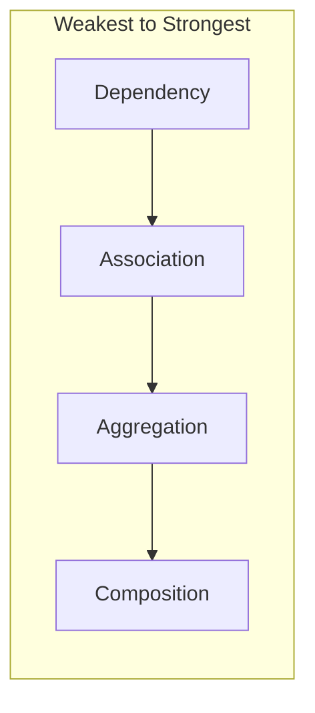
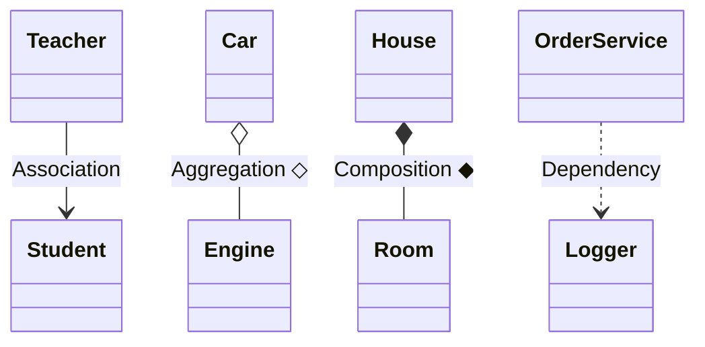

# Object Relationships — Association, Aggregation, Composition, Dependency

> **Creational/structural links** between classes — interview + UML whiteboard ke liye.  
> Har relation ka **alag runnable code** [`C++ Code/`](./C%20%2B%2B%20Code/) mein.

---

## Table of Contents

1. [Quick Comparison](#1-quick-comparison)
2. [Association](#2-association)
3. [Aggregation](#3-aggregation)
4. [Composition](#4-composition)
5. [Dependency](#5-dependency)
6. [Inheritance vs Has-A Family](#6-inheritance-vs-has-a-family)
7. [UML Symbols (Mermaid)](#7-uml-symbols-mermaid)
8. [C++ Implementation Cheat Sheet](#8-c-implementation-cheat-sheet)
9. [Interview Question Bank](#9-interview-question-bank)
10. [Build & Run](#10-build--run)

---

## 1. Quick Comparison

| Relationship | Hindi | Ownership | Lifetime | Strength | UML | C++ hint |
| ------------ | ----- | --------- | -------- | -------- | --- | -------- |
| **Dependency** | Temporary use | ❌ | Method-scope | Weakest | `..>` dashed | Method param / local var |
| **Association** | Jaanta / use karta | ❌ | Independent | Weak | `-->` | Field pointer ref, no delete |
| **Aggregation** | Weak has-a | ❌ (shared) | Part **can** outlive whole | Medium | `o--` ◇ | `T*` / `shared_ptr`, no delete in dtor |
| **Composition** | Strong has-a | ✅ Whole owns part | Part **dies with** whole | Strongest | `*--` ◆ | Member object / `unique_ptr` in ctor |



**Yaad rakho:** Ownership badhti hai → Composition sabse strong.

---

## 2. Association

### Definition

Do classes **ek doosre ko use** karti hain, lekin **koi ownership nahi** — dono **independently** exist kar sakti hain.

### Real-world example

- **Teacher** & **Student** — teacher padhata hai, student graduate ho kar chala jata hai; teacher replace ho sakta hai.
- Doctor treats **Patient** — doctor patient ka malik nahi.

### UML

```
Teacher  ----->  Student
         uses
```

Mermaid: `Teacher --> Student`

### C++ (is repo)

```cpp
class Teacher {
    vector<Student*> studentsEnrolled;  // knows, does not own
public:
    void enroll(Student* s);
    void teach() const;
};
```

- Teacher **delete nahi** karta students ko  
- Students `main` me alag bane — teacher ke bina bhi zinda  

**Code:** [`C++ Code/01_Association.cpp`](./C%20%2B%2B%20Code/01_Association.cpp)

### Interview line

*"Association = uses/knows relationship without ownership."*

---

## 3. Aggregation

### Definition

**Has-a (weak)** — whole **contains** part, lekin part **independently** exist kar sakta hai. Whole destroy ho to part **zaroori nahi** destroy ho.

### Real-world example

- **Car** & **Engine** — engine workshop me alag bhi reh sakta hai; car bech di, engine dusri car me lag sakta hai.
- **Department** & **Employee** — employee transfer ho sakta hai.

### UML

```
Car ◇──── Engine
    (hollow diamond on Car)
```

Mermaid: `Car o-- Engine`

### C++ (is repo)

```cpp
class Car {
    Engine* engine;  // injected from outside
public:
    Car(string m, Engine* e) : engine(e) {}
    ~Car() { /* do NOT delete engine */ }
};
```

**Proof in demo:** Car destroy ke baad bhi `Engine` chal raha hai.

**Code:** [`C++ Code/02_Aggregation.cpp`](./C%20%2B%2B%20Code/02_Aggregation.cpp)

### vs Composition

| Aggregation | Composition |
| ----------- | ----------- |
| `Engine*` shared | `Engine` member / `unique_ptr` |
| Car dies → engine may live | House dies → rooms die |
| Hollow ◇ | Filled ◆ |

---

## 4. Composition

### Definition

**Strong has-a** — part **whole ka integral hissa**; part **alone exist nahi** karta (design intent). Whole destroy → parts **automatic** destroy.

### Real-world example

- **House** & **Room** — room bina ghar ke concept fail (is design me).
- **Chair** & **Seat** — seat alag bikta nahi jab chair ke saath bana ho.

### UML

```
House ◆──── Room
   (filled diamond on House)
```

Mermaid: `House *-- Room`

### C++ (is repo)

```cpp
class House {
    Room livingRoom;                    // subobject — composition
    vector<unique_ptr<Room>> extraRooms; // owned children
public:
    House(...) : livingRoom("Living"), ... { }
};
```

- `Room` ctor **private** + `friend House` — sirf House bana sakta hai  
- `~House()` → rooms auto destroy  

**Code:** [`C++ Code/03_Composition.cpp`](./C%20%2B%2B%20Code/03_Composition.cpp)

### Modern C++ best practice

```cpp
class Chair {
    unique_ptr<Seat> seat;
public:
    Chair() : seat(make_unique<Seat>()) {}
};
```

RAII — no manual `delete`. See also [L4 composition.cpp](../../L4%20UML_Diagrams/composition.cpp).

### Interview line

*"Composition = lifetime of part bound to whole; prefer `unique_ptr` or member object."*

---

## 5. Dependency

### Definition

Ek class **temporarily** doosri ko use karti hai — usually **method parameter**, **local variable**, ya **return type**. **No long-term field** relationship.

### Real-world example

- **OrderService** uses **Logger** sirf `placeOrder()` ke andar log likhne ke liye.
- Class uses `iostream` for one function.

### UML

```
OrderService ..> Logger
         (dashed arrow)
```

Mermaid: `OrderService ..> Logger`

### C++ (is repo)

```cpp
class OrderService {
    string orderId;  // NO Logger member
public:
    void placeOrder(double amt, Logger& logger, PaymentGateway& gw) const;
};
```

**Code:** [`C++ Code/04_Dependency.cpp`](./C%20%2B%2B%20Code/04_Dependency.cpp)

### Dependency vs Association

| | Dependency | Association |
| - | ---------- | ----------- |
| **Duration** | Short — method call | Longer — ongoing link |
| **Storage** | Usually no field | Can have field (pointer/ref) |
| **UML** | Dashed `..>` | Solid `-->` |
| **Strength** | Weakest | Stronger than dependency |

---

## 6. Inheritance vs Has-A Family

| | Inheritance | Composition / Aggregation |
| - | ----------- | ------------------------- |
| **Relation** | **IS-A** | **HAS-A** |
| **UML** | Hollow △ | ◇ or ◆ |
| **C++** | `: public Base` | Member / pointer |
| **Example** | `Dog is Animal` | `Car has Engine` |

**LLD rule:** Composition over inheritance jab **has-a** ho, true subtype na ho.

More: [L3 Composition demo](../../L3%20OOPS_2/C++%20Code/05_Composition_Vs_Inheritance.cpp) · [L4 UML](../../L4%20UML_Diagrams/UML_DIAGRAMS_AND_NOTATION.md)

---

## 7. UML Symbols (Mermaid)



| Symbol | Name | Mermaid |
| ------ | ---- | ------- |
| `-->` | Association | `-->` |
| `◇──` | Aggregation | `o--` |
| `◆──` | Composition | `*--` |
| `··>` | Dependency | `..>` |
| `△──` | Inheritance | `<|--` |

---

## 8. C++ Implementation Cheat Sheet

```
DEPENDENCY     void f(Logger& log)           // param only
ASSOCIATION    Student* s;  // no delete in dtor
AGGREGATION    Engine* e;    // injected; dtor does NOT delete
COMPOSITION    Room room;    // member
               unique_ptr<Room> room;
```

**Delete rule of thumb:**

| Relation | Delete part in whole's destructor? |
| -------- | ---------------------------------- |
| Association | ❌ |
| Aggregation | ❌ |
| Composition | ✅ automatic (member / unique_ptr) |
| Dependency | N/A (don't hold pointer) |

---

## 9. Interview Question Bank

<details><summary><b>Association vs Aggregation?</b></summary>

Association = no ownership, uses/knows. Aggregation = has-a but part independent lifetime (weak ownership/share).</details>

<details><summary><b>Aggregation vs Composition?</b></summary>

Aggregation: part can outlive container (Engine without Car). Composition: part dies with container (Room with House).</details>

<details><summary><b>Dependency vs Association?</b></summary>

Dependency: temporary, method-level, dashed arrow. Association: longer-lived link, may store reference, solid arrow.</details>

<details><summary><b>C++ me composition kaise?</b></summary>

Member subobject or `unique_ptr` created in constructor; owner dtor cleans up.</details>

<details><summary><b>UML diamond filled vs hollow?</b></summary>

Filled ◆ = composition (strong). Hollow ◇ = aggregation (weak).</details>

---

## 10. Build & Run

```bash
cd " L1 Composition"
chmod +x compile.sh
./compile.sh

./bin/01_Association
./bin/02_Aggregation
./bin/03_Composition
./bin/04_Dependency
```

### Expected highlights

| Demo | Key output idea |
| ---- | ---------------- |
| Association | Students alive after teacher uses them |
| Aggregation | Engine runs after Car destroyed |
| Composition | All rooms destroyed when House scope ends |
| Dependency | OrderService has no Logger field |

---

## Related in repo

| Resource | Path |
| -------- | ---- |
| L2 OOP fundamentals | [`L2 OOPS_1/README.md`](../README.md) |
| L4 UML master | [`L4 UML_Diagrams/UML_DIAGRAMS_AND_NOTATION.md`](../../L4%20UML_Diagrams/UML_DIAGRAMS_AND_NOTATION.md) |
| L3 has-a vs is-a | [`L3 OOPS_2/C++ Code/05_Composition_Vs_Inheritance.cpp`](../../L3%20OOPS_2/C++%20Code/05_Composition_Vs_Inheritance.cpp) |
| unique_ptr composition | [`L4 UML_Diagrams/composition.cpp`](../../L4%20UML_Diagrams/composition.cpp) |
