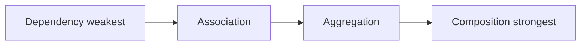

# Composition — Object Relationships (Association · Aggregation · Composition · Dependency)

> **Lesson L1** — **4 UML object relationships** (Has-A) with Hindi/English theory + runnable C++. Next: [`L2 OOPS_1`](../L2%20OOPS_1/) · [`L3 OOPS_2`](../L3%20OOPS_2/).

<p align="center">
  
  
  
</p>

---

## Start here

| Document | Content |
| -------- | ------- |
| **[`OBJECT_RELATIONSHIPS_GUIDE.md`](./OBJECT_RELATIONSHIPS_GUIDE.md)** | **Master guide** — comparison, UML, C++, interview |

---

## Course intro — Object relationships kya hain?

**Has-A family** — do classes ke beech **structural link** jab **inheritance (IS-A) sahi nahi**.

- **Association** — jaante ho, use karte ho, **malik nahi**
- **Aggregation** — weak has-a, **shared ownership**
- **Composition** — strong has-a, **part whole ke saath marta hai**
- **Dependency** — temporary, **method ke andar** use



---

## Code (`C++ Code/`) — summary

| File | Relationship | Example |
| ---- | ------------ | ------- |
| [`01_Association.cpp`](./C%20%2B%2B%20Code/01_Association.cpp) | **Association** | Teacher ↔ Student |
| [`02_Aggregation.cpp`](./C%20%2B%2B%20Code/02_Aggregation.cpp) | **Aggregation** | Car ◇ Engine |
| [`03_Composition.cpp`](./C%20%2B%2B%20Code/03_Composition.cpp) | **Composition** | House ◆ Room |
| [`04_Dependency.cpp`](./C%20%2B%2B%20Code/04_Dependency.cpp) | **Dependency** | OrderService → Logger |

```bash
cd " L1 Composition"
chmod +x compile.sh
./compile.sh
./bin/02_Aggregation
```

---

## Quick memory table

| | Ownership? | Lifetime |
| - | ----------- | -------- |
| Dependency | ❌ | Method only |
| Association | ❌ | Independent |
| Aggregation | Weak | Part may outlive whole |
| Composition | Strong ✅ | Part dies with whole |

---

## Demo 01 — Association (`01_Association.cpp`)

| | |
| ----- | ----- |
| **UML** | Association |
| **Example** | Teacher ↔ Student |
| **Detail** | No ownership, independent lifetimes |
| **Guide section** | [`OBJECT_RELATIONSHIPS_GUIDE`](./OBJECT_RELATIONSHIPS_GUIDE.md#2-association) |
| **Revision note** | [`notes/01_Association.md`](./notes/01_Association.md) |
| **Run** | `./bin/01_Association` |

### Concept (Hindi/English)

Teacher aur Student **associated** hain — teacher padhata hai lekin student ka **owner nahi**. Dono alag-alag ban sakte hain, teacher change ho sakta hai, student graduate ho kar chala jata hai.

### C++ implementation hint

```cpp
vector<Student*> studentsEnrolled;  // knows, does NOT own
// Teacher destructor: do NOT delete students
```

### Interview questions — Association

- Association me ownership kyun nahi hoti?
- Association vs Dependency — field vs parameter?
- Bidirectional association kaise model karte ho?

```bash
./bin/01_Association
```

---

## Demo 02 — Aggregation (`02_Aggregation.cpp`)

| | |
| ----- | ----- |
| **UML** | Aggregation ◇ |
| **Example** | Car ◇ Engine |
| **Detail** | Weak has-a; part may outlive whole |
| **Guide section** | [`OBJECT_RELATIONSHIPS_GUIDE`](./OBJECT_RELATIONSHIPS_GUIDE.md#3-aggregation) |
| **Revision note** | [`notes/02_Aggregation.md`](./notes/02_Aggregation.md) |
| **Run** | `./bin/02_Aggregation` |

### Concept (Hindi/English)

Car me Engine **aggregated** hai — Car engine ko use karti hai lekin Engine **independently** exist kar sakta hai. Garage me engine Car ke bina bhi reh sakta hai.

### C++ implementation hint

```cpp
Engine* engine;  // injected, Car dtor does NOT delete
// Engine created outside, may outlive Car
```

### Interview questions — Aggregation

- Aggregation UML me hollow diamond kyun?
- Aggregation vs Composition real example?
- shared_ptr aggregation me safe hai?

```bash
./bin/02_Aggregation
```

---

## Demo 03 — Composition (`03_Composition.cpp`)

| | |
| ----- | ----- |
| **UML** | Composition ◆ |
| **Example** | House ◆ Room |
| **Detail** | Strong has-a; part dies with whole |
| **Guide section** | [`OBJECT_RELATIONSHIPS_GUIDE`](./OBJECT_RELATIONSHIPS_GUIDE.md#4-composition) |
| **Revision note** | [`notes/03_Composition_Strong_HasA.md`](./notes/03_Composition_Strong_HasA.md) |
| **Run** | `./bin/03_Composition` |

### Concept (Hindi/English)

House me Room **composed** hai — Room bina House ke exist nahi karta (is design me). House destroy → Room bhi destroy. **Strongest ownership**.

### C++ implementation hint

```cpp
Room livingRoom;  // member object — created/destroyed with House
// OR unique_ptr<Room> owned in ctor
```

### Interview questions — Composition

- Composition me part parent ke bina kyun nahi rehta?
- unique_ptr vs member object composition?
- House-Room vs Car-Engine — kaunsa composition?

```bash
./bin/03_Composition
```

---

## Demo 04 — Dependency (`04_Dependency.cpp`)

| | |
| ----- | ----- |
| **UML** | Dependency ..> |
| **Example** | OrderService → Logger |
| **Detail** | Temporary use, method scope |
| **Guide section** | [`OBJECT_RELATIONSHIPS_GUIDE`](./OBJECT_RELATIONSHIPS_GUIDE.md#5-dependency) |
| **Revision note** | [`notes/04_Dependency.md`](./notes/04_Dependency.md) |
| **Run** | `./bin/04_Dependency` |

### Concept (Hindi/English)

OrderService Logger par **depend** karti hai — Logger sirf method call ke dauran use hota hai, field me store nahi. Sabse **weak** link.

### C++ implementation hint

```cpp
void processOrder(Logger& log) { log.info("..."); }  // param only
```

### Interview questions — Dependency

- Dependency dashed arrow ka matlab?
- Dependency injection se kya faida?
- Dependency vs Association — kab upgrade karte ho?

```bash
./bin/04_Dependency
```

---

## Learning path

```
L2 OOPS_1 — C++ Code/01–09 (class, pillars)
        ↓
Composition/ (this folder) — Association → Aggregation → Composition → Dependency
        ↓
L2 C++ Code/10–19 (memory, RAII, smart ptr)
        ↓
L3 — 05_Composition_Vs_Inheritance, inheritance
        ↓
L4 UML — arrows on diagrams
```

---

## OBJECT_RELATIONSHIPS_GUIDE.md — section map

| # | Section | Kya milega |
| - | ------- | ---------- |
| 1 | 1. Quick Comparison | Sab relations ek table me |
| 2 | 2. Association | Teacher-Student, no ownership |
| 3 | 3. Aggregation | Car-Engine, hollow diamond |
| 4 | 4. Composition | House-Room, filled diamond |
| 5 | 5. Dependency | OrderService-Logger, dashed |
| 6 | 6. Inheritance vs Has-A | IS-A vs HAS-A decision tree |
| 7 | 7. UML Symbols | Mermaid diagrams |
| 8 | 8. C++ Cheat Sheet | Pointer vs member vs param |
| 9 | 9. Interview Question Bank | 50+ questions |
| 10 | 10. Build & Run | compile.sh usage |

**Full guide:** [`OBJECT_RELATIONSHIPS_GUIDE.md`](./OBJECT_RELATIONSHIPS_GUIDE.md)

---

## notes/ — per-relationship revision

| File | Content |
| ---- | ------- |
| [`01_Association.md`](./notes/01_Association.md) | Association one-pager |
| [`02_Aggregation.md`](./notes/02_Aggregation.md) | Aggregation ◇ hollow diamond |
| [`03_Composition_Strong_HasA.md`](./notes/03_Composition_Strong_HasA.md) | Composition ◆ strong has-a |
| [`04_Dependency.md`](./notes/04_Dependency.md) | Dependency ..> temporary |

---

## UML symbol cheat sheet

| Relationship | UML line | Arrow | C++ pattern |
| ------------ | -------- | ----- | ----------- |
| Dependency | dashed | ..> | method parameter |
| Association | solid | --> | field pointer/ref, no delete |
| Aggregation | solid + ◇ | o-- | shared_ptr / raw, no delete in dtor |
| Composition | solid + ◆ | *-- | member object / unique_ptr |

---

## Composition vs Inheritance — preview (L3)

| | Composition (Has-A) | Inheritance (Is-A) |
| - | ------------------- | ------------------ |
| Relationship | Whole has part | Child is parent type |
| Reuse | Delegate to member | Override / extend |
| Flexibility | Swap parts at runtime | Fixed hierarchy |
| L3 file | — | [`05_Composition_Vs_Inheritance.cpp`](../../L3%20OOPS_2/C++%20Code/05_Composition_Vs_Inheritance.cpp) |

---

## Build & run (detailed)

```bash
cd " L1 Composition"
chmod +x compile.sh
./compile.sh

# Run all four in order
./bin/01_Association
./bin/02_Aggregation
./bin/03_Composition
./bin/04_Dependency
```

---

## Interview prep — relationship decision tree

```
Q: Kya B, A ke bina zinda reh sakta hai?
   YES → Aggregation ya Association
   NO  → Composition

Q: Sirf ek method me use?
   YES → Dependency

Q: Field me store + delete nahi?
   YES → Association ya Aggregation

Q: Whole destroy → part destroy?
   YES → Composition
```

### Practice scenario 1

- **University** and **Department** → likely **Aggregation** — Dept alag exist kar sakta hai

### Practice scenario 2

- **Document** and **Paragraph** → likely **Composition** — Paragraph doc ke bina nahi

### Practice scenario 3

- **Client** and **Server** → likely **Association** — Dono independent services

### Practice scenario 4

- **Parser** and **Tokenizer** → likely **Dependency** — Tokenizer sirf parse() me

### Practice scenario 5 — Person & Address

- **Person** and **Address** → **Association** — Person address use karta hai; address dusre person ko bhi belong kar sakta hai

### Practice scenario 6 — Team & Player

- **Team** and **Player** → **Aggregation** — Player team change kar sakta hai; career team se independent

### Practice scenario 7 — Computer & CPU

- **Computer** and **CPU** → **Composition** (design choice) ya **Aggregation** — CPU swap ho sakta hai to Aggregation; soldered to board → Composition

### Practice scenario 8 — ReportGenerator & Formatter

- **ReportGenerator** and **Formatter** → **Dependency** — Formatter sirf `generate()` call me inject

### Practice scenario 9 — Library & Book

- **Library** and **Book** → **Aggregation** — Book library se nikal kar dusri library ja sakti hai

### Practice scenario 10 — Page & Line

- **Page** and **Line** → **Composition** — Line page ke bina meaningful nahi (is model me)

### Practice scenario 11 — ATM & BankAccount

- **ATM** and **BankAccount** → **Association** — ATM account access karta hai, owner nahi

### Practice scenario 12 — ShoppingCart & TaxCalculator

- **ShoppingCart** and **TaxCalculator** → **Dependency** — Tax logic method parameter / interface inject

### Practice scenario 13 — Company & Employee

- **Company** and **Employee** → **Aggregation** — Employee company chhod sakta hai

### Practice scenario 14 — Tree & Node

- **Tree** and **Node** → **Composition** — Node tree delete hone par destroy (owned children)

### Practice scenario 15 — Driver & Car

- **Driver** and **Car** → **Association** — Driver car chalata hai, car driver ki property nahi

### Practice scenario 16 — EmailService & SmtpClient

- **EmailService** and **SmtpClient** → **Dependency** ya **Composition** — long-lived member → Composition; per-send param → Dependency

### Practice scenario 17 — Playlist & Song

- **Playlist** and **Song** → **Aggregation** — Same song multiple playlists me; song file independent

### Practice scenario 18 — Stack & StackFrame

- **Stack** and **StackFrame** → **Composition** — Frame stack pop par destroy

### Practice scenario 19 — Doctor & Patient

- **Doctor** and **Patient** → **Association** — Treatment relationship, no ownership

### Practice scenario 20 — WebApp & DatabaseConnection

- **WebApp** and **DatabaseConnection** → **Dependency** (per request) ya **Composition** (pool owned by app)

### Practice scenario 21 — Folder & File (Unix)

- **Folder** and **File** → **Aggregation** — File folder move/delete se alag survive kar sakti hai

### Practice scenario 22 — Human & Heart

- **Human** and **Heart** → **Composition** — Heart body ke saath; strong biological whole-part

### Practice scenario 23 — Compiler & Lexer

- **Compiler** and **Lexer** → **Composition** — Lexer compiler ka owned subsystem

### Practice scenario 24 — Controller & View (MVC)

- **Controller** and **View** → **Association** — View controller se independent update ho sakti hai

### Practice scenario 25 — Game & Level

- **Game** and **Level** → **Composition** — Levels game package ke andar owned assets

### Practice scenario 26 — Restaurant & Waiter

- **Restaurant** and **Waiter** → **Aggregation** — Waiter job change kar sakta hai

### Practice scenario 27 — PDF & PageObject

- **PDF** and **PageObject** → **Composition** — Page PDF structure ka inseparable part

### Practice scenario 28 — Function & LocalVariable

- **Function** and **LocalVariable** → **Composition** — Scope-bound lifetime

### Practice scenario 29 — SensorNetwork & Sensor

- **SensorNetwork** and **Sensor** → **Aggregation** — Sensor replace / reuse across networks

### Practice scenario 30 — MutexGuard & Lockable

- **MutexGuard** and **Lockable** → **Dependency** — RAII guard temporary use (see L2 `13_RAII.cpp`)

### Practice scenario 31 — Parent & Child (domain)

- **Parent** and **Child** (people) → **Association** — NOT Composition; child outlives parent legally/socially

### Practice scenario 32 — Widget & Tooltip

- **Widget** and **Tooltip** → **Dependency** — Tooltip show() ke dauran create/destroy

### Practice scenario 33 — Fleet & Vehicle

- **Fleet** and **Vehicle** → **Aggregation** — Vehicle fleet se retire ho kar bhi exist

### Practice scenario 34 — String & CharBuffer (bad design)

- **String** owning raw `char*` without delete → **Association bug** — fix with Composition (`std::string` member)

### Practice scenario 35 — ServiceLocator & Logger

- **ServiceLocator** and **Logger** → **Association** — Shared logger instance, no exclusive ownership

### Practice scenario 36 — HTTP Request & Headers map

- **Request** and **Headers** → **Composition** — Headers request ke saath allocate/free

### Practice scenario 37 — Course & Student enrollment

- **Course** and **Student** → **Association** — Many-to-many, independent lifetimes

### Practice scenario 38 — Factory & Product (runtime)

- **Factory** creates **Product** → **Composition** if factory owns returned objects pool; else **Association**

### Practice scenario 39 — Observer & Subject

- **Subject** and **Observer** → **Association** — Observers register/unregister independently

### Practice scenario 40 — Debate trick — Circle & Point

- **Circle** and **Center Point** → usually **Composition** — Center point circle ke bina meaningless as owned center

---

⬅️ [L2 README](../README.md) · ➡️ [L3 OOPS_2](../../L3%20OOPS_2/README.md)

---

## Appendix — extra interview drills

### Drill 1 — Whiteboard

- **Task:** Draw four arrows: ..> --> o-- *-- with one example each
- **Done when:** You can explain in Hindi + English without notes

### Drill 2 — Code review

- **Task:** Spot composition vs aggregation in a GitHub class diagram
- **Done when:** You can explain in Hindi + English without notes

### Drill 3 — Refactor

- **Task:** Change Association field to Dependency if only used in one method
- **Done when:** You can explain in Hindi + English without notes

### Drill 4 — Memory

- **Task:** Explain why Composition destructor must not double-delete parts
- **Done when:** You can explain in Hindi + English without notes

### Drill 5 — UML L4

- **Task:** Cross-check with L4 UML_DIAGRAMS_AND_NOTATION.md
- **Done when:** You can explain in Hindi + English without notes

### Drill 6 — L3 bridge

- **Task:** After this folder, run L3 05_Composition_Vs_Inheritance
- **Done when:** You can explain in Hindi + English without notes

### Drill 7 — Smart ptr

- **Task:** When unique_ptr in composition beats raw member object
- **Done when:** You can explain in Hindi + English without notes

### Drill 8 — shared_ptr

- **Task:** Aggregation often uses shared_ptr — ref count semantics
- **Done when:** You can explain in Hindi + English without notes

### Drill 9 — Testing

- **Task:** Mock Logger via Dependency injection in unit tests
- **Done when:** You can explain in Hindi + English without notes

### Drill 10 — Lifetime

- **Task:** Document ownership in header comments for each field
- **Done when:** You can explain in Hindi + English without notes

---

## Glossary (Hindi / English)

| Term | Meaning |
| ---- | ------- |
| **Has-A** | Composition family — object contains or uses another |
| **Whole-Part** | Composition / Aggregation — whole and part roles |
| **Ownership** | Kaun delete karega — strongest in Composition |
| **Lifetime** | Kab object destroy hota hai — tied to owner in Composition |
| **UML diamond** | Hollow ◇ = Aggregation, Filled ◆ = Composition |
| **Dashed arrow** | Dependency — temporary, weakest link |
| **IS-A** | Inheritance — L3 topic, not this folder |
| **Delegate** | Whole forwards work to part — composition pattern |
