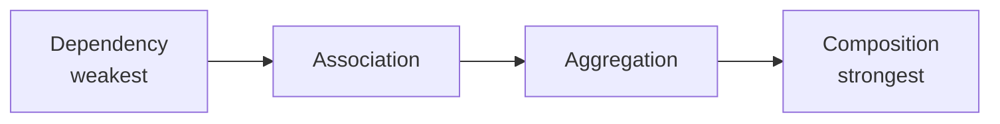
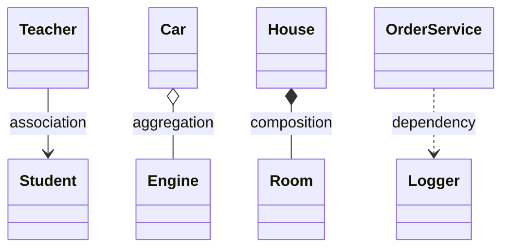

# Object Relationships — Association · Aggregation · Composition · Dependency

> **Lesson L1** — the four **"Has-A" object relationships** every LLD interview tests, with UML notation, ownership/lifetime rules, and runnable C++17 demos. These relationships are the vocabulary you use to describe *how classes connect* before you ever draw a class diagram (L4) or apply a pattern.

<p align="center">
  
  
  
</p>

**Next:** [`L2 OOPS_1`](../L2%20OOPS_1/) → [`L3 OOPS_2`](../L3%20OOPS_2/) (composition vs inheritance) → [`L4 UML_Diagrams`](../L4%20UML_Diagrams/).

---

## Table of Contents

1. [Why Object Relationships Matter](#1-why-object-relationships-matter)
2. [The Four Relationships at a Glance](#2-the-four-relationships-at-a-glance)
3. [Ownership & Lifetime — the Core Idea](#3-ownership--lifetime--the-core-idea)
4. [UML Symbol Cheat Sheet](#4-uml-symbol-cheat-sheet)
5. [Demo 01 — Association](#5-demo-01--association)
6. [Demo 02 — Aggregation](#6-demo-02--aggregation)
7. [Demo 03 — Composition](#7-demo-03--composition)
8. [Demo 04 — Dependency](#8-demo-04--dependency)
9. [C++ Implementation Guide (Pointer vs Member vs Param)](#9-c-implementation-guide-pointer-vs-member-vs-param)
10. [Decision Tree — Which Relationship?](#10-decision-tree--which-relationship)
11. [Composition vs Inheritance (Preview of L3)](#11-composition-vs-inheritance-preview-of-l3)
12. [Build & Run](#12-build--run)
13. [Practice Scenario Bank](#13-practice-scenario-bank)
14. [Interview Drills](#14-interview-drills)
15. [Glossary & Summary](#15-glossary--summary)

---

## 1. Why Object Relationships Matter

In LLD you rarely build one class — you connect many. *How* you connect them decides:

| Decision | Consequence |
| -------- | ----------- |
| **Who owns whom** | Who is responsible for creating and destroying the object |
| **Lifetime coupling** | Whether the part dies when the whole dies |
| **Testability** | Loosely coupled collaborators are easy to mock |
| **Flexibility** | Swappable parts (composition) vs rigid hierarchies (inheritance) |

The golden rule: **prefer "Has-A" (these relationships) over "Is-A" (inheritance)** unless the subtype genuinely *is* the supertype. That single habit drives most good LLD designs (see [L3](../L3%20OOPS_2/) `05_Composition_Vs_Inheritance.cpp`).

---

## 2. The Four Relationships at a Glance



| Relationship | Strength | Meaning | Repo demo |
| ------------ | -------- | ------- | --------- |
| **Dependency** | Weakest | "...uses temporarily" — only inside a method | `OrderService → Logger` |
| **Association** | Weak | "...knows / uses" — holds a reference, **no ownership** | `Teacher ↔ Student` |
| **Aggregation** | Medium | "...has a" (weak) — **shared ownership**, part can outlive whole | `Car ◇ Engine` |
| **Composition** | Strongest | "...is made of" — **exclusive ownership**, part dies with whole | `House ◆ Room` |

---

## 3. Ownership & Lifetime — the Core Idea

Every relationship answers two questions: **who deletes it?** and **when does it die?**

| | Owns the part? | Part's lifetime | Stored as |
| --- | -------------- | --------------- | --------- |
| **Dependency** | ❌ No | Only during the method call | Method parameter |
| **Association** | ❌ No | Independent of the whole | Field reference/pointer (never deleted by holder) |
| **Aggregation** | ⚠️ Shared | Part may outlive the whole | Pointer / `shared_ptr` (not deleted in destructor) |
| **Composition** | ✅ Exclusive | Part dies with the whole | Member object / `unique_ptr` |

> **Mental model:** *Dependency* borrows a tool for one job. *Association* keeps a contact in its phonebook. *Aggregation* employs a worker who can quit. *Composition* grows an organ that dies with the body.

---

## 4. UML Symbol Cheat Sheet

| Relationship | UML line | Arrow | Diamond | C++ pattern |
| ------------ | -------- | ----- | ------- | ----------- |
| **Dependency** | dashed | `..>` | — | method parameter |
| **Association** | solid | `-->` | — | field pointer/reference, no `delete` |
| **Aggregation** | solid | `o--` | hollow ◇ | `shared_ptr` / raw pointer, no `delete` in destructor |
| **Composition** | solid | `*--` | filled ◆ | member object / `unique_ptr` owned in constructor |



---

## 5. Demo 01 — Association

| | |
| ----- | ----- |
| **Example** | `Teacher ↔ Student` |
| **Rule** | The teacher *knows* students but does **not own** them; lifetimes are independent |
| **File** | [`01_Association.cpp`](./C%20%2B%2B%20Code/01_Association.cpp) · note [`notes/01_Association.md`](./notes/01_Association.md) |

**Concept:** A `Teacher` enrolls `Student`s and teaches them, but creating or destroying a teacher must not affect the students. They are separate entities that simply collaborate.

```cpp
class Teacher {
    vector<Student*> students;     // knows them, does NOT own them
public:
    void enroll(Student* s) { students.push_back(s); }
    void teach() const { /* iterate and use students */ }
    // destructor does NOT delete students — they live independently
};
```

**Key:** No `delete` in the teacher's destructor. The students outlive the teacher's scope.

**Interview questions:** Why no ownership in association? Association vs Dependency (field vs parameter)? How do you model a bidirectional association without a memory-leak/cycle?

---

## 6. Demo 02 — Aggregation

| | |
| ----- | ----- |
| **Example** | `Car ◇ Engine` |
| **Rule** | Weak "has-a"; the `Engine` exists **outside** the `Car` and can outlive it |
| **File** | [`02_Aggregation.cpp`](./C%20%2B%2B%20Code/02_Aggregation.cpp) · note [`notes/02_Aggregation.md`](./notes/02_Aggregation.md) |

**Concept:** An `Engine` is created independently and *injected* into a `Car`. When the `Car` is destroyed, the `Engine` keeps living (it could go into another car).

```cpp
class Car {
    Engine* engine;                // injected — external lifetime
public:
    Car(Engine* e) : engine(e) {}
    void drive() const { engine->start(); }
    // destructor does NOT delete engine
};

int main() {
    Engine v8("V8-Petrol");        // Engine exists OUTSIDE the car
    { Car c(&v8); c.drive(); }      // Car destroyed here...
    // ...v8 is still alive
}
```

**Key:** The hollow diamond ◇ means shared/weak ownership — the part survives the whole.

**Interview questions:** Why a hollow diamond in UML? A real aggregation vs composition example? Is `shared_ptr` the right fit for aggregation?

---

## 7. Demo 03 — Composition

| | |
| ----- | ----- |
| **Example** | `House ◆ Room` |
| **Rule** | Strong "has-a"; a `Room` is created and destroyed **with** the `House` |
| **File** | [`03_Composition.cpp`](./C%20%2B%2B%20Code/03_Composition.cpp) · note [`notes/03_Composition_Strong_HasA.md`](./notes/03_Composition_Strong_HasA.md) |

**Concept:** Rooms have no independent existence in this design. The `House` owns them exclusively — when the house is gone, so are the rooms. The demo shows both member-object and `unique_ptr` styles.

```cpp
class House {
    vector<unique_ptr<Room>> extraRooms;   // owned exclusively
public:
    House() {
        extraRooms.push_back(unique_ptr<Room>(new Room("Kitchen")));
    }
    // no manual cleanup needed — unique_ptr destroys rooms with the house
};
```

**Key:** The filled diamond ◆ means exclusive ownership. `unique_ptr` makes the "part dies with whole" rule automatic and exception-safe.

**Interview questions:** Why can't the part exist without its parent? `unique_ptr` member vs raw member object? Is `House–Room` always composition, or a design choice?

---

## 8. Demo 04 — Dependency

| | |
| ----- | ----- |
| **Example** | `OrderService → Logger`, `PaymentGateway` |
| **Rule** | Temporary use — the collaborator appears only as a **method parameter** |
| **File** | [`04_Dependency.cpp`](./C%20%2B%2B%20Code/04_Dependency.cpp) · note [`notes/04_Dependency.md`](./notes/04_Dependency.md) |

**Concept:** `OrderService` does not *have* a `Logger` — it receives one (and a `PaymentGateway`) only for the duration of `placeOrder()`. This is the weakest, most loosely coupled link.

```cpp
class OrderService {
public:
    // Logger & gateway are NOT fields — passed in per call (dependency)
    void placeOrder(double amount, Logger& logger, PaymentGateway& gateway) const {
        gateway.charge(amount);
        logger.log("Order placed");
    }
};
```

**Key:** No member field. The dashed arrow `..>` signals "uses temporarily." This is exactly how dependency injection keeps code testable — pass a mock `Logger` in tests.

**Interview questions:** What does the dashed arrow mean? What does DI buy you? When do you "upgrade" a dependency to an association?

---

## 9. C++ Implementation Guide (Pointer vs Member vs Param)

| Relationship | C++ representation | Destructor behavior |
| ------------ | ------------------ | ------------------- |
| **Dependency** | Method parameter (`f(Logger&)`) | N/A — never stored |
| **Association** | Field pointer/reference (`Student*`) | **Do not** delete |
| **Aggregation** | Pointer / `shared_ptr` (external lifetime) | **Do not** delete (or let `shared_ptr` ref-count) |
| **Composition** | Member object or `unique_ptr` | Destroyed **automatically** with the owner |

**Rules of thumb**
- If your destructor `delete`s a field, that field is almost certainly **composition**.
- If a field is set from the outside and you must *not* delete it, that's **association/aggregation**.
- If a collaborator never becomes a field at all, it's a **dependency**.

---

## 10. Decision Tree — Which Relationship?

```
Is the collaborator used only inside one method (not stored)?
   YES → Dependency

Stored as a field?
   ├─ Does the holder create AND destroy it (dies together)?
   │     YES → Composition
   │     NO  → ↓
   └─ Can the part exist independently / outlive the holder?
         Shared/owned-elsewhere → Aggregation
         Just "knows" it, no ownership → Association
```

Worked examples:

| Pair | Relationship | Why |
| ---- | ------------ | --- |
| University ↔ Department | Aggregation | A department can be reorganized but exists on its own |
| Document ↔ Paragraph | Composition | A paragraph has no meaning without its document |
| Client ↔ Server | Association | Both are independent, long-lived services |
| Parser ↔ Tokenizer | Dependency | Tokenizer used only during `parse()` |

---

## 11. Composition vs Inheritance (Preview of L3)

| | Composition (Has-A) | Inheritance (Is-A) |
| - | ------------------- | ------------------ |
| Relationship | Whole **has** a part | Child **is** a kind of parent |
| Reuse | Delegate to the member | Override / extend |
| Flexibility | Swap parts at runtime | Fixed hierarchy at compile time |
| Coupling | Loose | Tight (subclass knows base internals) |
| L3 file | — | [`05_Composition_Vs_Inheritance.cpp`](../L3%20OOPS_2/) |

> **Interview line:** "Favor composition over inheritance — it keeps behavior swappable and avoids fragile base classes."

---

## 12. Build & Run

```bash
cd " L1 Composition"
chmod +x compile.sh
./compile.sh                 # builds all four into bin/

./bin/01_Association
./bin/02_Aggregation
./bin/03_Composition
./bin/04_Dependency
```

The `compile.sh` builds each `C++ Code/*.cpp` with `-std=c++17 -Wall -Wextra -pedantic` into `bin/`.

---

## 13. Practice Scenario Bank

Classify each pair, then justify by ownership + lifetime. (Many are *design choices* — defend your reasoning, that's what interviewers want.)

| # | Pair | Most common answer | Reasoning |
| - | ---- | ------------------ | --------- |
| 1 | Person ↔ Address | Association | An address can belong to multiple people |
| 2 | Team ↔ Player | Aggregation | A player can transfer teams |
| 3 | Computer ↔ CPU | Composition / Aggregation | Soldered → composition; swappable → aggregation |
| 4 | ReportGenerator ↔ Formatter | Dependency | Formatter injected only into `generate()` |
| 5 | Library ↔ Book | Aggregation | A book can move between libraries |
| 6 | Page ↔ Line | Composition | A line is meaningless without its page |
| 7 | ATM ↔ BankAccount | Association | The ATM accesses, never owns, the account |
| 8 | Company ↔ Employee | Aggregation | An employee can leave the company |
| 9 | Tree ↔ Node | Composition | Owned children are destroyed with the tree |
| 10 | Driver ↔ Car | Association | The driver uses the car, doesn't own it |
| 11 | Playlist ↔ Song | Aggregation | The same song appears in many playlists |
| 12 | Stack ↔ StackFrame | Composition | A frame dies when popped |
| 13 | Subject ↔ Observer | Association | Observers register/unregister independently |
| 14 | Human ↔ Heart | Composition | A strong biological whole-part |
| 15 | Fleet ↔ Vehicle | Aggregation | A vehicle survives retirement from the fleet |
| 16 | Widget ↔ Tooltip | Dependency | Tooltip created/destroyed during `show()` |
| 17 | HTTP Request ↔ Headers | Composition | Headers allocated/freed with the request |
| 18 | Course ↔ Student | Association | Many-to-many, independent lifetimes |
| 19 | Parent ↔ Child (people) | Association | A child outlives the parent — *not* composition |
| 20 | MutexGuard ↔ Lockable | Dependency | RAII guard borrows the lock briefly (see L2 `13_RAII.cpp`) |

**Trap to remember:** "Whole–part" wording tempts you toward composition, but always check lifetime. *Parent–Child* people are an **association**, not composition.

---

## 14. Interview Drills

| Drill | Task | Done when |
| ----- | ---- | --------- |
| **Whiteboard** | Draw `..>` `-->` `o--` `*--` with one example each | You can explain each from memory |
| **Code review** | Spot composition vs aggregation in a class diagram | You justify by destructor behavior |
| **Refactor** | Convert an association field to a dependency when used in one method | Field removed, passed as parameter |
| **Memory** | Explain why a composition destructor must not double-delete | You describe ownership uniqueness |
| **Smart ptr** | When `unique_ptr` composition beats a raw member object | You cite polymorphism / optional parts |
| **Aggregation** | Why aggregation often uses `shared_ptr` | You explain reference counting |
| **Testing** | Mock a `Logger` via dependency injection | Test passes without a real logger |

---

## 15. Glossary & Summary

| Term | Meaning |
| ---- | ------- |
| **Has-A** | The relationship family in this lesson — an object contains or uses another |
| **Is-A** | Inheritance (an L3 topic) — a subtype relationship |
| **Whole–Part** | The roles in composition/aggregation |
| **Ownership** | Who is responsible for destroying the object — strongest in composition |
| **Lifetime** | When an object is destroyed — tied to the owner in composition |
| **Hollow diamond ◇** | Aggregation (weak/shared ownership) |
| **Filled diamond ◆** | Composition (exclusive ownership) |
| **Dashed arrow `..>`** | Dependency — temporary, weakest link |
| **Delegate** | The whole forwards work to its part |

| Aspect | Detail |
| ------ | ------ |
| **Lesson** | L1 — object relationships (Has-A) |
| **Relationships** | Dependency → Association → Aggregation → Composition (weak → strong) |
| **Core question** | Who owns it, and when does it die? |
| **Demos** | `Teacher–Student`, `Car–Engine`, `House–Room`, `OrderService–Logger` |
| **Master guide** | [`OBJECT_RELATIONSHIPS_GUIDE.md`](./OBJECT_RELATIONSHIPS_GUIDE.md) — comparison table, UML, 50+ Q bank |

> **Remember:** Sort every relationship by **ownership strength** — *Dependency borrows, Association knows, Aggregation shares, Composition owns.* Get ownership right and lifetimes, destructors, and testability fall into place. 🔗

⬅️ [Repo home](../README.md) · ➡️ [L2 OOPS_1](../L2%20OOPS_1/README.md) · [L3 OOPS_2](../L3%20OOPS_2/README.md)
