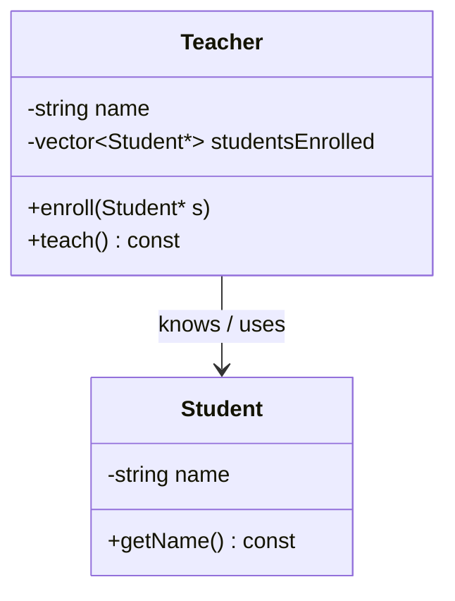
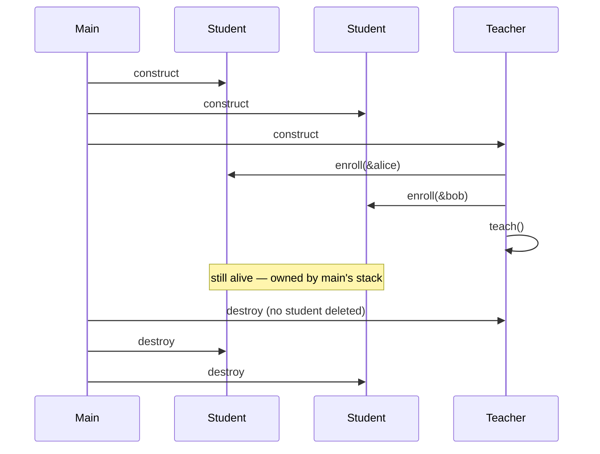

# Association — Object Relationships (1 of 4)

> **Runnable code:** [`01_Association.cpp`](../C++%20Code/01_Association.cpp)
> **Related guides:** [`02_Aggregation.md`](02_Aggregation.md) · [`03_Composition_Strong_HasA.md`](03_Composition_Strong_HasA.md) · [`04_Dependency.md`](04_Dependency.md)
> **Master comparison:** [`OBJECT_RELATIONSHIPS_GUIDE.md`](../OBJECT_RELATIONSHIPS_GUIDE.md)

---

## Contents

1. [Overview](#1-overview)
2. [The Theory in Depth](#2-the-theory-in-depth)
3. [Formal Characteristics](#3-formal-characteristics)
4. [UML Notation](#4-uml-notation)
5. [When to Use Association](#5-when-to-use-association)
6. [When NOT to Use Association](#6-when-not-to-use-association)
7. [Code Walkthrough — Teacher & Student](#7-code-walkthrough--teacher--student)
8. [C++ Implementation Patterns](#8-c-implementation-patterns)
9. [Multiplicity & Navigability](#9-multiplicity--navigability)
10. [Lifetime & Ownership Semantics](#10-lifetime--ownership-semantics)
11. [Association vs the Other Three Relationships](#11-association-vs-the-other-three-relationships)
12. [Design Trade-offs](#12-design-trade-offs)
13. [Real-World Examples](#13-real-world-examples)
14. [Common Pitfalls](#14-common-pitfalls)
15. [Interview Preparation](#15-interview-preparation)
16. [Summary & Cheat Sheet](#16-summary--cheat-sheet)

---

## 1. Overview

**Association** is a structural relationship in which one class holds a persistent, *non-owning* link to another class. The two objects **collaborate** over the long term, but neither controls the other's creation or destruction — their lifetimes are **independent**.

The canonical phrasing is *"knows-a"* or *"uses-a (persistently)"*. A `Teacher` **knows** the `Student`s enrolled in a course; the teacher references them across many method calls, but the teacher neither creates nor destroys those students.

In the strength spectrum of object relationships, association sits in the middle:

```
weaker  ──────────────────────────────────────────────►  stronger
 Dependency   →   Association   →   Aggregation   →   Composition
 (temporary)      (knows,             (weak has-a,       (strong has-a,
                   no ownership)        shared part)       owned part)
```

Association is stronger than **dependency** (which is only a momentary, method-scoped collaboration) but weaker than **aggregation/composition** (which introduce a whole–part structure and, in composition, ownership).

---

## 2. The Theory in Depth

### 2.1 What "association" really models

An association records that two types have a **standing relationship** in the domain. It answers the question: *"Does object A need a durable reference to object B in order to do its job?"* If yes, and A does not own B, the relationship is an association.

Three properties define it precisely:

1. **Structural** — the link is represented by a member (a pointer, reference, or a container of them), so it survives across method calls. This is what separates it from a dependency, where the collaborator only appears inside a single method.
2. **Non-owning** — the referencing object never destroys the referenced object. It merely observes and uses it. Ownership (the responsibility to call `delete` or to embed the object) belongs to someone else.
3. **Independent lifetimes** — either object can be destroyed without automatically destroying the other. In practice this creates a *lifetime contract*: the referenced object must remain alive for as long as the referencing object uses it.

### 2.2 Why the distinction matters

The relationship type is not academic pedantry — it dictates **who is responsible for memory and lifetime**. Mislabeling an association as composition leads to double-frees (deleting an object someone else owns); mislabeling composition as association leads to leaks (nobody frees the part). Getting the relationship right is how you reason about ownership before you write a destructor.

### 2.3 Directionality

Associations are commonly **unidirectional** — only one side holds a reference (in the demo, `Teacher` points at `Student`, but `Student` does not point back). They can also be **bidirectional**, where both sides reference each other. Bidirectional associations are more expressive but introduce a consistency burden: both sides must be updated together, or the object graph becomes inconsistent.

### 2.4 Association and the "prefer composition over inheritance" principle

Association (and its has-a cousins) is the mechanism behind the design maxim *"favor composition over inheritance."* When two concepts collaborate but are not related by an *is-a* substitutability relationship, an association (or aggregation/composition) expresses that collaboration with far looser coupling than a class hierarchy would.

---

## 3. Formal Characteristics

| Characteristic | Association |
| -------------- | ----------- |
| Intent phrase | "knows-a" / "uses-a persistently" |
| Ownership | None — non-owning reference |
| Lifetime coupling | Independent |
| Stored as a member? | Yes (pointer, reference, or container) |
| Duration of link | Long-lived (across many calls) |
| UML symbol | Solid line with an open arrowhead: `──▶` |
| Diamond on either end? | No |
| Typical C++ representation | `T*`, `T&`, `std::vector<T*>`, `std::reference_wrapper<T>` |
| Coupling strength | Moderate |

**Mental model:**

```
┌─────────┐      knows       ┌─────────┐
│ Teacher │ ───────────────▶ │ Student │
└─────────┘                  └─────────┘
  references students;         exists independently,
  never deletes them           owned by whoever created it
```

---

## 4. UML Notation

### 4.1 Standard symbol

An association is drawn as a **solid line**. An open arrowhead shows navigability (the direction in which one object can reach the other). There is **no diamond** — the presence of a diamond would indicate aggregation (hollow) or composition (filled).

```
┌─────────┐                 ┌─────────┐
│ Teacher │ ──────────────▶ │ Student │
└─────────┘   studentsEnrolled *
```

### 4.2 UML element reference

| Element | Meaning in an association |
| ------- | ------------------------- |
| Solid line | A structural, persistent link |
| Open arrowhead | Navigability (Teacher can reach Student) |
| No diamond | Not a whole–part (aggregation/composition) relationship |
| Multiplicity (`1`, `*`, `0..1`, `1..*`) | How many objects participate on each end |
| Role name (`studentsEnrolled`) | The member/field name in code |

### 4.3 Mermaid class diagram



---

## 5. When to Use Association

Choose an association when **all** of the following hold:

1. **A durable link is needed.** Object A must remember object B beyond a single method call (otherwise use a *dependency*).
2. **A does not own B.** B's lifetime is managed elsewhere; A only observes and uses B.
3. **There is no whole–part semantics, or the whole–part is loose.** If "B is a part of A" is not a natural statement, association is more accurate than aggregation.
4. **Both objects can meaningfully exist on their own.** A course roster references students who exist in the university's records independently of any course.

### 5.1 Decision checklist

| Question | If **yes** |
| -------- | ---------- |
| Do I store the collaborator as a member? | Not a dependency → association or stronger |
| Will I ever `delete` it here? | If **no** → association/aggregation (not composition) |
| Is "B is part of A" a natural phrase? | If **no** → association (rather than aggregation) |
| Can B outlive A without a problem? | If **yes** → association fits |

### 5.2 Typical use cases

- **Registries and catalogs** that reference shared entities (a `Course` referencing `Student` records).
- **Observer lists** where a subject holds non-owning references to observers.
- **Peer collaborations** with no natural whole–part structure (a `Doctor` treating `Patient`s).
- **Cross-cutting links** in a domain graph (a `User` following other `User`s).

---

## 6. When NOT to Use Association

| Situation | Prefer instead | Reason |
| --------- | -------------- | ------ |
| Collaborator only needed inside one method | **Dependency** | No persistent member is required; keep coupling minimal |
| The referencing object should own and destroy the part | **Composition** | Association forbids ownership; use a member or `unique_ptr` |
| Clear whole–part where the part may be shared/reused | **Aggregation** | The hollow-diamond has-a captures the whole–part intent |
| The two types are related by substitutability (*is-a*) | **Inheritance** | Association models collaboration, not subtype polymorphism |

---

## 7. Code Walkthrough — Teacher & Student

From [`01_Association.cpp`](../C++%20Code/01_Association.cpp).

### 7.1 The referenced class is self-contained

```cpp
class Student {
    string name;
public:
    Student(string n) : name(n) {}
    string getName() const { return name; }
};
```

`Student` has no reference back to `Teacher`. This is a **unidirectional** association.

### 7.2 The referencing class holds a non-owning link

```cpp
class Teacher {
    string name;
    vector<Student*> studentsEnrolled;   // association: knows, does NOT own

public:
    Teacher(string n) : name(n) {}

    void enroll(Student* s) {            // stores an address, does not create
        studentsEnrolled.push_back(s);
    }

    void teach() const {                 // uses the associated students
        for (Student* s : studentsEnrolled)
            cout << s->getName() << " ";
    }
    // No destructor deletes the students — this is the defining signal.
};
```

The three tell-tale signs of association are all present: a **member** container of references, **no creation** of students inside `Teacher`, and **no destruction** of them in the destructor.

### 7.3 Lifetime proof in `main()`

```cpp
int main() {
    Student alice("Alice");   // created outside Teacher
    Student bob("Bob");

    Teacher prof("Prof. Sharma");
    prof.enroll(&alice);      // pass address; ownership stays with main
    prof.enroll(&bob);
    prof.teach();

    // Students remain valid after the teacher is done with them:
    cout << alice.getName() << ", " << bob.getName() << "\n";
}
```

| Observation | What it proves |
| ----------- | -------------- |
| Students constructed before the teacher | Independent creation |
| Only addresses passed to `enroll` | Non-owning references |
| No `delete` inside `Teacher` | No ownership |
| Students still usable after `teach()` | Independent lifetimes |

---

## 8. C++ Implementation Patterns

### 8.1 Representation options

| Representation | Notes | Ownership |
| -------------- | ----- | --------- |
| `T* member` | Nullable, reseatable | None (caller owns) |
| `T& member` | Must bind to a valid object at construction; not reseatable | None |
| `std::vector<T*>` | One-to-many, the pattern used in the demo | None |
| `std::reference_wrapper<T>` | Reference semantics that can live in a container | None |
| `std::weak_ptr<T>` | Non-owning view of a `shared_ptr`-managed object; safe against dangling | None (observes shared ownership) |

### 8.2 Recommended style

```cpp
class Teacher {
    std::vector<Student*> studentsEnrolled;   // non-owning observers
public:
    void enroll(Student* s) {
        if (!s) return;                        // guard against null
        studentsEnrolled.push_back(s);
    }
    // Intentionally NO destructor cleanup of Student*.
};
```

### 8.3 The anti-pattern to avoid

```cpp
~Teacher() {
    for (Student* s : studentsEnrolled)
        delete s;   // WRONG: this turns the relationship into ownership
}
```

Deleting associated objects either causes a **double-free** (if another owner also frees them) or silently reclassifies the relationship as composition. Never delete what you do not own.

### 8.4 A note on smart pointers

If the referencing class stores a `std::shared_ptr<T>`, it **shares ownership**, which most authors classify as **aggregation** (or shared ownership), not pure association. A pure association uses a **non-owning** handle: a raw pointer, a reference, or a `weak_ptr`.

---

## 9. Multiplicity & Navigability

### 9.1 Multiplicity

Multiplicity states how many objects participate on each end of the association.

| Notation | Meaning | Example |
| -------- | ------- | ------- |
| `1` | Exactly one | One primary advisor per student |
| `0..1` | Optional single | A student may or may not have a mentor |
| `*` | Zero or many | A teacher may have many students |
| `1..*` | At least one | A course must have at least one enrollee |

### 9.2 Navigability

| Type | Description | C++ |
| ---- | ----------- | --- |
| Unidirectional | Only one side holds a reference | `Teacher` has `vector<Student*>`; `Student` has nothing |
| Bidirectional | Both sides reference each other | Both classes hold pointers; enroll/remove must stay in sync |
| Self-association | A class references its own type | A `Course` referencing prerequisite `Course`s |

Bidirectional associations increase coupling and require an invariant: adding a link on one side must add the reciprocal link on the other. Centralizing this in a small "relationship manager" avoids inconsistency.

---

## 10. Lifetime & Ownership Semantics

### 10.1 The rules

1. The referencing object **never** destroys the referenced object.
2. Ownership belongs to whoever **created** the referenced object (in the demo, `main`'s stack).
3. The referenced object **must outlive** every use by the referencing object — otherwise the stored pointer dangles.
4. An association **does not extend** the lifetime of the referenced object (unlike `shared_ptr` ownership).

### 10.2 Failure modes

- **Referenced object destroyed first:** the stored pointer dangles; any subsequent use is undefined behavior. Mitigate by removing the link before destruction, or by using `weak_ptr` when the referenced object is `shared_ptr`-managed.
- **Referencing object destroyed first:** harmless — the references simply disappear; the referenced objects are unaffected.

### 10.3 Lifetime sequence (demo)



---

## 11. Association vs the Other Three Relationships

### 11.1 Master comparison

| | Dependency | **Association** | Aggregation | Composition |
| --- | --- | --- | --- | --- |
| Intent | uses (temporarily) | **knows / uses (persistently)** | weak has-a | strong has-a |
| Stored as member? | No (parameter/local) | **Yes** | Yes | Yes |
| Ownership | None | **None** | None | Whole owns part |
| Lifetimes | Independent | **Independent** | Independent | Tied (part dies with whole) |
| UML | dashed `··▶` | **solid `──▶`** | hollow diamond `◇──` | filled diamond `◆──` |
| Repo file | `04` | **`01`** | `02` | `03` |

### 11.2 Association vs Dependency

The decisive test is **storage**. If the collaborator is a **member field**, the relationship is at least an association. If it appears only as a **method parameter or local variable**, it is a dependency.

### 11.3 Association vs Aggregation

Both are non-owning and store a member. The difference is **semantic**: aggregation asserts a **whole–part** structure (drawn with a hollow diamond), whereas a plain association only asserts that one object *knows* another. "A car **has** an engine" is naturally whole–part (aggregation); "a teacher **knows** students" is a peer collaboration (association). Many teams treat the two interchangeably in conversation, but UML and exams distinguish them.

### 11.4 Association vs Composition

Composition **owns** its parts and destroys them; association owns nothing. If your destructor cleans up the collaborator, you have composition, not association.

---

## 12. Design Trade-offs

- **Coupling.** Association couples two types more tightly than a dependency (the link persists) but far less than inheritance. It keeps types collaborating without forcing a hierarchy.
- **Testability.** Because the referenced object is supplied from outside, you can inject a test double. This is the same idea as dependency injection, applied to a stored collaborator.
- **Law of Demeter.** Call methods on directly associated objects; avoid reaching through them into distant objects (`a->b()->c()->d()`), which creates fragile "train-wreck" coupling.
- **Documentation obligation.** Because the pointer is non-owning, annotate it: `std::vector<Student*> studentsEnrolled; // non-owning; students must outlive this Teacher`. Future maintainers cannot infer ownership from a raw pointer alone.

---

## 13. Real-World Examples

| Domain | Association | Ownership note |
| ------ | ----------- | -------------- |
| University | `Course` references enrolled `Student`s | Students exist independently in university records |
| Healthcare | `Doctor` treats `Patient`s | Patients are independent entities |
| E-commerce | `Customer` browses `Product`s | The product catalog is external |
| IDE | An editor tab references the open `Project` | The project may outlive any single tab |
| Social graph | `User` follows other `User`s | Both accounts are independent |

**Narrative (Doctor–Patient).** A doctor maintains references to the patients under their care and reads those records across many visits. The doctor never *creates* or *destroys* a patient; the patient exists in the hospital's records before and after the doctor–patient relationship. This is a textbook association.

---

## 14. Common Pitfalls

| Pitfall | Symptom | Fix |
| ------- | ------- | --- |
| Deleting the associated object in the destructor | Double-free or premature destruction | Remove the `delete`; the object is owned elsewhere |
| Storing a pointer that later dangles | Crash on use | Ensure the referenced object outlives the reference, or use `weak_ptr` |
| Drawing a diamond for a plain association | Incorrect UML | No diamond for association |
| Using `unique_ptr` for a non-owning link | Accidental ownership | Use a raw pointer, reference, or `weak_ptr` |
| No null check on the setter | Crash on later use | Guard against null before storing |
| Inconsistent bidirectional links | Corrupt object graph | Update both sides together (or via a manager) |

**Interview trap.** *"A teacher has students — isn't that aggregation?"* Colloquial "has" is not decisive. Aggregation in strict UML requires a **hollow diamond** and a **whole–part** reading. A non-owning list of collaborators with no whole–part story is an **association**.

---

## 15. Interview Preparation

**Q1. Define association.**
A persistent, non-owning link between two classes whose objects have independent lifetimes; expressed as *"knows-a"*.

**Q2. How does it differ from dependency?**
Association stores the collaborator as a **member** (long-lived); dependency uses it only as a **method parameter or local** (short-lived).

**Q3. How does it differ from aggregation?**
Aggregation adds a **whole–part** semantic (hollow diamond in UML). Association is a plainer "knows/uses" link with no whole–part claim.

**Q4. How does it differ from composition?**
Composition **owns** and destroys its parts; association owns nothing and never destroys the collaborator.

**Q5. What is the UML symbol?**
A solid line with an open arrowhead; **no diamond**.

**Q6. What C++ constructs represent it?**
Non-owning handles: raw pointer, reference, `std::vector<T*>`, `std::reference_wrapper`, or `weak_ptr`.

**Q7. Should the referencing class delete the referenced object?**
No. Doing so implies ownership and risks a double-free.

**Q8. What is the lifetime contract?**
The referenced object must remain valid for as long as the referencing object uses it.

**Q9. Is `shared_ptr<T>` a member still a pure association?**
No — `shared_ptr` shares ownership, which is usually classified as aggregation/shared ownership. Pure association is non-owning.

**Q10. When would you convert an association to a dependency?**
When the collaborator is genuinely needed only inside one operation; removing the field lowers coupling.

---

## 16. Summary & Cheat Sheet

```
ASSOCIATION  (relationship #2 of 4, by strength)
  Intent      : A knows / uses B, persistently
  Ownership   : NONE (non-owning reference)
  Lifetimes   : INDEPENDENT
  Stored as   : member (pointer / reference / container)
  UML         : Teacher ──────▶ Student   (solid line, NO diamond)
  C++         : vector<Student*> ; NO delete in destructor
  vs Dependency : field (persistent) vs parameter (temporary)
  vs Aggregation: plain "knows" vs whole–part hollow diamond
  vs Composition: no ownership vs owns-and-destroys
  Repo file   : 01_Association.cpp
```

**Quick classification rule:**

| What you see in the code | Relationship |
| ------------------------ | ------------ |
| Collaborator only as a method parameter | Dependency |
| Non-owning member; no `delete` | **Association** (or aggregation if whole–part) |
| Non-owning member with whole–part intent | Aggregation |
| Owned member (`T` by value or `unique_ptr`) | Composition |

**One-line takeaway:** *An association is a persistent "knows-a" link with no ownership and independent lifetimes.*

---

*End of guide — Association.*
