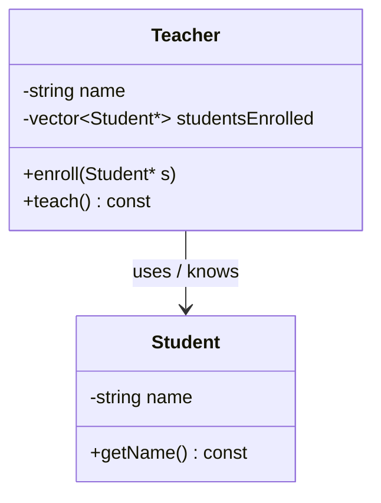
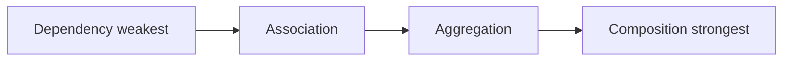
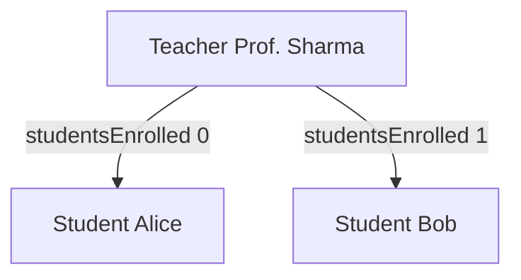
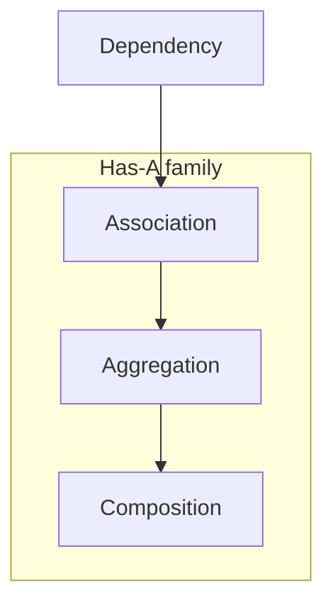
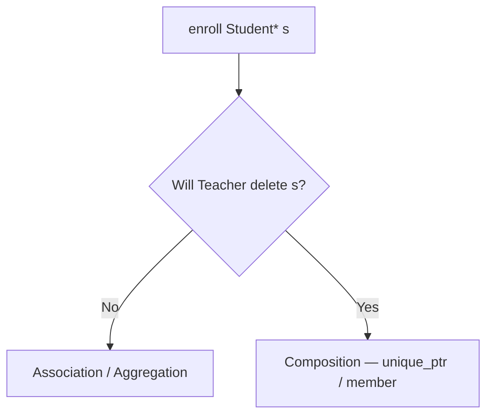

# Association — Complete Guide (Object Relationships #1)

> **Runnable code:** [`01_Association.cpp`](../C++%20Code/01_Association.cpp)  
> **Sibling guides:** [`02_Aggregation.md`](02_Aggregation.md) · [`03_Composition_Strong_HasA.md`](03_Composition_Strong_HasA.md) · [`04_Dependency.md`](04_Dependency.md)  
> **Master comparison:** [`OBJECT_RELATIONSHIPS_GUIDE.md`](../OBJECT_RELATIONSHIPS_GUIDE.md)

---

## Table of Contents

1. [What is Association?](#1-what-is-association)
2. [UML Notation](#2-uml-notation)
3. [Repo Walkthrough — Teacher & Student](#3-repo-walkthrough--teacher--student)
4. [C++ Implementation Patterns](#4-c-implementation-patterns)
5. [Association vs Other Relationships](#5-association-vs-other-relationships)
6. [Multiplicity & Navigation](#6-multiplicity--navigation)
7. [Lifetime & Ownership Rules](#7-lifetime--ownership-rules)
8. [Design Considerations](#8-design-considerations)
9. [Real-World Examples](#9-real-world-examples)
10. [Common Mistakes](#10-common-mistakes)
11. [Testing & Verification](#11-testing--verification)
12. [Mermaid Diagrams](#12-mermaid-diagrams)
13. [Interview Question Bank](#13-interview-question-bank)
14. [Cheat Sheet](#14-cheat-sheet)
15. [Hindi / English Glossary](#15-hindi--english-glossary)
16. [Extended Code Variations](#16-extended-code-variations)
17. [Quick Revision Checklist](#17-quick-revision-checklist)

---

## 1. What is Association?

### 1.1 Definition (English)

**Association** is a relationship where one class **uses** or **knows about** another class. There is **no ownership** — both objects can exist **independently**. It is stronger than **dependency** (which is temporary) but weaker than **aggregation** (which is a structured has-a with shared parts semantics).

### 1.1 Definition (Hindi)

**Association** = do classes **ek doosre ko jaanti / use karti** hain, lekin **koi malik nahi** (no ownership). Dono alag-alag zinda reh sakti hain. Teacher Student ko padhata hai — Student Teacher ka property nahi hai.

### 1.2 One-line interview answer

*"Association = uses/knows relationship without ownership; independent lifetimes."*

### 1.3 Key properties table

| Property | Association |
| -------- | ----------- |
| Hindi label | संबंध / uses-knows |
| Ownership | ❌ None |
| Lifetime coupling | ❌ Independent |
| Stored as field? | ✅ Often (pointer/reference container) |
| UML arrow | Solid `-->` |
| Strength vs others | Stronger than Dependency; weaker than Aggregation |
| Typical C++ | `vector<Student*>`, `Teacher*` back-ref |

### 1.4 Mental model

```
Teacher ----knows----> Student
   |                      |
   | owns name            | owns name
   | does NOT own Student objects
```

Teacher **references** students; it does **not** `delete` them.

---

## 2. UML Notation

### 2.1 Standard symbol

```
┌─────────┐         ┌─────────┐
│ Teacher │ ──────> │ Student │
└─────────┘  uses   └─────────┘
     (no diamond on either end)
```

### 2.2 UML element reference

| Element | Meaning in Association |
| ------- | ---------------------- |
| Solid line + open arrow | Direction of knowledge / use |
| No diamond | Not aggregation/composition |
| Multiplicity `*` | Many students per teacher |
| Role name `studentsEnrolled` | Field name in code |
| Navigability one-way | Teacher → Student only in demo |

### 2.3 Mermaid class diagram



### 2.4 vs Aggregation UML

| Association | Aggregation |
| ----------- | ----------- |
| `-->` simple arrow | `o--` hollow diamond on whole |
| "knows" / "uses" | "has-a (weak)" |
| No whole/part story required | Whole contains part reference |

### 2.5 vs Dependency UML

| Association | Dependency |
| ----------- | ---------- |
| `-->` solid | `..>` dashed |
| Persistent field link | Temporary — parameter/local |
| Long-term knowledge | Method-scope use |

### 2.5 Whiteboard steps (interview)

1. Draw two boxes: `Teacher`, `Student`.  
2. Solid arrow Teacher → Student, label **uses**.  
3. Say: **no diamond**, **no ownership**, **independent lifetimes**.  
4. Map to `vector<Student*>` — no delete in Teacher dtor.

---

## 3. Repo Walkthrough — Teacher & Student

### 3.1 Source file header

From [`01_Association.cpp`](../C++%20Code/01_Association.cpp):

```cpp
/**
 * ASSOCIATION — loosely connected; no ownership
 * Teacher uses Student; both can exist independently
 * UML: simple arrow  -->  (no diamond)
 */
```

### 3.2 Student class

```cpp
class Student {
    string name;
public:
    Student(string n) : name(n) {}
    string getName() const { return name; }
};
```

Student is **self-contained** — no pointer back to Teacher in this demo (uni-directional association).

### 3.3 Teacher class

```cpp
class Teacher {
    string name;
    vector<Student*> studentsEnrolled;  // ASSOCIATION — no ownership

public:
    Teacher(string n) : name(n) {}

    void enroll(Student* s) {
        studentsEnrolled.push_back(s);
        cout << "[Association] " << name << " enrolled " << s->getName() << "\n";
    }

    void teach() const {
        cout << "[Association] " << name << " teaching: ";
        for (Student* s : studentsEnrolled)
            cout << s->getName() << " ";
        cout << "\n";
    }
};
```

### 3.4 main() lifetime proof

```cpp
int main() {
    Student alice("Alice");
    Student bob("Bob");

    Teacher prof("Prof. Sharma");
    prof.enroll(&alice);
    prof.enroll(&bob);
    prof.teach();

    cout << "Students still exist: " << alice.getName() << ", " << bob.getName() << "\n";
}
```

| Observation | Proves |
| ----------- | ------ |
| Students created before Teacher | Independent creation |
| Addresses passed to `enroll` | Non-owning pointers |
| No `delete` in Teacher | No ownership |
| Students printed after `teach()` | Still alive |

### 3.5 Expected output (conceptual)

```
[Association] Prof. Sharma enrolled Alice
[Association] Prof. Sharma enrolled Bob
[Association] Prof. Sharma teaching: Alice Bob
Students still exist: Alice, Bob
```

### 3.6 Line-by-line responsibility

| Line / construct | Role |
| ---------------- | ---- |
| `vector<Student*>` | Many-to-many possible; non-owning |
| `enroll(Student* s)` | Register association at runtime |
| `teach() const` | Read-only use of associated objects |
| Students on stack in main | External lifetime manager = main |

---

## 4. C++ Implementation Patterns

### 4.1 Pattern catalog

| Pattern | Code sketch | Ownership |
| ------- | ----------- | --------- |
| Raw pointer field | `Student* s;` | None — caller owns |
| Reference field | `Student& s;` | None — must exist |
| Container of pointers | `vector<Student*>` | None — repo pattern |
| Container of references | Not legal directly | Use pointer or `reference_wrapper` |
| `optional<Student*>` | Nullable association | None |

### 4.2 Recommended modern style

```cpp
class Teacher {
    vector<Student*> studentsEnrolled;  // non-owning observers
public:
    void enroll(Student* s) {
        if (!s) return;
        studentsEnrolled.push_back(s);
    }
    // NO destructor cleanup of Student*
};
```

### 4.3 What NOT to do

```cpp
~Teacher() {
    for (Student* s : studentsEnrolled)
        delete s;  // WRONG — implies composition/ownership
}
```

Deleting associated objects turns relationship into **composition** (or is simply a **bug** if students owned elsewhere).

### 4.4 const-correctness

```cpp
void teach() const;  // OK — reading associated students doesn't modify Teacher's logical state
```

Associated objects themselves may be non-const elsewhere.

### 4.5 nullptr / dangling discipline

| Risk | Mitigation |
| ---- | ---------- |
| Student destroyed before Teacher | Remove pointer on destroy or use `weak_ptr` if shared |
| Duplicate enroll | `std::find` before push |
| Null enroll | Guard `if (!s) return;` |

Association **does not** solve lifetime — **caller** must ensure students outlive teacher's use (or teacher un-enrolls).

### 4.6 shared_ptr — still not aggregation?

If Teacher holds `shared_ptr<Student>`, you **share ownership** — interviewers often classify as **aggregation** (weak has-a with shared lifetime). Pure association = **raw/ref/non-owning smart pointer**.

### 4.7 Bidirectional association (extension)

```cpp
class Student {
    vector<Teacher*> teachers;  // back-link
public:
    void addTeacher(Teacher* t) { teachers.push_back(t); }
};
```

Must keep **consistent** enroll/remove on both sides — increases coupling.

---

## 5. Association vs Other Relationships

### 5.1 Master comparison table

| Relationship | Hindi | Ownership | Field? | UML | Example |
| ------------ | ----- | --------- | ------ | --- | ------- |
| **Dependency** | अस्थायी उपयोग | ❌ | ❌ usually | `..>` | Logger param |
| **Association** | जानता है | ❌ | ✅ | `-->` | Teacher–Student |
| **Aggregation** | कमज़ोर has-a | ❌ shared | ✅ | `o--` | Car–Engine* |
| **Composition** | मज़बूत has-a | ✅ | ✅ | `*--` | House–Room |

### 5.2 Strength spectrum



### 5.3 Association vs Dependency

| Question | Dependency | Association |
| -------- | ---------- | ----------- |
| Is collaborator stored? | No — param/local | Yes — field |
| Survives method call? | No | Yes |
| Example in repo | OrderService + Logger param | Teacher + Student field |

**Rule of thumb:** If `Logger` were a **member field** of OrderService but still not owned → **association**, not dependency.

### 5.4 Association vs Aggregation

| Question | Association | Aggregation |
| -------- | ----------- | ----------- |
| Has-a language natural? | "Teacher has students" awkward | "Car has engine" natural |
| Part of whole? | Looser "knows" | Clearer whole–part |
| UML diamond? | No | Hollow ◇ on whole |
| Typical metaphor | Professional link | Physical part optional |

Many teams **collapse** association and aggregation in conversation — exams may not. Know UML difference.

### 5.5 Association vs Composition

| Composition | Association |
| ----------- | ----------- |
| Whole deletes parts | Whole never deletes associated |
| Part cannot exist alone (design) | Part exists without whole |
| `Room` inside `House` member | `Student*` in vector |

### 5.6 vs Inheritance

| IS-A (inheritance) | Association |
| ------------------ | ----------- |
| Substitutability | Collaboration |
| Tight coupling | Looser |
| `class Dog : Animal` | `class Teacher` uses `Student` |

**Prefer association** when relationship is not true IS-A.

---

## 6. Multiplicity & Navigation

### 6.1 Multiplicity table

| UML | Meaning | Teacher–Student demo |
| --- | ------- | -------------------- |
| `1` | Exactly one | One name per teacher |
| `0..1` | Optional one | Optional class advisor |
| `*` | Many | Many students enrolled |
| `1..*` | At least one | Must have ≥1 student to teach? business rule |

### 6.2 Navigation directions

| Type | Diagram | C++ |
| ---- | ------- | --- |
| Uni-directional | Teacher → Student | Only Teacher has pointers |
| Bi-directional | Teacher ↔ Student | Both hold pointers |
| Self-association | Course prerequisite Course | `vector<Course*>` same class |

### 6.3 Role names

```
Teacher ──studentsEnrolled──> Student
```

Role name maps directly to **field name** — helps whiteboard ↔ code mapping.

---

## 7. Lifetime & Ownership Rules

### 7.1 Golden rules

1. **Teacher destructor does NOT delete Student.**  
2. **Whoever creates Student owns it** (here: stack in `main`).  
3. **Pointers must not dangle** during association use.  
4. **Association does not extend lifetime.**

### 7.2 Lifetime diagram


### 7.3 If Teacher is destroyed first?

Students **survive** — pointers in destroyed Teacher are gone, but Student objects unaffected.

### 7.4 If Student destroyed before Teacher?

**Dangling pointers** in `studentsEnrolled` — UB if `teach()` called. Association requires **lifetime protocol** (un-enroll or weak refs).

### 7.5 Heap students still association

```cpp
Student* alice = new Student("Alice");
prof.enroll(alice);
// ...
delete alice;  // must unenroll OR destroy prof first
delete alice;  // caller owns — NOT Teacher
```

Ownership = **who calls delete** = main, not Teacher.

---

## 8. Design Considerations

### 8.1 When association fits

| Scenario | Fit |
| -------- | --- |
| Many-to-many professional links | ✅ |
| Registry / catalog references | ✅ |
| Observer list (non-owning) | ✅ |
| Parent owns child exclusively | ❌ use Composition |

### 8.2 Coupling trade-off

Association **increases coupling** vs dependency (field persists) but **less** than composition (no ownership obligation).

### 8.3 Law of Demeter angle

Teacher calls `s->getName()` — OK. Reaching deep into Student internals without methods → **train wreck** — add methods on Student instead.

### 8.4 Documentation obligation

Comment fields:

```cpp
vector<Student*> studentsEnrolled;  // non-owning; students must outlive this Teacher
```

Future maintainers need **ownership semantics** in code.

---

## 9. Real-World Examples

### 9.1 Domain mapping table

| Domain | Associated entities | Ownership note |
| ------ | ------------------- | -------------- |
| University | Professor ↔ Course listing | Students not owned by prof |
| Hospital | Doctor treats Patient | Patient independent |
| E-commerce | Customer browses Product | Product catalog external |
| IDE | EditorTab knows Project | Project may outlive tab |
| Social | User follows User | Both independent accounts |

### 9.2 Doctor–Patient narrative (Hindi)

Doctor patient ko ** treat karta hai** — patient doctor ki property nahi. Doctor clinic chhod de, patient zinda. Yeh **association** hai — **uses** relationship.

### 9.3 Teacher–Student narrative (English)

Prof. Sharma maintains a **list of enrolled students** for the semester. Students exist as university records **before and after** the course. The professor **does not destroy** student records when the semester ends — only clears enrollment (not shown in minimal demo).

### 9.4 Contrast with Composition example

**House–Room:** Room dies with house — **not** association. **Teacher–Student:** Student outlives course — **association**.

---

## 10. Common Mistakes

### 10.1 Mistake catalog

| Mistake | Symptom | Fix |
| ------- | ------- | --- |
| `delete` in Teacher dtor | Double-free elsewhere | Remove deletes |
| Storing dangling pointer | Crash on teach | Ensure lifetime |
| Confusing with aggregation diamond | Wrong UML | No diamond for association |
| Using `unique_ptr<Student>` | Ownership semantics | Use raw/ref if non-owning |
| No null check on enroll | Crash | Guard nullptr |
| Bidirectional without sync | Inconsistent graph | Central enroll service |

### 10.2 Interview trap

**Q:** "Teacher has students — isn't that aggregation?"  
**A:** Colloquially "has" — UML me **aggregation** needs **hollow diamond** and **part-of whole** story. **Non-owning pointer list without ownership** = **association**. If Car has external Engine*, that's **aggregation** in strict UML.

### 10.3 Code smell

If Teacher **creates** Student inside enroll:

```cpp
void enroll(string name) {
    studentsEnrolled.push_back(new Student(name));  // now Teacher owns → composition-like
}
```

Now Teacher probably **should** delete — relationship changed.

---

## 11. Testing & Verification

### 11.1 Manual test checklist

- [ ] Enroll two students, teach prints both names  
- [ ] Destroy Teacher — students still accessible  
- [ ] No leak — if heap students, delete in main only once  
- [ ] Teacher scope ends — students outside still OK

### 11.2 Compile & run

From [`Composition/`](../):

```bash
g++ -std=c++17 -Wall -o /tmp/assoc "C++ Code/01_Association.cpp" && /tmp/assoc
```

Or use [`compile.sh`](../compile.sh) if wired for Composition folder.

### 11.3 Assert-style checks (extension)

```cpp
#include <cassert>
// after teach:
assert(alice.getName() == "Alice");
```

---

## 12. Mermaid Diagrams

### 12.1 Object graph at runtime



### 12.2 Relationship placement in curriculum



### 12.3 Ownership decision at enroll



---

## 13. Interview Question Bank

**Q1.** Association kya hai?  
**A.** Uses/knows without ownership; independent lifetimes.

**Q2.** UML symbol?  
**A.** Solid arrow `-->`, no diamond.

**Q3.** Teacher Student ko delete kare?  
**A.** Nahi — association me no ownership.

**Q4.** Association vs dependency?  
**A.** Association = persistent field; dependency = temporary param/local.

**Q5.** `vector<Student*>` ownership?  
**A.** Non-owning — demo pattern.

**Q6.** Bidirectional association?  
**A.** Dono sides pointers — enroll sync needed.

**Q7.** Aggregation se farq?  
**A.** Aggregation = hollow diamond weak has-a; association = simpler uses link.

**Q8.** Composition se farq?  
**A.** Composition owns parts; association doesn't.

**Q9.** shared_ptr Student in Teacher?  
**A.** Shared ownership — often called aggregation not pure association.

**Q10.** Lifetime rule?  
**A.** Associated object must outlive use or un-enroll.

**Q11.** Hindi: malik kaun?  
**A.** Jo object banata hai — yahan main/stack.

**Q12.** const teach()?  
**A.** Reads students — Teacher logical const.

**Q13.** Doctor-Patient example?  
**A.** Classic association.

**Q14.** Can association be many-to-many?  
**A.** Haan — vectors both sides.

**Q15.** Diamond in UML?  
**A.** Nahi for association.

**Q16.** Dangling pointer risk?  
**A.** Student destroyed before teach — UB.

**Q17.** weak_ptr kab?  
**A.** Lifetime uncertain — optional upgrade.

**Q18.** Law of Demeter?  
**A.** Don't deep-chain — use getters.

**Q19.** enroll nullptr?  
**A.** Guard — invalid association.

**Q20.** IS-A vs uses?  
**A.** Inheritance vs association.

**Q21.** Field vs parameter — which relationship?  
**A.** Field persistent → association; param only → dependency.

**Q22.** Teacher creates Student inside?  
**A.** Ownership shift — composition territory.

**Q23.** Code file in repo?  
**A.** `01_Association.cpp`.

**Q24.** Multiplicity * meaning?  
**A.** Many students.

**Q25.** Navigability one-way here?  
**A.** Teacher → Student only.

**Q26.** Reference member instead of pointer?  
**A.** Possible — must always refer valid object.

**Q27.** Association strength?  
**A.** Weaker than aggregation/composition in coupling.

**Q28.** Real API design?  
**A.** Enrollment service may centralize links.

**Q29.** Stack students prove what?  
**A.** Independent lifetime from Teacher.

**Q30.** Interview one-liner English?  
**A.** "Knows but doesn't own."

**Q31.** delete in dtor wrong why?  
**A.** Double delete if main also owns.

**Q32.** UML role name?  
**A.** studentsEnrolled field label.

**Q33.** Container of references?  
**A.** Not direct — use pointer/reference_wrapper.

**Q34.** Association in SOLID?  
**A.** Prefer over inheritance when not IS-A.

**Q35.** Testing destroy order?  
**A.** Teacher first — students still valid.

**Q36.** Hindi: संबंध?  
**A.** Relationship — uses-knows type.

**Q37.** Pointer vs reference enroll?  
**A.** Pointer allows nullable/reseat; ref must bind.

**Q38.** Graph cycles?  
**A.** Bidirectional can cycle — careful algorithms.

**Q39.** Serialize association?  
**A.** Store IDs not owned pointers.

**Q40.** Microservices analogy?  
**A.** Service A calls B API — often dependency; cached client field → association.

**Q41.** ORM mapping?  
**A.** FK relationship often association/aggregation in domain model.

**Q42.** unique_ptr in Teacher?  
**A.** Ownership — composition not association.

**Q43.** teach() empty list?  
**A.** Valid — zero multiplicity allowed.

**Q44.** Duplicate enroll?  
**A.** Business rule — may dedupe.

**Q45.** const Student* vs Student*?  
**A.** const pointer — can't reseat; pointee const optional.

**Q46.** Static association?  
**A.** static registry of links — rare pattern.

**Q47.** Thread safety enroll?  
**A.** vector not thread-safe — lock if shared.

**Q48.** Move Teacher?  
**A.** vector of pointers copies — still non-owning.

**Q49.** Standard library example?  
**A.** Observer raw pointers in some legacy APIs.

**Q50.** Summary Hindi?  
**A.** Jaanta hai, malik nahi; alag zindagi.

---

## 14. Cheat Sheet

```
┌─────────────────────────────────────────────────────────────┐
│ ASSOCIATION                                                 │
│   Meaning:   A uses / knows B                               │
│   Ownership: NONE                                           │
│   Lifetime:  INDEPENDENT                                    │
│   UML:       Teacher ──────> Student   (solid, NO diamond)  │
│   C++:       vector<Student*>  — NO delete in dtor          │
│   vs Dep:    field persists vs method param                 │
│   vs Agg:    no hollow diamond; looser "knows"              │
│   vs Comp:   don't delete parts                             │
│   File:      01_Association.cpp                             │
└─────────────────────────────────────────────────────────────┘
```

### Quick decision

| See in code | Relationship |
| ----------- | -------------- |
| Param only | Dependency |
| `T*` field, no delete | Association (or Aggregation) |
| `T*` field, external lifetime, has-a story | Aggregation |
| Member `T` or `unique_ptr<T>` | Composition |

---

## 15. Hindi / English Glossary

| English | Hindi | Note |
| ------- | ----- | ---- |
| Association | संबंध / association | Uses-knows |
| Ownership | स्वामित्व | Malik — none here |
| Navigate | नेविगेट | Arrow direction |
| Multiplicity | बहुलता | How many links |
| Lifetime | जीवनकाल | Independent |
| Enroll | नामांकन | Register link |
| Non-owning pointer | गैर-स्वामित्व pointer | Observe only |
| Whole / part | संपूर्ण / अंश | Weaker than has-a |
| Dangling | लटकता | Invalid ptr |
| Encapsulation | इनकैप्सुलेशन | getName() access |

---

## 16. Extended Code Variations

### 16.1 unenroll support

```cpp
void unenroll(Student* s) {
    auto it = find(studentsEnrolled.begin(), studentsEnrolled.end(), s);
    if (it != studentsEnrolled.end())
        studentsEnrolled.erase(it);
}
```

### 16.2 reference_wrapper container

```cpp
vector<reference_wrapper<Student>> roster;
roster.push_back(ref(alice));
```

Non-null guarantee; students must outlive teacher.

### 16.3 const Student* in vector

```cpp
vector<const Student*> observers;
```

Read-only association view.

### 16.4 weak_ptr variation (shared student registry)

When students are `shared_ptr` elsewhere:

```cpp
vector<weak_ptr<Student>> enrolled;
// lock() before use — expired if student gone
```

### 16.5 Service locator anti-pattern contrast

Association **names explicit collaborators** — better than hidden globals.

---

## 17. Quick Revision Checklist

- [ ] Definition: **uses, no ownership**
- [ ] UML: **`-->`** solid, **no diamond**
- [ ] C++: **`vector<Student*>`**, **no delete**
- [ ] vs Dependency: **field vs param**
- [ ] vs Aggregation: **diamond / has-a strictness**
- [ ] vs Composition: **no lifetime tie**
- [ ] Ran [`01_Association.cpp`](../C++%20Code/01_Association.cpp)
- [ ] Interview line: **"knows but doesn't own"**

---

*End of guide — Association*
