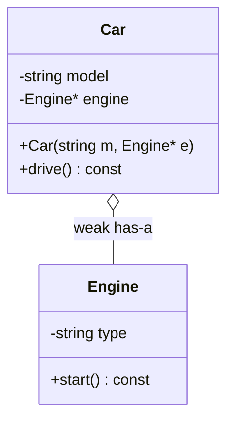
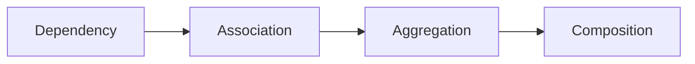
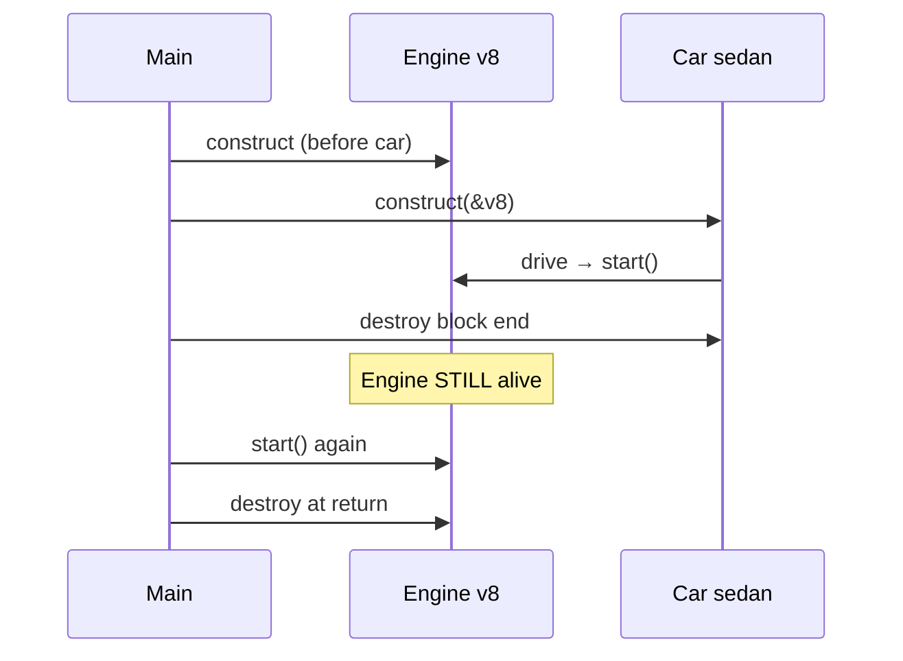
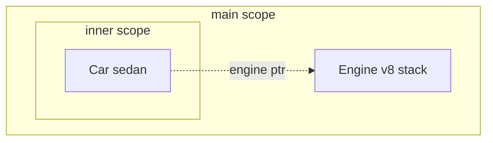
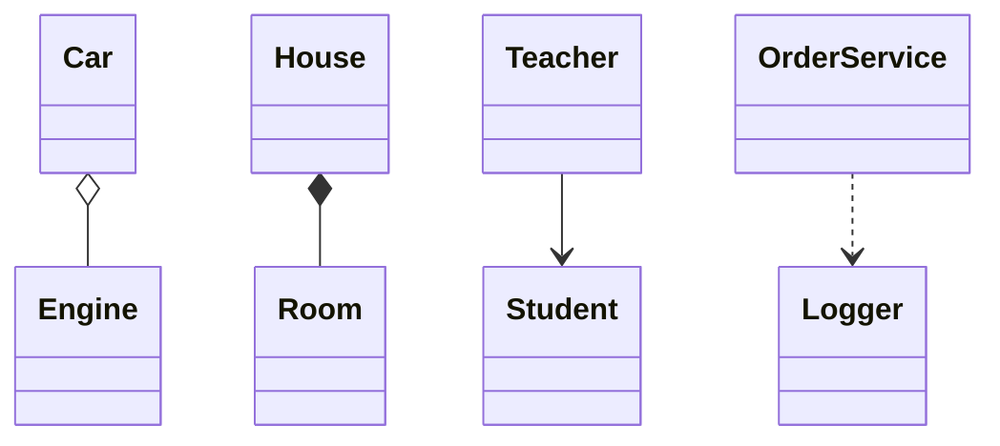
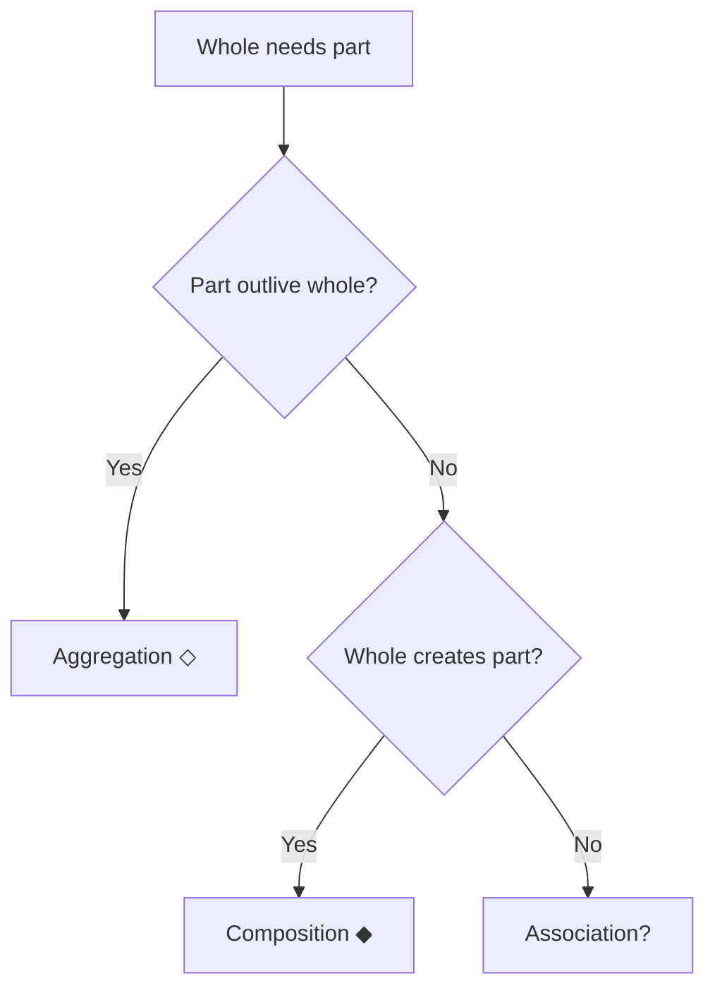

# Aggregation — Complete Guide (Object Relationships #2)

> **Runnable code:** [`02_Aggregation.cpp`](../C++%20Code/02_Aggregation.cpp)  
> **Sibling guides:** [`01_Association.md`](01_Association.md) · [`03_Composition_Strong_HasA.md`](03_Composition_Strong_HasA.md) · [`04_Dependency.md`](04_Dependency.md)  
> **Master comparison:** [`OBJECT_RELATIONSHIPS_GUIDE.md`](../OBJECT_RELATIONSHIPS_GUIDE.md)

---

## Table of Contents

1. [What is Aggregation?](#1-what-is-aggregation)
2. [UML Notation — Hollow Diamond](#2-uml-notation--hollow-diamond)
3. [Repo Walkthrough — Car & Engine](#3-repo-walkthrough--car--engine)
4. [C++ Implementation Patterns](#4-c-implementation-patterns)
5. [Aggregation vs Other Relationships](#5-aggregation-vs-other-relationships)
6. [Lifetime Semantics](#6-lifetime-semantics)
7. [Ownership & shared_ptr](#7-ownership--shared_ptr)
8. [Design Guidelines](#8-design-guidelines)
9. [Real-World Examples](#9-real-world-examples)
10. [Common Mistakes](#10-common-mistakes)
11. [Mermaid Diagrams](#11-mermaid-diagrams)
12. [Interview Question Bank](#12-interview-question-bank)
13. [Cheat Sheet](#13-cheat-sheet)
14. [Hindi / English Glossary](#14-hindi--english-glossary)
15. [Extended Patterns & Variations](#15-extended-patterns--variations)
16. [Build & Run](#16-build--run)
17. [Quick Revision Checklist](#17-quick-revision-checklist)

---

## 1. What is Aggregation?

### 1.1 Definition (English)

**Aggregation** is a **weak "has-a"** relationship. The whole **contains** or **uses** a part, but the part has an **independent lifetime** — it can **outlive** the whole and may be **shared** among multiple wholes. The whole **does not destroy** the part in its destructor.

### 1.1 Definition (Hindi)

**Aggregation** = **कमज़ोर has-a** — whole ke paas part hai, par part **alag zinda** reh sakta hai. Car ka engine car ke bina bhi exist kar sakta hai; car bech di to engine workshop me pada ho sakta hai. Car **engine delete nahi karti**.

### 1.2 One-line interview answer

*"Aggregation = weak has-a; whole holds reference to part; part can survive whole; no delete in whole's destructor."*

### 1.3 Key properties

| Property | Aggregation |
| -------- | ----------- |
| Hindi | कमज़ोर has-a / सह-जीवन |
| Ownership | ❌ Whole does NOT own part |
| Lifetime | **Independent** — part may outlive whole |
| UML | Hollow diamond `◇` on whole side |
| C++ typical | Raw pointer / reference / `shared_ptr` (shared) |
| Strength | Stronger than Association; weaker than Composition |

### 1.4 Metaphor anchor — Car & Engine

```
     ┌─────────── Car ───────────┐
     │  model: "Honda City"      │
     │  engine ────────┐         │
     └─────────────────│─────────┘
                       │
                       ▼
                 ┌──────────┐
                 │  Engine  │  ← exists BEFORE car, AFTER car
                 │  V8      │
                 └──────────┘
```

---

## 2. UML Notation — Hollow Diamond

### 2.1 Standard diagram

```
        ◇
Car ─────────── Engine
   (hollow diamond on Car)
```

### 2.2 Mermaid



Note: Mermaid `o--` = aggregation (hollow diamond on left/class side).

### 2.3 UML elements table

| Symbol | Meaning |
| ------ | ------- |
| ◇ hollow diamond | Aggregation — shared/independent part |
| Solid line | Structural link |
| Multiplicity `1` on engine side | Car uses one engine at a time |
| Navigability Car → Engine | Car knows engine |

### 2.4 Filled vs hollow diamond

| ◇ Hollow | ◆ Filled |
| -------- | -------- |
| Aggregation | Composition |
| Part may outlive whole | Part dies with whole |
| No ownership delete | Whole owns part |

### 2.5 Whiteboard script

1. Draw Car and Engine boxes.  
2. Attach **hollow diamond** on **Car** side.  
3. Label **has-a (weak)**.  
4. Say: **Engine created outside Car**; **Car dtor does NOT delete Engine**.

---

## 3. Repo Walkthrough — Car & Engine

### 3.1 File header

From [`02_Aggregation.cpp`](../C++%20Code/02_Aggregation.cpp):

```cpp
/**
 * AGGREGATION — weak "Has-a"; both INDEPENDENT lifetimes
 * Car has Engine* but does NOT own (delete) engine
 * Engine can outlive Car
 * UML: hollow diamond ◇ on Car side
 */
```

### 3.2 Engine class

```cpp
class Engine {
    string type;
public:
    Engine(string t) : type(t) {
        cout << "[Engine] created: " << type << "\n";
    }
    ~Engine() { cout << "[Engine] destroyed: " << type << "\n"; }
    void start() const { cout << "[Engine] " << type << " starting...\n"; }
};
```

Engine is **standalone** — constructed in `main` before Car.

### 3.3 Car class

```cpp
class Car {
    string model;
    Engine* engine;  // aggregation — external lifetime

public:
    Car(string m, Engine* e) : model(m), engine(e) {
        cout << "[Car] created: " << model << " (uses external engine)\n";
    }

    ~Car() {
        cout << "[Car] destroyed: " << model << " (engine NOT deleted here)\n";
    }

    void drive() const {
        if (engine) engine->start();
        cout << "[Car] " << model << " driving\n";
    }
};
```

**Critical:** Destructor explicitly documents **engine NOT deleted**.

### 3.4 main() — lifetime proof

```cpp
int main() {
    Engine v8("V8-Petrol");  // Engine OUTSIDE car

    {
        Car sedan("Honda City", &v8);
        sedan.drive();
    }  // Car destroyed — Engine still alive

    cout << "--- Car gone, engine still usable ---\n";
    v8.start();

    return 0;  // Engine destroyed at end of main
}
```

### 3.5 Output narrative

| Event | Console idea |
| ----- | -------------- |
| Engine ctor | `[Engine] created: V8-Petrol` |
| Car ctor | `[Car] created: Honda City` |
| drive | start + driving |
| Car dtor | engine NOT deleted message |
| After block | engine still starts |
| main end | Engine dtor |

### 3.6 Proof table

| After Car scope ends | Engine state |
| -------------------- | ------------ |
| Car object | Destroyed |
| Engine object | **Still alive** |
| Pointer in Car | Gone with Car — but Engine on stack in main |

---

## 4. C++ Implementation Patterns

### 4.1 Pattern matrix

| Pattern | Code | Ownership |
| ------- | ---- | --------- |
| Injected raw pointer | `Engine* engine` | External — **repo** |
| Reference member | `Engine& engine` | External — must exist |
| `shared_ptr<Engine>` | Shared ownership | Refcount — interview gray area |
| Optional engine | `Engine* engine = nullptr` | Nullable weak has-a |

### 4.2 Constructor injection (preferred)

```cpp
Car(string m, Engine* e) : model(m), engine(e) {}
```

Engine **supplied from outside** — classic aggregation signal.

### 4.3 What whole MUST NOT do

```cpp
~Car() {
    delete engine;  // WRONG for aggregation — unless design changed to composition
}
```

### 4.4 nullptr-safe drive

```cpp
void drive() const {
    if (engine) engine->start();
}
```

Car may exist briefly without engine assigned — defensive.

### 4.5 Multiple cars one engine (sharing)

```cpp
Engine v8("V8");
Car car1("A", &v8);
Car car2("B", &v8);  // same engine shared — aggregation story
```

Both cars **reference** same engine; neither deletes it.

### 4.6 Engine swap between cars

```cpp
void swapEngine(Car& other) {
    std::swap(engine, other.engine);
}
```

Parts **movable** between wholes — aggregation flexibility.

### 4.7 When pointer becomes composition

If Car does:

```cpp
Car(string m, string engineType)
    : model(m), engine(new Engine(engineType)) {}

~Car() { delete engine; }
```

Now Car **creates and destroys** engine → **composition** (or unique_ptr strong has-a).

---

## 5. Aggregation vs Other Relationships

### 5.1 Master table

| | Dependency | Association | **Aggregation** | Composition |
| --- | --- | --- | --- | --- |
| Hindi | अस्थायी | जानता है | **कमज़ोर has-a** | मज़बूत has-a |
| Field? | Rare | Yes | Yes | Yes |
| Ownership | ❌ | ❌ | ❌ | ✅ |
| Part outlives whole? | N/A | Yes | **Yes** | No |
| UML | `..>` | `-->` | **`o--` ◇** | `*--` ◆ |
| Repo file | 04 | 01 | **02** | 03 |

### 5.2 Aggregation vs Association

| Aggregation | Association |
| ----------- | ----------- |
| Clear **whole–part** | **Uses/knows** |
| Hollow diamond | Plain arrow |
| "Car has engine" natural | "Teacher knows student" |
| Part often **injected** | Link often **registered** |

**Exam tip:** If UML shows **hollow diamond**, answer **aggregation** even if both use pointers.

### 5.3 Aggregation vs Composition

| Question | Aggregation | Composition |
| -------- | ----------- | ----------- |
| Part without whole? | **Can exist** | **Should not** (design) |
| Who deletes part? | **External owner** | **Whole** |
| C++ | `Engine*` no delete | `Engine` member / `unique_ptr` |
| UML | ◇ | ◆ |
| Demo | Car–Engine | House–Room |

### 5.4 vs Inheritance

| Has-a (aggregation) | Is-a (inheritance) |
| ------------------- | ------------------ |
| Car **has** Engine | Car **is-a** Vehicle |
| Composition over inheritance | Prefer has-a when no substitutability |

### 5.5 Strength flowchart



---

## 6. Lifetime Semantics

### 6.1 Timeline diagram



### 6.2 Ownership responsibility table

| Object | Created by | Destroyed by |
| ------ | ---------- | ------------ |
| Engine | main (stack) | main end |
| Car | inner scope | scope end |
| engine pointer in Car | — | Car gone — Engine unaffected |

### 6.3 Dangling risk

If Engine were **heap** and deleted before Car:

```cpp
Engine* e = new Engine("V8");
Car c("X", e);
delete e;  // BAD if c still uses e
c.drive(); // UB
```

Aggregation **requires** engine to **outlive** car usage.

### 6.4 Hindi lifetime summary

> Engine **car se pehle** bana, **car ke baad** bhi chala — isliye yeh **aggregation** hai, **composition** nahi.

---

## 7. Ownership & shared_ptr

### 7.1 Raw pointer aggregation (repo)

```cpp
Engine* engine;  // non-owning — clear aggregation
```

### 7.2 shared_ptr variant

```cpp
class Car {
    shared_ptr<Engine> engine;
public:
    Car(string m, shared_ptr<Engine> e) : model(m), engine(e) {}
};
```

| Interpretation | Detail |
| -------------- | ------ |
| Shared ownership | Refcount > 1 if multiple cars |
| Interview | Some call this **shared aggregation** |
| vs unique_ptr | `unique_ptr` in whole → **composition** |

### 7.3 Decision table

| Smart pointer | Typical relationship label |
| ------------- | -------------------------- |
| `unique_ptr` in whole | Composition |
| `shared_ptr` in whole | Shared aggregation / shared ownership |
| Raw/ref non-owning | Aggregation (strict UML) |

### 7.4 weak_ptr observer

Car holds `weak_ptr<Engine>` if engine lifetime managed elsewhere — upgrade to `shared_ptr` in `drive()`.

---

## 8. Design Guidelines

### 8.1 When to use aggregation

| Scenario | Fit |
| -------- | --- |
| Part reusable across wholes | ✅ |
| Part may exist without whole | ✅ |
| Whole shouldn't control part birth/death | ✅ |
| Part exclusively owned by whole | ❌ → Composition |
| One-off method helper | ❌ → Dependency |

### 8.2 Dependency injection alignment

Constructor `Car(model, engine*)` makes **dependency visible** — testable (inject mock engine).

### 8.3 Document ownership

```cpp
Engine* engine;  // non-owning; must outlive this Car
```

### 8.4 Law of Demeter

Car calls `engine->start()` — OK if Engine is direct collaborator.

---

## 9. Real-World Examples

### 9.1 Domain table

| Whole | Part | Story |
| ----- | ---- | ----- |
| Car | Engine | Repo demo |
| Department | Employee | Employee transfers — survives dept merge |
| Team | Player | Player joins another team |
| Laptop | Mouse (USB) | Mouse works on another laptop |
| University | Professor | Professor remains if department closes |

### 9.2 Department–Employee (Hindi)

Department me **employee kaam karta hai**, lekin employee **transfer** ho sakta hai — department band ho gaya to bhi employee company me. Department employee ko **fire karke delete nahi karta** system se — HR owns record.

### 9.3 Contrast House–Room

Room **ghar ke saath** marta hai — **composition**. Engine **car ke baad** chalta hai — **aggregation**.

### 9.4 Software example

**UI Window** aggregates **Toolbar** widget reused across windows — toolbar may outlive one window if docked globally.

---

## 10. Common Mistakes

### 10.1 Mistake list

| Mistake | Fix |
| ------- | --- |
| `delete engine` in ~Car | Remove — external lifetime |
| Creating engine inside Car without delete clarity | Pick composition + unique_ptr |
| Drawing filled ◆ for Car–Engine | Use hollow ◇ |
| Calling aggregation when unique_ptr owns | Say composition |
| Dangling engine pointer | Ensure outlives car |
| Confusing with association only | Use diamond if whole–part |

### 10.2 Interview trap

**Q:** "Car has engine — composition?"  
**A:** **Has-a wording** insufficient. **Lifetime:** engine survives car → **aggregation**. **Code:** no delete in ~Car → **aggregation**. **Composition** would embed `Engine` or `unique_ptr<Engine>` created in Car ctor.

### 10.3 Anti-pattern: lazy owning pointer

```cpp
~Car() {
    if (engine) delete engine;  // sometimes — ambiguous ownership
}
```

Pick **one** story and document.

---

## 11. Mermaid Diagrams

### 11.1 Object graph



### 11.2 UML relationship map



### 11.3 Ownership decision



---

## 12. Interview Question Bank

**Q1.** Aggregation kya hai?  
**A.** Weak has-a; part independent lifetime; no delete in whole.

**Q2.** UML symbol?  
**A.** Hollow diamond ◇ on whole.

**Q3.** Car engine delete kare?  
**A.** Nahi — demo me external engine.

**Q4.** Engine car ke baad?  
**A.** Alive — `v8.start()` works.

**Q5.** vs Composition?  
**A.** Composition part dies with whole; aggregation part may survive.

**Q6.** vs Association?  
**A.** Aggregation has whole–part + hollow diamond; association simpler uses.

**Q7.** C++ pattern?  
**A.** `Engine*` injected, no delete in ~Car.

**Q8.** shared_ptr case?  
**A.** Shared ownership — weak aggregation label.

**Q9.** unique_ptr in Car?  
**A.** Composition territory.

**Q10.** Two cars one engine?  
**A.** Valid aggregation sharing.

**Q11.** Hindi one-liner?  
**A.** Kamzor has-a; part alag zinda.

**Q12.** Who destroys engine in demo?  
**A.** main scope end.

**Q13.** Mermaid notation?  
**A.** `Car o-- Engine`.

**Q14.** Dependency compare?  
**A.** Dependency temporary; aggregation persistent field.

**Q15.** Injection benefit?  
**A.** Testability, flexible engine.

**Q16.** Dangling engine?  
**A.** delete engine before car uses — UB.

**Q17.** nullptr engine?  
**A.** drive guards with if(engine).

**Q18.** Department employee?  
**A.** Real-world aggregation.

**Q19.** Diamond filled?  
**A.** Composition not aggregation.

**Q20.** File name?  
**A.** 02_Aggregation.cpp.

**Q21.** Engine before Car ctor?  
**A.** Proves external lifetime.

**Q22.** Reference member Engine&?  
**A.** OK — must outlive car.

**Q23.** Swap engines?  
**A.** Aggregation flexibility.

**Q24.** Create engine inside Car?  
**A.** If Car deletes → composition.

**Q25.** Weak_ptr use?  
**A.** Observe engine without own.

**Q26.** Ownership table Car?  
**A.** Car uses; main owns stack engine.

**Q27.** Whole part Hindi?  
**A.** Samagra / ang.

**Q28.** UML navigability?  
**A.** Car → Engine.

**Q29.** Multiplicity 1 engine?  
**A.** One engine per car instance.

**Q30.** Interview draw?  
**A.** Car ◇— Engine.

**Q31.** Stack vs heap engine?  
**A.** Both OK if lifetime managed correctly.

**Q32.** Plugin architecture?  
**A.** Host aggregates plugin modules.

**Q33.** ORM aggregate root?  
**A.** DDD term different — don't confuse.

**Q34.** Container of parts?  
**A.** vector<Engine*> if many parts — still no delete if external.

**Q35.** const drive()?  
**A.** Uses engine read-only ops.

**Q36.** Move Car?  
**A.** Pointer copied — same engine.

**Q37.** Engine type string?  
**A.** Metadata — irrelevant to relationship type.

**Q38.** Transfer employee?  
**A.** Aggregation narrative.

**Q39.** Car without engine?  
**A.** Nullable pointer — still aggregation if non-owning.

**Q40.** Delete diamond confusion?  
**A.** Hollow vs filled — key exam topic.

**Q41.** shared ownership Hindi?  
**A.** shared_ptr se do car ek engine share.

**Q42.** Why not composition for car engine?  
**A.** Real engines swapped/reused — modeling choice.

**Q43.** Test mock engine?  
**A.** Inject MockEngine*.

**Q44.** Garage owns spare engines?  
**A.** Garage composes inventory; car aggregates installed engine.

**Q45.** Serialize aggregation?  
**A.** Store engine ID not owned ptr.

**Q46.** Thread safety?  
**A.** shared engine — sync start calls.

**Q47.** Rust analogy?  
**A.** Non-owning reference vs owned Box.

**Q48.** JSON nested object?  
**A.** May model composition not aggregation.

**Q49.** Summary English?  
**A.** Has-a without ownership.

**Q50.** Repo output line?  
**A.** "engine NOT deleted here".

---

## 13. Cheat Sheet

```
┌──────────────────────────────────────────────────────────────┐
│ AGGREGATION                                                  │
│   Meaning:   weak has-a                                      │
│   Ownership: NONE by whole (external owner)                  │
│   Lifetime:  part CAN outlive whole                          │
│   UML:       Car ◇──── Engine   (hollow diamond on Car)      │
│   C++:       Engine* engine;  ~Car() NO delete engine        │
│   vs Comp:   part dies with whole in composition             │
│   vs Assoc:  hollow diamond + whole/part                     │
│   File:      02_Aggregation.cpp                              │
└──────────────────────────────────────────────────────────────┘
```

---

## 14. Hindi / English Glossary

| English | Hindi |
| ------- | ----- |
| Aggregation | aggregation / संचय (weak) |
| Weak has-a | कमज़ोर has-a |
| Hollow diamond | खोखला हीरा ◇ |
| Whole | संपूर्ण (Car) |
| Part | अंश (Engine) |
| Independent lifetime | स्वतंत्र जीवनकाल |
| Inject | इंजेक्ट / बाहर से देना |
| Outlive | बच जाना / ज़्यादा देर जीना |
| Ownership | स्वामित्व |
| Shared | साझा |

---

## 15. Extended Patterns & Variations

### 15.1 Factory pool of engines

```cpp
class EnginePool {
    vector<shared_ptr<Engine>> pool;
public:
    shared_ptr<Engine> rent() { /* ... */ }
    void returnEngine(shared_ptr<Engine> e) { /* ... */ }
};
class Car {
    shared_ptr<Engine> rented;
};
```

Pool owns; car **aggregates** rented engine for trip.

### 15.2 Optional aggregation

```cpp
class Car {
    Engine* engine = nullptr;
public:
    void attachEngine(Engine* e) { engine = e; }
};
```

### 15.3 Polymorphic engine

```cpp
class IEngine { virtual void start() = 0; };
class Car { IEngine* engine; };
```

Aggregation to **interface** — electric vs petrol engines swapped.

### 15.4 vector<Wheel*> — four aggregations

Four wheels **may** be shared in theory (spare) — usually four non-owning pointers.

---

## 16. Build & Run

```bash
g++ -std=c++17 -Wall -o /tmp/agg "C++ Code/02_Aggregation.cpp" && /tmp/agg
```

**Verify:** Message after inner scope — engine still starts.

---

## 17. Quick Revision Checklist

- [ ] **Weak has-a** definition
- [ ] **Hollow diamond ◇** on whole
- [ ] **`Engine*`** — **no delete** in ~Car
- [ ] Engine **outlives** Car in demo
- [ ] vs **Composition**: filled ◆, tied lifetime
- [ ] vs **Association**: diamond + part-of story
- [ ] Ran [`02_Aggregation.cpp`](../C++%20Code/02_Aggregation.cpp)

---

*End of guide — Aggregation*
