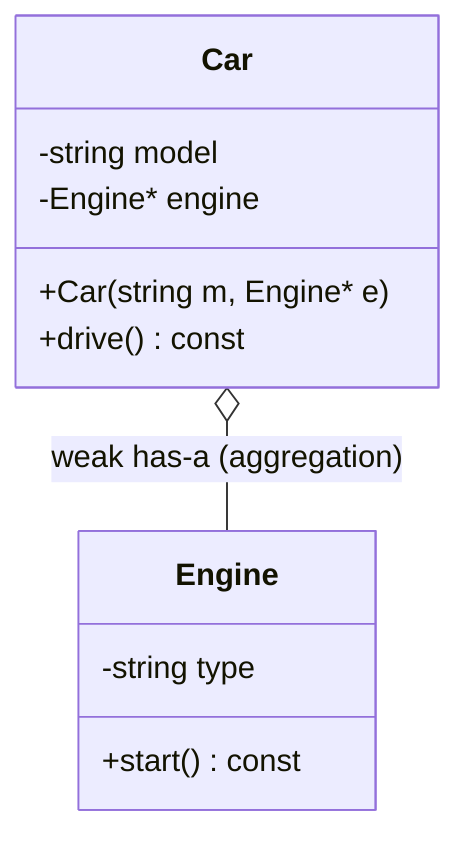
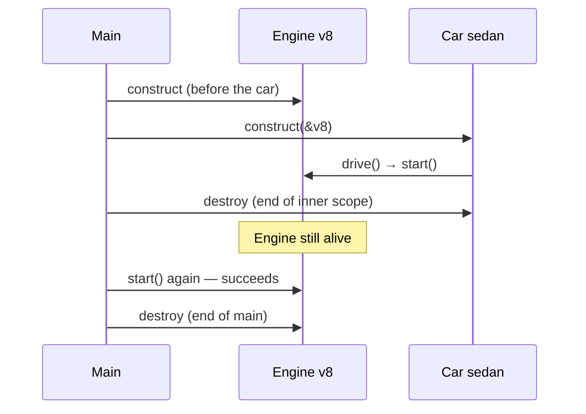

# Aggregation — Object Relationships (2 of 4)

> **Runnable code:** [`02_Aggregation.cpp`](../C++%20Code/02_Aggregation.cpp)
> **Related guides:** [`01_Association.md`](01_Association.md) · [`03_Composition_Strong_HasA.md`](03_Composition_Strong_HasA.md) · [`04_Dependency.md`](04_Dependency.md)
> **Master comparison:** [`OBJECT_RELATIONSHIPS_GUIDE.md`](../OBJECT_RELATIONSHIPS_GUIDE.md)

---

## Contents

1. [Overview](#1-overview)
2. [The Theory in Depth](#2-the-theory-in-depth)
3. [Formal Characteristics](#3-formal-characteristics)
4. [UML Notation — The Hollow Diamond](#4-uml-notation--the-hollow-diamond)
5. [When to Use Aggregation](#5-when-to-use-aggregation)
6. [When NOT to Use Aggregation](#6-when-not-to-use-aggregation)
7. [Code Walkthrough — Car & Engine](#7-code-walkthrough--car--engine)
8. [C++ Implementation Patterns](#8-c-implementation-patterns)
9. [Lifetime & Ownership Semantics](#9-lifetime--ownership-semantics)
10. [Smart Pointers and Aggregation](#10-smart-pointers-and-aggregation)
11. [Aggregation vs the Other Three Relationships](#11-aggregation-vs-the-other-three-relationships)
12. [Design Trade-offs](#12-design-trade-offs)
13. [Real-World Examples](#13-real-world-examples)
14. [Common Pitfalls](#14-common-pitfalls)
15. [Interview Preparation](#15-interview-preparation)
16. [Summary & Cheat Sheet](#16-summary--cheat-sheet)

---

## 1. Overview

**Aggregation** is a **weak "has-a"** relationship that expresses a **whole–part** structure in which the part has an **independent lifetime**. The whole *contains* or *uses* the part, but it does **not own** it: the part is created outside the whole, can be **shared** among several wholes, and can **outlive** any particular whole.

The canonical statement is *"a car has an engine."* The engine is a component of the car, yet it is manufactured independently, can be transferred to another car, and continues to exist after the car is scrapped.

In the strength spectrum:

```
weaker  ──────────────────────────────────────────────►  stronger
 Dependency   →   Association   →   Aggregation   →   Composition
                                    (weak has-a,        (strong has-a,
                                     shared/external      owned part)
                                     part lifetime)
```

Aggregation is a **specialized association**: it adds a whole–part reading (and the hollow-diamond UML symbol) on top of the plain "knows-a" link, while still stopping short of ownership.

---

## 2. The Theory in Depth

### 2.1 The three ideas that define aggregation

1. **Whole–part structure.** Unlike a plain association between peers, aggregation asserts that one object is *part of* another. "Engine is part of Car" reads naturally; that whole–part reading is what earns the hollow diamond in UML.
2. **No ownership.** The whole holds a reference to the part but never destroys it. The part's birth and death are managed by some external owner (in the demo, `main`).
3. **Independent, possibly shared, lifetime.** The part can exist before the whole is created and after the whole is destroyed. Because the whole does not own it, the *same* part can be aggregated by multiple wholes simultaneously.

### 2.2 The lifetime signal is decisive

The single most reliable way to distinguish aggregation from composition is to ask: **"When the whole is destroyed, is the part destroyed too?"**

- If **no** — the part survives — the relationship is **aggregation**.
- If **yes** — the part dies with the whole — the relationship is **composition**.

The demo makes this concrete and observable: the `Car` is destroyed at the end of an inner scope, yet the `Engine` keeps running afterward. That surviving engine *is* the proof of aggregation.

### 2.3 Why model something as aggregation

You choose aggregation when the part is a **reusable, independently managed resource** that a whole merely *installs* or *references* for a period of time. Modeling it this way keeps the part **shareable** and **swappable**, and it keeps the whole free of responsibility for the part's lifetime — which is exactly right when a pool, a factory, or another subsystem owns the part.

### 2.4 The relationship is a modeling decision, not a code fact

Whether a car "aggregates" or "composes" its engine is a **design choice** that reflects domain reality, not something the compiler decides. If your domain treats engines as swappable units held in inventory, aggregation is correct. If your domain treats the engine as permanently welded into one chassis and never reused, composition is correct. The same two classes can be in either relationship depending on the intended semantics.

---

## 3. Formal Characteristics

| Characteristic | Aggregation |
| -------------- | ----------- |
| Intent phrase | "has-a (weak)" — whole–part, no ownership |
| Ownership | None — the whole does not own the part |
| Lifetime coupling | Independent; the part may outlive the whole |
| Sharing | The part may be shared by multiple wholes |
| Stored as a member? | Yes (pointer, reference, or `shared_ptr`) |
| Part created | Outside the whole, then injected |
| UML symbol | Hollow diamond on the whole's end: `◇──` |
| Typical C++ representation | Injected `T*` / `T&`; sometimes `std::shared_ptr<T>` |
| Coupling strength | Moderate (stronger than association, weaker than composition) |

**Mental model:**

```
        ┌──────────── Car ────────────┐
        │ model: "Honda City"         │
        │ engine ────────┐            │
        └────────────────│────────────┘
                         │ (non-owning reference)
                         ▼
                   ┌───────────┐
                   │  Engine   │  ← created BEFORE the car,
                   │  "V8"     │    survives AFTER the car
                   └───────────┘
```

---

## 4. UML Notation — The Hollow Diamond

### 4.1 Standard symbol

Aggregation is drawn as a solid line with a **hollow (unfilled) diamond** attached to the **whole's** end. The hollow diamond is the visual shorthand for "weak has-a: whole–part, but no ownership."

```
        ◇
   Car ────────────── Engine
   (hollow diamond on the Car side)
```

### 4.2 UML element reference

| Element | Meaning in aggregation |
| ------- | ---------------------- |
| Hollow diamond `◇` | Weak has-a; the part's lifetime is independent |
| Diamond placed on the **whole** | The whole aggregates the part |
| Solid line | A structural, persistent link |
| Multiplicity | e.g. a car uses `1` engine; a pool holds `*` engines |

### 4.3 Hollow vs filled diamond

| `◇` Hollow (Aggregation) | `◆` Filled (Composition) |
| ------------------------ | ------------------------ |
| Part may outlive the whole | Part dies with the whole |
| Whole does **not** delete the part | Whole **owns and destroys** the part |
| Part is shareable / reusable | Part is exclusive to one whole |
| `Engine*` injected, no `delete` | `Room` member or `unique_ptr` |

### 4.4 Mermaid class diagram



Mermaid's `o--` renders the hollow diamond on the left (whole) side.

---

## 5. When to Use Aggregation

Choose aggregation when **all** of the following hold:

1. **There is a genuine whole–part relationship.** "The part is a component of the whole" reads naturally.
2. **The part can exist independently of the whole.** It has meaning and a lifetime of its own.
3. **The whole must not control the part's creation or destruction.** Some external owner (a pool, a factory, another subsystem) is responsible for the part.
4. **The part may be shared or swapped.** Multiple wholes might use the same part, or the part might be moved from one whole to another.

### 5.1 Decision checklist

| Question | If **yes** → aggregation is appropriate |
| -------- | --------------------------------------- |
| Is "the part is part of the whole" a natural sentence? | Distinguishes it from a plain association |
| Can the part outlive the whole? | Distinguishes it from composition |
| Is the part created outside and injected in? | Confirms external ownership |
| Might the same part be reused by another whole? | Confirms sharing/swappability |

### 5.2 Typical use cases

- **A component installed but not owned** — a `Car` referencing an externally supplied `Engine`.
- **Resource pools** — a connection or object pool owns the resources; clients aggregate a borrowed resource for the duration of a task.
- **Organizational structures where members transfer** — a `Team` referencing `Player`s who can move to another team.
- **Pluggable subsystems** — a host application referencing plugin modules whose lifetime a plugin manager controls.

---

## 6. When NOT to Use Aggregation

| Situation | Prefer instead | Reason |
| --------- | -------------- | ------ |
| The whole should create and destroy the part | **Composition** | Aggregation forbids ownership; use a member or `unique_ptr` |
| There is no whole–part reading, just a peer link | **Association** | A plain "knows-a" link needs no whole–part claim |
| The collaborator is only needed inside one method | **Dependency** | No persistent member is required |
| The two types are related by substitutability (*is-a*) | **Inheritance** | Aggregation models has-a, not is-a |

---

## 7. Code Walkthrough — Car & Engine

From [`02_Aggregation.cpp`](../C++%20Code/02_Aggregation.cpp).

### 7.1 The part is a standalone object

```cpp
class Engine {
    string type;
public:
    Engine(string t) : type(t)  { cout << "[Engine] created: "   << type << "\n"; }
    ~Engine()                   { cout << "[Engine] destroyed: " << type << "\n"; }
    void start() const          { cout << "[Engine] " << type << " starting...\n"; }
};
```

The engine is constructed and destroyed on its own terms. Its destructor message lets us *see* exactly when it dies.

### 7.2 The whole references the part but does not own it

```cpp
class Car {
    string model;
    Engine* engine;                        // aggregation: external lifetime

public:
    Car(string m, Engine* e) : model(m), engine(e) {}   // engine injected

    ~Car() {
        cout << "[Car] destroyed (engine NOT deleted here)\n";   // the key line
    }

    void drive() const {
        if (engine) engine->start();       // uses the part
    }
};
```

Two signals confirm aggregation: the engine is **injected through the constructor** (created elsewhere), and the destructor **explicitly does not delete it**.

### 7.3 Lifetime proof in `main()`

```cpp
int main() {
    Engine v8("V8-Petrol");                // created OUTSIDE the car

    {
        Car sedan("Honda City", &v8);
        sedan.drive();
    }                                       // Car destroyed here...

    cout << "--- Car gone, engine still usable ---\n";
    v8.start();                             // ...but the Engine still runs

    return 0;                               // Engine destroyed at end of main
}
```

The console shows `[Car] destroyed` **before** `[Engine] destroyed`, with a successful `v8.start()` in between. That ordering is the observable proof that the part outlived the whole.

---

## 8. C++ Implementation Patterns

### 8.1 Representation options

| Representation | Notes | Ownership |
| -------------- | ----- | --------- |
| Injected `T*` | The demo pattern; nullable, reseatable | External |
| Injected `T&` | Must bind at construction; not reseatable | External |
| `std::shared_ptr<T>` | Models *shared* ownership; often called "shared aggregation" | Shared |
| `std::weak_ptr<T>` | Non-owning view of a shared resource; safe against dangling | External |

### 8.2 Constructor injection (the preferred signal)

```cpp
Car(string m, Engine* e) : model(m), engine(e) {}
```

Supplying the part from outside is the clearest indicator of aggregation: the whole receives a part it did not create.

### 8.3 The rule the whole must obey

```cpp
~Car() {
    delete engine;   // WRONG for aggregation — the whole does not own the part
}
```

Never delete an aggregated part. If you find you *must* delete it, the relationship is really composition and should be modeled with a member or `unique_ptr`.

### 8.4 Sharing and swapping

```cpp
Engine v8("V8");
Car car1("A", &v8);
Car car2("B", &v8);   // the SAME engine is aggregated by two cars
```

```cpp
void swapEngine(Car& other) { std::swap(engine, other.engine); }   // parts are movable between wholes
```

Sharing and swapping are natural for aggregation precisely because no single whole owns the part.

---

## 9. Lifetime & Ownership Semantics

### 9.1 The rules

1. The whole **never** destroys the part.
2. The part is owned by whoever **created** it (here, `main`'s stack).
3. The part **must outlive** every use by the whole, or the stored pointer dangles.
4. The relationship **does not extend** the part's lifetime (a raw pointer does not keep anything alive).

### 9.2 Lifetime sequence (demo)



### 9.3 The dangling-part hazard

If the part were heap-allocated and freed before the whole finished using it, the whole's pointer would dangle:

```cpp
Engine* e = new Engine("V8");
Car c("X", e);
delete e;      // premature
c.drive();     // undefined behavior — dangling pointer
```

Aggregation therefore carries a lifetime contract: the external owner must keep the part alive for as long as any whole references it.

---

## 10. Smart Pointers and Aggregation

The smart pointer you choose signals the relationship you intend:

| Member type in the whole | Usual classification |
| ------------------------ | -------------------- |
| `std::unique_ptr<T>` | **Composition** — exclusive ownership; part dies with the whole |
| `std::shared_ptr<T>` | **Shared aggregation** — shared ownership; the part lives while any owner remains |
| Raw `T*` / `T&` / `weak_ptr<T>` | **Aggregation** — strictly non-owning |

Because `shared_ptr` introduces *shared ownership*, some authors treat it as a hybrid; the safest strict answer in an interview is: **raw/reference/`weak_ptr` = aggregation; `unique_ptr` = composition; `shared_ptr` = shared ownership (a form of aggregation).**

---

## 11. Aggregation vs the Other Three Relationships

### 11.1 Master comparison

| | Dependency | Association | **Aggregation** | Composition |
| --- | --- | --- | --- | --- |
| Intent | uses (temporarily) | knows / uses | **weak has-a** | strong has-a |
| Whole–part reading | No | Not required | **Yes** | Yes |
| Ownership | None | None | **None** | Whole owns part |
| Part outlives whole | — | Yes | **Yes** | No |
| UML | dashed `··▶` | solid `──▶` | **hollow `◇──`** | filled `◆──` |
| Repo file | `04` | `01` | **`02`** | `03` |

### 11.2 Aggregation vs Association

Both are non-owning and stored as members. Aggregation adds a **whole–part** semantic and the hollow diamond; a plain association is a peer "knows-a" link. If the UML shows a hollow diamond, answer **aggregation** even though both use pointers under the hood.

### 11.3 Aggregation vs Composition (the critical pair)

| Question | Aggregation (Car–Engine) | Composition (House–Room) |
| -------- | ------------------------ | ------------------------ |
| Can the part exist without the whole? | Yes | No (by design) |
| Who destroys the part? | An external owner | The whole |
| UML diamond | Hollow `◇` | Filled `◆` |
| C++ member | `Engine*` (no `delete`) | `Room` member / `unique_ptr` |

---

## 12. Design Trade-offs

- **Flexibility.** Aggregation keeps parts **reusable** and **swappable** — the same engine can be moved between cars, or shared by a fleet. Composition trades this flexibility for stronger encapsulation and simpler lifetime management.
- **Lifetime discipline.** The cost of not owning the part is a lifetime contract you must honor manually (or with `shared_ptr`/`weak_ptr`). Composition eliminates that burden by tying the part's lifetime to the whole's.
- **Testability.** Because parts are injected, you can supply a mock or stub part in tests — the same benefit dependency injection gives at the method level.
- **Coupling to an interface.** Aggregating an **interface** (`IEngine*`) rather than a concrete type lets you swap implementations (petrol vs electric) without changing the whole — an application of the Dependency Inversion Principle.

---

## 13. Real-World Examples

| Whole | Part (aggregated) | Why it is aggregation |
| ----- | ----------------- | --------------------- |
| Car | Engine | The engine is manufactured separately, is swappable, and outlives the car |
| Department | Employee | Employees transfer between departments and remain with the company if a department closes |
| Team | Player | A player can join another team; the player exists independently |
| University | Professor | A professor remains employed if a department is dissolved |
| Playlist | Song | The same song object can appear in many playlists |

**Narrative (Department–Employee).** An employee works in a department, but the department does not "own" the employee's existence. Employees transfer between departments and remain with the company when a department is merged or dissolved. The department references its employees; it does not create or destroy them. This is aggregation.

---

## 14. Common Pitfalls

| Pitfall | Consequence | Fix |
| ------- | ----------- | --- |
| `delete` the part in the whole's destructor | Double-free or premature destruction | Remove the delete; the part is owned externally |
| Creating the part inside the whole *and* deleting it | Silently becomes composition | Be explicit: use `unique_ptr` if you mean composition |
| Drawing a filled diamond for a swappable part | Incorrect UML | Use the hollow diamond |
| Calling a `shared_ptr` member "pure aggregation" | Ownership confusion | Call it shared ownership |
| Dangling aggregated pointer | Undefined behavior | Ensure the part outlives every use |

**Interview trap.** *"A car has an engine — is that composition?"* The word "has" is not decisive. Check the **lifetime**: because the engine survives the car (and can be swapped/shared), it is **aggregation**. Composition would embed the engine or create it via `unique_ptr` inside the car's constructor so it dies with the car.

---

## 15. Interview Preparation

**Q1. Define aggregation.**
A weak "has-a" whole–part relationship in which the part has an independent lifetime and is not owned by the whole.

**Q2. What is the UML symbol?**
A solid line with a hollow diamond on the whole's end.

**Q3. How do you distinguish it from composition?**
By lifetime: in aggregation the part outlives the whole and is not deleted by it; in composition the part dies with the whole.

**Q4. How do you distinguish it from association?**
Aggregation adds an explicit whole–part reading (hollow diamond); a plain association is a peer "knows-a" link.

**Q5. How is it represented in C++?**
An injected `T*` or `T&` with no `delete` in the whole's destructor; a `shared_ptr` implies shared ownership.

**Q6. Why not just use composition everywhere?**
Aggregation keeps the part reusable, swappable, and shareable, and frees the whole from managing the part's lifetime.

**Q7. What lifetime contract does aggregation impose?**
The externally owned part must remain alive for as long as any whole references it.

**Q8. Where does `shared_ptr` fit?**
It models shared ownership — usually classified as a form of aggregation rather than strict composition.

**Q9. Give a real-world example and justify it.**
Department–Employee: employees transfer and outlive departments, so the department aggregates rather than owns them.

**Q10. When would you convert aggregation to composition?**
When the part is genuinely exclusive to one whole and should be created and destroyed with it — model it with a member or `unique_ptr`.

---

## 16. Summary & Cheat Sheet

```
AGGREGATION  (relationship #3 of 4, by strength)
  Intent      : whole has-a part (weak), no ownership
  Ownership   : NONE by the whole (external owner)
  Lifetimes   : INDEPENDENT — the part may outlive the whole
  Sharing     : the part may be shared / swapped between wholes
  UML         : Car ◇────── Engine   (hollow diamond on the whole)
  C++         : Engine* engine;  destructor does NOT delete engine
  vs Association : whole–part reading + hollow diamond
  vs Composition : part survives the whole (hollow vs filled diamond)
  Repo file   : 02_Aggregation.cpp
```

**One-line takeaway:** *Aggregation is a whole–part "has-a" with no ownership — the part is injected, shareable, and outlives the whole.*

---

*End of guide — Aggregation.*
