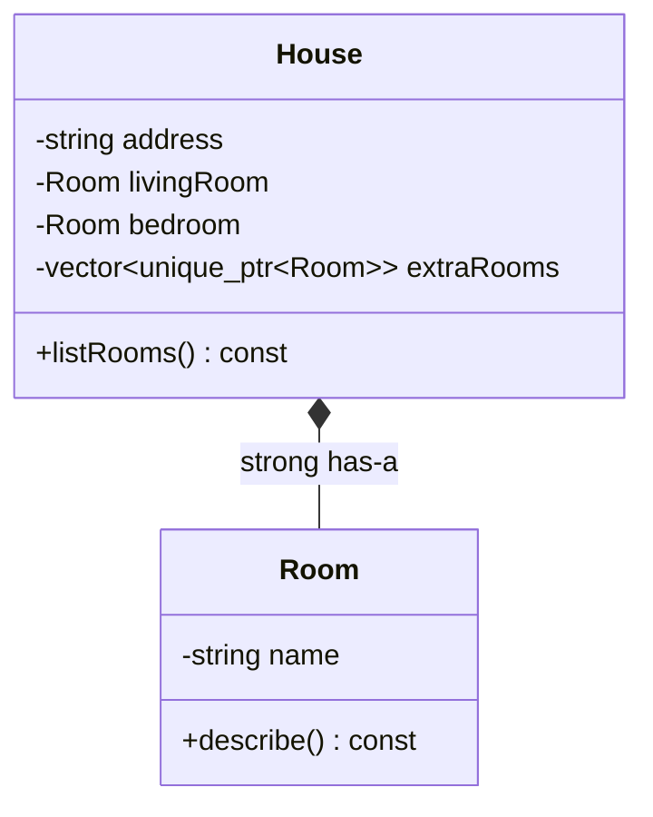
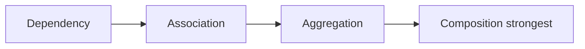
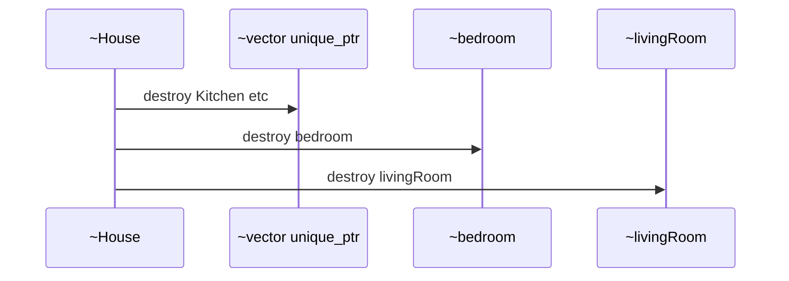
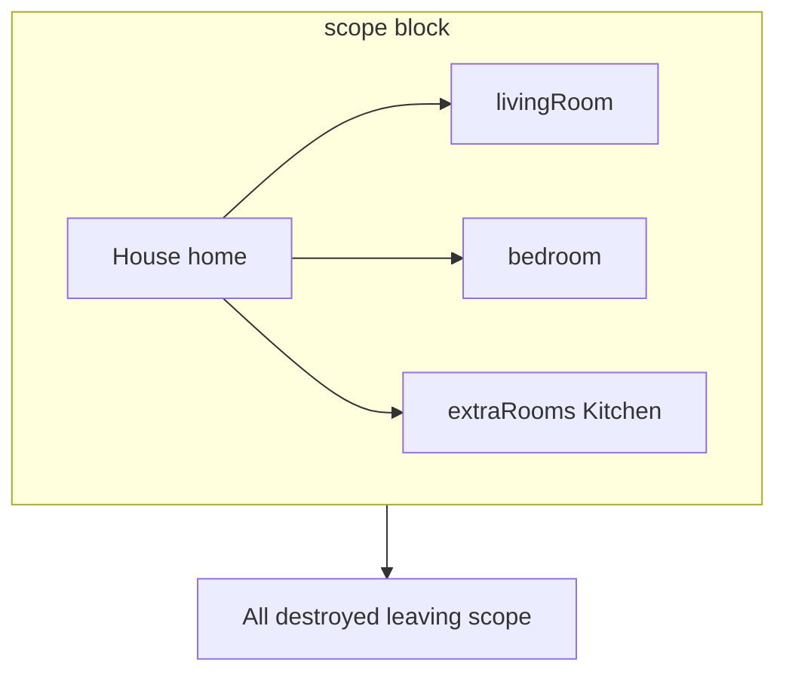
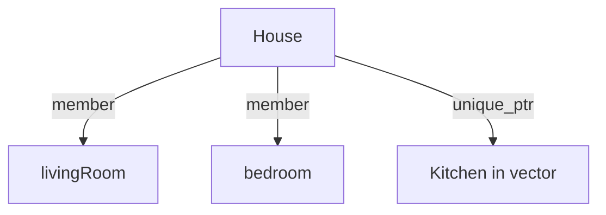
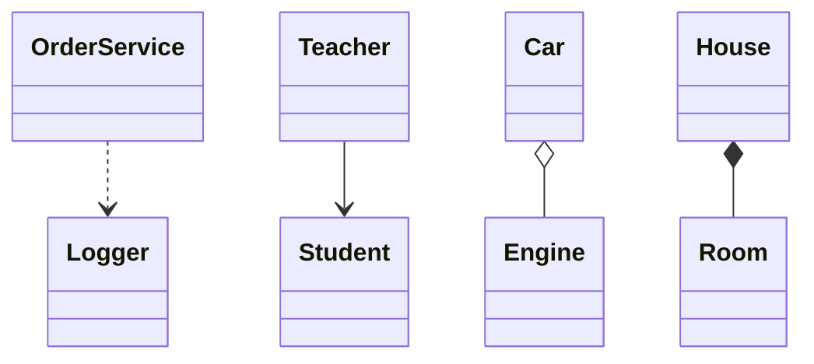
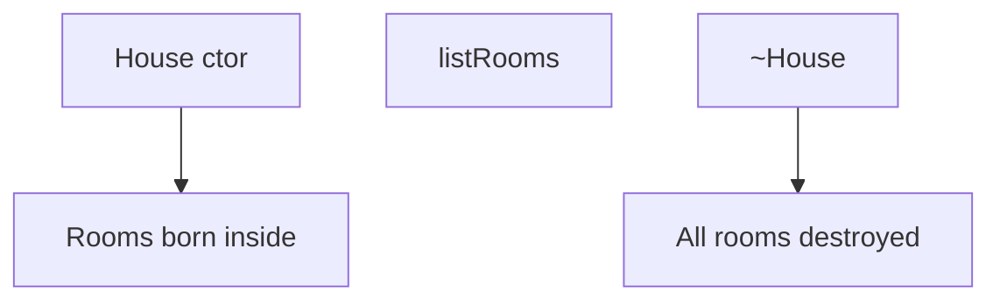

# Composition (Strong Has-A) — Complete Guide (Object Relationships #3)

> **Runnable code:** [`03_Composition.cpp`](../C++%20Code/03_Composition.cpp)  
> **Sibling guides:** [`01_Association.md`](01_Association.md) · [`02_Aggregation.md`](02_Aggregation.md) · [`04_Dependency.md`](04_Dependency.md)  
> **Master comparison:** [`OBJECT_RELATIONSHIPS_GUIDE.md`](../OBJECT_RELATIONSHIPS_GUIDE.md)  
> **Note:** Folder name `Composition` = relationship **type** family, not only this pattern.

---

## Table of Contents

1. [What is Composition?](#1-what-is-composition)
2. [UML — Filled Diamond](#2-uml--filled-diamond)
3. [Repo Walkthrough — House & Room](#3-repo-walkthrough--house--room)
4. [C++ Implementation Patterns](#4-c-implementation-patterns)
5. [Composition vs Other Relationships](#5-composition-vs-other-relationships)
6. [Lifetime & Destruction Order](#6-lifetime--destruction-order)
7. [unique_ptr & Member Subobjects](#7-unique_ptr--member-subobjects)
8. [Design Principles — Prefer Composition](#8-design-principles--prefer-composition)
9. [Real-World Examples](#9-real-world-examples)
10. [Common Mistakes](#10-common-mistakes)
11. [Mermaid Diagrams](#11-mermaid-diagrams)
12. [Interview Question Bank](#12-interview-question-bank)
13. [Cheat Sheet](#13-cheat-sheet)
14. [Hindi / English Glossary](#14-hindi--english-glossary)
15. [Extended Patterns](#15-extended-patterns)
16. [Build & Run](#16-build--run)
17. [Quick Revision Checklist](#17-quick-revision-checklist)

---

## 1. What is Composition?

### 1.1 Definition (English)

**Composition** is a **strong "has-a"** relationship. The whole **owns** its parts. Parts are **integral** to the whole — they **cannot exist independently** in the design intent. When the whole is destroyed, **parts are destroyed automatically**.

### 1.1 Definition (Hindi)

**Composition** = **मज़बूत has-a** — whole parts ka **malik** hai. Part whole ke **bina meaningful nahi** (is design me). Ghar toota to **kamre bhi khatam** — alag room zinda nahi rehta.

### 1.2 One-line interview answer

*"Composition = strong has-a; whole owns parts; parts die with whole; UML filled diamond ◆."*

### 1.3 Key properties

| Property | Composition |
| -------- | ----------- |
| Hindi | मज़बूत has-a / संरचना |
| Ownership | ✅ **Whole owns parts** |
| Lifetime | **Tied** — parts die with whole |
| UML | Filled diamond `◆` on whole |
| C++ | Member subobject / `unique_ptr` created in whole |
| Strength | **Strongest** in has-a family |

### 1.4 Metaphor — House & Room

```
    ┌──────── House ────────┐
    │  address              │
    │  ┌─ Room living ─┐    │
    │  ┌─ Room bed ────┤    │  ← parts INSIDE whole
    │  └─ extra rooms ┘    │
    └───────────────────────┘
         House dies → ALL rooms die
```

---

## 2. UML — Filled Diamond

### 2.1 Standard notation

```
        ◆
House ─────────── Room
   (filled diamond on House)
```

### 2.2 Mermaid



Mermaid `*--` = composition (filled diamond on left).

### 2.3 Diamond comparison table

| Symbol | Relationship | Delete part in ~Whole? |
| ------ | ------------ | ---------------------- |
| ◇ | Aggregation | ❌ No |
| ◆ | **Composition** | ✅ Automatic (member/unique_ptr) |
| (none) | Association | ❌ No |

### 2.4 Multiplicity

| Whole | Part | Typical |
| ----- | ---- | ------- |
| House | Room | 1..* many rooms |
| Document | Paragraph | 1..* |
| Tree | Node | 1..* children owned |

### 2.5 Whiteboard script

1. Draw House, Room.  
2. **Filled diamond ◆** on House.  
3. Say: **Room cannot exist without House** in this model.  
4. Map to **member objects** + **`unique_ptr` vector**.

---

## 3. Repo Walkthrough — House & Room

### 3.1 File header

From [`03_Composition.cpp`](../C++%20Code/03_Composition.cpp):

```cpp
/**
 * COMPOSITION — strong "Has-a"; part CANNOT exist without whole
 * House owns Room objects (member subobjects)
 * Room lifetime tied to House
 * UML: filled diamond ◆ on House side
 */
```

### 3.2 Room — controlled construction

```cpp
class Room {
    string name;
    friend class House;  // only House creates Room

    Room(string n) : name(n) {
        cout << "[Room] created inside House: " << name << "\n";
    }

public:
    void describe() const { cout << "  Room: " << name << "\n"; }
    ~Room() { cout << "[Room] destroyed: " << name << "\n"; }
};
```

| Design choice | Purpose |
| ------------- | ------- |
| **Private ctor** | Room **cannot** be constructed freely |
| **`friend class House`** | House ctor can create Room |
| Public dtor | Automatic cleanup when House dies |

### 3.3 House — owns rooms

```cpp
class House {
    string address;
    Room livingRoom;                      // member subobject — composition
    Room bedroom;                         // member subobject
    vector<unique_ptr<Room>> extraRooms;  // dynamic rooms — still owned

public:
    House(string addr)
        : address(addr),
          livingRoom("Living"),
          bedroom("Bedroom") {
        extraRooms.push_back(unique_ptr<Room>(new Room("Kitchen")));
        cout << "[House] created at " << address << "\n";
    }

    ~House() {
        cout << "[House] destroyed at " << address << " (all rooms go with it)\n";
    }

    void listRooms() const { /* ... */ }
};
```

### 3.4 Two composition mechanisms in one class

| Mechanism | Member | Destruction |
| --------- | ------ | ----------- |
| **Embedded subobject** | `Room livingRoom` | Automatic after House fields |
| **unique_ptr in vector** | `extraRooms` | vector dtor → unique_ptr → Room dtor |

Both express **strong ownership**.

### 3.5 main() scope proof

```cpp
int main() {
    {
        House home("221B Baker Street");
        home.listRooms();
    }  // All rooms destroyed automatically with House

    cout << "House scope ended — no Room objects left\n";
}
```

### 3.6 Expected destruction order (conceptual)

1. `~House` body runs (message)  
2. `extraRooms` destroyed (Kitchen Room)  
3. `bedroom` destroyed  
4. `livingRoom` destroyed  
5. members reverse order of construction  

C++ destroys members in **reverse declaration order**.

### 3.7 Output narrative

```
[Room] created inside House: Living
[Room] created inside House: Bedroom
[Room] created inside House: Kitchen
[House] created at 221B Baker Street
[House] rooms at ...
[House] destroyed at ... (all rooms go with it)
[Room] destroyed: Kitchen
[Room] destroyed: Bedroom
[Room] destroyed: Living
House scope ended — no Room objects left
```

---

## 4. C++ Implementation Patterns

### 4.1 Pattern catalog

| Pattern | Example | Composition signal |
| ------- | ------- | ------------------ |
| Member by value | `Room livingRoom;` | **Strongest** — part inside whole memory |
| `unique_ptr<T>` member | `unique_ptr<Room> kitchen;` | Exclusive ownership |
| `vector<unique_ptr<T>>` | Dynamic parts | Variable count owned children |
| Create in ctor | `make_unique<Room>(...)` | Whole controls birth |
| Private part ctor + friend | Repo Room | Part cannot escape alone |

### 4.2 Member subobject (preferred when fixed)

```cpp
class House {
    Room livingRoom;  // sizeof(House) includes Room layout
};
```

**Pros:** Simple, deterministic layout, automatic dtors.  
**Cons:** Fixed at compile time; heavy parts bloat `sizeof(House)`.

### 4.3 unique_ptr composition (flexible count)

```cpp
extraRooms.push_back(make_unique<Room>("Kitchen"));
```

Whole **must** destroy when House dies — `unique_ptr` ensures delete.

### 4.4 NOT composition patterns

```cpp
Room* livingRoom;  // pointer only — aggregation if no delete
Room* livingRoom; delete in ~House;  // manual composition — error-prone
shared_ptr<Room> with external refs;  // shared — weakens "part dies with whole"
```

### 4.5 Rule of Zero alignment

If all members are `string`, `vector<unique_ptr<Room>>`, etc., **compiler-generated** special members often suffice — still **composition** at design level.

### 4.6 Encapsulation + composition

Private Room ctor forces **all Room instances** through House — enforces **composition invariant**.

### 4.7 Move House

```cpp
House(House&&) = default;  // moves rooms with house — still composition
```

Whole moves — parts move with it (C++11 move).

---

## 5. Composition vs Other Relationships

### 5.1 Master comparison

| | Dependency | Association | Aggregation | **Composition** |
| --- | --- | --- | --- | --- |
| Ownership | ❌ | ❌ | ❌ | **✅** |
| Part outlives whole | — | Yes | Yes | **No** |
| UML | `..>` | `-->` | `o--` | **`*--` ◆** |
| C++ | param | `T*` no delete | `T*` no delete | **member / unique_ptr** |
| Demo | OrderService | Teacher | Car–Engine | **House–Room** |

### 5.2 Composition vs Aggregation (critical)

| Question | Aggregation (Car–Engine) | Composition (House–Room) |
| -------- | ------------------------ | ------------------------ |
| Part without whole? | Yes | **No (design)** |
| UML | ◇ hollow | **◆ filled** |
| C++ repo | `Engine*` external | **`Room` member** |
| ~Whole | No delete engine | **Rooms auto-destroyed** |

### 5.3 Composition vs Association

Association **knows** external objects. Composition **creates and owns** internal parts.

### 5.4 Composition vs Inheritance

| Composition (has-a) | Inheritance (is-a) |
| ------------------- | ------------------ |
| `Car has Engine` owned | `Dog is Animal` |
| **Prefer** when no substitutability | Use for true IS-A + LSP |
| "Composition over inheritance" mantra | Deep hierarchies fragile |

### 5.5 Strength spectrum



---

## 6. Lifetime & Destruction Order

### 6.1 Construction order

1. House ctor begins  
2. `address` init  
3. `livingRoom` ctor  
4. `bedroom` ctor  
5. `extraRooms` default ctor  
6. Kitchen allocated in body  
7. House ctor body completes  

**Members:** declared order. **Base classes:** before members.

### 6.2 Destruction order

**Reverse** of construction for members:



### 6.3 Scope block diagram



### 6.4 Hindi lifetime

> `{` block khatam → pehle Kitchen, phir bedroom, phir Living → **sab kuch ghar ke saath** — bahar koi Room nahi bacha.

### 6.5 Exception safety

If House ctor throws mid-way, **already constructed** subobjects destroyed — C++ stack unwinding — composition **RAII-safe**.

---

## 7. unique_ptr & Member Subobjects

### 7.1 When member by value

| Use | Reason |
| --- | ------ |
| Fixed small parts | Zero overhead indirection |
| Known at compile time | `Room livingRoom, bedroom` |

### 7.2 When unique_ptr

| Use | Reason |
| --- | ------ |
| Variable count | `vector<unique_ptr<Room>>` |
| Incomplete type / pimpl | Forward declare heavy part |
| Optional part | `unique_ptr<Garage>` nullable |

### 7.3 Repo hybrid

```cpp
Room livingRoom;                       // fixed
Room bedroom;                        // fixed
vector<unique_ptr<Room>> extraRooms; // variable
```

Real designs often **mix** — all still composition if House owns all.

### 7.4 shared_ptr — usually NOT strict composition

If parts **shared** with outside world and may survive House → reclassify as **aggregation** or shared ownership model.

### 7.5 raw pointer + delete — avoid

Manual `new`/`delete` in House works but violates **Rule of Zero** — prefer `unique_ptr`.

---

## 8. Design Principles — Prefer Composition

### 8.1 "Composition over inheritance"

| Problem with deep inheritance | Composition benefit |
| ----------------------------- | ------------------- |
| Fragile base class | Encapsulate behavior in parts |
| Diamond problem | No IS-A coupling |
| Hard to test | Inject/mock parts |

### 8.2 When composition is right

| Scenario | Example |
| -------- | ------- |
| Whole creates parts | House creates Rooms |
| Part useless alone | Document Paragraph |
| Exclusive lifetime | UI Window owns Buttons |
| Need swap implementation | Strategy object inside context |

### 8.3 When NOT composition

| Scenario | Better |
| -------- | ------ |
| Part shared across wholes | Aggregation / shared_ptr |
| Temporary helper | Dependency |
| True IS-A polymorphism | Inheritance + interface |

### 8.4 GRASP: Composite pattern link

**Composite** pattern (tree of owned children) is **composition** at scale — `vector<unique_ptr<Node>>`.

---

## 9. Real-World Examples

### 9.1 Domain table

| Whole | Part | Composition? |
| ----- | ---- | ------------ |
| House | Room | ✅ Repo |
| Computer | CPU socketed? | Often aggregation (swappable) |
| Computer | Motherboard traces | Composition |
| Document | Paragraph | ✅ |
| Order | LineItem | ✅ owned lines |
| Car | Chassis welded frame | Composition |
| Car | Removable radio | Aggregation |

### 9.2 Chair & Seat (Hindi)

Chair ka **seat** alag se bechne layak nahi jab design integrated ho — seat **chair ka hissa** hai. Chair tooti → seat bhi gayi.

### 9.3 Software — Widget tree

**Window** composes **Button** children — buttons destroyed when window closes.

### 9.4 vs Car Engine again

Engine **swap** ho sakta hai → **aggregation** model better. Room **swap without house** meaningless in repo → **composition**.

---

## 10. Common Mistakes

### 10.1 Mistakes table

| Mistake | Consequence | Fix |
| ------- | ----------- | --- |
| `Room*` without ownership | Leak or dangling | Member or unique_ptr |
| Public Room ctor everywhere | Rooms outside House | Private ctor + friend |
| Drawing ◇ for House–Room | Wrong UML | Use ◆ |
| shared_ptr part survives house | Wrong relationship label | unique_ptr |
| Delete order manual wrong | Double delete | Let members handle |
| Confuse folder name Composition | Think only this pattern | Folder = all relationships |

### 10.2 Interview trap

**Q:** "`vector<Room>` vs `vector<Room*>`?"  
**A:** `vector<Room>` — **owns** Room objects inline (composition). `vector<Room*>` non-owning → association/aggregation unless House deletes each.

### 10.3 Leaking Room

```cpp
Room* r = new Room("X");  // if public ctor — escapes house — NOT repo design
```

Repo prevents via **private Room ctor**.

---

## 11. Mermaid Diagrams

### 11.1 Class structure



### 11.2 Relationship map all four



### 11.3 Ownership flow



---

## 12. Interview Question Bank

**Q1.** Composition kya hai?  
**A.** Strong has-a; whole owns parts; parts die with whole.

**Q2.** UML symbol?  
**A.** Filled diamond ◆ on whole.

**Q3.** House Room delete manually?  
**A.** Nahi — automatic member/unique_ptr dtors.

**Q4.** Room private ctor kyun?  
**A.** Part whole ke bina na bane — enforce composition.

**Q5.** friend class House?  
**A.** House private Room ctor call kare.

**Q6.** vs Aggregation?  
**A.** Aggregation part outlives; composition tied lifetime.

**Q7.** livingRoom member type?  
**A.** `Room` by value — subobject.

**Q8.** extraRooms type?  
**A.** `vector<unique_ptr<Room>>` — owned dynamic.

**Q9.** Destruction order?  
**A.** Reverse member declaration order.

**Q10.** Composition over inheritance?  
**A.** Has-a preferred when no IS-A.

**Q11.** Hindi one-liner?  
**A.** Mazboot has-a; malik whole.

**Q12.** Can Room exist after House?  
**A.** Not in this design.

**Q13.** Mermaid?  
**A.** `House *-- Room`.

**Q14.** Engine in Car composition?  
**A.** Only if Car creates & destroys engine — repo uses aggregation.

**Q15.** unique_ptr vs member?  
**A.** Both composition; unique_ptr for variable/heavy.

**Q16.** shared_ptr parts?  
**A.** Shared ownership — weakens strict composition.

**Q17.** Scope block demo?  
**A.** All rooms gone after block.

**Q18.** File?  
**A.** 03_Composition.cpp.

**Q19.** sizeof House?  
**A.** Includes embedded Room subobjects.

**Q20.** Move House?  
**A.** Parts move with whole.

**Q21.** Exception in ctor?  
**A.** Subobjects already built are destroyed.

**Q22.** vector Room vs Room*?  
**A.** vector<Room> owns; Room* may not.

**Q23.** Document Paragraph?  
**A.** Classic composition example.

**Q24.** Widget Button?  
**A.** UI composition tree.

**Q25.** Diamond hollow here?  
**A.** No — filled only.

**Q26.** Whole part English?  
**A.** Whole owns part — integral.

**Q27.** Kitchen creation?  
**A.** new Room in House ctor — friend access.

**Q28.** listRooms const?  
**A.** Read-only on rooms.

**Q29.** External Room pointer?  
**A.** Would break composition invariant.

**Q30.** GRASP composite?  
**A.** Tree of owned children.

**Q31.** Pimpl idiom?  
**A.** unique_ptr<Impl> — composition.

**Q32.** Stack House?  
**A.** Stack allocation whole — parts inside.

**Q33.** Heap House?  
**A.** `unique_ptr<House>` still composes rooms inside.

**Q34.** Copy House?  
**A.** Deep copy all rooms if copyable — Rule of Five.

**Q35.** Delete copy?  
**A.** Non-copyable whole if unique identity.

**Q36.** Room name string?  
**A.** Member — also destroyed with Room.

**Q37.** Two House same Room?  
**A.** Impossible with member subobject — one room one house.

**Q38.** Serialization?  
**A.** Nested JSON — composition structure.

**Q39.** DB cascade delete?  
**A.** FK ON DELETE CASCADE — composition analogy.

**Q40.** Rust ownership?  
**A.** Parent owns Box<Child> — similar.

**Q41.** Composition folder name?  
**A.** All relationship types in folder.

**Q42.** Teacher Student?  
**A.** Association not composition.

**Q43.** Order LineItem owned?  
**A.** E-commerce composition.

**Q44.** Swappable CPU?  
**A.** Aggregation not composition.

**Q45.** RAII link?  
**A.** Composition uses RAII dtors.

**Q46.** unique_ptr in vector order destroy?  
**A.** Last element first in vector clear.

**Q47.** friend overuse?  
**A.** Minimal — only for ctor access here.

**Q48.** Public Room dtor?  
**A.** OK — destruction via House scope.

**Q49.** Summary Hindi?  
**A.** Ang whole ke saath jeete aur marte hain.

**Q50.** Strongest relationship?  
**A.** Composition in has-a family.

---

## 13. Cheat Sheet

```
┌───────────────────────────────────────────────────────────────┐
│ COMPOSITION (Strong Has-A)                                    │
│   Meaning:   whole OWNS parts                                 │
│   Lifetime:  parts DIE WITH whole                             │
│   UML:       House ◆──── Room                                 │
│   C++:       Room livingRoom;  vector<unique_ptr<Room>>       │
│   Enforce:   private part ctor + friend whole                 │
│   vs Agg:    ◆ vs ◇ ; delete tied vs independent              │
│   File:      03_Composition.cpp                               │
└───────────────────────────────────────────────────────────────┘
```

---

## 14. Hindi / English Glossary

| English | Hindi |
| ------- | ----- |
| Composition | composition / संरचना |
| Strong has-a | मज़बूत has-a |
| Filled diamond | भरा हीरा ◆ |
| Whole | संपूर्ण (House) |
| Part | अंश (Room) |
| Ownership | स्वामित्व |
| Subobject | उप-वस्तु (embedded member) |
| Lifetime tied | जीवन बंधा हुआ |
| Integral part | अभिन्न अंग |
| Destroy with | के साथ नष्ट |

---

## 15. Extended Patterns

### 15.1 vector<Room> all inline

```cpp
class House {
    vector<Room> rooms;  // owns Room objects contiguously
public:
    House() : rooms{Room("L"), Room("B")} {}  // if Room public — less strict
};
```

### 15.2 Composite tree

```cpp
class Node {
    vector<unique_ptr<Node>> children;
};
```

### 15.3 Pimpl

```cpp
class House {
    class Impl;
    unique_ptr<Impl> pimpl;
};
```

### 15.4 Non-copyable whole

```cpp
House(const House&) = delete;
House& operator=(const House&) = delete;
```

Unique identity composition — one house one address.

---

## 16. Build & Run

```bash
g++ -std=c++17 -Wall -o /tmp/comp "C++ Code/03_Composition.cpp" && /tmp/comp
```

**Verify:** Room dtors after House dtor message; "no Room objects left".

---

## 17. Quick Revision Checklist

- [ ] **Strong has-a** — whole **owns** parts
- [ ] **Filled diamond ◆** on House
- [ ] **`Room` members** + **`unique_ptr` vector**
- [ ] **Private Room ctor** + **friend House**
- [ ] Parts **destroyed with** House — no manual delete
- [ ] vs **Aggregation**: Engine outlives Car
- [ ] vs **Association**: no ownership at all
- [ ] Ran [`03_Composition.cpp`](../C++%20Code/03_Composition.cpp)

---

*End of guide — Composition (Strong Has-A)*
