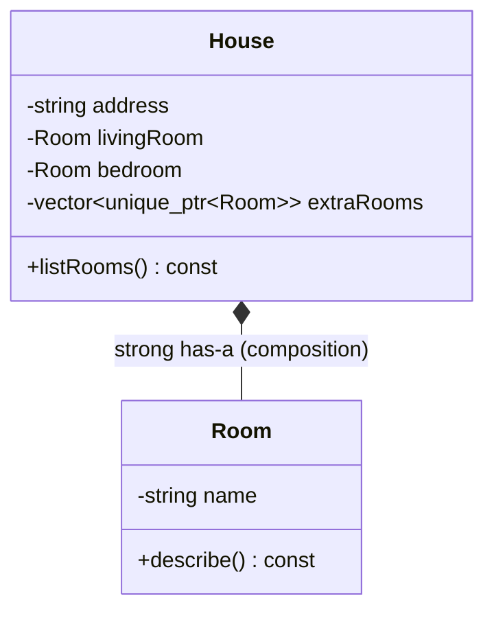
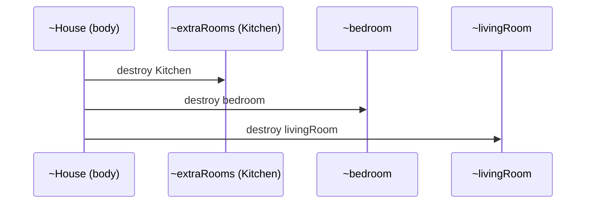

# Composition (Strong Has-A) — Object Relationships (3 of 4)

> **Runnable code:** [`03_Composition.cpp`](../C++%20Code/03_Composition.cpp)
> **Related guides:** [`01_Association.md`](01_Association.md) · [`02_Aggregation.md`](02_Aggregation.md) · [`04_Dependency.md`](04_Dependency.md)
> **Master comparison:** [`OBJECT_RELATIONSHIPS_GUIDE.md`](../OBJECT_RELATIONSHIPS_GUIDE.md)
> **Note:** The folder is named *Composition* because it covers the whole family of object relationships — this file is specifically about the composition relationship.

---

## Contents

1. [Overview](#1-overview)
2. [The Theory in Depth](#2-the-theory-in-depth)
3. [Formal Characteristics](#3-formal-characteristics)
4. [UML Notation — The Filled Diamond](#4-uml-notation--the-filled-diamond)
5. [When to Use Composition](#5-when-to-use-composition)
6. [When NOT to Use Composition](#6-when-not-to-use-composition)
7. [Code Walkthrough — House & Room](#7-code-walkthrough--house--room)
8. [C++ Implementation Patterns](#8-c-implementation-patterns)
9. [Construction & Destruction Order](#9-construction--destruction-order)
10. [Member Sub-objects vs `unique_ptr`](#10-member-sub-objects-vs-unique_ptr)
11. [Composition vs the Other Three Relationships](#11-composition-vs-the-other-three-relationships)
12. ["Favor Composition over Inheritance"](#12-favor-composition-over-inheritance)
13. [Real-World Examples](#13-real-world-examples)
14. [Common Pitfalls](#14-common-pitfalls)
15. [Interview Preparation](#15-interview-preparation)
16. [Summary & Cheat Sheet](#16-summary--cheat-sheet)

---

## 1. Overview

**Composition** is the **strong "has-a"** relationship. The whole **owns** its parts: it creates them, controls them, and destroys them. The parts are **integral** to the whole — in the intended design they **cannot exist independently**. When the whole is destroyed, its parts are destroyed **automatically and deterministically**.

The canonical statement is *"a house has rooms."* Rooms are created as part of building the house and cease to exist when the house is demolished; you cannot pick up a room and carry it off to another house.

In the strength spectrum, composition is the strongest has-a:

```
weaker  ──────────────────────────────────────────────►  stronger
 Dependency   →   Association   →   Aggregation   →   Composition
                                                       (strong has-a,
                                                        exclusive ownership,
                                                        tied lifetime)
```

---

## 2. The Theory in Depth

### 2.1 The three ideas that define composition

1. **Exclusive ownership.** Each part belongs to exactly one whole. The whole is responsible for the part's creation and destruction; no other object shares that responsibility.
2. **Coincident lifetime.** The part's lifetime is *contained within* the whole's. Parts are born when (or after) the whole is born and die when the whole dies. There is no moment at which a part exists without its whole.
3. **Integral, non-shareable parts.** A part is a genuine constituent of the whole, not a resource borrowed from elsewhere. It is not shared between wholes and is not swapped in from an external pool.

### 2.2 Composition is the C++ default, and it is safe

Composition is what you get naturally with **member sub-objects** and **`std::unique_ptr` members**. It is the safest relationship to implement because the language handles the part lifetimes for you: member destructors run automatically in reverse construction order, and `unique_ptr` deletes its managed object when the whole is destroyed. There is no manual `new`/`delete` to get wrong, which is why composition aligns with the **Rule of Zero**.

### 2.3 The lifetime signal (mirror of aggregation)

Ask the decisive question again: **"When the whole is destroyed, is the part destroyed too?"** For composition the answer is **yes, always**. The demo makes this observable — leaving the scope destroys the `House`, and every `Room` is destroyed with it. No room survives the house.

### 2.4 Enforcing the invariant in code

The demo goes one step further than most examples: it makes the `Room` constructor **private** and declares `House` a **friend**. This means a `Room` **cannot be constructed anywhere except inside a `House`**. The composition invariant — "a part cannot exist without its whole" — is not merely documented; it is enforced by the type system. This is a strong, professional way to encode an ownership contract.

---

## 3. Formal Characteristics

| Characteristic | Composition |
| -------------- | ----------- |
| Intent phrase | "has-a (strong)" — whole owns integral parts |
| Ownership | **Exclusive** — the whole owns the part |
| Lifetime coupling | **Tied** — the part is destroyed with the whole |
| Sharing | None — a part belongs to exactly one whole |
| Part created | By the whole (in its constructor / body) |
| UML symbol | Filled diamond on the whole's end: `◆──` |
| Typical C++ representation | Member sub-object (`Room r;`) or `std::unique_ptr<T>` |
| Coupling strength | **Strongest** in the has-a family |

**Mental model:**

```
   ┌──────────── House ─────────────┐
   │ address                        │
   │  ┌─ Room  livingRoom ─┐        │
   │  ┌─ Room  bedroom ─────┤       │   ← parts live INSIDE the whole
   │  └─ unique_ptr<Room> …─┘       │
   └────────────────────────────────┘
        destroy the House  ⇒  every Room is destroyed with it
```

---

## 4. UML Notation — The Filled Diamond

### 4.1 Standard symbol

Composition is drawn as a solid line with a **filled (solid) diamond** on the **whole's** end. The filled diamond means "strong has-a: the whole owns the part, and the part's lifetime is bound to the whole's."

```
        ◆
  House ────────────── Room
   (filled diamond on the House side)
```

### 4.2 Hollow vs filled diamond

| `◇` Hollow (Aggregation) | `◆` Filled (Composition) |
| ------------------------ | ------------------------ |
| Part outlives the whole | Part dies with the whole |
| Whole does not own the part | Whole owns and destroys the part |
| Part shareable / reusable | Part exclusive to one whole |
| `Engine*` injected, no delete | `Room` member / `unique_ptr` |

### 4.3 Mermaid class diagram



Mermaid's `*--` renders the filled diamond on the whole (left) side.

---

## 5. When to Use Composition

Choose composition when **all** of the following hold:

1. **The part is integral to the whole.** "The part is a genuine constituent of the whole" — a room of a house, a line item of an order, a node of a tree.
2. **The part should not exist without the whole.** In the domain, a standalone part is meaningless.
3. **The whole should manage the part's lifetime.** Creation and destruction are the whole's responsibility, and tying them together simplifies reasoning.
4. **The part is not shared.** Exactly one whole owns each part.

### 5.1 Decision checklist

| Question | If **yes** → composition is appropriate |
| -------- | --------------------------------------- |
| Would a standalone part be meaningless? | Confirms the "cannot exist alone" intent |
| Should the part be destroyed with the whole? | Confirms tied lifetime |
| Does exactly one whole own the part? | Confirms exclusive ownership |
| Does the whole create the part itself? | Confirms internal construction |

### 5.2 Typical use cases

- **Aggregate roots that own their contents** — an `Order` owning its `LineItem`s, a `Document` owning its `Paragraph`s.
- **Tree and graph structures** — a `Node` owning its child `Node`s (the Composite pattern is composition applied recursively).
- **UI object trees** — a `Window` owning its child widgets, destroyed when the window closes.
- **The Pimpl idiom** — a class owning a `unique_ptr<Impl>` that is created and destroyed with it.

---

## 6. When NOT to Use Composition

| Situation | Prefer instead | Reason |
| --------- | -------------- | ------ |
| The part must be shared across wholes | **Aggregation / `shared_ptr`** | Composition forbids sharing |
| The part must outlive the whole or be swapped | **Aggregation** | Composition ties the part's lifetime to the whole |
| The collaborator is used only in one method | **Dependency** | No owned member is needed |
| The relationship is substitutability (*is-a*) | **Inheritance** | Composition is has-a, not is-a |

---

## 7. Code Walkthrough — House & Room

From [`03_Composition.cpp`](../C++%20Code/03_Composition.cpp).

### 7.1 The part cannot be built outside the whole

```cpp
class Room {
    string name;
    friend class House;                     // only House may construct a Room

    Room(string n) : name(n) {              // PRIVATE constructor
        cout << "[Room] created inside House: " << name << "\n";
    }
public:
    void describe() const { cout << "  Room: " << name << "\n"; }
    ~Room() { cout << "[Room] destroyed: " << name << "\n"; }
};
```

| Design choice | Purpose |
| ------------- | ------- |
| Private constructor | A `Room` cannot be created freely — only through a `House` |
| `friend class House` | Grants the house the right to construct its rooms |
| Public destructor | Allows automatic cleanup when the house is destroyed |

This is the composition invariant made unbreakable by the compiler.

### 7.2 The whole owns its parts — two mechanisms

```cpp
class House {
    string address;
    Room livingRoom;                        // (1) member sub-object — owned
    Room bedroom;                           // (1) member sub-object — owned
    vector<unique_ptr<Room>> extraRooms;    // (2) owned dynamic parts

public:
    House(string addr)
        : address(addr),
          livingRoom("Living"),             // constructed as the house is built
          bedroom("Bedroom") {
        extraRooms.push_back(unique_ptr<Room>(new Room("Kitchen")));
    }

    ~House() {
        cout << "[House] destroyed (all rooms go with it)\n";
    }
    // No manual delete — members and unique_ptr clean themselves up.
};
```

Both mechanisms express ownership: **member sub-objects** are part of the house's own storage, and **`unique_ptr` members** hold exclusively owned heap parts. Either way, destroying the house destroys the rooms.

### 7.3 Lifetime proof in `main()`

```cpp
int main() {
    {
        House home("221B Baker Street");
        home.listRooms();
    }   // House destroyed here → all rooms destroyed automatically

    cout << "House scope ended — no Room objects left\n";
}
```

The console shows the house's destructor message followed by every room's destructor message. Not a single room survives the scope — the observable proof of composition.

---

## 8. C++ Implementation Patterns

### 8.1 Representation options

| Representation | When to use | Ownership signal |
| -------------- | ----------- | ---------------- |
| Member by value (`Room r;`) | Fixed, known-at-compile-time parts | Strongest — the part lives inside the whole's storage |
| `std::unique_ptr<T>` member | Optional, polymorphic, or heavy parts; forward-declared types | Exclusive ownership of a heap part |
| `std::vector<std::unique_ptr<T>>` | A variable number of owned parts | Owned dynamic collection |
| Private part constructor + `friend` | To *enforce* that parts are only built by the whole | Compiler-enforced invariant |

### 8.2 Member sub-object vs `unique_ptr`

```cpp
Room livingRoom;                         // member sub-object: no indirection
vector<unique_ptr<Room>> extraRooms;     // dynamic, variable count
```

Prefer a **member by value** for fixed, lightweight parts (zero indirection, deterministic layout). Prefer **`unique_ptr`** when the count varies, the part is heavy, the type is polymorphic, or you need to forward-declare an incomplete type (as in the Pimpl idiom).

### 8.3 What is *not* composition

```cpp
Room* livingRoom;                        // raw pointer, no delete → aggregation
shared_ptr<Room> livingRoom;             // shared ownership → weakens "dies with whole"
```

A raw non-owning pointer is aggregation or association; a `shared_ptr` that is also referenced elsewhere is shared ownership. Strict composition uses a member or `unique_ptr`.

### 8.4 Rule of Zero

Because member sub-objects and `unique_ptr`s clean themselves up, a composed class usually needs **no user-declared destructor, copy, or move operations** — the compiler-generated ones are correct. Writing manual `new`/`delete` pairs invites leaks and double-frees; let ownership types do the work.

---

## 9. Construction & Destruction Order

### 9.1 Construction

Members are constructed in **declaration order**, before the constructor body runs:

1. `address`
2. `livingRoom`
3. `bedroom`
4. `extraRooms` (empty), then `Kitchen` is pushed in the body

### 9.2 Destruction

Members are destroyed in the **reverse** of construction order, after the destructor body runs:



### 9.3 Exception safety

If the house's constructor throws partway through, the C++ runtime destroys the **already-constructed** sub-objects during stack unwinding. Composition via members and `unique_ptr` is therefore **exception-safe by construction** — a partially built whole never leaks its already-built parts.

---

## 10. Member Sub-objects vs `unique_ptr`

| Aspect | Member sub-object (`Room r;`) | `unique_ptr<Room>` member |
| ------ | ----------------------------- | ------------------------- |
| Storage | Inside the whole's memory | Heap; the whole holds a pointer |
| Count | Fixed at compile time | Variable (with a container) |
| Polymorphism | No (concrete type) | Yes (base pointer to derived) |
| Incomplete/forward-declared type | Not allowed | Allowed (Pimpl idiom) |
| Overhead | None (no indirection) | One allocation + indirection |
| Lifetime | Tied to the whole automatically | Tied to the whole via the smart pointer |

Real designs often **mix** the two, exactly as the demo does — fixed rooms as members, extra rooms as owned `unique_ptr`s in a vector. Both are composition because the house owns them all.

---

## 11. Composition vs the Other Three Relationships

### 11.1 Master comparison

| | Dependency | Association | Aggregation | **Composition** |
| --- | --- | --- | --- | --- |
| Intent | uses (temporarily) | knows / uses | weak has-a | **strong has-a** |
| Ownership | None | None | None | **Exclusive (whole owns part)** |
| Part outlives whole | — | Yes | Yes | **No** |
| UML | dashed `··▶` | solid `──▶` | hollow `◇──` | **filled `◆──`** |
| C++ | parameter | `T*` (no delete) | `T*` (no delete) | **member / `unique_ptr`** |
| Repo file | `04` | `01` | `02` | **`03`** |

### 11.2 Composition vs Aggregation (the critical pair)

The distinction is **ownership and lifetime**:

| Question | Aggregation (Car–Engine) | Composition (House–Room) |
| -------- | ------------------------ | ------------------------ |
| Can the part exist without the whole? | Yes | No (by design) |
| Who destroys the part? | An external owner | The whole |
| Is the part shareable/swappable? | Yes | No |
| UML diamond | Hollow `◇` | Filled `◆` |
| C++ member | `Engine*` (no delete) | `Room` / `unique_ptr` |

### 11.3 Composition vs Association

An association only *knows* an external object; composition *creates and owns* an internal part and destroys it.

---

## 12. "Favor Composition over Inheritance"

Composition is the mechanism behind one of object-oriented design's most-repeated guidelines.

| Problem with deep inheritance | How composition helps |
| ----------------------------- | --------------------- |
| Fragile base class — a base change ripples into all subclasses | Behavior lives in owned parts, isolated from the whole |
| Rigid hierarchies — subtype fixed at compile time | Parts can be swapped or reconfigured at runtime |
| Multiple-inheritance / diamond ambiguity | Owning several parts avoids inheritance ambiguity entirely |
| Hard to test | Parts can be substituted with test doubles |

Use inheritance only when there is a genuine **is-a** substitutability relationship that satisfies the Liskov Substitution Principle; otherwise prefer **has-a** composition. Design patterns such as **Strategy**, **Decorator**, and **Composite** are, at their core, applications of composition.

---

## 13. Real-World Examples

| Whole | Part | Why it is composition |
| ----- | ---- | --------------------- |
| House | Room | A room has no meaning outside its house and dies with it |
| Order | Line item | Line items exist only within their order |
| Document | Paragraph | Paragraphs are owned by, and destroyed with, the document |
| Tree | Node | Each node owns its children exclusively |
| Window (UI) | Child widgets | Widgets are destroyed when the window closes |
| Car | Welded chassis frame | The frame is integral and not reused (contrast: a removable radio would be aggregation) |

**Narrative (Order–LineItem).** An order owns its line items: they are created when the order is placed and are discarded when the order is deleted. A line item has no independent existence — it is not shared with another order and is not stored anywhere on its own. This is composition, typically implemented as `std::vector<LineItem>` or `std::vector<std::unique_ptr<LineItem>>` owned by the order.

---

## 14. Common Pitfalls

| Pitfall | Consequence | Fix |
| ------- | ----------- | --- |
| Raw `T*` member with manual `new`/`delete` | Leaks or double-frees | Use a member sub-object or `unique_ptr` |
| Public part constructor everywhere | Parts escape the whole; invariant broken | Private constructor + `friend` whole |
| Drawing a hollow diamond for owned parts | Incorrect UML | Use the filled diamond |
| `shared_ptr` member referenced elsewhere | Part outlives the whole — no longer strict composition | Use `unique_ptr` for exclusive ownership |
| Manual destruction order | Double-free or use-after-free | Let members and `unique_ptr` handle destruction |

**Interview trap.** *"`vector<Room>` vs `vector<Room*>` — which is composition?"* `vector<Room>` **owns** its `Room` objects inline — composition. `vector<Room*>` holds non-owning pointers — association/aggregation unless the whole explicitly deletes each element, in which case it is manual (error-prone) composition that should be `vector<unique_ptr<Room>>` instead.

---

## 15. Interview Preparation

**Q1. Define composition.**
A strong "has-a" relationship in which the whole exclusively owns integral parts and destroys them when it is destroyed.

**Q2. What is the UML symbol?**
A solid line with a filled diamond on the whole's end.

**Q3. How does it differ from aggregation?**
Composition owns the part and ties its lifetime to the whole (part dies with the whole); aggregation is non-owning and the part outlives the whole.

**Q4. How is it represented in C++?**
A member sub-object or a `unique_ptr` member (or a `vector<unique_ptr<T>>` for many parts).

**Q5. What is the destruction order of members?**
Reverse of declaration/construction order, after the destructor body.

**Q6. Why is composition exception-safe?**
If the constructor throws, already-constructed members are destroyed during stack unwinding — no leak of the built parts.

**Q7. How can you enforce that a part is only created by its whole?**
Make the part's constructor private and declare the whole a `friend`.

**Q8. What does "favor composition over inheritance" mean?**
Prefer owning collaborating parts over deep class hierarchies unless a true is-a relationship exists; it reduces coupling and increases flexibility.

**Q9. When does `shared_ptr` break strict composition?**
When the part is also referenced elsewhere, so it can outlive the whole — that is shared ownership, not composition.

**Q10. Give a real-world composition example and justify it.**
Order–LineItem: line items exist only within the order, are not shared, and are destroyed with it.

---

## 16. Summary & Cheat Sheet

```
COMPOSITION  (strong has-a; #4 of 4, strongest)
  Intent      : whole OWNS integral parts
  Ownership   : EXCLUSIVE — one whole owns each part
  Lifetimes   : TIED — parts are destroyed with the whole
  Sharing     : none — a part belongs to exactly one whole
  UML         : House ◆────── Room   (filled diamond on the whole)
  C++         : Room livingRoom;  or  vector<unique_ptr<Room>>
  Enforce     : private part constructor + friend whole
  vs Aggregation : owned & tied lifetime (filled vs hollow diamond)
  vs Association  : creates and owns vs merely knows
  Repo file   : 03_Composition.cpp
```

**One-line takeaway:** *Composition is an exclusive, lifetime-bound "has-a" — the whole creates its parts, owns them, and destroys them together.*

---

*End of guide — Composition (Strong Has-A).*
