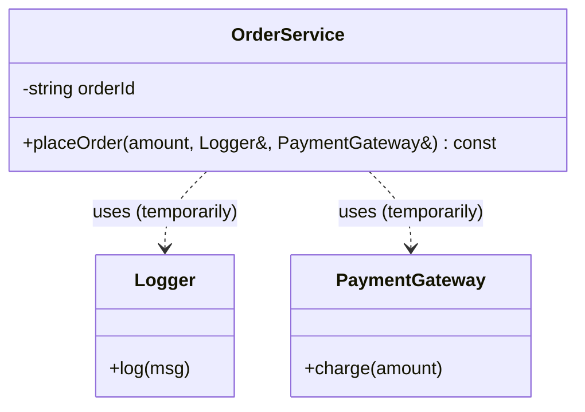
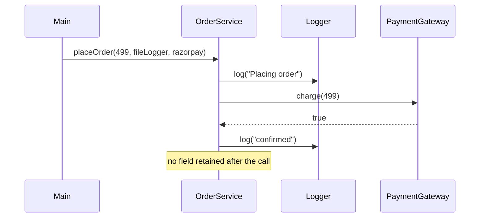
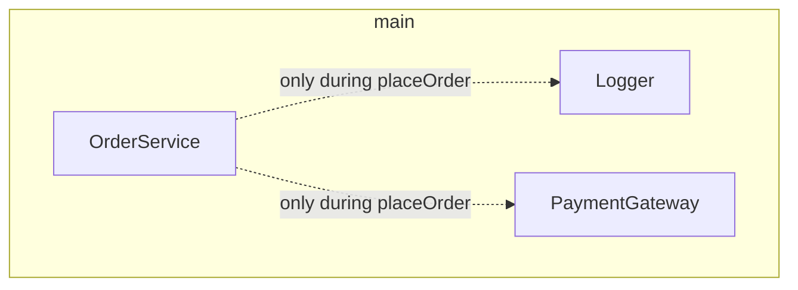
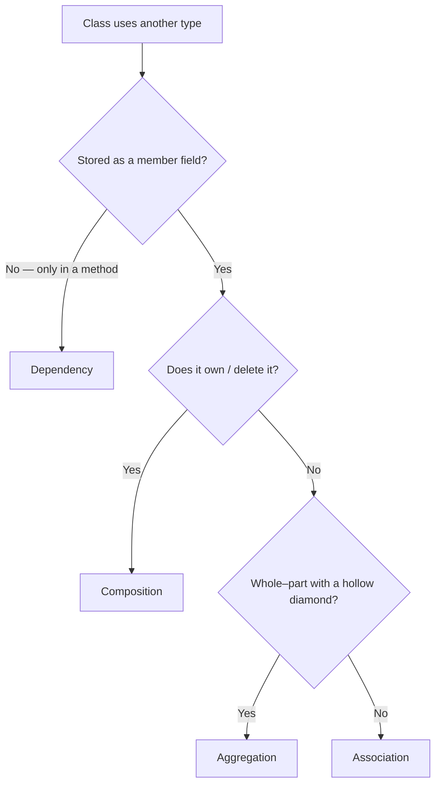

# Dependency — Object Relationships (4 of 4)

> **Runnable code:** [`04_Dependency.cpp`](../C++%20Code/04_Dependency.cpp)
> **Related guides:** [`01_Association.md`](01_Association.md) · [`02_Aggregation.md`](02_Aggregation.md) · [`03_Composition_Strong_HasA.md`](03_Composition_Strong_HasA.md)
> **Master comparison:** [`OBJECT_RELATIONSHIPS_GUIDE.md`](../OBJECT_RELATIONSHIPS_GUIDE.md)

---

## Contents

1. [Overview](#1-overview)
2. [The Theory in Depth](#2-the-theory-in-depth)
3. [Formal Characteristics](#3-formal-characteristics)
4. [UML Notation — The Dashed Arrow](#4-uml-notation--the-dashed-arrow)
5. [When to Use Dependency](#5-when-to-use-dependency)
6. [When NOT to Use Dependency](#6-when-not-to-use-dependency)
7. [Code Walkthrough — OrderService](#7-code-walkthrough--orderservice)
8. [C++ Implementation Patterns](#8-c-implementation-patterns)
9. [Lifetime & Scope Semantics](#9-lifetime--scope-semantics)
10. [Dependency Injection](#10-dependency-injection)
11. [Dependency vs the Other Three Relationships](#11-dependency-vs-the-other-three-relationships)
12. [Design Trade-offs & SOLID](#12-design-trade-offs--solid)
13. [Real-World Examples](#13-real-world-examples)
14. [Common Pitfalls](#14-common-pitfalls)
15. [Interview Preparation](#15-interview-preparation)
16. [Summary & Cheat Sheet](#16-summary--cheat-sheet)

---

## 1. Overview

**Dependency** is the **weakest** structural relationship. One class **uses** another **temporarily** — the collaborator appears as a **method parameter**, a **local variable**, or a **momentary reference**, but is **never stored as a member field**. The collaboration lasts only for the duration of the operation; once the method returns, the relationship is gone.

The canonical statement is *"uses-a (temporarily)."* An `OrderService` **uses** a `Logger` and a `PaymentGateway` while placing an order, but it does not keep them — it holds no logger or gateway field after the call completes.

In the strength spectrum, dependency sits at the weak end:

```
weaker  ──────────────────────────────────────────────►  stronger
 Dependency   →   Association   →   Aggregation   →   Composition
 (temporary,
  method-scoped,
  no field)
```

---

## 2. The Theory in Depth

### 2.1 What "dependency" really models

A dependency records that a class **needs another type to perform a specific operation**, without establishing any lasting structural link. The relationship exists at the level of a **method signature**, not the class's fields. Formally: *"To do this one job, I need to be handed (or briefly create) this collaborator."*

The decisive property is **absence of a stored field**. If you open the class definition and the collaborator is **not** a member — it appears only inside method parameters or as a local — the relationship is a dependency.

### 2.2 Why the weakest link is often the best default

Weak coupling is a feature, not a limitation. Because `OrderService` does not hold a `Logger` field, it does not need a logger to be constructed, it can use a **different** logger on each call, and it makes its needs **explicit in the method signature**. Minimizing what a class permanently depends on is a core goal of good design; a dependency is the lightest way to express "I need this, but only for a moment."

### 2.3 Compile-time dependency vs modeling dependency

Two different things share the word "dependency":

- **Compile-time dependency** — one file `#include`s another's header. Almost every class has these; they are not usually drawn on class diagrams because they would add noise.
- **Modeling (runtime) dependency** — a class uses another *as a collaborator inside a method*. This is the UML relationship discussed here and the one that matters for design conversations.

When an interviewer asks about dependency, they mean the **modeling** kind: a temporary, method-scoped collaboration.

### 2.4 Dependency is the seam for testing

Because the collaborator is supplied from outside per call, a dependency is naturally **substitutable**. In a test you can pass a fake logger or a stub payment gateway and verify behavior without touching real infrastructure. This substitutability is the foundation of **dependency injection** and is a major reason to prefer explicit dependencies over hidden global singletons.

---

## 3. Formal Characteristics

| Characteristic | Dependency |
| -------------- | ---------- |
| Intent phrase | "uses-a (temporarily)" |
| Ownership | None |
| Stored as a member? | **No** — parameter, local, or momentary reference |
| Duration | A single method call / operation |
| UML symbol | Dashed line with an open arrowhead: `··▶` |
| Direction | From the dependent (client) to the supplier (used) |
| Typical C++ representation | Method parameter (`f(Logger&)`), local variable, static call |
| Coupling strength | **Weakest** |

**Mental model:**

```
OrderService  · · · uses · · ▶  Logger
              (dashed — only during placeOrder(); no field, no ownership)
```

---

## 4. UML Notation — The Dashed Arrow

### 4.1 Standard symbol

A dependency is drawn as a **dashed line** with an **open arrowhead** pointing from the **dependent** class (the one that uses) to the **supplier** class (the one being used). It is the lightest arrow in UML, reflecting the weakest coupling.

```
OrderService  · · · · · ▶  Logger
              (dashed dependency)
```

### 4.2 UML element reference

| Element | Meaning in a dependency |
| ------- | ----------------------- |
| Dashed line | A transient, non-structural link |
| Open arrowhead | Points to the used (supplier) class |
| No diamond | Not a has-a (aggregation/composition) relationship |
| Optional stereotypes | `«use»`, `«call»`, `«create»`, `«parameter»` |

### 4.3 All four arrows at a glance

| Arrow | Style | Relationship |
| ----- | ----- | ------------ |
| `··▶` | Dashed | **Dependency** |
| `──▶` | Solid | Association |
| `◇──` | Solid + hollow diamond | Aggregation |
| `◆──` | Solid + filled diamond | Composition |

### 4.4 Mermaid class diagram



Mermaid's `..>` renders the dashed dependency arrow.

---

## 5. When to Use Dependency

Choose a dependency (a method-level collaborator, not a field) when **all** of the following hold:

1. **The collaborator is needed only inside one operation.** After the method returns, the class has no further use for it.
2. **No durable link is required.** The class does not need to "remember" the collaborator between calls.
3. **You want minimal, explicit coupling.** The need appears in the method signature and nowhere else.
4. **The collaborator may differ per call.** Different callers can supply different implementations.

### 5.1 Decision checklist

| Question | If **yes** → a dependency is appropriate |
| -------- | ---------------------------------------- |
| Is the collaborator used only within a single method? | Confirms method-scoped use |
| Would storing it as a field add no value? | Confirms no durable link is needed |
| Should the caller decide which implementation to pass? | Confirms per-call flexibility |
| Do you want the class constructible without this collaborator? | Confirms it should not be a constructor dependency |

### 5.2 Typical use cases

- **Utilities and services used once per operation** — logging or payment during `placeOrder`.
- **Callbacks and comparators** — a comparison function passed to a sort algorithm.
- **Framework handler parameters** — an HTTP handler receiving `Request` and `Response` objects for one invocation.
- **Clean-architecture use cases** — an interactor receiving a repository interface as a method parameter for a single `execute` call.

---

## 6. When NOT to Use Dependency

| Situation | Prefer instead | Reason |
| --------- | -------------- | ------ |
| The class must remember the collaborator across calls | **Association** | Store a non-owning member field |
| A whole–part relationship exists | **Aggregation** | Model the part with a member and a hollow diamond |
| The class should own and destroy the collaborator | **Composition** | Use a member or `unique_ptr` |
| The relationship is substitutability (*is-a*) | **Inheritance** | Dependency models use, not subtype polymorphism |

---

## 7. Code Walkthrough — OrderService

From [`04_Dependency.cpp`](../C++%20Code/04_Dependency.cpp).

### 7.1 The collaborators are independent services

```cpp
class Logger {
public:
    void log(const string& msg) const { cout << "[Logger] " << msg << "\n"; }
};

class PaymentGateway {
public:
    bool charge(double amount) const {
        cout << "[PaymentGateway] charged Rs " << amount << "\n";
        return true;
    }
};
```

Neither class has any link back to `OrderService`; they are standalone.

### 7.2 The dependency lives in the method signature

```cpp
class OrderService {
    string orderId;                         // the ONLY field — no logger, no gateway
public:
    explicit OrderService(string id) : orderId(id) {}

    void placeOrder(double amount, Logger& logger, PaymentGateway& gateway) const {
        logger.log("Placing order " + orderId);
        if (gateway.charge(amount))
            logger.log("Order " + orderId + " confirmed");
    }
};
```

| Observation | What it proves |
| ----------- | -------------- |
| The only field is `orderId` | No collaborator is stored |
| `Logger&` and `PaymentGateway&` are parameters | The collaboration is method-scoped |
| No member assignment from the parameters | The relationship ends when the method returns |

### 7.3 Collaborators are supplied at the call site

```cpp
int main() {
    OrderService order("ORD-101");

    Logger fileLogger;
    PaymentGateway razorpay;

    order.placeOrder(499.0, fileLogger, razorpay);   // injected for this one call

    // OrderService retains no reference to either collaborator afterward.
}
```

### 7.4 Call sequence



---

## 8. C++ Implementation Patterns

### 8.1 Representation options

| Representation | Example | Dependency? |
| -------------- | ------- | ----------- |
| Method parameter (reference) | `void f(Logger& log)` | Yes (primary) |
| Method parameter (pointer) | `void f(Logger* log)` | Yes (optional/nullable) |
| Local variable in a method | `Logger tmp; use(tmp);` | Yes |
| Static / free-function call | `Logger::global().log(...)` | Yes (use dependency) |
| Callable parameter | `void f(std::function<void(string)> log)` | Yes (functional injection) |
| **Member field** | `Logger* log;` | **No** → association |

### 8.2 Parameter styles

```cpp
void placeOrder(double amount, const Logger& logger) const;    // non-null, read-only (repo style)
void placeOrder(double amount, Logger* logger) const;          // optional, nullable
void placeOrder(double amount, const ILogger& logger) const;   // depend on an interface (see §12)
```

### 8.3 The line between dependency and association

If you refactor the collaborator into a **stored field**, the relationship changes:

```cpp
class OrderService {
    Logger& logger;                                    // now a member — persistent link
public:
    OrderService(string id, Logger& l) : orderId(id), logger(l) {}
    void placeOrder(double amount) { logger.log(/* ... */); }
};
```

This is no longer a dependency — it is an **association** (the service now *knows* a logger for its whole lifetime). The distinction is entirely about **storage**.

### 8.4 Depending on an abstraction

```cpp
class ILogger { public: virtual void log(const string&) const = 0; virtual ~ILogger() = default; };

void placeOrder(double amount, const ILogger& logger) const;   // depends on the interface
```

Depending on `ILogger` rather than a concrete `FileLogger` applies the **Dependency Inversion Principle**: high-level policy depends on an abstraction, so any conforming logger (real or mock) can be supplied.

---

## 9. Lifetime & Scope Semantics

### 9.1 Lifetime table

| Object | Created | Destroyed | Link to OrderService |
| ------ | ------- | --------- | -------------------- |
| `OrderService` | in `main` | at end of `main` | — |
| `Logger` | in `main` | at end of `main` | referenced only during `placeOrder` |
| `PaymentGateway` | in `main` | at end of `main` | referenced only during `placeOrder` |

There is **no persistent link** from an `OrderService` object to a collaborator in the object graph. The dashed dependency exists only during the call.

### 9.2 Caller responsibility

The caller must ensure each collaborator stays alive for the **duration of the call**. Passing a reference to a temporary that is destroyed mid-call would dangle; in normal use (locals in `main`), this is trivially satisfied.

### 9.3 Scope diagram



The dotted lines emphasize that the links are transient, not fields.

---

## 10. Dependency Injection

### 10.1 What dependency injection is

**Dependency injection (DI)** means supplying a class's collaborators **from the outside** rather than letting the class create them internally with hard-coded types. The demo uses **method injection**: the logger and gateway are handed to `placeOrder` as arguments.

### 10.2 Forms of injection

| Form | Example | Resulting relationship |
| ---- | ------- | ---------------------- |
| **Method injection** | `placeOrder(amount, Logger&, PaymentGateway&)` | **Dependency** (not stored) — the repo style |
| Constructor injection | `OrderService(Logger& l)` storing `l` | Association (stored for the object's lifetime) |
| Setter injection | `setLogger(Logger& l)` storing `l` | Association |

Method injection that does **not** store the collaborator remains a **dependency**; constructor/setter injection that **stores** it becomes an **association**.

### 10.3 Why it matters for testing

```cpp
class MockLogger : public ILogger { /* records messages */ };
order.placeOrder(99.0, mockLogger, mockGateway);
// then assert on what the mock captured
```

Injected dependencies can be replaced with test doubles, giving fast, isolated unit tests with no real logging or payment side effects.

### 10.4 Contrast with the service-locator anti-pattern

```cpp
void placeOrder(double amount) const {
    GlobalLogger::instance().log(/* ... */);   // hidden dependency
}
```

Reaching for a global singleton **hides** the dependency: the method signature no longer reveals what it needs, and tests cannot substitute the logger easily. Explicit parameters are clearer and more testable than hidden global access.

---

## 11. Dependency vs the Other Three Relationships

### 11.1 Master comparison

| | **Dependency** | Association | Aggregation | Composition |
| --- | --- | --- | --- | --- |
| Intent | **uses (temporarily)** | knows / uses | weak has-a | strong has-a |
| Stored as member? | **No** | Yes | Yes | Yes |
| Ownership | **None** | None | None | Whole owns part |
| Duration | **One method call** | Long-lived | Long-lived | Long-lived |
| UML | **dashed `··▶`** | solid `──▶` | hollow `◇──` | filled `◆──` |
| Repo file | **`04`** | `01` | `02` | `03` |

### 11.2 The single decisive test



The first branch — *"is it a stored member?"* — separates dependency from the other three.

### 11.3 Evolution path

A relationship can strengthen as requirements change:

1. **Dependency** — passed per call (most flexible, least coupling).
2. **Association** — cache the collaborator as a non-owning field when every call needs the same instance.
3. **Composition** — own the collaborator with a `unique_ptr` when the class should control its lifetime.

Choose the weakest relationship that meets the need.

---

## 12. Design Trade-offs & SOLID

- **Low coupling.** A dependency requires nothing at construction time and leaves no lasting link — the loosest possible structural coupling.
- **Explicit contracts.** The method signature documents exactly what the operation needs, which improves readability and testability.
- **Dependency Inversion Principle.** Depend on abstractions (`ILogger`) rather than concrete types (`FileLogger`) so implementations can be swapped.
- **Interface Segregation.** Pass only the specific collaborators an operation needs, not a large "context" object with unrelated services — unless the parameter list grows unwieldy.
- **Too-many-parameters smell.** If a method needs many collaborators, bundle them into a small context/parameter object; it remains a dependency as long as the class does not store it:

```cpp
struct OrderContext { Logger& log; PaymentGateway& pay; /* ... */ };
void placeOrder(double amount, const OrderContext& ctx) const;
```

---

## 13. Real-World Examples

| Dependent class | Temporary collaborator | Where it appears |
| --------------- | ---------------------- | ---------------- |
| `OrderService` | `Logger`, `PaymentGateway` | `placeOrder` parameters (the repo demo) |
| `ReportGenerator` | `std::ostream` | `generate(std::ostream&)` |
| Web controller | `Request`, `Response` | handler method parameters |
| Sorting routine | comparator | callback parameter |
| Use-case interactor | repository interface | `execute(Repository&)` (clean architecture) |

**Narrative (order placement).** Placing an order requires a payment gateway and a logger *at that moment*. The order service does not permanently contain a payment machine; a gateway is supplied for each order and released afterward. That transient, per-operation collaboration is a dependency. If, instead, every order service permanently held its own logger field, the logger would become an **association**.

---

## 14. Common Pitfalls

| Pitfall | Consequence | Fix |
| ------- | ----------- | --- |
| Drawing a solid arrow for a parameter-only use | Incorrect UML | Use the dashed arrow `··▶` |
| Calling everything a "dependency" | Blurs distinctions | If the collaborator is a field, it is an association or stronger |
| Silently storing a parameter in a field | The relationship changed to association | Decide deliberately and document it |
| Hidden global/singleton access | Untestable, invisible dependency | Inject explicitly via parameters |
| Passing a reference to a temporary that dies mid-call | Dangling reference | Ensure the collaborator outlives the call |

**Interview trap.** *"OrderService depends on Logger — isn't that an association?"* Only if `Logger` is a **member field**. In the demo the only field is `orderId`; `Logger` appears solely as a `placeOrder` parameter, so the relationship is a **dependency**. Always inspect the class fields to decide.

---

## 15. Interview Preparation

**Q1. Define a dependency.**
The weakest structural relationship: one class uses another temporarily, typically as a method parameter or local, without storing it as a field.

**Q2. What is the UML symbol?**
A dashed line with an open arrowhead, from the client to the used class.

**Q3. How does it differ from an association?**
An association stores the collaborator as a member (persistent); a dependency uses it only within a method (transient).

**Q4. What is the single decisive test?**
Is the collaborator a stored member? If no (only a parameter/local), it is a dependency.

**Q5. How is it represented in C++?**
A method parameter (`f(Logger&)`), a local variable, a static call, or a callable parameter.

**Q6. What is dependency injection, and which form does the demo use?**
Supplying collaborators from outside instead of hard-coding them; the demo uses method injection, which keeps the relationship a dependency.

**Q7. Why prefer explicit parameters over a global singleton?**
Explicit parameters make the dependency visible in the signature and allow test doubles; global access hides the dependency and hurts testability.

**Q8. When does a dependency become an association?**
When you store the collaborator in a member field (e.g., constructor injection that caches the reference).

**Q9. How does the Dependency Inversion Principle apply?**
Depend on an interface (`ILogger`) rather than a concrete class so implementations can be swapped.

**Q10. What is the compile-time vs modeling dependency distinction?**
A `#include` is a compile-time dependency (usually not diagrammed); a runtime collaboration inside a method is the modeling dependency that UML captures.

---

## 16. Summary & Cheat Sheet

```
DEPENDENCY  (relationship #1 of 4, weakest)
  Intent      : A uses B temporarily
  Stored as   : NOT a field — parameter / local / momentary reference
  Ownership   : NONE
  Duration    : a single method call
  UML         : OrderService · · · ▶ Logger   (dashed arrow)
  C++         : void placeOrder(..., Logger& logger, PaymentGateway& gateway)
  vs Association : parameter (transient) vs member field (persistent)
  vs Agg/Comp   : no has-a, no diamond, no ownership
  Repo file   : 04_Dependency.cpp
```

**Field test:**

```
Open the class → is the collaborator a member field?
  NO   → Dependency (used only via methods)
  YES  → Association / Aggregation / Composition (apply the ownership rules)
```

**One-line takeaway:** *A dependency is a temporary, method-scoped "uses-a" with no field and no ownership — the loosest coupling of all four relationships.*

---

*End of guide — Dependency.*
