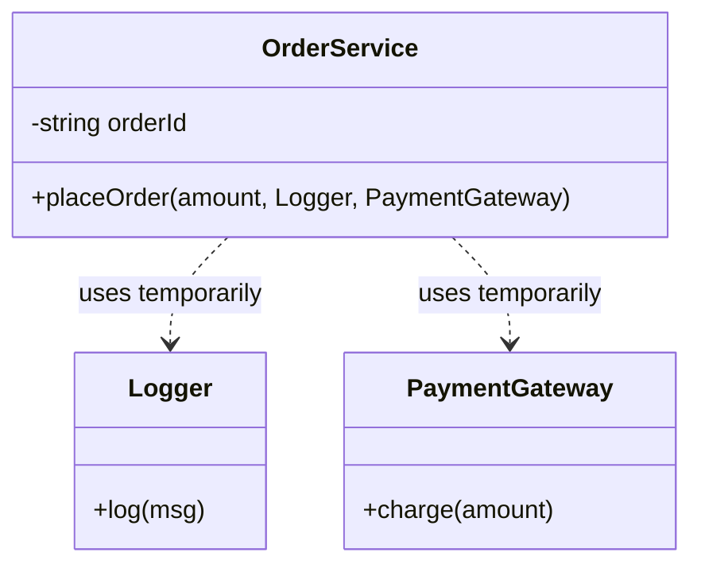
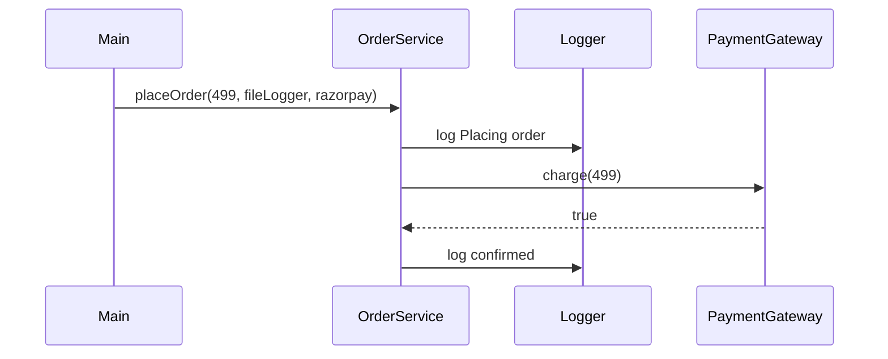
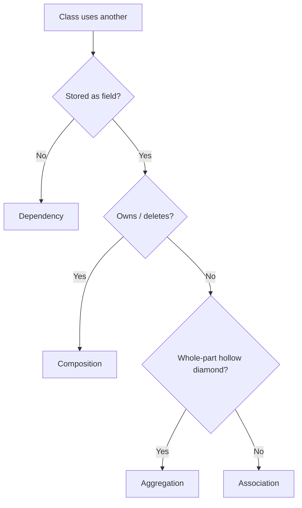
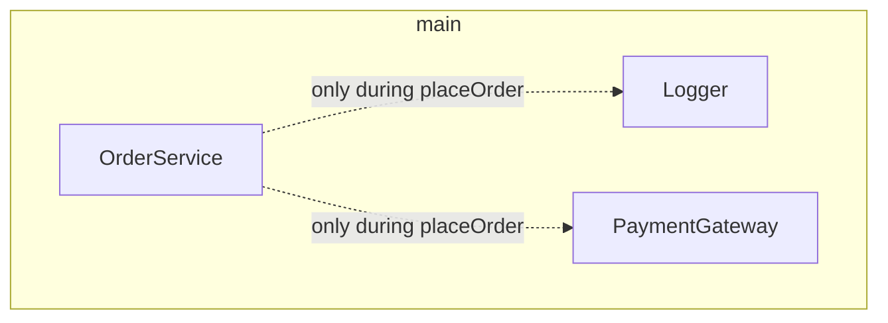
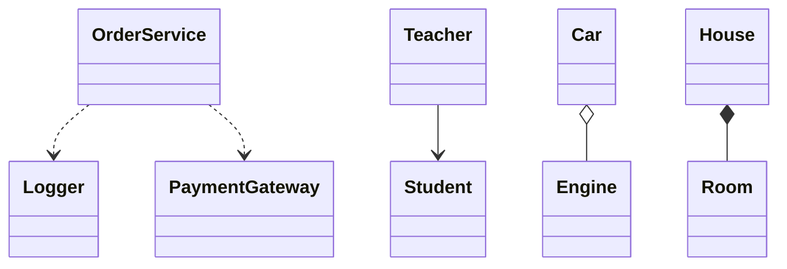
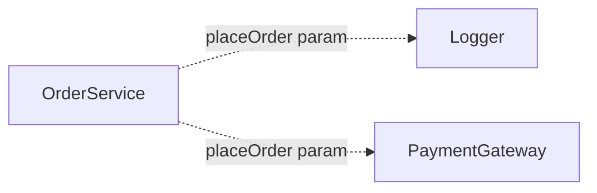
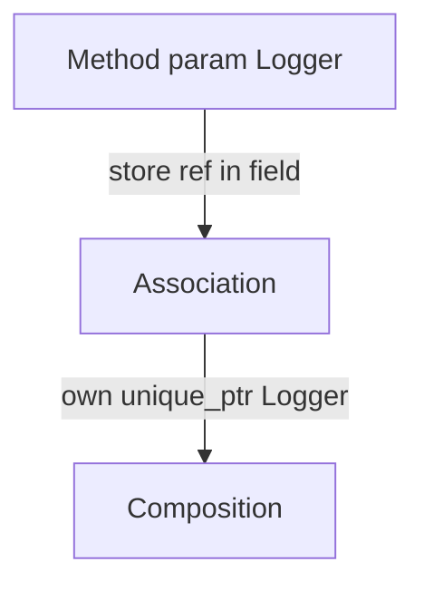

# Dependency — Complete Guide (Object Relationships #4)

> **Runnable code:** [`04_Dependency.cpp`](../C++%20Code/04_Dependency.cpp)  
> **Sibling guides:** [`01_Association.md`](01_Association.md) · [`02_Aggregation.md`](02_Aggregation.md) · [`03_Composition_Strong_HasA.md`](03_Composition_Strong_HasA.md)  
> **Master comparison:** [`OBJECT_RELATIONSHIPS_GUIDE.md`](../OBJECT_RELATIONSHIPS_GUIDE.md)

---

## Table of Contents

1. [What is Dependency?](#1-what-is-dependency)
2. [UML — Dashed Arrow](#2-uml--dashed-arrow)
3. [Repo Walkthrough — OrderService](#3-repo-walkthrough--orderservice)
4. [C++ Implementation Patterns](#4-c-implementation-patterns)
5. [Dependency vs Other Relationships](#5-dependency-vs-other-relationships)
6. [Lifetime & Scope Semantics](#6-lifetime--scope-semantics)
7. [Dependency Injection Basics](#7-dependency-injection-basics)
8. [Design & Coupling](#8-design--coupling)
9. [Real-World Examples](#9-real-world-examples)
10. [Common Mistakes](#10-common-mistakes)
11. [Mermaid Diagrams](#11-mermaid-diagrams)
12. [Interview Question Bank](#12-interview-question-bank)
13. [Cheat Sheet](#13-cheat-sheet)
14. [Hindi / English Glossary](#14-hindi--english-glossary)
15. [Extended Patterns](#15-extended-patterns)
16. [Build & Run](#16-build--run)
17. [Quick Revision Checklist](#17-quick-revision-checklist)

---

## 1. What is Dependency?

### 1.1 Definition (English)

A **dependency** exists when one class **uses** another **temporarily** — typically as a **method parameter**, **local variable**, or **short-lived reference**. The using class **does not store** the collaborator as a permanent field. It is the **weakest** structural relationship in the UML has-a/uses family.

### 1.1 Definition (Hindi)

**Dependency** = **सबसे कमज़ोर लिंक** — ek class dusre ko **sirf method ke andar** use karti hai (parameter/local). **Field me store nahi** — collaboration **temporary** hai. OrderService Logger ko placeOrder me use karta hai — Logger member nahi hai.

### 1.2 One-line interview answer

*"Dependency = temporary use; collaborator passed in or created locally; not stored as field; weakest link."*

### 1.3 Key properties

| Property | Dependency |
| -------- | ---------- |
| Hindi | अस्थायी उपयोग / निर्भरता |
| Ownership | ❌ None |
| Stored in field? | ❌ **Typically no** |
| UML | Dashed arrow `..>` |
| Scope | **Method / call** |
| Strength | **Weakest** |

### 1.4 Mental model

```
OrderService ···uses···> Logger
              (dashed — only during placeOrder call)
```

No permanent arrow from OrderService object to Logger object in memory graph.

---

## 2. UML — Dashed Arrow

### 2.1 Standard notation

```
OrderService · · · · > Logger
              (dashed dependency arrow)
```

Arrow points from **dependent** (client) to **supplier** (used).

### 2.2 Mermaid



Mermaid `..>` = dependency (dashed).

### 2.3 UML vs other arrows

| Arrow | Style | Relationship |
| ----- | ----- | -------------- |
| `..>` | Dashed | **Dependency** |
| `-->` | Solid | Association |
| `o--` | Solid + ◇ | Aggregation |
| `*--` | Solid + ◆ | Composition |

### 2.4 Stereotypes (optional UML)

| Stereotype | Meaning |
| ---------- | ------- |
| «use» | Generic dependency |
| «call» | Operation invokes |
| «create» | Local `new` inside method |
| «parameter» | Passed as argument |

### 2.5 Whiteboard script

1. Draw OrderService, Logger.  
2. **Dashed arrow** OrderService → Logger.  
3. Label **«parameter»** or **uses in method**.  
4. Say: **no Logger field** inside OrderService.

---

## 3. Repo Walkthrough — OrderService

### 3.1 File header

From [`04_Dependency.cpp`](../C++%20Code/04_Dependency.cpp):

```cpp
/**
 * DEPENDENCY — temporary use; weakest link
 * OrderService uses Logger only inside a method (parameter / local)
 * Logger is NOT a permanent field of OrderService
 * UML: dashed arrow ..>
 */
```

### 3.2 Logger & PaymentGateway

```cpp
class Logger {
public:
    void log(const string& msg) const {
        cout << "[Logger] " << msg << "\n";
    }
};

class PaymentGateway {
public:
    bool charge(double amount) const {
        cout << "[PaymentGateway] charged Rs " << amount << "\n";
        return true;
    }
};
```

Both are **independent** services — no link to OrderService at class level.

### 3.3 OrderService — dependency in method signature

```cpp
class OrderService {
    string orderId;
public:
    explicit OrderService(string id) : orderId(id) {}

    void placeOrder(double amount, Logger& logger, PaymentGateway& gateway) const {
        logger.log("Placing order " + orderId);
        if (gateway.charge(amount))
            logger.log("Order " + orderId + " confirmed");
    }
};
```

| Observation | Proves dependency |
| ----------- | ----------------- |
| Only field: `orderId` | No Logger/Gateway stored |
| Logger& in `placeOrder` | Temporary collaboration |
| PaymentGateway& param | Second dependency same call |

### 3.4 main() — dependencies at call site

```cpp
int main() {
    OrderService order("ORD-101");

    Logger fileLogger;
    PaymentGateway razorpay;

    order.placeOrder(499.0, fileLogger, razorpay);

    cout << "[Dependency] OrderService has no Logger field — only uses in method\n";
}
```

### 3.5 Call sequence narrative



### 3.6 Expected output (conceptual)

```
[Logger] Placing order ORD-101
[PaymentGateway] charged Rs 499
[Logger] Order ORD-101 confirmed
[Dependency] OrderService has no Logger field — only uses in method
```

---

## 4. C++ Implementation Patterns

### 4.1 Pattern catalog

| Pattern | Example | Dependency? |
| ------- | ------- | ----------- |
| Method parameter | `void f(Logger& log)` | ✅ Primary |
| Local variable in method | `Logger temp; f(temp);` | ✅ |
| Static method call | `Logger::global()` | ✅ use dependency |
| `#include` header | Compile-time dependency | ✅ (often omitted on diagrams) |
| Field `Logger* log` | Persistent | ❌ → **Association** |
| Factory creates inside | `make_unique<Logger>()` local | ✅ create dependency |

### 4.2 Parameter styles

```cpp
void placeOrder(double amount, Logger& logger) const;           // non-null ref
void placeOrder(double amount, Logger* logger) const;           // optional nullable
void placeOrder(double amount, const Logger& logger) const;     // repo style
void placeOrder(double amount, const string& gatewayName) const; // value param — copies string
```

### 4.3 const correctness

```cpp
void placeOrder(..., Logger& logger) const;
logger.log(...);  // OK if log() is const — doesn't modify OrderService
```

OrderService **const method** — dependencies used but **not stored**.

### 4.4 Multiple dependencies one method

Repo passes **Logger** + **PaymentGateway** — real methods often need **several collaborators** per operation — all **dependencies** if not stored.

### 4.5 Local creation dependency

```cpp
void placeOrder(double amount) const {
    Logger consoleLogger;  // local — dependency for this call only
    consoleLogger.log(...);
}
```

Still dependency — no field on OrderService.

### 4.6 When parameter becomes association

If refactor to:

```cpp
class OrderService {
    Logger& logger;  // stored — persistent link
public:
    OrderService(string id, Logger& l) : orderId(id), logger(l) {}
    void placeOrder(double amount) { logger.log(...); }
};
```

Now **association** (knows Logger long-term) — **not** dependency.

### 4.7 Interface dependency (good design)

```cpp
class ILogger { virtual void log(const string&) const = 0; };
void placeOrder(..., const ILogger& logger) const;
```

Depends on **abstraction** — DIP (Dependency Inversion Principle).

---

## 5. Dependency vs Other Relationships

### 5.1 Master table

| | **Dependency** | Association | Aggregation | Composition |
| --- | --- | --- | --- | --- |
| Hindi | अस्थायी | जानता है | कमज़ोर has-a | मज़बूत has-a |
| Field storage | ❌ | ✅ | ✅ | ✅ |
| UML | **`..>`** | `-->` | `o--` | `*--` |
| Duration | Call/method | Long-term | Long-term | Long-term |
| Repo | **04** | 01 | 02 | 03 |
| Example | Order–Logger param | Teacher–Student* | Car–Engine* | House–Room |

### 5.2 Weakest to strongest


### 5.3 Dependency vs Association — decision tree



### 5.4 Dependency vs Composition

Composition **owns** parts as members. Dependency **borrows** collaborators per call — **no structural ownership**.

### 5.5 Compile-time vs runtime dependency

| Type | Example |
| ---- | ------- |
| `#include "Logger.h"` | Compile dependency — every class has |
| UML dependency | **Runtime collaboration** in method — interview focus |

Don't draw `#include` on every class diagram — clutter.

### 5.6 vs Inheritance

| Dependency (uses) | Inheritance (is-a) |
| ----------------- | -------------------- |
| Method param | `class Special : Base` |
| Loosest | Strongest coupling |
| Prefer for helpers | Prefer only for IS-A |

---

## 6. Lifetime & Scope Semantics

### 6.1 Lifetime table

| Object | Created | Destroyed |
| ------ | ------- | --------- |
| OrderService | main | main end |
| Logger | main (before call) | main end |
| Link OrderService→Logger | During `placeOrder` | End of `placeOrder` |

**No persistent link** — Logger lives independently; OrderService merely **uses** it during call.

### 6.2 Scope diagram



Dotted = temporary use, not field ownership.

### 6.3 Caller responsibility

Caller (`main`) must ensure Logger **alive** during `placeOrder` — references must not dangle mid-call.

### 6.4 Stack-local dependency

```cpp
void demo() {
    OrderService o("X");
    Logger l;
    o.placeOrder(1.0, l, pg);  // l valid entire call
}
```

### 6.5 Hindi summary

> Logger **OrderService ka hissa nahi** — sirf **ek call ke liye** pass hota hai. Call khatam — dependency **khatam** (conceptually).

---

## 7. Dependency Injection Basics

### 7.1 What is DI?

**Dependency Injection** = collaborator **outside se do** (constructor/method), class **khud mat banao** hard-coded.

Repo uses **method injection**:

```cpp
order.placeOrder(499.0, fileLogger, razorpay);
```

### 7.2 Injection types

| Type | Example |
| ---- | ------- |
| Constructor injection | `OrderService(Logger& l)` — becomes association if stored |
| **Method injection** | **Repo** — `placeOrder(..., Logger&)` |
| Interface injection | Setter `setLogger` — association if stored |

### 7.3 DI vs dependency UML

**Method injection** without storing the collaborator in a field is still **dependency** — not stored after call.

**Constructor injection** with **stored ref** → **association** + DI pattern.

### 7.4 Testing benefit

```cpp
class MockLogger : public ILogger { /* capture logs */ };
order.placeOrder(99, mockLogger, mockGateway);
// assert mockLogger.messages
```

Easy swap — **loose coupling** for test doubles.

### 7.5 Service locator contrast

```cpp
Logger& getLogger();  // global locator — hidden dependency
void placeOrder(double amount) {
    getLogger().log(...);  // still dependency but harder to test
}
```

Explicit parameters **clearer** than service locator.

---

## 8. Design & Coupling

### 8.1 Benefits of dependency (weak link)

| Benefit | Explanation |
| ------- | ----------- |
| Low coupling | OrderService doesn't require Logger at construction |
| Flexible | Different loggers per call |
| Clear API | Method signature shows needs |

### 8.2 When dependency is ideal

| Scenario | Fit |
| -------- | --- |
| Optional behavior per call | ✅ |
| Many services used once | ✅ |
| Helper utilities | ✅ |
| Must remember collaborator forever | ❌ → field (association) |
| Own collaborator lifetime | ❌ → composition |

### 8.3 Too many parameters smell

```cpp
void placeOrder(Logger&, PaymentGateway&, TaxService&, EmailService&, ...);
```

Fix: **facade parameter object** or **context struct** — still dependency if not stored.

```cpp
struct OrderContext { Logger& log; PaymentGateway& pay; /* ... */ };
void placeOrder(double amount, const OrderContext& ctx) const;
```

### 8.4 SOLID — Dependency Inversion

Depend on **interfaces** (`ILogger`) not concrete `FileLogger` — reduces coupling further.

### 8.5 Law of Demeter

Method should use **parameters and own fields** — OrderService calls `logger.log` — OK (direct parameter).

---

## 9. Real-World Examples

### 9.1 Domain table

| Client | Dependency (temporary) | Note |
| ------ | ------------------------ | ---- |
| OrderService | Logger, PaymentGateway | Repo |
| ReportGenerator | OutputStream in `generate(ostream&)` | |
| Controller | HttpRequest in handler method | |
| Sort algorithm | Comparator callback param | |
| Use case | Repository interface per `execute()` | Clean architecture |

### 9.2 Hindi narrative — delivery app

**Order place** karte waqt **payment gateway** aur **logger** chahiye — lekin Order class ke andar **hamesha** payment machine nahi hoti; **har order call par** gateway pass hoti hai. Yeh **dependency** hai.

### 9.3 If Logger became member

Agar har OrderService object ke paas **apna Logger field** ho → **association** — "service knows logger permanently".

### 9.4 Framework handlers

```cpp
void onRequest(Request& req, Response& res);  // HTTP handler dependencies
```

---

## 10. Common Mistakes

### 10.1 Mistake catalog

| Mistake | Fix |
| ------- | --- |
| Drawing solid arrow for param use | Use dashed `..>` |
| Calling everything dependency | Field stored → association |
| Storing param in field silently | Refactor relationship type |
| Null ref param | Use optional or pointer |
| Global singleton hidden | Inject explicitly |
| Confusing #include with UML dep | Diagram runtime collab |

### 10.2 Interview trap

**Q:** "OrderService depends on Logger — association?"  
**A:** **Dependency** if Logger only in **method parameter**, **not field**. Check class definition — repo has **only orderId** field.

### 10.3 Over-using global Logger

```cpp
#define LOG(x) GlobalLogger::instance().log(x)
```

Hidden dependency — bad for tests; prefer injection.

---

## 11. Mermaid Diagrams

### 11.1 Full relationship map



### 11.2 Dependency only subgraph



### 11.3 Evolution to association



---

## 12. Interview Question Bank

**Q1.** Dependency kya hai?  
**A.** Temporary use; weakest; usually method param.

**Q2.** UML arrow?  
**A.** Dashed `..>`.

**Q3.** OrderService me Logger field?  
**A.** Nahi — repo proof.

**Q4.** vs Association?  
**A.** Association = persistent field; dependency = not stored.

**Q5.** vs Aggregation?  
**A.** Aggregation has-a weak field; dependency no field.

**Q6.** vs Composition?  
**A.** Composition owns part; dependency borrows per call.

**Q7.** Weakest relationship?  
**A.** Dependency.

**Q8.** placeOrder parameters?  
**A.** Logger&, PaymentGateway& — dependencies.

**Q9.** Hindi one-liner?  
**A.** Asthayi use; field nahi.

**Q10.** DI method injection?  
**A.** Repo placeOrder params.

**Q11.** Local Logger in method?  
**A.** Still dependency.

**Q12.** Store Logger& in field?  
**A.** Becomes association.

**Q13.** const placeOrder?  
**A.** OrderService state unchanged.

**Q14.** PaymentGateway dependency too?  
**A.** Haan — second dashed arrow.

**Q15.** File name?  
**A.** 04_Dependency.cpp.

**Q16.** Caller creates Logger?  
**A.** main — inject at call.

**Q17.** Dangling ref risk?  
**A.** Logger destroyed before call — UB.

**Q18.** Interface ILogger?  
**A.** DIP — depend on abstraction.

**Q19.** Service locator?  
**A.** Hidden dependency — worse testability.

**Q20.** Many params smell?  
**A.** Parameter object / context struct.

**Q21.** Compile #include dependency?  
**A.** Not usually drawn on UML.

**Q22.** «create» stereotype?  
**A.** new inside method — local dep.

**Q23.** Static Logger call?  
**A.** use dependency on Logger class.

**Q24.** Sequence diagram?  
**A.** Shows temporary collaboration flow.

**Q25.** Mock testing?  
**A.** Inject mock Logger param.

**Q26.** Framework handler deps?  
**A.** Request/Response params — dependency.

**Q27.** Sort comparator?  
**A.** Callback param — dependency.

**Q28.** Association upgrade when?  
**A.** Add Logger member field.

**Q29.** Composition Logger?  
**A.** unique_ptr<Logger> member owns.

**Q30.** Teacher Student?  
**A.** Association not dependency.

**Q31.** Car Engine?  
**A.** Aggregation not dependency.

**Q32.** House Room?  
**A.** Composition not dependency.

**Q33.** Strength order?  
**A.** Dep < Assoc < Agg < Comp.

**Q34.** Mermaid ..>?  
**A.** Dependency dashed.

**Q35.** explicit OrderService ctor?  
**A.** Prevent implicit conversion orderId.

**Q36.** charge return bool?  
**A.** Business flow — gateway dep.

**Q37.** log const method?  
**A.** Logger read-only op.

**Q38.** Global vs param?  
**A.** Param explicit better.

**Q39.** Optional Logger*?  
**A.** Nullable dependency param OK.

**Q40.** Context struct?  
**A.** Groups deps — still method injection.

**Q41.** Clean architecture use case?  
**A.** execute(repo&) — dependency per call.

**Q42.** Two dashed arrows OrderService?  
**A.** Logger + PaymentGateway.

**Q43.** Lifetime after placeOrder?  
**A.** No link retained in OrderService.

**Q44.** Hindi asthayi?  
**A.** Temporary — method scope.

**Q45.** OrderId field only?  
**A.** Proves no Logger storage.

**Q46.** Razorpay variable name?  
**A.** Concrete gateway — could be interface.

**Q47.** Email after order?  
**A.** Could add EmailService& param — new dep.

**Q48.** Ref vs pointer param?  
**A.** Ref non-null; pointer optional.

**Q49.** Summary English?  
**A.** Uses but doesn't hold.

**Q50.** Whiteboard tip?  
**A.** Show dashed arrow + "no field".

---

## 13. Cheat Sheet

```
┌──────────────────────────────────────────────────────────────┐
│ DEPENDENCY                                                   │
│   Meaning:   temporary use (weakest)                         │
│   Field:     NO permanent collaborator field                 │
│   UML:       OrderService · · · > Logger   (dashed ..>)      │
│   C++:       void placeOrder(..., Logger& logger, ...)       │
│   vs Assoc:  param/local vs stored field                     │
│   vs others: no ownership, no has-a diamond                  │
│   File:      04_Dependency.cpp                               │
└──────────────────────────────────────────────────────────────┘
```

### Field test

```
Open class → see collaborator as member field?
  NO  → likely Dependency (if used only via methods) or none
  YES → Association / Aggregation / Composition (apply ownership rules)
```

---

## 14. Hindi / English Glossary

| English | Hindi |
| ------- | ----- |
| Dependency | निर्भरता / dependency |
| Temporary use | अस्थायी उपयोग |
| Dashed arrow | धरियाँ वाला तीर |
| Parameter | पैरामीटर |
| Method scope | method का दायरा |
| Weakest link | सबसे कमज़ोर संबंध |
| Inject | inject / बाहर से देना |
| Collaborator | सहयोगी class |
| Coupling | coupling / जोड़ |
| Field | field / सदस्य |

---

## 15. Extended Patterns

### 15.1 Optional dependency pointer

```cpp
void placeOrder(double amount, Logger* logger) const {
    if (logger) logger->log("...");
}
```

### 15.2 std::function dependency

```cpp
void placeOrder(double amount, function<void(string)> logFn) const;
```

Functional dependency injection.

### 15.3 Coroutine / async context

Async handler receives **context** object with logger, db — dependency bundle per invocation.

### 15.4 Namespace-level free function

```cpp
void placeOrder(OrderService& o, Logger& l) { o.placeOrder(..., l, ...); }
```

Free function still expresses OrderService **depends on** Logger at call time.

### 15.5 Evolution path

1. **Dependency** — param only (flexible)  
2. **Association** — cache logger ref if every call needs same instance  
3. **Composition** — own logger instance exclusively  

Choose based on **lifetime** and **ownership** needs.

---

## 16. Build & Run

```bash
g++ -std=c++17 -Wall -o /tmp/dep "C++ Code/04_Dependency.cpp" && /tmp/dep
```

**Verify:** Final line confirms no Logger field on OrderService.

From [`Composition/`](../):

```bash
./compile.sh   # if configured for all four demos
```

---

## 17. Quick Revision Checklist

- [ ] **Weakest** relationship — temporary use
- [ ] UML **`..>` dashed** arrow
- [ ] **No Logger field** on OrderService — only `orderId`
- [ ] **`placeOrder(..., Logger&, PaymentGateway&)`**
- [ ] vs **Association**: would store pointer field
- [ ] vs **Aggregation/Composition**: has-a + diamonds
- [ ] **Method injection** = DI form
- [ ] Ran [`04_Dependency.cpp`](../C++%20Code/04_Dependency.cpp)

---

*End of guide — Dependency*
