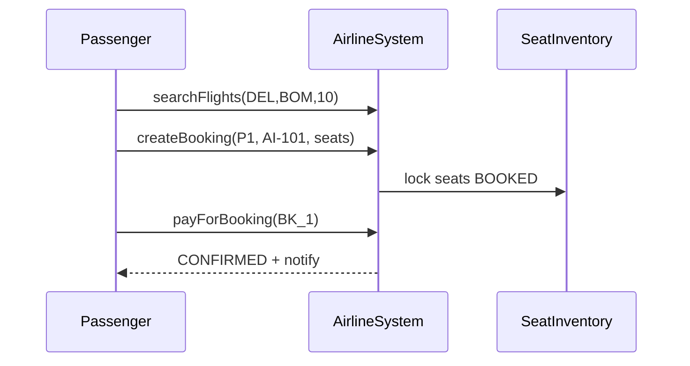

# Airline Management System LLD

Full **airline operations + booking** demo — search, seat inventory, payment, crew, roles, cancellation/refund, flight change, concurrent seat locks.

## Quick run (C++17)

```bash
cd Airline_Management_System_LLD
./compile.sh
./airline_app
```

## Requirements coverage

| Requirement | Implementation |
|-------------|----------------|
| Search by source, dest, date | `FlightSearchService` |
| Book + seat + payment | `createBooking` → `payForBooking` |
| Schedules, aircraft, crew | `scheduleFlight`, `assignAircraft`, `assignCrew` |
| Passenger + baggage | `Passenger.baggageKg` validation |
| User roles | `UserRole` + `login` + `requireRole` |
| Cancel + refund | `cancelBooking` + `PaymentService::refund` |
| Flight change | `changeFlight` |
| Concurrent access | `std::mutex` on booking ops |
| Extensible | Strategy pricing, service split |

## Structure

```
Airline_Management_System_LLD/
├── core/AirlineManagementSystem.h   # Facade
├── models/   Flight, Seat, Booking, Passenger, User, Crew, ...
├── services/ Search, Seats, Crew, Payment, Notify
├── strategies/ SeatClassPricingStrategy
└── main.cpp
```

## Flow



## Related

- [`Movie_Ticket_Booking_System`](../Movie_Ticket_Booking_System/) — seat booking
- [`OYO_Hotel_Booking_LLD`](../OYO_Hotel_Booking_LLD/) — availability + pricing
