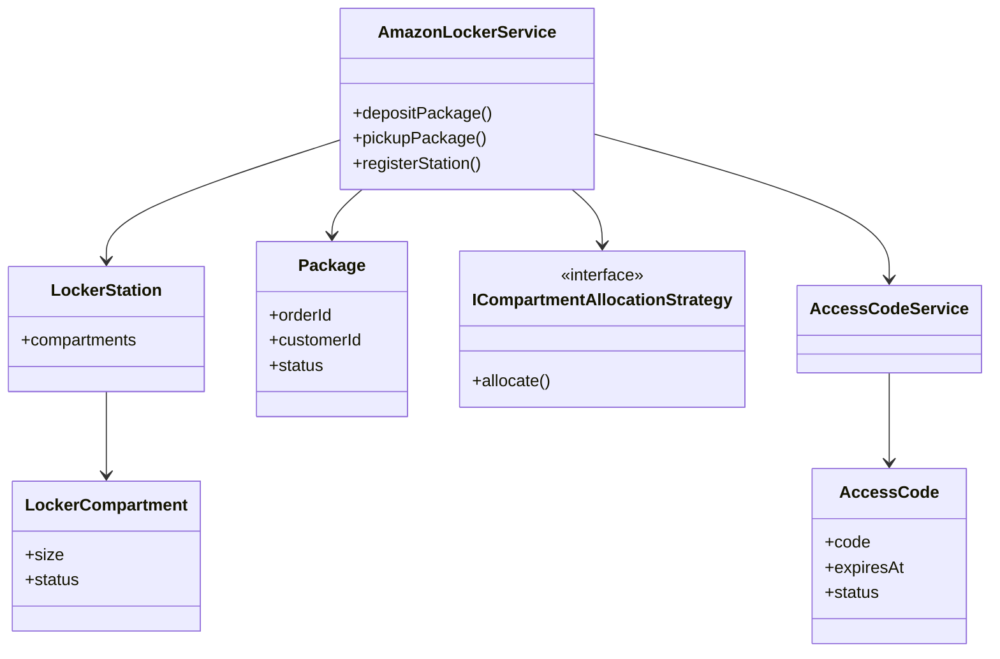
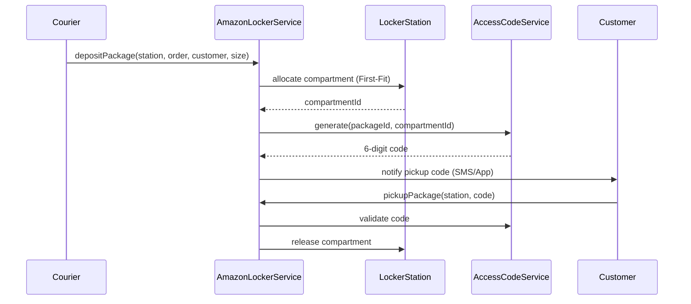

# Amazon Locker Service — Complete LLD Guide

## 1. Problem framing

Amazon Locker (Hub Locker) lets couriers drop packages when the customer is not home. The customer receives a **pickup code** and collects the parcel from a **compartment** at a nearby station.

**Core challenge:** safely map `package → compartment → access code` under concurrency, expiry, and finite compartment capacity.

---

## 2. Class diagram (conceptual)



---

## 3. State machines

### Compartment

```
AVAILABLE ──deposit──► OCCUPIED ──pickup──► AVAILABLE
     │                      │
     └──markOutOfService──► OUT_OF_SERVICE
```

### Access code

```
ACTIVE ──pickup success──► USED
  │
  ├──time exceeded──► EXPIRED
  └──max wrong attempts──► LOCKED
```

### Package

```
CREATED ──deposit──► DEPOSITED ──pickup──► PICKED_UP
                         └──timeout──► EXPIRED
```

---

## 4. Sequence: deposit → pickup



---

## 5. Allocation strategy

**First-Fit:** scan compartments in order; pick first `AVAILABLE` slot where `fitsSize(compartment, required)`.

| Package size | Allowed compartments |
|--------------|----------------------|
| SMALL | S, M, L |
| MEDIUM | M, L |
| LARGE | L only |

Production alternatives: **Best-Fit** (minimize wasted volume), **Load balancing** across stations.

---

## 6. Concurrency (interview extension)

Current code is single-threaded. For production:

- `std::mutex` per compartment or per station stripe (see `Concurrent_HashMap_LLD` striping).
- Atomic compare-and-swap on compartment status `AVAILABLE → OCCUPIED`.
- Idempotent deposit API keyed by `orderId` to handle courier retries.

---

## 7. Failure handling

| Scenario | Behavior |
|----------|----------|
| Wrong code | `invalid_argument` (unknown code) |
| Used code | `runtime_error` |
| Expired code | mark expired, reject pickup |
| No slot | `runtime_error` on deposit |
| Station mismatch | reject pickup at wrong station |

---

## 8. Production extensions

- Persist stations/compartments in DB; cache hot station availability in Redis.
- Hash pickup codes (bcrypt) — never store plaintext.
- TTL job to expire packages and free compartments.
- QR code instead of numeric OTP for pickup.
- Admin API to mark compartment `OUT_OF_SERVICE`.

---

## 9. Interview Q&A

**Q: Why strategy for allocation?**  
A: Amazon may switch First-Fit → Best-Fit or geo-aware routing without changing the facade.

**Q: Can MEDIUM use SMALL slot?**  
A: No — physical constraint. MEDIUM needs M or L.

**Q: What if customer never picks up?**  
A: Background sweeper expires `AccessCode`, marks `Package::EXPIRED`, frees compartment, returns inventory to hub.

**Q: How to prevent two couriers getting same compartment?**  
A: Transaction / `UPDATE compartments SET status='OCCUPIED' WHERE id=? AND status='AVAILABLE'` with row count check.

**Q: Difference vs OTP_Generation_System_LLD?**  
A: OTP project focuses on auth channels and rate limits; locker OTP is bound to a **physical compartment** and **station context**.

---

## 10. Demo mapping (`main.cpp`)

| Step | Demonstrates |
|------|----------------|
| Deposit + pickup | Happy path |
| Wrong code `000000` | Invalid code |
| Re-use code | `USED` rejection |
| Fill all compartments | Capacity limit |
| LARGE + SMALL deposits | Size fit rules |
