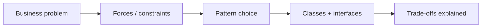
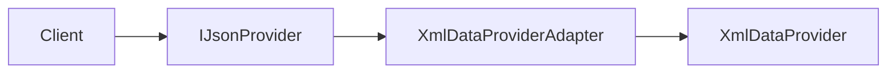
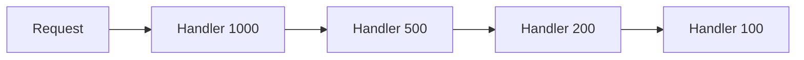
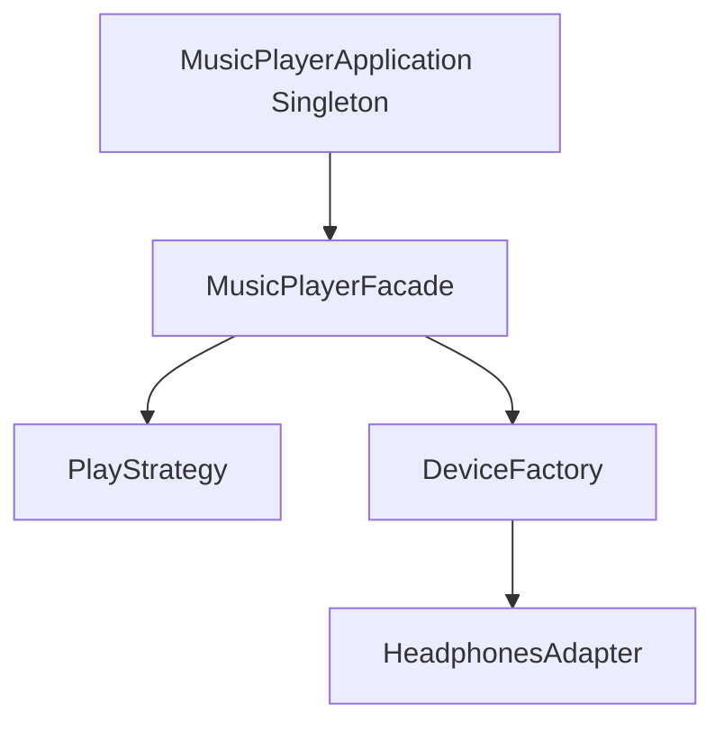
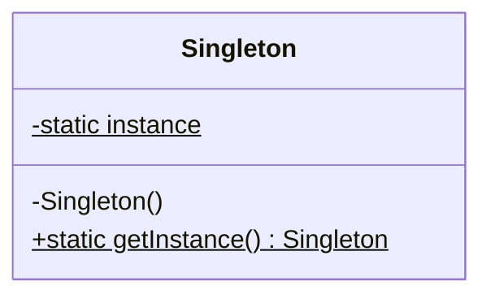

# Design Patterns — Complete Guide (GoF + Repo Map)

> **File:** `Design_Patterns.md` — Gang of Four patterns explained with **this repo’s** lesson code  
> **Companion:** [`SOLID.md`](./SOLID.md) — principles that patterns usually satisfy  
> **Taxonomy reference:** [`Design_Pattern_types.md`](./Design_Pattern_types.md)

---

## Table of Contents

1. [Introduction](#1-introduction)
2. [GoF Classification](#2-gof-classification)
3. [How to Pick a Pattern (Interview Flow)](#3-how-to-pick-a-pattern-interview-flow)
4. [Creational Patterns](#4-creational-patterns)
5. [Structural Patterns](#5-structural-patterns)
6. [Behavioral Patterns](#6-behavioral-patterns)
7. [Null Object & Common Antipatterns](#7-null-object--common-antipatterns)
8. [Patterns in This Repo — Coverage Matrix](#8-patterns-in-this-repo--coverage-matrix)
9. [Multi-Pattern LLD Projects](#9-multi-pattern-lld-projects)
10. [Pattern vs Pattern — Quick Comparisons](#10-pattern-vs-pattern--quick-comparisons)
11. [Interview Playbook](#11-interview-playbook)
12. [Compile & Run Lesson Code](#12-compile--run-lesson-code)
13. [Part II — Pattern Deep Dive Encyclopedia](#part-ii--pattern-deep-dive-encyclopedia)
14. [Part III — System Projects Pattern Encyclopedia](#part-iii--system-projects-pattern-encyclopedia)
15. [Part IV — Interview Question Bank](#part-iv--interview-question-bank-100-prompts)
16. [Part V — Patterns × SOLID](#part-v--patterns--solid-mapping)
17. [Part VI — C++ Cookbook](#part-vi--c-implementation-cookbook)
18. [Part VII–X — Case Studies, Glossary, Index, Study Plan](#part-vii--pattern-selection-case-studies-narratives)

---

## 1. Introduction

**Design patterns** are reusable solutions to **recurring design problems** in object-oriented systems. They are **not** copy-paste code — they are **vocabulary + structure** for:

- Naming what you built (“Strategy for pricing”)
- Communicating with interviewers in 30 seconds
- Avoiding reinventing wheels (and anti-patterns)

### 1.1 Why patterns matter in LLD interviews

| Without patterns | With patterns |
|------------------|---------------|
| “I used if-else for payment types” | “**Strategy** — swap `IPaymentStrategy` at runtime” |
| “One big god class” | “**Facade** + **Service** layer with **SRP**” |
| “Subclass explosion `SedanPetrol`, `SUV Diesel`…” | “**Bridge** — `Car` × `Engine` independently” |

### 1.2 Patterns ≠ Silver bullet

- **Over-engineering:** 3 classes for a one-off script  
- **Wrong pattern:** Observer when you only need one callback  
- **Pattern for pattern’s sake:** Interviewers want **problem → pattern → trade-off**



---

## 2. GoF Classification

| Category | Purpose | Patterns in this repo |
|----------|---------|------------------------|
| **Creational** | Object creation flexible & decoupled | Singleton, Factory (3 variants), Builder, Prototype |
| **Structural** | Compose classes/objects into larger structures | Adapter, Bridge, Composite, Decorator, Facade, Flyweight, Proxy |
| **Behavioral** | Algorithms & responsibility distribution | Chain of Responsibility, Command, Iterator, Mediator, Memento, Observer, State, Strategy, Template Method, Visitor |

> **Interpreter** (behavioral) is in GoF but not implemented as a dedicated lesson here — use when building expression/rule engines (SQL parser, calculator).

---

## 3. How to Pick a Pattern (Interview Flow)

Use this **decision tree** in interviews (say it out loud):

```
1. Is the pain about CREATING objects?
   → Singleton / Factory / Builder / Prototype

2. Is the pain about STRUCTURE (legacy API, huge subsystem, memory)?
   → Adapter / Facade / Proxy / Decorator / Bridge / Composite / Flyweight

3. Is the pain about BEHAVIOR (algorithm swap, events, undo, states)?
   → Strategy / Observer / Command / State / Template Method / Chain / Mediator / Visitor / Memento
```

### 3.1 Signal words → pattern

| You hear… | Think… |
|-----------|--------|
| “Multiple algorithms, pick at runtime” | **Strategy** |
| “Notify many listeners on change” | **Observer** |
| “Undo / macro / queue requests” | **Command** |
| “Pipeline of handlers” | **Chain of Responsibility** |
| “Hide complex subsystem” | **Facade** |
| “Add behavior without subclass explosion” | **Decorator** |
| “Legacy interface incompatible” | **Adapter** |
| “Lazy / access control / remote stand-in” | **Proxy** |
| “States change allowed operations” | **State** |
| “Skeleton algorithm, steps vary” | **Template Method** |
| “Only one instance globally” | **Singleton** (use sparingly) |

---

## 4. Creational Patterns

Creational patterns **encapsulate object creation** so clients depend on abstractions, not `new Concrete()` everywhere.

---

### 4.1 Singleton

#### Intent

Ensure a class has **only one instance** and provide a global access point.

#### Structure

```
Singleton
├── - static instance
├── - private constructor
└── + getInstance()
```

#### When to use

- Shared resource: config, logger registry, connection pool **manager** (not the connections themselves)
- Coordinating single point: `CouponManager`, `GameManager`

#### When to avoid

- Unit tests (global hidden state)
- Multi-instance is natural (per-user session)
- Distributed systems (one JVM singleton ≠ cluster singleton)

#### Repo references

| Lesson | Path |
|--------|------|
| **L10** | [`L10 Singleton_Design_Pattern/`](./L10%20Singleton_Design_Pattern/) |
| Variants | `SimpleSingleton`, `ThreadSafeEagerSingleton`, `ThreadSafeLockingSingleton`, `ThreadSafeDoubleLockingSingleton` |
| Systems | L14 Notification, L18 Spotify managers, L23 Payment, L31 Splitwise, L37 Chess `GameManager` |

#### C++ notes (this repo)

- Prefer **Meyers singleton** (`static` inside `getInstance()`) for header-only code — ODR-safe, C++11+
- Avoid `static` member definition in `.h` without `inline` (see [`SOLID.md`](./SOLID.md))
- **Double-checked locking** needs `std::atomic` + memory order (L10 `ThreadSafeDoubleLockingSingleton.cpp`)

#### Interview one-liner

> *“Logger registry is Singleton — one instance; I avoid it for domain entities that should be multi-instance.”*

---

### 4.2 Factory (Simple Factory · Factory Method · Abstract Factory)

Three related patterns — **do not confuse in interviews**.

#### Comparison table

| | **Simple Factory** | **Factory Method** | **Abstract Factory** |
|---|-------------------|-------------------|---------------------|
| **Intent** | Centralize creation in one place | Subclass decides which product | Create **families** of related products |
| **Mechanism** | `if/else` or `switch` on type string | Virtual `createProduct()` per factory | Multiple `createX()` per factory interface |
| **OCP** | Weak — new type → edit factory | Strong — new product class | Strong — new factory for new family |
| **Repo** | `L9/.../SimpleFactory.cpp` | `L9/.../FactoryMethod.cpp` | `L9/.../AbstractFactory.cpp` |

#### Simple Factory — example flow (Burger shop)

**File:** [`L9 Factory_Design_Pattern/C++ Code/SimpleFactory.cpp`](./L9%20Factory_Design_Pattern/C%2B%2B%20Code/SimpleFactory.cpp)

```cpp
Burger* burger = BurgerFactory::createBurger("standard"); // if-else inside factory
burger->prepare();
```

**Problem:** New burger type → modify factory `if-else` (violates OCP).

#### Factory Method — example flow

**File:** [`L9 Factory_Design_Pattern/C++ Code/FactoryMethod.cpp`](./L9%20Factory_Design_Pattern/C%2B%2B%20Code/FactoryMethod.cpp)

```cpp
BurgerFactory* factory = new SinghBurgerFactory();
Burger* burger = factory->createBurger(); // virtual dispatch
```

**Benefit:** New brand = new `BurgerFactory` subclass — `main()` unchanged.

#### Abstract Factory — example flow

**File:** [`L9 Factory_Design_Pattern/C++ Code/AbstractFactory.cpp`](./L9%20Factory_Design_Pattern/C%2B%2B%20Code/AbstractFactory.cpp)

```cpp
BurgerFactory* theme = new KingBurgerFactory(); // wheat theme
Burger* b = theme->createBurger();
GarlicBread* g = theme->createGarlicBread(); // consistent family
```

#### In system LLDs

| Project | Factory usage |
|---------|---------------|
| L11 Food Delivery | `NowOrderFactory`, `ScheduledOrderFactory` |
| L18 Spotify | `DeviceFactory` |
| L23 Payment | `GatewayFactory` |
| L31 Splitwise | `SplitFactory` |
| L33 Tic-Tac-Toe | `TicTacToeGameFactory` |
| L34 Snake & Ladder | `SnakeAndLadderGameFactory` |
| L37 Chess | `PieceFactory` |

#### Interview one-liner

> *“Split types use Factory Method — `SplitFactory` returns equal/exact/percent strategy without changing `Splitwise` facade.”*

---

### 4.3 Builder

#### Intent

Construct a **complex object step by step**, separating construction from representation. Fixes **telescoping constructors**.

#### Structure

```
Director (optional) → Builder → Product
```

#### Variants in repo (L28)

| File | Technique |
|------|-----------|
| [`WithoutBuilder.cpp`](./L28%20Builder_design_pattern/C%2B%2B%20Code/WithoutBuilder.cpp) | Constructor hell |
| [`BuilderPattern.cpp`](./L28%20Builder_design_pattern/C%2B%2B%20Code/BuilderPattern.cpp) | Fluent `HttpRequestBuilder` |
| [`BuilderWithDirector.cpp`](./L28%20Builder_design_pattern/C%2B%2B%20Code/BuilderWithDirector.cpp) | Director orchestrates steps |
| [`StepBuilder.cpp`](./L28%20Builder_design_pattern/C%2B%2B%20Code/StepBuilder.cpp) | Type-state — enforce order at compile time |

#### Example (fluent)

```cpp
HttpRequest req = HttpRequestBuilder()
    .setUrl("https://api.example.com")
    .setMethod("POST")
    .addHeader("Content-Type", "application/json")
    .setBody("{}")
    .build();
```

#### When to use

- Many optional fields (HTTP request, pizza order, SQL query builder)
- Immutable product desired after `build()`

#### Builder vs Abstract Factory

| Builder | Abstract Factory |
|---------|------------------|
| **One** complex product, many steps | **Family** of related products |
| Focus on **construction process** | Focus on **which family** |

#### Interview one-liner

> *“HTTP request has 10 optional fields — Builder avoids 2^10 constructors.”*

---

### 4.4 Prototype

#### Intent

Create new objects by **cloning** an existing instance instead of expensive `new` + re-init.

#### Repo

| File | Topic |
|------|-------|
| [`L36/WithoutPrototype.cpp`](./L36%20Prototype_design_pattern/C%2B%2B%20Code/WithoutPrototype.cpp) | Rebuild NPC from scratch each time |
| [`L36/PrototypePattern.cpp`](./L36%20Prototype_design_pattern/C%2B%2B%20Code/PrototypePattern.cpp) | `clone()` template NPC |

#### When to use

- Object creation cost high (load assets, DB fetch)
- Many similar instances (game enemies, document templates)

#### C++ note

Implement `clone()` returning `std::unique_ptr<Base>` or use copy ctor; watch **deep vs shallow** copy for pointer members.

#### Interview one-liner

> *“Spawn 100 goblins from one Prototype — copy stats once, tweak position per instance.”*

---

## 5. Structural Patterns

Structural patterns deal with **how classes are composed** — wrappers, trees, shared memory, simplified APIs.

---

### 5.1 Adapter

#### Intent

Convert **incompatible interface** of a class into one clients expect — **without** changing client or legacy class.

#### Types

| Type | Mechanism |
|------|-----------|
| **Object adapter** | Adapter holds adaptee, implements target interface |
| **Class adapter** | Multiple inheritance (less common in C++) |

#### Repo — L16

**Path:** [`L16 Adapter_Design_Pattern/`](./L16%20Adapter_Design_Pattern/)  
**File:** `C++ Code/AdpaterPattern.cpp`  
**Domain:** `XmlDataProvider` (legacy XML) → `XmlDataProviderAdapter` exposes JSON API to client



#### L18 Spotify — real LLD use

[`HeadphonesAdapter.h`](./L18%20Spotify_LLD/C%2B%2B%20Code/MusicPlayerSystem/MusicPlayerApplication/device/HeadphonesAdapter.h) — external headphone API adapted to `IAudioOutputDevice`.

#### Adapter vs Decorator vs Proxy

| | **Adapter** | **Decorator** | **Proxy** |
|---|-------------|---------------|-----------|
| **Purpose** | Interface conversion | Add behavior | Control access / lazy load |
| **Interface** | Different from adaptee | Same as component | Same as real subject |

#### Interview one-liner

> *“Third-party XML library — Adapter implements our `IJsonProvider` so payment service unchanged.”*

---

### 5.2 Bridge

#### Intent

**Decouple abstraction from implementation** so both can vary independently — avoids combinatorial subclass explosion.

#### Problem (without Bridge)

```
SedanPetrolCar, SedanDieselCar, SUVPetrolCar, SUVDieselCar, ...  //  N×M classes
```

#### Solution

```
Car (abstraction) ----> Engine (implementation)
Sedan, SUV               PetrolEngine, DieselEngine
```

#### Repo — L25

**File:** [`L25 Bridge_design_pattern/C++ Code/BridgePattern.cpp`](./L25%20Bridge_design_pattern/C%2B%2B%20Code/BridgePattern.cpp)

#### L34 Snake & Ladder

`BoardSetupBridge` — `Board::setupBoard(strategy)` separates board from setup algorithm.

#### Bridge vs Adapter

| Bridge | Adapter |
|--------|---------|
| Designed **upfront** for two axes | Fixes **existing** legacy mismatch |
| Both sides are **first-class** abstractions | One side is old, one is target |

#### Interview one-liner

> *“Car type and engine type vary independently — Bridge, not `SedanPetrolCar` subclasses.”*

---

### 5.3 Composite

#### Intent

Compose objects into **tree structures** to represent part-whole hierarchies. Clients treat **individual and groups uniformly**.

#### Structure

```
Component
├── Leaf
└── Composite (children: list<Component>)
```

#### Repo — L19

**File:** [`L19 Composite_Design_Pattern/C++ Code/CompositePattern.cpp`](./L19%20Composite_Design_Pattern/C%2B%2B%20Code/CompositePattern.cpp)  
**Domain:** File system — `File` (leaf) + `Directory` (composite), `getSize()` recursive

#### L7 Document Editor

Composite-**like** elements for document structure (paragraphs, sections).

#### JSON Parser (system)

Tree of `JsonValue` nodes — object/array/primitive.

#### Interview one-liner

> *“Folder and file both implement `getSize()` — client doesn’t care if node is leaf or composite.”*

---

### 5.4 Decorator

#### Intent

Attach **additional responsibilities** to an object **dynamically**. Alternative to subclassing for every combination.

#### Structure

```
Component ← Decorator (wraps Component) ← ConcreteDecoratorA, B, ...
```

#### Repo — L13

**File:** [`L13 Decorator_Design_Pattern/C++ Code/DecoratorPattern.cpp`](./L13%20Decorator_Design_Pattern/C%2B%2B%20Code/DecoratorPattern.cpp)  
**Domain:** Coffee — `SimpleCoffee` + `MilkDecorator` + `SugarDecorator`, `getCost()` / `getDescription()` chain

#### L14 Notification Engine

Decorators: **Timestamp**, **Signature** on base notification — stack at runtime.

#### LRU Cache — structural decorator

`ThreadSafeLRUCache` **wraps** `LRUCacheCore` with mutex — same interface (`ICache`), added thread-safety behavior.

#### Decorator vs Inheritance

| Subclass explosion | Decorator |
|--------------------|-----------|
| `CoffeeWithMilkAndSugar` class | `new SugarDecorator(new MilkDecorator(coffee))` |
| Compile-time combinations | Runtime stacking |

#### Interview one-liner

> *“Add encryption + compression to message pipeline — stack Decorators, no subclass matrix.”*

---

### 5.5 Facade

#### Intent

Provide a **unified, simplified interface** to a complex subsystem — does **not** hide subsystem entirely; reduces coupling for **typical** client workflows.

#### Repo — L17

**File:** [`L17 Facade_Design_Pattern/C++ Code/FacadePattern.cpp`](./L17%20Facade_Design_Pattern/C%2B%2B%20Code/FacadePattern.cpp)  
**Domain:** `ComputerFacade::start()` orchestrates `PowerSupply`, `CPU`, `Memory`, `BIOS`, `HardDrive`

#### Principle of Least Knowledge

See [`L17/.../Principle_of_least_knowledge.md`](./L17%20Facade_Design_Pattern/C%2B%2B%20Code/Principle_of_least_knowledge.md) — clients talk to Facade, not every subsystem class.

#### Facade in system LLDs

| Facade class | Project |
|--------------|---------|
| `TomatoApp` | L11 Food Delivery |
| `MusicPlayerFacade` | L18 Spotify |
| `TinderSystem` | L27 Tinder |
| `Splitwise` | L31 Splitwise |
| `OYOHotelBookingSystem` | OYO |
| `CacheService` | LRU Cache |

#### Facade vs Mediator

| Facade | Mediator |
|--------|----------|
| **Unidirectional** simplification for client | **Bidirectional** communication between colleagues |
| Client → Facade → subsystem | Colleagues don’t reference each other directly |

#### Interview one-liner

> *“`Splitwise` facade — client calls `addExpenseToGroup`, not 5 managers directly.”*

---

### 5.6 Flyweight

#### Intent

Share **intrinsic (shared) state** among many fine-grained objects; keep **extrinsic (unique) state** outside.

#### Repo — L30

| File | Compare |
|------|---------|
| [`WithoutFlyWeight.cpp`](./L30%20Flyweight_design_pattern/C%2B%2B%20Code/WithoutFlyWeight.cpp) | Each asteroid stores texture (heavy) |
| [`WithFlyWeight.cpp`](./L30%20Flyweight_design_pattern/C%2B%2B%20Code/WithFlyWeight.cpp) | `TextureFlyweightFactory` shares texture; position per instance |

#### When to use

- Huge number of similar objects (game particles, map tiles, characters)
- Most memory is **repeatable** data

#### Flyweight factory

Central map: `key → shared Flyweight` — classic **factory + cache**.

#### Interview one-liner

> *“10k asteroids share 3 textures via Flyweight — position is extrinsic, texture intrinsic.”*

---

### 5.7 Proxy

#### Intent

Provide a **surrogate or placeholder** controlling access to another object.

#### Types in repo (L21)

| Variant | File | Use case |
|---------|------|----------|
| **Virtual Proxy** | [`VirtualProxy.cpp`](./L21%20Proxy_Design_Pattern/C%2B%2B%20Code/VirtualProxy.cpp) | Lazy-load expensive image |
| **Protection Proxy** | [`ProtectionProxy.cpp`](./L21%20Proxy_Design_Pattern/C%2B%2B%20Code/ProtectionProxy.cpp) | Premium document access |
| **Remote Proxy** | [`RemoteProxy.cpp`](./L21%20Proxy_Design_Pattern/C%2B%2B%20Code/RemoteProxy.cpp) | Remote service stand-in |

#### L23 Payment — `PaymentGatewayProxy`

Retry logic, logging, rate limiting **around** real gateway without changing `PaytmGateway` / `RazorpayGateway`.

#### Proxy vs Decorator

| Proxy | Decorator |
|-------|-----------|
| Controls **access**, lazy load, security | Adds **features** (encryption, milk, sugar) |
| Often manages **lifecycle** of real object | Wraps existing interface transparently |

#### Interview one-liner

> *“PaymentGatewayProxy retries failed Razorpay calls — client still calls `processPayment()` on interface.”*

---

## 6. Behavioral Patterns

Behavioral patterns focus on **communication**, **algorithms**, and **assignment of responsibilities**.

---

### 6.1 Strategy

#### Intent

Define a family of algorithms, **encapsulate each**, and make them **interchangeable** at runtime.

#### Structure

```
Context → Strategy (interface) ← ConcreteStrategyA, B, C
```

#### Repo — L8

**Path:** [`L8 Strategy_Design_Patterns/`](./L8%20Strategy_Design_Patterns/)  
**File:** `C++ Code/StrategyDesignPattern.cpp` — Robot behaviours (walk, fly, etc.)

#### Heavy usage in repo

| Domain | Example |
|--------|---------|
| Parking | `ParkingStrategy` — fee by vehicle type |
| Load Balancer | round-robin, least connections |
| Rate Limiter | token bucket, sliding window |
| L24 Coupons | `IDiscountStrategy` — flat / percent / cap |
| L31 Splitwise | `SplitStrategy` — equal / exact / percent |
| OYO | `IPricingStrategy` — standard / weekend |
| LeetCode LLD | `ICodeRunner` — mock vs real judge |

```cpp
class PaymentContext {
    IPaymentStrategy* strategy;
public:
    void pay(double amount) { strategy->execute(amount); }
    void setStrategy(IPaymentStrategy* s) { strategy = s; }
};
```

#### Strategy vs State vs Template Method

| | **Strategy** | **State** | **Template Method** |
|---|-------------|-----------|---------------------|
| **Who switches** | Client / context explicitly | State object on transition | Subclass overrides hooks |
| **Focus** | **Algorithm** swap | **Behaviour** per state | **Fixed skeleton**, variable steps |
| **Example** | Payment UPI vs card | Vending machine states | `processPayment()` skeleton |

#### Interview one-liner

> *“Parking fee by vehicle type — Strategy, not switch in `ParkingLot`.”*

---

### 6.2 Observer

#### Intent

Define **one-to-many** dependency: when subject changes state, all observers are notified automatically.

#### Structure

```
Subject: attach(), detach(), notify()
Observer: update()
```

#### Polling vs Observer (L12)

| Polling | Observer |
|---------|----------|
| Observer repeatedly asks “any update?” | Subject **pushes** on change |
| Wastes CPU/network | Event-driven, efficient |

**Lesson:** [`L12 Observer_Design_Pattern/C++ Code/Markdown.md`](./L12%20Observer_Design_Pattern/C%2B%2B%20Code/Markdown.md)

#### Repo systems

- L14 Notification channels  
- L31 Splitwise — notify group on expense  
- L33 Tic-Tac-Toe — `ConsoleNotifier`  
- L34 Snake & Ladder — game events  
- Logger — multiple appenders on log event  

#### Push vs Pull model

- **Push:** `update(data)` — subject sends payload  
- **Pull:** observer calls `subject.getState()` in `update()`

#### Interview one-liner

> *“Order status changes push to SMS + Email observers — no polling DB every second.”*

---

### 6.3 Command

#### Intent

Encapsulate a **request as an object** — parameterize clients, queue requests, support **undo**.

#### Structure

```
Command: execute(), undo()
Receiver: real work
Invoker: RemoteControl holds Command
```

#### Repo — L15

**Path:** [`L15 Command_Design_Pattern/`](./L15%20Command_Design_Pattern/)  
**Domain:** Home automation — `LightCommand`, `FanCommand`, `RemoteControl`

#### When to use

- Undo/redo (editor, transaction log)
- Macro commands (batch execute)
- Job queue (task scheduler)

#### Interview one-liner

> *“Editor stores Command stack — undo pops last `InsertTextCommand`.”*

---

### 6.4 Chain of Responsibility

#### Intent

Pass request along a **chain of handlers** until one handles it — sender doesn’t know which handler will process.

#### Repo — L22 (ATM demo)

**File:** [`L22 Chain_of_responsiblity_patten(ATM LLD)/C++ Code/COR.cpp`](./L22%20Chain_of_responsiblity_patten(ATM%20LLD)/C%2B%2B%20Code/COR.cpp)  
**Domain:** Dispense ₹1000 → ₹500 → ₹200 → ₹100 handlers

#### L24 Discount coupons

`Coupon` chain — `applyDiscount()` passes to `next` if combinable.

#### Logger system

Log level handlers: DEBUG → INFO → WARN → ERROR — each may pass to next appender.



#### Chain vs Decorator

| Chain | Decorator |
|-------|-----------|
| **One** handler may process & stop | **All** decorators in stack contribute |
| Often **order matters** for responsibility | Wraps same interface cumulatively |

#### Interview one-liner

> *“ATM tries largest note handler first — Chain of Responsibility, not one giant if-else.”*

---

### 6.5 Template Method

#### Intent

Define **skeleton of algorithm** in base class; subclasses override **specific steps** without changing structure.

#### Repo — L20

**File:** [`L20 Template_Method_Pattern/C++ Code/TemplateMethodPattern.cpp`](./L20%20Template_Method_Pattern/C%2B%2B%20Code/TemplateMethodPattern.cpp)

#### L23 Payment Gateway

```cpp
// PaymentGateway — template method
void processPayment(Request* req) {
    validate(req);
    initiate(req);
    confirm(req);
}
// PaytmGateway / RazorpayGateway override steps
```

**Path:** [`L23 Payment_gateway_system_LLD/gateways/PaymentGateway.h`](./L23%20Payment_gateway_system_LLD/gateways/PaymentGateway.h)

#### Template Method vs Strategy

| Template Method | Strategy |
|-----------------|----------|
| **Inheritance** — IS-A | **Composition** — HAS-A strategy |
| Compile-time binding of steps | Runtime algorithm swap |
| “Same flow, different steps” | “Different entire algorithm” |

#### Interview one-liner

> *“All gateways validate→initiate→confirm — Template Method; Razorpay overrides `initiate` for banking API.”*

---

### 6.6 State

#### Intent

Allow object to **alter behaviour** when internal **state** changes — object appears to change class.

#### Repo — L32

**File:** [`L32 State_design_pattern/C++ Code/StatePattern.cpp`](./L32%20State_design_pattern/C%2B%2B%20Code/StatePattern.cpp)  
**Domain:** Vending machine — `NoCoinState` → `HasCoinState` → `DispenseState` → `SoldOutState`

#### State vs Strategy (critical interview topic)

| State | Strategy |
|-------|----------|
| States **know transitions** (often) | Strategies **don’t** switch each other |
| Object **changes mode** | Client picks algorithm |
| “Who am I now?” | “Which algorithm today?” |

#### Enum state vs State pattern

- **Enum** (Blinkit order status): fine for **simple** transitions + data  
- **State pattern**: when each state has **different operations** / transition rules (vending machine)

#### Interview one-liner

> *“Vending machine — `insertCoin` behaviour depends on current State object, not giant switch.”*

---

### 6.7 Iterator

#### Intent

Provide way to access elements of aggregate **without exposing internal representation**.

#### Repo — L29

**Path:** [`L29 Iterator_design_pattern/`](./L29%20Iterator_design_pattern/)  
**Structures:** Linked list, binary tree (in-order), playlist — uniform `Iterator<T>` / `Iterable<T>`

#### C++ STL

`begin()` / `end()` — Iterator pattern built into language.

#### Interview one-liner

> *“Playlist exposes `Iterator<Song>` — client doesn’t care if backend is array or linked list.”*

---

### 6.8 Mediator

#### Intent

Define object that **encapsulates how a set of objects interact** — promotes loose coupling by avoiding peer-to-peer references.

#### Repo — L35

| File | Topic |
|------|-------|
| [`WithoutMediator.cpp`](./L35%20Mediator_design_pattern/C%2B%2B%20Code/WithoutMediator.cpp) | Colleagues reference each other — spaghetti |
| Mediator pattern file | Chat room — broadcast, private message, mute |

#### L37 Chess

`ChatMediator` inside `Match` — players send messages through mediator, not direct links to all opponents.

#### Mediator vs Observer

| Mediator | Observer |
|----------|----------|
| Central **hub** routes messages | Subject **broadcasts** state change |
| Colleagues may not know each other | Observers know subject |

#### Interview one-liner

> *“Chat room Mediator — users don’t hold pointers to every other user.”*

---

### 6.9 Memento

#### Intent

Capture and **externalize internal state** without violating encapsulation, so object can be **restored** later.

#### Roles

| Role | Responsibility |
|------|----------------|
| **Originator** | Creates/restores from memento |
| **Memento** | Snapshot of state |
| **Caretaker** | Stores mementos, never inspects inside |

#### Repo — L39

**File:** [`L39 Memento_design_pattern/C++ Code/MementoPattern.cpp`](./L39%20Memento_design_pattern/C%2B%2B%20Code/MementoPattern.cpp)  
**Domain:** Database transaction — commit/rollback via `DatabaseMemento`, `TransactionManager`

#### Use cases

- Undo in editors  
- Game save checkpoints  
- Transaction rollback  

#### Interview one-liner

> *“DB transaction saves Memento before change — rollback restores snapshot.”*

---

### 6.10 Visitor

#### Intent

Represent **new operation** on elements of object structure **without changing element classes**.

#### Structure

```
Element: accept(Visitor)
Visitor: visitConcreteElementA(), visitConcreteElementB()
```

#### Repo — L38

**File:** [`L38 Visitor_design_pattern/C++ Code/VisitorPattern.cpp`](./L38%20Visitor_design_pattern/C%2B%2B%20Code/VisitorPattern.cpp)  
**Domain:** `TextFile`, `ImageFile`, `VideoFile` — visitors for size calculation, export, etc.

#### When to use

- Stable element hierarchy, **frequent new operations**
- Compiler AST passes (type check, codegen)

#### Visitor trade-off

| Pros | Cons |
|------|------|
| Add operation = new Visitor class | Add new element = update **all** visitors |
| Keeps elements clean | Breaks encapsulation somewhat (`accept`) |

#### Interview one-liner

> *“File system — new `SizeVisitor` without editing `TextFile` / `ImageFile` classes.”*

---

## 7. Null Object & Common Antipatterns

### 7.1 Null Object Pattern

#### Intent

Use a **no-op object** instead of `nullptr` checks everywhere.

#### Repo

- **L40** — `Notes.pdf` (no C++ in repo)  
- **WhatsApp LLD** — `NoOpEncryptionService` when encryption disabled  

```cpp
IEncryptionService* crypto = useEncryption ? new AESEncryption() : new NoOpEncryption();
crypto->encrypt(msg); // always safe — no if (crypto != nullptr)
```

#### Null Object vs Singleton

| Null Object | Singleton |
|-------------|-----------|
| Represents **do nothing** behaviour | Represents **one shared** instance |

---

### 7.2 Antipatterns (avoid in LLD)

| Antipattern | Symptom | Better approach |
|-------------|---------|-----------------|
| **God class** | 2000-line `System` | SRP + Facade + Services |
| **Spaghetti inheritance** | Deep tree, empty overrides | Composition, Strategy, Bridge |
| **Golden hammer** | Strategy everywhere | Simple function if no variation |
| **Anemic domain** | Only getters/setters, logic outside | Rich models + services |
| **Singleton abuse** | Everything global | DI, pass dependencies |
| **Yo-yo problem** | 8-level inheritance | Favor composition |
| **Copy-paste polymorphism** | Duplicate switch in 5 classes | Strategy / Template Method |

**Reference:** [`L40 Null_object_pattern_and_Antipatterns/`](./L40%20Null_object_pattern_and_Antipatterns/) (PDF notes)

---

## 8. Patterns in This Repo — Coverage Matrix

| Pattern | Lesson(s) | System / LLD projects |
|---------|-----------|------------------------|
| **Singleton** | L10, L14 | Logger, Spotify managers, Payment, Splitwise, Chess |
| **Factory** | L9, L11 | Payment, Splitwise, Movie Ticket, Rate Limiter, Tic-Tac-Toe, Snake, Chess |
| **Builder** | L28 | — |
| **Prototype** | L36 | — |
| **Adapter** | L16, L18 | Spotify `HeadphonesAdapter` |
| **Bridge** | L25, L34 | Snake & Ladder board setup |
| **Composite** | L19, L7 | JSON Parser |
| **Decorator** | L13, L14 | WhatsApp notifications, `ThreadSafeLRUCache` |
| **Facade** | L11, L17, L18, L27, L31 | Most `core/` system classes |
| **Flyweight** | L30 | — |
| **Proxy** | L21, L23 | Payment gateway retry proxy |
| **Strategy** | L8, L11, L14, L18, L24, L31, L33 | Parking, Load Balancer, Rate Limiter, OYO, LeetCode |
| **Observer** | L12, L14, L31, L33, L34 | Logger appenders |
| **Command** | L15 | — |
| **Template Method** | L20, L23 | Rate Limiter base, Payment gateway |
| **Chain of Responsibility** | L22, L24 | Logger, Coupon chain |
| **State** | L32 | Blinkit order enum (lighter form) |
| **Iterator** | L29 | — |
| **Mediator** | L35, L37 | Chess chat |
| **Memento** | L39 | — |
| **Visitor** | L38 | — |
| **Null Object** | L40 (notes) | WhatsApp encryption |

---

## 9. Multi-Pattern LLD Projects

Real interviews expect **multiple patterns** in one design.

### 9.1 L18 Spotify



### 9.2 L23 Payment Gateway

| Pattern | Class |
|---------|-------|
| Template Method | `PaymentGateway::processPayment` |
| Strategy | `BankingSystem` backends |
| Proxy | `PaymentGatewayProxy` |
| Factory | `GatewayFactory` |
| Singleton | `PaymentController`, `GatewayFactory` |

### 9.3 L31 Splitwise

| Pattern | Class |
|---------|-------|
| Facade | `Splitwise` |
| Strategy | `SplitStrategy` |
| Factory | `SplitFactory` |
| Observer | Expense notifications |
| Singleton | `Splitwise::getInstance` |

### 9.4 L14 Notification Engine

| Pattern | Role |
|---------|------|
| Singleton | Engine registry |
| Observer | Channel subscribers |
| Decorator | Timestamp, signature |
| Strategy | Delivery / channel selection |

---

## 10. Pattern vs Pattern — Quick Comparisons

### 10.1 Structural trio (often confused)

```
Client need?
├── Legacy API mismatch     → Adapter
├── Add features in layers  → Decorator
├── Control access / lazy   → Proxy
```

### 10.2 Behavioral trio (often confused)

```
Client need?
├── Swap whole algorithm      → Strategy
├── Steps fixed, some vary    → Template Method
├── Object "mode" changes     → State
```

### 10.3 Creational trio

```
Client need?
├── One global instance       → Singleton (careful)
├── Create one product type   → Factory Method
├── Create product families   → Abstract Factory
├── Many optional fields      → Builder
├── Clone expensive object    → Prototype
```

---

## 11. Interview Playbook

### 11.1 60-second pattern answer template

```
1. Name the pattern
2. Problem it solves (1 sentence)
3. Where in YOUR design (class names)
4. One trade-off
```

**Example:**

> “I use **Strategy** for split calculation — `EqualSplit`, `ExactSplit`, `PercentSplit` implement `ISplitStrategy`. Splitwise facade delegates to `SplitFactory`. Trade-off: more classes, but adding ‘shares split’ doesn’t touch existing equal/exact logic — **OCP**.”

### 11.2 Questions interviewers ask

| Question | Hint |
|----------|------|
| Strategy vs State? | Who triggers change; state transitions vs algorithm pick |
| Decorator vs Proxy? | Add behavior vs control access |
| Factory vs Builder? | Family/type creation vs step-by-step assembly |
| Why not Singleton for DB? | Testability, scaling, hidden deps |
| Facade vs God class? | Facade **delegates**; god class **implements** everything |

### 11.3 Map lesson → interview story

| Lesson | Story |
|--------|-------|
| L8 Strategy | “Robot movement behaviours interchangeable” |
| L9 Factory | “Burger shop — chose Factory Method for OCP” |
| L12 Observer | “YouTube upload notifies subscribers — not polling” |
| L22 Chain | “ATM note dispensers chain” |
| L25 Bridge | “Car × Engine without class explosion” |

---

## 12. Compile & Run Lesson Code

### Creational & core behavioral

```bash
cd "L8 Strategy_Design_Patterns/C++ Code"
g++ -std=c++17 StrategyDesignPattern.cpp -o strategy && ./strategy

cd "../../L9 Factory_Design_Pattern/C++ Code"
g++ -std=c++17 SimpleFactory.cpp -o sf && ./sf
g++ -std=c++17 FactoryMethod.cpp -o fm && ./fm
g++ -std=c++17 AbstractFactory.cpp -o af && ./af

cd "../../L10 Singleton_Design_Pattern/C++ Code"
g++ -std=c++17 -pthread ThreadSafeLockingSingleton.cpp -o singleton && ./singleton
```

### Structural

```bash
cd "L13 Decorator_Design_Pattern/C++ Code"
g++ -std=c++17 DecoratorPattern.cpp -o dec && ./dec

cd "../../L16 Adapter_Design_Pattern/C++ Code"
g++ -std=c++17 AdpaterPattern.cpp -o adapter && ./adapter

cd "../../L17 Facade_Design_Pattern/C++ Code"
g++ -std=c++17 FacadePattern.cpp -o facade && ./facade

cd "../../L21 Proxy_Design_Pattern/C++ Code"
g++ -std=c++17 VirtualProxy.cpp -o vproxy && ./vproxy
```

### Behavioral

```bash
cd "L12 Observer_Design_Pattern/C++ Code"
# compile main observer demo file in folder

cd "../../L15 Command_Design_Pattern/C++ Code"
g++ -std=c++17 CommandPattern.cpp -o cmd && ./cmd

cd "../../L22 Chain_of_responsiblity_patten(ATM LLD)/C++ Code"
g++ -std=c++17 COR.cpp -o cor && ./cor

cd "../../L32 State_design_pattern/C++ Code"
g++ -std=c++17 StatePattern.cpp -o state && ./state
```

### System projects (modular)

```bash
cd "L24 Discount_coupon_engine_LLD" && ./compile.sh
cd "../L31 Splitwise_LLD" && g++ -std=c++17 -I. main.cpp core/StaticDefinitions.cpp -o splitwise && ./splitwise
cd "../L23 Payment_gateway_system_LLD" && g++ -std=c++17 -I. main.cpp core/StaticDefinitions.cpp -o pay && ./pay
```

---

# Part II — Pattern Deep Dive Encyclopedia

> Har pattern ke liye: **problem → forces → solution → repo walkthrough → real products → mistakes → FAQ**  
> Code snippets is repo ke actual lessons se aligned hain.

---

## II.1 Singleton — Deep Dive

### II.1.1 Problem statement (detailed)

Aapko ek shared resource chahiye jiska **poora application mein ek hi logical instance** ho:

- Configuration manager (DB URL, API keys load once)
- Logger entry point (`Logger::getInstance()`)
- Hardware device manager (printer spooler)

Agar har jagah `new ConfigManager()` kiya, to:

- Inconsistent config (file A ne env load kiya, file B ne nahi)
- Memory waste
- Race on init (multi-threaded apps)

### II.1.2 Forces (design pressures)

| Force | Implication |
|-------|-------------|
| Global access needed | Single access point (`getInstance`) |
| Exactly one instance | Private ctor + controlled creation |
| Thread safety | Multiple threads may call `getInstance()` first time together |
| Testability | Global state makes unit tests order-dependent |

### II.1.3 Solution structure (UML mental model)



### II.1.4 Implementations in L10 (comparison)

| Variant | File | Thread-safe? | Notes |
|---------|------|--------------|-------|
| No singleton | `NoSingleton.cpp` | N/A | Baseline — multiple instances possible |
| Naive | `SimpleSingleton.cpp` | No | Lazy init, race on first call |
| Eager | `ThreadSafeEagerSingleton.cpp` | Yes | Instance at static init — startup cost |
| Mutex | `ThreadSafeLockingSingleton.cpp` | Yes | Lock on every `getInstance` — simple, slower |
| DCLP | `ThreadSafeDoubleLockingSingleton.cpp` | Yes* | Double-checked locking — needs careful memory semantics |

**DCLP core idea (L10):**

```cpp
static Singleton* getInstance() {
    if (instance == nullptr) {              // 1st check — avoid lock if exists
        lock_guard<mutex> lock(mtx);
        if (instance == nullptr) {          // 2nd check — only one creator
            instance = new Singleton();
        }
    }
    return instance;
}
```

> **C++11+ note:** `static` local inside `getInstance()` (Meyers) is often **better** than manual DCLP — compiler guarantees thread-safe one-time init.

```cpp
static Logger& getInstance() {
    static Logger instance;  // Meyers — used in Logger_LLD
    return instance;
}
```

### II.1.5 Repo usage map

| Class | Project | Why singleton |
|-------|---------|---------------|
| `Logger` | Logger_LLD | One handler chain for whole app |
| `CouponManager` | L24 | One coupon registry |
| `DiscountStrategyManager` | L24 | Strategy factory registry |
| `Splitwise` | L31 | Facade entry (demo style) |
| `GameManager` | L37 Chess | Matchmaking queue |
| `MusicPlayerApplication` | L18 Spotify | App lifecycle |

### II.1.6 Real-world products

| Product | Singleton-like component |
|---------|--------------------------|
| **Spring** | `ApplicationContext` (often one per JVM) |
| **Android** | `Application` class instance |
| **Game engines** | Global resource manager |
| **Logging** | `log4j` Logger hierarchy root |

### II.1.7 Common mistakes

1. **Singleton for everything** — domain entities (`User`, `Order`) should NOT be singleton  
2. **Static init order fiasco** — two singletons depend on each other at startup  
3. **Hidden dependencies** — `getInstance()` inside deep code — hard to mock  
4. **Not thread-safe** in server — double instance under load  
5. **Subclassing singleton** — rarely needed; breaks single-instance guarantee  

### II.1.8 Better alternatives (when interviewer pushes back)

| Need | Instead of Singleton |
|------|---------------------|
| Single DB pool | DI container injects `ConnectionPool` |
| Config | Pass `Config&` to constructors |
| Logger | Inject `ILogger&` interface |

### II.1.9 FAQ — Singleton

**Q1: Singleton aur static class mein kya farq?**  
Static class (all static methods) — inheritance/interface nahi, polymorphism nahi. Singleton instance **object** hai — virtual methods, interface implement kar sakta hai.

**Q2: Kya Singleton anti-pattern hai?**  
Overuse anti-pattern hai; **controlled** use (logger, config) acceptable.

**Q3: Distributed system mein Singleton?**  
Process-local singleton ≠ cluster-wide. Redis/etcd for global coordination.

**Q4: Unit test kaise?**  
- Dependency injection of interface  
- Or test double registry reset (fragile)  
- Meyers + interface `ILogger` mock

**Q5: `delete` kab karna?**  
Meyers singleton — never (destroyed at exit). Heap singleton — rarely `delete` at shutdown; watch leaks in plugins.

---

## II.2 Factory Family — Deep Dive

### II.2.1 Shared problem

Client ko **concrete class ka naam** nahi pata hona chahiye at compile time:

```cpp
// BAD — client coupled to concrete types
if (type == "paytm") gateway = new PaytmGateway();
else if (type == "razorpay") gateway = new RazorpayGateway();
```

Factory **creation knowledge** ek jagah concentrate karti hai.

### II.2.2 Simple Factory — line-by-line (L9)

```cpp
class BurgerFactory {
public:
    Burger* createBurger(string& type) {
        if (type == "basic") return new BasicBurger();
        else if (type == "standard") return new StandardBurger();
        else if (type == "premium") return new PremiumBurger();
        return nullptr;
    }
};
```

**Client (`main`):**

```cpp
BurgerFactory factory;
string type = "standard";
Burger* burger = factory.createBurger(type);
burger->prepare();
```

**Violation:** Naya `VeganBurger` → `createBurger` ke andar naya branch — **OCP break**.

### II.2.3 Factory Method — line-by-line (L9)

```cpp
class BurgerFactory {  // abstract creator
public:
    virtual Burger* createBurger() = 0;
    virtual ~BurgerFactory() {}
};

class SinghBurgerFactory : public BurgerFactory {
public:
    Burger* createBurger() override { return new StandardBurger(); }
};

class KingBurgerFactory : public BurgerFactory {
public:
    Burger* createBurger() override { return new PremiumWheatBurger(); }
};
```

**Client:**

```cpp
BurgerFactory* factory = new KingBurgerFactory();
Burger* b = factory->createBurger();  // polymorphic creation
```

**Extension:** `McBurgerFactory` — **new file**, `main` unchanged if factory choice config-driven.

### II.2.4 Abstract Factory — coordinated families (L9)

Jab products **ek saath compatible** hon:

- UI toolkit: `WindowsButton` + `WindowsCheckbox`  
- Burger theme: `WheatBurger` + `WheatGarlicBread`  

```cpp
class AbstractBurgerFactory {
public:
    virtual Burger* createBurger() = 0;
    virtual GarlicBread* createGarlicBread() = 0;
};
```

Client ek factory pick karta hai — **poora combo** consistent.

### II.2.5 Factory in system LLDs

#### L23 `GatewayFactory`

Creates proxied payment gateways — client `PaymentController` ko concrete `PaytmGateway` dikhta hi nahi.

#### L31 `SplitFactory`

```cpp
// Conceptual
SplitStrategy* strategy = SplitFactory::getStrategy(SplitType::EQUAL);
```

Equal / Exact / Percent — **creation** alag, **usage** `Splitwise` facade se.

#### L11 Food Delivery — order factories

| Factory | Creates |
|---------|---------|
| `NowOrderFactory` | Immediate delivery order |
| `ScheduledOrderFactory` | Scheduled slot order |

**Pattern combo:** Factory (creation) + Strategy (delivery fee calc) + Facade (`TomatoApp`).

### II.2.6 Factory vs Abstract Factory vs Builder (interview table)

| Question | Answer |
|----------|--------|
| Ek product, multiple types? | Factory Method |
| Related product family? | Abstract Factory |
| Same product, 20 optional fields? | Builder |
| Central switch acceptable? | Simple Factory (small apps only) |

### II.2.7 Real-world products

| Company / System | Factory usage |
|------------------|---------------|
| **Spring** | `BeanFactory` — object creation DI |
| **UI frameworks** | Widget factories per OS theme |
| **Game** | Enemy spawner factories per level |
| **AWS SDK** | Client builders/factories per service |

### II.2.8 FAQ — Factory

**Q1: Simple Factory pattern GoF mein hai?**  
Often listed as idiom, not classic GoF — still interview mein puchte hain.

**Q2: Factory Method vs Creator static method?**  
Factory Method uses **inheritance** (subclass decides). Static `create()` on class is Simple Factory style.

**Q3: Abstract Factory vs Factory Method?**  
AF = **multiple** product methods per factory. FM = **one** product per creator hierarchy.

**Q4: C++ mein template factory?**  
`template<typename T> std::unique_ptr<T> create()` — generic, not GoF but common.

**Q5: Registration map factory?**  
`map<string, function<unique_ptr<Burger>()>>` — open for extension without if-else, no inheritance.

---

## II.3 Builder — Deep Dive

### II.3.1 Telescoping constructor problem (L28)

```cpp
// WithoutBuilder.cpp smell
HttpRequest(string url);
HttpRequest(string url, string method);
HttpRequest(string url, string method, string body);
HttpRequest(string url, string method, string body, int timeout);
// ... 16 combinations
```

Har naya optional field → **exponential constructors**.

### II.3.2 Fluent Builder (L28)

```cpp
HttpRequest req = HttpRequestBuilder()
    .withUrl("https://api.example.com")
    .withMethod("POST")
    .withHeader("Content-Type", "application/json")
    .withBody("{\"key\":\"value\"}")
    .withTimeout(30)
    .build();
```

**Key points:**

- `HttpRequest` ctor **private** — sirf Builder friend  
- Builder methods return `*this` — chaining  
- `build()` validates required fields (optional enhancement)

### II.3.3 Director pattern (L28 `BuilderWithDirector.cpp`)

Director **recipe** janta hai:

```
buildLuxuryCar(): set engine → set seats → set GPS → build
buildEconomyCar(): set engine → set wheels → build
```

Client Director ko call karta hai — **construction steps ka order** Director ke paas.

### II.3.4 Step Builder / type-state (L28 `StepBuilder.cpp`)

Compile-time pe enforce:

```
Step1 → must call withEngine() → Step2 → must call withWheels() → build()
```

Wrong order = **compile error** — runtime validation se strong.

### II.3.5 Real-world

| Use case | Builder example |
|----------|-----------------|
| **gRPC / HTTP clients** | Request builder |
| **SQL** | Query builder (jOOQ, Criteria API) |
| **Lombok `@Builder`** | Java DTOs |
| **Rust** | `derive(Builder)` on structs |
| **Pizza ordering** | Size → crust → toppings → checkout |

### II.3.6 FAQ — Builder

**Q1: Builder vs Factory?**  
Factory = **which type**. Builder = **how to assemble one complex type**.

**Q2: Immutable product?**  
`build()` returns `const HttpRequest` or move-only type.

**Q3: Validation kab?**  
`build()` mein — URL empty ho to throw.

**Q4: Director zaroori?**  
Nahi — simple fluent builder enough for interviews.

**Q5: C++ move semantics?**  
`build()` return by move; RVO applies.

---

## II.4 Prototype — Deep Dive

### II.4.1 Problem

`new OrcWarrior()` har baar:

- Load 3D mesh from disk  
- Parse stats JSON  
- Register animations  

Spawn 500 enemies → 500× cost.

### II.4.2 Solution

```cpp
class NPC {
public:
    virtual unique_ptr<NPC> clone() const = 0;
};

class Goblin : public NPC {
    // heavy init in ctor once
    unique_ptr<NPC> clone() const override {
        return make_unique<Goblin>(*this);  // copy ctor
    }
};
```

**Prototype registry:**

```cpp
map<string, unique_ptr<NPC>> prototypes;
prototypes["goblin"] = make_unique<Goblin>();
// spawn:
auto enemy = prototypes["goblin"]->clone();
```

### II.4.3 Shallow vs deep copy

| Member type | Copy needed |
|-------------|-------------|
| `int`, `string` | Shallow OK |
| Raw pointer owned | Deep copy in copy ctor |
| `unique_ptr` | Clone must allocate new resource |

### II.4.4 Real-world

- **Java** `clone()` on prototypes  
- **JavaScript** `Object.create(proto)`  
- **Game engines** prefab instantiation  
- **Document editors** duplicate slide / clone formatting  

### II.4.5 FAQ — Prototype

**Q1: Prototype vs copy ctor?**  
Prototype adds **polymorphic** clone through base pointer.

**Q2: Prototype vs Factory?**  
Factory creates **default** instance; Prototype copies **existing** configured instance.

**Q3: When not to use?**  
Object graph too complex to copy safely (shared global refs).

---

## II.5 Strategy — Deep Dive (L8 + systems)

### II.5.1 Classic definition (GoF)

**Context** delegates algorithm to **Strategy** interface. Algorithms interchangeable at **runtime**.

### II.5.2 L8 Robot — multi-strategy composition

L8 uses **three separate strategy interfaces** (walk, talk, fly) — composition over monolithic `RobotStrategy`:

```cpp
class Robot {
protected:
    WalkableRobot* walkBehavior;
    TalkableRobot* talkBehavior;
    FlyableRobot* flyBehavior;
public:
    void walk() { walkBehavior->walk(); }
    // ...
};

Robot* robot1 = new CompanionRobot(
    new NormalWalk(), new NormalTalk(), new NoFly());
```

**Design lesson:** Strategy pattern scales to **multiple dimensions** — not only one `execute()` method.

### II.5.3 Parking Lot — `PricingStrategy`

**Files:** `Parking_lot_system_LLD/strategies/PricingStrategy.h`, `HourlyPricingStrategy.h`

```cpp
class ParkingLot {
    PricingStrategy* pricingStrategy_;
public:
    explicit ParkingLot(PricingStrategy* pricingStrategy);
    double calculateFee(const Ticket& ticket) {
        return pricingStrategy_->calculate(ticket);
    }
};
```

**Interview extension:**  
“Weekend surge pricing?” → `WeekendPricingStrategy` — `ParkingLot` unchanged.

### II.5.4 Load Balancer strategies

| Strategy | Behavior |
|----------|----------|
| Round Robin | Next server cyclic |
| Least Connections | Pick min active connections |
| Weighted | Capacity-aware |
| IP Hash | Sticky sessions |

### II.5.5 Rate Limiter strategies

Token bucket vs sliding window vs fixed window — **Strategy** on `RateLimiter` core.

### II.5.6 L24 `IDiscountStrategy`

```cpp
class FlatDiscountStrategy : public IDiscountStrategy {
    double calculate(double baseAmount) override {
        return std::min(amount, baseAmount);
    }
};
```

Coupons **compose** strategies — SeasonalOffer holds `IDiscountStrategy*`.

### II.5.7 Strategy implementation checklist (interview)

1. Define `IAlgorithm` interface  
2. Context holds `IAlgorithm*` or `unique_ptr`  
3. Concrete strategies implement interface  
4. Context exposes `setStrategy()` or ctor injection  
5. Client chooses strategy at runtime (config / user input)  

### II.5.8 FAQ — Strategy (extended)

**Q1: Strategy vs if-else?**  
< 2 variants, stable → if-else OK. Growing variants → Strategy.

**Q2: Strategy objects stateful?**  
Ho sakte hain (token bucket counters) — context may own one instance per strategy type.

**Q3: Strategy + Factory?**  
Factory creates strategy from enum `SplitType::EQUAL`.

**Q4: Strategy vs Policy (C++)?**  
Same idea; “policy-based design” uses templates (compile-time Strategy).

**Q5: Functional Strategy in modern C++?**  
`std::function<double(Ticket&)> pricingFn` — lightweight, loses explicit class taxonomy.

**Q6: How test?**  
Inject mock `PricingStrategy` returning fixed fee.

**Q7: Strategy in functional languages?**  
First-class functions as strategies.

**Q8: Netflix example?**  
Recommendation algorithms swapped / A-B tested — Strategy at scale.

---

## II.6 Observer — Deep Dive (L12 + L14)

### II.6.1 Publish-Subscribe mental model

```
Subject (Publisher)  ----notify---->  Observer A (Email)
                \----notify---->  Observer B (SMS)
                \----notify---->  Observer C (Push)
```

Subject **does not know** concrete observer classes — only `Observer` interface.

### II.6.2 Polling anti-pattern (L12 notes)

```cpp
// Polling — BAD for scalability
while (true) {
    if (youtube.hasNewVideo(channelId)) sendNotification();
    sleep(5000);
}
```

Problems: latency, CPU, thundering herd on API.

### II.6.3 Observer interface (typical)

```cpp
class IObserver {
public:
    virtual void update(const string& event, const any& data) = 0;
};

class Subject {
    vector<IObserver*> observers;
public:
    void attach(IObserver* o) { observers.push_back(o); }
    void detach(IObserver* o) { /* remove */ }
    void notify(const string& event) {
        for (auto* o : observers) o->update(event, state);
    }
};
```

### II.6.4 Push vs Pull

| Model | Mechanism |
|-------|-----------|
| **Push** | `update(NewsData data)` — subject sends payload |
| **Pull** | `update()` empty — observer calls `subject.getState()` |

Push = simpler for observers; Pull = subject stays decoupled from observer data needs.

### II.6.5 L14 Notification Engine stack

Patterns combined:

1. **Observer** — channel subscribers  
2. **Decorator** — timestamp, signature on message  
3. **Strategy** — delivery channel selection  
4. **Singleton** — engine registry  

### II.6.6 Thread-safety concern

Subject `notify()` iterating observers — if observer registers/deregisters during notify → **iterator invalidation**.  
Fix: copy observer list before loop; or `std::mutex` on attach/detach/notify.

### II.6.7 Real-world

| System | Observer-like |
|--------|---------------|
| **MVC UI** | Model notifies Views |
| **Redis Pub/Sub** | Channels |
| **Kafka consumers** | Topic subscribers |
| **React** | State change → re-render (conceptual) |
| **GitHub webhooks** | Repo events |

### II.6.8 FAQ — Observer

**Q1: Observer vs Callback?**  
Callback = single function; Observer = structured many-subscriber protocol.

**Q2: Observer vs Mediator?**  
Observer: subject → many observers direct. Mediator: colleagues talk through hub.

**Q3: Memory leak?**  
Forgot `detach` — subject holds dangling pointer. Use `weak_ptr` in modern designs.

**Q4: Event bus?**  
Global mediator + observer hybrid — central topic routing.

**Q5: C++ signals/slots (Qt)?**  
Framework-level Observer.

---

## II.7 Decorator — Deep Dive (L13 + L14 + LRU)

### II.7.1 Problem

Inheritance for combinations:

```
Coffee, CoffeeWithMilk, CoffeeWithMilkAndSugar, CoffeeWithSugar, ...
```

2^N classes for N options — **combinatorial explosion**.

### II.7.2 L13 Mario power-ups (full flow)

**Component:**

```cpp
class Character {
public:
    virtual string getAbilities() const = 0;
};
class Mario : public Character {
    string getAbilities() const override { return "Mario"; }
};
```

**Decorator base:**

```cpp
class Character_Decorator : public Character {
protected:
    Character* character;  // wrapped component
public:
    Character_Decorator(Character* c) : character(c) {}
};
```

**Concrete decorators:**

```cpp
class GunPowerUp : public Character_Decorator {
    string getAbilities() const override {
        return character->getAbilities() + " with Gun";
    }
};
```

**Runtime stacking:**

```cpp
Character* mario = new Mario();
mario = new HeightUp(mario);
mario = new GunPowerUp(mario);
mario = new StarPowerUp(mario);
// "Mario with HeightUp with Gun with Star Power (Limited Time)"
```

**Nested construction (learning line from L13):**

```cpp
mario = new StarPowerUp(new GunPowerUp(new HeightUp(mario)));
```

### II.7.3 Decorator vs inheritance table

| Approach | New combination |
|----------|-----------------|
| Inheritance | New subclass `MarioGunStar` |
| Decorator | Stack existing decorators |

### II.7.4 L14 — message decorators

```
BaseNotification
  → TimestampDecorator
    → SignatureDecorator
      → send()
```

Each decorator implements same `INotification` interface — client sees uniform API.

### II.7.5 LRU `ThreadSafeLRUCache` as decorator

```
ICache ← LRUCacheCore (pure LRU)
ICache ← ThreadSafeLRUCache wraps LRUCacheCore + mutex
```

**Same interface**, added **cross-cutting concern** (thread safety) — textbook decorator structurally.

### II.7.6 Real-world

| Domain | Example |
|--------|---------|
| **Java I/O** | `BufferedInputStream(new FileInputStream(...))` |
| **HTTP** | Middleware stack (Express, Spring filters) |
| **UI** | Scrollbar on border on window |
| **Pricing** | Tax decorator on base price |

### II.7.7 FAQ — Decorator

**Q1: Decorator vs Composite?**  
Decorator adds **responsibility** to one object; Composite **tree** of children.

**Q2: Order of decorators matter?**  
Yes — `Encrypt(Compress(x))` ≠ `Compress(Encrypt(x))`.

**Q3: Who deletes wrapped object?**  
Outermost decorator owns — document ownership; prefer `unique_ptr`.

**Q4: Decorator vs Proxy?**  
Decorator **extends** behavior; Proxy **controls** access.

**Q5: Can decorators be undone?**  
Not built-in — keep pointer to inner layer or Command undo stack.

---

## II.8 Adapter — Deep Dive (L16 + L18)

### II.8.1 Problem

**Legacy:** XML API  
**Client expects:** JSON API  

Rewrite legacy = expensive. Adapter **translates** at boundary.

### II.8.2 L16 walkthrough

**Target:**

```cpp
class IReports {
    virtual string getJsonData(const string& data) = 0;
};
```

**Adaptee:**

```cpp
class XmlDataProvider {
    string getXmlData(const string& data);  // returns XML string
};
```

**Adapter:**

```cpp
class XmlDataProviderAdapter : public IReports {
    XmlDataProvider* xmlProvider;
    string getJsonData(const string& data) override {
        string xml = xmlProvider->getXmlData(data);
        // parse XML → build JSON string
        return "{\"name\":\"" + name + "\", \"id\":" + id + "}";
    }
};
```

**Client:**

```cpp
Client client;
XmlDataProvider* xml = new XmlDataProvider();
IReports* report = new XmlDataProviderAdapter(xml);
client.getReport(report, "Shubham:124");
```

Client **never** includes XML headers.

### II.8.3 Object adapter vs class adapter

| Object adapter | Class adapter |
|----------------|---------------|
| Holds adaptee instance | Multiple inheritance (Target + Adaptee) |
| Preferred in C++ | Fragile diamond problem |

### II.8.4 L18 `HeadphonesAdapter`

External headphone SDK → `IAudioOutputDevice` for `MusicPlayerFacade`.

### II.8.5 Real-world

- **USB-C adapters** (hardware metaphor)  
- **Spring `HandlerAdapter`** for servlet APIs  
- **Legacy DB ORM** wrapping old stored procs  

### II.8.6 FAQ — Adapter

**Q1: Adapter vs Facade?**  
Adapter = **interface conversion**. Facade = **simplification** of complex subsystem (may same interface style).

**Q2: Adapter vs Bridge?**  
Adapter = **retrofit** after design. Bridge = **planned** dual hierarchy.

---

## II.9 Facade — Deep Dive (L17 + systems)

### II.9.1 Problem

Computer boot involves: power → BIOS → CPU init → memory test → disk — client ko sab subsystems call nahi karne chahiye.

### II.9.2 L17 `ComputerFacade::start()`

Orchestrates subsystem calls in **correct order** — one method for client.

### II.9.3 Principle of Least Knowledge (Law of Demeter)

> “Talk to friends, not strangers.”

**Bad:**

```cpp
order.getCustomer().getAddress().getZip();  // train wreck
```

**Good:**

```cpp
order.getDeliveryZip();  // Facade / entity method
```

### II.9.4 Facade in LLD systems (detailed)

| Facade | Subsystems hidden |
|--------|-------------------|
| `Splitwise` | GroupManager, expense logic, debt simplifier |
| `MusicPlayerFacade` | DeviceManager, StrategyManager, PlaylistManager |
| `TinderSystem` | MatchingService, chat, swipe limits |
| `OYOHotelBookingSystem` | Availability, pricing, notifications |
| `TomatoApp` | Restaurant, order, payment strategies |

### II.9.5 Facade ≠ God class

| Facade | God class |
|--------|-----------|
| **Delegates** to services | **Implements** all logic inline |
| Thin orchestration | Thousands of lines |
| Subsystems testable alone | Monolith untestable |

### II.9.6 FAQ — Facade

**Q1: Multiple facades per subsystem?**  
Yes — `AdminFacade`, `UserFacade` different views.

**Q2: Facade layer in REST API?**  
Controller → Service (facade) → Repository.

---

## II.10 Proxy — Deep Dive (L21 + L23)

### II.10.1 Three proxy types (L21)

#### Virtual Proxy (lazy loading)

```cpp
class RealImage {
    void display() { /* load from disk — expensive */ }
};
class ImageProxy : public IImage {
    RealImage* real = nullptr;
    void display() {
        if (!real) real = new RealImage(filename);
        real->display();
    }
};
```

Use: thumbnails, large media, ORM lazy fetch.

#### Protection Proxy (access control)

```cpp
void DocumentProxy::view(User* user) {
    if (!user.isPremium()) throw AccessDenied();
    realDocument.view();
}
```

#### Remote Proxy (stand-in for remote object)

Local stub forwards RPC to remote service — hides network latency setup.

### II.10.2 L23 PaymentGatewayProxy

Adds **retry**, logging, maybe circuit breaker **around** real gateway:

```cpp
bool PaymentGatewayProxy::processPayment(PaymentRequest* req) {
    for (int attempt = 0; attempt < maxRetries; ++attempt) {
        if (realGateway->processPayment(req)) return true;
    }
    return false;
}
```

Client still programs to `PaymentGateway*`.

### II.10.3 Proxy vs Decorator vs Adapter

| | Interface | Purpose |
|---|-----------|---------|
| Proxy | Same | Access control / lazy / remote |
| Decorator | Same | Add features |
| Adapter | Different | Convert interface |

### II.10.4 FAQ — Proxy

**Q1: Proxy vs caching?**  
Caching proxy stores results — virtual proxy delays creation.

**Q2: Smart pointer proxy?**  
`shared_ptr` reference counting is proxy-like memory management.

---

## II.11 Bridge — Deep Dive (L25 + L34)

### II.11.1 Class explosion math

4 car types × 3 engines = **12 classes** without Bridge.  
With Bridge: **4 + 3 + 4 wrappers** = 11 (scales linearly).

### II.11.2 L25 structure

```cpp
class Engine { virtual void start() = 0; };
class PetrolEngine : public Engine { /*...*/ };

class Car {
protected:
    Engine* engine;  // bridge pointer
public:
    Car(Engine* e) : engine(e) {}
    virtual void drive() { engine->start(); /* ... */ }
};
class Sedan : public Car { /* sedan specifics */ };
```

**Abstraction and implementation vary independently.**

### II.11.3 L34 Snake & Ladder

`BoardSetupBridge` — board size fixed, setup algorithm pluggable:

- Standard setup  
- Random snakes/ladders  
- Custom config file  

### II.11.4 FAQ — Bridge

**Q1: Bridge vs Strategy?**  
Bridge = **structural** split of abstraction/impl at design time. Strategy = **behavioral** algorithm swap.

**Q2: Bridge vs Adapter?**  
Bridge both sides designed together; Adapter fixes legacy.

---

## II.12 Composite — Deep Dive (L19)

### II.12.1 File system tree

```cpp
class FileSystemItem {
    virtual void accept(Visitor* v) = 0;  // often paired with Visitor
};
class File : public FileSystemItem { /* leaf */ };
class Directory : public FileSystemItem {
    vector<FileSystemItem*> children;
    void add(FileSystemItem* item);
    int getSize() {
        int total = 0;
        for (auto* c : children) total += c->getSize();
        return total;
    }
};
```

### II.12.2 Uniform treatment

Client:

```cpp
void printSize(FileSystemItem* item) {
    cout << item->getSize();  // works for file OR directory
}
```

### II.12.3 JSON Parser (system)

`JsonObject`, `JsonArray`, `JsonPrimitive` — composite tree for parse/serialize.

### II.12.4 FAQ — Composite

**Q1: Leaf vs Composite interface?**  
Ideally same interface; sometimes `add()` throws on leaf.

**Q2: Cycle in tree?**  
Directory A contains B contains A — guard on add.

---

## II.13 Flyweight — Deep Dive (L30)

### II.13.1 Intrinsic vs extrinsic state

| Type | Stored where | Example |
|------|--------------|---------|
| **Intrinsic** | Flyweight (shared) | Asteroid texture mesh |
| **Extrinsic** | Context (per object) | x, y, velocity |

### II.13.2 Factory cache

```cpp
class TextureFlyweightFactory {
    map<string, Texture*> cache;
    Texture* get(const string& key) {
        if (!cache.count(key)) cache[key] = loadTexture(key);
        return cache[key];
    }
};
```

### II.13.3 When NOT to use

Few objects, cheap state — overhead of factory map not worth it.

### II.13.4 Real-world

- Text editor character formatting (font shared per style)  
- Map tiles in games  
- String interning in JVM  

---

## II.14 Chain of Responsibility — Deep Dive (L22 + L24 + Logger)

### II.14.1 L22 ATM handler chain

```cpp
MoneyHandler* h1000 = new ThousandHandler(5);
MoneyHandler* h500  = new FiveHundredHandler(10);
h1000->setNextHandler(h500);
// ...
h1000->dispense(2750);
```

Each handler:

1. Dispense max notes it can  
2. Pass **remainder** to `nextHandler`  

### II.14.2 L24 coupon chain

```cpp
void Coupon::applyDiscount(Cart* cart) {
    if (isApplicable(cart)) {
        cart->applyDiscount(getDiscount(cart));
        if (!isCombinable()) return;
    }
    if (next) next->applyDiscount(cart);
}
```

**Difference from ATM:** multiple coupons may all apply (combinable).

### II.14.3 Logger handler chain

```cpp
// Logger_LLD — conceptual
DebugHandler → InfoHandler → WarnHandler → ErrorHandler → FatalHandler
```

Each handler checks `msg.level` — processes or forwards.

**Build in `LogHandlerConfiguration::build()`** — chain wired once at startup.

### II.14.4 Servlet filters / middleware

HTTP request passes filter chain — same pattern.

### II.14.5 FAQ — Chain

**Q1: Chain vs Decorator?**  
Chain: **one** may handle and stop. Decorator: **all** layers run.

**Q2: Dynamic chain?**  
Reorder handlers at runtime for feature flags.

---

## II.15 Command — Deep Dive (L15)

### II.15.1 Structure

```cpp
class ICommand {
    virtual void execute() = 0;
    virtual void undo() = 0;
};
class LightOnCommand : public ICommand {
    Light* light;
    void execute() override { light->on(); }
    void undo() override { light->off(); }
};
class RemoteControl {
    stack<ICommand*> history;
    void pressButton(ICommand* cmd) {
        cmd->execute();
        history.push(cmd);
    }
    void undo() {
        if (!history.empty()) {
            history.top()->undo();
            history.pop();
        }
    }
};
```

### II.15.2 Use cases

- Text editor undo/redo  
- Transaction logs  
- Macro recording (replay command list)  
- Job queues (tasks as commands)  

### II.15.3 FAQ — Command

**Q1: Command vs Strategy?**  
Command = **request object** with execute/undo. Strategy = **algorithm** family.

**Q2: Command + Memento?**  
Memento stores state before command for undo beyond inverse op.

---

## II.16 Template Method — Deep Dive (L20 + L23)

### II.16.1 Skeleton in base class

```cpp
class PaymentGateway {
public:
    bool processPayment(PaymentRequest* req) {  // template method — NOT virtual
        if (!validatePayment(req)) return false;
        if (!initiatePayment(req)) return false;
        if (!confirmPayment(req)) return false;
        return true;
    }
protected:
    virtual bool validatePayment(PaymentRequest* req) = 0;
    virtual bool initiatePayment(PaymentRequest* req) = 0;
    virtual bool confirmPayment(PaymentRequest* req) = 0;
};
```

**`processPayment` is the algorithm skeleton** — subclasses fill steps.

### II.16.2 Hollywood principle

> “Don’t call us, we’ll call you.”

Base class calls subclass hooks — inversion of control.

### II.16.3 L20 non-payment example

Game AI turn: `takeTurn()` calls `move()`, `attack()`, `endTurn()` in fixed order — subclasses override steps.

### II.16.4 FAQ — Template Method

**Q1: Template Method vs Strategy?**  
TM = compile-time inheritance binding. Strategy = runtime composition swap.

**Q2: `processPayment` virtual?**  
Usually **non-virtual** final skeleton — prevent subclass breaking order.

---

## II.17 State — Deep Dive (L32)

### II.17.1 Vending machine states

```
NoCoin --insert coin--> HasCoin --select--> Dispense --done--> NoCoin
HasCoin --sold out path--> SoldOut
```

Each state class implements same interface with **different** behavior:

```cpp
VendingState* NoCoinState::insertCoin(VendingMachine* m, int coin) {
    m->addCoin(coin);
    return m->getHasCoinState();  // transition
}
```

### II.17.2 State vs enum switch

| Enum + switch | State pattern |
|---------------|---------------|
| One big `switch(state)` | Polymorphic state classes |
| Adding state = edit switch | New state class |
| Transitions scattered | Transitions in state objects |

### II.17.3 Blinkit order status (lighter)

`PLACED → CONFIRMED → OUT_FOR_DELIVERY → DELIVERED` — enum OK until each state has **complex operations**.

---

## II.18 Iterator — Deep Dive (L29)

### II.18.1 Uniform traversal

```cpp
template<typename T>
class Iterator {
public:
    virtual bool hasNext() = 0;
    virtual T next() = 0;
};
```

Works for linked list, tree in-order, array — client code identical.

### II.18.2 C++ STL

`vector<int>::iterator` — Iterator pattern standardized.

### II.18.3 Fail-fast iterators

`ConcurrentModificationException` if collection modified during iterate — design trade-off.

---

## II.19 Mediator — Deep Dive (L35 + L37)

### II.19.1 Without mediator (L35)

Users hold references to each other — N² connections for N users.

### II.19.2 With mediator

```
User A ──┐
User B ──┼── ChatRoom (Mediator)
User C ──┘
```

`ChatRoom::send(from, to, msg)` routes message.

### II.19.3 Chess `ChatMediator`

Players send messages only through match mediator — no direct opponent list in `Player`.

### II.19.4 FAQ — Mediator

**Q1: Mediator vs Observer?**  
Mediator routes **bidirectional** colleague traffic. Observer: subject **broadcasts** state.

**Q2: Air traffic control metaphor?**  
Planes don't talk to all planes — control tower mediates.

---

## II.20 Memento — Deep Dive (L39)

### II.20.1 Roles walkthrough

```cpp
DatabaseMemento* snap = db->createMemento();  // Originator saves
db->insert("k1", "v1");
db->restoreFromMemento(*snap);  // rollback
```

**Caretaker** (`TransactionManager`) stores memento — **does not inspect** internal map.

### II.20.2 Encapsulation benefit

Caretaker holds opaque snapshot — can't corrupt DB fields partially.

### II.20.3 Undo stack

```cpp
stack<DatabaseMemento*> undoStack;
// each edit push memento
// undo pop and restore
```

### II.20.4 FAQ — Memento

**Q1: Memento vs Command undo?**  
Command stores **inverse operation**; Memento stores **full state snapshot**.

**Q2: Deep copy cost?**  
Large states expensive — delta mementos or event sourcing alternative.

---

## II.21 Visitor — Deep Dive (L38)

### II.21.1 Double dispatch

```cpp
void TextFile::accept(FileSystemVisitor* v) {
    v->visit(this);  // compiler picks visit(TextFile*)
}
```

### II.21.2 Adding operations

New `ExportVisitor`, `VirusScanVisitor` — **no change** to `TextFile` / `ImageFile` classes.

**Cost:** New file type → update **every** visitor.

### II.21.3 When to use

- Stable element hierarchy  
- Many operations over elements (compiler AST passes)  

### II.21.4 FAQ — Visitor

**Q1: Visitor vs switch on type?**  
Switch breaks OCP for new operations; Visitor open for new ops, closed for new elements.

---

## II.22 Null Object — Deep Dive (L40 notes)

### II.22.1 Problem with null checks

```cpp
if (logger != nullptr) logger->log(msg);
if (encryption != nullptr) encryption->encrypt(data);
// scattered defensive code
```

### II.22.2 Null Object

```cpp
class NoOpLogger : public ILogger {
    void log(const string&) override { /* nothing */ }
};
// always inject ILogger — never nullptr
```

### II.22.3 WhatsApp LLD

`NoOpEncryptionService` when encryption disabled — same interface, zero operation.

---

---

# Part III — System Projects: Pattern Encyclopedia

> Har standalone LLD system mein **kaunse patterns kahan** — interview mein project choose karke bol sakte ho.

---

## III.1 Parking Lot (`Parking_lot_system_LLD`)

| Pattern | Where | Why |
|---------|-------|-----|
| **Strategy** | `PricingStrategy`, `HourlyPricingStrategy` | Vehicle type / duration pricing varies |
| **Facade-like** | `ParkingLot` | Single entry for park/unpark/fee |

**Sample interview flow:**

1. `Vehicle` enters → assign `ParkingSpot`  
2. On exit → `ParkingLot` asks `pricingStrategy_->calculate(ticket)`  
3. “Add festival surge?” → new `FestivalPricingStrategy`, inject at construction  

**Code anchor:**

```cpp
ParkingLot* lot = new ParkingLot(new HourlyPricingStrategy());
```

---

## III.2 Logger (`Logger_LLD`)

| Pattern | Where | Why |
|---------|-------|-----|
| **Singleton** | `Logger::getInstance()` | One logging pipeline |
| **Chain of Responsibility** | `DebugHandler → … → FatalHandler` | Level filtering pipeline |
| **Observer-like** | Appenders (console, file) | Multiple outputs on log event |
| **Strategy** | `LogFormatter` (plain vs JSON) | Output format pluggable |

**Chain build (conceptual):**

```cpp
handlerChain = LogHandlerConfiguration::build();
// Debug → Info → Warn → Error → Fatal
```

**Thread note:** Production loggers use lock-free queues + background thread — pattern structure same, implementation scaled.

---

## III.3 Load Balancer (`LoadBalancer_LLD`)

| Pattern | Where |
|---------|-------|
| **Strategy** | Round-robin, least connections, weighted |
| **Factory** | Server pool creation |

**Scale discussion:** Health checks, sticky sessions, circuit breaker — **Proxy** + **Strategy** combo at gateway layer.

---

## III.4 Rate Limiter (`Rate_Limiter_LLD`)

| Pattern | Where |
|---------|-------|
| **Strategy** | Token bucket, sliding window |
| **Decorator** | Optional metrics wrapper on limiter |
| **Template Method** | Base limiter skeleton with hook steps |

**Interview:** “Per-user vs global limit?” — separate `RateLimiter` instances keyed by userId map.

---

## III.5 Payment Gateway (L23)

| Pattern | Class | Role |
|---------|-------|------|
| Template Method | `PaymentGateway::processPayment` | Fixed validate→initiate→confirm |
| Strategy | `BankingSystem` | Bank API variants |
| Proxy | `PaymentGatewayProxy` | Retries |
| Factory | `GatewayFactory` | Create gateway + proxy |
| Singleton | `PaymentController` | Entry point |

**Sequence narrative:**

```
Client → PaymentController.handlePayment(type, request)
       → GatewayFactory.create(type)
       → PaymentGatewayProxy.processPayment()
       → PaytmGateway.validate/initiate/confirm
       → BankingSystem (strategy) for settlement
```

---

## III.6 Splitwise (L31)

| Pattern | Class |
|---------|-------|
| Facade | `Splitwise` |
| Factory | `SplitFactory` |
| Strategy | `SplitStrategy` (equal, exact, percent) |
| Observer | Group notifications on expense |
| Singleton | `Splitwise::getInstance` (demo) |

**Algorithm highlight:** `DebtSimplifier` — graph min-cash-flow (not a GoF pattern but interview differentiator).

---

## III.7 Spotify (L18)

| Pattern | Class |
|---------|-------|
| Facade | `MusicPlayerFacade` |
| Singleton | `DeviceManager`, `StrategyManager`, `MusicPlayerApplication` |
| Strategy | `PlayStrategy`, `CustomQueueStrategy` |
| Factory | `DeviceFactory` |
| Adapter | `HeadphonesAdapter` |

**Play flow:**

```
MusicPlayerFacade.play(songId)
  → StrategyManager picks PlayStrategy
  → DeviceManager.getOutputDevice()
  → IAudioOutputDevice.play()
```

---

## III.8 Discount Coupon Engine (L24)

| Pattern | Class |
|---------|-------|
| Strategy | `IDiscountStrategy` implementations |
| Chain of Responsibility | `Coupon` linked list |
| Singleton | `CouponManager`, `DiscountStrategyManager` |

**Chain + Strategy combo:** Each coupon **delegates math** to strategy — separation of **eligibility** (coupon) vs **calculation** (strategy).

---

## III.9 LRU Cache (`LRU_Cache_LLD`)

| Pattern | Where |
|---------|-------|
| Decorator | `ThreadSafeLRUCache` wraps `LRUCacheCore` |
| Facade | `CacheService` |

**Data structures:** `unordered_map` + `list` for O(1) get/put — pattern doc + DS choice impresses interviewer.

---

## III.10 OYO Hotel Booking (`OYO_Hotel_Booking_LLD`)

| Pattern | Where |
|---------|-------|
| Facade | `OYOHotelBookingSystem` |
| Strategy | `IPricingStrategy` — standard vs weekend |
| Service layer | Availability, pricing, notifications |

---

## III.11 LeetCode LLD (`LeetCode_LLD`)

| Pattern | Where |
|---------|-------|
| Strategy | `ICodeRunner` — mock vs real judge |
| Facade | `LeetCodeSystem` |

---

## III.12 Chess (L37)

| Pattern | Where |
|---------|-------|
| Singleton | `GameManager` |
| Strategy | `MatchingStrategy` |
| Mediator | `ChatMediator` in `Match` |
| Factory | `PieceFactory` |

---

## III.13 Snake & Ladder (L34)

| Pattern | Where |
|---------|-------|
| Bridge | Board setup vs board |
| Strategy | Setup algorithms |
| Factory | Game factory |
| Observer | Game events |

---

# Part IV — Interview Question Bank (100+ prompts)

> Har question ke saath **expected pattern direction** — practice out loud.

---

## IV.1 Creational (20 questions)

| # | Question | Pattern direction |
|---|----------|-------------------|
| 1 | Design logger with one global instance | Singleton (+ thread safety) |
| 2 | Create UI buttons for Windows/Mac/Linux families | Abstract Factory |
| 3 | Add new burger type without changing client | Factory Method |
| 4 | Build SQL query with optional clauses | Builder |
| 5 | Spawn 1000 game enemies efficiently | Prototype / object pool |
| 6 | Singleton vs DI for config? | Trade-off discussion |
| 7 | Thread-safe lazy init in C++? | Meyers / DCLP |
| 8 | Prevent Singleton cloning? | Delete copy ctor |
| 9 | Multiple Singleton registries bad? | Yes — hidden deps |
| 10 | HttpClient with 15 optional params | Builder |
| 11 | Pizza builder with size→topping order | Step Builder |
| 12 | Factory for DB connections MySQL/Postgres | Factory Method |
| 13 | Theme: dark/light components suite | Abstract Factory |
| 14 | Clone configured `ReportTemplate` | Prototype |
| 15 | Register types in map factory | Simple Factory evolution |
| 16 | Singleton in microservices? | Per-process only |
| 17 | Test Singleton class? | Extract interface + inject |
| 18 | Eager vs lazy Singleton? | Startup cost vs race |
| 19 | Builder Director for meal combos? | Director pattern |
| 20 | `enum` + factory vs Abstract Factory? | Scale / family needs |

---

## IV.2 Structural (25 questions)

| # | Question | Pattern |
|---|----------|---------|
| 21 | Legacy XML API, need JSON client | Adapter |
| 22 | Add scroll + border to UI control | Decorator |
| 23 | Lazy load 4K images | Virtual Proxy |
| 24 | Role-based file access | Protection Proxy |
| 25 | Hide 10 microservices behind one API | Facade |
| 26 | File + folder same `getSize()` | Composite |
| 27 | 10k map tiles same texture | Flyweight |
| 28 | Car types × engines without 12 classes | Bridge |
| 29 | Remote service local stub | Remote Proxy |
| 30 | Middleware stack HTTP | Decorator chain |
| 31 | Adapter vs Facade for legacy? | Adapter converts; Facade simplifies |
| 32 | Decorator order for encrypt+compress? | Discuss order |
| 33 | Smart pointer as Proxy? | Conceptual yes |
| 34 | Composite Iterator traversal? | Composite + Iterator |
| 35 | Facade violating SRP? | If implements logic — yes |
| 36 | Object vs class Adapter C++? | Prefer object |
| 37 | Flyweight thread safety? | Factory map needs mutex |
| 38 | Proxy caching responses | Caching proxy variant |
| 39 | Bridge in JDBC drivers? | Driver abstraction |
| 40 | Composite leaf `add()`? | Throw or no-op |
| 41 | External API wrapper in Spotify | Adapter |
| 42 | Rate limiter metrics wrapper | Decorator |
| 43 | Subsystem startup orchestration | Facade |
| 44 | Org chart reporting structure | Composite |
| 45 | Game particle system memory | Flyweight |

---

## IV.3 Behavioral (40 questions)

| # | Question | Pattern |
|---|----------|---------|
| 46 | Multiple payment methods runtime | Strategy |
| 47 | YouTube subscribe notifications | Observer |
| 48 | Undo in text editor | Command |
| 49 | ATM note dispensing | Chain of Responsibility |
| 50 | Payment flow fixed steps, variable gateways | Template Method |
| 51 | Vending machine coin states | State |
| 52 | Traverse binary tree without exposing nodes | Iterator |
| 53 | Chat room without user-to-user refs | Mediator |
| 54 | DB transaction rollback | Memento |
| 55 | Add export on files without editing File class | Visitor |
| 56 | Skip null checks on logger | Null Object |
| 57 | Strategy vs State for order status? | Complexity of per-state behavior |
| 58 | Observer memory leak on unsubscribe? | detach / weak_ptr |
| 59 | Command macro record? | Command list replay |
| 60 | Servlet filter chain | Chain |
| 61 | Template Method vs Strategy payment? | Inheritance vs composition |
| 62 | Event bus vs Observer? | Mediator + topics |
| 63 | Iterator concurrent modification? | Fail-fast design |
| 64 | Mediator vs Facade? | Colleague vs subsystem |
| 65 | Memento deep copy large state? | Cost / alternatives |
| 66 | Visitor new file type cost? | Update all visitors |
| 67 | Coupon stacking rules | Chain + Strategy |
| 68 | Load balancer algorithm swap | Strategy |
| 69 | Log level filtering pipeline | Chain |
| 70 | Game AI turn phases | Template Method |
| 71 | Document workflow draft→published | State |
| 72 | Playlist shuffle iteration | Iterator |
| 73 | Airline booking chat support | Mediator |
| 74 | Game save checkpoint | Memento |
| 75 | AST type checking new operation | Visitor |
| 76 | No-op encryption when disabled | Null Object |
| 77 | Splitwise equal vs exact split | Strategy + Factory |
| 78 | Notification SMS+Email+Push | Observer |
| 79 | Smart home remote undo | Command |
| 80 | Fraud check → payment → receipt | Chain |
| 81 | Razorpay vs Paytm same flow | Template Method |
| 82 | Order cancelled vs shipped behavior | State |
| 83 | B+ tree leaf traversal | Iterator |
| 84 | Slack channel messaging | Mediator |
| 85 | Excel undo cell edit | Memento / Command |

---

## IV.4 Cross-pattern & system (15 questions)

| # | Question |
|---|----------|
| 86 | Design Splitwise — which patterns? |
| 87 | Design parking lot — patterns + classes |
| 88 | Design notification system — patterns stack |
| 89 | Patterns in Spring framework? |
| 90 | MVC which patterns? |
| 91 | Repository pattern GoF? | (Data access idiom, not GoF) |
| 92 | DI vs Dependency Inversion? |
| 93 | Pattern for caching layer? | Proxy / Decorator |
| 94 | Pattern for API versioning? | Adapter |
| 95 | Over-engineering signs? |
| 96 | 3 patterns in one sentence for BookMyShow? |
| 97 | WhatsApp encryption optional? | Null Object |
| 98 | Thread-safe LRU design? | Decorator + DS |
| 99 | Minimize cash flow Splitwise — algorithm + patterns |
| 100 | Draw class diagram in 5 min — tips? |

---

# Part V — Patterns × SOLID Mapping

| Pattern | SRP | OCP | LSP | ISP | DIP |
|---------|-----|-----|-----|-----|-----|
| Strategy | ✅ algorithm separate | ✅ new strategy class | ✅ if interface honored | ✅ small interface | ✅ inject strategy |
| Factory | ✅ creation centralized | ✅ FM/AF extend | ✅ products substitutable | — | ✅ return abstract type |
| Observer | ✅ subject/observer split | ✅ new observer | ✅ observer contract | ⚠️ fat subject API | ✅ abstract observer |
| Decorator | ✅ each decorator one job | ✅ stack new decorators | ✅ same interface | — | — |
| Adapter | ✅ conversion isolated | ✅ new adapters | ✅ target contract | — | client on target |
| Facade | ✅ thin orchestration | ⚠️ facade may grow | — | — | ✅ hide concretions |
| Singleton | ⚠️ one class many roles | ❌ hard to extend | — | — | ❌ global concrete |
| Template Method | base owns skeleton | ✅ new subclass steps | ✅ substitutable | — | — |
| Chain | ✅ per handler | ✅ new handler in chain | ✅ handler contract | — | — |
| Bridge | ✅ split abstraction | ✅ both sides extend | — | — | ✅ depend on abstractions |

---

# Part VI — C++ Implementation Cookbook

## VI.1 Virtual destructor rule

Any polymorphic base used via pointer **must** have `virtual ~Base()`.

```cpp
class Strategy {
public:
    virtual void execute() = 0;
    virtual ~Strategy() = default;
};
```

## VI.2 Ownership with patterns

| Pattern | Ownership suggestion |
|---------|---------------------|
| Strategy | `unique_ptr<IStrategy>` in context |
| Observer | `weak_ptr` to observers |
| Decorator | Outermost owns inner `unique_ptr` |
| Factory return | `unique_ptr<Product>` |
| Singleton Meyers | Automatic storage duration |

## VI.3 Rule of five/zero

Decorators holding raw `Character*` (L13) need copy policy — prefer `unique_ptr<Character>`.

## VI.4 `override` and `final`

```cpp
void execute() override;
void processPayment(Request* r) final;  // template method skeleton
```

## VI.5 Namespace per LLD project

```cpp
namespace parking_lld { /* ... */ }
```

Keeps interview code organized — matches this repo convention.

## VI.6 Header-only LLD interviews

- Define interfaces in headers  
- Meyers singleton for static state  
- `StaticDefinitions.cpp` only when static members unavoidable  

## VI.7 `bits/stdc++.h` in repo

Lessons use competitive programming header — interviews may use standard headers only; patterns remain same.

---

# Part VII — Pattern Selection Case Studies (Narratives)

## VII.1 Case: E-commerce checkout

**Requirements:** Multiple payment methods, coupons, tax by region, email receipt.

| Concern | Pattern |
|---------|---------|
| Payment method | Strategy |
| Coupon rules | Chain of Responsibility |
| Tax by country | Strategy |
| Checkout steps fixed | Template Method |
| Hide payment SDKs | Facade + Adapter |

## VII.2 Case: Social media feed

| Concern | Pattern |
|---------|---------|
| New post notifies followers | Observer |
| Feed ranking algorithms | Strategy |
| Media lazy load | Virtual Proxy |
| Optional features off | Null Object |

## VII.3 Case: IDE text editor

| Concern | Pattern |
|---------|---------|
| Undo/redo | Command |
| Syntax highlight export | Visitor |
| Document chapters tree | Composite |
| Save checkpoint | Memento |

## VII.4 Case: Ride sharing (Uber LLD)

| Concern | Pattern |
|---------|---------|
| Pricing surge | Strategy |
| Match driver | Strategy / service |
| Trip state machine | State or enum |
| User-facing API | Facade |

---

# Part VIII — Glossary (Quick Definitions)

| Term | Meaning |
|------|---------|
| **Client** | Code using the pattern |
| **Context** | Holds strategy/state reference |
| **Concrete** | Actual implementation class |
| **Hook** | Overridable step in Template Method |
| **Wrapper** | Decorator/Proxy outer object |
| **Colleague** | Mediator-connected peer |
| **Originator** | Memento state owner |
| **Caretaker** | Stores mementos, no peek |
| **Flyweight factory** | Cache of shared intrinsic state |
| **Double dispatch** | Visitor + `accept()` |

---

# Part IX — Lesson Index (L7–L40)

| Lesson | Primary pattern(s) | Key file |
|--------|-------------------|----------|
| L7 Document Editor | Strategy, Composite-like | `C++ Code/` |
| L8 Strategy | Strategy | `StrategyDesignPattern.cpp` |
| L9 Factory | Simple, Method, Abstract | `SimpleFactory.cpp`, etc. |
| L10 Singleton | Singleton variants | `ThreadSafe*.cpp` |
| L11 Food Delivery | Facade, Factory, Strategy | `TomatoApp.h` |
| L12 Observer | Observer | `Markdown.md` |
| L13 Decorator | Decorator | `DecoratorPattern.cpp` |
| L14 Notification | Singleton, Decorator, Observer | `notification_lld/` |
| L15 Command | Command | `CommandPattern.cpp` |
| L16 Adapter | Adapter | `AdpaterPattern.cpp` |
| L17 Facade | Facade | `FacadePattern.cpp` |
| L18 Spotify | Facade, Singleton, Strategy, Adapter | `MusicPlayerFacade.h` |
| L19 Composite | Composite | `CompositePattern.cpp` |
| L20 Template Method | Template Method | `TemplateMethodPattern.cpp` |
| L21 Proxy | Virtual, Protection, Remote | `*Proxy.cpp` |
| L22 Chain | Chain of Responsibility | `COR.cpp` |
| L23 Payment | Template, Strategy, Proxy, Factory | `PaymentGateway.h` |
| L24 Coupons | Strategy, Chain | `coupons/Coupon.h` |
| L25 Bridge | Bridge | `BridgePattern.cpp` |
| L28 Builder | Builder, Director, Step | `BuilderPattern.cpp` |
| L29 Iterator | Iterator | `C++ Code/` |
| L30 Flyweight | Flyweight | `WithFlyWeight.cpp` |
| L32 State | State | `StatePattern.cpp` |
| L35 Mediator | Mediator | `WithoutMediator.cpp` |
| L36 Prototype | Prototype | `PrototypePattern.cpp` |
| L38 Visitor | Visitor | `VisitorPattern.cpp` |
| L39 Memento | Memento | `MementoPattern.cpp` |
| L40 | Null Object, Antipatterns | `Notes.pdf` |

---

# Part X — Study Plan (4 Weeks)

| Week | Focus | Action |
|------|-------|--------|
| 1 | Creational + Structural | L8–L13, L16–L17, L19, L21 — compile each |
| 2 | Behavioral core | L12, L15, L20, L22, L32 — draw class diagrams |
| 3 | Advanced + combos | L23–L25, L28–L30, L35–L39 |
| 4 | System projects | Parking, Logger, Splitwise, Payment — map patterns aloud |

**Daily drill (30 min):** Pick 1 pattern → definition → repo file → 1 interview question → 1 real product example.

---

*End of expanded sections — Part II through Part X.*
---

## Further Reading

| Resource | Link |
|----------|------|
| Refactoring Guru | https://refactoring.guru/design-patterns |
| Gang of Four | *Design Patterns: Elements of Reusable Object-Oriented Software* |
| Repo SOLID guide | [`SOLID.md`](./SOLID.md) |
| Repo README index | [`README.md`](./README.md) |
| Pattern cheat sheets | `Design_Pattern_Sheet_1.webp`, `Design_Pattern_Sheet_2.webp` |

---

*Aligned with lessons **L7–L40** and system projects in this repository. For SOLID principles that underpin these patterns, see [`SOLID.md`](./SOLID.md).*
