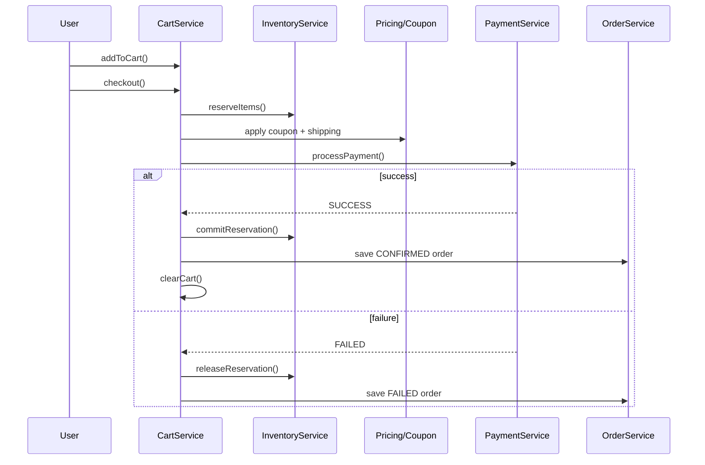

# E-commerce Cart + Checkout LLD

Flipkart/Amazon-style **cart → coupon → inventory hold → payment → order** flow in C++17.

## Quick run

```bash
cd Ecommerce_Cart_Checkout_LLD
./compile.sh
./ecommerce_checkout_app
```

## Flow



## Interview talking points

- Why reserve inventory **before** payment? → avoid overselling during checkout window.
- Why Strategy for payment? → new rails (wallet, EMI) without changing checkout service.
- Idempotency on `clientRequestId` → safe retries from mobile/web client.
- COD vs prepaid → different `PaymentStatus` while order can still be `CONFIRMED`.

See [`problem_statement.md`](problem_statement.md) for full scope.
