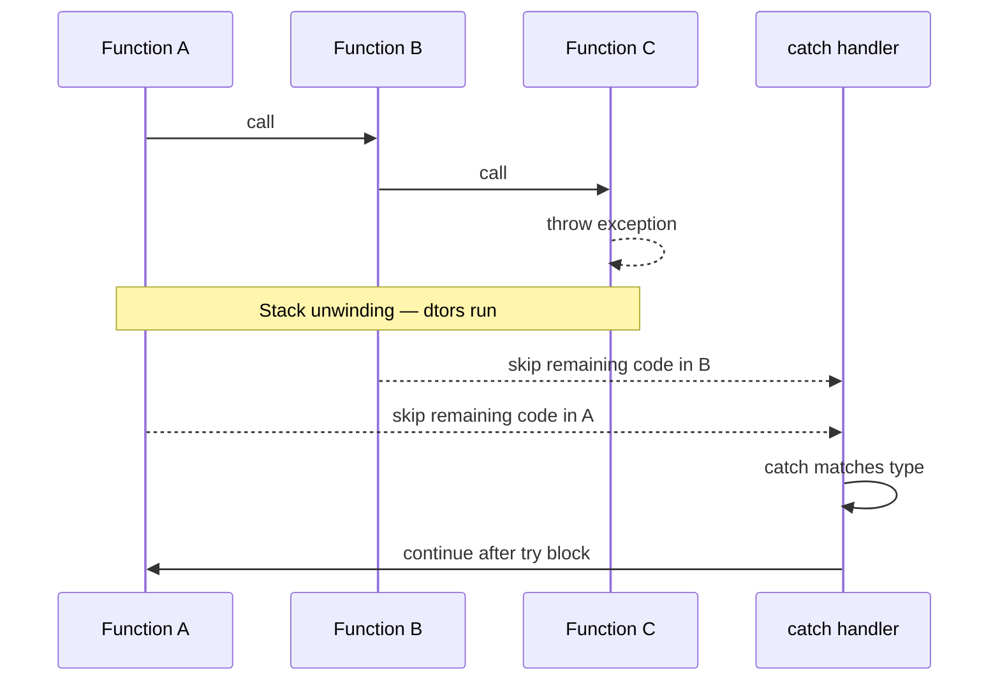
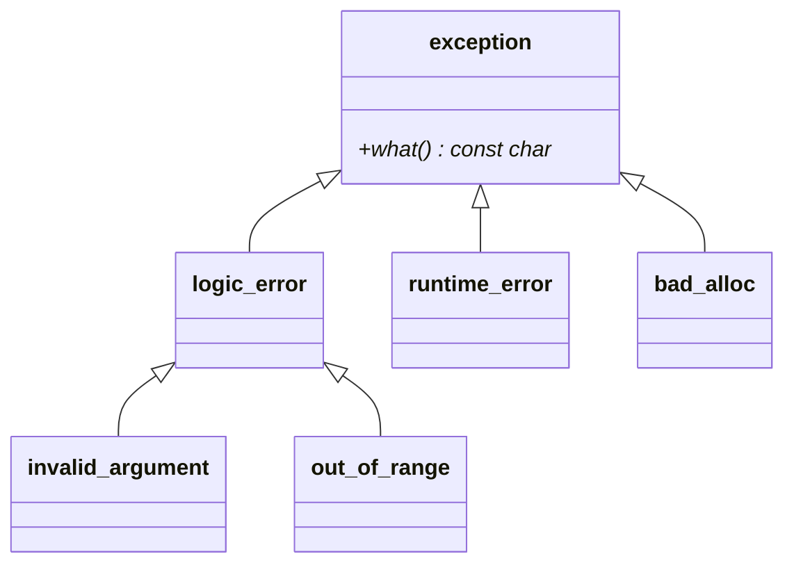
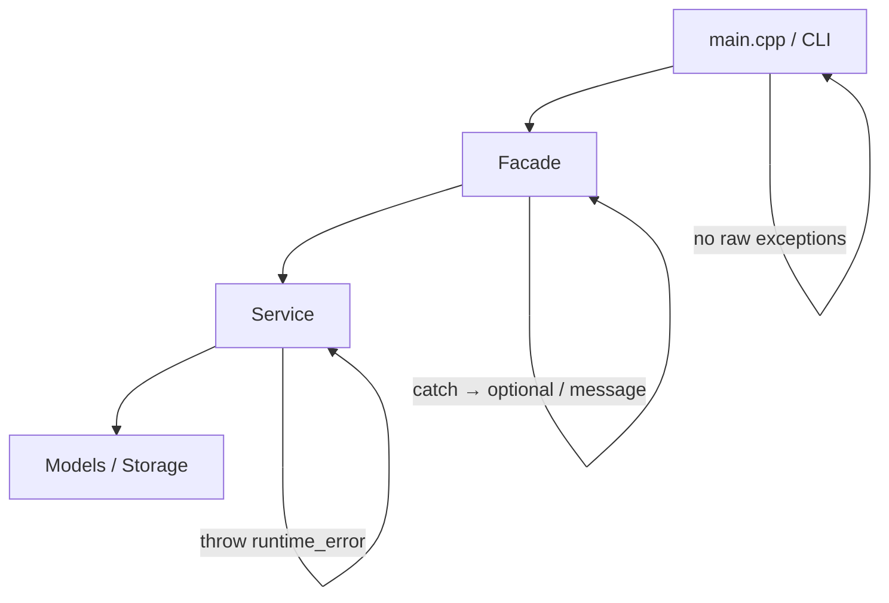

# Exception Handling in C++ — Complete Reference (C++17)

<p align="center">
  
  
  
</p>

> **Ye file** is module ki **master README / textbook** hai — types, functions, flow, LLD patterns, interview sab yahan.  
> **Code run karo:** [`C++ Code/`](./C++%20Code/) + `./compile.sh` → `bin/`  
> **Short index:** [`README.md`](./README.md)

---

## Table of Contents

1. [Exception Handling Kya Hai?](#1-exception-handling-kya-hai)
2. [Kitne Types / Categories Hoti Hain?](#2-kitne-types--categories-hoti-hain)
3. [Core Keywords — try, catch, throw](#3-core-keywords--try-catch-throw)
4. [Poori Standard Exception Hierarchy](#4-poori-standard-exception-hierarchy)
5. [Har Exception Type — Kab Use Karein](#5-har-exception-type--kab-use-karein)
6. [Catch Ke Types — Kaunsa Handler Kaise Kaam Karta Hai](#6-catch-ke-types--kaunsa-handler-kaise-kaam-karta-hai)
7. [Important C++ Functions & APIs (Detail)](#7-important-c-functions--apis-detail)
8. [Stack Unwinding & RAII](#8-stack-unwinding--raii)
9. [Exception Safety Guarantees](#9-exception-safety-guarantees)
10. [noexcept — Specification](#10-noexcept--specification)
11. [Custom Exception Classes](#11-custom-exception-classes)
12. [C++17 Alternatives — optional, variant](#12-c17-alternatives--optional-variant)
13. [LLD Me Exception Handling Patterns](#13-lld-me-exception-handling-patterns)
14. [SOLID / LSP — Exception Rule](#14-solid--lsp--exception-rule)
15. [Anti-Patterns — Kya Mat Karo](#15-anti-patterns--kya-mat-karo)
16. [Exception vs Error Codes vs optional](#16-exception-vs-error-codes-vs-optional)
17. [Repo Demos — Line-by-Line Map](#17-repo-demos--line-by-line-map)
18. [Interview Question Bank](#18-interview-question-bank)
19. [Quick Cheat Sheet (1 Page)](#19-quick-cheat-sheet-1-page)

---

## 1. Exception Handling Kya Hai?

**Exception handling** = program me **abnormal / error condition** ko normal return value ki jagah **signal** karke handle karne ka mechanism.

### Normal return vs exception

| | Return value | Exception |
|---|--------------|-----------|
| **Success/fail** | `bool`, `optional`, error code | `throw` + `catch` |
| **Caller skip** | Har level par check | Stack **unwind** — beech ke functions skip |
| **Cost** | Cheap (hot path) | Relatively costly (stack walk) |
| **LLD me** | Expected miss (seat nahi mila) | Invalid state / rule break |

### Flow diagram



**Hinglish:** `throw` = “yahan se neeche ka code mat chalao, upar jao jab tak koi `catch` mile.”

---

## 2. Kitne Types / Categories Hoti Hain?

C++ me “exception handling” ek mechanism hai; uske **andar** alag-alag **categories** hoti hain. Interview me ye clear bolo:

### 2.1 Mechanism types (kaise handle karte ho)

| # | Type | Matlab | C++ me |
|---|------|--------|--------|
| 1 | **Synchronous exception** | Same thread, stack unwind | `throw` / `try` / `catch` (main topic) |
| 2 | **Exception propagation** | Up the call stack | Automatic until `catch` |
| 3 | **Exception rethrow** | Same exception dubara up | `throw;` |
| 4 | **Deferred rethrow** | Baad me / doosri jagah | `std::exception_ptr` |
| 5 | **Catch-all** | Koi bhi type | `catch (...)` |
| 6 | **noexcept boundary** | Throw nahi karega | `noexcept` → `terminate` if throw |
| 7 | **Error handling without exception** | Expected failure | `optional`, `expected` (C++23), error code |

### 2.2 Exception **object** types (kya throw hota hai)

| # | Category | Example |
|---|----------|---------|
| A | **Standard library exceptions** | `std::runtime_error`, `std::invalid_argument` |
| B | **Custom exceptions** | `InsufficientBalanceException : runtime_error` |
| C | **Non-standard (bad)** | `throw 42`, `throw "error"` — **avoid** |

### 2.3 **Catch** types (handler kaise likha)

| # | Catch style | Safe? | Note |
|---|-------------|-------|------|
| 1 | `catch (const T& e)` | ✅ Best | No slicing, no extra copy |
| 2 | `catch (T e)` | ⚠️ | Object slicing for polymorphic types |
| 3 | `catch (T* e)` | ⚠️ | Pointer semantics — rare |
| 4 | `catch (...)` | ⚠️ | Unknown type — last resort |

### 2.4 **Design / architecture** types (LLD)

| # | Pattern | Kahan |
|---|---------|-------|
| 1 | **Throw in service** | Business rule fail |
| 2 | **Catch in facade** | User-facing boundary |
| 3 | **Translate to optional** | `tryX()` returns `nullopt` + `lastError` |
| 4 | **Log and rethrow** | Middle layer |
| 5 | **RAII cleanup** | “finally” without Java keyword |

---

## 3. Core Keywords — try, catch, throw

### 3.1 `throw` — exception throw karna

```cpp
throw std::runtime_error("Seat already booked");
throw customException;           // object copy/move
throw;                           // rethrow — only inside catch
```

| Form | Kab use |
|------|---------|
| `throw expr;` | Naya exception object create + throw |
| `throw;` | Active exception dubara throw (catch block me) |

**Important:** `throw` ke baad us line ke **neeche** ka code **nahi** chalta.

**Demo:** `C++ Code/01_basics_try_catch.cpp`

---

### 3.2 `try` — risky code block

```cpp
try {
    riskyCode();
} catch (const std::exception& e) {
    // handle
}
```

- Ek `try` ke multiple `catch` ho sakte hain.
- `try` ke andar nested `try` allowed (`10_nested_try_finally_raii.cpp`).

---

### 3.3 `catch` — handler

```cpp
catch (const std::invalid_argument& e) { /* specific */ }
catch (const std::runtime_error& e)   { /* specific */ }
catch (const std::exception& e)       { /* general std */ }
catch (...)                             { /* unknown type */ }
```

**Order rule:** **Pehle derived (specific), baad me base (general).**

```cpp
// ❌ GALAT — out_of_range kabhi catch nahi hoga
catch (const std::exception& e) { }
catch (const std::out_of_range& e) { }

// ✅ SAHI
catch (const std::out_of_range& e) { }
catch (const std::exception& e) { }
```

**Demo:** `C++ Code/04_catch_order_and_rethrow.cpp`

---

## 4. Poori Standard Exception Hierarchy

C++ standard library me sab exceptions ultimately `std::exception` se aati hain.

```
std::exception                    ← base: virtual const char* what() const noexcept;
│
├── std::logic_error              ← programming / logic mistake (fix code)
│   ├── std::invalid_argument     ← bad function argument
│   ├── std::domain_error         ← math domain (e.g. sqrt(-1))
│   ├── std::length_error         ← container max_size exceed
│   └── std::out_of_range         ← index/key out of range (at, map[])
│
├── std::runtime_error            ← runtime pe detect (LLD sabse common base)
│   ├── std::range_error          ← result out of valid range
│   ├── std::overflow_error       ← arithmetic overflow
│   ├── std::underflow_error      ← arithmetic underflow
│   └── (custom : runtime_error)  ← tumhari domain exceptions
│
└── std::bad_alloc                ← new failed (separate branch, not logic/runtime)
    └── std::bad_array_new_length
```

**Note:** `logic_error` aur `runtime_error` dono `exception` ke child hain — **siblings** hain, ek doosre ka parent nahi.



**Demo:** `C++ Code/02_standard_exception_hierarchy.cpp`

---

## 5. Har Exception Type — Kab Use Karein

| Exception class | Kab throw karein | LLD example | Demo |
|-----------------|------------------|-------------|------|
| `invalid_argument` | Null/empty id, negative amount, invalid enum | `withdraw(-100)` | 03, 07, 13 |
| `out_of_range` | `.at()` style, invalid index | `spots.at(99)` | 02, 04 |
| `length_error` | Vector/string too long | Bulk import cap | 02 |
| `domain_error` | Math/domain rules | Scheduling invalid date | 02 |
| `runtime_error` | Business rule fail | Seat booked, file exists | 07, 13 |
| `range_error` | Numeric result invalid | Percent > 100 stored wrong | 02 |
| `overflow_error` | Calc overflow | Large factorial | 02 |
| `underflow_error` | Calc underflow | Tiny number | 02 |
| `bad_alloc` | `new` fail | Huge in-memory store | — |
| **Custom** | Domain + extra fields | `InsufficientBalanceException` | 03 |

### LLD rule of thumb (yaad rakhna)

```
Input validate fail     → std::invalid_argument
Lookup miss / bounds    → std::out_of_range OR optional (expected)
Business rule fail      → std::runtime_error OR custom
Programmer bug          → assert (debug) — production me exception nahi
```

---

## 6. Catch Ke Types — Kaunsa Handler Kaise Kaam Karta Hai

### 6.1 Catch by `const&` (recommended)

```cpp
catch (const std::exception& e) {
    std::cout << e.what() << '\n';
}
```

| Fayda | Reason |
|-------|--------|
| No **object slicing** | `runtime_error` catch as `exception&` still works polymorphically |
| No copy on catch | Fast |
| `what()` safe | Virtual dispatch |

### 6.2 Catch by value — avoid for polymorphic

```cpp
catch (std::exception e) { }  // ⚠️ slicing — derived info lost
```

### 6.3 Catch by pointer

```cpp
catch (const std::exception* e) {
    if (e) std::cout << e->what();
}
```

Rare in modern C++; references preferred.

### 6.4 Catch-all `catch (...)`

```cpp
catch (...) {
    // koi bhi type — int, string, unknown
}
```

| Use | Risk |
|-----|------|
| Top-level boundary, library boundary | Type info lost — rethrow ya log only |

**Demo:** `C++ Code/12_catch_all_and_bad_throw.cpp`

---

## 7. Important C++ Functions & APIs (Detail)

### 7.1 `std::exception` — base class

| Function | Signature | Kya karti hai |
|----------|-----------|---------------|
| `what()` | `virtual const char* what() const noexcept` | Human-readable error message (C-string) |

```cpp
try {
    throw std::runtime_error("failed");
} catch (const std::exception& e) {
    std::cerr << e.what() << '\n';  // "failed"
}
```

- Message lifetime: exception object alive jab tak `what()` pointer valid (typically).
- Custom class me `what()` override via base constructor: `runtime_error("msg")`.

---

### 7.2 `throw` expression

| Syntax | Behavior |
|--------|----------|
| `throw e;` | Copy/move exception object, unwind stack |
| `throw;` | Rethrow **current handled** exception (only in `catch`) |

---

### 7.3 `std::current_exception()` — C++11

```cpp
#include <exception>

std::exception_ptr ep = std::current_exception();
```

| Property | Detail |
|----------|--------|
| **Returns** | `exception_ptr` to active exception, or **null** if none |
| **Use** | `catch (...)` me type unknown ho to store karke baad me rethrow |
| **Header** | `<exception>` |

**Demo:** `C++ Code/11_exception_ptr.cpp`

---

### 7.4 `std::rethrow_exception(ep)` — C++11

```cpp
std::rethrow_exception(ep);  // throws the stored exception
```

| Kab use | Example |
|---------|---------|
| Worker thread / helper ne store kiya | Main thread log + handle |
| Log middleware | Store → log → rethrow |

---

### 7.5 `std::exception_ptr` — type-erased holder

```cpp
std::exception_ptr ep;
try {
    risky();
} catch (...) {
    ep = std::current_exception();
}
// later...
if (ep) std::rethrow_exception(ep);
```

| Point | Detail |
|-------|--------|
| Reference counted | Copy kar sakte ho |
| Thread-safe ref count | Exception object copy ho sakta hai |
| Null = no exception stored | Check before rethrow |

---

### 7.6 `std::nested_exception` — C++11 (advanced)

```cpp
#include <exception>

try {
    inner();
} catch (...) {
    std::throw_with_nested(std::runtime_error("outer context"));
}
// catch (const std::nested_exception& e) { e.rethrow_nested(); }
```

| API | Role |
|-----|------|
| `throw_with_nested(e)` | Current exception ko `nested_exception` me wrap |
| `nested_exception::rethrow_nested()` | Inner exception throw |

**Interview:** Kam common; “wrapper service adds context” ke liye mention enough.

---

### 7.7 `noexcept` — operator & specifier

```cpp
void foo() noexcept;           // will not throw
void bar() noexcept(false);    // may throw (like old implicit)
bool ok = noexcept(expr);      // compile-time: can expr throw?
```

| Situation | Result if throw |
|-----------|-----------------|
| `noexcept` function | `std::terminate()` |
| Destructor (default) | `noexcept` — throw in dtor during unwind → **terminate** |

**Demo:** `C++ Code/06_noexcept.cpp`

---

### 7.8 `std::terminate()` — uncaught / noexcept violation

Called when:

1. Exception **uncaught** (koi `catch` nahi mila)
2. `noexcept` function me throw
3. Destructor throw during stack unwind

Program **abort** — recover nahi.

---

### 7.9 `std::unexpected` / dynamic exception specification — **removed**

C++11 se `throw(int)` function spec deprecated; **C++17 me removed.**

Purane code me `throw(Type)` list — ab mat use karo; sirf `noexcept` use karo.

---

### 7.10 Functions table — quick reference

| Function / API | Header | Purpose |
|--------------|--------|---------|
| `e.what()` | `<exception>` via hierarchy | Error message string |
| `std::current_exception()` | `<exception>` | Capture active exception → `exception_ptr` |
| `std::rethrow_exception(ep)` | `<exception>` | Throw stored exception |
| `std::throw_with_nested(e)` | `<exception>` | Wrap with nested context |
| `nested_exception::rethrow_nested()` | `<exception>` | Throw inner exception |
| `noexcept(expr)` | built-in | Compile-time noexcept check |
| `std::terminate()` | `<exception>` | Abort on fatal error handling |

---

## 8. Stack Unwinding & RAII

### 8.1 Stack unwinding

Jab `throw` hota hai, runtime **call stack ko upar** chadhta hai:

1. Har stack frame ke **automatic objects** ke destructors chalte hain.
2. Jab matching `catch` mile, unwind ruk jata hai.
3. Handler ke baad execution continue.

**Demo:** `C++ Code/14_stack_unwinding_destructors.cpp`

```
level1 ctor → level2 ctor → level3 ctor → throw
→ level3 dtor → level2 dtor → level1 dtor → catch at main
```

### 8.2 RAII — Resource Acquisition Is Initialization

```cpp
{
    std::unique_ptr<Resource> r = std::make_unique<Resource>();
    mayThrow();
}  // r destructor ALWAYS runs — exception ho ya na ho
```

| Concept | Java equivalent |
|---------|-----------------|
| Destructor on unwind | `finally` block |
| `unique_ptr` | GC + try-finally for heap |

**Demo:** `C++ Code/05_raii_exception_safety.cpp`, `10_nested_try_finally_raii.cpp`

### 8.3 ScopeGuard pattern (“finally”)

```cpp
ScopeGuard guard([&] { closeLog(); });
try { work(); } catch (...) { throw; }
// guard destructor → closeLog() always
```

---

## 9. Exception Safety Guarantees

Design classes so exceptions don't leave system broken.

| Guarantee | Matlab | Example |
|-----------|--------|---------|
| **No guarantee** | Leak / corrupt state possible | Raw `new` without catch |
| **Basic** | No leak; object **valid** (maybe changed) | Default after partial update |
| **Strong** | Success **OR** unchanged (rollback) | Copy-and-swap assignment |
| **Nothrow** | Never throws | `swap`, move `noexcept` |

**Strong guarantee idea (assignment):**

```cpp
Type& operator=(const Type& other) {
    Type temp(other);   // copy — fail here → *this unchanged
    swap(temp);         // noexcept swap
    return *this;
}
```

**Interview line:** “LLD in-memory systems usually target **basic**; payment-like ops aim **strong**.”

---

## 10. noexcept — Specification

### Destructor rule

> Destructors must not throw. Default `noexcept(true)`.

Agar destructor throw kare **during** another exception unwind → **`std::terminate`**.

### When to mark `noexcept`

| Mark `noexcept` | Don't mark (or `noexcept(false)`) |
|-----------------|-----------------------------------|
| `swap`, move ctor (if sure) | Most business methods |
| Simple getters | Parsing / I/O / allocation |

**Demo:** `C++ Code/06_noexcept.cpp`

---

## 11. Custom Exception Classes

### Template

```cpp
class BookingFailedException : public std::runtime_error {
public:
    BookingFailedException(std::string seatId, std::string reason)
        : std::runtime_error("Booking failed: " + seatId + " — " + reason),
          seatId_(std::move(seatId)) {}

    const std::string& getSeatId() const { return seatId_; }

private:
    std::string seatId_;
};
```

### Rules

| Rule | Why |
|------|-----|
| Inherit `std::exception` (usually via `runtime_error`) | `catch (const std::exception&)` works |
| `what()` message meaningful | Logging / API |
| Extra getters for domain fields | Caller specific handling |
| Don't over-inherit deep trees | 1–2 levels enough |

**Demo:** `C++ Code/03_custom_exception.cpp`

---

## 12. C++17 Alternatives — optional, variant

### `std::optional<T>` — expected failure

```cpp
std::optional<double> withdraw(double amount) {
    if (amount > balance_) return std::nullopt;
    balance_ -= amount;
    return balance_;
}
```

| | Exception | optional |
|---|-----------|----------|
| **Expected?** | Exceptional | Normal path |
| **Cost** | Higher unwind | Branch |
| **LLD** | Rule violation | “Not found” / soft fail |

**Demo:** `C++ Code/09_cpp17_features.cpp`, `13_lld_facade_error_boundary.cpp`

### `std::variant` + `std::visit` — typed errors (C++17)

```cpp
using Result = std::variant<SuccessData, ErrorCode>;
```

Multiple error types without inheritance — advanced interviews.

---

## 13. LLD Me Exception Handling Patterns

### 13.1 Layered model



| Layer | Responsibility |
|-------|----------------|
| **Service** | `throw` on business rule break |
| **Facade** | `try/catch` → `optional` / error string |
| **main** | Print user-friendly message |

**Demo:** `C++ Code/13_lld_facade_error_boundary.cpp`, `07_lld_service_validation.cpp`

### 13.2 Repo projects me kya use hota hai

| Project | Style |
|---------|--------|
| `File_Manager_LLD` | `throw std::runtime_error("File not found: ...")` |
| `Library_Management_System_LLD` | `runtime_error` member/book rules |
| `Parking_lot_system_LLD` | Spot not available |
| `Movie_Ticket` (extension) | Seat lock fail |

### 13.3 Validation checklist (service method start)

```cpp
void bookSeat(const std::string& seatId, const std::string& userId) {
    if (seatId.empty() || userId.empty())
        throw std::invalid_argument("seatId and userId required");
    if (booked_.count(seatId))
        throw std::runtime_error("Seat already booked: " + seatId);
    booked_.insert(seatId);
}
```

---

## 14. SOLID / LSP — Exception Rule

**Liskov Substitution:** Child ko parent ki jagah use karo to client **break** na ho.

### Exception rule (signature / behavior)

> Subclass should throw **fewer** or **narrower** exceptions than the client expects from the base — **not broader or new unrelated types**.

```cpp
class Parent {
public:
    virtual void getValue() { throw std::logic_error("parent"); }
};

class GoodChild : public Parent {
    void getValue() override {
        throw std::invalid_argument("narrower");  // OK — is-a logic_error
    }
};

class BadChild : public Parent {
    void getValue() override {
        throw std::runtime_error("broader");  // BAD — client catches logic_error only
    }
};
```

**Demo:** `C++ Code/08_lsp_exception_rule.cpp`  
**Also:** [`L6 SOLID_2/.../ExceptionRule.cpp`](../L6%20SOLID_2/C++%20Code/LSP-Rules/SingatureRules/ExceptionRule.cpp)

---

## 15. Anti-Patterns — Kya Mat Karo

| Anti-pattern | Kyun galat | Better |
|--------------|------------|--------|
| `throw 42` / `throw "text"` | Not `std::exception` | `throw std::runtime_error(...)` |
| Exception for control flow | Slow, unclear | `if` / `optional` |
| `catch (exception e)` by value | Slicing | `catch (const exception& e)` |
| `catch (...)` pehle | Specific handlers dead | `...` last |
| Empty `catch (...) {}` | Swallow errors | Log + rethrow or handle |
| `new` without RAII | Leak on throw | `unique_ptr` |
| Throw from destructor | terminate | Never throw from dtor |
| 100 exception types | Maintenance hell | Few + `what()` message |

**Demo:** `C++ Code/12_catch_all_and_bad_throw.cpp`

---

## 16. Exception vs Error Codes vs optional

| Approach | Pros | Cons | LLD use |
|----------|------|------|---------|
| **Exceptions** | Auto propagate, rich type | Cost, harder in C APIs | Business rules |
| **Error codes** (`enum class Error`) | Explicit, C-friendly | Caller must check every call | Embedded style |
| **`optional`** | Clear expected miss | No stack trace / reason detail | Lookup miss |
| **`variant<T, Error>`** | Typed union C++17 | Verbose | Modern APIs |

**Interview answer:**  
“In LLD interview I use **exceptions for invalid operations** on services, and **optional at facade** when I want a clean API for the driver (`main`). Production might add error codes for hot paths.”

---

## 17. Repo Demos — Line-by-Line Map

| File | Padhne se kya milega |
|------|----------------------|
| `01_basics_try_catch.cpp` | `throw` stops flow; `catch` resumes after try |
| `02_standard_exception_hierarchy.cpp` | `logic_error` vs `runtime_error` |
| `03_custom_exception.cpp` | Custom class + extra fields |
| `04_catch_order_and_rethrow.cpp` | Handler order + `throw;` |
| `05_raii_exception_safety.cpp` | `unique_ptr` cleanup on throw |
| `06_noexcept.cpp` | `noexcept` contract |
| `07_lld_service_validation.cpp` | Service throws; typed catches |
| `08_lsp_exception_rule.cpp` | Narrow vs broad child exceptions |
| `09_cpp17_features.cpp` | `optional`, `string_view`, structured bindings |
| `10_nested_try_finally_raii.cpp` | ScopeGuard = finally |
| `11_exception_ptr.cpp` | `current_exception`, `rethrow_exception` |
| `12_catch_all_and_bad_throw.cpp` | `catch(...)`, bad `throw int` |
| `13_lld_facade_error_boundary.cpp` | Facade + `optional` + `lastError` |
| `14_stack_unwinding_destructors.cpp` | Dtor order on unwind |

### Build & run all

```bash
cd Exception_Handling
./compile.sh
./run_all.sh
```

---

## 18. Interview Question Bank

<details>
<summary><strong>Q1: Exception handling kya hai?</strong></summary>

Runtime error ko `throw` se signal karna, stack unwind se propagate, matching `catch` se handle — bina har function me error code check kiye.

</details>

<details>
<summary><strong>Q2: logic_error vs runtime_error?</strong></summary>

`logic_error` = preventable bug / bad args (`invalid_argument`).  
`runtime_error` = rule fail at runtime (seat booked). LLD me zyada `runtime_error`.

</details>

<details>
<summary><strong>Q3: catch by reference kyun?</strong></summary>

Object slicing avoid + no copy + polymorphic `what()` sahi kaam kare.

</details>

<details>
<summary><strong>Q4: Stack unwinding?</strong></summary>

`throw` par stack up walk; har local object ka destructor; jab `catch` match ho ruke.

</details>

<details>
<summary><strong>Q5: RAII vs finally?</strong></summary>

C++ me `finally` nahi — destructor / `unique_ptr` / ScopeGuard hamesha cleanup.

</details>

<details>
<summary><strong>Q6: exception_ptr kab?</strong></summary>

Exception ko catch karke store karo, baad me doosri thread/layer me `rethrow_exception`.

</details>

<details>
<summary><strong>Q7: noexcept?</strong></summary>

Function throw nahi karega; throw hua to `terminate`. Destructors implicitly noexcept.

</details>

<details>
<summary><strong>Q8: LSP exception rule?</strong></summary>

Child parent se zyada **broad** exception throw na kare jo client handle nahi karta.

</details>

<details>
<summary><strong>Q9: Exception vs optional?</strong></summary>

Expected failure (not found) → optional. Rule violation / exceptional → throw.

</details>

<details>
<summary><strong>Q10: Facade me kya karein?</strong></summary>

Service throw kare; facade catch karke `optional` / error message — `main` clean rahe.

</details>

---

## 19. Quick Cheat Sheet (1 Page)

```
THROW     → signal error, unwind starts
TRY       → watch block
CATCH     → handle (const& , specific → general)
throw;    → rethrow in catch

BASE      → std::exception::what()
LLD       → invalid_argument (input), runtime_error (business)
CUSTOM    → class X : public std::runtime_error

CATCH     → const T& ✅ | T by value ❌ slicing | ... last resort

RAII      → dtor + unique_ptr = cleanup always
NOEXCEPT  → no throw; else terminate
PTR       → current_exception(), rethrow_exception(ep)

LSP       → child narrower exceptions only
FACADE    → catch → optional / lastError
ANTI      → throw int, catch(...), swallow, dtor throw

C++17     → optional for expected miss
```

---

## Related in this repo

| Resource | Link |
|----------|------|
| All demos | [`C++ Code/`](./C++%20Code/) |
| Short README | [`README.md`](./README.md) |
| LSP in SOLID | [`SOLID.md`](../SOLID.md) |
| File Manager throws | [`File_Manager_LLD`](../File_Manager_LLD/) |
| L6 Exception rule code | [`ExceptionRule.cpp`](../L6%20SOLID_2/C++%20Code/LSP-Rules/SingatureRules/ExceptionRule.cpp) |

---

<p align="center">
  <b>Master doc — Exception_Handling/EXCEPTION_HANDLING_COMPLETE.md</b><br/>
  <sub>14 runnable demos · C++17 · LLD interview ready</sub>
</p>
