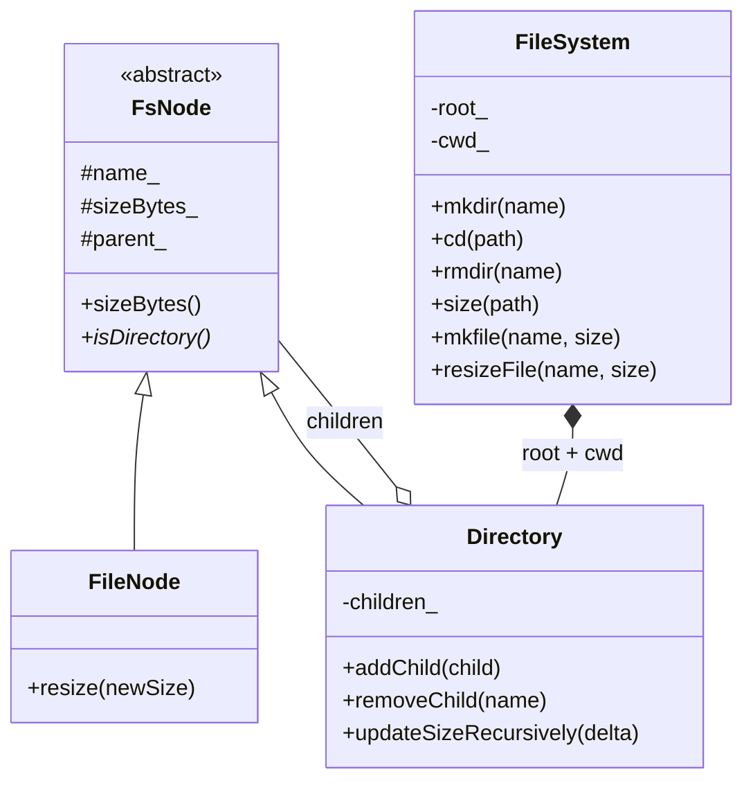
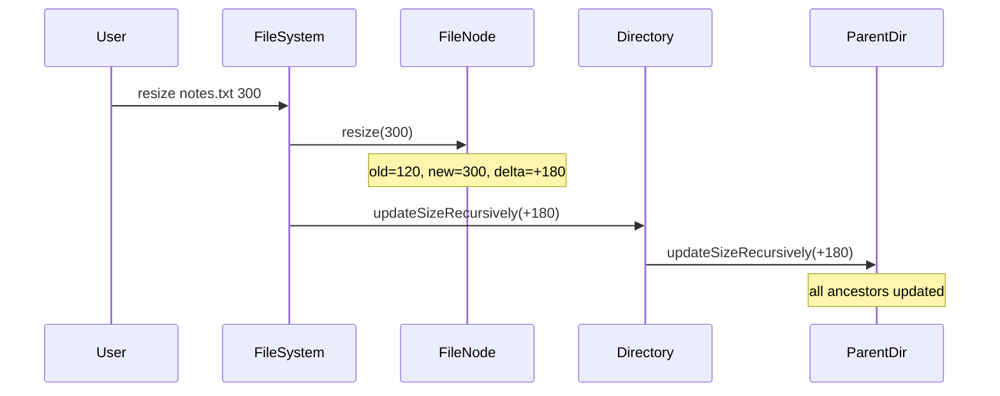

# Folder File System LLD

In-memory folder/file system in C++17 — supports `mkdir`, `cd`, `rmdir`, `size`, and **aggregate size propagation** so parent directories always reflect child file/folder changes.

---

## Features

| Feature | Command / API | Notes |
|--------|----------------|-------|
| Create directory | `mkdir <name>` | Fails on duplicate name in same folder |
| Navigate | `cd <path>` | Relative, absolute (`/`), `.`, `..` |
| Remove empty directory | `rmdir <name>` | Non-empty folder delete blocked (safe delete) |
| Query size | `size [path]` | Works on file or directory; default `.` = cwd |
| Create file | `mkfile <name> <bytes>` | Parent folder size updates immediately |
| Resize file | `resize <name> <bytes>` | Delta propagates up to root |
| Remove file | `rmfile <name>` | Parent size decreases by file size |
| List children | `ls` | Shows `[DIR]` / `[FILE]` + size |
| Print cwd | `pwd` | e.g. `/docs/projects` |

**Core requirement:** *changing size should reflect* — when a file is created, resized, or deleted, every ancestor directory's `size` is updated in **O(depth)** via `updateSizeRecursively`.

---

## Folder Structure

```
Folder_File_System_LLD/
├── main.cpp                 # FsNode, Directory, FileNode, FileSystem + CLI
├── compile.sh               # g++ -std=c++17 → folder_file_system_app
├── requirements.md          # Functional + non-functional requirements
├── problem_statement.md     # High-level problem description
└── README.md                # This file
```

---

## Architecture



---

## Size Propagation Flow



Directory size = **sum of all descendant file sizes** (folders store aggregate, not metadata overhead).

---

## Build & Run

```bash
./compile.sh
./folder_file_system_app
```

Interactive shell starts at `/`. Type `help` for commands, `exit` to quit.

---

## Example Session

```text
/ $ mkdir docs
OK
/ $ cd docs
OK
/docs $ mkfile notes.txt 120
OK
/docs $ size .
120
/docs $ resize notes.txt 300
OK
/docs $ size /
300
/docs $ cd ..
OK
/ $ rmdir docs
FAILED (dir missing or non-empty)
```

Cleanup (folder must be empty before `rmdir`):

```text
/ $ cd docs
/docs $ rmfile notes.txt
OK
/docs $ cd ..
/ $ rmdir docs
OK
/ $ size /
0
```

---

## Design Decisions

1. **Composite pattern** — `Directory` and `FileNode` both extend `FsNode`; directory size is derived from children.
2. **Parent pointer** — enables O(depth) size propagation without recomputing entire subtree.
3. **Safe `rmdir`** — only empty directories can be removed (interview-safe default).
4. **In-memory only** — no disk I/O; focus on LLD, not OS internals.
5. **Single-file layout** — easy to read in one interview pass; can be split into `models/`, `core/` later.

---

## Interview Talking Points

- Why store aggregate size on directory vs recompute on every `size` query? → **Trade-off:** O(1) read, O(depth) write vs O(subtree) read.
- How does `cd ..` at root behave? → Stays at root (`parent` is `nullptr`).
- What if two files same name? → Rejected in same directory (`hasChild` check).
- Extension ideas: `mv`, `cp`, recursive `rmdir -r`, symlinks, permissions, persistence.

---

## Related Docs

- [requirements.md](./requirements.md)
- [problem_statement.md](./problem_statement.md)
