# 1. Monolithic vs Microservices — Complete Deep Dive

> Har system design ki **buniyaad**. Interviewer pehle yahi poochta hai: "monolith ya
> microservices?" Iska jawab "it depends" hai — par **kis cheez pe depend karta hai**, wo poora
> yahan hai. Ye file dono architectures ko zero se detail me cover karti hai.

---

## 📑 Is file me kya hai
1. [Monolithic architecture — deep](#-monolithic-architecture)
2. [Microservices architecture — deep](#-microservices-architecture)
3. [Detailed comparison (12 dimensions)](#-detailed-comparison--12-dimensions)
4. [Inter-service communication](#-inter-service-communication-microservices)
5. [Data management (DB per service)](#-data-management)
6. [Deployment & scaling](#-deployment--scaling)
7. [Migration — monolith se microservices](#-migration-monolith--microservices)
8. [Real-world examples](#-real-world-examples)
9. [Anti-patterns](#-anti-patterns)
10. [Decision framework + interview](#-decision-framework)

---

## 🏛️ Monolithic Architecture

### Definition
Poori application **ek hi codebase me**, **ek hi process** me chalti hai, aur **ek hi unit** ki
tarah deploy hoti hai. UI, business logic, data access — sab modules ek saath compile aur deploy
hote hain. Sab modules ek hi memory space share karte hain (function calls, network calls nahi).

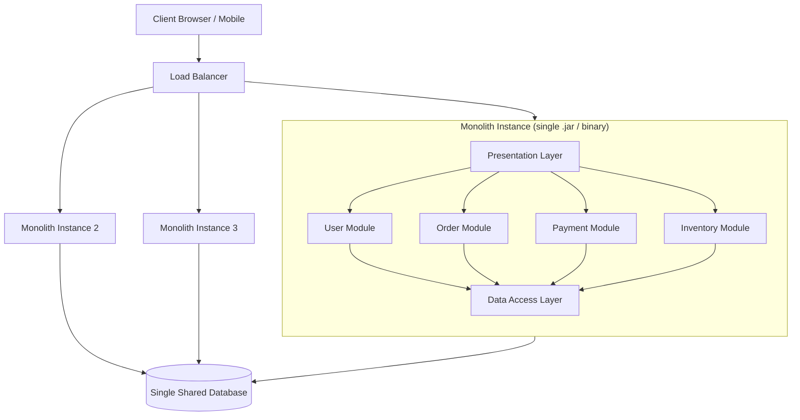

> **Dhyan do:** monolith **horizontally scale** ho sakta hai (multiple instances behind LB) —
> par har instance me **poora app** hota hai. Ye "single instance" ka matlab nahi, "single
> deployable unit" ka matlab hai.

### Monolith ke andar ki structure (layered)
```
┌─────────────────────────────────┐
│  Presentation Layer (Controllers)│  ← HTTP requests handle
├─────────────────────────────────┤
│  Business Logic Layer (Services) │  ← core logic
├─────────────────────────────────┤
│  Data Access Layer (Repositories)│  ← DB queries
├─────────────────────────────────┤
│  Database (single)               │
└─────────────────────────────────┘
```

### ✅ Monolith ke fayde (detail)
1. **Simple development** — ek codebase, ek IDE project, sab kuch ek jagah. Naye developer ko
   onboard karna aasan.
2. **Simple testing** — end-to-end test ek hi app pe. No network mocking between services.
3. **Simple deployment** — ek artifact (jar/binary/container) deploy karo, ho gaya.
4. **No network overhead** — modules ek doosre ko **in-process function calls** se bulate hain
   (microseconds), network API calls (milliseconds) nahi.
5. **ACID transactions easy** — ek DB, ek transaction me multiple tables update (atomic).
   `BEGIN → update orders → update inventory → COMMIT` — sab ya kuch nahi.
6. **Easy debugging** — ek stack trace me poora flow, ek log file.
7. **Strong consistency** — ek DB, no distributed consistency headache.

### ❌ Monolith ke nuksan (detail)
1. **Deployment coupling** — ek chhoti line change → **poora app rebuild + redeploy + restart**.
   Payment ka bug fix karne ke liye poora app deploy.
2. **No fault isolation** — ek module me memory leak / crash → **poora app down**. Inventory
   module ka bug user login ko bhi le doobta.
3. **Scaling inefficiency** — sirf payment module busy hai, par scale karne ke liye **poora app**
   replicate karna padta (memory/CPU waste — har replica me poora app).
4. **Technology lock-in** — poora app ek stack (Java/Python). Ek module ke liye behtar tool
   (Go for concurrency) use nahi kar sakte.
5. **Codebase complexity** — time ke saath "big ball of mud" ban jaata. Modules ke beech
   boundaries dhundhli, tight coupling, samajhna mushkil.
6. **Slow builds/tests** — bada codebase = slow CI/CD (poora build har baar).
7. **Team scaling issue** — 100 developers ek codebase pe = merge conflicts, coordination hell.

---

## 🧩 Microservices Architecture

### Definition
Application ko **chhoti, independent, loosely-coupled services** me todo. Har service:
- **ek business capability** handle karti hai (User, Order, Payment...)
- **apna codebase, apna DB, apna deployment** rakhti hai
- doosri services se **network (API/events)** se baat karti hai
- **independently** develop/deploy/scale hoti hai

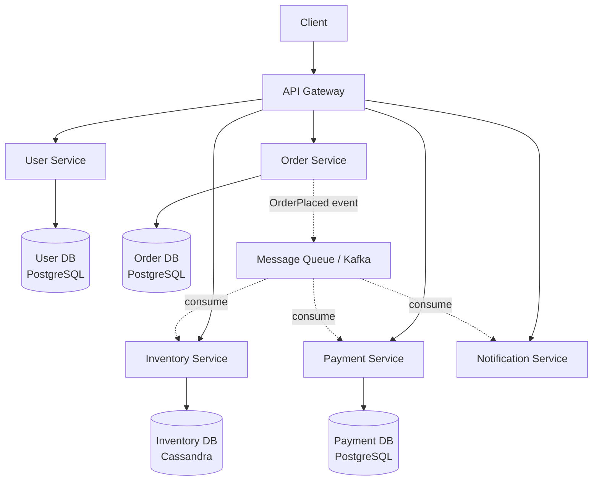

### Microservices ke core principles
1. **Single Responsibility** — ek service = ek bounded context (DDD). "User service sirf users."
2. **Independent deployability** — ek service deploy karo, baaki untouched.
3. **Decentralized data** — har service ka apna DB (shared DB = anti-pattern).
4. **Smart endpoints, dumb pipes** — logic services me, communication simple (HTTP/messaging).
5. **Design for failure** — koi bhi service kabhi bhi down ho sakti — handle karo (timeouts,
   circuit breakers, retries).
6. **Polyglot** — per service best tech (User=Java, Recommendation=Python/ML, Realtime=Go).

### ✅ Microservices ke fayde (detail)
1. **Independent deployment** — payment fix → sirf payment service deploy (2 min), poora app nahi.
   Deploy frequency badhti (CI/CD per service).
2. **Independent scaling** — sirf payment busy → **sirf payment service** ke 10 replicas. Cost
   efficient (jo chahiye wahi scale).
3. **Fault isolation** — payment service crash → order/user chalte rahenge (graceful degradation —
   "payment abhi unavailable" par baaki app up).
4. **Technology flexibility** — per service alag stack/DB. Recommendation ML Python me, realtime Go me.
5. **Team autonomy** — chhoti teams (2-pizza) apni service own karti — parallel development,
   fast iteration, clear ownership.
6. **Reusability** — auth service saari services use kar sakti.
7. **Easier to understand** — ek service chhoti aur focused (poora "big ball of mud" nahi).

### ❌ Microservices ke nuksan (detail)
1. **Distributed system complexity** — network calls fail hote (timeout, partial failure), latency
   add hoti, ordering issues. "Fallacies of distributed computing" apply hoti.
2. **Data consistency** — ek DB nahi → **distributed transactions** (2PC/Saga) chahiye. Eventual
   consistency accept karni padti. "Order placed but inventory not updated" jaise edge cases.
3. **Operational overhead** — 50 services = 50 deployments, 50 monitoring dashboards, 50 log
   streams. DevOps/infra investment zaroori (Kubernetes, service mesh, CI/CD).
4. **Testing complexity** — integration testing across services mushkil (contract testing,
   end-to-end environments).
5. **Network cost** — in-process call (μs) → network call (ms). Chatty services = latency.
6. **Debugging mushkil** — ek request 8 services se guzarti — distributed tracing (Jaeger) chahiye.
7. **Cost** — infra (more machines), tooling, expertise — expensive.

---

## 📊 Detailed Comparison — 12 dimensions

| # | Dimension | Monolith | Microservices |
|---|---|---|---|
| 1 | **Codebase** | ek repository, ek project | multiple repos/services |
| 2 | **Deployment** | poora ek saath (coupled) | per-service independent |
| 3 | **Scaling** | poora app replicate | per-service (granular) |
| 4 | **Failure isolation** | ek bug → sab down | isolated (ek down, baaki up) |
| 5 | **Data** | ek DB, ACID transactions | DB per service, eventual consistency |
| 6 | **Communication** | in-process (function calls, fast) | network (API/events, slower) |
| 7 | **Tech stack** | ek (locked) | polyglot (per service) |
| 8 | **Team structure** | ek bada team (coordination) | chhoti autonomous teams |
| 9 | **Development speed** | fast early, slow later (bloat) | slow early (setup), fast later |
| 10 | **Testing** | simple (one app) | complex (integration/contract) |
| 11 | **Debugging** | easy (one trace) | hard (distributed tracing needed) |
| 12 | **Operational cost** | low | high (infra + tooling + expertise) |

### Cost-benefit over time (mental model)
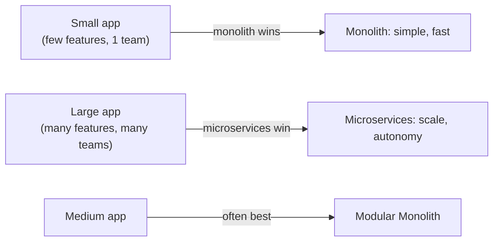

---

## 🔗 Inter-service Communication (Microservices)

Services network se baat karti hain — do styles:

### 1. Synchronous (request-response)
Caller wait karta hai response ke liye.
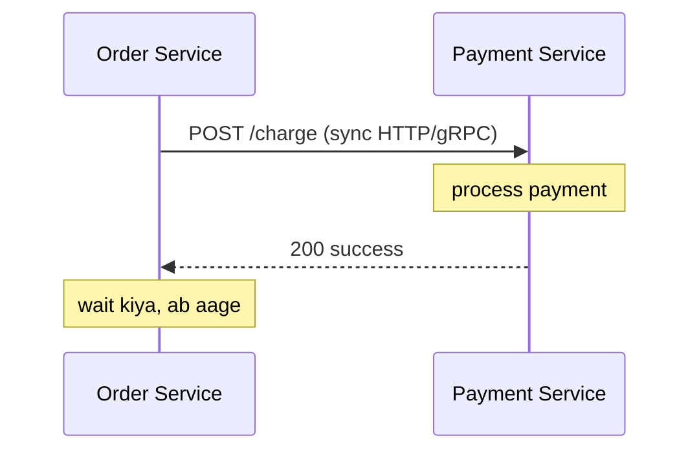
- **Protocols:** REST (HTTP/JSON), gRPC (HTTP2/Protobuf — fast, internal).
- ✅ Simple, immediate result.
- ❌ Tight coupling (callee down → caller blocked), latency chains (A→B→C→D), cascading failure.
- **Zaroori:** timeout + retry + circuit breaker.

### 2. Asynchronous (event-driven / messaging)
Caller message bhej ke aage badh jaata, consumer baad me process karta.
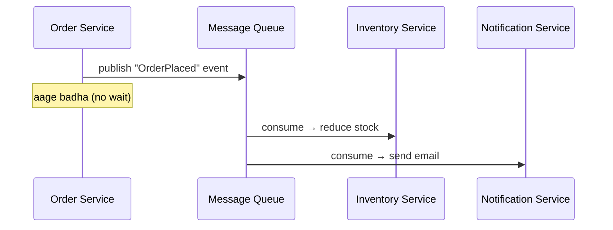
- **Tools:** Kafka, RabbitMQ, SQS. [Detail: `18_Message_Queues...`](./18_Message_Queues_Kafka_RabbitMQ.md)
- ✅ Loose coupling, resilient (consumer down → messages queued), spike buffering, scalable.
- ❌ Eventual consistency, complex debugging, ordering/duplicate handling.

### Sync vs Async — kab kya
| Use sync | Use async |
|---|---|
| immediate result chahiye (login, payment confirm) | fire-and-forget (email, analytics) |
| simple request-reply | decoupling / spike absorb |
| user waiting | background processing |

> ⭐ **Best practice:** critical path pe sync minimal rakho (chains avoid), non-critical
> (notifications, analytics, inventory sync) async karo.

---

## 🗄️ Data Management

### Database per service (core principle)
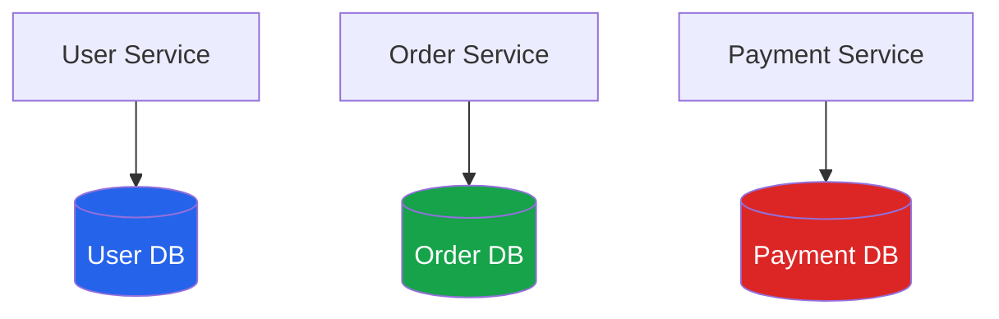
Har service **sirf apna DB** access karti. Doosri service ka data chahiye → **API call** ya
**event** se (direct DB access = tight coupling = anti-pattern).

**Kyun DB per service?**
- Loose coupling (schema change ek service tak)
- Independent scaling (per DB)
- Polyglot persistence (Order=SQL, Inventory=Cassandra, Cache=Redis)

**Challenges:**
- **Cross-service queries** — "user ka poora order + payment history" → API composition ya
  CQRS read model.
- **Distributed transactions** — "order + payment + inventory atomic" → **Saga pattern**
  (compensating actions), 2PC (avoid).
- **Data duplication** — kuch data replicate hota (events se sync) — eventual consistency.

### Saga pattern (distributed transaction)
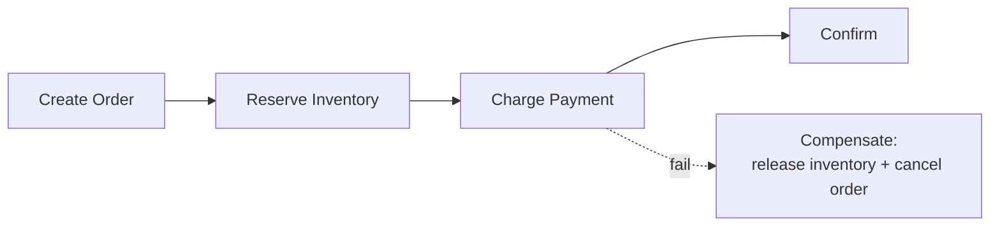
Ek transaction ke bajaye **local transactions ki chain** + har step ka **undo (compensation)**.
[Detail: HLD_Interview.md → distributed transactions]

---

## 🚀 Deployment & Scaling

| | Monolith | Microservices |
|---|---|---|
| Unit | ek artifact | many containers |
| Orchestration | simple (VM/container) | Kubernetes usually |
| CI/CD | ek pipeline | pipeline per service |
| Scaling | replicate whole | scale hot services only |
| Rollback | poora app | per service |

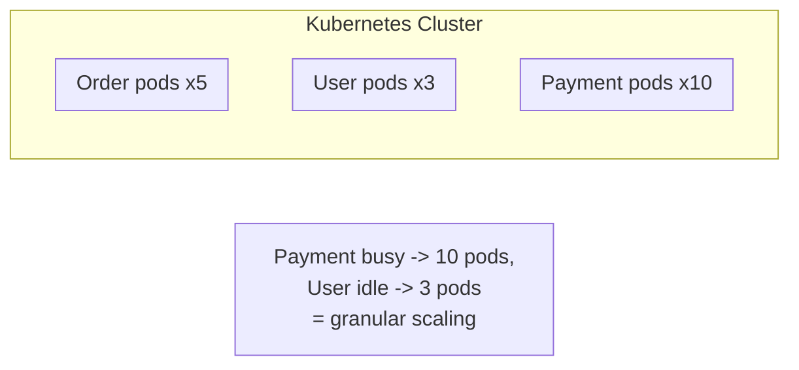

---

## 🔄 Migration: Monolith → Microservices

**Kabhi bhi "big bang rewrite" mat karo** (bahut risky). **Strangler Fig pattern** use karo:

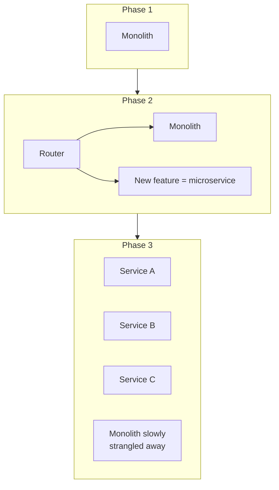

**Steps:**
1. **Identify boundaries** — domain ke hisaab se modules (bounded contexts).
2. **New features as services** — naye features microservices me banao.
3. **Extract high-value modules** — jo independently scale/deploy karne padte, unhe pehle nikaalo.
4. **Router/facade** — requests ko monolith ya new service pe route karo.
5. **Gradually strangle** — dheere-dheere monolith ka har module service me, monolith khatam.

> ⚠ **Kab migrate NA karo:** app chhoti hai, team chhoti hai, koi scaling/deploy pain nahi.
> "Microservices solve organizational + scale problems, not code-quality problems."

---

## 🌍 Real-world examples
- **Amazon** — 2001 me monolith se microservices (har team apni service, "you build it you run it").
- **Netflix** — pioneer of microservices at scale (100s of services, chaos engineering).
- **Uber** — monolith se 1000s of microservices (baad me consolidate bhi kiya — "macroservices").
- **Shopify** — famous **modular monolith** (Rails) at huge scale — proof monolith bhi scale karta.
- **Stack Overflow** — monolith pe massive traffic handle karta (few servers, well-optimized).

> **Sabak:** microservices zaroori nahi bade scale ke liye — Shopify/StackOverflow monolith pe
> huge scale pe hain. Microservices **organizational + independent-deployment** problem solve karte.

---

## ⚠️ Anti-patterns

| Anti-pattern | Kya | Fix |
|---|---|---|
| **Distributed monolith** | microservices par tightly coupled (ek change → sab deploy) | proper boundaries, async events |
| **Shared database** | multiple services ek DB | DB per service |
| **Nano-services** | bahut chhoti services (overhead > benefit) | right-sized services |
| **Chatty services** | ek request pe 20 inter-service calls | aggregate, async, co-locate data |
| **Premature microservices** | chhoti app ko microservices me tod dena | start monolith |
| **No monitoring** | 50 services, no observability | distributed tracing + centralized logs |

---

## 🎯 Decision Framework

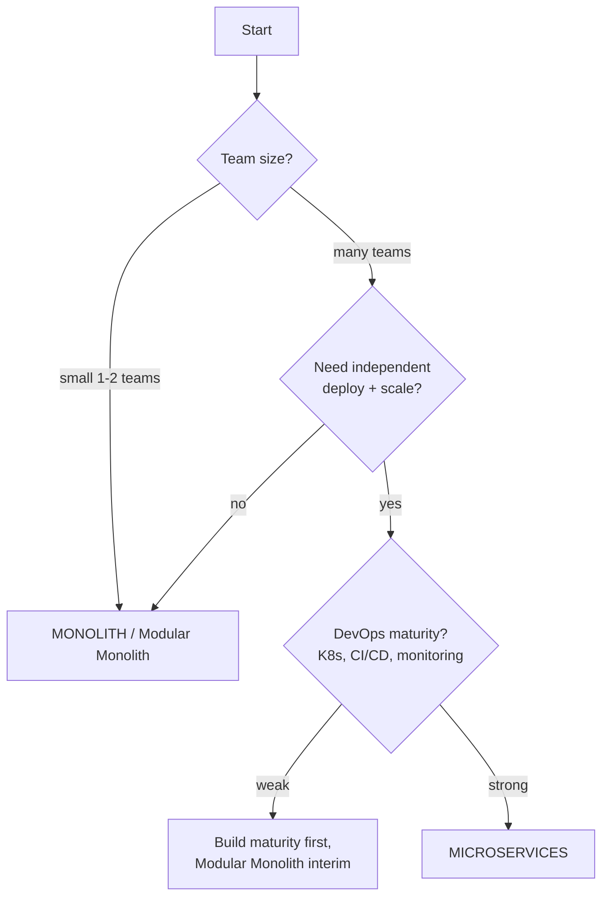

**Checklist — microservices tab jab:**
- ✅ Multiple teams, coordination pain ho raha
- ✅ Different modules ko independently scale karna hai
- ✅ Deploy frequency badhani hai (per module)
- ✅ Strong DevOps/infra (K8s, CI/CD, observability) hai
- ✅ Clear domain boundaries pata hain

**Monolith tab jab:**
- ✅ Startup / MVP / small team
- ✅ Domain abhi evolve ho raha (boundaries clear nahi)
- ✅ Fast iteration chahiye, ops overhead afford nahi

---

## 💬 Interview Q&A

**Q: Microservices ke biggest challenges?**
Distributed complexity (network failures, latency), data consistency (distributed transactions),
operational overhead (monitoring/deploy 50 services), debugging (distributed tracing).

**Q: Kaise decide karoge monolith vs microservices?**
Team size + scale + deploy frequency + DevOps maturity + domain clarity. Start monolith, split
when real pain (independent scaling/deploy across teams).

**Q: Data consistency microservices me kaise?**
Saga pattern (local transactions + compensations), eventual consistency, event-driven sync,
outbox pattern for reliable events. Avoid distributed 2PC at scale.

**Q: "Distributed monolith" kya hai?**
Microservices banaye par tightly coupled — ek change → sab deploy. Worst of both worlds. Fix:
proper boundaries, async communication, independent data.

**Q: Ek monolith huge scale pe chal sakta?**
Haan — Shopify, StackOverflow proof. Horizontal scaling (replicas + LB) + caching + read
replicas se monolith bhi millions handle karta. Microservices scale nahi, **organizational
autonomy** ke liye zyada.

**Q: Modular monolith kya hai?**
Monolith par well-defined internal module boundaries (clean interfaces, separate schemas).
Single deploy simplicity + microservices-ready structure. Best for medium apps.

---

## 🌐 Fallacies of Distributed Computing (microservices me yaad rakho)

Microservices distributed system hai — ye 8 galat assumptions engineers karte hain jo bugs laate:
1. **The network is reliable** — nahi, packets drop hote, connections fail hote.
2. **Latency is zero** — network calls μs nahi, ms lete hain (chains me add hoti).
3. **Bandwidth is infinite** — nahi, large payloads slow.
4. **The network is secure** — nahi, encrypt karo (mTLS).
5. **Topology doesn't change** — services scale/move, IPs badalte (service discovery chahiye).
6. **There is one administrator** — many teams, many configs.
7. **Transport cost is zero** — serialization/network cost real hai.
8. **The network is homogeneous** — different services, protocols, versions.

> ⭐ Isliye microservices me **timeouts, retries (with backoff), circuit breakers, idempotency,
> service discovery, mTLS** — sab zaroori. Monolith me ye problems hain hi nahi (in-process calls).

---

## 🕸️ Service Mesh (microservices ka networking layer)

Jab services 50+ ho jaayein, har service me networking logic (retry, mTLS, tracing) duplicate
karna painful. **Service mesh** ye cross-cutting networking **app code ke bahar** handle karta —
har service ke saath ek **sidecar proxy** (Envoy) deploy hota.

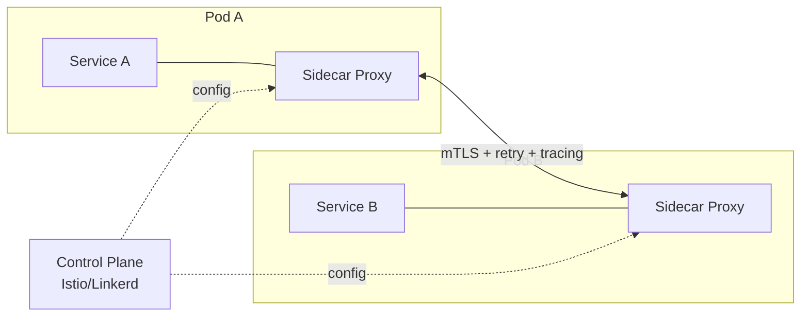

**Service mesh handle karta:** mTLS (auto encryption), retries, timeouts, circuit breaking,
load balancing, observability (metrics/tracing), traffic splitting (canary). App code sirf
business logic. Examples: **Istio, Linkerd, Consul Connect**.

---

## 🔭 Observability in Microservices (3 pillars)

Monolith me ek log file, ek stack trace. Microservices me ek request 8 services se guzarti —
**observability mandatory**:

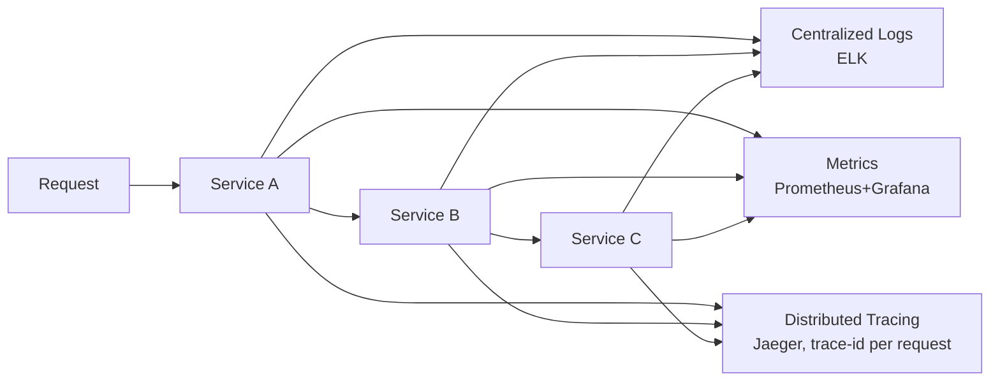

- **Logs** — structured (JSON), centralized (ELK: Elasticsearch+Logstash+Kibana), correlation-id.
- **Metrics** — QPS, latency (p50/p95/p99), error rate (Prometheus + Grafana). RED method.
- **Tracing** — ek request ka poora journey (trace-id har hop pe). Bottleneck kaunsi service
  hai — pata chalta (Jaeger, Zipkin).

> Monolith me ye "nice to have"; microservices me "**can't operate without**".

---

## 🔀 API Contracts & Versioning (services ke beech)

Services independently deploy hoti — par ek service ka API change doosri ko tod sakta. Isliye:
- **Backward compatibility** — naye fields add karo (optional), purane mat todo.
- **Versioning** — `/v1/users`, `/v2/users` (breaking change pe naya version).
- **Contract testing** — consumer-driven contracts (Pact) — producer change consumer ko tode to
  CI me pakad lo.
- **Schema evolution** — Protobuf/Avro (Kafka) forward+backward compatible schemas.

---

## 🛒 Worked example — E-commerce (dono architectures)

### Monolith version
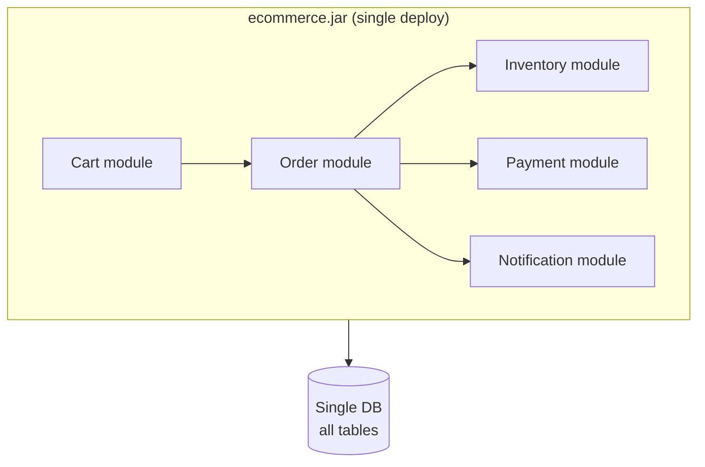
`placeOrder()` = ek transaction: `BEGIN → deduct inventory → create order → charge → COMMIT`.
Atomic (ACID). Simple. Par Black Friday pe **poora app** scale karna padega (checkout busy ho ya na ho).

### Microservices version
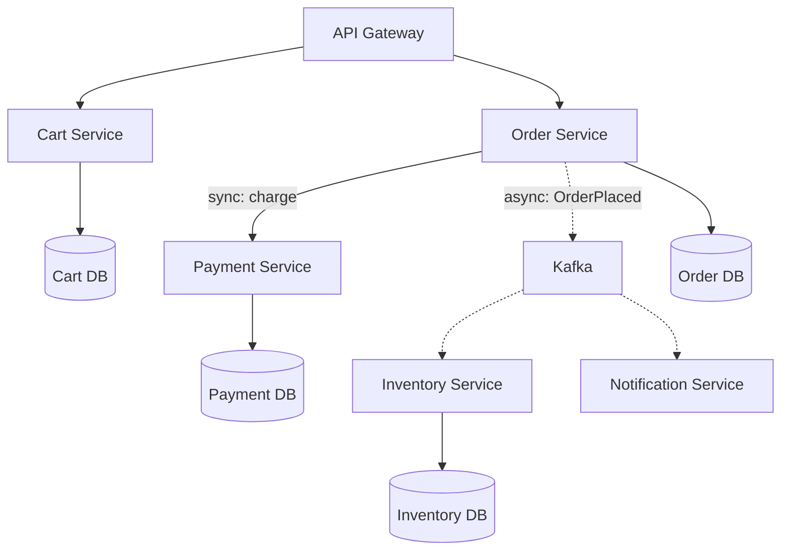
`placeOrder()` = **Saga**: order create → payment charge (sync) → OrderPlaced event → inventory
+ notification (async). No single transaction — **eventual consistency**. Agar payment fail →
compensate (cancel order). Black Friday pe **sirf Order + Payment** services scale karo.

| | Monolith checkout | Microservices checkout |
|---|---|---|
| Consistency | ACID (atomic) | eventual (Saga) |
| Scaling | poora app | Order+Payment only |
| Failure | payment bug → app down | payment down → "try later", rest up |
| Complexity | low | high (events, compensation) |

---

# 🎨 PART II — Microservices Design Patterns (deep, by phase)

> Microservices banana sirf "services me todo" nahi hai. Har **phase** ke apne patterns hain.
> Interview me ye patterns naam se aate hain. Ye section 5 phases cover karta:
> **Decomposition → Database → Communication → Deployment → Observability** — plus cross-cutting
> patterns (Saga, CQRS, Outbox, Strangler Fig, Canary).

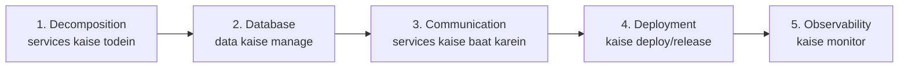

---

## 🧩 Phase 1 — Decomposition Patterns

"Application ko services me **kaise todein**?" — sabse pehla aur critical decision. Galat boundaries
= distributed monolith.

### 1.1 — Decompose by Business Capability
Services ko **business capabilities** ke hisaab se todo — jo business karta hai (Order Management,
Inventory, Payment, Shipping). Har capability = ek service.
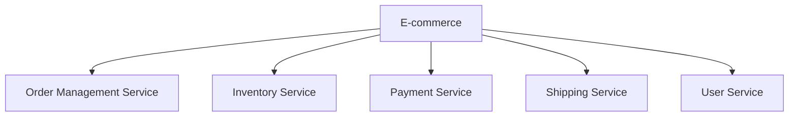
- ✅ Stable boundaries (business capabilities rarely change), aligns with org structure.
- **Kab:** business capabilities clear ho.

### 1.2 — Decompose by Subdomain (DDD — Domain-Driven Design)
**Bounded contexts** se todo (DDD). Domain ko subdomains me (Core, Supporting, Generic), har
bounded context = ek service. Ubiquitous language, clear model boundaries.
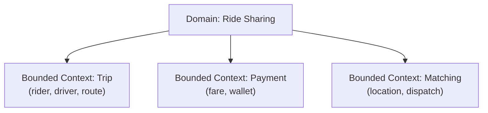
- ✅ Strong boundaries (domain model), low coupling.
- **Kab:** complex domain, DDD approach.

> ⭐ **Business capability vs Subdomain** — dono similar. Capability = business ki activity view.
> Subdomain = domain (DDD) view. Practice me aksar overlap. Dono ka goal: **cohesive, loosely-
> coupled boundaries**.

### 1.3 — Strangler Fig Pattern ⭐ (monolith → microservices migration)
Monolith ko **ek saath rewrite mat karo** (bahut risky). "Strangler fig" plant ki tarah — naye
services purane monolith ke around ugte hain, dheere-dheere use "strangle" (replace) karte hain.

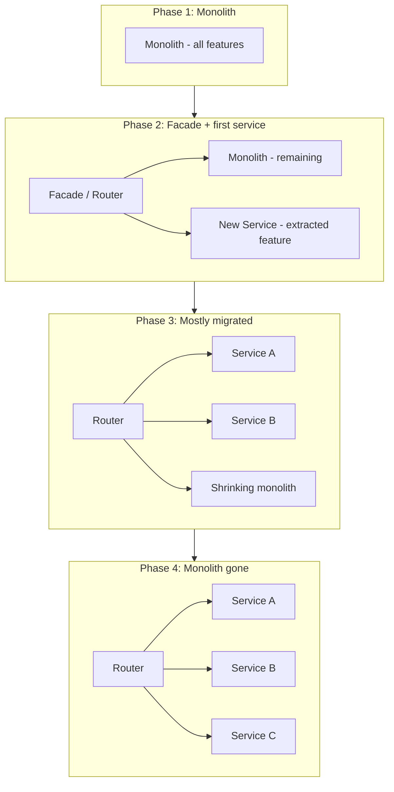

**Steps:**
1. **Facade/Router** — monolith ke saamne ek proxy/router jo requests route karta.
2. **Extract one capability** — ek feature ko microservice me nikaalo. Router us feature ki
   requests naye service ko, baaki monolith ko.
3. **Repeat** — ek-ek karke features migrate. Monolith shrink hota jaata.
4. **Monolith retire** — jab saara migrate ho jaaye, monolith khatam.

- ✅ **Low risk** (incremental, rollback easy), continuous delivery during migration, no big-bang.
- ⚠ Migration lambi (months/years), dual maintenance during transition.
- **Kab:** existing monolith ko microservices me migrate karna ho (almost always Strangler Fig).

### 1.4 — Sidecar Pattern
Main service ke saath ek **helper container** (sidecar) deploy — cross-cutting concerns (logging,
monitoring, proxy, config) app se bahar.
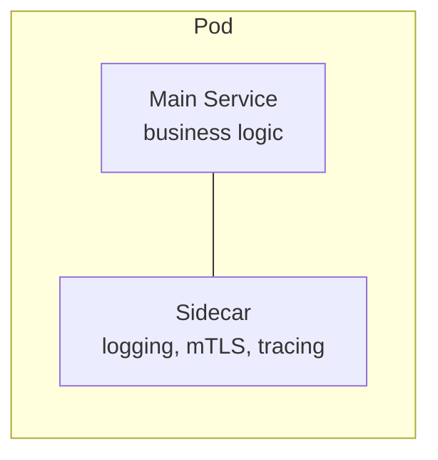
- Service mesh (Istio) sidecar proxy (Envoy) use karta — networking app code se bahar.
- ✅ Cross-cutting reusable, language-agnostic (sidecar kisi bhi service ke saath).

### 1.5 — Anti-Corruption Layer (ACL)
Naya service purane legacy system se baat kare — beech me ek **translation layer** (ACL) jo legacy
ke "corrupt" model ko naye clean model me translate kare (legacy leak na ho naye service me).

---

## 🗄️ Phase 2 — Database Patterns

"Data ko kaise manage karein jab har service ka apna DB ho?" — microservices ka sabse hard part.

### 2.1 — Database per Service ⭐ (foundational)
Har service ka **apna private database**. Doosri service ka data → API/events se (direct DB access
NAHI).

- ✅ Loose coupling (schema change ek service tak), independent scaling, polyglot persistence
  (Order=SQL, Inventory=Cassandra, Cache=Redis).
- ⚠ Cross-service queries + distributed transactions mushkil (isi ke solutions neeche).
- **Anti-pattern:** **Shared Database** (multiple services ek DB) — tight coupling (schema change
  sab ko affect), ek DB = SPOF/bottleneck. Avoid.

### 2.2 — Saga Pattern ⭐⭐ (distributed transactions) — FULL DEEP DIVE

#### Problem — distributed transaction kyun mushkil
Ek business transaction jo **multiple services** touch kare (order + payment + inventory + shipping)
— har service ka **apna DB** hai, to ek single DB transaction (`BEGIN...COMMIT`) possible **nahi**.
Aur **2PC (Two-Phase Commit)** distributed transactions ke liye hai, par:
- **Blocking** — coordinator down → participants locked (wait).
- **Slow** — locks held across services (poor throughput).
- **Availability hit** — ek participant down → poora transaction stuck.
- Modern microservices me 2PC **avoid** kiya jaata (scale + availability ke liye).

#### Saga = local transactions + compensations
**Saga** = ek distributed transaction ko **chhoti local transactions ki sequence** me todo. Har
local transaction ek service ke apne DB me (ACID). Agar koi step **fail** ho, to pehle wale steps ko
**compensating transactions** (undo actions) se reverse karo.

```mermaid
flowchart LR
    T1[T1: Create Order] --> T2[T2: Reserve Inventory] --> T3[T3: Charge Payment] --> T4[T4: Arrange Shipping]
    T4 -.fail.-> C3[C3: Refund Payment]
    C3 --> C2[C2: Release Inventory]
    C2 --> C1[C1: Cancel Order]
    style C1 fill:#dc2626,color:#fff
    style C2 fill:#dc2626,color:#fff
    style C3 fill:#dc2626,color:#fff
```

- **Forward transactions:** T1 → T2 → T3 → T4 (each commits locally).
- **Compensating transactions:** C1, C2, C3... (each **undoes** a completed forward step — reverse
  order). Note: **compensation ≠ rollback** — ye ek **naya transaction** hai jo effect reverse karta
  (payment already charged → C3 = refund, na ki "un-charge").

> ⭐ **Key insight — NO atomic rollback:** distributed me ACID rollback nahi hai. Isliye har forward
> step ka ek **semantic undo** (compensation) likhna padta. Payment charge ho gaya → undo = refund.
> Order created → undo = cancel. **Eventual consistency** milti (immediate nahi).

#### ⚡ Sync ya Async? (ye tune specifically poochha)
Saga steps ke beech communication **do tarah** ho sakta:
- **Asynchronous (messaging/events)** — **most common + recommended.** Services message broker
  (Kafka/RabbitMQ) ke through events/commands bhejti. Producer **wait nahi karta** (fire + move on),
  consumer apni speed se process karta. **Loose coupling + resilient** (consumer down → message
  queued).
- **Synchronous (REST/gRPC request-reply)** — orchestrator direct HTTP/gRPC call karke response ka
  wait karta. Simple, par **tight coupling + blocking** (callee down → caller blocked).

> ⭐ **Rule:** Saga usually **asynchronous** hota (specially choreography — pure event-driven).
> Orchestration **dono** kar sakta (async command/reply channels — recommended; ya sync request-reply
> — simpler but blocking). **Choreography hamesha async** (events). Neeche dono detail me.

---

### 🎭 Type A — Choreography (Event-Driven)

**Koi central coordinator nahi.** Har service ek event **publish** karti hai, aur doosri services us
event ko **subscribe/consume** karke apna kaam karti hain aur apna event publish karti hain. Logic
**distributed** across services (decentralized "dance" — sab apni-apni cue pe react karte).

**Communication: fully ASYNCHRONOUS** — message broker (Kafka/RabbitMQ) ke through events. Koi
service kisi doosri ko direct call nahi karti — sirf events publish/consume.

#### Happy path — kaunse events/calls hote hain (step by step)
```mermaid
sequenceDiagram
    participant User
    participant OS as Order Service
    participant MB as Message Broker (Kafka)
    participant IS as Inventory Service
    participant PS as Payment Service
    participant SS as Shipping Service

    User->>OS: place order
    Note over OS: T1: create order (PENDING) — local DB
    OS-->>MB: publish "OrderCreated" event (async, no wait)
    OS-->>User: "order received" (fast response)

    MB-->>IS: consume "OrderCreated"
    Note over IS: T2: reserve inventory — local DB
    IS-->>MB: publish "InventoryReserved" event

    MB-->>PS: consume "InventoryReserved"
    Note over PS: T3: charge payment — local DB
    PS-->>MB: publish "PaymentCharged" event

    MB-->>SS: consume "PaymentCharged"
    Note over SS: T4: arrange shipping — local DB
    SS-->>MB: publish "OrderShipped" event

    MB-->>OS: consume "OrderShipped"
    Note over OS: mark order CONFIRMED
```

**Kaunse calls hote hain:** koi direct service-to-service call **nahi**. Sirf **events** (async) —
har service event publish karti (broker ko), aur next service us event ko consume karke react karti.
"OrderCreated → InventoryReserved → PaymentCharged → OrderShipped" — ek event chain.

#### Failure path — compensation (event-driven undo)
Maano payment fail ho gaya:
```mermaid
sequenceDiagram
    participant MB as Message Broker
    participant IS as Inventory Service
    participant PS as Payment Service
    participant OS as Order Service

    MB-->>PS: consume "InventoryReserved"
    Note over PS: T3: charge payment — FAILS (card declined)
    PS-->>MB: publish "PaymentFailed" event

    MB-->>IS: consume "PaymentFailed"
    Note over IS: C2: RELEASE reserved inventory (compensation)
    IS-->>MB: publish "InventoryReleased" event

    MB-->>OS: consume "InventoryReleased" (ya PaymentFailed)
    Note over OS: C1: CANCEL order (compensation)
```

Failure event (`PaymentFailed`) publish hota, aur upstream services us event (ya specific
compensation events) ko consume karke apne steps **undo** karte hain (inventory release, order
cancel) — reverse order me.

#### ✅ Choreography — Advantages
1. **Loose coupling** — services ek doosre ko nahi jaante (sirf events). Naya service add karo →
   bas relevant event subscribe kar le (existing untouched) — highly extensible.
2. **No single point of failure/logic** — koi central coordinator nahi (jo down ho jaaye).
   Decentralized.
3. **Fully async + resilient** — service down → events queued (broker me), wapas aane pe process.
   Producer block nahi hota.
4. **Simple for few services** — 2-4 services ki simple saga easy.
5. **Good performance** — no orchestrator bottleneck, parallel-ish event processing.

#### ❌ Choreography — Disadvantages
1. **Hard to understand/trace flow** — business logic **distributed** across services. "Order flow
   kya hai" ek jagah dikhta nahi — har service ke code me bikhra. Debugging mushkil (distributed
   tracing zaroori).
2. **Cyclic dependency risk** — services ek doosre ke events pe depend → circular chains ban sakte.
3. **Hard to manage complex sagas** — 8-10 services + many branches/conditions → event spaghetti
   (kaunsa event kaha jaata, samajhna mushkil).
4. **Testing mushkil** — end-to-end flow test karna (many services + events) complex.
5. **Implicit flow** — saga ka "state" kisi ek jagah nahi (distributed) — overall progress track
   karna mushkil.

**Kab use:** simple sagas (2-4 services), high extensibility chahiye, loose coupling priority.

---

### 🎼 Type B — Orchestration

**Ek central "orchestrator"** (saga coordinator) poore flow ko manage karta — wo har service ko
**command** bhejta hai ("reserve inventory", "charge payment"), reply ka wait/handle karta, aur
sequence + failure/compensation decide karta. Logic **centralized** (conductor ek orchestra ko
direct karta).

**Communication: commands + replies.** Recommended way = **asynchronous command/reply channels**
(message broker — orchestrator command bhejta, service reply event bhejti, orchestrator agla step).
Simpler variant = **synchronous request-reply** (orchestrator direct HTTP/gRPC call + wait) — par
blocking.

#### Happy path — orchestrator kaunse calls karta (step by step)
```mermaid
sequenceDiagram
    participant User
    participant O as Saga Orchestrator
    participant IS as Inventory Service
    participant PS as Payment Service
    participant SS as Shipping Service

    User->>O: place order
    Note over O: saga start, state = STARTED

    O->>IS: command: "Reserve Inventory"
    IS-->>O: reply: "Inventory Reserved" ✅
    Note over O: state = INVENTORY_RESERVED

    O->>PS: command: "Charge Payment"
    PS-->>O: reply: "Payment Charged" ✅
    Note over O: state = PAYMENT_DONE

    O->>SS: command: "Arrange Shipping"
    SS-->>O: reply: "Shipped" ✅
    Note over O: state = COMPLETED
    O-->>User: order confirmed
```

**Kaunse calls hote hain:** orchestrator **command** bhejta har service ko (ek-ek karke, sequence me),
aur har service **reply** deti (success/fail). Orchestrator reply ke basis pe **agla step** decide
karta. Orchestrator poore saga ka **state** track karta (STARTED → INVENTORY_RESERVED → PAYMENT_DONE
→ COMPLETED).

> **Sync vs async yahan:** async me `O->>IS: command` ek message hai (broker), `IS-->>O: reply` ek
> return message (orchestrator beech me wait nahi karta — event pe react karta). Sync me ye direct
> HTTP call + blocking wait hota. Async recommended (non-blocking, resilient).

#### Failure path — orchestrator triggers compensation
```mermaid
sequenceDiagram
    participant O as Saga Orchestrator
    participant IS as Inventory Service
    participant PS as Payment Service

    O->>IS: command: "Reserve Inventory"
    IS-->>O: reply: "Inventory Reserved" ✅
    O->>PS: command: "Charge Payment"
    PS-->>O: reply: "Payment FAILED" ❌
    Note over O: failure detected → start COMPENSATION (reverse)
    O->>IS: command: "Release Inventory" (compensation C2)
    IS-->>O: reply: "Inventory Released"
    Note over O: state = CANCELLED, order cancelled (C1)
    O-->>O: saga ABORTED (cleanly compensated)
```

Orchestrator failure reply dekh ke **compensation sequence** trigger karta — completed steps ko
reverse order me undo (release inventory, cancel order). Orchestrator ko **exactly pata** kaunse
steps complete hue (state track karta), isliye precise compensation.

#### ✅ Orchestration — Advantages
1. **Clear, centralized flow** — poori saga logic **ek jagah** (orchestrator). "Order flow kya hai"
   ek code me dikhta — easy to understand, maintain, modify.
2. **Easy debugging + monitoring** — saga ka **state** ek jagah track (orchestrator jaanta kaha tak
   pahuncha). Failure pe pata exact kaha aur kya compensate karna.
3. **Handles complex sagas** — many steps, branches, conditions, retries — orchestrator manage karta
   (choreography me ye spaghetti).
4. **No cyclic dependencies** — services ek doosre ko nahi jaante (sirf orchestrator se baat).
   Services simpler (bas commands execute karte).
5. **Reusable services** — services saga-agnostic (sirf command execute karte, saga logic nahi).
6. **Testing easier** — orchestrator logic centrally test.

#### ❌ Orchestration — Disadvantages
1. **Orchestrator = single point of logic** — saga logic yahan concentrate. Orchestrator complex ho
   sakta (bada saga). Orchestrator ko **highly available** rakhna padta (redundant + persistent
   state — warna saga stuck).
2. **Extra component** — orchestrator ek aur service (build + deploy + maintain).
3. **Risk of "god orchestrator"** — saari business logic orchestrator me chali jaaye (services anemic)
   — anti-pattern. Logic services me rehna chahiye, orchestrator sirf **coordination**.
4. **Coupling to orchestrator** — services orchestrator ke commands pe depend (thoda coupling).
5. **Slightly more latency** — har step orchestrator se guzarta (extra hop vs direct event chain).

**Kab use:** complex sagas (many steps/branches), clear flow + easy debugging chahiye, centralized
control acceptable. **Most production systems orchestration prefer karte** complex flows ke liye.

---

### 📊 Choreography vs Orchestration — full comparison

| Factor | Choreography (event-driven) | Orchestration |
|---|---|---|
| **Control** | decentralized (each service reacts to events) | central orchestrator commands |
| **Communication** | async events (publish/subscribe) | commands + replies (async recommended, sync possible) |
| **Coupling** | loose (services don't know each other) | services coupled to orchestrator |
| **Flow visibility** | implicit (distributed across services) | explicit (one place — orchestrator) |
| **Debugging/tracing** | hard (distributed logic) | easy (central state) |
| **Complexity handling** | good for simple (2-4 services) | good for complex (many steps/branches) |
| **Single point** | no SPOF | orchestrator (must be HA) |
| **Extensibility** | high (subscribe new event) | moderate (update orchestrator) |
| **Cyclic dependency** | possible risk | none |
| **State tracking** | scattered/implicit | centralized (orchestrator) |
| **Testing** | harder (E2E) | easier (central logic) |
| **Best for** | simple, high-extensibility, loose coupling | complex, clear flow, debuggability |

```mermaid
flowchart TB
    A{Saga complexity?} -->|simple, 2-4 services| CH[Choreography<br/>event-driven, loose]
    A -->|complex, many steps/branches| OR[Orchestration<br/>central control, clear]
    B{Priority?} -->|extensibility + loose coupling| CH
    B -->|visibility + debuggability| OR
```

---

### 🔑 Saga — critical considerations (dono types ke liye)

1. **Idempotency** — messages duplicate ho sakte (at-least-once delivery) + retries. Har step +
   compensation **idempotent** hona chahiye (same message 2x = same result). Idempotency key + dedup.
2. **No isolation (dirty reads)** — saga ke beech, partial state visible hota (order created but
   payment pending) — doosri transactions ye "intermediate" data dekh sakti. Fix: **semantic locks**
   (status flags like PENDING), commutative updates, versioning.
3. **Compensations must not fail (ideally)** — compensation fail ho to? → retry + alerting +
   manual/reconciliation (compensation ko robust + idempotent rakho). Design compensations to
   always succeed.
4. **Compensatable vs pivot vs retryable steps:**
   - **Compensatable** — undo ho sakte (reserve inventory → release).
   - **Pivot** — point of no return (payment captured — ke baad forward-only).
   - **Retryable** — pivot ke baad wale (must eventually succeed — retry, no compensation).
5. **Ordering** — events/commands sahi order me (Kafka per-partition ordering — same saga ek
   partition).
6. **Saga state persistence** — orchestration me orchestrator state persist kare (crash → resume).
   Event sourcing / saga log.
7. **Eventual consistency** — saga immediate consistency nahi deti (steps async) — system thodi der
   "in-progress" state me. Business ko ye acceptable hona chahiye.

> ⭐ **Repo LLD:** `Ecommerce_Cart_Checkout_LLD` me reservation saga (reserve → commit/release) +
> `GPay_LLD` me compensating transaction (debit success, credit fail → reversal) — Saga ka LLD-level
> roop. Wo code padho to concept concrete ho jaayega.

---

### 💬 Saga — quick interview answers

**Q: Saga sync hai ya async?** Usually **async** (message broker — events/commands). Choreography
hamesha async (events). Orchestration async recommended (non-blocking command/reply) ya sync possible
(blocking request-reply). Async = loose coupling + resilient.

**Q: Choreography me kaunse calls?** Koi direct service call nahi — sirf **events** (publish/consume
via broker). OrderCreated → InventoryReserved → PaymentCharged event chain.

**Q: Orchestration me kaunse calls?** Orchestrator har service ko **command** bhejta (sequence me),
service **reply** deti, orchestrator agla step decide karta + state track karta.

**Q: Compensation kya, rollback se farak?** Compensation = **naya transaction** jo effect reverse
karta (payment charged → refund). Rollback (DB) distributed me possible nahi. Semantic undo.

**Q: Kaunsa choose?** Simple/few-services + loose coupling → choreography. Complex/many-steps +
clear flow/debugging → orchestration (most production complex flows).

### 2.3 — CQRS ⭐ (Command Query Responsibility Segregation)
**Read** aur **write** models ko **alag** karo. Writes (commands) normalized model pe, reads
(queries) denormalized/optimized read models pe. Event se sync.

```mermaid
flowchart TB
    C[Command: write] --> WM[Write Model<br/>normalized, consistency]
    WM -->|events| RM[Read Model<br/>denormalized, optimized]
    Q[Query: read] --> RM
    WM --> WDB[(Write DB)]
    RM --> RDB[(Read DB - optimized views)]
```

- **Kyun:** reads aur writes ki needs alag. Write — consistency, normalization. Read — speed,
  denormalized (no joins), maybe different DB (Elasticsearch for search).
- ✅ Read/write independently scale + optimize, complex read queries fast.
- ❌ Complexity, eventual consistency (read model write se peeche), data duplication.
- **Kab:** read-heavy + complex queries, read/write needs very different. Often with **Event Sourcing**.
- **Example:** e-commerce — write model (orders normalized), read model (product page with reviews +
  ratings + inventory pre-joined for fast display).

### 2.4 — Event Sourcing
State ko **events ki sequence** se store karo (current snapshot ke bajaye). Har change ek immutable
event. Current state = events replay karke derive.
```mermaid
flowchart LR
    E1[AccountCreated] --> E2[Deposited 100] --> E3[Withdrew 30] --> S["Current: balance 70<br/>(derived from events)"]
```
- ✅ **Full audit trail** (har change recorded), time-travel (past state replay), event replay for
  new read models, natural fit with CQRS + Kafka.
- ❌ Complexity, event schema evolution, replay cost (snapshots optimize).
- **Kab:** audit-critical (banking, ledger), CQRS ke saath. Repo LLD: `GPay` transaction ledger idea.

### 2.5 — Outbox Pattern ⭐ (reliable events — dual-write problem solve)
**Problem:** service DB update **aur** event publish dono karni hai — par ye **atomic nahi**
(2 systems: DB + message broker). Ek succeed, doosra fail ho sakta → inconsistency (order created
but event not sent, ya vice versa).

**Solution:** event ko **same DB transaction** me ek **"outbox" table** me likho. Ek separate
process (poller ya CDC) outbox se read karke message broker pe publish karta.

```mermaid
flowchart TB
    S[Service] -->|SINGLE transaction| DB[(DB)]
    DB --> BT[Business tables: order created]
    DB --> OT[Outbox table: OrderCreated event]
    P[Message Relay / CDC<br/>Debezium] -->|read outbox| OT
    P -->|publish| MQ[Message Broker / Kafka]
    P -.mark sent.-> OT
```

**Kaise:**
1. Service business data + event **ek DB transaction** me likhta (order + outbox row) — atomic
   (DB ACID).
2. **Message relay** (poller ya CDC — Change Data Capture via Debezium) outbox table read karta.
3. Event message broker (Kafka) pe publish karta.
4. Published events ko mark/delete karta.

- ✅ **Guaranteed consistency** — agar DB commit hui to event **definitely** jaayega (at-least-once).
  No lost events, no phantom events.
- ⚠ Eventual (small delay between DB write + event publish), duplicate events possible (consumer
  idempotent).
- **Kab:** microservices me reliable event publishing (order → inventory sync). Standard solution
  for dual-write problem.

### 2.6 — API Composition (cross-service queries)
Query jo multiple services ka data chahiye (user profile + orders + reviews). Ek **composer**
(API gateway ya dedicated service) har service se data fetch karke **join/merge** karta.
```mermaid
flowchart TB
    Q[Query: user dashboard] --> C[API Composer]
    C --> US[User Service]
    C --> OS[Order Service]
    C --> RS[Review Service]
    US & OS & RS --> C
    C --> R[Merged response]
```
- ✅ Simple cross-service queries.
- ❌ In-memory joins (large data inefficient), multiple network calls (latency), availability
  (all services up chahiye).
- **Alternative:** CQRS read model (pre-joined) for complex/frequent queries.

### 2.7 — Change Data Capture (CDC)
DB changes ko real-time capture karke downstream (cache, search, other services) ko bhejo. DB
transaction log (binlog/WAL) read karke events banata. **Debezium** popular.
```mermaid
flowchart LR
    DB[(Service DB)] -->|binlog/WAL| CDC[CDC - Debezium] --> K[Kafka] --> C[Consumers: cache, search, services]
```
- Outbox pattern + CDC = reliable event pipeline.

---

## 📡 Phase 3 — Communication Patterns

"Services ek doosre se **kaise baat karein**?"

### 3.1 — API Gateway
Single entry point — routing, auth, rate limiting, aggregation. [Detail: `02_API_Gateway_and_Load_Balancer.md`]
```mermaid
flowchart LR
    C[Clients] --> GW[API Gateway] --> S1[Service A] & S2[Service B] & S3[Service C]
```

### 3.2 — Backend for Frontend (BFF)
Har client type (web/mobile/TV) ka apna gateway — tailored responses (mobile kam data).
```mermaid
flowchart TB
    W[Web] --> WB[Web BFF]
    M[Mobile] --> MB[Mobile BFF]
    WB & MB --> Services[Microservices]
```

### 3.3 — Service Discovery
Services dynamic (scale up/down, IPs badalte) — kaunsi service kahan hai?
- **Client-side** — client registry (Consul/Eureka) se pooch ke direct call.
- **Server-side** — LB registry se pooch ke route.
- **Service registry** — services register (heartbeat), unhealthy remove.
```mermaid
flowchart LR
    S[Service instances] -->|register + heartbeat| R[Service Registry<br/>Consul/Eureka]
    C[Client] -->|discover| R
    C -->|call| S
```

### 3.4 — Circuit Breaker ⭐
Ek service baar-baar fail → "circuit open" (fail fast, retry na karo) → cooldown ke baad "half-open"
(test) → theek to "closed". **Cascading failure** roke.
```mermaid
stateDiagram-v2
    [*] --> Closed
    Closed --> Open : failures > threshold
    Open --> HalfOpen : after cooldown
    HalfOpen --> Closed : test success
    HalfOpen --> Open : test fail
```
- Netflix Hystrix, Resilience4j.

### 3.5 — Retry with Backoff + Idempotency
Transient failure pe retry — exponential backoff + jitter (retry storm avoid). Sirf idempotent
operations (POST retry → duplicate risk → idempotency key).

### 3.6 — Sync vs Async communication
- **Sync (REST/gRPC)** — immediate response, tight coupling (callee down → caller blocked).
- **Async (messaging/events)** — decoupled, resilient, eventual. [Detail: `18_Message_Queues...`]
- **Best practice:** critical path minimal sync (chains avoid), non-critical (notifications,
  analytics) async.

### 3.7 — Aggregator / Gateway Aggregation
Multiple services ka data ek response me combine (client ko ek call). [BFF + API Composition related]

---

## 🚀 Phase 4 — Deployment Patterns

"Services ko **kaise deploy aur release** karein?" — zero-downtime + safe rollouts.

### 4.1 — Containers + Orchestration (Kubernetes)
Har service ek **container** (Docker) — portable, consistent. **Kubernetes** deploy/scale/heal
manage karta (pods, deployments, services, autoscaling, self-healing).
```mermaid
flowchart TB
    subgraph K8s["Kubernetes"]
        D1[Deployment: Order x5 pods]
        D2[Deployment: Payment x10 pods]
        D3[Deployment: User x3 pods]
    end
    Note[per-service scale + self-heal + rolling update]
```

### 4.2 — Rolling Deployment
Purane instances ko **gradually** naye se replace (ek-ek batch). Zero downtime, slow.
```mermaid
flowchart LR
    A["v1 v1 v1 v1"] --> B["v2 v1 v1 v1"] --> C["v2 v2 v1 v1"] --> D["v2 v2 v2 v2"]
```

### 4.3 — Blue-Green Deployment
**Do identical environments** — Blue (current live) + Green (new version). Green ready + tested →
traffic **switch** (instant). Rollback = switch back to Blue.
```mermaid
flowchart TB
    LB[Load Balancer] -->|100% traffic| Blue[Blue - v1 live]
    LB -.switch.-> Green[Green - v2 ready]
    Note[Test Green, then switch. Rollback = back to Blue instantly]
```
- ✅ Instant switch + instant rollback, test in prod-like env before switch.
- ❌ 2x resources (both environments), DB migrations tricky.

### 4.4 — Canary Deployment ⭐
Naye version ko **thode users** (canary — 5%) ko release, monitor. Theek → gradually badhao
(5% → 25% → 100%). Problem → rollback (sirf 5% affected).
```mermaid
flowchart TB
    LB[Load Balancer] -->|95%| V1[v1 - stable]
    LB -->|5% canary| V2[v2 - new]
    Note[Monitor v2 metrics (errors, latency).<br/>OK -> increase %. Bad -> rollback.]
```
- ✅ **Risk minimize** (small blast radius), real-user testing, gradual confidence.
- ❌ Slower rollout, needs good monitoring + traffic splitting (service mesh/gateway).
- **Kab:** production releases jaha risk kam karna hai (most modern deployments).

### 4.5 — Feature Flags / Toggles
Code deploy karo par feature **off** rakho (flag). Gradually enable (specific users/%). Deploy
aur release **decouple** karta.
```mermaid
flowchart LR
    D[Deploy code - feature OFF] --> E[Enable flag for 5% users] --> F[Enable for all]
    E -.problem.-> R[Disable flag - instant rollback, no redeploy]
```
- ✅ Decouple deploy from release, instant rollback (no redeploy), A/B testing, gradual.

### 4.6 — Service Mesh (deployment + networking)
Sidecar proxies (Envoy) + control plane (Istio). Traffic management (canary/splitting), mTLS,
retries, observability — **app code ke bahar**.
```mermaid
flowchart LR
    subgraph MeshA[Service A pod]
        SA[Service A] --- PA[Envoy sidecar]
    end
    subgraph MeshB[Service B pod]
        SB[Service B] --- PB[Envoy sidecar]
    end
    PA <-->|mTLS + retry + trace| PB
    CP[Control Plane - Istio] -.config.-> PA & PB
```

### Deployment strategies comparison
| Strategy | Downtime | Rollback | Resources | Risk |
|---|---|---|---|---|
| Rolling | zero | slow (roll back) | normal | medium |
| Blue-Green | zero | instant (switch) | 2x | low |
| Canary | zero | instant (small blast) | +canary | lowest |
| Feature flags | zero | instant (toggle) | normal | lowest |

---

## 🔭 Phase 5 — Observability Patterns

"Ek request 10 services se guzarti — kya ho raha hai, kya slow/failed — **kaise pata karein**?"
Monolith me ek log file; microservices me observability **mandatory**.

### 5.1 — Log Aggregation
Saari services ke logs **centralized** (ELK: Elasticsearch + Logstash + Kibana ya Loki). Structured
(JSON) logs, searchable.
```mermaid
flowchart LR
    S1[Service A] --> L[Centralized Logs - ELK]
    S2[Service B] --> L
    S3[Service C] --> L
    L --> K[Kibana - search/dashboard]
```

### 5.2 — Correlation ID (Request Tracing)
Har incoming request ko ek **unique correlation/trace ID** do, jo har service call me propagate
ho. Isse ek request ke saare logs (across services) correlate ho.
```mermaid
flowchart LR
    R[Request: trace-id abc123] --> S1[Service A - logs abc123] --> S2[Service B - logs abc123] --> S3[Service C - logs abc123]
```

### 5.3 — Distributed Tracing ⭐
Ek request ka **poora journey** across services (spans). Har hop ka time. Bottleneck kaunsi service
hai — pata chalta. **Jaeger, Zipkin, OpenTelemetry**.
```mermaid
flowchart TB
    T["Trace: request abc123 (total 250ms)"] --> S1["Span: Gateway 10ms"]
    T --> S2["Span: Order Service 50ms"]
    T --> S3["Span: Payment Service 180ms ← SLOW (bottleneck!)"]
    T --> S4["Span: Notification 10ms"]
```

### 5.4 — Metrics + Monitoring
Numeric measurements over time — QPS, latency (p50/p95/p99), error rate, resource usage.
**Prometheus + Grafana**.
- **RED method** — Rate, Errors, Duration (per service).
- **USE method** — Utilization, Saturation, Errors (per resource).
- **p99 latency** > average (tail latency — 1% users ka worst experience).

### 5.5 — Health Check API
Har service `/health` endpoint (alive + dependencies reachable). LB/orchestrator check karta →
unhealthy → restart/remove.
```mermaid
flowchart LR
    K8s[Kubernetes] -->|GET /health| S[Service]
    S -->|200 OK healthy| K8s
    S -.no response.-> Restart[K8s restarts pod]
```
- **Liveness** — app alive? (restart if not). **Readiness** — ready for traffic? (route if yes).

### 5.6 — Alerting
Threshold breach (error rate > 5%, p99 > 1s) → alert (PagerDuty/Slack). Actionable alerts only
(alert fatigue avoid).

### 3 pillars of observability (summary)
```mermaid
flowchart TB
    O[Observability] --> L[Logs - events, ELK]
    O --> M[Metrics - numbers, Prometheus]
    O --> T[Traces - request journey, Jaeger]
```

---

## 🗂️ Microservices patterns — master summary table

| Phase | Pattern | Solves |
|---|---|---|
| **Decomposition** | By business capability | service boundaries |
| | By subdomain (DDD) | domain-aligned boundaries |
| | **Strangler Fig** | monolith → microservices migration |
| | Sidecar | cross-cutting (logging, mesh) |
| | Anti-corruption layer | legacy integration |
| **Database** | Database per service | loose coupling, independent data |
| | **Saga** (choreography/orchestration) | distributed transactions |
| | **CQRS** | read/write separation |
| | Event Sourcing | audit, replay, time-travel |
| | **Outbox** | reliable event publishing (dual-write) |
| | API Composition | cross-service queries |
| | CDC | real-time data sync |
| **Communication** | API Gateway | single entry, cross-cutting |
| | BFF | per-client tailored API |
| | Service Discovery | dynamic service location |
| | **Circuit Breaker** | cascading failure prevention |
| | Retry + backoff | transient failures |
| **Deployment** | Rolling | gradual zero-downtime |
| | Blue-Green | instant switch/rollback |
| | **Canary** | gradual risk-minimized rollout |
| | Feature flags | decouple deploy/release |
| | Service Mesh | traffic mgmt + mTLS + observability |
| **Observability** | Log aggregation | centralized logs |
| | Correlation ID | request tracing across services |
| | Distributed tracing | end-to-end journey, bottlenecks |
| | Metrics/monitoring | RED/USE, p99 |
| | Health check API | liveness/readiness |

---

## 💬 Interview Q&A — Microservices patterns

**Q: Monolith se microservices kaise migrate karoge?**
Strangler Fig — facade/router lagao, features ek-ek karke microservices me extract, router route
karta (naye service ya monolith), monolith shrink hota jaata, finally retire. Incremental, low-risk,
no big-bang rewrite.

**Q: Distributed transaction kaise handle?**
Saga pattern — local transactions ki chain + compensating actions (undo). Choreography (events, decentralized)
ya orchestration (central coordinator). 2PC avoid at scale (blocking).

**Q: CQRS kya, kab?**
Read/write models alag — write (normalized, consistency), read (denormalized, optimized). Kab:
read-heavy + complex queries + read/write needs different. Eventual consistency accept. Often with
Event Sourcing.

**Q: Outbox pattern kyun?**
Dual-write problem — DB update + event publish atomic nahi (2 systems). Outbox: event ko same DB
transaction me outbox table me likho → relay/CDC publish karta. Guaranteed consistency (DB committed
→ event definitely sent).

**Q: Canary vs Blue-Green deployment?**
Blue-Green — 2 environments, instant switch (2x resources). Canary — gradual % rollout (5%→100%),
small blast radius, real-user testing, needs monitoring + traffic splitting.

**Q: Distributed system me observability kaise?**
3 pillars — logs (centralized ELK + correlation ID), metrics (Prometheus/Grafana, RED/USE, p99),
distributed tracing (Jaeger — request journey, bottleneck). Health checks + alerting.

**Q: Database per service ke saath cross-service query?**
API Composition (fetch + merge — simple queries) ya CQRS read model (pre-joined — complex/frequent
queries). Direct DB access anti-pattern.

**Q: Circuit breaker kya?**
Failing service ko fail-fast (circuit open) → cooldown → half-open (test) → closed. Cascading
failure roke (ek slow service poore system ko slow na kare).

---

## 📝 Summary (ek nazar)
- **Monolith** = ek unit (simple, fast start, coupled, ek DB ACID). Startup/small/MVP ke liye.
- **Microservices** = independent services (scalable, autonomous, resilient, but complex + costly).
  Large scale + many teams ke liye.
- **Start monolith, split when needed** (Strangler Fig). Premature microservices = distributed
  monolith (worst).
- **DB per service**, async communication, Saga for transactions, observability mandatory.
- Scale ≠ microservices (Shopify monolith proof). Microservices = org + deploy autonomy.
