# 2. API Gateway and Load Balancer — Complete Deep Dive

> Dono client aur backend ke beech "bicholiye" hain, par kaam bilkul alag. Ye distinction
> interview me guaranteed poochha jaata hai. Is file me dono ko zero se detail me, unka internal
> working, aur saath me kaise use hote — sab hai.

---

## 📑 Is file me
1. [Load Balancer — deep](#-load-balancer--deep)
2. [API Gateway — deep](#-api-gateway--deep)
3. [Gateway vs Load Balancer](#-api-gateway-vs-load-balancer)
4. [Dono ek saath (real architecture)](#-dono-saath--real-architecture)
5. [Backend for Frontend (BFF)](#-backend-for-frontend-bff)
6. [Interview Q&A](#-interview-qa)

---

## ⚖️ Load Balancer — deep

### Problem jo solve karta
Ek server ki capacity limited hai (CPU/memory/connections). Traffic badhne pe:
- ek server overwhelm → slow / crash
- ek server = **single point of failure** (down → app down)

Solution: **multiple identical server replicas** lagao, aur beech me ek **load balancer** jo
incoming traffic unme distribute kare.

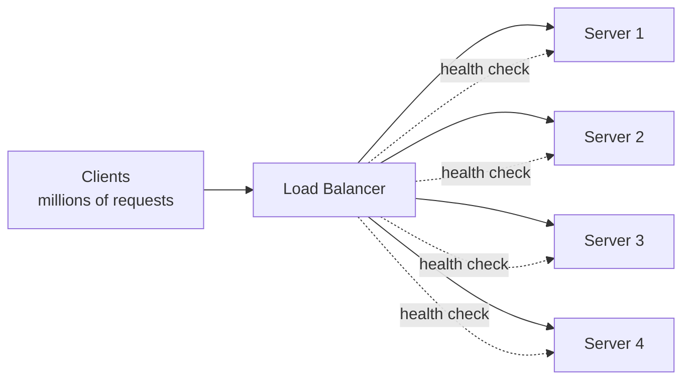

### Load balancer ke 5 core kaam
1. **Traffic distribution** — requests ko servers me baato (algorithm ke hisaab se — file #3).
2. **Health checks** — har server ko periodically ping (`/health`). Unhealthy ko rotation se hatao.
3. **Failover** — server down → traffic automatically baaki healthy servers ko.
4. **SSL termination** — HTTPS decrypt yahan (backend HTTP — CPU offload).
5. **Session persistence** — (optional) same client → same server (sticky sessions).

### Load balancer ke fayde
- **High availability** — ek server mare, baaki serve karte (no downtime).
- **Scalability** — servers add/remove karo, LB automatically use karta.
- **Performance** — load evenly, no single server overwhelmed.
- **Flexibility** — rolling deployments (ek server update, LB usse traffic hatao, phir wapas).

### LB kahan baithta hai (layers pe)
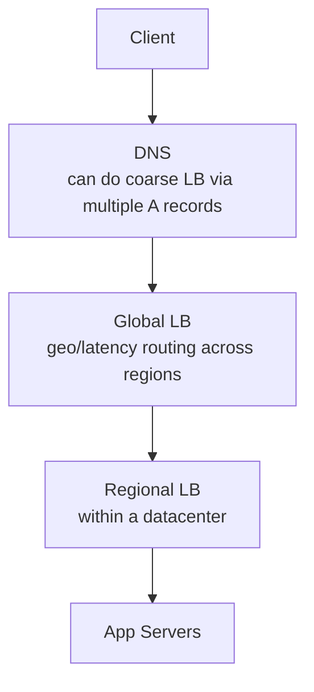
- **DNS-level** — ek domain ke multiple IPs (round-robin). Coarse (caching, no health awareness).
- **Global LB** — multiple regions ke beech (geo-routing, nearest region).
- **Regional/local LB** — ek datacenter ke servers ke beech.

### L4 vs L7 (short — full detail file #3)
- **L4** — IP + port (TCP/UDP) pe decide. Fast, dumb. (AWS NLB)
- **L7** — HTTP content (URL, headers) pe decide. Smart routing, SSL. (AWS ALB, Nginx)

### LB algorithms (short — full detail file #3)
Round Robin, Weighted Round Robin, Least Connections, Least Response Time, IP Hash, Consistent Hash.

### Health checks — kaise kaam karta
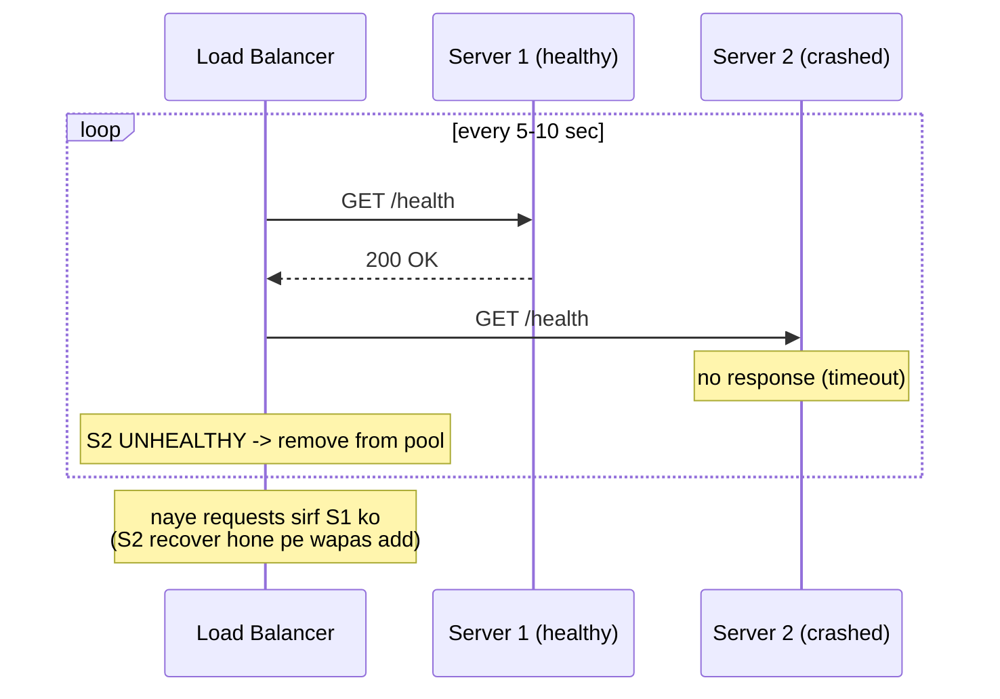
- **Active** — LB khud ping karta (`/health` endpoint).
- **Passive** — LB actual request failures se detect karta.
- **Threshold** — 3 consecutive fails → unhealthy (ek fail pe nahi — false positive avoid).

### Sticky sessions (session affinity)
Agar server **stateful** ho (session memory me), same client ko same server bhejna padta.
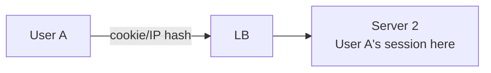
- **Kaise:** cookie-based ya IP-hash.
- ⚠ **Problem:** scaling mushkil (server down → session lost), uneven load.
- ✅ **Better:** **stateless servers** + session external store (Redis) — koi bhi server koi bhi
  request handle kare, sticky ki zaroorat nahi.

### LB khud SPOF na bane (LB ki redundancy)
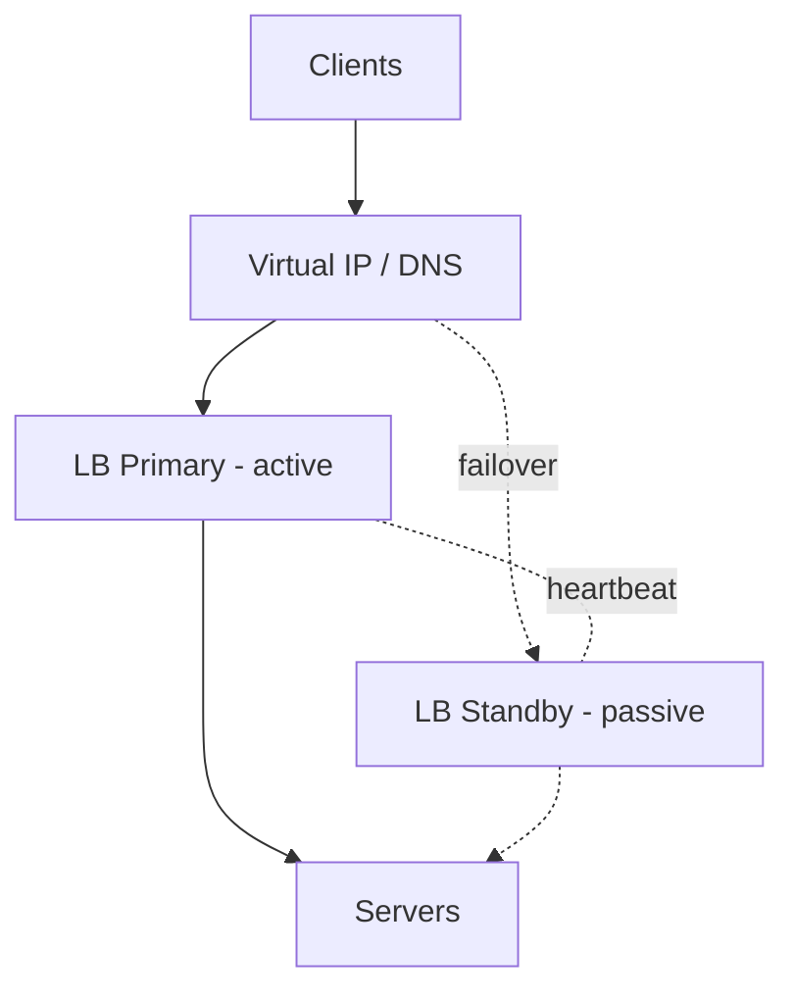
- **Active-Passive** — primary + standby, heartbeat se failure detect, floating/virtual IP switch.
- **Active-Active** — dono LB active, DNS round-robin ya anycast.
- Cloud managed LBs (AWS ELB/ALB) built-in redundant + auto-scaling.

---

## 🚪 API Gateway — deep

### Problem jo solve karta
Microservices me 50 services hain. Bina gateway ke:
- Client ko har service ka address pata hona chahiye (tight coupling)
- Har service me auth/rate-limit/logging **duplicate** (DRY violation)
- Client ko multiple calls karni padti (ek screen ke liye 5 services)
- Internal service structure client ko expose (security risk)

Solution: **API Gateway** — ek single entry point jo routing + cross-cutting handle karta.

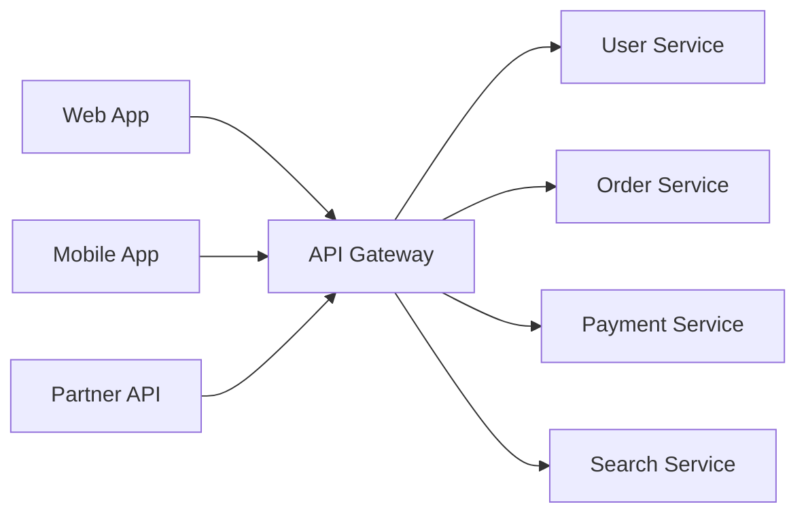

### API Gateway ke kaam (cross-cutting concerns — ek jagah)
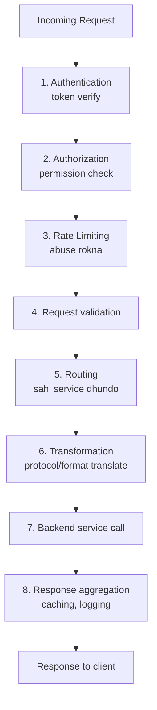

| # | Function | Detail |
|---|---|---|
| 1 | **Authentication** | JWT/OAuth token verify (har service me nahi) |
| 2 | **Authorization** | role/permission check |
| 3 | **Rate limiting** | per-client throttle (abuse/DDoS defense) |
| 4 | **Routing** | `/users/*` → User Service, `/orders/*` → Order Service |
| 5 | **Load balancing** | target service ke replicas me distribute |
| 6 | **SSL termination** | HTTPS decrypt |
| 7 | **Protocol translation** | client REST → internal gRPC |
| 8 | **Request/response transformation** | reshape payloads, add/remove fields |
| 9 | **Aggregation** | ek client request → multiple services → merge |
| 10 | **Caching** | common responses cache |
| 11 | **Logging/monitoring** | centralized request logs, metrics |
| 12 | **Circuit breaking** | failing service ko fail-fast |

### Aggregation (gateway ka killer feature)
Mobile app ki "profile screen" ke liye user info + orders + recommendations chahiye — 3 services.
Bina gateway: client 3 calls karega (slow, 3 round trips). Gateway ke saath:
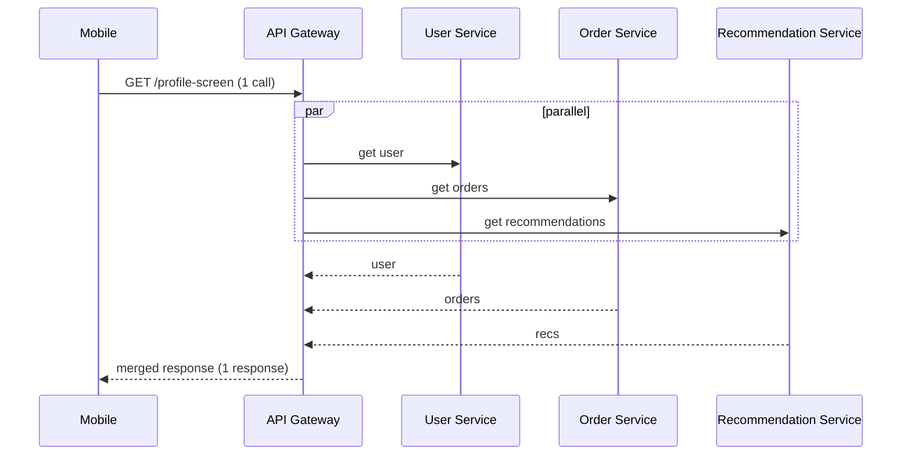
Client ko ek call, ek response. Gateway internally parallel calls + merge karta.

### API Gateway ke nuksan
- **SPOF risk** — gateway down → sab down. Fix: redundant deploy + behind its own LB.
- **Bottleneck** — sara traffic guzarta, scale karna padta.
- **Extra latency** — ek extra hop.
- **Complexity** — ek aur component manage karna.

Examples: **Kong, AWS API Gateway, Nginx, Zuul (Netflix), Apigee, Tyk**.

---

## 🆚 API Gateway vs Load Balancer

Ye **sabse important distinction** hai is topic ka:

| | **API Gateway** | **Load Balancer** |
|---|---|---|
| **Layer** | Application (L7) — always content-aware | L4 (transport) ya L7 |
| **Routes to** | **different services** (by path/logic) | **identical replicas** of same service |
| **Primary job** | routing + cross-cutting (auth, rate limit, transform) | traffic distribution + health |
| **Awareness** | business logic (which service, which version) | server health/load |
| **Aggregation** | ✅ (multiple services → one response) | ❌ |
| **Auth/rate limit** | ✅ | usually ❌ |
| **Analogy** | building receptionist (kaha jaana batata) | ek counter pe bheed → doosre counter bhejna |

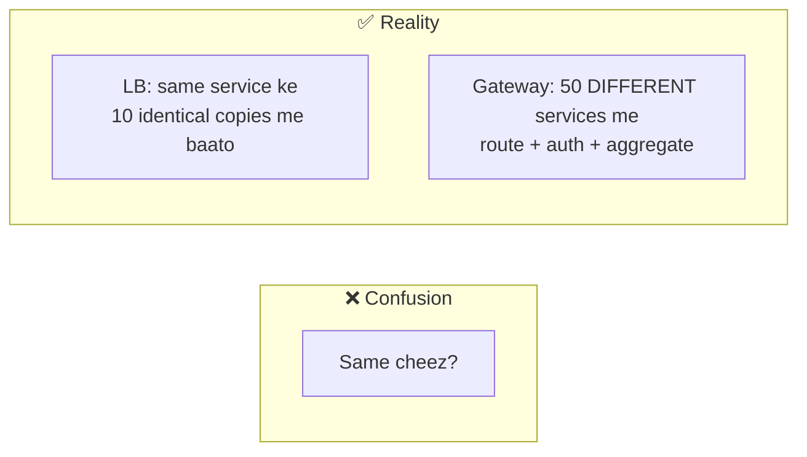

> ⭐ **Ek line:** Load balancer **same service ke replicas** ke beech baantta hai (horizontal
> scaling). API Gateway **different services** ke beech route karta + cross-cutting concerns
> handle karta. **Load balancer ek specialized reverse proxy hai; API gateway usse zyada smart.**

---

## 🔗 Dono saath — real architecture

Real systems me **dono use hote hain**, alag levels pe:

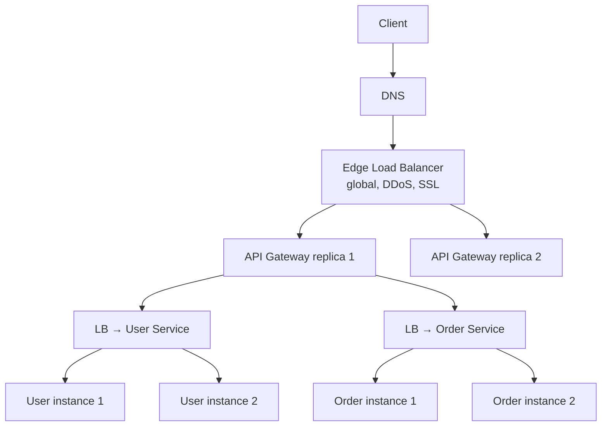

**Flow:**
1. **Edge LB** — global traffic, SSL, DDoS protection, gateway replicas me distribute (gateway
   khud LB ke peeche → SPOF nahi).
2. **API Gateway** — auth, rate limit, route decide ("ye request Order Service ki hai").
3. **Service LB** — Order Service ke multiple instances me distribute (health-aware).
4. **Service instance** — actual work.

> Gateway decide karta **"kaunsi service"**, LB decide karta **"us service ka kaunsa instance"**.

---

## 🎨 Backend for Frontend (BFF)

Ek variation: har client type (web/mobile/TV) ka apna gateway (BFF) — tailored responses.
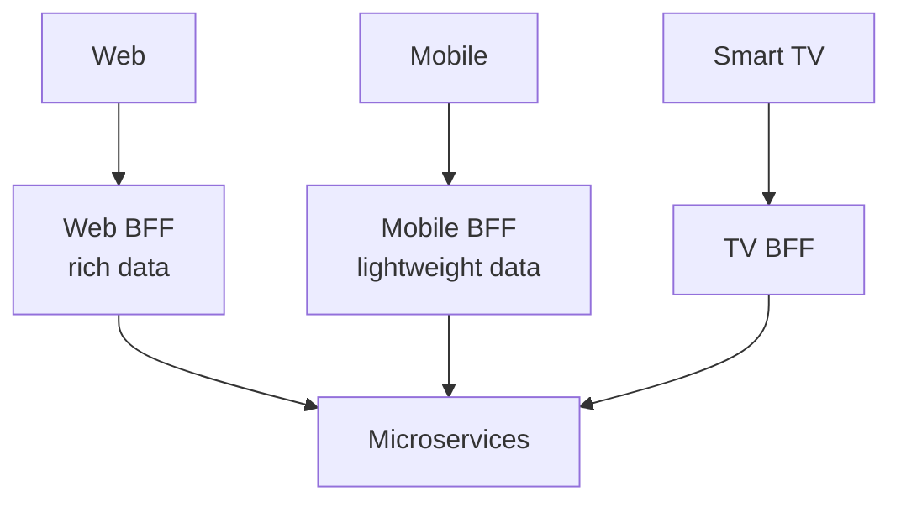
- Mobile ko kam data (bandwidth), web ko zyada — ek generic API sabko fit nahi karti.
- Netflix famous BFF users.

---

## 🛠️ Repo me
[`LoadBalancer_LLD`](../LLD/LoadBalancer_LLD/) — Round Robin + Least Connections (Strategy
pattern, runtime swap, server health tracking).

---

## 💬 Interview Q&A

**Q: API Gateway aur Load Balancer me farak?**
LB same service ke identical replicas me traffic baantta (health-aware). Gateway different
services me route karta + cross-cutting (auth, rate limit, aggregation, transform). Gateway L7
(content-aware), LB L4 ya L7.

**Q: API Gateway SPOF to nahi?**
Ho sakta — isliye redundant deploy (multiple replicas) + behind edge load balancer. Cloud managed
gateways auto-scale.

**Q: Gateway me kya-kya rakhna chahiye, kya nahi?**
Rakhо: routing, auth, rate limit, SSL, aggregation, logging (cross-cutting). Mat rakho: business
logic (wo services me — warna gateway "god object" ban jaata).

**Q: Sticky sessions kab use, kab avoid?**
Stateful servers ke liye use (session memory me). Avoid — better stateless + Redis session store
(scaling aasan, no session loss on server death).

**Q: Load balancer health check kaise kaam karta?**
Periodically `/health` ping (active) ya request failures observe (passive). N consecutive fails →
server unhealthy → rotation se remove → recover pe wapas. Automatic failover.

**Q: BFF kya hai?**
Backend for Frontend — per client type (mobile/web) ka apna gateway/API layer, tailored
responses (mobile kam data). One-size-fits-all API ke problems solve karta.

---

## 🔬 Load Balancer — advanced internals

### Connection draining (graceful server removal)
Server ko rotation se hatana ho (deploy/maintenance) — turant nahi hataate (existing requests
tootenge). **Connection draining:** naye requests band, existing complete hone do (timeout tak),
phir remove.
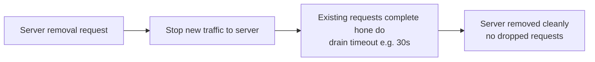

### Slow start
Naya server pool me add hua — turant full traffic dena galat (cold cache, JIT warmup). **Slow
start:** dheere-dheere traffic ramp up (0% → 100% over X seconds) taaki server warm ho.

### Global Server Load Balancing (GSLB)
Multiple **regions/datacenters** ke beech traffic route. User ko nearest/healthiest region.
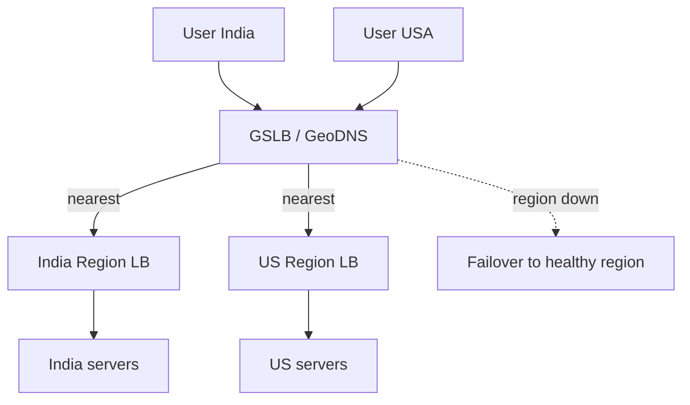
- **GeoDNS** — DNS response user location ke hisaab se (nearest region ka IP).
- **Anycast** — same IP multiple locations pe (BGP network nearest ko route). Used by CDN, DNS.
- **Failover** — region down → GSLB traffic doosri region ko (disaster recovery).

### DNS load balancing
Ek domain ke **multiple A records** (IPs). DNS resolver round-robin karta.
- ✅ Simple, no dedicated LB, global.
- ❌ DNS caching (TTL) — server down hone pe bhi client cached IP use karta (slow failover), no
  real health awareness, uneven distribution.
- Isliye usually **coarse** first layer, phir real LB.

### L7 LB extra powers
- **Content-based routing** — `/api/v2/*` → new version, `/images/*` → static service.
- **A/B testing** — 10% traffic new version ko (header/cookie based).
- **Canary deployment** — thode users ko naya build (gradual rollout).
- **Request rewriting** — path/header modify.

---

## 🏗️ API Gateway — deployment & patterns

### Deployment topologies
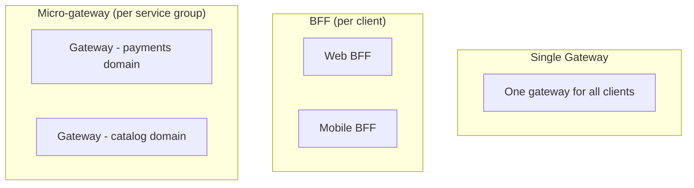
- **Single gateway** — simple, but bottleneck + team coupling at scale.
- **BFF** — per client type (tailored).
- **Micro-gateways** — per domain (decentralized, teams own their gateway).

### Gateway vs Service Mesh (confuse hote log)
| | API Gateway | Service Mesh |
|---|---|---|
| Traffic | **North-South** (client ↔ system) | **East-West** (service ↔ service internal) |
| Position | edge (system ke saamne) | between services (sidecars) |
| Concerns | auth, rate limit, routing, aggregation | mTLS, retry, circuit break, tracing (internal) |
| Example | Kong, AWS API GW | Istio, Linkerd |

> Dono complementary — gateway bahar wale traffic ke liye, mesh andar ke service-to-service ke liye.

### Gateway offloading pattern
Cross-cutting concerns (SSL, auth, rate limit, compression) ko gateway pe **offload** karo —
services sirf business logic pe focus. DRY + consistency + security ek jagah.

---

## 🌍 Real-world examples
- **Netflix Zuul** — API gateway (routing, resiliency, security) for 100s of services + BFF pattern.
- **AWS ALB + API Gateway** — ALB (L7 LB) for services, API Gateway for managed REST/auth/throttle.
- **Nginx** — reverse proxy + L7 LB + gateway (all-in-one, self-hosted).
- **Cloudflare** — global edge LB + DDoS + CDN + WAF (edge gateway).

---

## 🛡️ Resiliency at the Gateway/LB (production-critical)

Gateway/LB failing backends se poora system bacha sakte hain. Ye patterns zaroori:

### Timeout
Har backend call pe timeout (e.g. 2s). Backend hang → gateway wait nahi karta indefinitely →
client ko fast error (resource block nahi hota).

### Retry with backoff
Transient failure (network blip) pe retry — par **exponential backoff + jitter** ke saath
(1s, 2s, 4s + random) taaki sab ek saath retry na karein (retry storm / thundering herd).
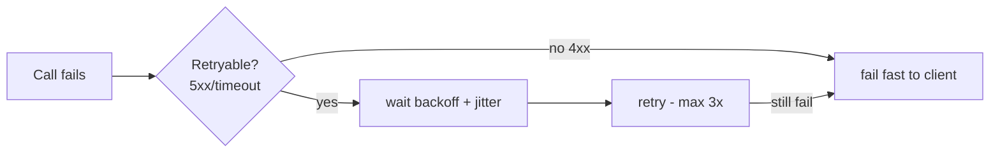
> ⚠ Retry sirf **idempotent** operations pe safe (GET/PUT). POST retry → duplicate risk
> (idempotency key chahiye).

### Circuit breaker
Ek backend baar-baar fail ho raha → gateway "circuit open" karta (fail fast, backend ko aur load
nahi deta) → thodi der baad "half-open" (test) → theek to "closed".
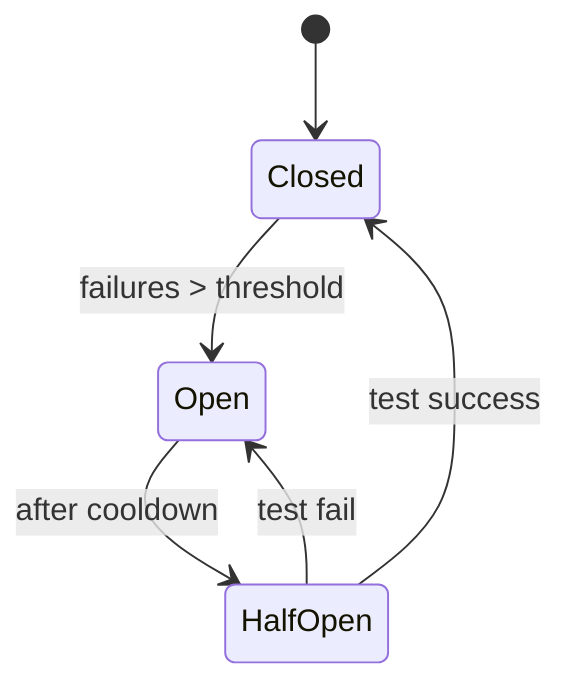
Cascading failure rokta (ek slow service poore system ko slow na kare).

### Rate limiting & throttling at gateway
Gateway sabse acchi jagah hai rate limiting ke liye (single entry, sab traffic yahan).
- **Per-user/API-key** — free tier 100 req/min, premium 10000.
- **Per-endpoint** — `/search` heavy → tighter limit.
- **Global** — total system protection.
- Excess → **429 Too Many Requests** + `Retry-After` header.
- [Full algorithms: `12_Rate_Limiting_and_Algorithms.md`](./12_Rate_Limiting_and_Algorithms.md)

### Bulkhead
Resources isolate (per-backend connection pools) — ek slow backend saare threads na kha jaaye
(ship compartments jaisa — ek flooded, baaki safe).

---

## 📝 Summary
- **Load Balancer** = same service ke replicas me traffic distribute + health check + failover.
  L4 (fast) ya L7 (smart). Horizontal scaling ka enabler.
- **API Gateway** = single entry, different services me route + cross-cutting (auth, rate limit,
  SSL, aggregation, transform). Microservices ke saamne.
- Dono ek saath: edge LB → gateway (which service) → service LB (which instance) → service.
- Gateway/LB dono khud redundant hone chahiye (SPOF avoid).
- BFF = per-client-type gateway.
