# 3. Load Balancer — Types & Algorithms (Complete Deep Dive)

> Load balancer traffic distribute karta hai. Par "kaise" ke do bade decisions hain: **kis network
> layer pe** (L4 vs L7) aur **kaunse algorithm** se. Is file me dono, plus stateful vs stateless,
> health checks, aur hardware vs software LB — sab detail me.

---

## 📑 Is file me
1. [Load balancer kyun (recap)](#-load-balancer-kyun)
2. [Types by layer — L4 vs L7](#-types-by-layer--l4-vs-l7-deep)
3. [Types by implementation — Hardware vs Software](#-types-by-implementation)
4. [Algorithms — static vs dynamic (deep)](#-load-balancing-algorithms-deep)
5. [Stateless vs stateful backends](#-stateless-vs-stateful-backends)
6. [Health checks — deep](#-health-checks-deep)
7. [LB redundancy](#-lb-high-availability)
8. [Algorithm selection guide](#-algorithm-selection-guide)

---

## 🎯 Load balancer kyun

Ek server ki limit hoti hai. Traffic scale karne ke liye multiple servers, aur beech me LB jo:
- Traffic evenly distribute kare (no server overwhelmed)
- Failed server detect kare aur bypass kare (high availability)
- Servers add/remove ko seamless kare (elasticity)

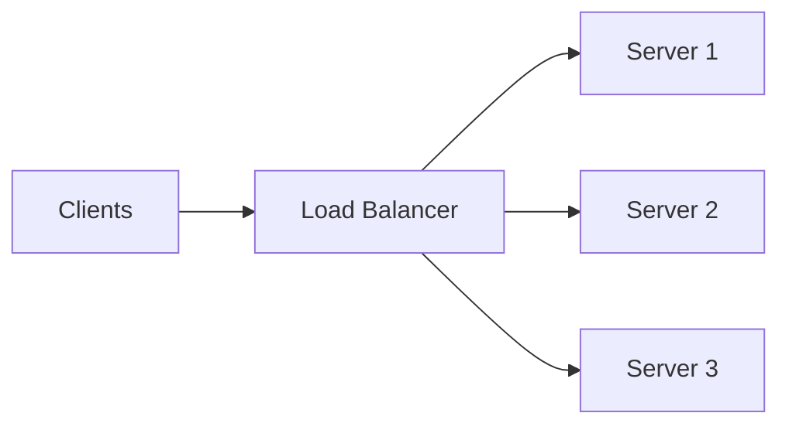

---

## 🧱 Types by Layer — L4 vs L7 (deep)

OSI model me LB do jagah kaam kar sakta:

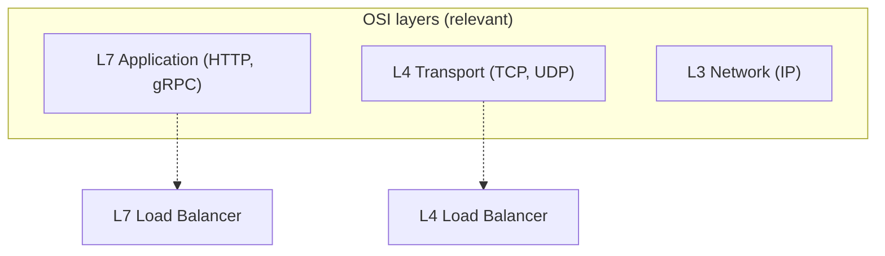

### L4 Load Balancer (Transport layer)
IP address + port dekh ke decide karta. Packet ka **content nahi padhta** (HTTP body/headers nahi).
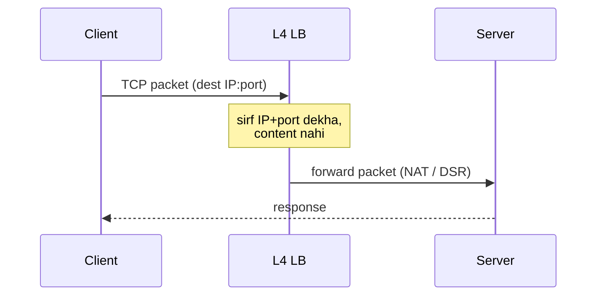
- **Kaise:** NAT (Network Address Translation) ya DSR (Direct Server Return).
- ✅ **Fast** (no content inspection), **protocol-agnostic** (any TCP/UDP — DB, game server, etc.),
  low latency, high throughput.
- ❌ Content-based routing nahi (URL/header nahi dekh sakta), no SSL termination, no caching.
- **Example:** AWS NLB, HAProxy (TCP mode), IPVS.
- **Use:** ultra-high throughput, non-HTTP protocols, jab content-based routing na chahiye.

### L7 Load Balancer (Application layer)
HTTP request ka **content** (URL, headers, cookies, method) padhta aur uske basis pe route karta.
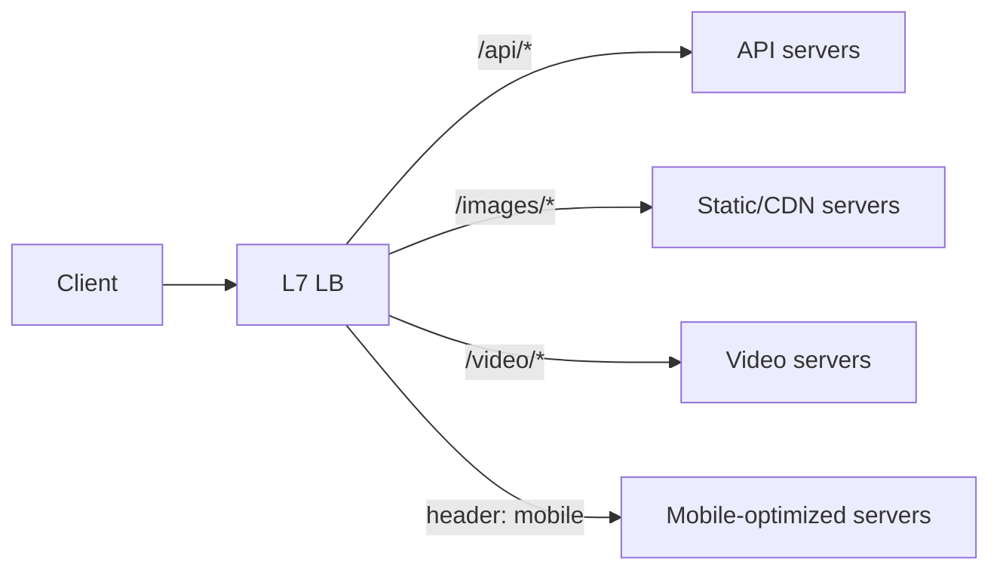
- ✅ **Content-based routing** (path/header/cookie), **SSL termination**, **caching**,
  **compression**, **A/B testing**, **canary**, sticky by cookie.
- ❌ Thoda slower (content parse), HTTP-specific.
- **Example:** AWS ALB, Nginx, HAProxy (HTTP mode), Traefik, Envoy.
- **Use:** microservices routing, web apps, jab smart routing chahiye.

### L4 vs L7 comparison
| Factor | L4 | L7 |
|---|---|---|
| Decision basis | IP + port | HTTP content (URL/header/cookie) |
| Speed/throughput | very high | high (parse overhead) |
| Content routing | ❌ | ✅ |
| SSL termination | ❌ (passthrough) | ✅ |
| Caching/compression | ❌ | ✅ |
| Protocol | any (TCP/UDP) | HTTP/HTTPS/gRPC |
| Cost | cheaper (simple) | more (compute) |

> ⭐ **Modern default:** L7 (web/microservices — smart routing + SSL). **L4** jab raw speed ya
> non-HTTP (game/DB/streaming) chahiye.

---

## 🏭 Types by Implementation

| Type | Kya | Pros | Cons |
|---|---|---|---|
| **Hardware LB** | dedicated physical appliance (F5, Citrix) | very fast, reliable | expensive, less flexible, scale limit |
| **Software LB** | software on commodity servers (Nginx, HAProxy) | cheap, flexible, scriptable | uses server resources |
| **Cloud LB** | managed service (AWS ELB/ALB/NLB, GCP LB) | auto-scale, HA built-in, no ops | vendor lock-in, cost at scale |
| **DNS LB** | multiple A records | simple, global, free | DNS caching, no health awareness |

> Modern systems: **software (Nginx/Envoy)** ya **cloud managed (ALB)**. Hardware LB legacy/
> high-security enterprises me.

---

## ⚙️ Load Balancing Algorithms (deep)

Do categories: **static** (server state ignore) aur **dynamic** (real-time state aware).

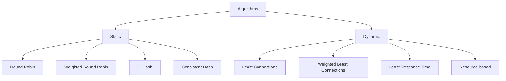

### STATIC algorithms

#### 1. Round Robin
Requests bari-bari: S1 → S2 → S3 → S1 → S2 → S3...
```
Req1→S1, Req2→S2, Req3→S3, Req4→S1, Req5→S2...
```
- ✅ Simple, fair (equal servers)
- ❌ Server load/capacity ignore (ek slow ho ya heavy request ho to bhi barabar bhejta)
- **Use:** servers identical + requests roughly equal.

#### 2. Weighted Round Robin
Capacity ke hisaab se weights. Powerful server (weight 3) ko 3x requests.
```
S1(weight 3), S2(weight 1) → S1,S1,S1,S2,S1,S1,S1,S2...
```
- ✅ Unequal servers handle (bada server zyada load)
- ❌ Static weight (real-time load ignore)
- **Use:** servers different capacity ke.

#### 3. IP Hash
`hash(client IP) % N` → server. **Same client hamesha same server** (session affinity).
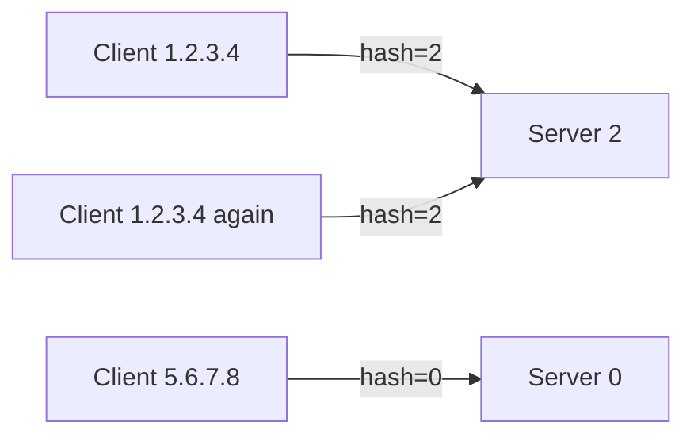
- ✅ Sticky sessions (stateful servers), cache locality
- ❌ Uneven distribution possible (kuch IPs zyada active), server add/remove → remap
- **Use:** stateful backends jaha session server pe hai.

#### 4. Consistent Hashing
Hash ring pe servers + requests. Server add/remove pe sirf **1/N keys** move (na ki sab).
- ✅ Minimal disruption on scaling, cache affinity
- ❌ Complex, virtual nodes chahiye even distribution ke liye
- **Use:** distributed cache (Memcached), sharded services.
- 📄 Full: [`19_Consistent_Hashing.md`](./19_Consistent_Hashing.md)

### DYNAMIC algorithms

#### 5. Least Connections
Jis server ke paas **abhi sabse kam active connections** usko bhejo.
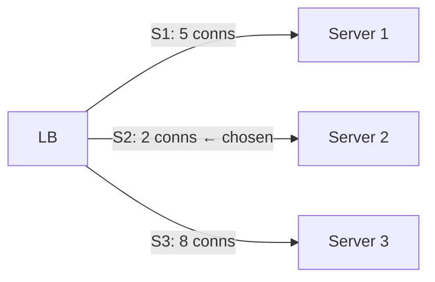
- ✅ Real load-aware, long-lived/uneven connections ke liye best
- ❌ Connection count track karna padta, connection = load nahi hamesha
- **Use:** long-lived connections (WebSocket, DB), variable request duration.

#### 6. Weighted Least Connections
Least connections + server capacity weight. `connections / weight` sabse kam wala.

#### 7. Least Response Time
Server jo **fastest respond** kar raha (least active connections + lowest latency).
- ✅ Latency-optimized
- ❌ Response time continuously measure karna padta
- **Use:** latency-critical (real-time apps).

#### 8. Resource-based (adaptive)
Server ki actual CPU/memory dekh ke (agent reports). Sabse "healthiest" server ko.
- ✅ Most accurate load picture
- ❌ Agents chahiye, complex
- **Use:** heterogeneous workloads.

### Static vs Dynamic
| | Static | Dynamic |
|---|---|---|
| Server state | ignore | aware (connections/latency/CPU) |
| Overhead | low | higher (tracking) |
| Accuracy | approximate | real-time |
| Example | Round Robin | Least Connections |

---

## 🔀 Stateless vs Stateful backends

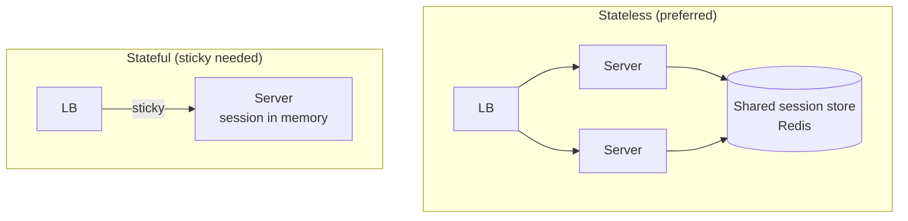
- **Stateless** — server koi session state nahi rakhta (Redis me). Koi bhi server koi request →
  **any algorithm** kaam karta, easy scaling, server death = no session loss. **Best practice.**
- **Stateful** — session server memory me → **sticky sessions** (IP hash/cookie) chahiye →
  scaling mushkil, server death = session lost.

> ⭐ **Design tip:** servers stateless banao, state Redis/DB me. Phir LB simple + robust.

---

## 🏥 Health Checks (deep)

LB traffic sirf healthy servers ko bheje — isliye continuous health monitoring:

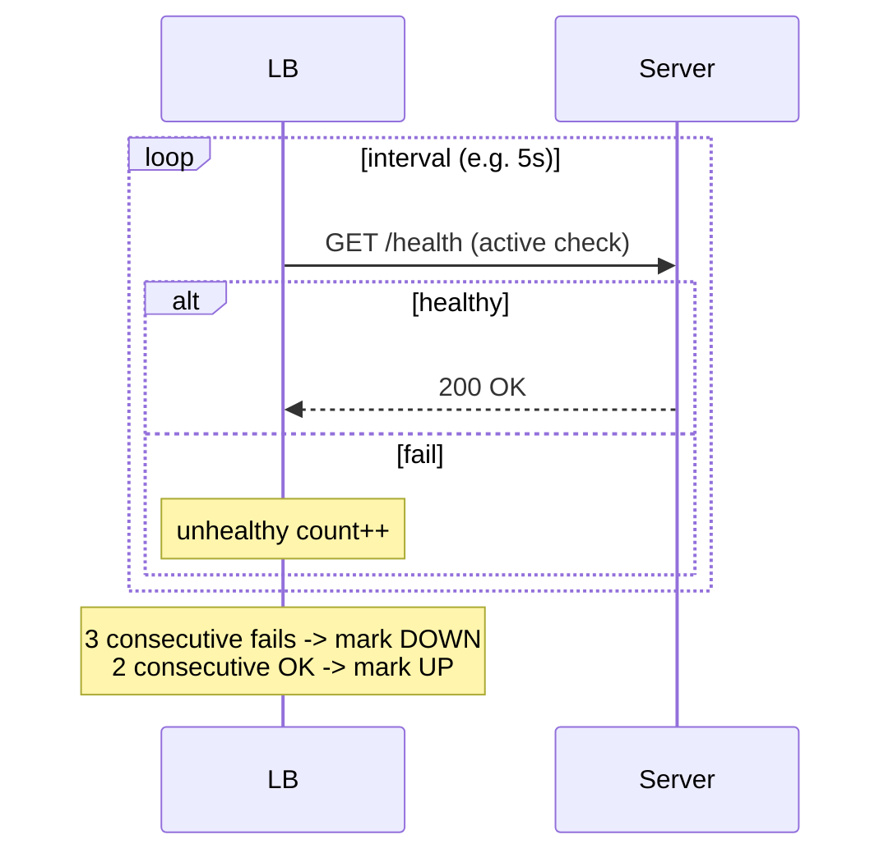

**Parameters:**
- **Interval** — kitni der me check (5-30s).
- **Timeout** — response ka wait (2-5s).
- **Unhealthy threshold** — kitne fails pe down (e.g. 3) — flapping avoid.
- **Healthy threshold** — kitne OK pe wapas up (e.g. 2).

**Types:**
- **Active** — LB explicitly `/health` ping karta.
- **Passive** — LB actual request failures observe karta (5xx, timeout).

**Health endpoint kya check kare:** app alive + dependencies (DB, cache) reachable — shallow
("app up") vs deep ("app + DB + cache ok"). Deep check accurate par cascading (DB slow → sab
unhealthy). Balance.

---

## 🛡️ LB High Availability

LB khud SPOF na bane:
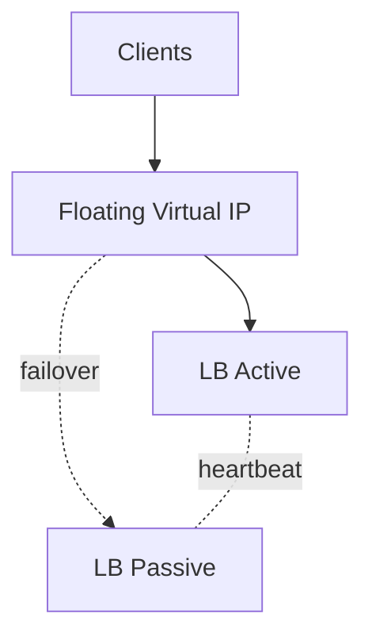
- **Active-Passive** — primary + standby, heartbeat, floating IP switch on failure.
- **Active-Active** — dono active, DNS/anycast se distribute.
- **Cloud LB** (AWS ELB) — inherently redundant + auto-scaling.

---

## 🧭 Algorithm Selection Guide

| Scenario | Best algorithm |
|---|---|
| Identical servers, short requests | Round Robin |
| Different server capacities | Weighted Round Robin |
| Long-lived connections (WebSocket/DB) | Least Connections |
| Latency-critical | Least Response Time |
| Stateful servers (sessions) | IP Hash (or fix: go stateless) |
| Distributed cache / sharding | Consistent Hashing |
| Heterogeneous workloads | Resource-based (adaptive) |

---

## 🛠️ Repo me
[`LoadBalancer_LLD`](../LLD/LoadBalancer_LLD/) — Round Robin + Least Connections implemented via
**Strategy pattern** (runtime swap) + server health (UP/DOWN) + connection tracking. Code padho.

---

## 💬 Interview Q&A

**Q: L4 vs L7 LB me farak?**
L4 = IP+port (transport, fast, protocol-agnostic, no content routing). L7 = HTTP content (URL/
header, smart routing, SSL termination, slower). Modern web → L7.

**Q: Round Robin ka problem, aur fix?**
Server load/capacity ignore karta (slow server ko bhi barabar). Fix: Weighted RR (capacity),
Least Connections (real-time load).

**Q: Sticky sessions kyun avoid karein?**
Scaling mushkil, server death = session lost, uneven load. Better: stateless servers + Redis
session store → koi bhi algorithm, robust.

**Q: Health check flapping kaise avoid?**
Thresholds — N consecutive fails pe down (ek fail pe nahi), M consecutive OK pe up. Interval +
timeout tune.

**Q: Least Connections kab better than Round Robin?**
Jab requests ki duration vary karti (kuch long, kuch short) ya long-lived connections
(WebSocket) — RR me ek server pe long connections jama ho sakte, Least Connections balance karta.

**Q: Consistent hashing LB me kyun?**
Cache affinity — same key same server (cache hit) + server add/remove pe minimal remap (1/N).
Distributed cache me critical.

---

## 🔧 How L4 forwards — NAT vs DSR (deep)

L4 LB packet kaise forward karta, do techniques:

### NAT (Network Address Translation)
LB packet ka destination IP badalta (LB IP → server IP), aur response bhi LB se wapas jaata.
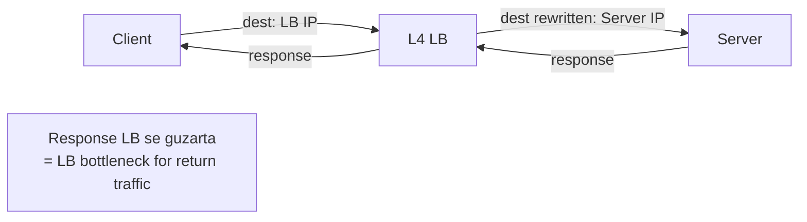
- ✅ Simple, LB full control.
- ❌ Return traffic bhi LB se (bandwidth bottleneck for high-throughput).

### DSR (Direct Server Return)
Request LB se, par **response seedha server se client ko** (LB bypass on return).
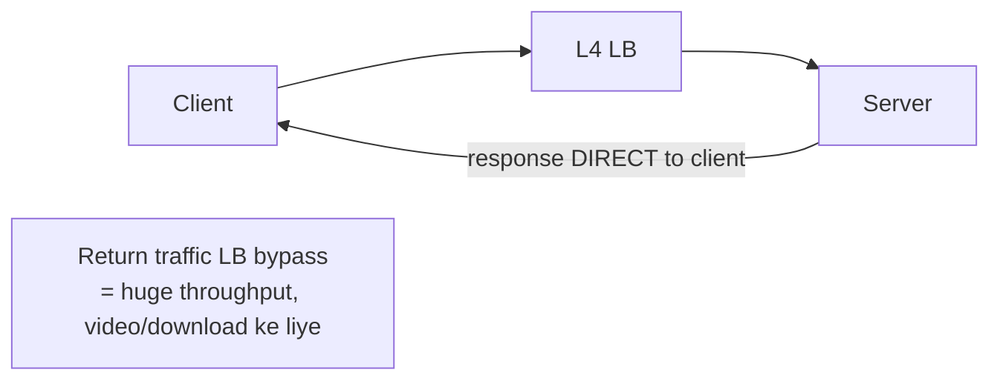
- ✅ LB return traffic handle nahi karta → massive throughput (video streaming, large downloads).
- ❌ Complex setup (server LB IP ke liye configured), no return-path modification.

---

## 🔄 Worked example — request ka poora journey

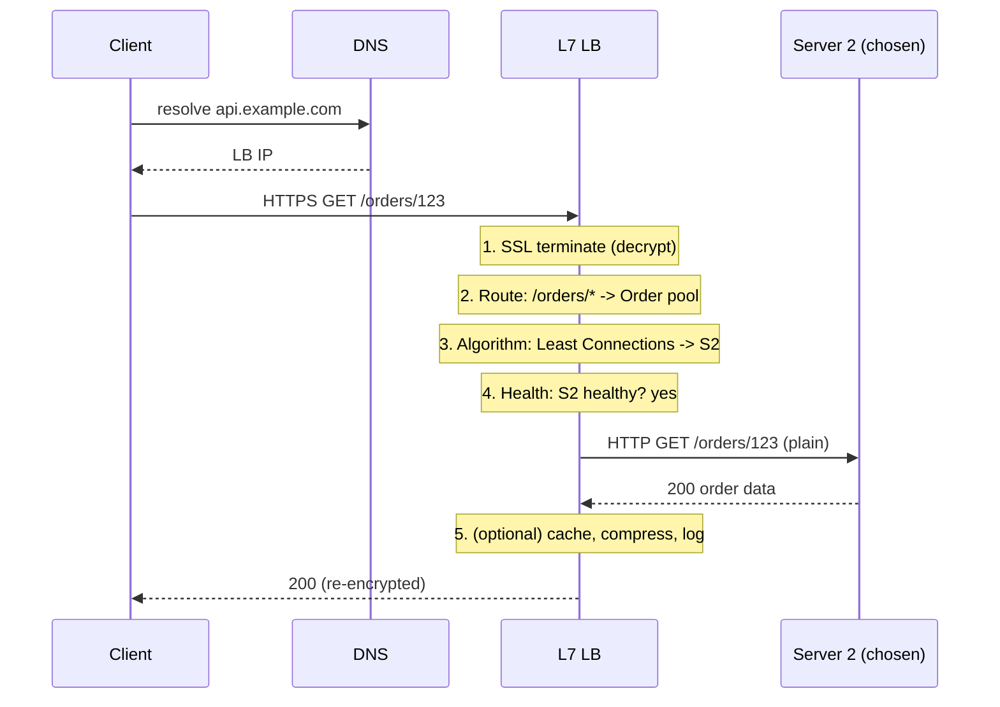

Har step LB ka kaam dikhata: SSL termination → content routing → algorithm selection → health
verification → forward → response processing.

---

## 📈 LB metrics to monitor (production)
- **Request rate (RPS)** per backend
- **Active connections** per server
- **Latency** (p50/p95/p99) — tail latency matters
- **Error rate** (5xx per backend — unhealthy signal)
- **Healthy host count** (kitne servers up)
- **Backend saturation** (CPU/connection limits)

> Ye metrics se pata chalta LB sahi distribute kar raha ya ek server overloaded.

---

## ⚠️ Common pitfalls
| Pitfall | Problem | Fix |
|---|---|---|
| No health checks | traffic dead server ko | active + passive checks |
| Sticky sessions everywhere | scaling mushkil | stateless + Redis |
| Single LB (no redundancy) | LB = SPOF | active-active/passive |
| Round Robin with uneven requests | ek server overloaded | Least Connections |
| Deep health check on DB | DB slow → all unhealthy | shallow check + separate dependency monitoring |
| No connection draining | deploy me requests dropped | drain before removing server |
| Session affinity + autoscale | new servers underused | stateless design |

---

## 🌍 Global load balancing (multi-region recap)
Single region LB ek datacenter ke andar. Global users ke liye **GSLB** — GeoDNS ya Anycast se
user ko nearest region, region down pe failover. [Detail: `17_Avoid_Single_Point_of_Failure.md`]

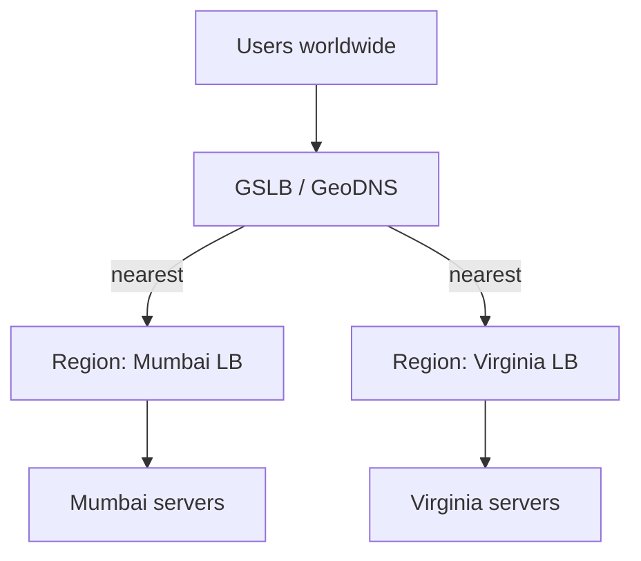

---

## 📝 Summary
- **Layer:** L4 (IP/port, fast, dumb) vs L7 (HTTP content, smart, SSL). Web → L7.
- **Impl:** hardware (fast/expensive), software (Nginx/HAProxy — flexible), cloud (managed/HA), DNS (coarse).
- **Algorithms:** static (Round Robin, Weighted, IP Hash, Consistent Hash) vs dynamic (Least
  Connections, Least Response Time, Resource-based).
- **Stateless backends** preferred (sticky sessions avoid).
- **Health checks** + thresholds → automatic failover. LB khud redundant (active-active/passive).
