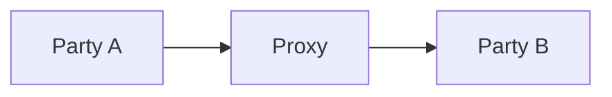
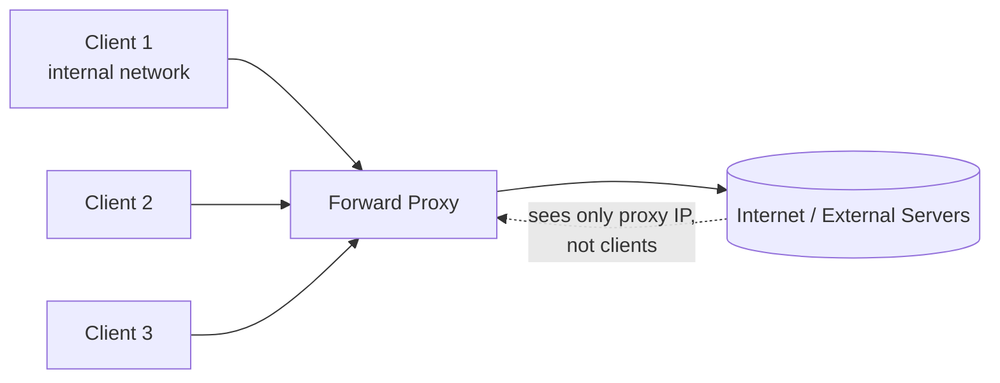
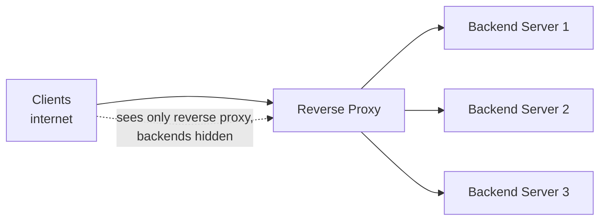
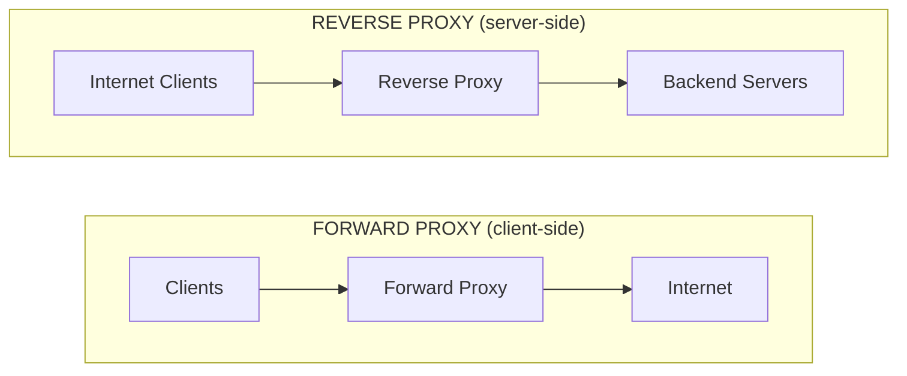
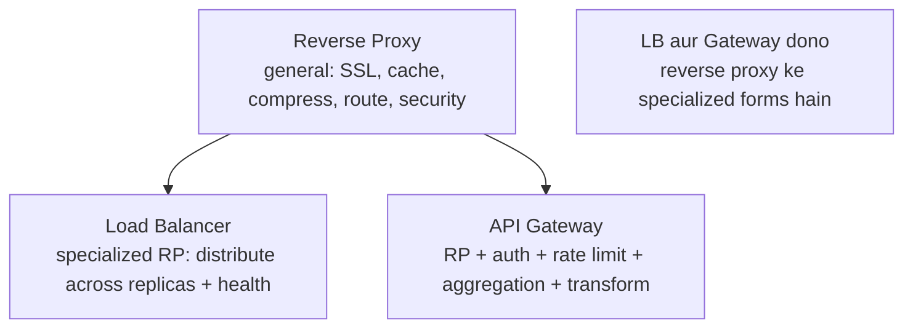
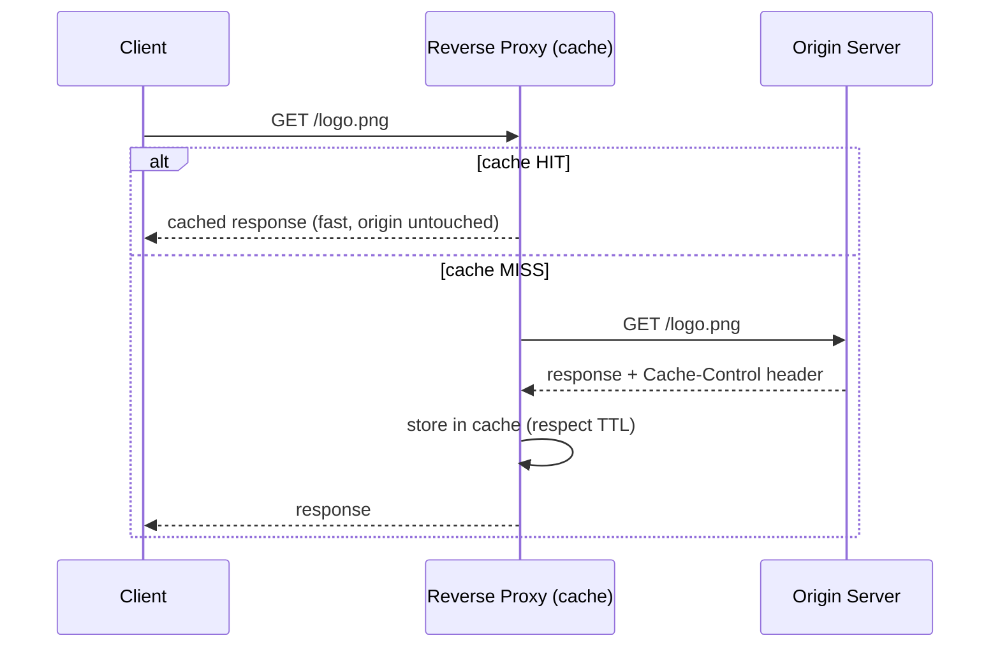
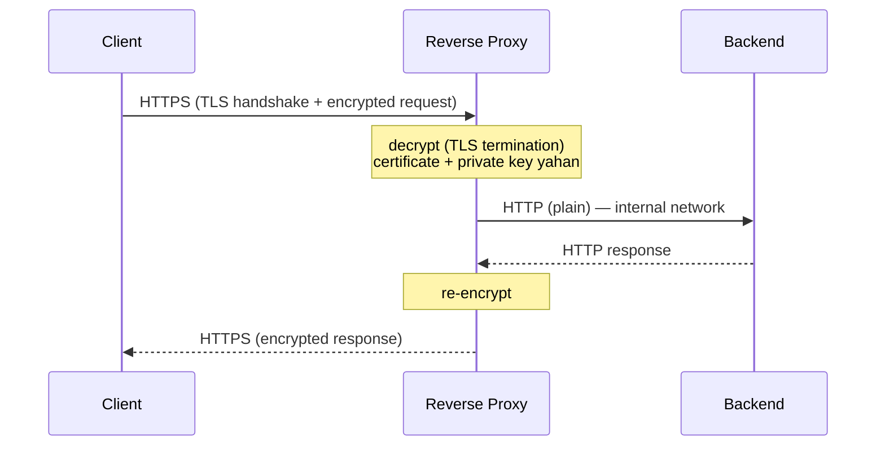

# 4. Proxy and Reverse Proxy — Complete Deep Dive

> Dono "beech me baithne wale bicholiye" hain, par **kiski taraf se** kaam karte — ye poora farak
> hai. Forward proxy client ki taraf, reverse proxy server ki taraf. Interview me ye distinction,
> aur reverse proxy ke saare use cases, guaranteed aate hain.

---

## 📑 Is file me
1. [Proxy kya hota hai (basics)](#-proxy-basics)
2. [Forward Proxy — deep](#-forward-proxy)
3. [Reverse Proxy — deep](#-reverse-proxy)
4. [Forward vs Reverse — full comparison](#-forward-vs-reverse-proxy)
5. [Reverse proxy vs Load Balancer vs API Gateway](#-reverse-proxy-vs-load-balancer-vs-api-gateway)
6. [Nginx as reverse proxy (real config idea)](#-nginx--sabse-common-reverse-proxy)
7. [Interview Q&A](#-interview-qa)

---

## 🔷 Proxy basics

Ek **proxy** ek intermediary hai jo do parties ke beech baith ke unki communication ko relay
(aur often modify/control) karta hai. Direct connection ke bajaye, traffic proxy se guzarta hai.



Do fundamental types — farak sirf itna ki proxy **kiski taraf se** kaam kar raha:
- **Forward proxy** — **clients** ki taraf se (client-side). Clients ise use karte outside world se baat karne ke liye.
- **Reverse proxy** — **servers** ki taraf se (server-side). Servers ise apne saamne rakhte.

Ye "kiski taraf" hi poora distinction hai. Baaki sab isi se nikalta hai.

---

## ➡️ Forward Proxy

### Kya hai
Ek server jo **client (ya clients ke group) ki taraf se** internet/target servers se requests
bhejta hai. Target server ko client ka asli identity (IP) nahi dikhta — sirf proxy dikhta hai.
Client explicitly proxy ko configure karta hai ("mere saare requests is proxy se bhejo").



### Use cases (detail)
1. **Anonymity / privacy** — client ka real IP hide (server ko proxy IP dikhta). VPN forward
   proxy ka ek roop hai. Journalists, privacy tools.
2. **Access control / content filtering** — corporate/school network me kuch sites block
   (social media, adult content). Sab traffic proxy se guzarta → policy enforce.
3. **Caching** — frequently accessed content proxy pe cache. Ek office me 100 log same file
   download karein → proxy ek baar laata, baaki ko cache se (bandwidth bachao).
4. **Bypass geo-restrictions** — geo-blocked content access (proxy doosre country me).
5. **Monitoring / logging** — employee internet usage track (compliance/security).
6. **Bandwidth control** — throttle/prioritize certain traffic.

### Real examples
- Corporate proxy (Squid) — office internet filtering.
- VPN — encrypted forward proxy.
- Tor — chain of forward proxies (anonymity).

> ⭐ **Yaad rakho:** forward proxy **clients ke group ke aage** khada hota hai aur unki taraf se
> bahar baat karta. **Clients ise jaante aur configure karte hain.**

---

## ⬅️ Reverse Proxy

### Kya hai
Ek server jo **backend servers (ya server group) ki taraf se** clients ke requests receive karta
hai. Client ko backend servers ka pata nahi chalta — sirf reverse proxy dikhta hai. Client ko
ye bhi pata nahi hota ki reverse proxy hai (transparent) — wo samajhta ki wo actual server se baat
kar raha.



### Use cases (detail — ye interview me poore chahiye)
1. **Load balancing** — traffic multiple backend servers me distribute (LB ek specialized reverse
   proxy hai).
2. **SSL/TLS termination** — HTTPS decrypt reverse proxy pe (backend HTTP — CPU offload, cert
   management ek jagah).
3. **Caching** — static content (images, CSS, JS) aur cacheable responses cache → origin load
   drastically kam, faster response.
4. **Compression** — responses gzip/brotli compress (bandwidth kam, faster for client).
5. **Security & anonymity** — backend servers hidden (IPs expose nahi), attack surface kam.
   WAF (Web Application Firewall), DDoS protection, IP filtering yahan.
6. **Serve static content** — images/CSS/JS directly reverse proxy se (backend app ko nahi
   perturb karna).
7. **Request routing** — path-based (`/api` → app servers, `/static` → CDN).
8. **A/B testing / canary** — traffic split (kuch users new version).
9. **Centralized authentication** — auth check yahan (backend simple).
10. **Rate limiting** — abuse rokna edge pe.

### Real examples
- **Nginx / HAProxy** — most common self-hosted reverse proxy + LB.
- **Cloudflare** — global reverse proxy (CDN + DDoS + WAF).
- **AWS ALB** — managed reverse proxy / L7 LB.
- **Envoy** — modern reverse proxy (service mesh sidecar).

> ⭐ **Yaad rakho:** reverse proxy **backend servers ke aage** khada hota hai aur unki taraf se
> clients ko face karta. **Client ko pata bhi nahi ki reverse proxy hai (transparent).**

---

## 🆚 Forward vs Reverse Proxy

Ye distinction interview me sabse zyada poochha jaata hai:



| Factor | Forward Proxy | Reverse Proxy |
|---|---|---|
| **Kiski taraf** | client(s) ki | server(s) ki |
| **Position** | clients ke aage (client side) | servers ke aage (server side) |
| **Kya hide karta** | client identity (server se) | backend servers (client se) |
| **Kaun configure karta** | client (explicitly) | server admin |
| **Client aware?** | haan (configured) | nahi (transparent) |
| **Primary use** | anonymity, filtering, client caching, bypass | LB, SSL, caching, security, routing |
| **Traffic direction** | internal → external | external → internal |
| **Analogy** | tum apne behalf pe kisi ko bhejo internet se baat karne | dukaan ke saamne guard jo customers ko handle kare |

> ⭐ **Ek line me:** Forward proxy = "**mere liye** bahar se baat kar" (client protect/control).
> Reverse proxy = "**mere servers** ke saamne khada ho" (server protect/manage).

Position se yaad rakho: **Forward** proxy client ke **saath** (forward-facing to internet).
**Reverse** proxy server ke **saath** (reverse-facing to clients).

---

## 🔗 Reverse Proxy vs Load Balancer vs API Gateway

Teeno server-side intermediaries — overlap hai par focus alag:



| | Reverse Proxy | Load Balancer | API Gateway |
|---|---|---|---|
| Core job | general intermediary (SSL, cache, route, security) | distribute across identical replicas + health | route to different services + cross-cutting |
| Relationship | superset | specialized RP | specialized RP (smart) |
| Awareness | HTTP | server health | business logic |

> ⭐ **Key:** Load Balancer aur API Gateway **dono reverse proxy ke specialized forms hain**.
> Nginx ek reverse proxy hai jo LB bhi kar sakta. Sab "server ke saamne khada intermediary".

---

## 🌐 CDN as reverse proxy
CDN edge servers essentially **globally distributed reverse proxies** hain jo tumhare origin ke
saamne baithte, content cache karte, aur users ke paas se serve karte. [Detail: `10_CDN.md`]

---

## 🔧 Nginx — sabse common reverse proxy

Nginx ek software reverse proxy hai. Config ka idea (concept, exact syntax nahi):
```nginx
# Reverse proxy + load balancing
upstream backend {
    least_conn;                    # algorithm
    server 10.0.0.1:8080;          # backend 1
    server 10.0.0.2:8080;          # backend 2
    server 10.0.0.3:8080;          # backend 3
}
server {
    listen 443 ssl;                # SSL termination yahan
    location /api/ {
        proxy_pass http://backend; # route to backend pool
    }
    location /static/ {
        root /var/www;             # static content directly serve
        expires 30d;               # cache header
    }
}
```
Ek hi Nginx: SSL termination + reverse proxy + load balancing + static serving + caching.

---

## ⚙️ Reverse proxy mechanics — deep

### 1. Caching kaise kaam karta (reverse proxy pe)
Reverse proxy frequently requested content ko memory/disk pe cache karta hai. Jab client request
aati hai, proxy pehle apna cache check karta — hit ho to origin ko touch kiye bina serve, miss ho
to origin se laata, cache me daalta, phir serve.



Caching decisions HTTP headers se guide hote hain:
- **`Cache-Control: max-age=3600`** — 1 ghante tak cache valid.
- **`ETag` / `Last-Modified`** — conditional requests (`If-None-Match`) → 304 Not Modified agar
  content nahi badla (bandwidth bachao).
- **`Cache-Control: no-store`** — kabhi cache mat karo (sensitive data).

Isse origin server ka load drastically kam hota — static assets (images, CSS, JS) aur cacheable
API responses proxy se serve hote, origin sirf dynamic/uncached ke liye.

### 2. SSL/TLS termination kaise
Client HTTPS (encrypted) me connect karta reverse proxy se. Proxy TLS handshake complete karta,
traffic **decrypt** karta, phir plain HTTP me backend ko bhejta (ya re-encrypt for zero-trust).



**Fayde:** CPU-heavy crypto ek jagah (backends offload), certificate management centralized (ek
jagah renew), backends simple HTTP. **Trade-off:** proxy-to-backend plain (internal trust) — ya
**re-encrypt (TLS passthrough / mTLS)** for zero-trust environments. [SSL detail: `14_SSL_Certificate.md`]

### 3. Security layer (WAF, DDoS, hiding backends)
Reverse proxy security ka pehla darwaza banta:
- **Backend hiding** — clients ko sirf proxy IP dikhta; backend servers ke real IPs internet se
  hidden → direct attack nahi ho sakta.
- **WAF (Web Application Firewall)** — malicious requests (SQL injection, XSS, path traversal)
  proxy pe block, backend tak pahunchte hi nahi.
- **DDoS mitigation** — traffic spikes absorb (Cloudflare jaisa), rate limiting, IP reputation,
  bot detection.
- **TLS enforcement** — HTTP → HTTPS redirect, weak ciphers reject.

### 4. Transparent vs Explicit proxy
- **Explicit** — client ko pata + configure karna padta (forward proxy usually explicit).
- **Transparent** — client ko pata nahi, network level pe intercept (reverse proxy transparent to
  client; some forward proxies transparent at gateway).

### 5. HTTP CONNECT tunneling (forward proxy for HTTPS)
Forward proxy HTTPS traffic ke liye content nahi dekh sakta (encrypted). `CONNECT` method se ek
**tunnel** banata — proxy sirf bytes relay karta (decrypt nahi), client aur server ke beech
end-to-end encrypted. Isliye forward proxy HTTPS pe caching/filtering limited.

---

## 🎬 Real-world scenarios

**Scenario 1 — Company internet (forward proxy):**
Office ke saare employees ka traffic Squid forward proxy se guzarta. Adult/social sites blocked,
usage logged, common downloads cached. Employee ko proxy configured hai browser me.

**Scenario 2 — High-traffic website (reverse proxy):**
`example.com` ke aage Cloudflare (reverse proxy). Static assets edge se cached, HTTPS terminated,
DDoS absorbed, WAF filters attacks. Origin servers ke IPs hidden. Client ko lagta wo directly
`example.com` se baat kar raha — actually Cloudflare se.

**Scenario 3 — Microservices (reverse proxy + LB + gateway):**
Nginx reverse proxy SSL terminate karta, `/api/*` ko API gateway ko, `/static/*` ko CDN ko route
karta. Gateway auth + rate limit, phir service LB ko.

---

## 💬 Interview Q&A

**Q: Forward proxy vs reverse proxy?**
Forward = client-side (client hide, filtering, client caching; client configured). Reverse =
server-side (server hide, LB/SSL/cache/security; transparent to client).

**Q: Reverse proxy ke use cases?**
Load balancing, SSL termination, caching, compression, security (hide backends, WAF, DDoS),
static serving, request routing, centralized auth, rate limiting.

**Q: Load balancer aur reverse proxy me farak?**
Load balancer ek **specialized reverse proxy** hai jo specifically traffic distribution + health
karta. Reverse proxy general (SSL, cache, compress, security bhi). Nginx dono.

**Q: SSL termination reverse proxy pe kyun?**
CPU-heavy decryption ek jagah (backend offload), cert management centralized, backend HTTP (simple).
Trade-off: proxy-to-backend traffic plain (internal network — ya re-encrypt for zero-trust/mTLS).

**Q: Reverse proxy security kaise deta?**
Backend IPs hidden (attack surface kam), WAF (SQL injection/XSS block), DDoS absorption, rate
limiting, IP filtering — sab edge pe, backend safe.

**Q: Client ko pata chalta hai reverse proxy hai?**
Nahi — transparent. Client samajhta wo actual server se baat kar raha. (Forward proxy me client
explicitly configure karta.)

---

## 📝 Summary
- **Proxy** = intermediary. Farak: **kiski taraf se** kaam karta.
- **Forward proxy** = client-side (client hide/control/filter/cache; client-configured).
- **Reverse proxy** = server-side (server hide/protect; LB, SSL, cache, security; transparent).
- **Load balancer + API gateway** = specialized reverse proxies.
- **Nginx/HAProxy/Cloudflare/Envoy** = common reverse proxies.
- Reverse proxy fayde: LB, SSL termination, caching, compression, security, routing.
