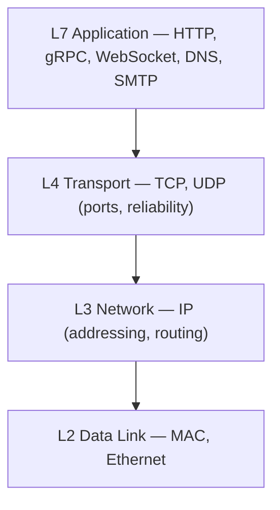
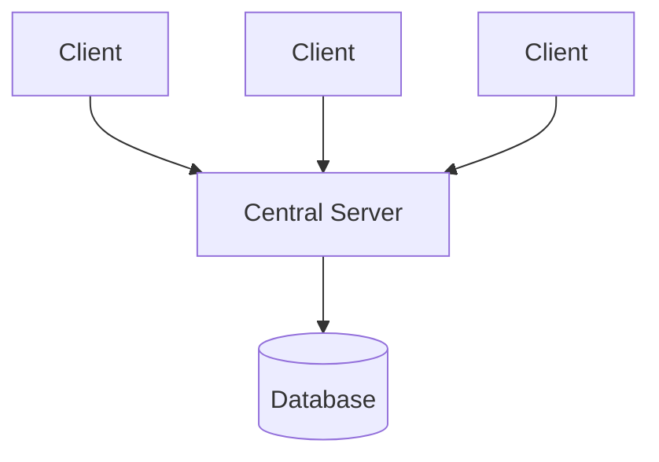
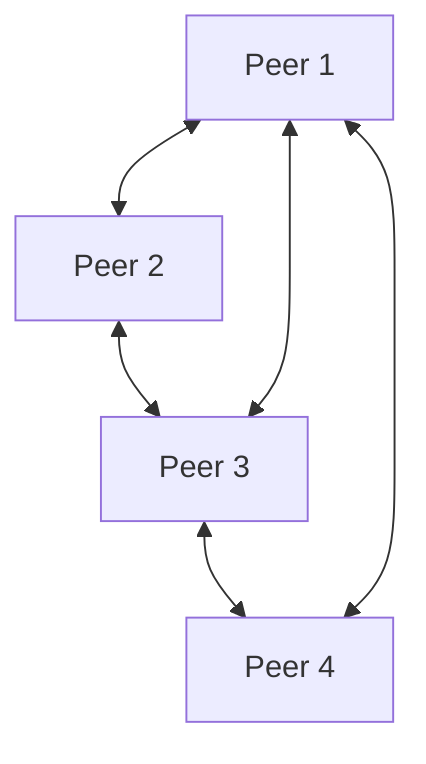
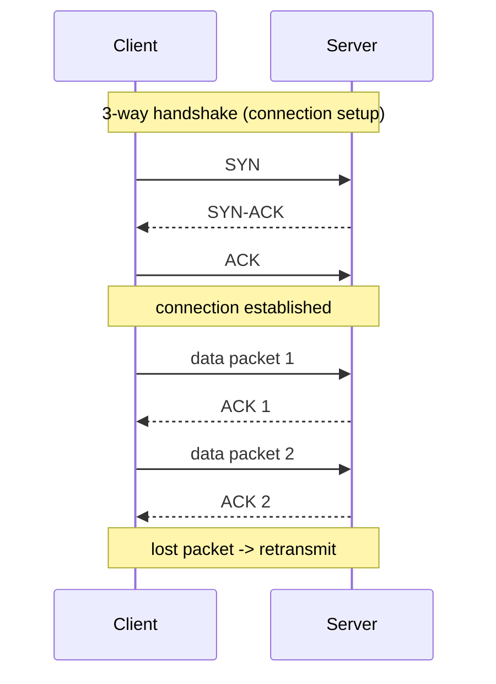
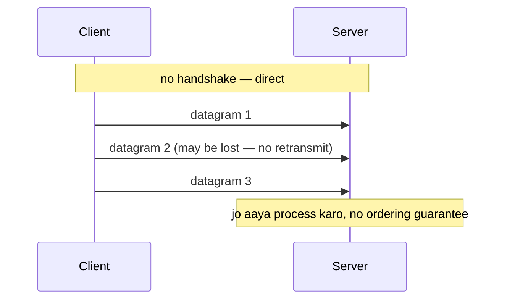
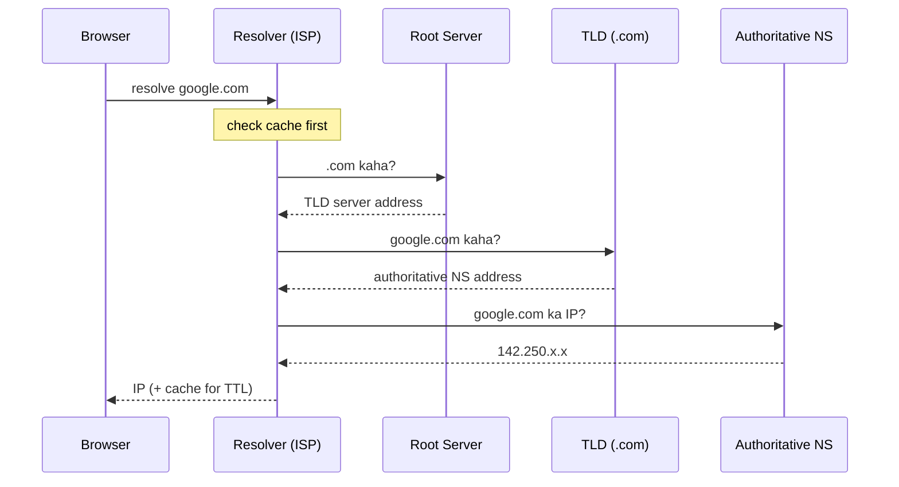
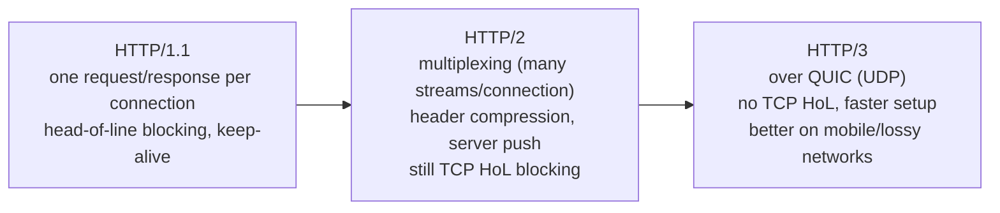
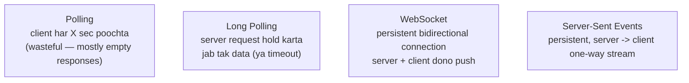
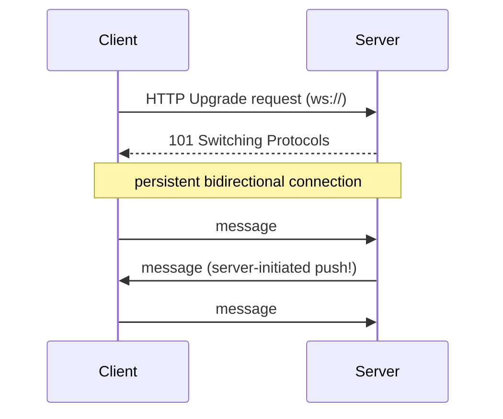

# 5. Network Protocols — Complete Deep Dive

> System ke components network se baat karte hain. **Kaunsa protocol kab** — ye har system design
> me justify karna padta. Is file me: architectures (client-server vs P2P), OSI model, TCP/UDP
> deep, IP/DNS, HTTP versions, WebSocket/SSE/polling, aur API styles (REST/gRPC/GraphQL) — sab.

---

## 📑 Is file me
1. [OSI model (quick recap)](#-osi-model-context)
2. [Client-Server vs P2P](#-architecture-client-server-vs-p2p)
3. [TCP vs UDP — deep](#-tcp-vs-udp-deep)
4. [IP & DNS](#-ip--dns)
5. [HTTP / HTTPS (versions)](#-http--https)
6. [Real-time: Polling vs Long Polling vs WebSocket vs SSE](#-real-time-communication)
7. [API styles: REST vs gRPC vs GraphQL](#-api-styles-rest-vs-grpc-vs-graphql)
8. [Interview Q&A](#-interview-qa)

---

## 🧅 OSI Model (context)

Network communication layers me organized hai. System design ke liye relevant layers:

Interview me mostly **L7 (application protocols)** aur **L4 (TCP/UDP)** discuss hote. L4 load
balancer L4 pe, L7 gateway L7 pe kaam karta (files #2, #3 se connect).

---

## 🏗️ Architecture: Client-Server vs P2P

Do fundamental communication models:

### Client-Server
Ek (ya kuch) **central servers** services provide karte, **clients** unse request karte. Server
authoritative source hai (data + logic).

**Kaise kaam karta:** client request bhejta (HTTP), server process karta + respond karta.
Clients ek doosre se directly baat nahi karte — sab server ke through.

**Fayde:** centralized control, easy consistency (single source of truth), easy security/updates,
easy management. **Nuksan:** server bottleneck/SPOF, scaling cost (server infra), single point of
attack. Zyadatar web apps, mobile apps, DBs — client-server.

### Peer-to-Peer (P2P)
Har node **client aur server dono** hai — nodes directly ek doosre se baat karte, no central
authority. Data/load peers me distributed.

**Kaise kaam karta:** koi central server nahi. Har peer resources (files, compute) share karta.
Nodes ek doosre ko discover karte (DHT — Distributed Hash Table, ya trackers).

**Fayde:** no SPOF (koi node mare, baaki chalte), scales with peers (jitne zyada peers, utni
capacity), bandwidth distributed, cheap (no central infra). **Nuksan:** consistency mushkil (no
central truth), security (malicious peers), discovery complex, unreliable (peers aate-jaate).

**Examples:** BitTorrent (file sharing), blockchain (Bitcoin/Ethereum), IPFS (distributed
storage), old Skype (calls).

| | Client-Server | P2P |
|---|---|---|
| Control | centralized | decentralized |
| SPOF | server | none |
| Scaling | server capacity limit | scales with peers |
| Consistency | easy (central) | hard (no authority) |
| Security | central control | trust issues (malicious peers) |
| Cost | server infra | distributed (cheap) |
| Examples | web/mobile apps, DBs | BitTorrent, blockchain, IPFS |

> **Client-server** = default (control, consistency). **P2P** = jab decentralization, no-SPOF, ya
> distributed bandwidth chahiye (file sharing, crypto).

---

## 🔌 TCP vs UDP (deep)

Transport layer ke do main protocols — reliability vs speed ka trade-off.

### TCP (Transmission Control Protocol)
**Connection-oriented, reliable, ordered.** Data bhejne se pehle connection establish karta
(3-way handshake), har packet ka acknowledgement leta, lost packets retransmit karta, order
maintain karta.

**Features:**
- **Reliability** — har packet ka ACK, lost → retransmit (guaranteed delivery).
- **Ordering** — packets sequence numbers se ordered (out-of-order → reorder).
- **Flow control** — receiver ki speed ke hisaab se (window size — receiver overwhelm na ho).
- **Congestion control** — network congestion detect → slow down (fairness).
- **Error checking** — checksums.

**Cost:** handshake latency (1 RTT before data), ACK overhead, head-of-line blocking (ek lost
packet baaki ko rok deta), connection state maintain.

**Use:** web (HTTP), email, file transfer, DB connections, payments — jaha har byte matter kare.

### UDP (User Datagram Protocol)
**Connectionless, unreliable, unordered, fast.** Bina handshake, bina ACK, "fire and forget."
Packets drop/reorder ho sakte, koi retransmit nahi.

**Features:** minimal overhead (no handshake/ACK/ordering), fast, low latency, broadcast/multicast
support. **Cost:** no reliability (packets drop ho sakte), no ordering.

**Use:** live video/voice streaming (ek frame drop chalega, delay nahi), online gaming (latest
position matters, purana nahi), DNS (chhota query, fast), VoIP, IoT sensors, live broadcasts.

### TCP vs UDP
| Factor | TCP | UDP |
|---|---|---|
| Connection | connection-oriented (handshake) | connectionless |
| Reliability | guaranteed delivery | best-effort (may drop) |
| Ordering | ordered | unordered |
| Speed | slower (overhead) | fast (minimal overhead) |
| Flow/congestion control | yes | no |
| Header size | 20+ bytes | 8 bytes |
| Use | web, email, file, DB | streaming, gaming, DNS, VoIP |

> ⭐ **Rule:** har byte + order chahiye → TCP. Speed > perfection (kuch loss chalega) → UDP.
> "Video call me ek frame miss chalega, par 2 second delay nahi" → UDP.

---

## 🌍 IP & DNS

### IP (Internet Protocol)
Har device ka unique **IP address** (IPv4: `192.168.1.1` — 32-bit, ~4 billion; IPv6: 128-bit —
practically infinite, IPv4 exhaustion ki wajah se). IP addressing + routing (packets ko source se
destination tak pahunchana) handle karta (L3).

### DNS (Domain Name System)
Human-readable domain (`google.com`) → machine IP (`142.250....`). Distributed hierarchical
database.

**Key points:**
- **Caching** — har level pe (browser, OS, resolver) TTL tak cache (har baar full lookup nahi).
- **DNS load balancing** — ek domain ke multiple A records (round-robin distribution).
- **GeoDNS** — user location ke hisaab se nearest server ka IP.
- **DNS record types:** A (IPv4), AAAA (IPv6), CNAME (alias), MX (mail), TXT, NS.

---

## 🌐 HTTP / HTTPS

**HTTP** — request/response, **stateless** (har request independent, server state nahi rakhta),
text-based, runs on TCP. **HTTPS** = HTTP + TLS encryption. [SSL: `14_SSL_Certificate.md`]

**Methods + idempotency:**
| Method | Kaam | Idempotent? | Safe? |
|---|---|---|---|
| GET | read | yes | yes |
| POST | create | **no** | no |
| PUT | replace | yes | no |
| PATCH | partial update | no (usually) | no |
| DELETE | delete | yes | no |

**Status codes:** 2xx success (200/201/204) · 3xx redirect (301/302/304) · 4xx client error
(400/401/403/404/429) · 5xx server error (500/502/503).

### HTTP versions evolution

- **HTTP/1.1** — ek connection pe ek request at a time (pipelining limited), keep-alive
  (connection reuse). Multiple connections chahiye parallelism ke liye.
- **HTTP/2** — **multiplexing** (ek connection pe multiple concurrent streams), header compression
  (HPACK), server push. Par TCP-level head-of-line blocking (ek lost packet saari streams roke).
- **HTTP/3** — **QUIC** (UDP-based) pe. No TCP HoL blocking (independent streams), 0-RTT connection
  setup, better on lossy/mobile networks. Google, Cloudflare adopt kar rahe.

---

## ⚡ Real-time Communication

HTTP request/response one-directional (client pull). Real-time (server push) ke liye options:

| Pattern | Direction | Connection | Use |
|---|---|---|---|
| **Polling** | client pulls repeatedly | new request each time | simple, but wasteful (empty responses) |
| **Long Polling** | client pulls, server holds | held until data | near-real-time on plain HTTP |
| **WebSocket** | **bidirectional** | persistent (one TCP) | chat, gaming, collab editing, trading, live |
| **SSE** | server → client (one-way) | persistent (HTTP) | notifications, live feeds, stock tickers, logs |

### WebSocket (deep)
HTTP se **upgrade** hota (handshake), phir persistent full-duplex TCP connection — dono taraf
kabhi bhi message bhej sakte, no repeated requests.

**Use:** chat (WhatsApp), live scores, collaborative docs, multiplayer games, trading dashboards.
**Cost:** persistent connections = server memory (millions of connections = many connection servers).

### SSE vs WebSocket
- **SSE** — one-way (server→client), HTTP-based, auto-reconnect, simple. Notifications/feeds.
- **WebSocket** — bidirectional, more complex, more powerful. Chat/gaming.
- Agar sirf server push chahiye (client nahi bhejta real-time) → SSE simpler.

---

## 📡 API Styles: REST vs gRPC vs GraphQL

| | **REST** | **gRPC** | **GraphQL** |
|---|---|---|---|
| Protocol | HTTP/1.1 + JSON | HTTP/2 + Protobuf (binary) | HTTP + JSON |
| Speed | moderate | **fast** (binary, HTTP/2) | moderate |
| Contract | loose (OpenAPI) | **strict** (.proto) | schema (typed) |
| Data fetching | fixed endpoints | RPC methods | **client picks exact fields** |
| Over/under-fetching | common problem | — | **solved** (exact data) |
| Streaming | limited | **bidirectional streaming** | subscriptions |
| Browser | native | needs proxy (grpc-web) | native |
| Best for | public APIs, CRUD, simple | internal microservices (fast) | flexible clients (mobile, complex UIs) |

**REST** — resources as URLs (`/users/123`), HTTP methods, stateless. Simple, universal, cacheable.
**Over-fetching** (zyada data) / **under-fetching** (kam, multiple calls) problems.

**gRPC** — Protobuf (binary, compact, fast) over HTTP/2 (multiplexing, streaming). Strict contract
(.proto). Internal microservices ke liye ideal (low latency). Browser support limited.

**GraphQL** — client exact fields maangta (`{ user { name, orders { id } } }`) — no over/under
fetch. Flexible (mobile kam data). Par caching mushkil, complex queries DB pe heavy.

---

## 💬 Interview Q&A

**Q: TCP vs UDP kab?**
TCP — reliability + order chahiye (web, payments, file). UDP — speed > perfection, kuch loss ok
(video/voice streaming, gaming, DNS). "Video call ek frame miss chalega, delay nahi."

**Q: Real-time chat ke liye kya use karoge?**
WebSocket — bidirectional persistent (dono taraf push). Long polling fallback. SSE agar sirf
server push (notifications).

**Q: WebSocket vs SSE?**
WebSocket bidirectional (chat/gaming). SSE server→client one-way (notifications/feeds), simpler,
HTTP-based, auto-reconnect.

**Q: HTTP/2 ne kya improve kiya, HTTP/3 ne?**
HTTP/2 — multiplexing (ek connection, many streams), header compression, server push (par TCP HoL
blocking). HTTP/3 — QUIC (UDP), no TCP HoL blocking, faster setup, better mobile.

**Q: REST vs gRPC?**
REST — HTTP/JSON, public APIs, simple, cacheable. gRPC — HTTP2/Protobuf (binary, fast), internal
microservices, streaming, strict contracts.

**Q: GraphQL ka fayda aur cost?**
Fayda — client exact data maangta (no over/under-fetch), flexible. Cost — caching mushkil, complex
queries DB pe heavy, learning curve.

**Q: Client-server vs P2P?**
Client-server — centralized (control, consistency; SPOF). P2P — decentralized (no SPOF, scales
with peers; consistency hard). P2P for file sharing/blockchain.

---

## 📝 Summary
- **Client-server** (centralized, default) vs **P2P** (decentralized — BitTorrent/blockchain).
- **TCP** (reliable, ordered — web/payments) vs **UDP** (fast, lossy — streaming/gaming/DNS).
- **DNS** — domain → IP (hierarchical, cached). **IP** — addressing/routing.
- **HTTP/1.1 → HTTP/2 (multiplexing) → HTTP/3 (QUIC/UDP, no HoL blocking).**
- Real-time: WebSocket (bidirectional), SSE (server push), long polling (fallback).
- APIs: REST (public/simple), gRPC (internal/fast), GraphQL (flexible clients).
