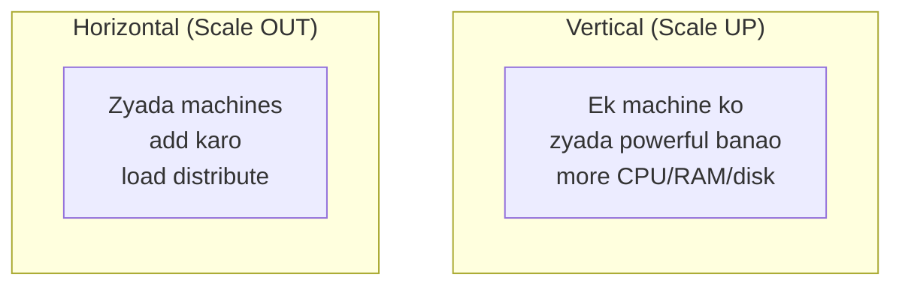
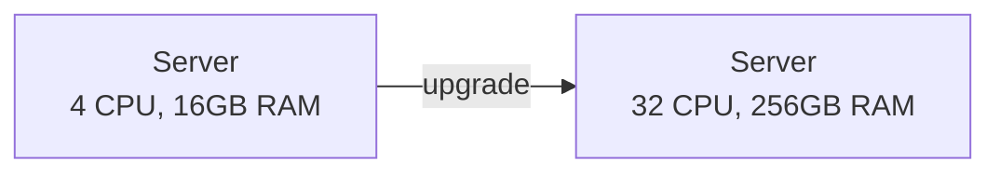
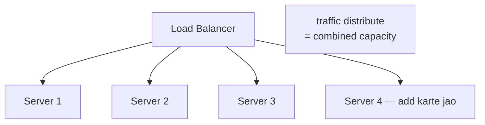
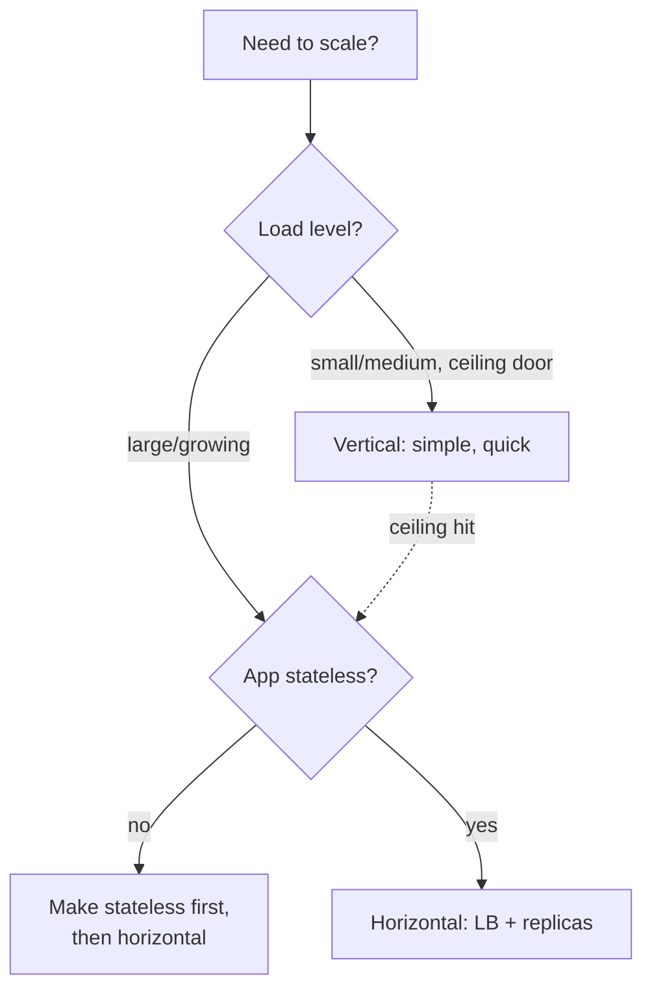
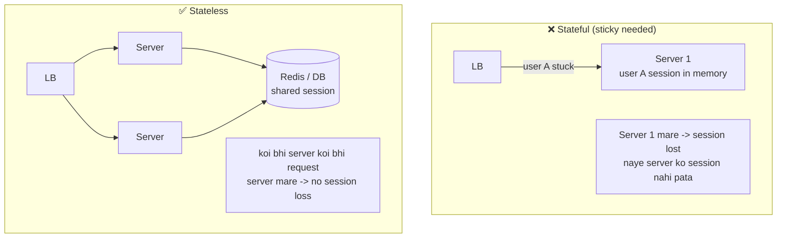
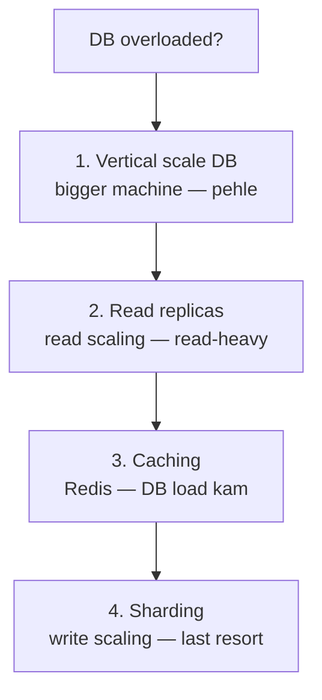
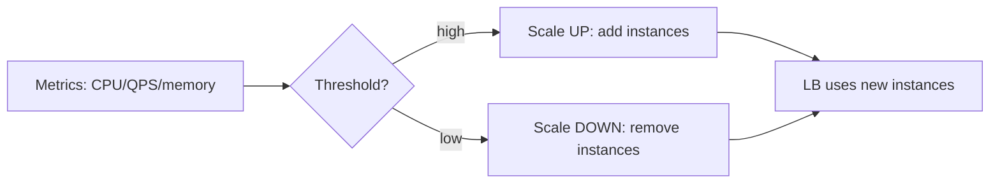

# 6. Scaling — Vertical & Horizontal (Complete Deep Dive)

> "Scale kaise karoge?" — har system design interview ka core sawaal. Scaling ka matlab: system
> ki capacity badhana taaki zyada load (users, requests, data) handle kar sake. Do fundamental
> tareeke: **vertical (up)** aur **horizontal (out)**. Is file me dono, kab kya, aur real
> scaling techniques.

---

## 📑 Is file me
1. [Scaling kya + kyun](#-scaling-kya-hai)
2. [Vertical Scaling (Scale Up) — deep](#-vertical-scaling-scale-up)
3. [Horizontal Scaling (Scale Out) — deep](#-horizontal-scaling-scale-out)
4. [Vertical vs Horizontal comparison](#-vertical-vs-horizontal)
5. [Stateless — horizontal scaling ki neev](#-stateless--horizontal-scaling-ki-neev)
6. [Database scaling (special case)](#-database-scaling)
7. [Autoscaling](#-autoscaling)
8. [Scalability principles](#-scalability-principles)
9. [Interview Q&A](#-interview-qa)

---

## 🎯 Scaling kya hai

Jab load badhta hai (zyada users/traffic/data), system slow ya crash ho sakta. **Scaling** =
capacity badhana. Do dimensions:



**Analogy:**
- **Vertical** = ek chhoti dukaan ko badi dukaan bana do (bada building, zyada shelves).
- **Horizontal** = 10 chhoti dukaanein khol do alag jagah (branches).

---

## ⬆️ Vertical Scaling (Scale Up)

### Kya hai
Ek hi machine ke **resources badhao** — zyada CPU cores, zyada RAM, faster/bigger disk, better
network. Machine ki raw power badhti hai.



### Fayde
1. **Simple** — koi code change nahi (same app, bigger machine). App ko pata bhi nahi chalta.
2. **No distributed complexity** — ek machine, ek process, ek DB — no network coordination,
   no data consistency issues, no distributed transactions.
3. **Easier data consistency** — ek DB (ACID transactions simple).
4. **Less operational overhead** — ek machine manage karni.
5. **Good for legacy apps** — jo horizontal scale ke liye design nahi hue.

### Nuksan
1. **Hardware ceiling** — ek machine kitni bhi badi ho, ek limit hai (max CPU/RAM). Physical
   limit aa jaata.
2. **Single point of failure** — ek machine down → poora system down (no redundancy).
3. **Expensive** — high-end hardware exponentially mehnga hota (2x power ≠ 2x cost, zyada).
4. **Downtime on upgrade** — usually machine restart/replace karni padti (downtime).
5. **Diminishing returns** — kisi point ke baad zyada resources add karne pe proportional gain nahi.

### Kab use
- Small/medium apps (abhi ceiling door hai)
- Databases (RDBMS often vertical scale — sharding avoid karne ke liye)
- Legacy apps (horizontal-ready nahi)
- Quick fix (jaldi capacity chahiye, code change ka time nahi)

---

## ➡️ Horizontal Scaling (Scale Out)

### Kya hai
**Zyada machines add karo** (commodity/cheaper), load balancer se traffic unme distribute karo.
Capacity practically unlimited (jitni machines chahiye add karo).



### Fayde
1. **Practically unlimited scaling** — jitni machines chahiye add karo (Google/Amazon scale).
2. **Fault tolerance / HA** — ek machine mare, baaki serve karte (no total downtime, redundancy).
3. **Cost efficient** — commodity hardware (cheap) vs high-end (expensive). Pay-as-you-grow.
4. **No downtime scaling** — machines add/remove without stopping (rolling).
5. **Elasticity** — traffic ke hisaab se auto add/remove (autoscaling).

### Nuksan
1. **Distributed complexity** — load balancing, service discovery, network coordination,
   distributed data consistency — sab handle karna padta.
2. **Data consistency mushkil** — data multiple machines pe → sharding/replication/eventual
   consistency.
3. **Application must support it** — **stateless** hona chahiye (state shared na ho per-machine).
4. **Operational overhead** — many machines monitor/deploy/manage (orchestration — Kubernetes).
5. **Network overhead** — machines ke beech communication (latency).

### Kab use
- Large scale / high traffic (web apps at scale)
- High availability critical (no SPOF)
- Unpredictable/spiky traffic (autoscale)
- Stateless services (easy to replicate)

---

## 🆚 Vertical vs Horizontal

| Factor | Vertical (Up) | Horizontal (Out) |
|---|---|---|
| Kaise | ek machine bada | zyada machines |
| Limit | hardware ceiling | practically unlimited |
| Cost | expensive (high-end) | cheaper (commodity) |
| Failure | SPOF (ek machine) | fault tolerant |
| Complexity | simple (no code change) | complex (distributed) |
| Downtime | usually yes (upgrade) | no (rolling) |
| Data consistency | easy (one DB) | hard (distributed) |
| App changes | none | stateless required |
| Elasticity | poor (manual, downtime) | excellent (autoscale) |
| Best for | small/medium, DBs, legacy | large scale, HA, web apps |



> ⭐ **Reality:** dono use hote hain. Chhota app → vertical (simple). Grow → horizontal (add
> machines). **Modern cloud-native = horizontal** (commodity, elastic, fault-tolerant). Par
> databases aksar vertical scale karte pehle (sharding complexity avoid), phir read replicas +
> sharding.

---

## 🧊 Stateless — Horizontal Scaling ki neev

Horizontal scaling ka **precondition**: services **stateless** hon.



**Stateless service** — server request ke beech koi state memory me nahi rakhta. State bahar
(Redis, DB, client token/JWT) me. Isliye:
- **Koi bhi server koi bhi request** handle kar sakta → LB simple (any algorithm), no sticky.
- **Server death = no data loss** (state bahar hai).
- **Easy replication** (naya server bina state-migration ke join karta).

**Stateful se stateless kaise:**
- Session → Redis / JWT (token me claims).
- Uploaded files → S3 (local disk nahi).
- In-memory cache → distributed cache (Redis).
- Server sirf **compute** kare, state external store me.

> ⭐ **Golden rule:** "Make services stateless, push state to external stores." Ye horizontal
> scaling, HA, aur simple deployment sab enable karta.

---

## 🗄️ Database Scaling (special case)

Stateless app servers easy scale karte, par **database inherently stateful** — scaling mushkil.



DB scaling ka roadmap:
1. **Vertical** — bigger DB machine (simplest, pehle).
2. **Read replicas** — master writes, replicas reads (read scaling — most apps read-heavy).
   [Detail in HLD guide replication section]
3. **Caching** — Redis se frequent reads DB tak jaayein hi nahi. [Detail: `08_Caching...`]
4. **Sharding** — data multiple DBs me (write scaling) — complex, last resort.
   [Detail: `21_Database_Sharding.md`]

> Isliye "scale the database" ka jawab ek line ka nahi — vertical → replicas → cache → shard,
> in order (complexity badhti jaati).

---

## 🤖 Autoscaling

Horizontal scaling ka automation — load ke hisaab se machines auto add/remove.



**Types:**
- **Reactive** — metric threshold cross (CPU > 70%) → add instances. Delay (new instance warmup).
- **Scheduled** — known peak (sale 12 PM) → pre-scale before.
- **Predictive** — ML-based (traffic pattern predict) → proactive.

**Considerations:**
- **Warmup time** — new instance ready hone me time (cold cache/JIT) — reactive scaling me lag.
- **Scale-in carefully** — graceful (connection draining before terminate).
- **Cooldown** — bar-bar scale up/down (flapping) avoid.
- **Min/max bounds** — cost control (max) + baseline availability (min).

---

## 🏛️ Scalability principles (design for scale)

1. **Stateless services** — state external (Redis/DB) — precondition for horizontal.
2. **Caching everywhere** — DB/compute load kam (browser → CDN → app → Redis → DB).
3. **Async processing** — heavy work message queue pe (decouple, spike absorb).
4. **Database optimization** — indexing, read replicas, caching, then sharding.
5. **CDN** — static content edge se (origin load kam).
6. **Load balancing** — distribute + health + failover.
7. **Avoid SPOF** — redundancy har layer. [Detail: `17_...`]
8. **Partition data** — sharding for write scaling.
9. **Loose coupling** — services independent (microservices, events).
10. **Measure + monitor** — bottleneck pehchano (metrics), phir target scale.

---

## 📈 Scaling ka natural progression (0 → millions)
Ye topic itna important hai ki iski apni file hai: [`07_Scale_Application_0_to_Million.md`](./07_Scale_Application_0_to_Million.md)
Short version:
```
1 server → separate DB → load balancer + app replicas → cache → read replicas
→ CDN → message queue → sharding → microservices → multi-region
```

---

## 💬 Interview Q&A

**Q: Vertical vs horizontal scaling?**
Vertical = ek machine bada (simple, ceiling, SPOF, expensive). Horizontal = zyada machines
(unlimited, fault-tolerant, cheap, but distributed complexity + stateless needed). Modern =
horizontal.

**Q: Horizontal scaling ke liye kya precondition?**
Services **stateless** (state Redis/DB me, memory me nahi) → koi bhi server koi bhi request →
easy replication + no session loss.

**Q: Database kaise scale karoge?**
Vertical (bigger machine) → read replicas (read scaling) → caching (Redis) → sharding (write
scaling, last resort). In order — complexity badhti.

**Q: Stateful app ko horizontal scale kaise?**
Pehle stateless banao — session Redis/JWT me, files S3 me, cache distributed. Phir replicas + LB.
Warna sticky sessions (scaling mushkil).

**Q: Autoscaling kaise kaam karta?**
Metrics (CPU/QPS) threshold → auto add/remove instances. Reactive (threshold), scheduled (known
peak), predictive (ML). Warmup lag + graceful scale-in + cooldown consider.

**Q: Vertical scaling ki limit?**
Hardware ceiling (max CPU/RAM ek machine me), SPOF, exponential cost, upgrade downtime,
diminishing returns. Isliye eventually horizontal.

**Q: Scaling me sabse pehla step kya?**
Bottleneck identify karo (metrics — CPU? DB? memory? network?). Phir targeted scale (DB slow →
cache+replicas, not more app servers).

---

## 📝 Summary
- **Vertical (up)** = bigger machine (simple, ceiling, SPOF, expensive). Small/medium, DBs, legacy.
- **Horizontal (out)** = more machines (unlimited, fault-tolerant, cheap, distributed complexity).
  Large scale, HA. **Modern default.**
- **Stateless** = horizontal scaling ki precondition (state → Redis/DB/JWT).
- **DB scaling** = vertical → read replicas → cache → shard (in order).
- **Autoscale** = load ke hisaab se auto add/remove (reactive/scheduled/predictive).
- Design for scale: stateless, cache, async, replicas, CDN, no SPOF.
