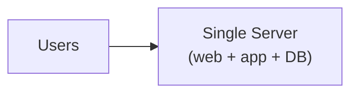
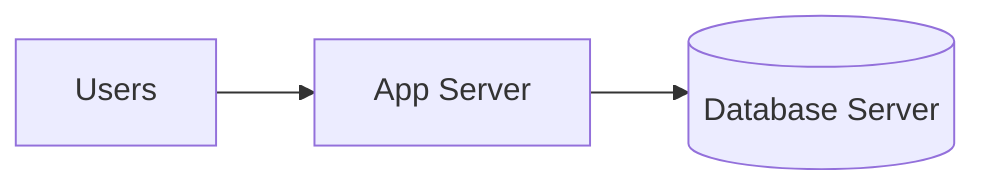
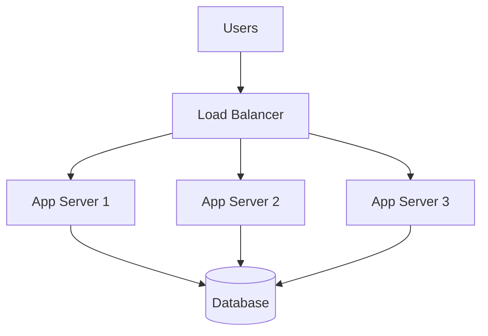
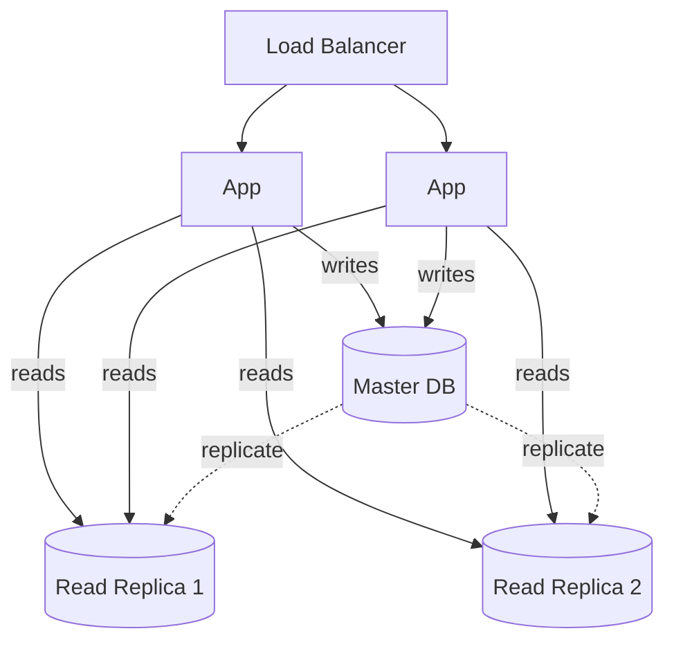
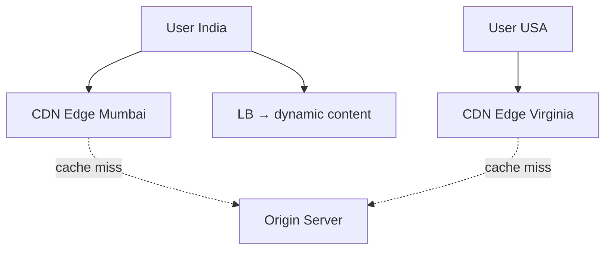
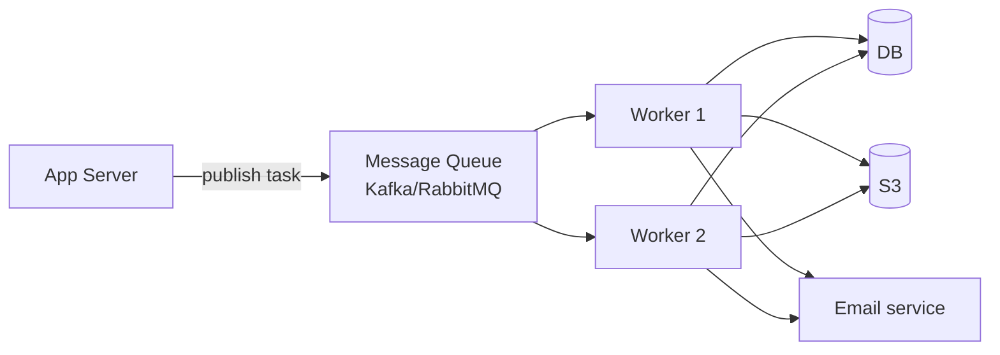
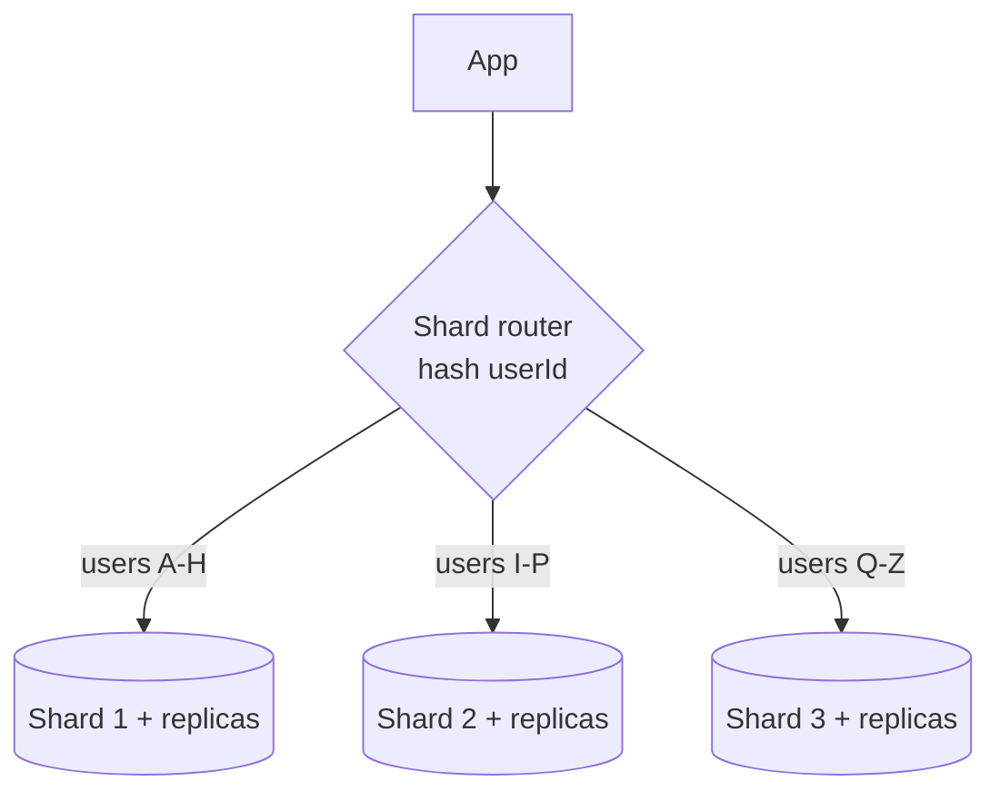
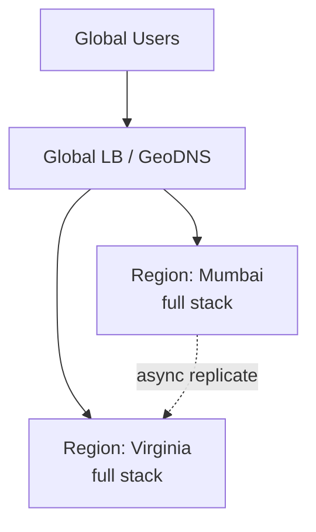
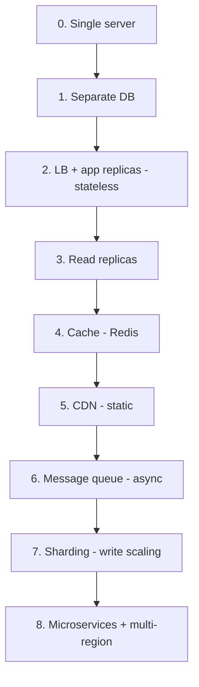

# 7. How to Scale an Application from 0 to a Million Users

> Ye topic system design ki **poori kahani ek jagah** batata hai. Ek chhoti app (1 server) se
> lekar millions of users tak — kaunse steps, kaunse component kab add hote, aur kyun. Ye
> "evolution" hi HLD interview ka backbone hai.

---

## 📑 Journey ke stages
```
Stage 0: Single server (all-in-one)
Stage 1: Separate database
Stage 2: Load balancer + multiple app servers (stateless)
Stage 3: Database replication (read scaling)
Stage 4: Caching (Redis)
Stage 5: CDN (static content)
Stage 6: Message queue (async)
Stage 7: Database sharding (write scaling)
Stage 8: Microservices + multi-region
```
Har stage ek naya bottleneck solve karta. Chalो step by step.

---

## 🟢 Stage 0 — Single Server (0 → ~1000 users)

Sab ek machine pe: web server + application + database.



- **Simple, cheap, fast to build.** MVP/startup ke liye perfect.
- **Problem:** ek machine sab kuch — CPU/memory/disk share. Traffic badhne pe DB queries app ko
  slow karti (resource contention). Aur **SPOF** — machine down = sab down.

---

## 🔵 Stage 1 — Separate Database (~1000 → 10K users)

Web/app server aur database ko **alag machines** pe. Har ek independently scale/tune ho sakta.



- **Kyun:** app aur DB ki resource needs alag (app CPU-heavy, DB memory/disk-heavy). Alag karke
  har ek ko independently vertical scale + tune.
- **Ab:** app server crash → DB safe (aur vice versa).

---

## 🟣 Stage 2 — Load Balancer + Multiple App Servers (10K → 100K users)

Ek app server kam pad raha. **Load balancer** ke peeche **multiple app server replicas** —
horizontal scaling.



- **Precondition — STATELESS servers:** session ko server memory se **Redis/DB** me daalo (ya
  JWT). Warna sticky sessions (scaling mushkil). [Detail: `06_Scaling...`]
- **Fayde:** horizontal scale (add servers), **HA** (ek server mare → LB baaki ko), no downtime
  deploys (rolling).
- **Naya bottleneck:** ab saare app servers ek hi DB pe → **DB overloaded**.

---

## 🟠 Stage 3 — Database Replication (100K → 500K users)

DB read-heavy hota hai (reads >> writes usually). **Master-replica** setup — master writes handle
kare, **read replicas** reads handle karein.



- **Read scaling** — reads multiple replicas me distribute (10x read capacity).
- **HA** — master down → replica promote to master (failover).
- ⚠ **Replication lag** — async replication me replica master se thodi peeche (stale reads).
  Fix: critical reads master se (read-your-writes).
- **Naya bottleneck:** reads abhi bhi DB tak jaa rahe — expensive queries repeat.

---

## 🔴 Stage 4 — Caching (500K → 1M users)

Frequently accessed data ko **Redis** (in-memory cache) me rakho — DB tak requests jaayein hi na.

```mermaid
flowchart TB
    LB[LB] --> A[App Servers]
    A -->|1. check| C[(Redis Cache)]
    A -->|2. miss → query| DB[(Database)]
    A -.3. populate cache.-> C
```

**Cache-aside pattern:**
```
read: cache check → hit? return : DB → cache me daalo → return
write: DB update → cache invalidate
```
- **Fayde:** DB load drastically kam (80% traffic cache se), latency kam (memory >> disk).
- **Considerations:** TTL (freshness), eviction (LRU), invalidation (stale data). [Detail: `08_Caching...`]
- **Naya bottleneck:** static content (images/CSS/JS) abhi bhi app servers se — bandwidth + latency
  (specially far users).

---

## 🟡 Stage 5 — CDN (Static Content)

Static assets (images, videos, CSS, JS) ko **CDN** (globally distributed edge servers) pe. Users
ko nearest edge se milta.



- **Fayde:** latency kam (content user ke paas), origin bandwidth/load bahut kam, DDoS absorption.
- Static → CDN, dynamic → app servers. [Detail: `10_CDN.md`]
- **Naya bottleneck:** heavy operations (image processing, emails, reports) request ko slow kar rahe.

---

## 🟤 Stage 6 — Message Queue (Async Processing)

Slow/heavy tasks (email, image resize, notifications, analytics) ko **synchronous request se
hatao** — message queue pe daalo, background workers process karein.



- **Fayde:** user ko fast response (heavy work background me), spike buffering (queue absorb karti),
  decoupling, independent worker scaling.
- Example: user photo upload → turant "uploaded" response → queue → workers resize/thumbnail async.
- [Detail: `18_Message_Queues...`]
- **Naya bottleneck:** ek DB (even with replicas) writes handle nahi kar pa raha — **write bottleneck**.

---

## ⚫ Stage 7 — Database Sharding (Write Scaling)

Reads replicas se scale ho gaye, par **writes ek master pe** — bottleneck. **Sharding** — data ko
**multiple DBs** me baato (har shard subset handle kare).



- **Write scaling** — writes multiple shards me distribute (har shard ka apna master).
- ⚠ **Complexity** — cross-shard queries/joins mushkil, resharding, hotspots. **Last resort**
  (pehle vertical + replicas + cache try karo). [Detail: `21_Database_Sharding.md`]

---

## 🌐 Stage 8 — Microservices + Multi-Region (Millions+)

- **Microservices** — monolith ko independent services me (User, Order, Payment...) — team + scale
  autonomy. [Detail: `01_Monolithic_and_Microservices.md`]
- **Multi-region** — multiple datacenters (geo-distribution) — global users ko low latency,
  disaster recovery, compliance.
- **Advanced:** service mesh, distributed tracing, autoscaling, data lakes, ML pipelines.



---

## 📊 Full evolution (ek nazar)



| Stage | Bottleneck solved | Component added |
|---|---|---|
| 0 | — | single server |
| 1 | resource contention | separate DB |
| 2 | app capacity + SPOF | LB + replicas (stateless) |
| 3 | DB read load | read replicas |
| 4 | repeated reads | cache (Redis) |
| 5 | static content latency | CDN |
| 6 | slow heavy tasks | message queue |
| 7 | DB write bottleneck | sharding |
| 8 | team/scale/global | microservices + multi-region |

---

## 🔑 Key principles (throughout)
1. **Stateless services** — state external (enables horizontal scaling).
2. **Cache aggressively** — every layer (browser → CDN → app → Redis → DB).
3. **Async for heavy work** — message queues (decouple + spike absorb).
4. **Read replicas before sharding** — reads scale easy, writes hard.
5. **CDN for static** — offload origin.
6. **Measure bottlenecks** — metrics se pata karo kya slow (blindly scale mat karo).
7. **No SPOF** — redundancy har layer.
8. **Add complexity only when needed** — YAGNI (100 users ke liye sharding mat karo).

---

## 💬 Interview Q&A

**Q: 1 million users ko kaise scale karoge?**
Stage progression: single server → separate DB → LB + stateless app replicas → read replicas →
cache → CDN → message queue → sharding. Har step ek bottleneck solve. Measure first.

**Q: Pehla scaling step kya?**
DB ko app se alag karo (Stage 1), phir LB + multiple stateless app servers (Stage 2). Simplest
high-impact steps.

**Q: Read-heavy vs write-heavy scaling?**
Read-heavy → read replicas + caching + CDN. Write-heavy → sharding + write-optimized DB (Cassandra)
+ message queue (buffer writes).

**Q: Kab sharding karoge?**
Last resort — jab reads (replicas) aur cache ke baad bhi DB **writes** ek master handle na kar
paaye. Pehle vertical + replicas + cache. Sharding = complexity (cross-shard queries).

**Q: Stateless kyun itna important?**
Horizontal scaling ki precondition — koi bhi server koi request → easy replication, no session
loss on server death, simple LB.

**Q: Sabse common mistake?**
Premature optimization — chhoti app ko microservices/sharding me tod dena. Start simple, add
complexity when metrics show real bottleneck.

---

## 📝 Summary
- Scale = evolution: single server → DB split → LB + stateless replicas → read replicas → cache →
  CDN → message queue → sharding → microservices + multi-region.
- Har step ek specific bottleneck solve karta.
- **Measure bottleneck first**, then targeted scaling.
- Principles: stateless, cache, async, replicas-before-sharding, no SPOF, YAGNI.
- Read-heavy → replicas+cache+CDN; write-heavy → sharding+queue.
