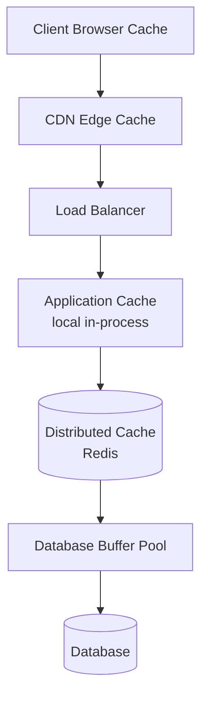
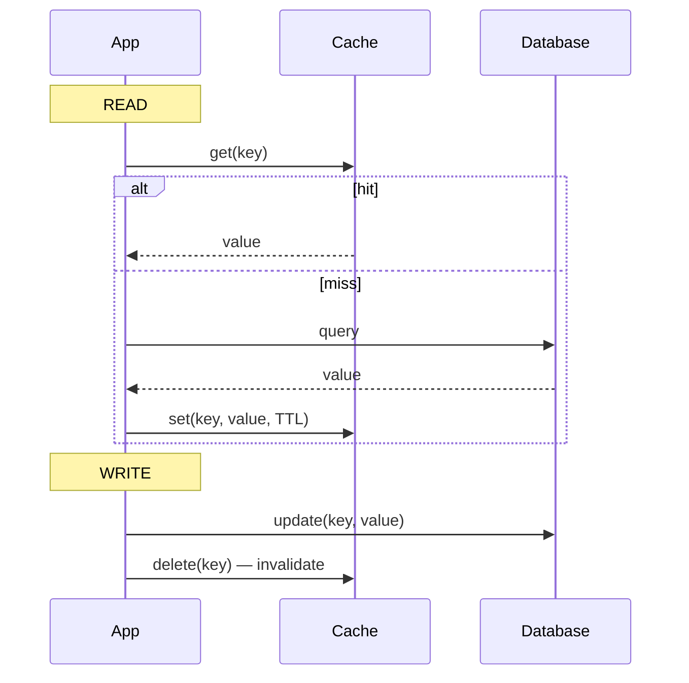
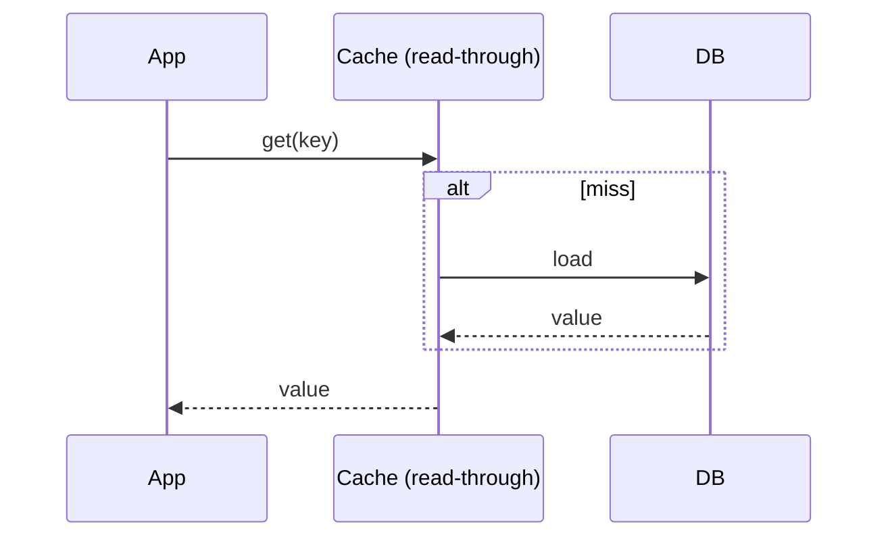
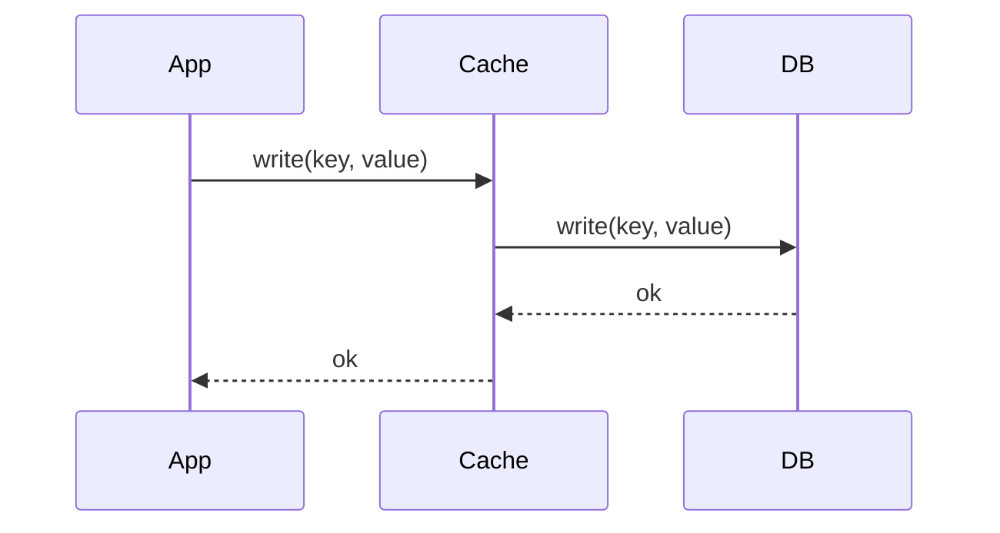
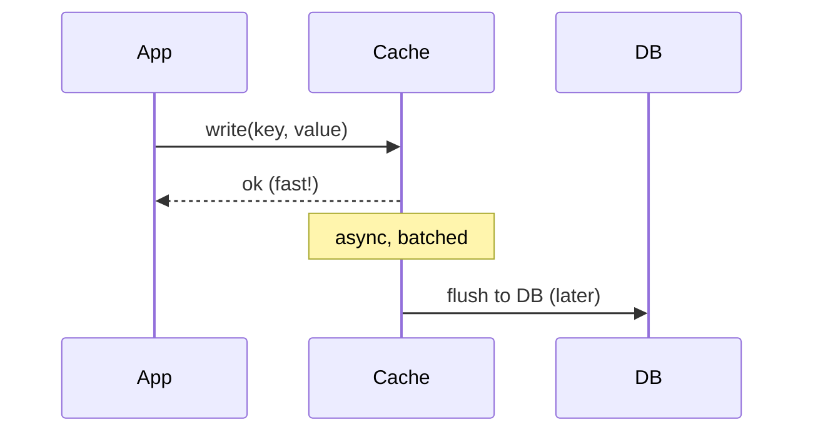
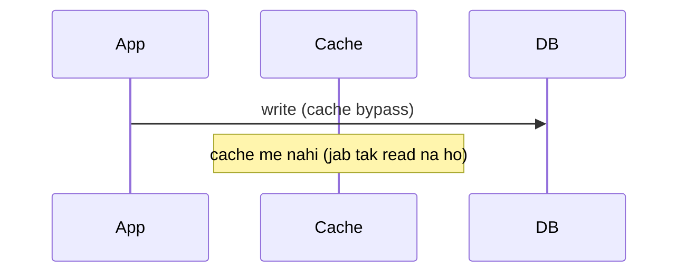
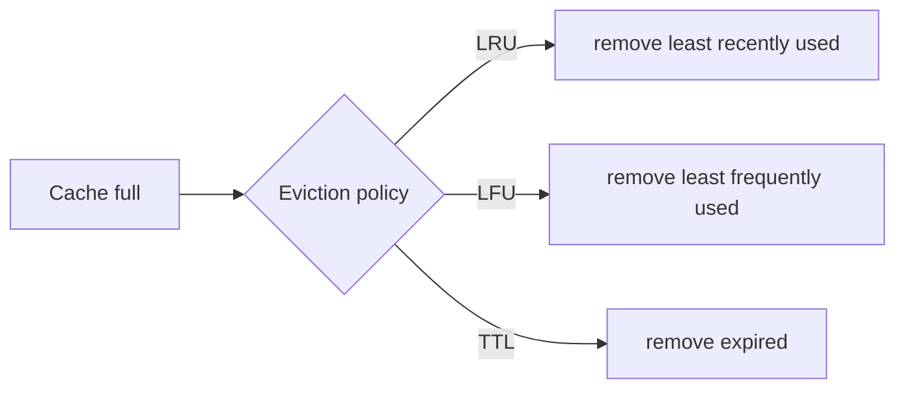
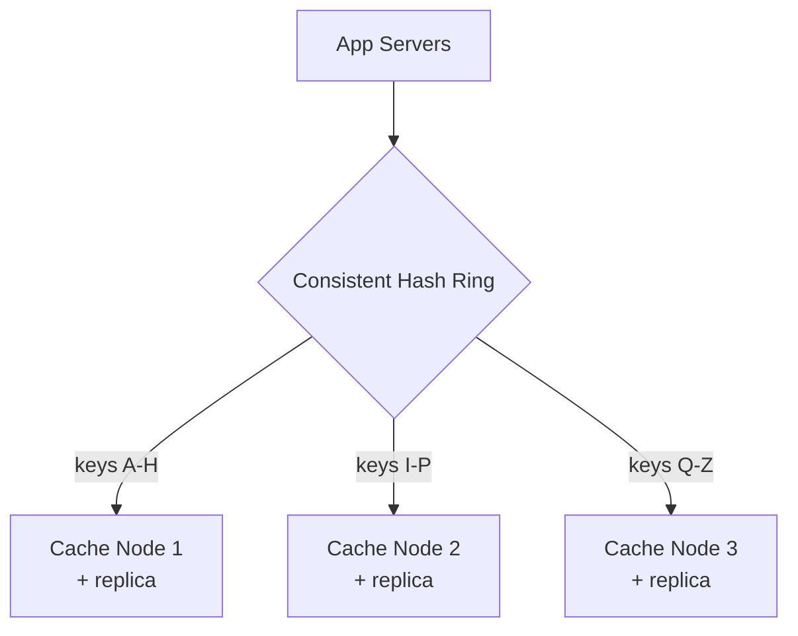
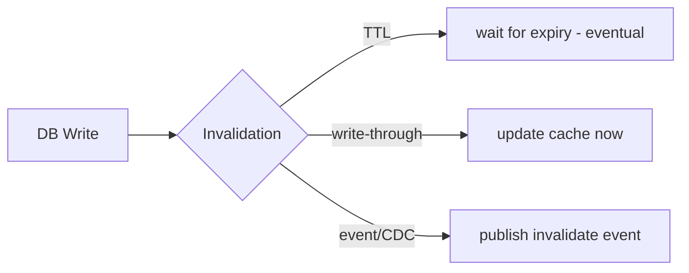
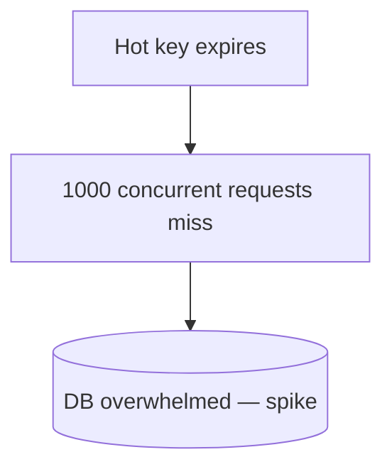

# 8. Caching and Distributed Caching (Complete Deep Dive)

> Caching HLD ka **dil** hai. Almost har scalable system caching pe depend karta. Idea simple:
> frequently accessed data ko **fast storage (memory)** me rakho taaki slow source (DB/disk/
> network) bar-bar hit na ho. Is file me: caching kya/kyun, levels, strategies, eviction,
> distributed caching, invalidation, aur famous caching problems.

---

## 📑 Is file me
1. [Caching kya + kyun](#-caching-kya-hai)
2. [Cache levels (kahan-kahan)](#-cache-levels-kahan-cache-hota)
3. [Caching strategies (5 patterns)](#-caching-strategies)
4. [Eviction policies](#-eviction-policies)
5. [Distributed caching](#-distributed-caching)
6. [Cache invalidation](#-cache-invalidation)
7. [Famous caching problems](#-famous-caching-problems)
8. [Redis vs Memcached](#-redis-vs-memcached)
9. [Interview Q&A](#-interview-qa)

---

## 🎯 Caching kya hai

Cache = ek **fast storage layer** jo frequently accessed data ki copy rakhta hai. Jab data chahiye,
pehle cache check karo (fast). Mile (**hit**) → wahi return. Na mile (**miss**) → slow source se
laao, cache me daalo, return.

```mermaid
flowchart LR
    App[Application] -->|1. check| C[(Cache — memory, fast)]
    C -->|hit| App
    App -->|2. miss → query| DB[(Database — slow)]
    DB -->|3. data| App
    App -.4. store.-> C
```

### Kyun kaam karta — speed hierarchy
```
L1 cache      ~1 ns
RAM (memory)  ~100 ns      ← cache yahan
SSD           ~16,000 ns   (16 μs)
Disk (HDD)    ~10,000,000 ns (10 ms)
Network (RT)  ~500,000 ns (datacenter) to 150 ms (cross-continent)
```
Memory disk se **~1000x faster**, network se aur zyada. Isliye cache (memory) DB (disk) ko avoid
karke huge speedup deta.

### Fayde
- **Latency kam** — memory se instant (DB query nahi).
- **DB load kam** — 80% traffic cache se (Pareto) → DB bacha.
- **Throughput badhta** — same DB pe zyada requests serve.
- **Cost kam** — DB scale nahi karna padta (cache sasti).

### Cache metrics
- **Hit ratio** = hits / (hits + misses). Zyada = better (80%+ good). Cache size + right data se tune.
- **Miss ratio** = 1 - hit ratio.

---

## 🏢 Cache levels (kahan cache hota)

Caching multiple levels pe ho sakta — har level pe load kam:



| Level | Kya cache | Example |
|---|---|---|
| **Browser** | static assets, API responses | `Cache-Control` headers |
| **CDN** | static content globally | Cloudflare, CloudFront |
| **Application (local)** | in-process objects (fastest) | Caffeine, Guava (per-server) |
| **Distributed cache** | shared across servers | Redis, Memcached |
| **Database cache** | query results, buffer pool | DB's own memory |

- **Local cache** — ultra-fast (no network) par **per-server** (each server apni copy — memory
  duplicate, consistency issue).
- **Distributed cache** — shared (all servers same view) par network hop.
- **Near cache (hybrid)** — local L1 + distributed L2 (best of both, invalidation complex).

---

## 🔄 Caching Strategies

Data cache me kaise aata/jaata — 5 patterns. Ye interview me guaranteed poochhe jaate.

### 1. Cache-Aside (Lazy Loading) — MOST COMMON
Application cache manage karta. Miss pe khud DB se laata + cache me daalta.


- ✅ Simple, only requested data cached (lazy), cache failure → DB fallback (resilient).
- ❌ First read slow (miss), stale possible (write invalidate na ho to), 3-step logic.
- **Use:** most common, read-heavy general purpose. (Repo LLD me clientRequestId/order lookup)

### 2. Read-Through
Cache khud DB se load karta (application ke bajaye cache library handle karti). App sirf cache se
maangta.

- ✅ App simple (cache logic library me), consistent read path.
- ❌ Cache library DB ko jaanti honi chahiye, first read slow.

### 3. Write-Through
Write pe **cache + DB dono** ek saath update (synchronously). Cache hamesha fresh.

- ✅ Cache always consistent with DB, no stale.
- ❌ Write slow (2 writes), cache me wo data bhi jo shayad kabhi read na ho (waste).
- **Use:** read-heavy + consistency important. Often with read-through.

### 4. Write-Back (Write-Behind)
Write pe **sirf cache** update (fast), DB **async** (baad me batch). Ultra-fast writes.

- ✅ Very fast writes, write batching (DB load kam), write-heavy ke liye.
- ❌ **Data loss risk** — cache crash before flush → unwritten data gone. Complex.
- **Use:** write-heavy, some loss tolerable (analytics, counters).

### 5. Write-Around
Write **seedha DB** (cache skip). Cache sirf read pe populate (cache-aside style).

- ✅ Cache pollution kam (jo data likha par kabhi read nahi, cache me nahi).
- ❌ First read after write slow (miss).
- **Use:** write-heavy jaha likha data turant read nahi hota.

### Strategy comparison
| Strategy | Read | Write | Consistency | Use |
|---|---|---|---|---|
| Cache-aside | app manages, lazy | invalidate | eventual | general (most common) |
| Read-through | cache loads | — | eventual | app simplicity |
| Write-through | — | cache+DB sync | strong | read-heavy + consistency |
| Write-back | — | cache first, DB async | weak (loss risk) | write-heavy, fast |
| Write-around | — | DB direct | eventual | write-heavy, rare re-read |

---

## 🗑️ Eviction Policies

Cache memory limited — full hone pe kaunsa data hatao?

| Policy | Kya hatao | Best for |
|---|---|---|
| **LRU** (Least Recently Used) | sabse purana used | temporal locality (recent = likely again) — **most common** |
| **LFU** (Least Frequently Used) | sabse kam access count | popular items rakhne | 
| **FIFO** | sabse pehle aaya | simple, order-based |
| **TTL** (Time To Live) | expiry time based | time-sensitive data |
| **Random** | random | simple, low overhead |

- **LRU** — recency assumption ("jo abhi use hua, phir hoga"). HashMap + doubly linked list, O(1).
  [Repo LLD: `LRU_Cache_LLD`]
- **LFU** — frequency ("popular = keep"). Frequency buckets, O(1). [Repo LLD: `LFU_Cache_LLD`]
- **TTL** — har entry ki expiry (fresh guarantee). Aksar LRU/LFU ke saath.



---

## 🌐 Distributed Caching

Ek cache node ki memory limited. **Distributed cache** = multiple cache nodes, data unme
distributed (sharded).



**Key concepts:**
- **Sharding** — keys nodes me distribute (**consistent hashing** — node add/remove pe 1/N move,
  na ki sab). [Detail: `19_Consistent_Hashing.md`]
- **Replication** — har shard ki replica (node fail → replica). HA.
- **Data partitioning** — `hash(key)` decide karta kaunsa node.

**Challenges:**
- **Consistency** — cache aur DB sync (invalidation), multiple cache nodes.
- **Node failure** — replica promote, ring rebalance.
- **Hot key** — ek key pe bahut load (celebrity). Fix: replicate hot key, local cache.

**Redis Cluster** — 16384 hash slots, nodes me distributed, master-replica per slot range.

---

## ♻️ Cache Invalidation

"There are only two hard things in CS: cache invalidation and naming things." Cache me stale data
na rahe — mushkil problem.

**Approaches:**
1. **TTL (expiry)** — data auto-expire after X time. Simple, but thodi der stale.
   - Chhoti TTL = fresh but zyada DB hits. Badi TTL = kam DB but stale risk. Trade-off.
2. **Write-through invalidation** — write pe cache update/delete (immediate consistency).
3. **Event-based (CDC)** — DB change → event → cache invalidate. Accurate, real-time.
4. **Versioned keys** — `user:123:v2` — naye version se purana naturally expire (no explicit delete).



---

## 🔥 Famous Caching Problems

Ye interview me deep-dive hote:

### 1. Thundering Herd / Cache Stampede
Popular key **expire** hoti → ek saath **hazaar requests** cache miss → sab DB pe → DB crash.

**Fixes:**
- **Locking** — ek request DB se laaye (lock le), baaki wait karein us result ka.
- **Stale-while-revalidate** — stale value serve karo + async refresh (background).
- **Probabilistic early expiration** — expiry se thoda pehle randomly refresh (jitter).

### 2. Cache Penetration
Non-existent keys baar-baar query (`user:99999` jo hai hi nahi) → har baar cache miss → DB hit.
Attacker isko exploit kar sakta.
**Fixes:**
- **Null caching** — "not found" bhi cache karo (short TTL).
- **Bloom filter** — "ye key exist karti hai kya" pehle check (memory-efficient).

### 3. Cache Avalanche
Bahut saari keys **ek saath expire** (same TTL) → DB pe sudden spike.
**Fix:** TTL me **randomness/jitter** (TTL + random(0-60s)) — expiry spread ho.

### 4. Hot Key
Ek key pe disproportionate load (viral post, celebrity) → ek cache node overwhelmed.
**Fixes:** replicate hot key across nodes, local (in-process) cache for hottest, dedicated node.

---

## 🆚 Redis vs Memcached

| | **Redis** | **Memcached** |
|---|---|---|
| Data types | rich (string, list, set, sorted set, hash, bitmap, HyperLogLog, streams) | simple key-value only |
| Persistence | yes (RDB snapshots + AOF) | no (pure memory) |
| Replication | yes (master-replica) | no (native) |
| Clustering | Redis Cluster | client-side sharding |
| Threading | single-threaded (atomic ops) | multi-threaded |
| Use | versatile (cache, leaderboard, pub-sub, queue, rate limiter, locks) | simple pure caching |
| Extras | Lua scripts, transactions, geo, TTL | multi-threaded speed |

> **Redis** = default (versatile). **Memcached** = simple pure-cache jab multi-threaded raw speed
> chahiye aur features nahi.

---

## 🌍 CDN (caching for static content)
CDN = geographically distributed cache for static content (images/video/CSS/JS). Users ko nearest
edge se. [Full detail: `10_CDN.md`]

---

## 💬 Interview Q&A

**Q: Caching strategies?**
Cache-aside (app manages, lazy — most common), read-through (cache loads), write-through (cache+DB
sync), write-back (cache first DB async — fast, loss risk), write-around (DB direct).

**Q: Cache invalidation kaise?**
TTL (expiry), write-through (update on write), event-based/CDC (DB change → invalidate), versioned
keys. Trade-off: freshness vs DB load.

**Q: Thundering herd kya, fix?**
Hot key expire → mass concurrent misses → DB spike. Fix: locking (one rebuilds), stale-while-
revalidate, probabilistic early refresh.

**Q: Cache penetration?**
Non-existent keys repeatedly query → DB hit har baar. Fix: null caching (short TTL), Bloom filter.

**Q: LRU vs LFU?**
LRU = least recently used (recency — most common). LFU = least frequently used (popularity). LRU
temporal locality, LFU popular items rakhta.

**Q: Redis vs Memcached?**
Redis — rich types, persistence, replication, versatile (leaderboard/pub-sub/locks). Memcached —
simple key-value, multi-threaded, pure cache.

**Q: Local vs distributed cache?**
Local (in-process) — fastest (no network), but per-server (stale, memory dup). Distributed (Redis)
— shared (consistent), network hop. Near cache = both.

**Q: Cache down ho jaye to?**
Cache-aside resilient — cache miss → DB fallback (degraded, not down). Ensure DB peak load handle
kar sake (cache warming, gradual). Circuit breaker on cache.

---

## 📝 Summary
- Cache = fast (memory) copy of frequent data. Memory ~1000x faster than disk → huge speedup +
  DB load kam.
- **Levels:** browser → CDN → app-local → distributed (Redis) → DB.
- **Strategies:** cache-aside (common), read/write-through, write-back, write-around.
- **Eviction:** LRU (common), LFU, TTL, FIFO.
- **Distributed:** consistent hashing + replication. **Invalidation:** TTL/write-through/CDC.
- **Problems:** thundering herd, penetration, avalanche, hot key — sabke fixes.
- **Redis** (versatile) vs **Memcached** (simple).
