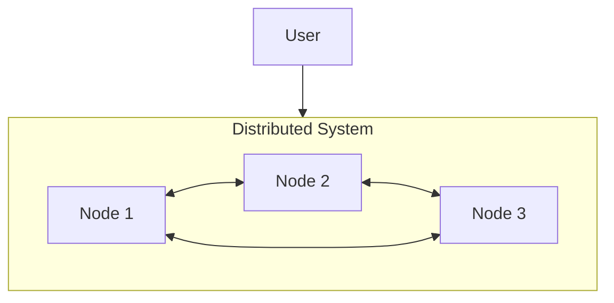
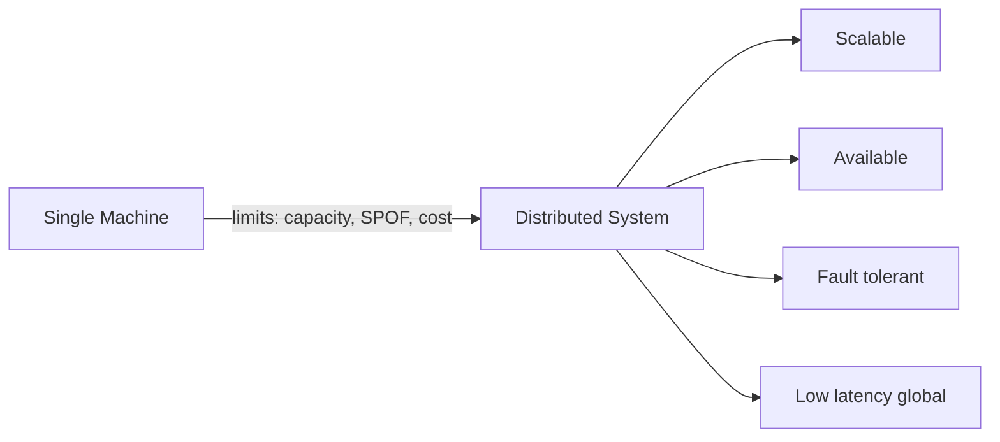
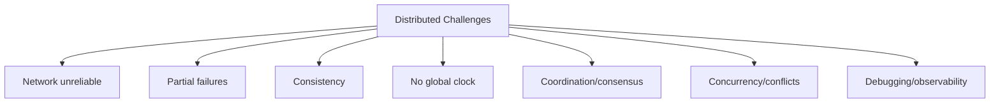
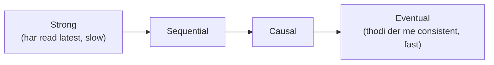
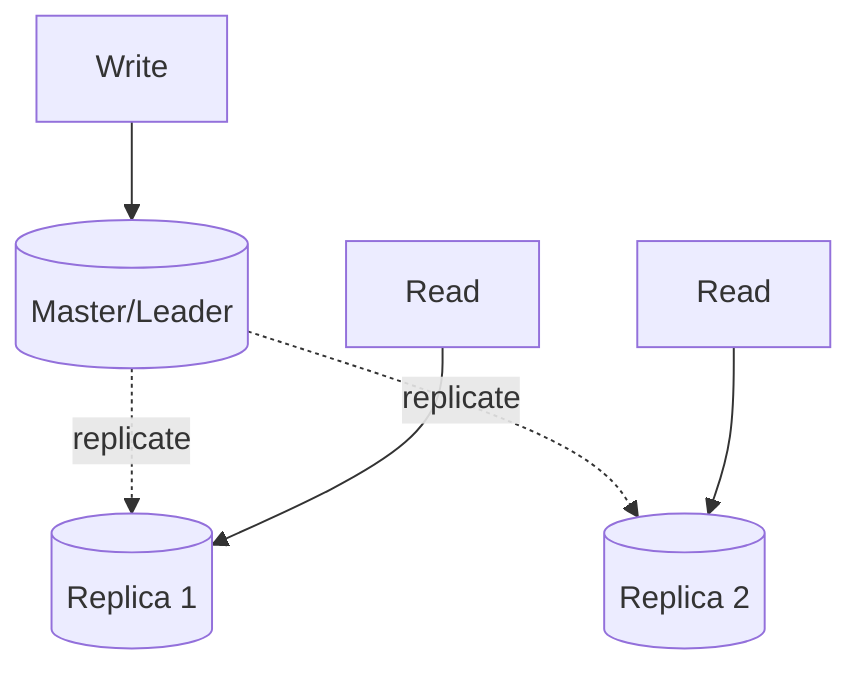
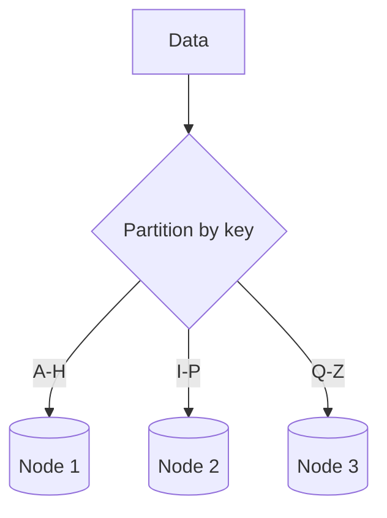
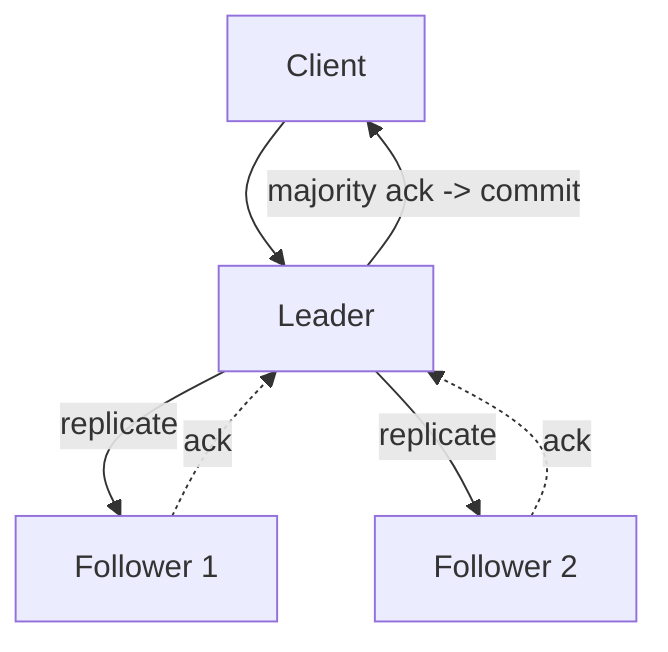
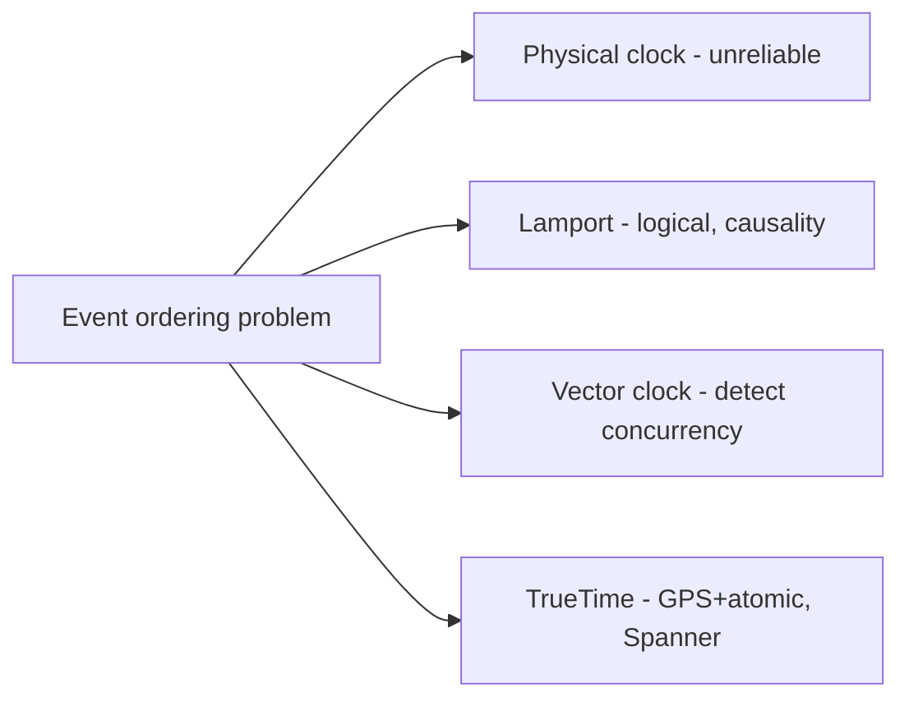

# 9. Introduction to Distributed Systems (Complete Deep Dive)

> Modern scale ka har system distributed hai — multiple machines mil ke ek system banate hain. Par
> distributed hone se naye problems aate hain (network failures, partial failures, consistency,
> coordination). Ye file distributed systems ke fundamentals, challenges, aur core concepts cover
> karti hai — jo baaki saare HLD topics (CAP, sharding, replication, consensus) ki neev hai.

---

## 📑 Is file me
1. [Distributed system kya hai](#-distributed-system-kya-hai)
2. [Kyun distributed (fayde)](#-kyun-distributed-systems)
3. [Challenges (kya mushkil hai)](#-distributed-systems-ke-challenges)
4. [Fallacies of distributed computing](#-fallacies-of-distributed-computing)
5. [Core concepts (consistency, availability, partition)](#-core-concepts)
6. [Replication & partitioning](#-replication--partitioning)
7. [Consensus & coordination](#-consensus--coordination)
8. [Failure handling](#-failure-handling)
9. [Time & ordering](#-time--ordering-in-distributed-systems)
10. [Interview Q&A](#-interview-qa)

---

## 🌐 Distributed system kya hai

Ek **distributed system** = **multiple independent computers (nodes)** jo network se connected
hain aur **ek single coherent system** ki tarah kaam karte hain. User ko lagta ek system hai,
andar multiple machines coordinate kar rahi hain.

**Examples:** Google Search (thousands of servers), Amazon (microservices), Cassandra (distributed
DB), Kafka (distributed log), blockchain, CDN, cloud (AWS/GCP) — sab distributed.

**Key characteristics:**
- **No shared memory** — nodes network se communicate (message passing).
- **No global clock** — har node ka apna clock (sync nahi).
- **Independent failures** — koi bhi node kabhi bhi fail ho sakta (baaki chalte rahein).
- **Concurrency** — nodes parallel kaam karte.

---

## 🎯 Kyun Distributed Systems

Ek machine kaafi kyun nahi?

1. **Scalability** — ek machine ki limit (CPU/RAM/disk). Millions of users/petabytes data ek
   machine handle nahi kar sakti → multiple machines (horizontal scaling).
2. **High Availability** — ek machine = SPOF. Multiple machines → ek mare, baaki serve (redundancy,
   no downtime).
3. **Fault tolerance** — hardware fail hota hi hai (at scale, daily). Distributed system failures
   ke bawajood chalta rahe.
4. **Low latency (geo-distribution)** — users worldwide → data unke paas (multiple regions) →
   fast.
5. **Cost** — commodity machines (cheap) vs ek super-expensive machine.

---

## ⚠️ Distributed Systems ke Challenges

Distributed hone se **naye, hard problems** aate hain (ek machine me ye problems hain hi nahi):

### 1. Network unreliability
Network fail hota — packets drop, delays, connections toot. Message bheja par pahuncha ya nahi —
pata nahi (ho sakta message pahuncha, ACK khoya).

### 2. Partial failures
Ek machine me: sab chalta ya sab crash (binary). Distributed me: **kuch nodes fail, kuch chalte**.
"Payment service down, par order service up" — is state ko handle karna mushkil.

### 3. Consistency
Data multiple nodes pe (copies/shards). Sab nodes same data dekhein — mushkil (network delay se
ek node updated, doosra purana). [Detail: `11_CAP_Theorem.md`]

### 4. No global clock
Nodes ka time sync nahi (clock drift). "Ye event pehle hua ya wo" — decide karna mushkil (ordering).

### 5. Coordination
Multiple nodes ek decision pe agree karein (leader kaun, commit karein ya nahi) — consensus mushkil
(network unreliable).

### 6. Concurrency
Multiple nodes same data update karein — race conditions, conflicts. Distributed locking mushkil.

### 7. Debugging & observability
Ek request 10 nodes se guzarti — kya slow hai, kya failed — distributed tracing chahiye.

---

## 🚫 Fallacies of Distributed Computing

8 galat assumptions jo engineers karte hain (aur bugs laate). L. Peter Deutsch (Sun):
1. **The network is reliable** — nahi, fail hota.
2. **Latency is zero** — nahi, network calls ms lete (chains me add).
3. **Bandwidth is infinite** — nahi, large data slow.
4. **The network is secure** — nahi, encrypt karo.
5. **Topology doesn't change** — nodes aate-jaate, IPs badalte.
6. **There is one administrator** — many teams/configs.
7. **Transport cost is zero** — serialization/network real cost.
8. **The network is homogeneous** — different nodes/protocols/versions.

> ⭐ Ye fallacies yaad rakhne se robust distributed systems bante — timeouts, retries, circuit
> breakers, idempotency, service discovery sab in fallacies ka jawab hain.

---

## 🧩 Core Concepts

### Consistency, Availability, Partition Tolerance
Distributed systems ke teen fundamental properties (CAP theorem ka base):
- **Consistency** — har read latest write dekhe (sab nodes same data).
- **Availability** — har request response paaye (system up).
- **Partition tolerance** — network partition (nodes ke beech communication toot) me bhi kaam kare.

Network partition inevitable hai (distributed system me), to **C ya A** choose karna padta. Poora:
[`11_CAP_Theorem.md`](./11_CAP_Theorem.md).

### Consistency models (spectrum)

- **Strong consistency** — har read latest write (jaise single machine). Coordination = slow.
- **Eventual consistency** — thodi der me sab nodes consistent (temporarily stale). Fast, available.
- **Causal, read-your-writes, monotonic reads** — beech ke models (specific guarantees).

### Idempotency
Distributed me messages duplicate ho sakte (retry, network). **Idempotent operation** = same
operation kai baar = same result (side-effect ek hi baar). Isliye retries safe. (Idempotency key +
dedup store.)

---

## 🔁 Replication & Partitioning

Distributed data ke do fundamental techniques:

### Replication (copies)
Data ki multiple copies (nodes pe). Fault tolerance + read scaling.

- **Single-leader** — leader writes, replicas reads. Simple.
- **Multi-leader** — multiple leaders (write conflicts → resolution).
- **Leaderless** — koi bhi node write (quorum). Cassandra/Dynamo.
- **Sync vs async** — sync (consistent, slow) vs async (fast, replication lag → stale reads).

### Partitioning (sharding — splitting)
Data ko subsets me todo, alag nodes pe. Scale (data + writes).

[Full detail: `21_Database_Sharding.md`]

> **Replication + Partitioning saath:** har shard ki replicas (scale + HA dono).

---

## 🤝 Consensus & Coordination

Multiple nodes ek value pe **agree** karein (leader election, commit order, config) — network
unreliable, nodes fail. Ye distributed systems ka hardest problem.

- **FLP impossibility** — async network me guaranteed consensus impossible (theoretically). Par
  practically timeouts se solve.
- **Consensus algorithms:**
  - **Paxos** — classic, correct par samajhna mushkil.
  - **Raft** — leader-based, understandable. Leader election + log replication + safety. (etcd,
    Consul use karte.)
  - **ZAB** — ZooKeeper ka protocol.
- **Quorum** — majority (N/2 + 1) agree karein → decision. Isliye odd node counts (3, 5).

**Coordination services:** ZooKeeper, etcd, Consul — leader election, distributed locks, config,
service discovery.

---

## 💥 Failure Handling

Distributed system = failures normal (design for it):

### Failure detection
- **Heartbeats** — nodes periodically "alive" signal. Miss → suspected dead → failover.
- ⚠ Network partition me "dead" galat ho sakta (node alive, network toota) → **split-brain**.

### Handling techniques
- **Redundancy** — replicas (no SPOF).
- **Timeouts** — hang na ho (bounded wait).
- **Retries + backoff** — transient failures (exponential backoff + jitter).
- **Circuit breaker** — repeated failure → fail fast (cascading failure roke).
- **Graceful degradation** — feature down → baaki chale.
- **Bulkhead** — resource isolation.

### Split-brain
Network partition → cluster do halves me → dono apna leader elect kar lein → conflicting writes.
**Fix:** quorum (majority side hi active), fencing tokens.

---

## ⏰ Time & Ordering in Distributed Systems

No global clock → events ka order decide karna mushkil.
- **Physical clocks** — unreliable (drift, NTP sync imperfect). Event ordering galat ho sakta.
- **Lamport timestamps** — logical counter (causality — "happened before" relation).
- **Vector clocks** — per-node counters (concurrent vs causal events detect). Dynamo use karta.
- **Google TrueTime** — GPS + atomic clocks, bounded uncertainty (Spanner — globally consistent).

---

## 🏛️ Distributed system building blocks (recap of related topics)
| Concept | Kahan detail |
|---|---|
| CAP theorem | `11_CAP_Theorem.md` |
| Sharding | `21_Database_Sharding.md` |
| Consistent hashing | `19_Consistent_Hashing.md` |
| Message queues | `18_Message_Queues...` |
| Avoid SPOF | `17_Avoid_Single_Point_of_Failure.md` |
| Caching | `08_Caching...` |
| Consensus (Raft) + more | `HLD_Interview.md` PART II |

---

## 💬 Interview Q&A

**Q: Distributed system kya hai, kyun?**
Multiple nodes network se connected, ek system ki tarah. Kyun: scalability (beyond one machine),
HA (no SPOF), fault tolerance, geo-latency, cost (commodity).

**Q: Distributed systems ke main challenges?**
Network unreliability, partial failures, consistency (multiple copies), no global clock (ordering),
coordination/consensus, concurrency/conflicts, debugging.

**Q: Fallacies of distributed computing?**
8 galat assumptions: network reliable, zero latency, infinite bandwidth, secure network, stable
topology, one admin, zero transport cost, homogeneous. Robust systems in fallacies ka jawab dete.

**Q: Strong vs eventual consistency?**
Strong = har read latest (slow, coordination). Eventual = thodi der me consistent (fast, available).
CAP se juda — partition me C ya A.

**Q: Consensus kya, kaise?**
Nodes ek value pe agree (leader/commit). Raft (leader-based, understandable), Paxos. Quorum
(majority). etcd/ZooKeeper.

**Q: Split-brain kya?**
Network partition → cluster do halves → dono leader elect → conflicting writes. Fix: quorum
(majority active), fencing.

**Q: Replication vs partitioning?**
Replication = copies (fault tolerance + read scaling). Partitioning (sharding) = split data
(scale writes + storage). Dono saath (replicated shards).

**Q: Failure ko kaise handle karoge?**
Redundancy, timeouts, retries+backoff, circuit breakers, graceful degradation, heartbeats
(detection), quorum (split-brain).

---

## 📝 Summary
- **Distributed system** = multiple nodes, ek system. Kyun: scale, HA, fault tolerance, geo, cost.
- **Challenges:** network unreliable, partial failures, consistency, no global clock, consensus,
  concurrency, debugging.
- **Fallacies** — 8 wrong assumptions (network reliable, zero latency...) — robustness ka base.
- **Replication** (copies) + **partitioning** (sharding) = data distribution.
- **Consensus** (Raft/Paxos, quorum) = agreement. **Split-brain** — quorum se fix.
- **Time/ordering** — Lamport/vector clocks, TrueTime.
- Design for failure — redundancy, timeouts, retries, circuit breakers.
