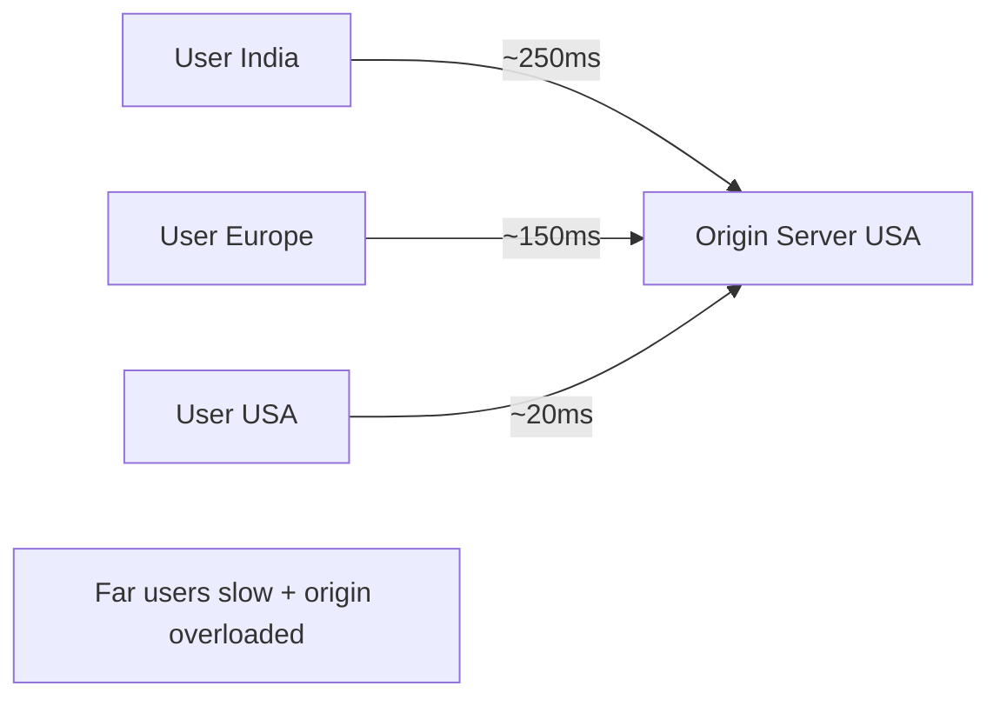
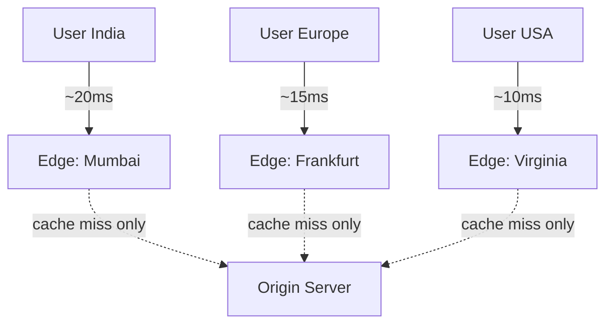
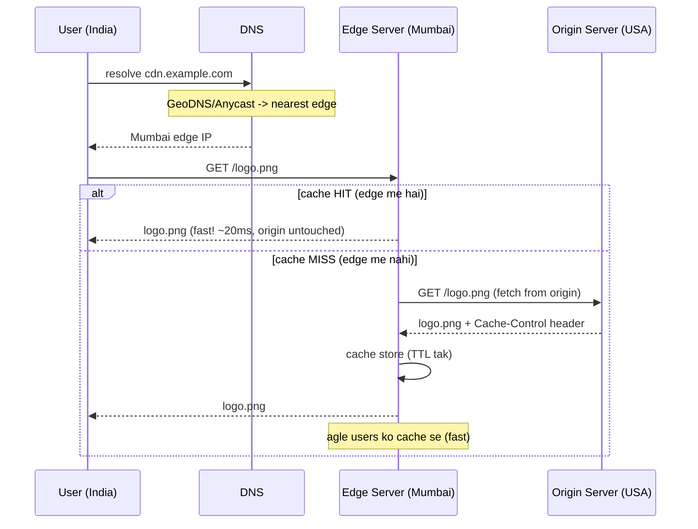
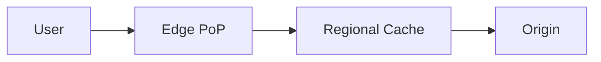
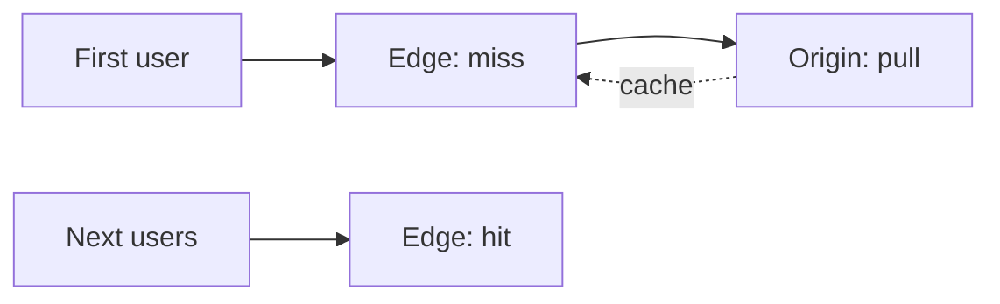
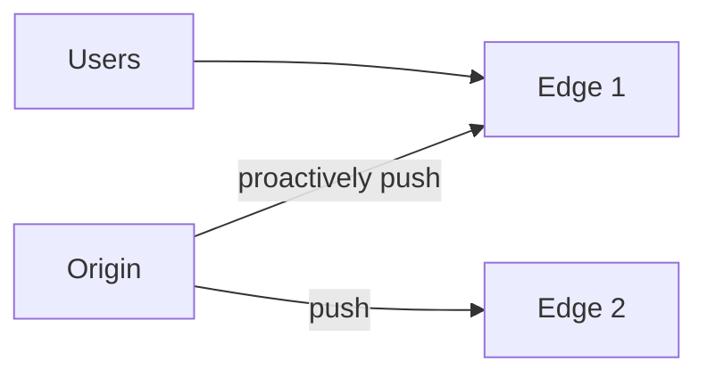
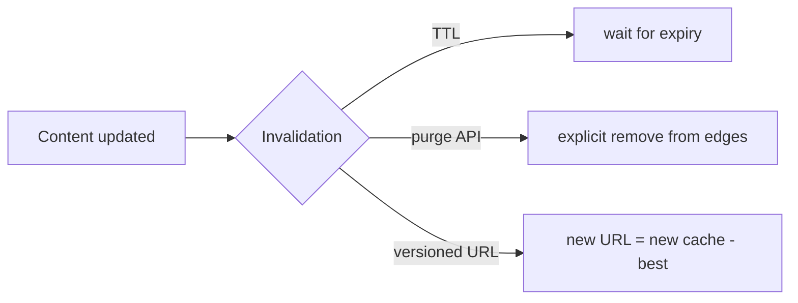
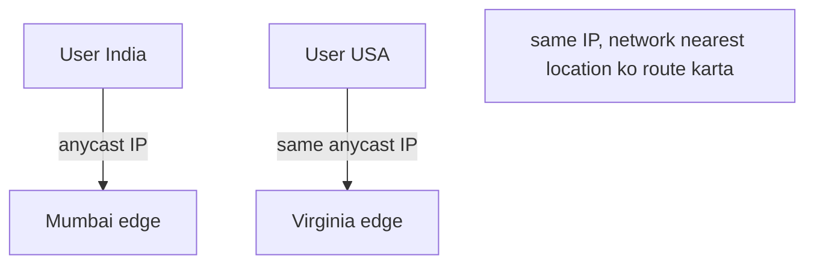

# 10. Content Delivery Network (CDN) — Complete Deep Dive

> "CDN kaise kaam karta hai?" — is file me poora, zero se. CDN = geographically distributed servers
> jo content ko **users ke paas** cache karke serve karte hain — latency kam, origin load kam,
> availability zyada. Har high-traffic website CDN use karti (Netflix, YouTube, Amazon).

---

## 📑 Is file me
1. [CDN kya hai + problem jo solve karta](#-cdn-kya-hai)
2. [CDN kaise kaam karta (step by step)](#-cdn-kaise-kaam-karta-)
3. [Push vs Pull CDN](#-push-vs-pull-cdn)
4. [Kaunsi content CDN pe](#-kaunsi-content-cdn-pe-jaati)
5. [Cache invalidation in CDN](#-cache-invalidation-in-cdn)
6. [CDN benefits](#-cdn-ke-fayde)
7. [Anycast & routing](#-anycast--routing-user-nearest-edge-kaise)
8. [CDN as reverse proxy + security](#-cdn--edge-security)
9. [Interview Q&A](#-interview-qa)

---

## 🎯 CDN kya hai

### Problem
Tumhara origin server ek jagah hai (e.g. USA). India ka user image maangta → request USA jaati,
image USA se aati → **~200-300ms latency** (cross-continent round trip). Aur agar 1 million users
same image maangein → **origin overwhelmed** (bandwidth + load).

### Solution — CDN
**Content ko globally distributed "edge servers" pe cache karo** — user ko **nearest edge** se
milta (kilometers, milliseconds away — not continents).

**CDN** = **Content Delivery Network** = geographically distributed network of proxy/cache servers
("**Points of Presence / PoP**" ya "**edge servers**") jo content ko end-users ke paas cache
karke serve karte hain. Examples: **Cloudflare, Akamai, AWS CloudFront, Fastly, Google Cloud CDN**.

---

## ⚙️ CDN kaise kaam karta (step by step)

### Basic flow

**Step by step:**
1. **DNS resolution** — user `cdn.example.com` resolve karta. CDN ka DNS (GeoDNS/Anycast) user ki
   location dekh ke **nearest edge server** ka IP return karta.
2. **Request to edge** — user request nearest edge ko bhejta (not origin).
3. **Cache check** — edge apna cache check karta:
   - **HIT** — content edge me hai → seedha serve (fast, origin ko touch nahi kiya).
   - **MISS** — content nahi hai → edge origin se fetch karta, cache me store (TTL ke hisaab se),
     phir user ko serve. Agle users ko cache se (fast).
4. **TTL expiry** — cached content TTL (Cache-Control header) tak valid. Expire hone pe re-fetch.

> ⭐ **Key insight:** first user (miss) ko thoda slow (edge → origin), par baaki saare users (hit)
> ko super fast. Aur origin sirf misses handle karta (95%+ traffic edge se) → origin load minimal.

### Multi-tier caching (advanced)
Bade CDN me hierarchy: **edge (many, user ke paas) → regional/shield (fewer) → origin**. Edge miss
→ regional check → origin. Isse origin aur bhi protected (origin shielding).

---

## 🔄 Push vs Pull CDN

Content edge tak kaise pahunchta — do models:

### Pull CDN (most common)
Content **on-demand** pull hota. First request pe edge origin se fetch karta + cache. TTL expiry pe
re-fetch.

- ✅ Kam maintenance (automatic), sirf requested content cache (storage efficient).
- ❌ First request slow (miss), TTL expiry pe re-fetch (traffic to origin).
- **Use:** most websites (dynamic content, large catalogs — sab pre-push impractical).

### Push CDN
Content **pehle se** edge servers pe push kiya jaata (tum upload karte). No first-request miss.

- ✅ No first-request miss (content already there), origin control.
- ❌ Manual management (kya push karna), storage (sab edges pe — even unused content).
- **Use:** large static files (videos, software downloads, game assets) jo predictably popular.

| | Pull CDN | Push CDN |
|---|---|---|
| Content upload | on-demand (lazy) | pre-uploaded (eager) |
| First request | miss (slow) | hit (fast) |
| Storage | efficient (only requested) | more (all pushed) |
| Maintenance | automatic | manual |
| Use | dynamic sites, large catalogs | large static (video, downloads) |

---

## 📦 Kaunsi content CDN pe jaati

### Static content (ideal for CDN)
- Images, videos, audio
- CSS, JavaScript files
- Fonts
- Downloads (PDFs, software, game assets)
- HTML (static pages)

Ye content **rarely changes** aur **same for all users** → perfect for caching.

### Dynamic content (tricky)
- Personalized data (user dashboard, cart) — har user alag → cache nahi hoti easily.
- Real-time data (stock prices, live scores).

**Dynamic content CDN kaise?**
- **Dynamic Content Acceleration (DCA)** — CDN dynamic requests ko optimized route se origin tak
  (faster network path, connection reuse), even if not cached.
- **Edge computing** — CDN edge pe compute (Cloudflare Workers, Lambda@Edge) — personalization
  edge pe (origin round trip kam).
- **Micro-caching** — dynamic content ko short TTL (1-5 sec) cache — high-traffic pe bhi origin
  load kam (5 sec me 10000 requests → 1 origin hit).

---

## ♻️ Cache Invalidation in CDN

Content update hua (naya logo) — CDN edges pe purana cached. Fresh serve karne ke tareeke:

1. **TTL expiry** — natural (Cache-Control max-age). Simple, par thodi der stale.
2. **Purge / Invalidation** — CDN ko explicitly bolo "ye content invalidate karo" (API call). Edges
   se remove → next request re-fetch. (Fast but CDN-wide propagation me time.)
3. **Cache busting / versioned URLs** — file naam me version/hash (`logo.v2.png` ya
   `logo.png?v=abc123`). Naya URL = naya cache entry (purana naturally expire). **Most reliable.**

> ⭐ **Best practice:** static assets ko **versioned/hashed filenames** (webpack/build tools ye
> karte) + long TTL. Content change = naya filename = automatic fresh (no purge needed).

---

## ✅ CDN ke fayde

1. **Latency kam** — content user ke paas (edge) — 250ms → 20ms. Faster page loads, better UX/SEO.
2. **Origin load kam** — 95%+ traffic edge se (cache hits) → origin sirf misses. Origin scale nahi
   karna padta.
3. **Bandwidth cost kam** — origin bandwidth (expensive) bachta (edge serves). CDN bandwidth cheaper.
4. **High availability** — origin down bhi ho to cached content edge se serve (partial availability).
   Aur edges redundant.
5. **DDoS protection** — traffic edges pe absorb (distributed), origin hidden + protected.
6. **Scalability** — traffic spikes edges handle (global capacity).
7. **Security** — SSL/TLS at edge, WAF, bot mitigation.

---

## 🧭 Anycast & Routing (user nearest edge kaise)

CDN user ko nearest edge kaise bhejta:
- **GeoDNS** — DNS user ki location dekh ke nearest edge ka IP return karta.
- **Anycast** — **same IP** multiple edge locations pe advertise (BGP). Network automatically user
  ko **nearest (fewest hops)** edge tak route karta. Ek IP, many locations.

- **Health-aware** — edge down → traffic doosre nearby edge ko (failover).

---

## 🛡️ CDN = Edge Security

CDN essentially **globally distributed reverse proxy** hai origin ke saamne:
- **Origin hiding** — clients ko sirf CDN dikhta, origin IP hidden (direct attack nahi).
- **DDoS absorption** — massive traffic edges pe distributed (origin bacha).
- **WAF** — malicious requests (SQLi, XSS) edge pe block.
- **SSL/TLS** — HTTPS termination at edge, cert management.
- **Bot mitigation** — bad bots block.

[Reverse proxy detail: `04_Proxy_and_Reverse_Proxy.md`]

---

## 🌍 Real-world
- **Netflix Open Connect** — Netflix ka apna CDN (ISPs me edge servers) — video seedha nearby edge
  se (bandwidth save, quality up).
- **Cloudflare** — CDN + DDoS + WAF + edge compute (Workers).
- **YouTube** — Google's global CDN — videos edge se, adaptive bitrate.
- **Amazon CloudFront** — AWS managed CDN.

---

## 💬 Interview Q&A

**Q: CDN kya hai aur kaise kaam karta?**
Geographically distributed edge servers jo content cache karke users ke paas serve karte. User →
nearest edge (GeoDNS/Anycast) → cache hit (fast) ya miss (origin fetch + cache). Origin load +
latency kam.

**Q: Push vs Pull CDN?**
Pull = on-demand (first request miss, then cached — most common). Push = pre-uploaded (no first
miss, manual — large static files).

**Q: CDN cache invalidation kaise?**
TTL expiry, explicit purge (API), versioned URLs (best — new filename = fresh, no purge).

**Q: Dynamic content CDN pe kaise?**
Micro-caching (short TTL), dynamic acceleration (optimized routing), edge computing (personalize at
edge). Purely personalized data usually not cached.

**Q: CDN benefits?**
Latency kam (edge near user), origin load kam (95% cache hits), bandwidth cost kam, HA, DDoS
protection, scalability.

**Q: User nearest edge kaise pahunchta?**
GeoDNS (location-based DNS response) ya Anycast (same IP, BGP routes to nearest). Health-aware
failover.

**Q: CDN aur origin ka relationship?**
CDN edge = reverse proxy cache origin ke saamne. Cache miss pe edge origin se fetch. Origin hidden
+ protected. Origin sirf uncached/misses handle karta.

---

## 📝 Summary
- **CDN** = globally distributed edge servers cache content near users.
- **Kaise:** user → GeoDNS/Anycast → nearest edge → cache HIT (fast) ya MISS (origin fetch + cache).
- **Push** (pre-upload, large static) vs **Pull** (on-demand, common).
- **Static content ideal**; dynamic via micro-caching/edge compute.
- **Invalidation:** TTL, purge, versioned URLs (best).
- **Benefits:** latency, origin offload, bandwidth cost, HA, DDoS protection, security (reverse
  proxy at edge).
