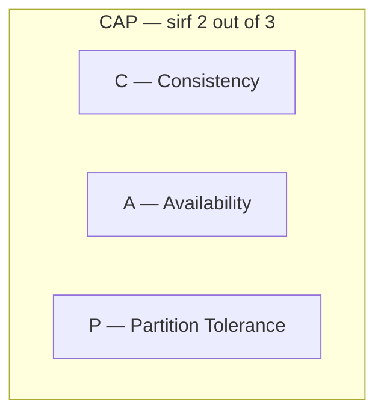
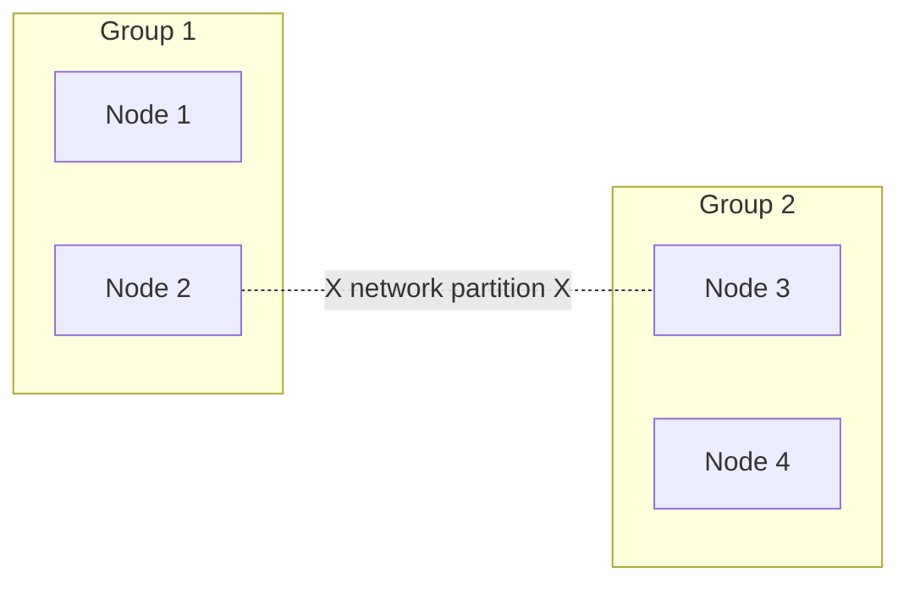
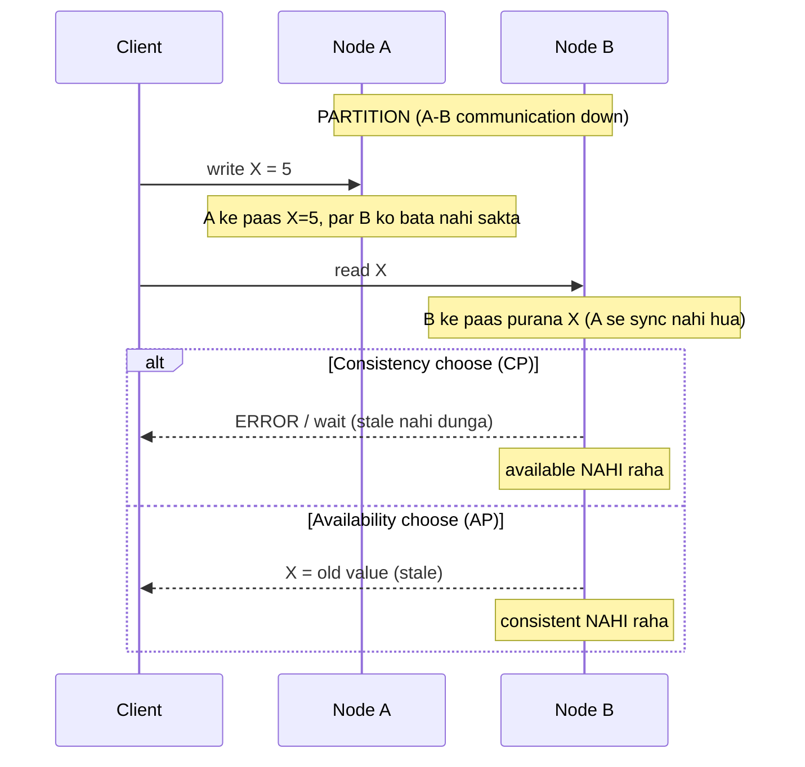
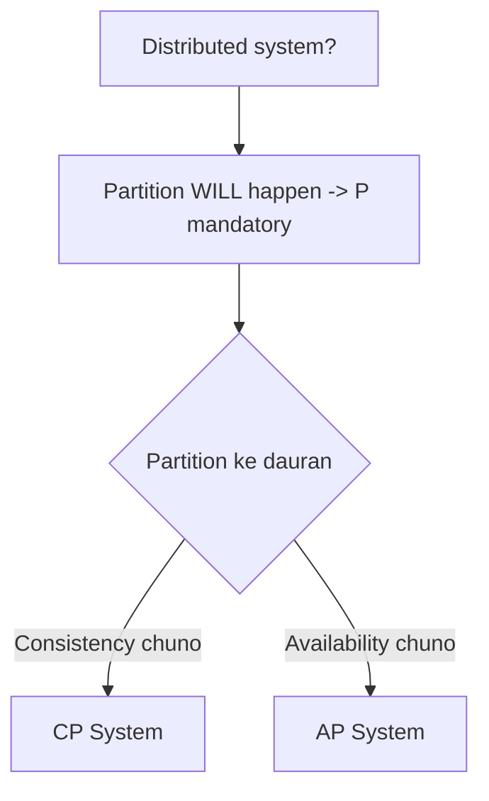
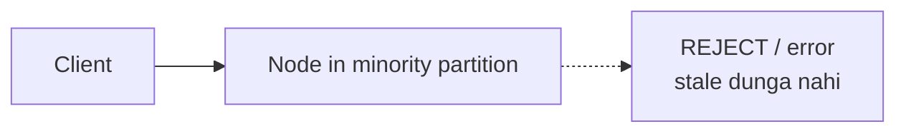
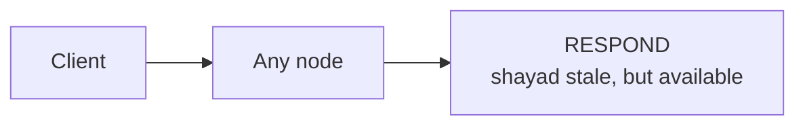
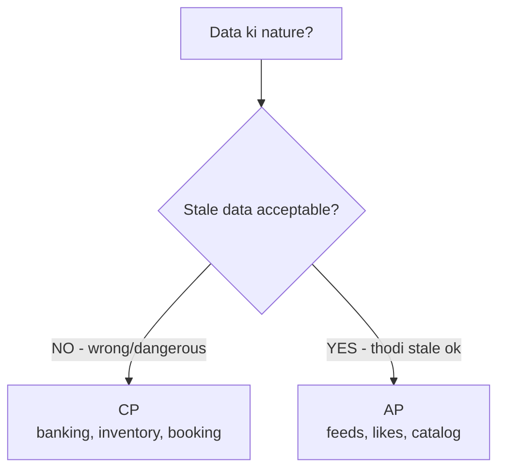
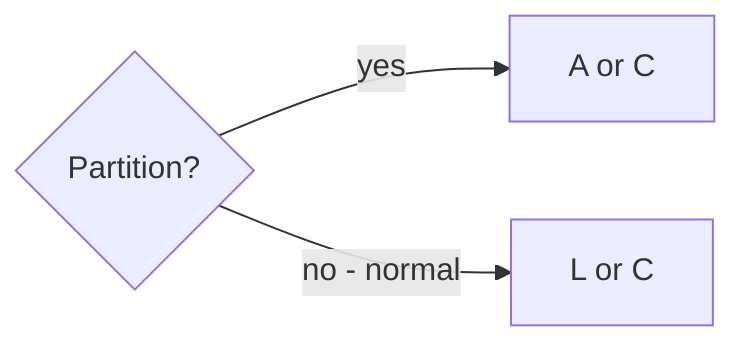
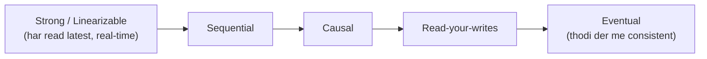

# 11. CAP Theorem — Complete Deep Dive

> CAP theorem distributed systems ka **sabse zyada poochha jaane wala** concept hai. Ye batata hai
> ki ek distributed system **teeno guarantees ek saath nahi de sakta** — sirf 2 out of 3. Is file
> me: CAP ka matlab, kyun 2/3, CP vs AP examples, PACELC extension, aur consistency models.

---

## 📑 Is file me
1. [CAP ka matlab (C, A, P)](#-cap-ka-matlab)
2. [Kyun sirf 2 out of 3](#-kyun-sirf-2-out-of-3)
3. [Partition tolerance zaroori kyun](#-partition-tolerance-zaroori-kyun)
4. [CP vs AP (deep + examples)](#-cp-vs-ap-systems)
5. [Kaunsa kab choose](#-kaunsa-choose-kab)
6. [PACELC (CAP extension)](#-pacelc--cap-ka-extension)
7. [Consistency models spectrum](#-consistency-models)
8. [Interview Q&A](#-interview-qa)

---

## 🎯 CAP ka matlab

CAP theorem (Eric Brewer, 2000) kehta hai: ek **distributed data store** ek saath **teeno**
guarantees nahi de sakta:

### C — Consistency
Har **read** sabse **latest write** dekhe (ya error). Saare nodes **same data** dekhein at any
given time. Yaani distributed system "ek single up-to-date copy" jaisa behave kare.
> **Note:** CAP ki "consistency" = **linearizability** (strong consistency), ACID ki "C" se alag.

### A — Availability
Har **request** (kisi bhi non-failing node ko) ek **response** paaye (success ya failure — par
timeout/hang nahi). System hamesha respond kare, chahe latest data na ho.

### P — Partition Tolerance
System **network partition** ke bawajood kaam karta rahe. Partition = nodes ke beech
**communication toot jaana** (network failure, messages drop/delay). Cluster do (ya zyada) isolated
groups me bat jaata jo ek doosre se baat nahi kar sakte.

---

## ⚖️ Kyun sirf 2 out of 3

Socho ek network partition ho gaya (Node A aur Node B ke beech communication toota). Ek client
Node A ko write karta hai:

Partition ke dauran, jab A aur B baat nahi kar sakte:
- Agar **B latest data guarantee** kare (Consistency) → B ko error/wait karna padega (kyunki wo
  A ka update nahi jaanta) → **Availability sacrifice**.
- Agar **B respond** kare (Availability) → wo purana (stale) data dega (A ka naya update nahi
  jaanta) → **Consistency sacrifice**.

**Isliye partition ke dauran C aur A dono nahi mil sakte** — ek choose karna padta.

---

## 🔑 Partition Tolerance zaroori kyun

Distributed system me **network partition inevitable hai** — networks fail hote hain (cable cut,
switch fail, datacenter isolation, packet loss). Ye "if" nahi "when" hai.

Isliye **P negotiable nahi** — distributed system me P **chahiye hi**. To real choice hai:
**partition hone par C ya A?**

> ⭐ **"CA system" theoretical hai** — single-node systems (jaha partition ho hi nahi sakta —
> ek node). Distributed me CA possible nahi (partition hoga → C ya A chuno). Isliye CAP asal me
> **"partition hone par CP ya AP"** hai.

---

## 🅲🅿 vs 🅰🅿 Systems

### CP Systems (Consistency + Partition tolerance)
Partition ke dauran **consistency prioritize** — kuch requests **reject/wait** (stale data nahi
dete). "Sahi data ya koi data nahi."

- **Behavior:** partition me minority side unavailable ho jaata (majority quorum hi serve karta) —
  consistency guaranteed, par kuch downtime.
- **Examples:** MongoDB, HBase, Redis (single master), Zookeeper, etcd, traditional RDBMS (in
  distributed setup), Google Spanner.
- **Use:** banking, inventory, booking, payments — **jaha stale data = wrong/dangerous**.

### AP Systems (Availability + Partition tolerance)
Partition ke dauran **availability prioritize** — har node respond karta (shayad stale). "Kuch data
milega, latest ho ya na ho."

- **Behavior:** saare nodes available rehte, partition heal hone pe data sync (eventual
  consistency). Conflicts resolve karne padte.
- **Examples:** Cassandra, DynamoDB, CouchDB, Riak, DNS.
- **Use:** social feeds, likes/view counts, product catalogs, analytics — **jaha thodi stale data
  acceptable** (availability > freshness).

### CP vs AP comparison
| | CP | AP |
|---|---|---|
| Partition me | consistency > availability | availability > consistency |
| Stale data | never (reject/wait) | possible (eventual sync) |
| Downtime | some (minority unavailable) | none |
| Examples | MongoDB, HBase, Spanner, etcd | Cassandra, DynamoDB, DNS |
| Use | banking, booking, inventory | feeds, likes, catalog, analytics |

---

## 🎯 Kaunsa choose kab

**Examples se decide:**
- **Bank balance** — stale = galat (double spend) → **CP**. Better "temporarily unavailable" than "wrong balance."
- **Booking a seat** — stale = double booking → **CP**.
- **Instagram likes count** — thodi stale (999 vs 1001) chalega → **AP** (always available zyada important).
- **Social feed** — thodi purani posts chalengi → **AP**.
- **Shopping cart** — usually **AP** (availability, merge conflicts).
- **DNS** — **AP** (always resolve, eventual propagation).

> ⭐ **Ek system me alag components alag choice** — same app me user profile (AP) aur payment (CP)
> ho sakte. Per-use-case decide.

---

## 🔄 PACELC — CAP ka extension

CAP sirf **partition ke dauran** batata. Par normal operation me bhi trade-off hai. **PACELC**
(Daniel Abadi):

> **If Partition (P) → choose Availability (A) or Consistency (C);**
> **Else (E, normal operation) → choose Latency (L) or Consistency (C).**

Yaani normal (no partition) me bhi:
- **Strong consistency** = coordination = higher **latency** (nodes ko sync karna padta).
- **Low latency** = async/local reads = weaker consistency.

**PACELC classifications:**
| System | PACELC |
|---|---|
| DynamoDB, Cassandra | PA/EL (availability + low latency) |
| MongoDB | PA/EC (available in partition, consistent normally) |
| Spanner | PC/EC (consistency both — TrueTime se) |
| PostgreSQL (single) | PC/EC |

> PACELC realistic hai — normal operation me bhi latency vs consistency decide karna padta.

---

## 📊 Consistency Models (spectrum)

CAP binary lagta (C ya not-C), par consistency ek **spectrum** hai:

| Model | Guarantee |
|---|---|
| **Strong (Linearizable)** | har read sabse latest write (single-copy illusion) |
| **Sequential** | ek global order, par real-time nahi |
| **Causal** | causally-related events order me (concurrent koi bhi order) |
| **Read-your-writes** | apni likhi cheez turant dikhe |
| **Monotonic reads** | ek baar naya dekha to purana nahi |
| **Eventual** | thodi der me sab consistent (weakest) |

**Tunable consistency (quorum):** `W + R > N` → strong consistency (N=replicas, W=write acks,
R=read acks). Cassandra/DynamoDB me per-query tune (fast eventual ya slow strong).

---

## 💬 Interview Q&A

**Q: CAP theorem kya hai?**
Distributed system Consistency, Availability, Partition tolerance — sirf 2/3 de sakta. Partition
inevitable (P mandatory) → partition ke dauran C ya A choose.

**Q: Consistency aur Availability dono kyun nahi (partition me)?**
Partition me nodes baat nahi kar sakte. Ek node latest guarantee kare (C) → error/wait
(availability lost). Respond kare (A) → stale (consistency lost). Isliye ek choose.

**Q: CA system possible hai?**
Distributed me nahi (partition hoga → C ya A). CA sirf single-node (no partition). CAP asal me
"partition me CP ya AP."

**Q: CP vs AP example?**
CP — banking (stale = wrong, reject better) → MongoDB/Spanner. AP — social feed/likes (stale ok,
always available) → Cassandra/DynamoDB.

**Q: Banking system CP ya AP?**
CP — consistency critical (double spend, wrong balance unacceptable). "Temporarily unavailable"
better than "wrong data."

**Q: PACELC kya hai?**
CAP extension — partition me A ya C, **else (normal) latency ya consistency**. Realistic — normal
operation me bhi strong consistency = higher latency.

**Q: Eventual consistency kaha acceptable?**
Likes/view counts, social feeds, DNS, product catalog, analytics — thodi stale chalega, availability
zyada important.

**Q: Same system me CP aur AP dono?**
Haan — per-use-case. Payment component CP, user profile/feed AP. Design decision per data type.

---

## 📝 Summary
- **CAP** = Consistency, Availability, Partition tolerance — sirf **2 out of 3**.
- **Partition inevitable** (distributed) → P mandatory → **partition me C ya A choose**.
- **CP** = consistency (reject stale) — banking, booking, inventory (MongoDB, Spanner).
- **AP** = availability (respond, eventual) — feeds, likes, catalog (Cassandra, DynamoDB).
- **CA** = single-node only (no partition possible).
- **PACELC** = partition me A/C, else latency/consistency (realistic extension).
- **Consistency spectrum** — strong → causal → eventual (tunable via quorum).
- Choose per use-case (payment CP, profile AP in same app).
