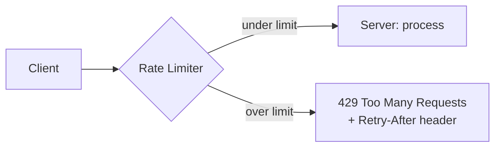
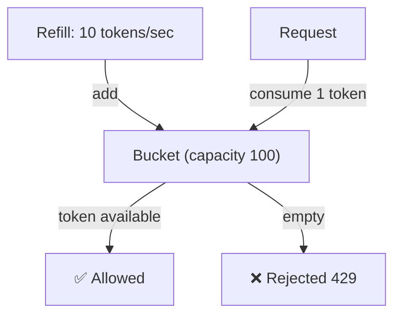
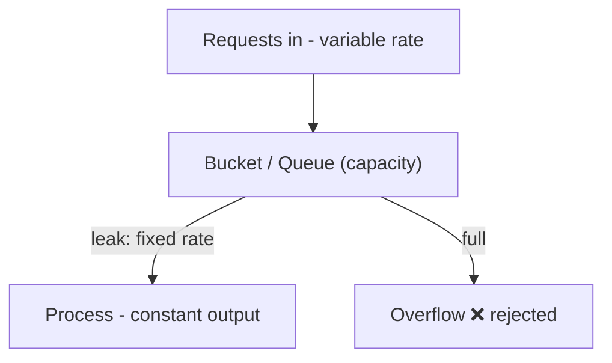
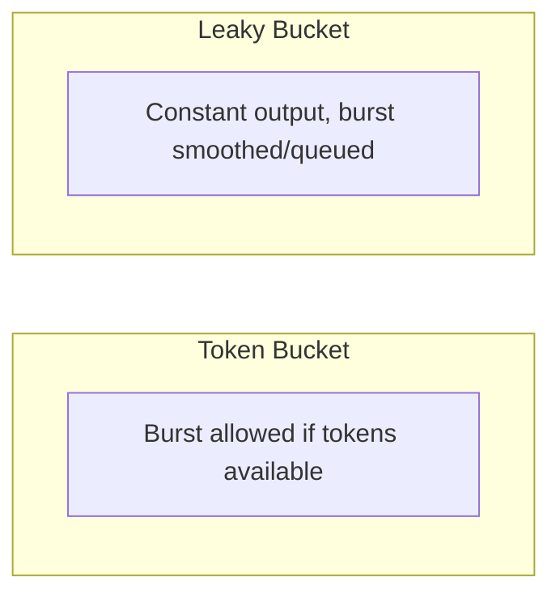
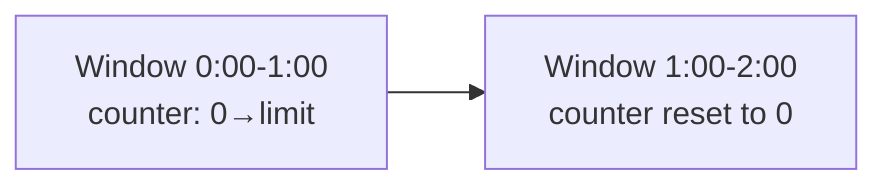
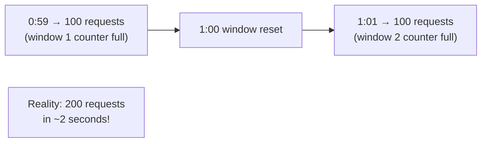
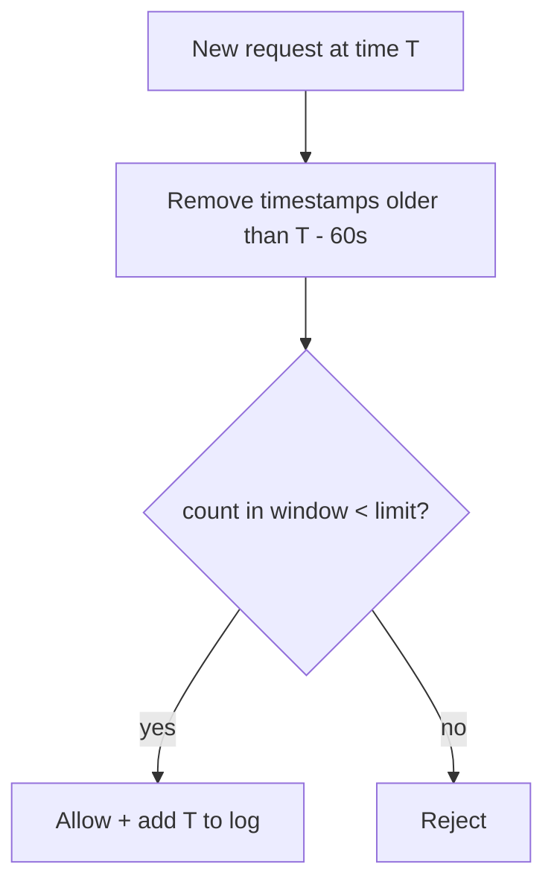
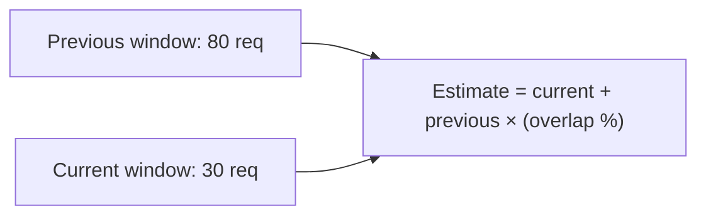
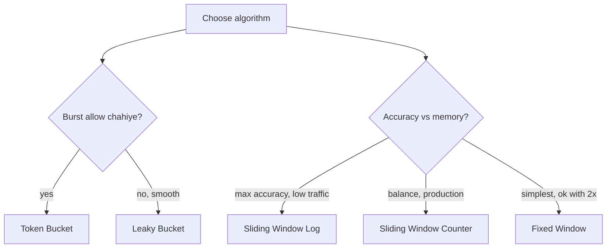

# 12. Rate Limiting and its Algorithms (Complete Deep Dive)

> Rate limiting = ek client/user/IP kitni requests ek time window me kar sakta uspe **limit**
> lagana. Excess reject (429). Ye API abuse, DDoS, brute-force, aur resource exhaustion se bachata.
> Is file me: rate limiting kyun, aur **5 core algorithms** detail me (har ek ka working, pros,
> cons, code idea). Part-2 (distributed) aur strategies alag files me.

---

## 📑 Is file me
1. [Rate limiting kyun](#-rate-limiting-kyun)
2. [Algorithm 1: Token Bucket](#-1-token-bucket)
3. [Algorithm 2: Leaky Bucket](#-2-leaky-bucket)
4. [Algorithm 3: Fixed Window Counter](#-3-fixed-window-counter)
5. [Algorithm 4: Sliding Window Log](#-4-sliding-window-log)
6. [Algorithm 5: Sliding Window Counter](#-5-sliding-window-counter)
7. [Algorithm comparison](#-algorithm-comparison)
8. [Interview Q&A](#-interview-qa)

---

## 🎯 Rate Limiting kyun

Bina rate limiting ke, ek client (ya attacker) unlimited requests bhej sakta:
- **DDoS / DoS** — server ko requests se flood karke down karna.
- **Brute force** — password/OTP guessing (millions of attempts).
- **API abuse** — scraping, resource hogging (ek user saara compute kha jaaye).
- **Cost** — cloud/API costs (per-request billing) balloon.
- **Fairness** — ek user dusron ka experience kharab na kare.

**Rate limiting** in sab se bachata — "har user X requests/minute, phir 429 (Too Many Requests)."



**Kahan lagta:** API gateway, load balancer, reverse proxy, ya application middleware.
[Where/strategies: `15_Rate_Limiting_Strategies.md`]

---

## 🪣 1. Token Bucket

### Concept
Ek "bucket" me **tokens** hain. Har request **ek token** consume karti. Tokens **fixed rate** se
refill hote (e.g. 10 tokens/sec). Bucket ki ek **capacity** (max tokens). Token available →
request allowed; nahi → rejected.



### Kaise kaam karta
- Bucket start me full (capacity tokens).
- Har request 1 token leti (available ho to).
- Background me tokens refill rate se add hote (capacity tak — overflow discard).
- Bucket empty → requests rejected jab tak refill na ho.

### Code idea
```
class TokenBucket:
    tokens, capacity, refillRate, lastRefill

    allow():
        refill()                        # time ke hisaab se tokens add
        if tokens >= 1:
            tokens -= 1
            return ALLOWED
        return REJECTED

    refill():
        now = current_time()
        tokens = min(capacity, tokens + (now - lastRefill) * refillRate)
        lastRefill = now
```

### Properties
- ✅ **Burst allow karta** — bucket full ho to sudden burst (up to capacity) handle. Real traffic
  bursty hoti — ye natural.
- ✅ Memory efficient (per client sirf: tokens + timestamp).
- ✅ Smooth long-term rate.
- ❌ Burst size = capacity (agar controlled burst chahiye to tune).
- **Use:** most common — API rate limiting (AWS, Stripe use karte).

---

## 💧 2. Leaky Bucket

### Concept
Ek bucket me requests (paani) aati hain, aur bucket ke bottom se **fixed rate** se "leak"
(process) hoti hain. Bucket full ho to naye requests **overflow** (rejected). Output **constant
rate** — smooth.



### Kaise kaam karta
- Requests ek **queue** (bucket) me aati hain.
- Queue se **fixed rate** se process hoti (leak).
- Queue full → naye requests dropped.

### Token Bucket vs Leaky Bucket (key difference)
- **Token bucket** — **burst allow** karta (bucket me tokens jama ho to sudden burst OK).
- **Leaky bucket** — **smooth constant output** (no burst — sab requests fixed rate se process,
  extra queue me wait ya drop).



### Properties
- ✅ **Smooth, constant output** — downstream ko steady load (spikes absorb).
- ✅ Memory efficient (queue size + rate).
- ❌ Burst nahi allow karta (legitimate burst bhi delayed/dropped).
- ❌ Queue full → requests wait (latency) ya drop.
- **Use:** jaha downstream ko constant rate chahiye (traffic shaping, network).

---

## 🪟 3. Fixed Window Counter

### Concept
Time ko **fixed windows** me baato (e.g. har 1 minute: 0:00-1:00, 1:00-2:00). Har window me ek
**counter**. Request aane pe counter++. Limit cross → reject. Naya window → counter reset.



### Code idea
```
allow(userId):
    window = current_minute()
    key = userId + ":" + window
    count = increment(key)
    if count == 1: set_expiry(key, 60s)
    return count <= limit
```

### Properties
- ✅ Simple, memory efficient (per client: counter + window).
- ✅ Easy to implement (Redis INCR + EXPIRE).
- ❌ **Boundary problem (BIG issue)** — window boundary pe **2x burst** possible!

### Boundary problem explained
Limit = 100/min. User 100 requests **0:59** pe karta, phir 100 requests **1:01** pe (naya window).
Do windows me total 200 requests, par **actual 2 seconds me 200 requests** (0:59-1:01) — limit 100
ka violation (2x)!



**Fix:** sliding window algorithms (neeche).

---

## 📜 4. Sliding Window Log

### Concept
Har request ka **timestamp** ek log (sorted set) me store karo. Naye request pe, window se
**purane timestamps hatao** (e.g. last 60 sec ke bahar), phir count karo. Count < limit → allow +
timestamp add.



### Code idea
```
allow(userId):
    now = current_time()
    log = sorted_set(userId)
    remove_older_than(log, now - window)   # purane hatao
    if size(log) < limit:
        add(log, now)
        return ALLOWED
    return REJECTED
```

### Properties
- ✅ **Perfectly accurate** — exact sliding window (boundary problem solved).
- ❌ **Memory heavy** — har request ka timestamp store (high traffic = huge log per user).
- ❌ Compute (remove old + count each request).
- **Use:** accuracy critical, low-moderate traffic. Not for very high traffic (memory).

---

## 🎯 5. Sliding Window Counter

### Concept
Fixed window ki simplicity + sliding window ki accuracy ka **hybrid**. Current window ka counter +
previous window ka **weighted** count (kitna previous window abhi bhi "sliding window" me hai).



### Formula
```
Suppose window = 1 min. Current time 1:15 (15s into current window).
Previous window (0:00-1:00): 80 requests
Current window (1:00-2:00): 30 requests so far

Sliding window covers last 60s = 1:15 back to 0:15
Previous window ka 45s (0:15-1:00) sliding window me = 75% overlap

estimate = 30 (current) + 80 × 0.75 (previous weighted) = 30 + 60 = 90
if 90 < limit(100) -> allow
```

### Properties
- ✅ **Good accuracy** (boundary problem mostly solved) + **memory efficient** (2 counters, not
  full log).
- ✅ Practical balance — most production systems ye use karte.
- ❌ Approximate (assumes uniform distribution in previous window — thoda error).
- **Use:** production default (Cloudflare, etc.) — accuracy + efficiency.

---

## 📊 Algorithm Comparison

| Algorithm | Burst | Memory | Accuracy | Boundary problem | Use |
|---|---|---|---|---|---|
| **Token Bucket** | ✅ allows | low | good | no | most common (APIs) |
| **Leaky Bucket** | ❌ smooths | low | good | no | traffic shaping (constant output) |
| **Fixed Window** | limited | very low | poor | **yes (2x)** | simple, tolerant |
| **Sliding Window Log** | no | **high** | **best** | no | accuracy critical, low traffic |
| **Sliding Window Counter** | limited | low | good | mostly no | **production default** |



---

## 🛠️ Repo me
[`Rate_Limiter_LLD`](../LLD/Rate_Limiter_LLD/) — Token Bucket, Fixed Window, Sliding Window Log
implemented (Strategy + Factory pattern, thread-safe, FREE/PREMIUM tiers). LLD-level code padho.

---

## 💬 Interview Q&A

**Q: Rate limiting algorithms?**
Token Bucket (burst allow), Leaky Bucket (smooth output), Fixed Window (simple, 2x boundary issue),
Sliding Window Log (accurate, memory heavy), Sliding Window Counter (balanced — production default).

**Q: Token Bucket vs Leaky Bucket?**
Token — burst allow (tokens jama ho to sudden burst OK). Leaky — constant output (burst smoothed/
queued/dropped). Token for APIs (bursty traffic natural), Leaky for traffic shaping.

**Q: Fixed Window ka problem?**
Boundary problem — window boundary pe 2x burst (100 at 0:59 + 100 at 1:01 = 200 in 2 sec). Fix:
sliding window (log ya counter).

**Q: Sliding Window Log vs Counter?**
Log — exact timestamps (perfectly accurate, memory heavy). Counter — current + weighted previous
(approximate, memory efficient). Counter production default.

**Q: Kaunsa algorithm choose karoge?**
Token Bucket (default, burst) for APIs. Sliding Window Counter for accuracy+efficiency balance.
Leaky Bucket for constant downstream rate.

**Q: Rate limit exceed pe kya response?**
HTTP 429 (Too Many Requests) + `Retry-After` header (kab retry karo) + `X-RateLimit-*` headers
(limit, remaining, reset). [Detail: `15_Rate_Limiting_Strategies.md`]

---

## 📝 Summary
- **Rate limiting** = limit requests per client/window (429 on excess). DDoS/abuse/brute-force/cost
  defense.
- **Token Bucket** — tokens refill, burst allow (common, APIs).
- **Leaky Bucket** — constant output (traffic shaping, no burst).
- **Fixed Window** — simple counter per window (2x boundary problem).
- **Sliding Window Log** — exact timestamps (accurate, memory heavy).
- **Sliding Window Counter** — hybrid (accurate + efficient, production default).
- Next: [distributed rate limiting `13`](./13_Rate_Limiting_Part_2.md), [strategies `15`](./15_Rate_Limiting_Strategies.md).
