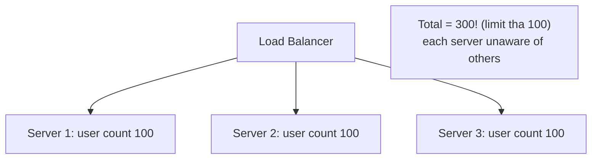
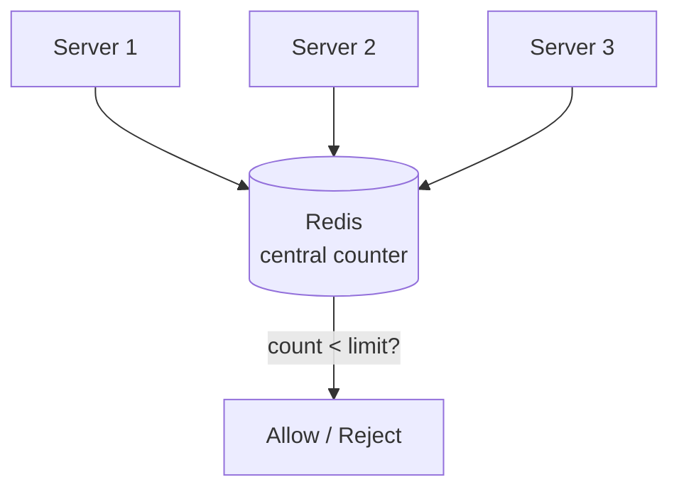
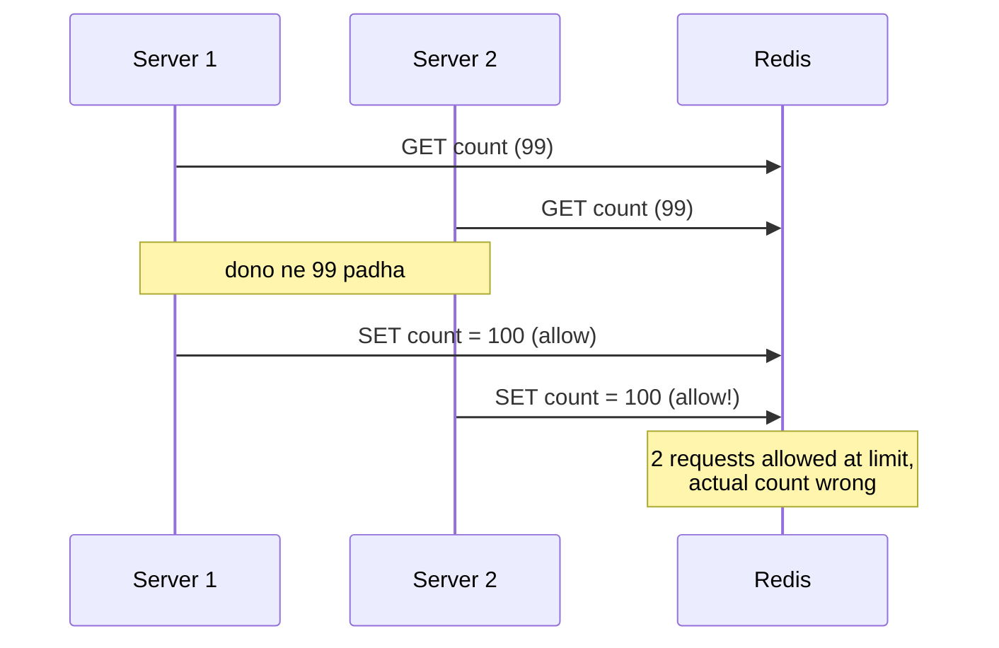
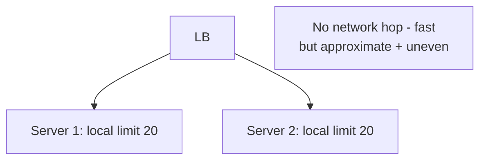
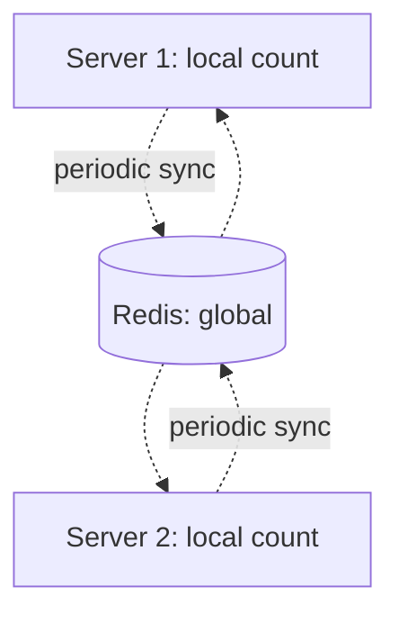
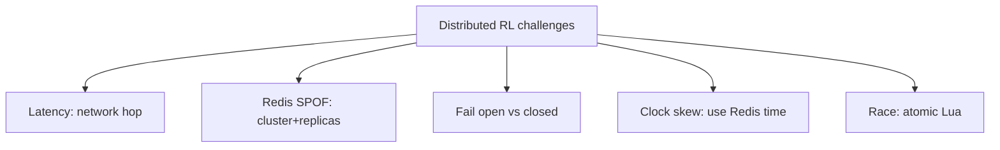

# 13. Rate Limiting Part-2 — Distributed Rate Limiting (Deep Dive)

> Part-1 (`12`) me single-machine algorithms the. Real systems me **multiple servers** hote hain —
> rate limiting ko sab servers ke **across** enforce karna padta. "Har server apna count rakhe"
> galat (total limit exceed). Ye file distributed rate limiting, race conditions, aur Redis-based
> solutions cover karti.

---

## 📑 Is file me
1. [Problem: distributed me single-machine algo kyun fail](#-problem-distributed-rate-limiting)
2. [Approach 1: Centralized (Redis)](#-approach-1-centralized-redis)
3. [Race conditions + atomicity (Lua)](#-race-condition--atomicity)
4. [Approach 2: Local (per-server)](#-approach-2-local-per-server)
5. [Approach 3: Hybrid](#-approach-3-hybrid)
6. [Redis implementations of algorithms](#-redis-implementations)
7. [Challenges](#-distributed-challenges)
8. [Interview Q&A](#-interview-qa)

---

## 🎯 Problem: Distributed Rate Limiting

Ek system me 5 app servers hain, limit = 100 req/min per user. Agar **har server apna local
counter** rakhe:



User ke requests LB se different servers pe jaate. Har server apna count 100 tak allow karta →
total **300 requests** (5 servers × 100 = 500 tak!) — limit 100 ka massive violation.

**Solution:** rate limit **shared/coordinated** hona chahiye across servers. Ek **central source of
truth** (usually Redis).

---

## 🎯 Approach 1: Centralized (Redis)

Ek **shared Redis** rakho jo counts store kare. Saare servers Redis ko check/update karte —
single source of truth.



### Basic flow (fixed window)
```
allow(userId):
    key = "rate:" + userId + ":" + current_minute
    count = REDIS.INCR(key)          # atomic increment
    if count == 1:
        REDIS.EXPIRE(key, 60)        # window TTL
    return count <= limit
```

- ✅ **Accurate** across all servers (single truth).
- ✅ Consistent limit regardless of server count.
- ❌ **Network hop** per request (latency add).
- ❌ **Redis = SPOF/bottleneck** (all rate-limit checks yahan) — Redis down → rate limiting down.
  Fix: Redis cluster + replicas, fallback policy (fail open ya closed).

### Redis kyun (in-memory counter)
- Fast (in-memory, ~sub-ms).
- Atomic operations (INCR, EXPIRE).
- TTL support (windows auto-expire).
- Shared across servers.

---

## ⚡ Race Condition & Atomicity

Distributed me **race condition** ka khatra. Do requests ek saath aayein (different servers), dono
count read karein (99), dono increment karein → dono allow (100, 100) → limit exceed (should be
100, became 101).



### Fix: atomic operations
- **`INCR`** — atomic increment (read+increment ek operation). Race nahi.
- **Lua script** — multiple operations atomically (Redis single-threaded, Lua script atomic):
```lua
-- atomic: check + increment + expire
local count = redis.call('INCR', KEYS[1])
if count == 1 then
    redis.call('EXPIRE', KEYS[1], ARGV[1])
end
if count > tonumber(ARGV[2]) then
    return 0  -- reject
end
return 1      -- allow
```
Lua script Redis pe atomically chalta — read-modify-write race nahi. **Distributed rate limiting me
atomicity critical.**

---

## 🖥️ Approach 2: Local (Per-Server)

Har server apna local counter, par limit ko **divide** karo (100 limit / 5 servers = 20 per server)
ya **approximate**.



- ✅ **Fast** (no network hop, in-memory).
- ✅ No Redis dependency (no SPOF).
- ❌ **Approximate** — uneven LB distribution → ek server ka limit exceed while doosra idle
  (total < 100 but some rejected). Server add/remove → limit recalculate.
- **Use:** ultra-low-latency, approximate ok, high traffic.

---

## 🔄 Approach 3: Hybrid

Local + periodic sync. Har server local count rakhta (fast), periodically Redis se sync karta
(accuracy). Best of both.



- Local check (fast) + background sync (accuracy). Ya "sliding window with local + global."
- ❌ Complexity, slight inaccuracy between syncs.
- **Use:** very high traffic jaha per-request Redis hop afford nahi.

### Comparison
| Approach | Accuracy | Latency | SPOF | Use |
|---|---|---|---|---|
| Centralized (Redis) | high | +network hop | Redis (mitigate) | most common |
| Local (per-server) | approximate | fast | none | ultra-low-latency |
| Hybrid | good | fast | Redis (soft) | very high traffic |

---

## 🔧 Redis implementations (algorithms distributed)

### Fixed Window (INCR + EXPIRE) — shown above
Simplest. Boundary problem inherited.

### Sliding Window Log (Sorted Set)
Redis **sorted set** (ZSET) me timestamps store. Score = timestamp.
```
allow(userId):
    now = current_time_ms()
    key = "rate:" + userId
    ZREMRANGEBYSCORE(key, 0, now - window)   # purane hatao
    count = ZCARD(key)                        # window me kitne
    if count < limit:
        ZADD(key, now, unique_id)             # add
        EXPIRE(key, window_sec)
        return ALLOWED
    return REJECTED
```
Accurate sliding window, distributed. (Lua se atomic.)

### Token Bucket (Redis)
Bucket state (tokens + last refill) Redis me store, Lua se atomic refill + consume.

### Sliding Window Counter (Redis)
Current + previous window counters Redis me, weighted calculation.

> ⭐ **Sabhi ko Lua script me wrap karo** → atomicity (read-modify-write race nahi).

---

## ⚠️ Distributed Challenges

1. **Redis latency** — per-request Redis call (network hop). Mitigate: Redis near app, pipelining,
   local L1 cache for hot keys.
2. **Redis SPOF/bottleneck** — all checks yahan. Mitigate: Redis cluster (shard by user key) +
   replicas. Rate limiter keys consistent-hash across Redis nodes.
3. **Fail open vs fail closed** — Redis down → allow all (fail open — availability, risk abuse) ya
   reject all (fail closed — safe, but users blocked)? Usually **fail open** for availability
   (rate limiting non-critical) — par sensitive endpoints fail closed.
4. **Clock skew** — servers ke clocks slightly different (window boundaries). Use Redis server time
   (single source) via `TIME` command.
5. **Race conditions** — atomic ops (INCR/Lua) mandatory.
6. **Hot key** — popular user/API key ek Redis node overload. Local cache + sharding.



---

## 💬 Interview Q&A

**Q: Distributed rate limiting kyun mushkil?**
Multiple servers — har server local count rakhe to total limit exceed (5 servers × 100 = 500).
Shared/coordinated state (Redis) chahiye single source of truth ke liye.

**Q: Kaise implement karoge distributed rate limiter?**
Centralized Redis — atomic INCR + EXPIRE (Lua script for check+increment+expire atomically). All
servers Redis check karte. Consistent limit.

**Q: Race condition kaise avoid?**
Atomic operations — Redis INCR (atomic) ya Lua script (multiple ops atomically, Redis single-
threaded). Read-modify-write race nahi.

**Q: Redis down ho jaye to?**
Fail open (allow all — availability priority, rate limiting non-critical) ya fail closed (reject —
safe but blocks users). Usually fail open, sensitive endpoints fail closed. Redis cluster +
replicas to avoid.

**Q: Centralized vs local rate limiting?**
Centralized (Redis) — accurate, +network hop, SPOF risk. Local (per-server) — fast, approximate,
uneven. Hybrid — local + periodic sync.

**Q: Sliding window Redis me kaise?**
Sorted set (ZSET) — timestamps as scores. ZREMRANGEBYSCORE (purane hatao) + ZCARD (count) + ZADD
(new). Lua se atomic. Accurate distributed sliding window.

**Q: Clock skew ka problem?**
Servers ke clocks different → window boundaries inconsistent. Fix: Redis server time (single
source) via TIME command, not local server time.

---

## 📝 Summary
- **Distributed RL problem:** per-server local counts → total limit exceed. Shared state chahiye.
- **Centralized (Redis)** — atomic INCR/Lua, single source of truth (most common). SPOF → cluster.
- **Race conditions** — atomic ops (INCR, Lua script) mandatory.
- **Local** (fast, approximate) vs **Hybrid** (local + sync).
- **Redis algorithms:** fixed window (INCR+EXPIRE), sliding log (ZSET), token bucket (Lua).
- **Challenges:** latency, SPOF, fail-open/closed, clock skew, hot keys.
