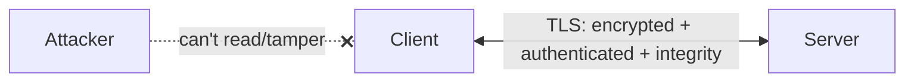
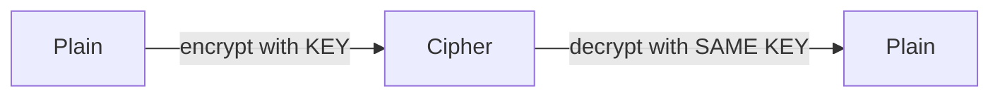
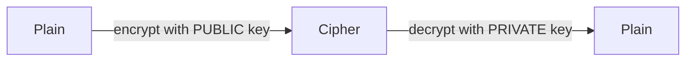
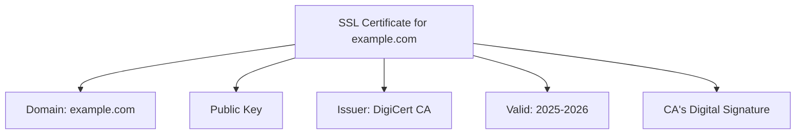
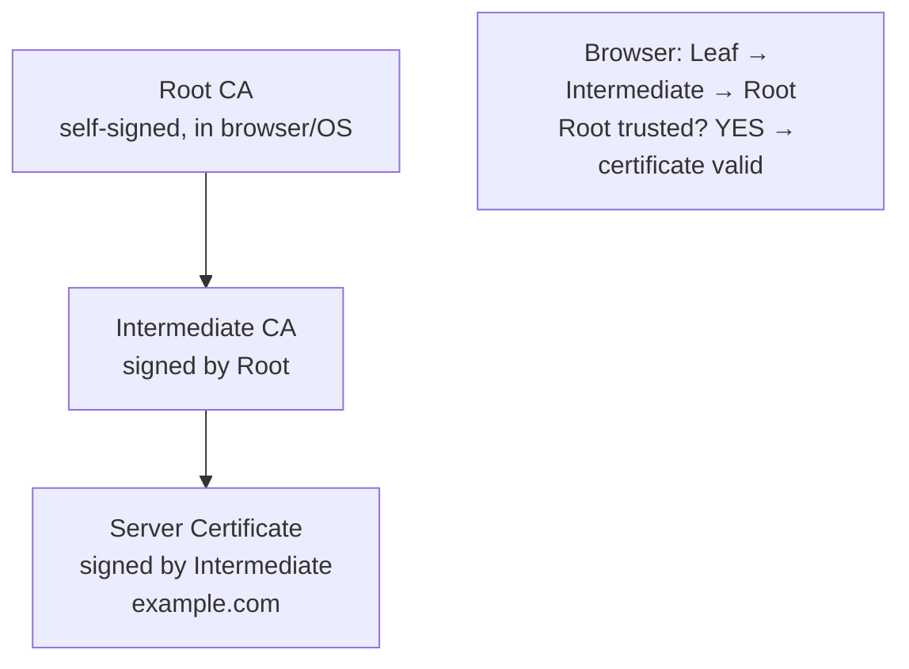
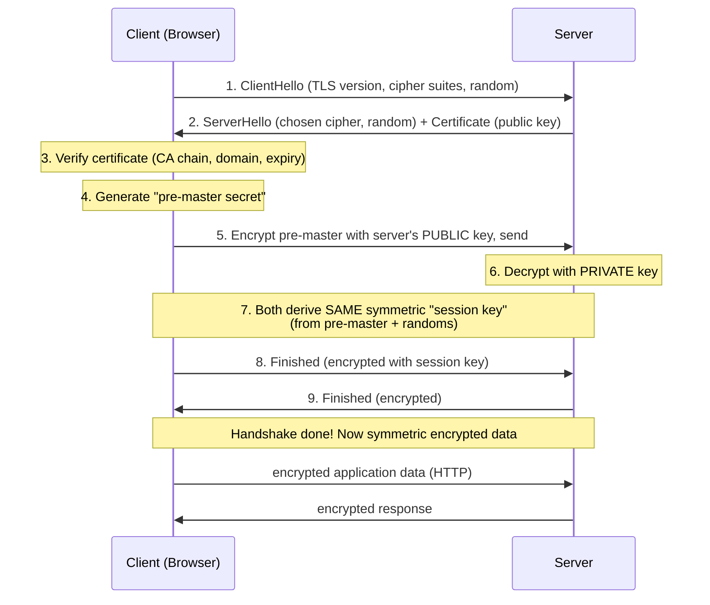
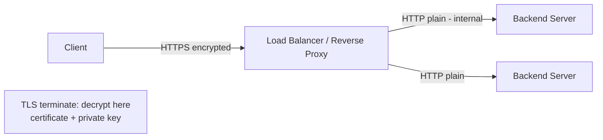
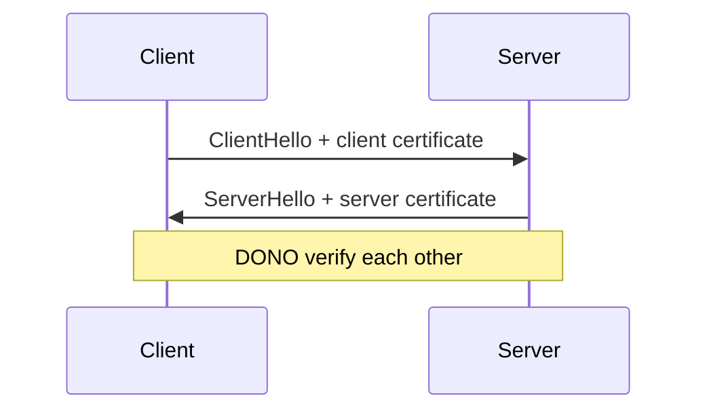

# 14. SSL/TLS Certificate — Complete Deep Dive

> HTTPS ke peeche SSL/TLS hai — jo internet communication ko **encrypt** (privacy), **authenticate**
> (server sahi hai), aur **integrity** (data tamper nahi hua) deta. Is file me: SSL/TLS kya, TLS
> handshake step-by-step, certificates + CA chain, symmetric vs asymmetric encryption, aur TLS
> termination.

---

## 📑 Is file me
1. [SSL/TLS kya + kyun](#-ssltls-kya-hai)
2. [Symmetric vs Asymmetric encryption](#-encryption-basics)
3. [SSL Certificate kya hota hai](#-ssl-certificate-kya-hota-hai)
4. [Certificate Authority (CA) chain of trust](#-certificate-authority--chain-of-trust)
5. [TLS Handshake — step by step](#-tls-handshake-step-by-step)
6. [TLS termination](#-tls-termination)
7. [Certificate types + mTLS](#-certificate-types--mtls)
8. [Interview Q&A](#-interview-qa)

---

## 🎯 SSL/TLS kya hai

**SSL** (Secure Sockets Layer) — purana protocol. **TLS** (Transport Layer Security) — SSL ka
successor (modern, secure). Log "SSL" bolte hain par actually **TLS** use hota (TLS 1.2, 1.3).

TLS teen cheezein deta:
1. **Encryption (Confidentiality)** — data encrypted, koi intercept kare to samajh nahi aata.
2. **Authentication** — server (aur optionally client) apni identity prove kare (certificate se) —
   "ye sach me google.com hai, koi imposter nahi."
3. **Integrity** — data tamper nahi hua transit me (MAC/checksums).

**HTTPS** = HTTP + TLS. Bina TLS ke, HTTP plain text — koi bhi (public WiFi, ISP, attacker) padh
sakta (passwords, cards). TLS se man-in-the-middle se bachaav.

---

## 🔐 Encryption Basics

TLS do types of encryption use karta:

### Symmetric encryption
Ek hi **shared key** encrypt aur decrypt dono ke liye. Fast (bulk data ke liye ideal).

- ✅ Fast (bulk data).
- ❌ **Key distribution problem** — dono parties ko same key chahiye, par key kaise securely share
  karein (internet pe bhejenge to intercept)?
- **Algorithm:** AES.

### Asymmetric encryption (public-key)
**Do keys** — **public key** (sabko de sakte) aur **private key** (secret). Public se encrypt →
sirf private se decrypt (aur vice versa).

- ✅ **No key distribution problem** — public key openly share, private secret.
- ❌ **Slow** (computationally heavy — bulk data ke liye impractical).
- **Algorithm:** RSA, ECC.

### TLS ka smart approach — hybrid
- **Asymmetric** encryption sirf **handshake** ke liye (securely ek symmetric "session key" share
  karne ke liye) — key distribution problem solve.
- **Symmetric** encryption **actual data** ke liye (fast).

> ⭐ Best of both — asymmetric se securely session key exchange, phir fast symmetric se bulk data.

---

## 📜 SSL Certificate kya hota hai

**SSL/TLS certificate** = ek digital document jo server ki **identity** prove karta. Isme:
- **Domain name** (`example.com`)
- **Server ki public key**
- **Issuer (CA)** ka naam
- **Validity period** (expiry date)
- **Digital signature** (CA ka — certificate genuine hai)

Certificate ek **trusted Certificate Authority (CA)** dwara issue + signed hota. Browser CA ki
signature verify karke certificate pe trust karta.

---

## 🏛️ Certificate Authority — Chain of Trust

**CA (Certificate Authority)** = trusted organizations (DigiCert, Let's Encrypt, GlobalSign) jo
certificates issue karte after verifying domain ownership. Browsers/OS me **root CAs** pre-installed
(trusted).

### Chain of trust

- **Root CA** — self-signed, browsers/OS me pre-installed (ultimate trust anchor). Offline, highly
  protected.
- **Intermediate CA** — Root se signed (Root ko direct use nahi karte — security). Actual certs
  issue karta.
- **Leaf/Server certificate** — Intermediate se signed (tumhari website ka).

Browser certificate verify karta: Leaf → Intermediate → Root chain follow, agar Root **trusted**
(pre-installed) hai → certificate valid. Isliye "chain of trust."

### Certificate verification
Browser check karta:
1. Certificate ki **CA signature** valid? (chain to trusted root)
2. **Domain match** karta (cert `example.com` ke liye, tum `example.com` pe ho)?
3. **Not expired**?
4. **Not revoked** (CRL/OCSP)?

Fail koi bhi → browser warning ("Not Secure" / "Your connection is not private").

---

## 🤝 TLS Handshake (step by step)

Ye interview me poochha jaata — HTTPS connection kaise establish hota:

**Steps explained:**
1. **ClientHello** — client supported TLS versions + cipher suites + random number bhejta.
2. **ServerHello + Certificate** — server cipher choose karta, apna **certificate** (public key
   included) bhejta.
3. **Certificate verification** — client cert verify karta (CA chain, domain, expiry, revocation).
4. **Pre-master secret** — client ek random secret generate karta.
5. **Encrypt + send** — client us secret ko server ke **public key** se encrypt karke bhejta
   (sirf server private key se decrypt kar sakta — man-in-middle nahi).
6. **Server decrypts** — private key se pre-master secret nikalta.
7. **Session key derivation** — dono (client + server) pre-master + randoms se **same symmetric
   session key** derive karte.
8-9. **Finished** — dono verify handshake tamper nahi hua.
- **Ab:** actual HTTP data **symmetric session key** se encrypted (fast).

> ⭐ **Key insight:** asymmetric (public/private) sirf **session key securely exchange** karne ke
> liye. Phir bulk data **symmetric** (fast). Ye hybrid TLS ka genius hai.

**TLS 1.3 improvement** — handshake 1-RTT (faster, pehle 2-RTT), 0-RTT resumption (returning
clients), weak ciphers removed. Modern.

---

## ✂️ TLS Termination

Encryption/decryption **CPU-heavy** hota. Usually **load balancer / reverse proxy** pe TLS
terminate karte (backend offload).

- ✅ **Backend offload** — CPU-heavy crypto ek jagah, backends simple HTTP.
- ✅ **Centralized cert management** — certs LB pe (ek jagah renew).
- ⚠ **Internal traffic plain** — LB-to-backend HTTP (internal network trust). Zero-trust me
  **re-encrypt** (TLS to backend) ya **mTLS**.

**TLS passthrough** — LB encrypt traffic ko decrypt kiye bina forward (backend terminate) — end-to-
end encryption, par LB content-based routing nahi kar sakta.

---

## 📋 Certificate Types + mTLS

### Certificate validation levels
| Type | Validation | Use |
|---|---|---|
| **DV (Domain Validated)** | domain ownership only | blogs, small sites (Let's Encrypt free) |
| **OV (Organization Validated)** | domain + org identity | business sites |
| **EV (Extended Validation)** | rigorous org verification | banks, e-commerce (green bar historically) |

### Certificate coverage
- **Single domain** — `example.com`
- **Wildcard** — `*.example.com` (all subdomains)
- **SAN (multi-domain)** — multiple domains ek cert me

### mTLS (Mutual TLS)
Normal TLS me sirf **server** authenticate hota (client verify karta). **mTLS** me **client bhi**
certificate deta — **dono** authenticate.

- **Use:** service-to-service (microservices, zero-trust), API security, IoT. Service mesh (Istio)
  auto-mTLS.

---

## 💬 Interview Q&A

**Q: SSL/TLS kya deta hai?**
Encryption (confidentiality), authentication (server identity via certificate), integrity (tamper
detection). HTTPS = HTTP + TLS.

**Q: TLS handshake kaise kaam karta?**
ClientHello → ServerHello + certificate → client verifies cert → client encrypts pre-master secret
with server public key → server decrypts with private key → both derive symmetric session key →
encrypted data. Asymmetric for key exchange, symmetric for data.

**Q: Symmetric vs asymmetric, TLS me dono kyun?**
Symmetric = fast (bulk data) but key distribution problem. Asymmetric = solves key distribution but
slow. TLS: asymmetric to exchange session key, symmetric for data (hybrid — fast + secure).

**Q: Certificate + CA kaise trust deta?**
CA (trusted org) certificate sign karta. Chain: server cert → intermediate CA → root CA. Root
browsers/OS me pre-installed (trusted). Browser chain verify → root trusted → cert valid.

**Q: TLS termination kya, kahan?**
LB/reverse proxy pe decrypt (backend offload, cert management centralized). Internal traffic plain
(ya re-encrypt for zero-trust).

**Q: mTLS kya?**
Mutual TLS — client bhi certificate deta, dono authenticate. Service-to-service (microservices),
zero-trust, API security. Service mesh auto-mTLS.

**Q: TLS 1.3 improvements?**
Faster handshake (1-RTT vs 2-RTT), 0-RTT resumption, weak ciphers removed, forward secrecy default.

---

## 📝 Summary
- **SSL/TLS** — encryption + authentication + integrity. HTTPS = HTTP + TLS.
- **Symmetric** (fast, key distribution problem) + **Asymmetric** (slow, solves distribution) →
  TLS hybrid (asymmetric for session-key exchange, symmetric for data).
- **Certificate** — server identity (domain, public key, CA signature). **CA chain** — leaf →
  intermediate → root (browser-trusted).
- **Handshake** — hello → cert → verify → exchange session key (asymmetric) → symmetric data.
- **TLS termination** — LB/proxy pe (offload, cert management).
- **mTLS** — mutual auth (service-to-service, zero-trust).
