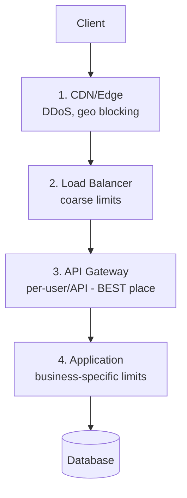
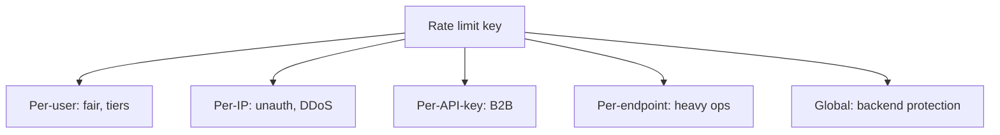
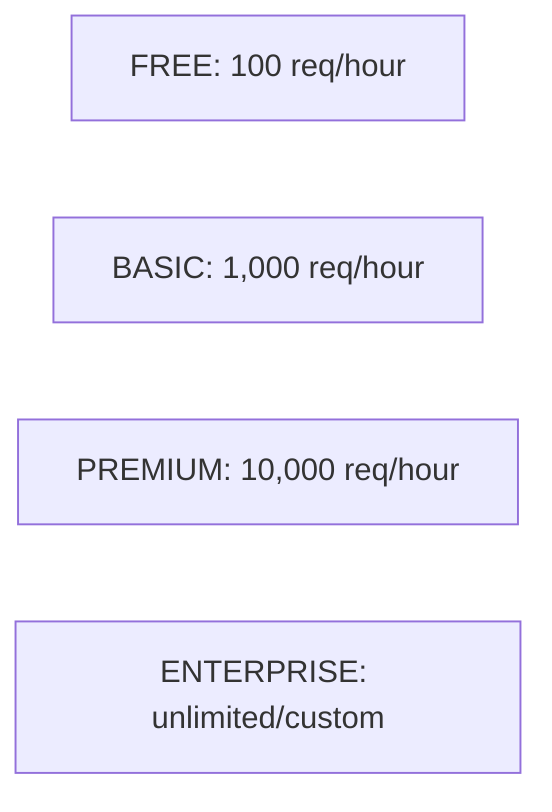
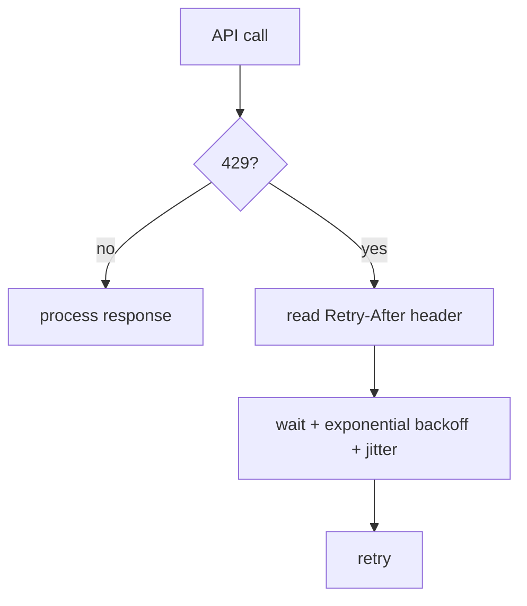

# 15. Rate Limiting Strategies (Complete Deep Dive)

> Algorithms (`12`) aur distributed implementation (`13`) ke baad, ye file batati hai **kaise
> strategically** rate limiting deploy karein: **kahan** lagana, **kis basis pe** (user/IP/API),
> **kaise respond** karna, aur **graceful** kaise banana. Ye "policy + placement" layer hai.

---

## 📑 Is file me
1. [Kahan rate limit lagayein (placement)](#-placement-kahan-rate-limit)
2. [Kis basis pe (dimensions)](#-rate-limiting-dimensions-kis-basis-pe)
3. [Tiered rate limiting](#-tiered-rate-limiting)
4. [Response handling (429 + headers)](#-response-handling)
5. [Client-side handling](#-client-side-handling)
6. [Graceful degradation](#-graceful-strategies)
7. [Advanced strategies](#-advanced-strategies)
8. [Interview Q&A](#-interview-qa)

---

## 📍 Placement — Kahan Rate Limit

Rate limiting multiple layers pe ho sakti:



| Layer | Rate limit type | Kyun |
|---|---|---|
| **CDN / Edge** | DDoS protection, IP-based | traffic edge pe absorb (origin bacha) |
| **Load Balancer** | coarse connection limits | basic protection |
| **API Gateway** | **per-user, per-API-key, per-endpoint** | **best place** — single entry, sees all traffic, auth context |
| **Application** | business-specific (per-feature) | fine-grained logic (e.g. "3 OTP/hour") |

> ⭐ **API Gateway sabse best jagah** — sara traffic yahan se guzarta (single entry), auth context
> available (user pata), cross-cutting concern (services me duplicate nahi). Par defense-in-depth
> ke liye multiple layers (CDN for DDoS + gateway for per-user).

---

## 🎯 Rate Limiting Dimensions (kis basis pe)

Kis "key" pe limit lagana — different dimensions:

### 1. Per-User (authenticated)
User ID / API key pe limit. "Har user 1000 req/hour."
- ✅ Fair per-user, monetization (tiers).
- Requires authentication (user identify).

### 2. Per-IP
IP address pe limit. "Har IP 100 req/min."
- ✅ Unauthenticated endpoints (login, signup), DDoS defense.
- ❌ Shared IPs (NAT, corporate, mobile carriers — many users one IP) → false limits. Public IPs
  aur VPN evasion.

### 3. Per-API-Key
Developer/partner API key pe. B2B APIs.

### 4. Per-Endpoint
Specific endpoint pe (heavy endpoints tighter). "`/search` 10/min, `/profile` 100/min."
- Resource-intensive endpoints protect.

### 5. Global
Total system-wide limit (backend protection). "Total 1M req/min across all users."
- Backend overload prevention (thundering herd on shared resource).

### 6. Concurrent requests
Ek user ke kitne simultaneous requests (not rate, but concurrency).



> ⭐ **Combine karo** — real systems multiple dimensions use karte: per-user + per-IP + per-endpoint
> + global (layered defense). E.g. "user 1000/hr AND IP 100/min AND global 1M/min."

---

## 💎 Tiered Rate Limiting

Different user tiers ke different limits (monetization + fairness):



| Tier | Limit | Use |
|---|---|---|
| Free | low (100/hr) | trial, hobbyists |
| Basic | medium (1000/hr) | small businesses |
| Premium | high (10000/hr) | growing apps |
| Enterprise | custom/unlimited | large clients |

- Business model — upgrade for higher limits.
- Repo LLD me: [`Rate_Limiter_LLD`](../LLD/Rate_Limiter_LLD/) me FREE/PREMIUM tiers implemented.

---

## 📨 Response Handling

Rate limit exceed hone pe **proper response** dena zaroori (client ko batao):

### HTTP 429 Too Many Requests
```
HTTP/1.1 429 Too Many Requests
Retry-After: 60
X-RateLimit-Limit: 100
X-RateLimit-Remaining: 0
X-RateLimit-Reset: 1735689600
```

**Headers:**
- **`Retry-After`** — kitni der baad retry karo (seconds ya date).
- **`X-RateLimit-Limit`** — total limit (100).
- **`X-RateLimit-Remaining`** — abhi kitne bache (0).
- **`X-RateLimit-Reset`** — kab reset hoga (timestamp).

> ⭐ Ye headers **har response** me bhejo (sirf 429 pe nahi) — client proactively rate manage kare
> ("50 remaining — slow down"). Good API citizenship.

### Response body
```json
{
  "error": "rate_limit_exceeded",
  "message": "Too many requests. Try again in 60 seconds.",
  "retry_after": 60
}
```

---

## 📱 Client-Side Handling

Client (jo API call karta) ko bhi rate limits respect karne chahiye:



- **Respect `Retry-After`** — us time tak wait.
- **Exponential backoff + jitter** — 429 pe blind retry mat karo (retry storm). Wait 1s, 2s, 4s +
  random.
- **Proactive throttling** — `X-RateLimit-Remaining` dekh ke apni request rate adjust.
- **Caching** — reduce API calls (cache responses locally).
- **Batch requests** — multiple ops ek call me (agar API supports).

---

## 🕊️ Graceful Strategies

Rate limiting user-hostile na ho — graceful approaches:

### 1. Throttling vs hard reject
- **Hard reject** — 429, request drop.
- **Throttling (queue + delay)** — request queue me, slow process (reject nahi, sirf slow). Better
  UX for some cases.

### 2. Soft vs hard limits
- **Soft limit** — cross pe warn (log/alert), par allow (grace).
- **Hard limit** — cross pe reject.
- E.g. soft at 80%, hard at 100%.

### 3. Burst allowance
Token bucket se short bursts allow (legitimate spikes handle) — sirf sustained abuse reject.

### 4. Dynamic rate limiting
System load ke hisaab se limits adjust. Load high → limits tighten (backend protect). Load low →
relax.

### 5. Fail open
Rate limiter down (Redis down) → allow requests (fail open — availability > strict limiting).
Sensitive endpoints fail closed.

---

## 🔬 Advanced Strategies

### Sliding window per dimension
Different windows for different keys (per-second for burst, per-hour for sustained).
```
user: 10/second AND 1000/hour AND 10000/day  (layered)
```

### Cost-based rate limiting
Har request ka alag "cost" (heavy query = 10 units, simple = 1 unit). Limit units me, not requests.
GraphQL/complex APIs me common (query complexity based).

### Adaptive / ML-based
Anomaly detection — normal pattern seekho, deviation (sudden spike) pe tighten. Bot vs human detect.

### Geographic rate limiting
Per-region limits (specific regions se abuse → tighten).

### Priority-based
Critical requests (payment) higher priority than non-critical (analytics) under load.

---

## 🛠️ Real-world examples
- **GitHub API** — 5000 req/hour authenticated, 60/hour unauthenticated. `X-RateLimit-*` headers.
- **Twitter/X API** — per-endpoint windows (15-min windows).
- **Stripe** — token bucket, 100 req/sec, graceful with headers.
- **Cloudflare** — edge rate limiting (DDoS, per-IP, custom rules).

---

## 💬 Interview Q&A

**Q: Rate limiting kahan lagayein?**
API Gateway best (single entry, auth context, cross-cutting). Plus defense-in-depth: CDN (DDoS),
LB (coarse), application (business-specific). Multiple layers.

**Q: Kis basis pe rate limit?**
Per-user (fair, tiers), per-IP (unauth/DDoS), per-API-key (B2B), per-endpoint (heavy ops), global
(backend protection). Combine multiple (layered).

**Q: Per-IP rate limiting ki problem?**
Shared IPs (NAT, corporate, mobile carriers — many users one IP) → false limits (legitimate users
blocked). Public IPs, VPN evasion. Prefer per-user for authenticated.

**Q: Rate limit exceed response?**
HTTP 429 + Retry-After + X-RateLimit-* headers (limit/remaining/reset). Body with clear message.
Headers on every response (proactive client throttling).

**Q: Graceful rate limiting?**
Throttling (queue+delay vs hard reject), soft/hard limits, burst allowance, dynamic (load-based),
fail-open (limiter down → allow). Client: respect Retry-After, backoff, cache.

**Q: Tiered rate limiting?**
Different limits per tier (free 100/hr, premium 10000/hr) — monetization + fairness. Upgrade for
higher.

**Q: Cost-based rate limiting?**
Har request ka alag cost (heavy query = more units). Limit units-based, not count. GraphQL/complex
APIs (query complexity).

---

## 📝 Summary
- **Placement:** API Gateway best (+ CDN for DDoS, app for business rules) — defense in depth.
- **Dimensions:** per-user, per-IP, per-API-key, per-endpoint, global — combine (layered).
- **Tiered** — different limits per plan (monetization).
- **Response:** 429 + Retry-After + X-RateLimit-* headers (every response).
- **Client:** respect Retry-After, exponential backoff, proactive throttling, caching.
- **Graceful:** throttle vs reject, soft/hard, burst, dynamic, fail-open.
- **Advanced:** cost-based, adaptive/ML, geographic, priority.
