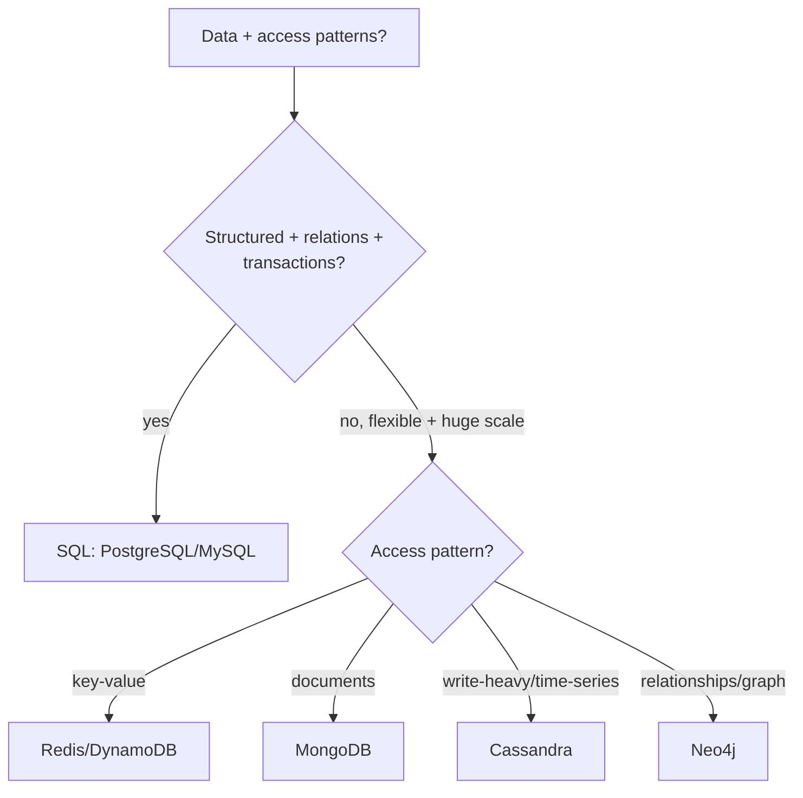
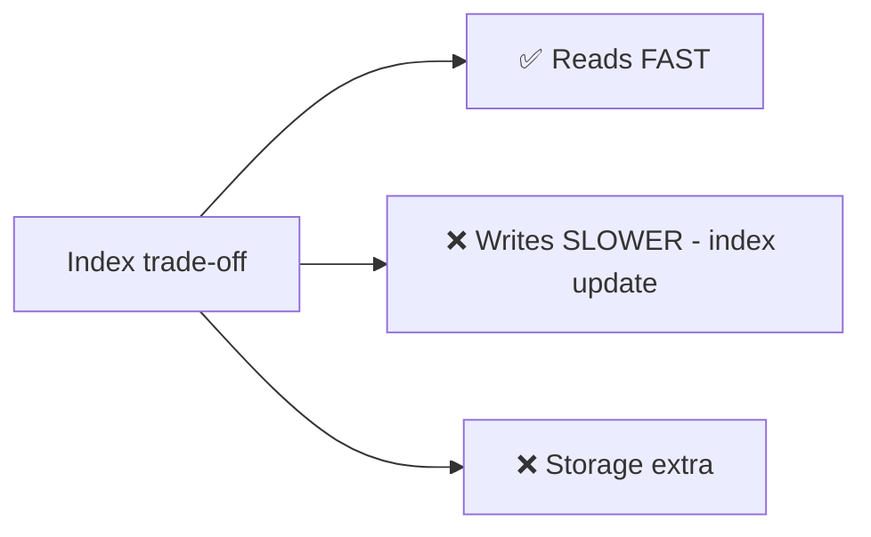
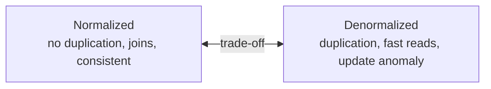
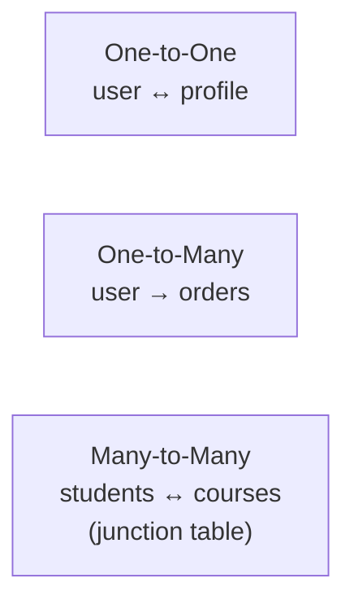
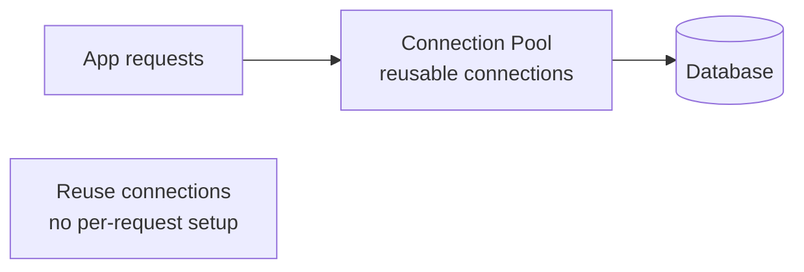

# 16. Database Design Tips (Complete Deep Dive)

> Database har system ka dil hai — galat design scale pe kill karta. Ye file batati hai: SQL vs
> NoSQL kaise choose, indexing, normalization vs denormalization, schema design, transactions,
> connection pooling, aur query optimization — sab practical tips ke saath.

---

## 📑 Is file me
1. [SQL vs NoSQL — kaise choose](#-sql-vs-nosql--kaise-choose)
2. [Indexing (deep)](#-indexing-deep)
3. [Normalization vs Denormalization](#-normalization-vs-denormalization)
4. [Schema design tips](#-schema-design-tips)
5. [Keys & relationships](#-keys--relationships)
6. [Transactions & isolation](#-transactions--isolation-levels)
7. [Connection pooling](#-connection-pooling)
8. [Query optimization](#-query-optimization)
9. [Scaling recap](#-database-scaling-recap)
10. [Interview Q&A](#-interview-qa)

---

## 🗄️ SQL vs NoSQL — kaise choose

Pehla aur biggest decision. Dono ke strengths alag:



| | **SQL (RDBMS)** | **NoSQL** |
|---|---|---|
| Schema | fixed (rigid) | flexible (schema-less) |
| Scaling | vertical (hard to shard) | horizontal (built-in) |
| Consistency | strong (ACID) | eventual (BASE) usually |
| Relations | joins, foreign keys | denormalized, embedded |
| Queries | powerful SQL, joins, aggregations | limited (mostly key-based) |
| Transactions | full ACID | limited (single doc/partition) |
| Examples | PostgreSQL, MySQL, Oracle | MongoDB, Cassandra, DynamoDB, Redis |

**NoSQL types:**
- **Key-Value** (Redis, DynamoDB) — cache, session, simple lookups.
- **Document** (MongoDB) — JSON docs, flexible/evolving schema.
- **Column-family** (Cassandra, HBase) — write-heavy, time-series, huge scale.
- **Graph** (Neo4j) — relationships-heavy (social, recommendations, fraud).

**Choose SQL agar:** complex queries/joins, strong consistency + transactions (banking, inventory),
clear relationships, moderate scale.
**Choose NoSQL agar:** massive horizontal scale, flexible/evolving schema, eventual consistency ok
(feeds, logs, analytics), simple access patterns.

> ⭐ **Modern reality:** most apps SQL se shuru (PostgreSQL — powerful, ACID, scales far with
> replicas). NoSQL specific needs pe (huge scale, flexible schema). **Polyglot persistence** —
> ek app me multiple DBs (orders in SQL, sessions in Redis, logs in Cassandra).

---

## 🔍 Indexing (deep)

**Index** = data structure (usually B-tree) jo lookup fast karta — O(log n) vs O(n) full scan.

```mermaid
flowchart LR
    Q["Query: WHERE email = 'x'"] --> NI[No index: O(n) scan<br/>every row check]
    Q --> WI[Index on email: O(log n)<br/>B-tree direct lookup]
```

### Index types
- **B-tree index** (default) — range queries (`<`, `>`, BETWEEN), sorting, equality. Most common.
- **Hash index** — exact match only (`=`), very fast. No range.
- **Composite index** — multiple columns `(last_name, first_name)`. **Order matters** (leftmost
  prefix rule — index `(a,b)` `a` aur `a,b` queries pe kaam karta, sirf `b` pe nahi).
- **Covering index** — query ke saare columns index me → table access hi nahi (super fast).
- **Unique index** — uniqueness enforce + lookup.
- **Full-text index** — text search (LIKE '%...%' slow — use full-text or Elasticsearch).

### Indexing tips
- **Index frequently queried columns** — WHERE, JOIN, ORDER BY columns.
- **Don't over-index** — har index write slow karta (index bhi update) + storage. Balance.
- **Composite index order** — most selective/frequently-filtered column first.
- **Foreign keys index karo** — joins fast.
- **Monitor slow queries** — EXPLAIN plan se dekho index use ho raha ya full scan.



---

## 🔄 Normalization vs Denormalization

### Normalization
Data ko tables me todo, **no duplication** (redundancy remove). Normal forms (1NF, 2NF, 3NF).
```
users: id, name, email
orders: id, user_id, amount   (user_id references users)
```
- ✅ No duplication, consistency (ek jagah update), storage efficient, integrity.
- ❌ Reads mehnge (joins across tables), complex queries.
- **Use:** OLTP (transactions), write-heavy, consistency critical.

### Denormalization
Data **duplicate** karo (embed) — reads fast (no join).
```
orders: id, user_id, user_name, user_email, amount   (user data duplicated)
```
- ✅ Reads fast (no join, all data in one place), simpler read queries.
- ❌ Duplication (storage), updates multiple jagah (consistency risk), update anomalies.
- **Use:** OLAP/read-heavy (analytics, feeds), NoSQL (joins expensive/absent).



> ⭐ **Rule:** Normalize for correctness (default), denormalize for read performance (when reads
> dominate + joins slow). NoSQL me denormalization common (access-pattern-driven design).

---

## 🏗️ Schema Design Tips

1. **Understand access patterns first** — kaunsi queries chahiye? (specially NoSQL — model for
   queries, not just data).
2. **Choose right data types** — smallest that fits (INT vs BIGINT, VARCHAR length). Storage +
   performance.
3. **Avoid NULL where possible** — use defaults, NULLs complicate queries/indexes.
4. **Money as integer (paise/cents)** — never float (0.1 + 0.2 != 0.3). Store `4900` for ₹49.00.
5. **Timestamps** — store UTC, epoch/ISO. Timezone convert at display.
6. **Enums vs strings** — enums for fixed sets (status) — type-safe, storage.
7. **Soft delete** — `is_deleted` flag instead of hard delete (audit, recovery, referential
   integrity).
8. **Audit columns** — `created_at`, `updated_at` (debugging, sorting).
9. **UUID vs auto-increment** — UUID (distributed, no central bottleneck, but bigger). Auto-increment
   (sortable, but central). Snowflake (distributed + sortable).

---

## 🔑 Keys & Relationships

### Primary Key
Unique row identifier. Choose: natural (email — but changes?) vs surrogate (auto-id/UUID — stable).
Usually **surrogate** (stable, small, indexed).

### Foreign Key
Reference to another table's PK. Enforces referential integrity.
```
orders.user_id → users.id   (FK)
```
- ⚠ At scale/sharding, FKs across shards impossible → application-level integrity.

### Relationships

- **1:1** — same table ya separate (large optional fields).
- **1:many** — FK on "many" side (order has user_id).
- **many:many** — **junction/join table** (`student_course: student_id, course_id`).

---

## 🔒 Transactions & Isolation Levels

### ACID
- **Atomicity** — all-or-nothing (BEGIN → ops → COMMIT/ROLLBACK).
- **Consistency** — valid state to valid state (constraints hold).
- **Isolation** — concurrent transactions don't interfere.
- **Durability** — committed data permanent (crash-safe, WAL).

### Isolation levels
| Level | Prevents | Allows |
|---|---|---|
| Read Uncommitted | — | dirty reads |
| Read Committed | dirty reads | non-repeatable reads |
| Repeatable Read | non-repeatable reads | phantom reads |
| Serializable | all | (slowest, full isolation) |

- Higher isolation = more consistency, less concurrency (locks). **Trade-off.**
- **MVCC** (PostgreSQL, MySQL InnoDB) — readers don't block writers (snapshot isolation).

---

## 🔌 Connection Pooling

DB connections **expensive** (TCP + auth + session setup). Har request pe naya connection = slow +
DB overwhelmed.



- **Pool** — pre-established connections, requests borrow + return.
- ✅ No per-request setup cost, bounded connections (DB limit protect), faster.
- Config: pool size (too small = wait, too large = DB overwhelm), timeout, idle eviction.
- **Repo LLD:** connection pool = Object Pool pattern.

---

## ⚡ Query Optimization

1. **Use indexes** — WHERE/JOIN/ORDER BY columns.
2. **EXPLAIN** — query plan dekho (full scan? index used?).
3. **Avoid SELECT \*** — sirf needed columns (less data, covering index).
4. **Limit results** — pagination (LIMIT/OFFSET, ya cursor-based for large).
5. **Avoid N+1 queries** — loop me per-item query (N+1) → batch/JOIN (ek query).
6. **Denormalize hot paths** — frequently joined data embed.
7. **Cache** — frequent queries Redis me. [Detail: `08_Caching...`]
8. **Batch writes** — multiple inserts ek statement.
9. **Archive old data** — cold data separate (table small, fast).

### N+1 problem
```
BAD:  get users (1 query) → for each user, get orders (N queries) = N+1
GOOD: get users + orders in JOIN (1 query) ya IN clause (2 queries)
```

---

## 📈 Database Scaling (recap)
Vertical → read replicas → caching → sharding (in order). [Detail: `06_Scaling...`, `21_Database_Sharding.md`]

---

## 💬 Interview Q&A

**Q: SQL vs NoSQL kaise choose?**
SQL — structured, relations, joins, ACID transactions (banking, inventory). NoSQL — huge scale
(horizontal), flexible schema, eventual consistency ok (feeds, logs). Polyglot common.

**Q: Index kya, cost?**
Fast lookup (B-tree, O(log n) vs O(n) scan). Cost: writes slower (index update), storage. Index
frequently queried columns, don't over-index.

**Q: Composite index order matters?**
Haan — leftmost prefix rule. Index `(a,b)` `a` aur `a,b` queries pe kaam karta, sirf `b` pe nahi.
Most selective/filtered column first.

**Q: Normalization vs denormalization?**
Normalize — no duplication, joins, consistency (OLTP). Denormalize — duplicate, fast reads, update
anomaly (OLAP/read-heavy, NoSQL).

**Q: N+1 query problem?**
Loop me per-item query (1 + N). Fix: JOIN ya IN clause (batch) — ek/do queries instead of N+1.

**Q: Money kaise store?**
Integer (paise/cents) ya decimal — never float (0.1+0.2 != 0.3). ₹49.00 → store 4900.

**Q: Connection pooling kyun?**
DB connections expensive (setup cost). Pool reuse karta — no per-request setup, bounded connections
(DB protect), faster.

**Q: ACID isolation levels?**
Read Uncommitted → Committed → Repeatable Read → Serializable (increasing isolation, decreasing
concurrency). MVCC — readers don't block writers.

---

## 📝 Summary
- **SQL** (ACID, joins, structured) vs **NoSQL** (scale, flexible, eventual). Polyglot persistence.
- **Indexing** — fast reads (B-tree O(log n)), slow writes. Composite order matters (leftmost).
- **Normalize** (consistency, OLTP) vs **denormalize** (read speed, OLAP/NoSQL).
- **Schema tips** — right types, money as integer, UTC timestamps, soft delete, surrogate keys.
- **Transactions** — ACID, isolation levels (trade-off), MVCC.
- **Connection pooling** — reuse (expensive setup). **Query opt** — indexes, EXPLAIN, avoid N+1/SELECT*.
