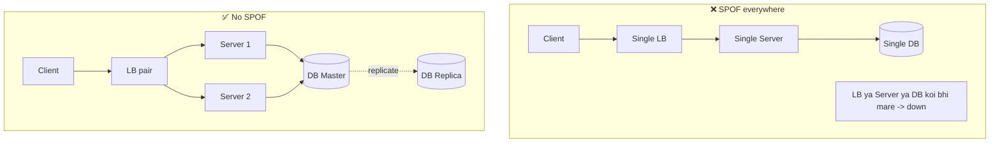
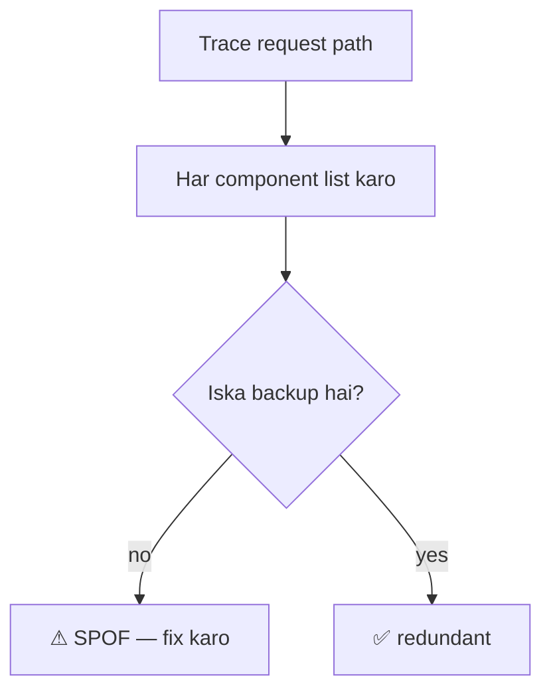
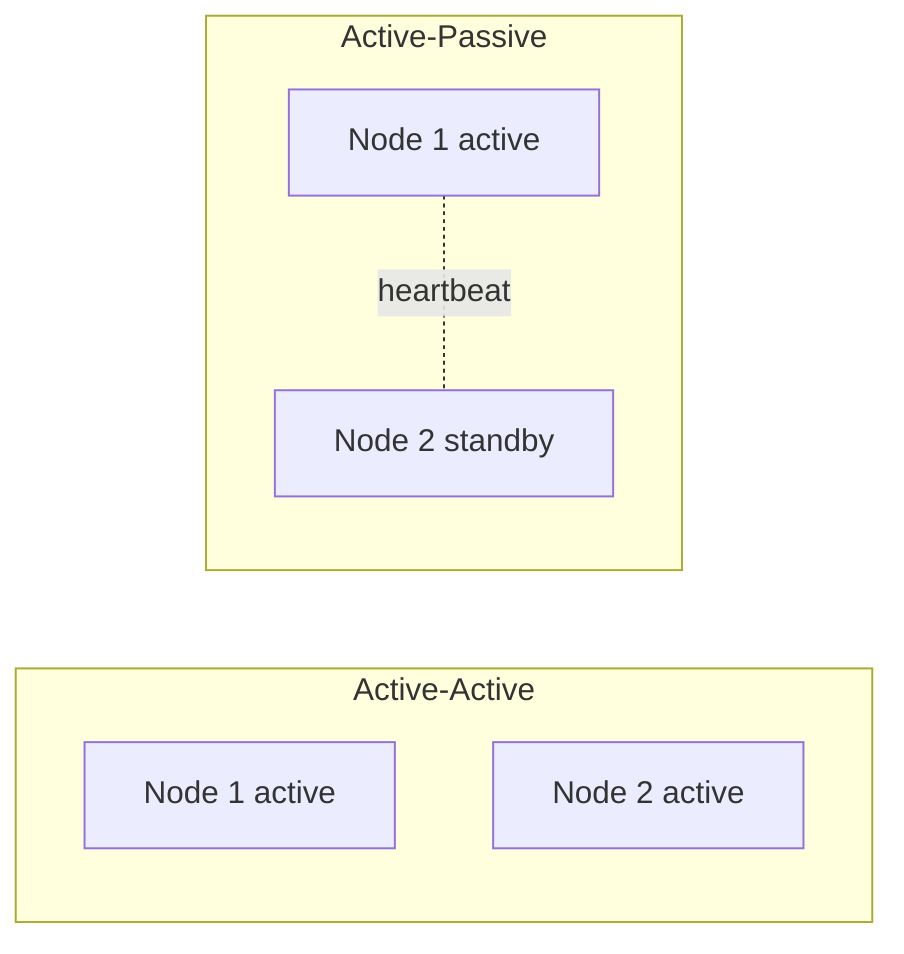
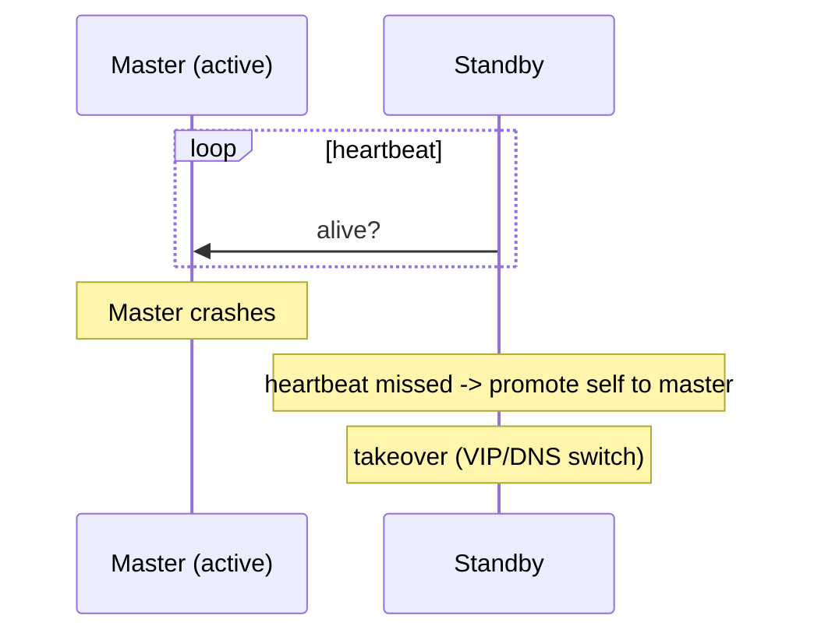
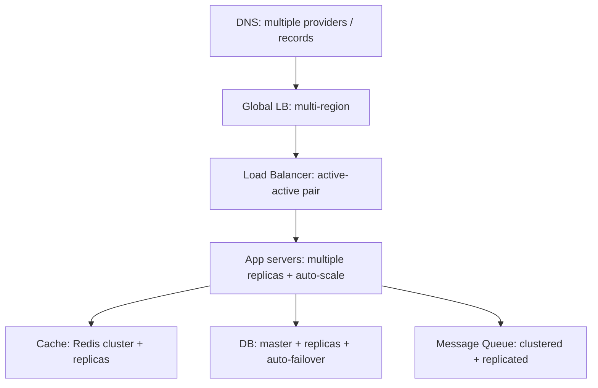
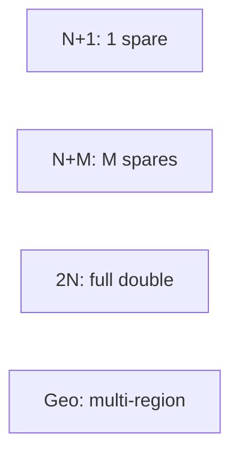
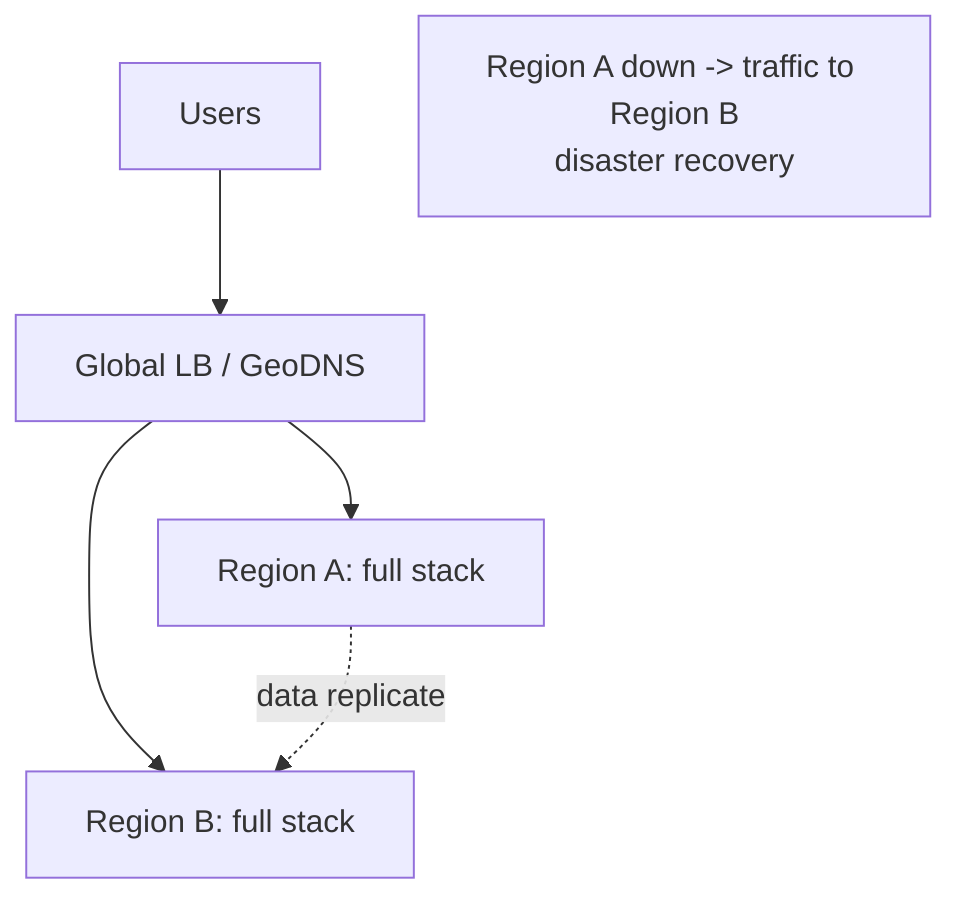
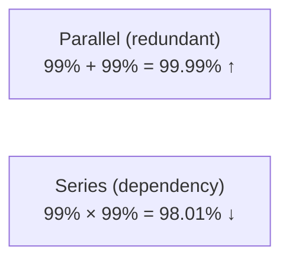

# 17. How to Avoid Single Point of Failure (Complete Deep Dive)

> **Single Point of Failure (SPOF)** = ek component jiske fail hone pe **poora system down** ho
> jaaye. High-availability system ka goal: **no SPOF** — har component ka backup. Ye file batati
> hai SPOF kaise pehchano aur har layer pe kaise eliminate karo (redundancy, replication, failover,
> multi-region).

---

## 📑 Is file me
1. [SPOF kya hai](#-spof-kya-hai)
2. [SPOF identify kaise](#-spof-identify-kaise-karein)
3. [Core techniques (redundancy, failover)](#-core-techniques)
4. [Layer-by-layer SPOF elimination](#-layer-by-layer-spof-elimination)
5. [Redundancy patterns](#-redundancy-patterns)
6. [Multi-region / geo-redundancy](#-multi-region--geo-redundancy)
7. [Availability math](#-availability-math)
8. [Interview Q&A](#-interview-qa)

---

## 🎯 SPOF kya hai

Ek component jo **redundancy ke bina** hai — wo mare to poora system (ya major part) down. High
availability = **koi bhi single component fail ho to system chalta rahe**.



> ⭐ **Golden question:** har component pe poocho — "**agar ye mare to kya hoga?**" Agar jawab
> "poora system down" hai → wo SPOF hai → redundancy chahiye.

---

## 🔍 SPOF identify kaise karein

System ke har component/layer ko examine karo:



**Common SPOFs:**
- Single load balancer
- Single application server
- Single database (no replica)
- Single cache node
- Single message queue node
- Single DNS provider
- Single datacenter/region
- Single network path/switch
- Single power supply
- Shared dependency (auth service, config service)

---

## 🛠️ Core Techniques

### 1. Redundancy (backup components)
Har critical component ka duplicate. Ek mare, doosra le le.
- **Active-Active** — dono active (load share). Ek mare → doosra full load.
- **Active-Passive** — ek active + standby. Active mare → passive activate (failover).



### 2. Replication (data copies)
Data multiple nodes pe (ek mare → data safe). Master-replica, multi-master.

### 3. Failover (automatic switchover)
Failure detect (heartbeat) → automatically backup activate. Manual failover (slow) vs automatic
(fast).


### 4. Load balancing
Traffic multiple servers me (ek mare → LB baaki ko route). [Detail: `03_...`]

### 5. Health checks
Continuous monitoring — unhealthy component detect + remove/replace.

---

## 🏗️ Layer-by-Layer SPOF Elimination

Har layer pe redundancy:



| Layer | SPOF | Fix |
|---|---|---|
| **DNS** | single provider | multiple DNS providers, low TTL |
| **Global routing** | single region | multi-region + GeoDNS/Anycast failover |
| **Load Balancer** | single LB | active-active/passive pair (floating IP) |
| **App servers** | single server | multiple replicas (stateless) + LB + autoscale |
| **Cache** | single cache | Redis cluster + replicas |
| **Database** | single DB | master + read replicas + auto-failover |
| **Message Queue** | single broker | clustered (Kafka partitions replicated) |
| **Storage** | single disk | replicated (S3 11 nines durability) |
| **Network** | single path | redundant paths/switches |
| **Power** | single supply | redundant power, UPS, generators |
| **Datacenter** | single DC | multiple availability zones / regions |

---

## 🔁 Redundancy Patterns

### N+1 redundancy
N components chahiye load ke liye, +1 extra (spare). Ek mare → spare covers.

### N+M redundancy
N needed + M spares (more resilience — multiple failures tolerate).

### 2N (full redundancy)
Double everything (100% backup). Expensive but max resilience.

### Geographic redundancy
Multiple regions/datacenters (region-level failure survive).



**Trade-off:** more redundancy = more cost. Balance based on criticality (payment system 2N,
analytics N+1).

---

## 🌍 Multi-Region / Geo-Redundancy

Single datacenter/region SPOF — natural disaster, power, network isolation poore region ko le
sakta. **Multi-region**:



- **Active-Passive (DR)** — primary region + standby (failover on disaster). Standby idle (cost).
- **Active-Active** — multiple regions serve traffic (low latency + HA). Data sync/conflict
  complexity.
- **GeoDNS/Anycast** — user ko nearest healthy region, region down → reroute.
- **Data replication** — cross-region (async — latency). Conflict resolution.
- **Compliance** — data residency (GDPR — EU data in EU).

### Disaster Recovery metrics
- **RTO (Recovery Time Objective)** — kitni der me recover (downtime tolerance).
- **RPO (Recovery Point Objective)** — kitna data loss acceptable (backup frequency).
- Lower RTO/RPO = more cost (hot standby vs cold backup).

---

## 📊 Availability Math

Redundancy availability kaise badhata:

**Single component** with 99% availability = 3.65 days/year downtime.

**Two redundant** (either works — parallel):
```
Combined failure = both fail = 0.01 × 0.01 = 0.0001
Combined availability = 1 - 0.0001 = 99.99%  (52 min/year!)
```
Redundancy availability exponentially badhata.

**Series dependency** (both needed — chain):
```
If A (99%) AND B (99%) both needed:
availability = 0.99 × 0.99 = 98.01%  (WORSE — dependencies reduce availability)
```



| Availability | Downtime/year |
|---|---|
| 99% | 3.65 days |
| 99.9% | 8.76 hours |
| 99.99% | 52 minutes |
| 99.999% | 5.26 minutes |

> ⭐ **Insight:** redundancy (parallel) availability badhata; dependencies (series) ghata. Minimize
> dependencies, maximize redundancy on critical paths.

---

## 💥 Beyond redundancy — resilience patterns
- **Circuit breaker** — failing dependency ko fail-fast (cascading failure roke).
- **Bulkhead** — resource isolation (ek failure poora system na le doobe).
- **Graceful degradation** — feature down → baaki chale.
- **Retry + timeout** — transient failures handle.
- **Chaos engineering** — proactively failures inject (Netflix Chaos Monkey) — resilience verify.

[Detail: HLD_Interview.md resilience section]

---

## 💬 Interview Q&A

**Q: SPOF kya, kaise avoid?**
Component jiske fail pe poora system down. Avoid: redundancy (backup components), replication (data
copies), failover (auto switchover), load balancing, multi-region. Har layer pe.

**Q: Load balancer SPOF to nahi?**
Ho sakta — active-active/passive pair (floating IP, heartbeat failover). Cloud LBs inherently
redundant.

**Q: Database SPOF kaise avoid?**
Master + read replicas + auto-failover (master down → replica promote). Multi-region for DR.
Backups (tested).

**Q: Active-active vs active-passive?**
Active-active — dono active (load share, better utilization). Active-passive — one active + standby
(failover, standby idle). Active-active better utilization, active-passive simpler.

**Q: Redundancy availability kaise badhata?**
Parallel redundancy — combined failure = product of individual (99% × 99% failure → 99.99%
availability). Dependencies (series) ghata (99% × 99% = 98%).

**Q: Multi-region kyun?**
Region-level failure (disaster, power) survive + low latency (geo) + compliance (data residency).
Active-passive (DR) ya active-active. RTO/RPO define.

**Q: RTO vs RPO?**
RTO — recovery time (kitni der me up). RPO — data loss tolerance (kitna data lose acceptable —
backup frequency). Lower = more cost.

---

## 📝 Summary
- **SPOF** = ek component fail → poora system down. Goal: **no SPOF** (redundancy har layer).
- **Identify:** har component pe "iska backup hai?" (nahi → SPOF).
- **Techniques:** redundancy (active-active/passive), replication, failover (auto), load balancing,
  health checks.
- **Every layer:** DNS, LB, app, cache, DB, MQ, storage, network, power, region — all redundant.
- **Multi-region** — region failure + geo latency + DR (RTO/RPO).
- **Availability math** — redundancy (parallel) ↑, dependencies (series) ↓.
- **Plus resilience** — circuit breaker, bulkhead, graceful degradation, chaos engineering.
