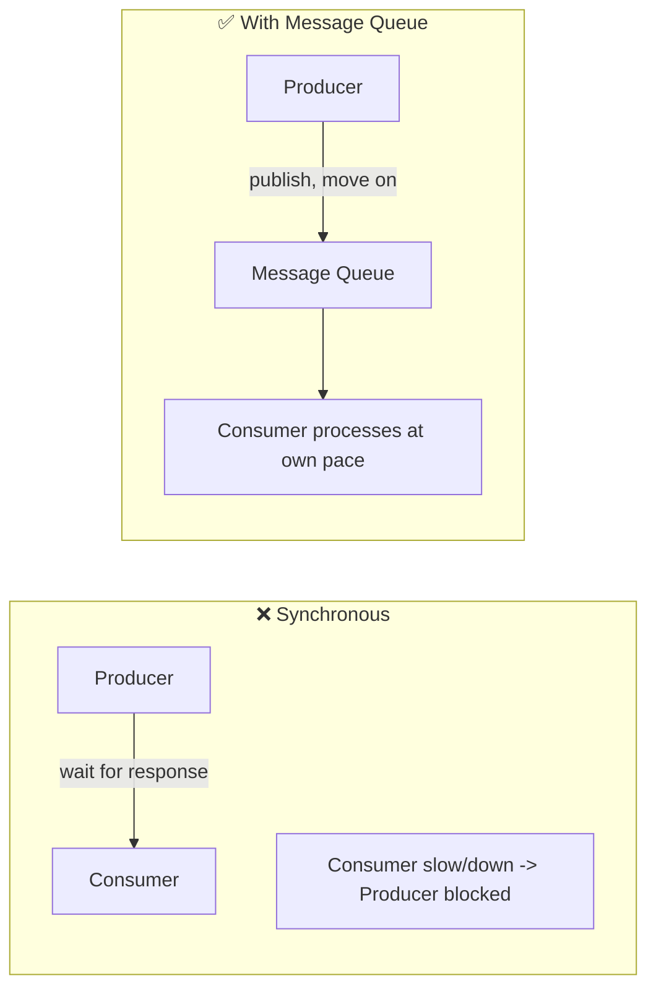
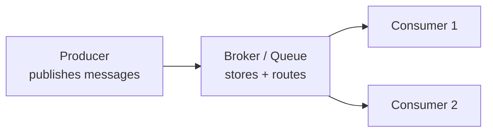
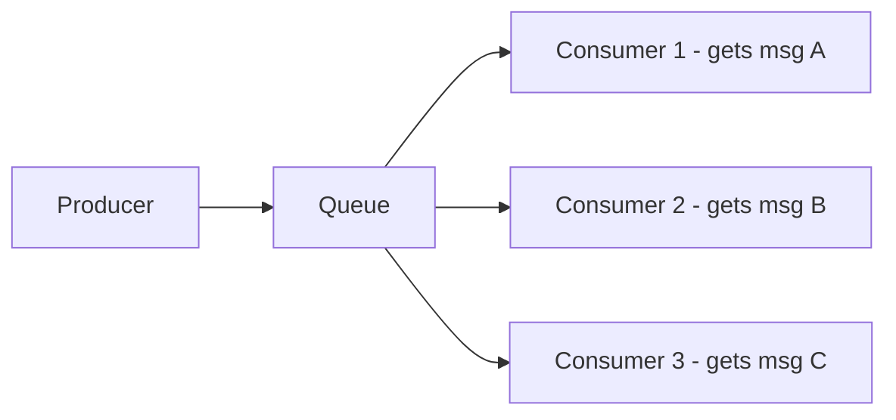
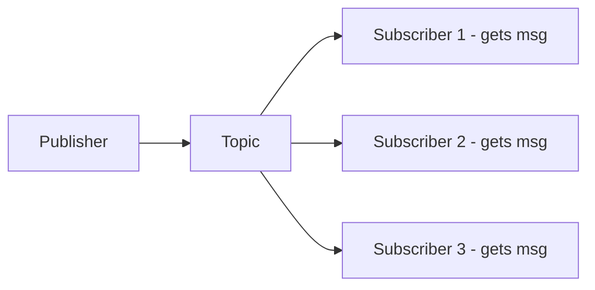
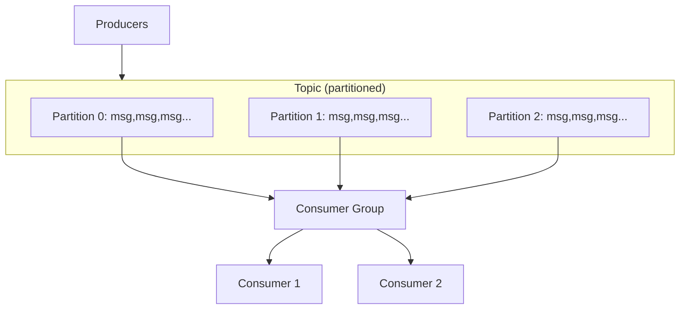
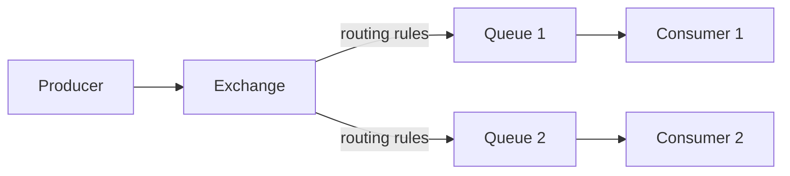
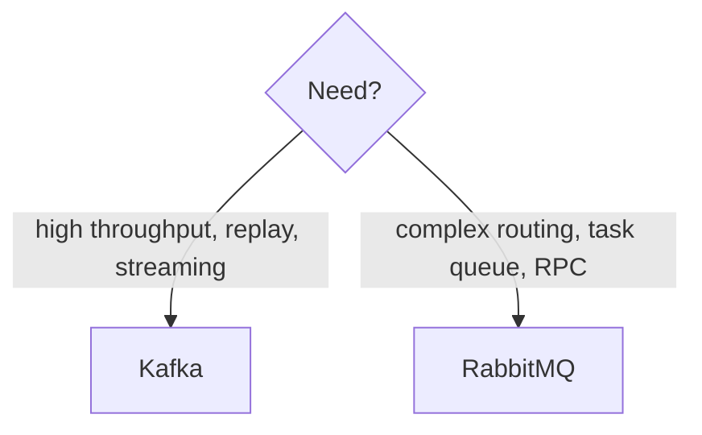
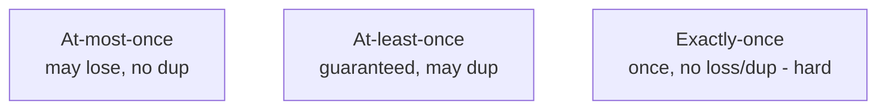
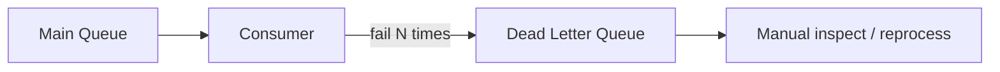

# 18. Message Queues — Kafka & RabbitMQ (Complete Deep Dive)

> Message queues **asynchronous communication** ka backbone hain. Producer message bhej ke aage
> badh jaata, consumer apni speed se process karta — decoupling, spike buffering, reliability. Ye
> file: message queues kyun, components, Kafka vs RabbitMQ architecture, queue vs pub-sub, delivery
> guarantees.

---

## 📑 Is file me
1. [Message queue kyun](#-message-queue-kyun)
2. [Core components + flow](#-core-components)
3. [Queue vs Pub-Sub](#-queue-vs-pub-sub)
4. [Kafka — deep](#-kafka--deep)
5. [RabbitMQ — deep](#-rabbitmq--deep)
6. [Kafka vs RabbitMQ](#-kafka-vs-rabbitmq)
7. [Delivery guarantees](#-delivery-guarantees)
8. [Challenges (ordering, duplicates, DLQ)](#-challenges)
9. [Interview Q&A](#-interview-qa)

---

## 🎯 Message Queue kyun

Synchronous communication me producer consumer ka wait karta (tight coupling). Agar consumer slow/
down → producer blocked. Message queue beech me buffer:

### Fayde
1. **Decoupling** — producer aur consumer independent (ek doosre ko nahi jaante, alag scale/deploy).
2. **Asynchronous** — producer wait nahi karta (fast response to user).
3. **Buffering / spike absorption** — traffic spike me messages queue me jama, consumers dheere
   process (backend overwhelm nahi).
4. **Reliability** — consumer down → messages queue me safe (lost nahi). Consumer wapas → process.
5. **Scalability** — multiple consumers (parallel processing), independent scaling.
6. **Load leveling** — uneven load smooth.

### Use cases
- **Notifications** — email/SMS/push (user wait na kare).
- **Video/image processing** — upload → queue → workers transcode.
- **Order processing** — order → queue → inventory/payment/shipping.
- **Log aggregation, analytics events, event streaming.**

---

## 🧩 Core Components

- **Producer** — message create + send karta.
- **Message** — data (payload) + metadata.
- **Broker / Queue** — messages store + route karta (Kafka broker, RabbitMQ exchange+queue).
- **Consumer** — messages receive + process karta.
- **Acknowledgement** — consumer confirm karta "processed" (broker phir delete/mark).

---

## 🔀 Queue vs Pub-Sub

Do fundamental messaging models:

### Queue (Point-to-Point)
Ek message **ek consumer** ko (work distribution). Multiple consumers → load balanced (har message
ek ko).

- **Use:** task distribution (ek task ek worker) — order processing, job queue.

### Pub-Sub (Publish-Subscribe)
Ek message **saare subscribers** ko (broadcast/fan-out).

- **Use:** event broadcasting (order placed → inventory + notification + analytics sab react karte).

| | Queue (P2P) | Pub-Sub |
|---|---|---|
| Message → | one consumer | all subscribers |
| Use | task distribution | event broadcasting |
| Example | SQS, RabbitMQ queue | Kafka topics, SNS |

---

## 🟢 Kafka — deep

**Apache Kafka** = distributed **event streaming platform** (log-based). Ultra-high throughput,
messages disk pe retained (replay possible).

### Architecture

**Key concepts:**
- **Topic** — category of messages ("orders", "clicks").
- **Partition** — topic ka shard (parallelism + ordering unit). Topic multiple partitions me split.
- **Offset** — consumer ki position in partition (kahan tak padha). Messages **retained on disk**
  → replay from any offset possible.
- **Producer** — messages topic ko bhejta (partition by key — same key → same partition).
- **Consumer Group** — consumers jo topic share karte. **Har partition ek consumer** (in group) ko
  → parallel + ordered per partition.
- **Broker** — Kafka server (multiple brokers = cluster).
- **Replication** — partitions replicated (leader + followers) → fault tolerant.

**Kafka kyun itna fast:**
- **Sequential disk writes** (append-only log — random writes se fast).
- **Zero-copy** (kernel se network directly).
- **Batching + compression.**

**Ordering:** guaranteed **per-partition only** (not across topic). Same key → same partition →
ordered.

**Use:** event streaming, log aggregation, analytics pipelines, high-throughput (millions/sec),
event sourcing, replay needed.

---

## 🔵 RabbitMQ — deep

**RabbitMQ** = traditional **message broker** (AMQP protocol). Flexible routing, message-per-
message.

### Architecture

**Key concepts:**
- **Exchange** — receives messages, routes to queues (based on rules).
- **Queue** — holds messages until consumed.
- **Binding** — exchange-to-queue routing rule.
- **Routing key** — message ka attribute (routing decide karta).

**Exchange types (routing):**
- **Direct** — routing key exact match → queue.
- **Fanout** — all bound queues (broadcast/pub-sub).
- **Topic** — pattern match (`order.*`).
- **Headers** — header-based routing.

**Message lifecycle:** produce → exchange → route → queue → consume → ack → delete. (Consume ke baad
usually delete — Kafka ke ulat jo retain karta.)

**Use:** task queues, RPC, complex routing, per-message reliability, moderate throughput.

---

## 🆚 Kafka vs RabbitMQ

| | **Kafka** | **RabbitMQ** |
|---|---|---|
| Type | distributed log (streaming) | message broker (AMQP) |
| Throughput | **very high** (millions/sec) | high (tens of thousands/sec) |
| Retention | disk, retained (replay) | consume → delete (usually) |
| Ordering | per-partition | per-queue |
| Routing | simple (topic/partition) | **flexible** (exchanges, patterns) |
| Model | pull (consumers poll) | push (broker pushes) |
| Use | event streaming, logs, analytics, replay | task queues, RPC, complex routing |
| Scaling | partitions | queues + clustering |

> **Kafka** — event streaming, high throughput, replay (analytics, logs, event sourcing).
> **RabbitMQ** — task distribution, flexible routing, traditional messaging.

---

## 📬 Delivery Guarantees

Message delivery ki 3 semantics:

- **At-most-once** — message ek baar ya kabhi nahi (fire-forget). Fast, may lose. (metrics jaha
  loss ok).
- **At-least-once** — guaranteed delivery, par **duplicate possible** (retry). Consumer **idempotent**
  hona chahiye. **Most common.**
- **Exactly-once** — ek hi baar (no loss, no dup). Hard + expensive (Kafka transactions). 

> ⭐ **Practical:** at-least-once + **idempotent consumer** = effectively exactly-once. Consumer
> message ID se dedup (processed store) → duplicate ignore.

---

## ⚠️ Challenges

### 1. Message ordering
- **Kafka** — per-partition ordered (same key → same partition → ordered). Across partitions no
  order.
- If global order needed → single partition (throughput sacrifice).

### 2. Duplicate messages
At-least-once me duplicates → **idempotent consumer** (message ID dedup, processed store).

### 3. Dead Letter Queue (DLQ)
Message repeatedly fail (poison message) → main queue block. **DLQ** me bhejo (after N retries) —
inspect/reprocess later.

### 4. Backpressure
Consumer slow → queue grows. Bounded queues, backpressure signal, scale consumers.

### 5. Message loss prevention
Producer acks (broker confirm), replication (partition copies), consumer ack after processing (not
before).

### 6. Consumer lag
Consumers producers se peeche (lag). Monitor lag, scale consumers, optimize processing.

---

## 🏗️ Common patterns
- **Outbox pattern** — DB write + event publish atomicity (DB outbox table → CDC → queue).
- **Event sourcing** — state = event log (Kafka retained log).
- **CQRS** — write events → queue → read models updated.
- **Saga** — distributed transaction via events (choreography).

---

## 💬 Interview Q&A

**Q: Message queue kyun use karein?**
Decoupling (producer/consumer independent), async (fast response), spike buffering (queue absorbs),
reliability (consumer down → messages safe), scalability (parallel consumers).

**Q: Queue vs pub-sub?**
Queue — one message → one consumer (task distribution). Pub-sub — one message → all subscribers
(broadcast). SQS/RabbitMQ-queue vs Kafka-topics/SNS.

**Q: Kafka vs RabbitMQ?**
Kafka — distributed log, high throughput, retention/replay, streaming/analytics. RabbitMQ — broker,
flexible routing, task queues/RPC, per-message.

**Q: Kafka me ordering kaise?**
Per-partition only. Same key → same partition → ordered. Global order → single partition (throughput
cost).

**Q: Delivery guarantees?**
At-most-once (may lose), at-least-once (may duplicate — idempotent consumer), exactly-once (hard).
Practical: at-least-once + idempotent = effectively exactly-once.

**Q: Duplicate messages kaise handle?**
Idempotent consumer — message ID dedup (processed store), duplicate ignore. At-least-once inherent.

**Q: Dead letter queue?**
Repeatedly failing message (poison) → DLQ (after N retries) — main queue block na kare. Inspect/
reprocess later.

**Q: Kafka fast kyun?**
Sequential disk writes (append-only log), zero-copy, batching + compression, partitioning
(parallelism).

---

## 📝 Summary
- **Message queue** = async communication (decouple, buffer, reliable, scalable).
- **Queue** (one consumer, task) vs **Pub-Sub** (all subscribers, broadcast).
- **Kafka** — distributed log, partitions, offsets, retention/replay, high throughput (streaming).
- **RabbitMQ** — broker, exchanges/routing, task queues (flexible routing).
- **Delivery:** at-most/at-least/exactly-once. Practical = at-least-once + idempotent consumer.
- **Challenges:** ordering (per-partition), duplicates (idempotent), DLQ (poison messages),
  backpressure, consumer lag.
