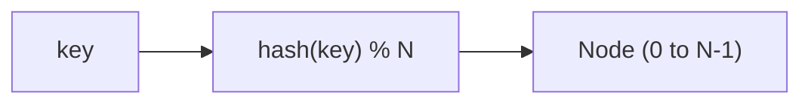
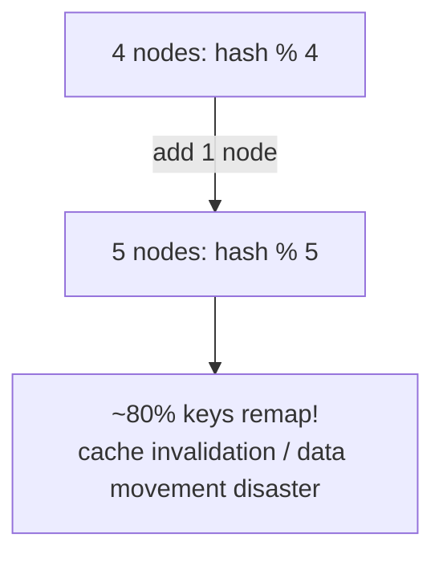
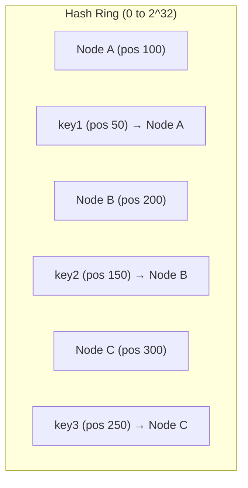
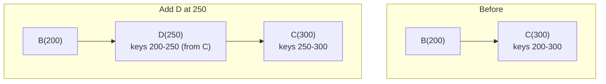
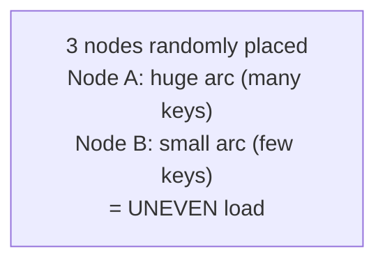
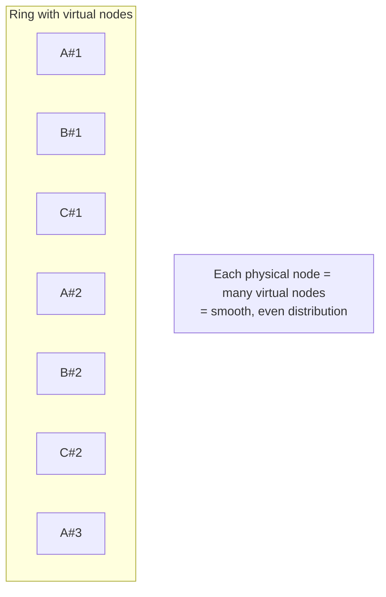
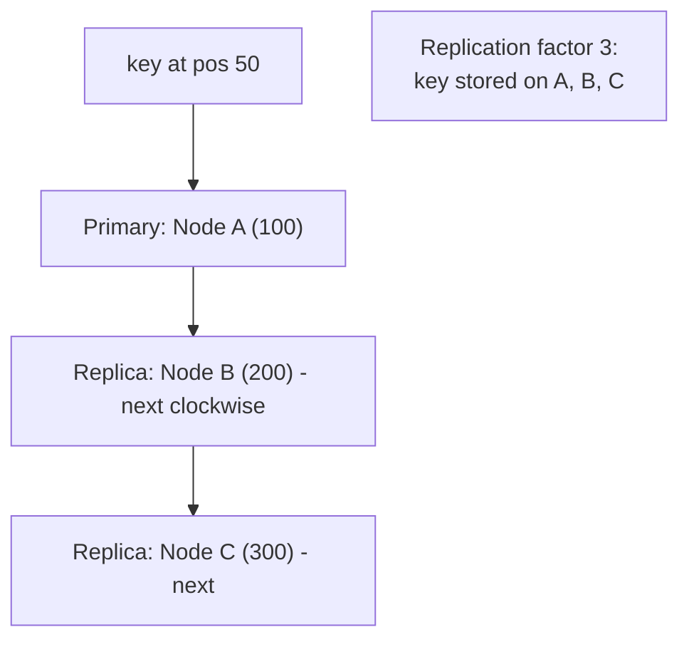
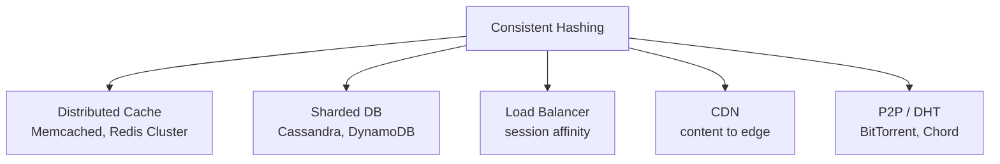

# 19. Consistent Hashing (Complete Deep Dive)

> Consistent hashing distributed systems ka **fundamental technique** hai — data ko nodes me
> distribute karne ke liye **taaki node add/remove pe minimal data movement** ho. Ye distributed
> caches, sharded databases, aur load balancers me use hota. Interview me guaranteed poochha jaata.

---

## 📑 Is file me
1. [Problem: simple hashing (mod N) kyun fail](#-problem-simple-hashing-modulo)
2. [Consistent hashing — kaise kaam karta](#-consistent-hashing-solution)
3. [Node add/remove](#-node-add--remove)
4. [Virtual nodes (zaroori)](#-virtual-nodes)
5. [Replication with consistent hashing](#-replication)
6. [Use cases](#-use-cases)
7. [Variants](#-variants)
8. [Interview Q&A](#-interview-qa)

---

## 🎯 Problem: Simple Hashing (Modulo)

Data ko N nodes me distribute karna hai. Simple approach: `hash(key) % N`.



Example: 4 nodes, `hash(key) % 4` → node.
```
key1: hash=100 % 4 = 0 -> Node 0
key2: hash=101 % 4 = 1 -> Node 1
key3: hash=102 % 4 = 2 -> Node 2
```

### Problem — node add/remove pe DISASTER
Ek node add karo (N: 4 → 5). Ab `% 5`:
```
key1: hash=100 % 5 = 0 (tha Node 0, still 0 — lucky)
key2: hash=101 % 5 = 1 (tha Node 1, still 1)
key3: hash=102 % 5 = 2 (tha Node 2, still 2)
key4: hash=103 % 4 = 3 -> % 5 = 3
key5: hash=104 % 4 = 0 -> % 5 = 4  (MOVED!)
...most keys remap!
```

`N` badalne se **almost saari keys remap** ho jaati (different node). Impact:
- **Distributed cache** — saara cache invalid (mass cache miss → DB overwhelmed — cache stampede).
- **Sharded DB** — massive data movement (rebalancing) — downtime, load.



> ⚠ Simple modulo hashing distributed systems me **unusable** for dynamic nodes (jo aksar
> scale up/down hote).

---

## ✅ Consistent Hashing Solution

**Idea:** nodes aur keys **dono** ko ek **hash ring** (circle, 0 to 2^32-1) pe map karo. Key ko
ring pe **clockwise nearest node** assign hota.



### Kaise kaam karta
1. **Nodes ko ring pe place karo** — `hash(node_id)` → ring position.
2. **Keys ko ring pe place karo** — `hash(key)` → ring position.
3. **Assignment** — key se **clockwise** move karo, jo pehla node mile wo key ka owner.

```
Ring positions: A=100, B=200, C=300
key at 50  -> clockwise -> A (100)
key at 150 -> clockwise -> B (200)
key at 250 -> clockwise -> C (300)
key at 350 -> clockwise -> wraps to A (100)
```

---

## 🔄 Node Add / Remove

Yahan consistent hashing ki **magic** hai — node add/remove pe sirf **1/N keys move** (na ki sab).

### Node add
Node D add karo (pos 250). Sirf **B aur D ke beech ki keys** (jo pehle C ki thi) ab D ki hoti.
Baaki sab **unchanged**.

Sirf keys 200-250 (jo C ki thi) → D. **Baaki keys touched nahi.** Only ~1/N keys moved.

### Node remove
Node B remove karo. B ki keys **next clockwise node** (C) ko jaati. Baaki unchanged.
```
B removed -> B's keys go to C (next clockwise). Only B's keys affected.
```

> ⭐ **Result:** node add/remove pe sirf **1/N keys** (adjacent) move (average), na ki saari.
> Cache invalidation minimal, data movement minimal. Yahi consistent hashing ka core benefit.

---

## 🎡 Virtual Nodes

### Problem — uneven distribution
Kam nodes ho to ring pe unevenly distributed (ek node ko bada arc = zyada keys). Aur node remove
pe uski saari keys ek node pe (uneven load).



### Solution — Virtual Nodes (vnodes)
Har physical node ko ring pe **multiple positions** (virtual nodes) pe rakho. E.g. Node A → A1,
A2, A3, ... (100+ points). Isse:
- **Even distribution** — many small arcs (smooth spread).
- **Even rebalancing** — node remove pe uski keys **multiple nodes** me distribute (na ki ek pe).



- **More vnodes** = more even distribution (but more metadata).
- Cassandra, DynamoDB, Riak — sab vnodes use karte (typically 100-256 per node).

---

## 🔁 Replication

Consistent hashing + replication — data ki copies for fault tolerance. Key ko clockwise **N nodes**
pe replicate (primary + N-1 replicas).



Key clockwise next N distinct physical nodes pe (replication factor N). Node fail → replica serve.
Dynamo/Cassandra ye karte.

---

## 🎯 Use Cases



1. **Distributed cache** — keys ko cache nodes me distribute. Node add/remove pe minimal cache
   miss (Memcached client-side, Redis Cluster).
2. **Sharded databases** — data partitioning (Cassandra, DynamoDB) — resharding aasan.
3. **Load balancers** — session affinity (same client → same server, minimal remap on scale).
4. **CDN** — content → edge servers.
5. **P2P / DHT** — Chord, BitTorrent (distributed hash tables).

---

## 🔬 Variants
- **Consistent hashing with bounded loads** — koi node capacity limit cross na kare (overflow →
  next node). Google use karta (even under skew).
- **Jump consistent hash** — no storage, fast, even (Google). Par sirf "add at end" (arbitrary
  remove nahi).
- **Rendezvous (HRW) hashing** — har key ke liye har node ka score `hash(key, node)`, highest
  jeetta. No ring, good distribution, simple.

---

## 🛠️ Repo me
[`LoadBalancer_LLD`](../LLD/LoadBalancer_LLD/) — LB strategies (round robin, least connections).
Consistent hashing strategy extend kar sakte. Concept HLD-level, LLD me hash ring implement karna
ek achha exercise.

---

## 💬 Interview Q&A

**Q: Consistent hashing kya, kyun?**
Data ko nodes me distribute karne ki technique jaha node add/remove pe **sirf 1/N keys move** (na ki
sab). Simple `hash % N` me N badalne se saari keys remap (cache invalidation / data movement
disaster).

**Q: Simple modulo hashing ka problem?**
`hash(key) % N` — N badalne (node add/remove) pe almost saari keys remap → mass cache miss / data
movement. Dynamic nodes me unusable.

**Q: Consistent hashing kaise kaam karta?**
Nodes + keys dono hash ring (0 to 2^32) pe. Key clockwise nearest node ko. Node add → sirf uske aur
previous ke beech ki keys move (1/N).

**Q: Virtual nodes kyun?**
Kam nodes = uneven distribution (ek node bada arc) + node remove pe saari keys ek node pe. Vnodes
(har node ke multiple ring positions) = even distribution + even rebalancing.

**Q: Node add pe kitni keys move?**
Average 1/N (sirf adjacent node ki kuch keys). Baaki keys unchanged. Yahi core benefit.

**Q: Consistent hashing kaha use?**
Distributed cache (Memcached/Redis Cluster), sharded DB (Cassandra/DynamoDB), load balancer session
affinity, CDN, P2P/DHT.

**Q: Replication consistent hashing me kaise?**
Key clockwise next N distinct nodes pe (replication factor N — primary + replicas). Node fail →
replica serve.

---

## 📝 Summary
- **Problem:** `hash % N` — node add/remove → saari keys remap (cache miss / data movement disaster).
- **Consistent hashing:** nodes + keys ring pe (0-2^32), key → clockwise nearest node.
- **Node add/remove:** sirf **1/N keys move** (adjacent) — minimal disruption.
- **Virtual nodes:** har node ke multiple ring positions → even distribution + rebalancing.
- **Replication:** key → clockwise N nodes (primary + replicas).
- **Use:** distributed cache, sharded DB, LB affinity, CDN, DHT.
- **Variants:** bounded loads, jump hash, rendezvous.
