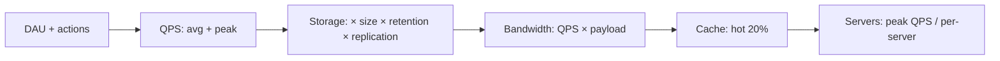

# 20. Back-of-the-Envelope Calculations (Complete Deep Dive)

> System design interview me capacity estimate karna padta — QPS, storage, bandwidth, memory,
> servers. "Back-of-envelope" = quick approximate math (exact nahi, order-of-magnitude). Ye file:
> numbers to memorize, estimation formulas, aur step-by-step worked examples.

---

## 📑 Is file me
1. [Kyun estimate karte](#-kyun-estimation)
2. [Numbers to memorize](#-numbers-to-memorize)
3. [Estimation formulas](#-estimation-formulas)
4. [Worked example: TinyURL](#-worked-example-tinyurl)
5. [Worked example: Twitter](#-worked-example-twitter)
6. [Worked example: Chat/WhatsApp](#-worked-example-chat)
7. [Estimation tips](#-estimation-tips)
8. [Interview Q&A](#-interview-qa)

---

## 🎯 Kyun Estimation

Interview me scale ka andaaza lagana zaroori — taaki design decisions **ground pe** ho:
- **QPS** se pata chale caching/sharding zaroori hai ya nahi.
- **Storage** se pata chale DB choice aur sharding.
- **Bandwidth** se pata chale CDN zaroori.
- **Memory** se pata chale cache size.

Numbers se justify — "read-heavy (100:1) hai isliye cache + replicas." "91 TB storage isliye
sharding." Ye maturity dikhata.

> ⭐ **Goal:** order of magnitude (GB vs TB vs PB), exact number nahi. Round aggressively.

---

## 🔢 Numbers to Memorize

### Latency numbers (har engineer ko pata)
| Operation | Time |
|---|---|
| L1 cache reference | ~1 ns |
| Branch mispredict | ~3 ns |
| L2 cache reference | ~4 ns |
| Mutex lock/unlock | ~17 ns |
| Main memory (RAM) reference | ~100 ns |
| Compress 1 KB | ~2 μs |
| SSD random read | ~16 μs |
| Read 1 MB sequentially from memory | ~4 μs |
| Round trip within datacenter | ~500 μs |
| Read 1 MB from SSD | ~200 μs |
| Disk (HDD) seek | ~10 ms |
| Read 1 MB from disk | ~20 ms |
| Round trip India → US | ~150 ms |

> **Takeaway:** RAM ~1000x faster than SSD, SSD ~1000x faster than cross-continent network. Isliye
> caching (memory) itni impactful.

### Data size units
| Unit | Power | Approx |
|---|---|---|
| KB | 2^10 | ~1 thousand |
| MB | 2^20 | ~1 million |
| GB | 2^30 | ~1 billion |
| TB | 2^40 | ~1 trillion |
| PB | 2^50 | ~1 quadrillion |

### Data type sizes
```
char (ASCII)  = 1 byte
int           = 4 bytes
long/timestamp= 8 bytes
UUID          = 16 bytes
```

### Time shortcuts
```
1 day     = 86,400 sec ≈ 10^5 (round to 100K for quick math)
1 month   ≈ 2.5 million sec
1 year    ≈ 31.5 million sec ≈ 3 × 10^7
```

### Availability (nines)
| Availability | Downtime/year |
|---|---|
| 99% | 3.65 days |
| 99.9% | 8.76 hours |
| 99.99% | 52 minutes |
| 99.999% | 5.26 minutes |

---

## 🧮 Estimation Formulas

```
QPS (average) = (DAU × actions_per_user_per_day) / 86,400

QPS (peak)    = 2 to 3 × average QPS

Storage       = records/day × size_per_record × retention_days × replication_factor

Bandwidth     = QPS × average_payload_size

Cache size    = hot_data_fraction × total_data   (usually 20% = 80% traffic — Pareto)

Servers       = peak_QPS / QPS_per_server
```

**Handy conversions:**
- 1 million requests/day ≈ 12 QPS (1M / 86400)
- 100 million/day ≈ 1160 QPS
- 1 billion/day ≈ 11,600 QPS

---

## 📝 Worked Example: TinyURL

**Assumptions:** 100M new URLs/day, read:write = 100:1.

### QPS
```
Writes/sec = 100M / 86,400 ≈ 1,160 writes/sec
Reads/sec  = 100 × 1,160 ≈ 116,000 reads/sec
Peak reads ≈ 2-3× ≈ ~300,000 reads/sec
```
→ **READ-HEAVY** → caching + read replicas critical.

### Storage
```
Per URL: shortCode (7 bytes) + longURL (~100 bytes) + metadata (~50 bytes) ≈ 500 bytes
5 years: 100M/day × 365 × 5 = 182 billion URLs
Storage = 182 × 10^9 × 500 bytes = 91 × 10^12 bytes = ~91 TB
```
→ Single DB nahi (91 TB) → sharding.

### Cache
```
Hot 20% URLs = 80% traffic. Cache top hot URLs:
Daily reads ≈ 116K/s × 86400 ≈ 10 billion reads/day
Cache few GB of hottest URLs (memory) → 80% cache hit → DB load 5x kam
```

### Bandwidth
```
Read bandwidth = 116K reads/s × 500 bytes ≈ 58 MB/s
```

---

## 📝 Worked Example: Twitter

**Assumptions:** 300M MAU, 50% DAU = 150M DAU. Avg 2 tweets/user/day, 100 timeline views/user/day.

### QPS
```
Tweets/day = 150M × 2 = 300M
Write QPS = 300M / 86,400 ≈ 3,500 tweets/sec (peak ~10K/sec)

Timeline reads/day = 150M × 100 = 15 billion
Read QPS = 15B / 86,400 ≈ 173,000 reads/sec (peak ~500K/sec)

Read:Write ≈ 50:1 → READ-HEAVY → pre-computed timelines + cache
```

### Storage (tweets)
```
Per tweet: text (~300 bytes) + metadata
Daily: 300M × 300 bytes = 90 GB/day
5 years: 90 GB × 365 × 5 ≈ 164 TB (text only)
Media (images/video) → separate on S3 (much larger)
```

### Cache (timelines)
```
150M DAU × 800 tweets/timeline × 8 bytes (tweetId) ≈ 1 TB timeline cache (Redis)
```

---

## 📝 Worked Example: Chat (WhatsApp)

**Assumptions:** 500M DAU, 40 messages/user/day.

### QPS
```
Messages/day = 500M × 40 = 20 billion
Write QPS = 20B / 86,400 ≈ 230,000 messages/sec (peak ~700K/sec)
```

### Storage
```
Per message: ~100 bytes (text + metadata)
Daily: 20B × 100 bytes = 2 TB/day (if retained)
30-day retention: 2 TB × 30 = 60 TB
```

### Connections
```
500M concurrent WebSocket connections
Per server ~65K connections → 500M / 65K ≈ 8,000 connection servers
```

---

## 💡 Estimation Tips

1. **Round aggressively** — 86,400 ≈ 100,000 (10^5). 365 ≈ 400. Speed > precision.
2. **Read:write ratio pehle poocho** — decides caching importance.
3. **State assumptions** — "maano avg tweet 300 bytes" (interviewer correct karega).
4. **Order of magnitude** — GB vs TB vs PB (exact number nahi).
5. **Storage = count × size × retention × replication.**
6. **Peak = 2-3× average** (traffic uneven — daily peaks).
7. **Break into steps** — QPS → storage → bandwidth → cache → servers (systematic).
8. **Powers of 2 + 10** — 2^10 ≈ 10^3, 2^20 ≈ 10^6, 2^30 ≈ 10^9.
9. **80/20 rule** — 20% data = 80% traffic (cache hot 20%).
10. **Sanity check** — result reasonable? (91 TB for 5 years URLs — sounds right).



---

## 🖥️ Rough single-server capacity (order of magnitude)
```
~1,000s QPS (simple requests)
~10-100 GB RAM
~TBs disk
Beyond this → scale horizontally (add servers)
```
Use to estimate server count: `servers = peak_QPS / per_server_QPS`.

---

## 💬 Interview Q&A

**Q: QPS kaise estimate karoge?**
`(DAU × actions/day) / 86,400`. Peak = 2-3× average. E.g. 100M writes/day ≈ 1,160 writes/sec.

**Q: Storage kaise estimate?**
`records/day × size_per_record × retention_days × replication_factor`. E.g. 100M URLs/day × 500
bytes × 5 years ≈ 91 TB.

**Q: Read-heavy vs write-heavy kaise pata + impact?**
Read:write ratio poocho. Read-heavy (100:1) → cache + read replicas + CDN. Write-heavy → sharding +
message queue + write-optimized DB.

**Q: Latency numbers?**
RAM ~100ns, SSD ~16μs, datacenter RT ~500μs, disk seek ~10ms, cross-continent ~150ms. RAM 1000x
faster than SSD → cache matters.

**Q: Cache size kaise decide?**
80/20 rule — hot 20% data = 80% traffic. Cache hot 20% (memory) → high hit ratio, DB load kam.

**Q: Estimation me kya round karte?**
86,400 → 100K, 365 → 400, powers of 2 → powers of 10. Order of magnitude, not exact.

---

## 📝 Summary
- **Estimate** to ground design decisions (caching, sharding, CDN, server count).
- **Numbers:** latency (RAM 100ns, SSD 16μs, disk 10ms, network 150ms), data sizes (KB→PB), 1 day
  ≈ 86,400 sec ≈ 10^5, availability nines.
- **Formulas:** QPS = DAU × actions / 86400 (peak 2-3×), storage = count × size × retention ×
  replication, bandwidth = QPS × payload, cache = hot 20%.
- **Steps:** QPS → storage → bandwidth → cache → servers.
- **Tips:** round aggressively, read:write ratio, state assumptions, order of magnitude, 80/20.
