# 21. Database Sharding (Complete Deep Dive)

> Sharding = database ko **multiple machines me todna** taaki ek machine ki limits (storage, write
> throughput, connections) cross ki ja sakein. Ye write-scaling ka ultimate tool hai — par **most
> complex** bhi. Is file me: sharding kya/kyun/kab, saari strategies, shard key selection,
> resharding, cross-shard problems, hotspots — sab detail me.

---

## 📑 Is file me
1. [Sharding kya + kyun](#-sharding-kya-hai)
2. [Sharding se pehle (kab NAHI)](#-sharding-se-pehle-alternatives)
3. [Sharding strategies (5 detailed)](#-sharding-strategies)
4. [Shard key selection (critical)](#-shard-key-selection-sabse-critical)
5. [Resharding / rebalancing](#-resharding--rebalancing)
6. [Cross-shard problems](#-cross-shard-problems)
7. [Hotspots / celebrity problem](#-hotspots--celebrity-problem)
8. [Sharding + replication](#-sharding--replication)
9. [Interview Q&A](#-interview-qa)

---

## 🎯 Sharding kya hai

**Sharding** (horizontal partitioning) = data ko **rows ke basis pe** multiple databases (shards)
me baato. Har shard subset of data handle karta, apni alag machine pe.

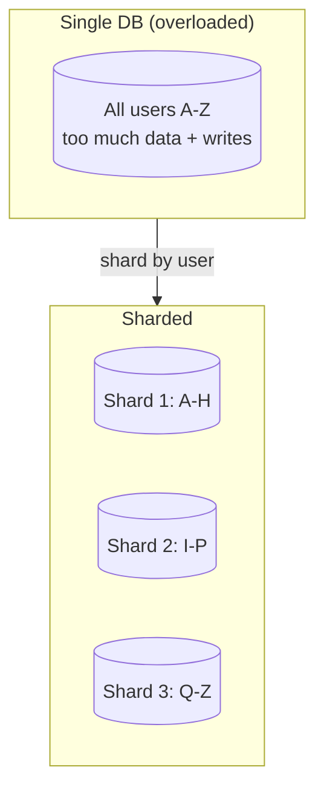

**Sharding vs Partitioning vs Replication:**
- **Partitioning** — ek DB ke andar data split (logical). Vertical (columns) ya horizontal (rows).
- **Sharding** — horizontal partitions **alag machines** pe (partitioning + distribution).
- **Replication** — data ki **copies** (fault tolerance + read scaling). Sharding = split (scale),
  replication = copy (HA). **Dono saath use hote** (replicated shards).

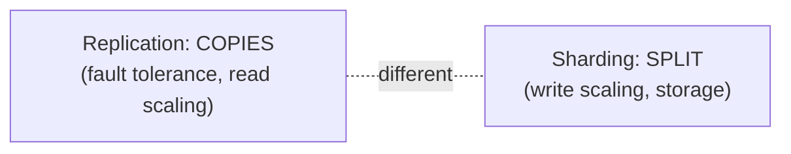

### Kyun sharding
1. **Storage limit** — data ek machine me nahi aata (100 TB > single machine).
2. **Write throughput** — ek DB writes handle nahi kar pa raha (read replicas se writes scale nahi
   hote — sab master pe).
3. **Connection limit** — ek DB ki max connections cross.
4. **Query performance** — smaller data per shard = faster queries.

---

## ⚠️ Sharding se pehle (Alternatives)

**Sharding LAST RESORT hai** — bahut complexity laata (cross-shard queries, transactions,
rebalancing). Pehle ye try karo:

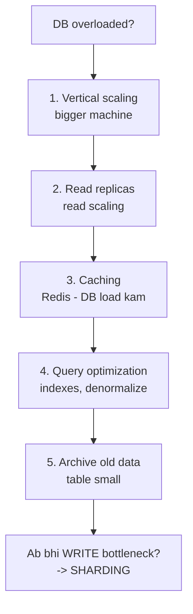

> ⭐ **Interview line:** "Sharding se pehle main vertical scaling + read replicas + caching + query
> optimization try karunga. Jab **writes** ek master handle na kar paaye, tab sharding."
> Read replicas se **reads** scale hote (writes nahi — sab master pe). Isliye write-bottleneck ke
> liye sharding.

---

## 🗂️ Sharding Strategies

Data ko shards me **kaise** distribute karein — 5 strategies:

### 1. Range-Based Sharding
Key range se shards. `A-M → Shard 1, N-Z → Shard 2`. Ya user_id `1-1000 → S1, 1001-2000 → S2`.
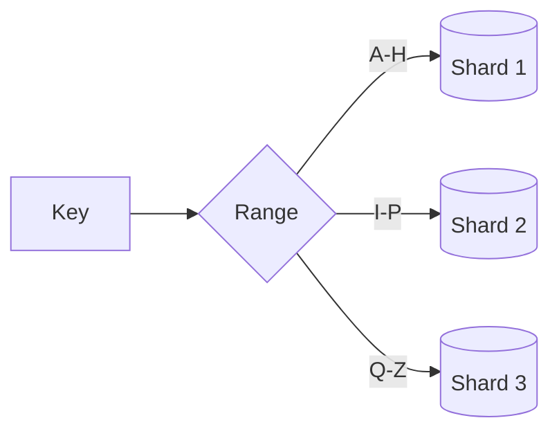
- ✅ **Range queries efficient** (`WHERE date BETWEEN` → few shards), simple.
- ❌ **Hotspots** — uneven distribution (jyada users "A-H" me → Shard 1 overloaded). Manual
  rebalancing.
- **Use:** range queries important (time-series by date), predictable distribution.

### 2. Hash-Based Sharding
`hash(key) % N` → shard. Even distribution.
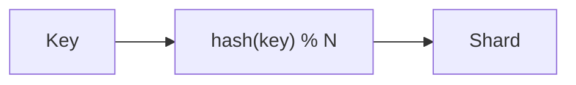
- ✅ **Even distribution** (hash spreads uniformly), no hotspots.
- ❌ **Range queries inefficient** (adjacent keys different shards → all shards scan). **Resharding
  painful** (`% N` changes → most data moves).
- **Use:** even load, point queries (by key).

### 3. Consistent Hashing
Hash ring — node add/remove pe sirf 1/N keys move (na ki sab). [Full: `19_Consistent_Hashing.md`]
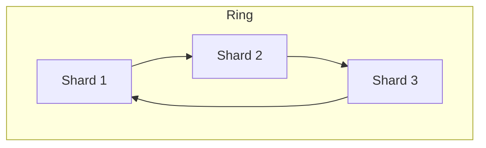
- ✅ **Resharding easy** (minimal data movement), even (with virtual nodes).
- ❌ Complex, still range-query issue.
- **Use:** dynamic scaling (Cassandra, DynamoDB).

### 4. Directory-Based Sharding
Ek **lookup table** (key → shard mapping). Flexible.
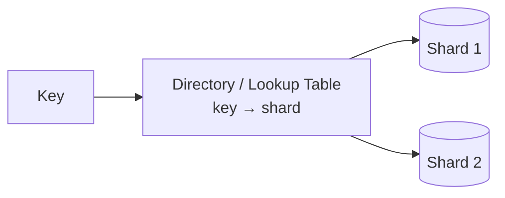
- ✅ **Flexible** (any mapping, easy rebalance — just update directory), can move individual keys.
- ❌ **Directory = SPOF/bottleneck** (every query looks up directory), extra hop. Directory ko
  replicate/cache.
- **Use:** flexible rebalancing needed, complex mappings.

### 5. Geo-Based Sharding
Location se shard. `India users → India shard, US → US shard`.
- ✅ **Low latency** (data local to users), compliance (data residency — GDPR).
- ❌ **Uneven** (populous regions overloaded).
- **Use:** geo-distributed apps, compliance requirements.

### Strategy comparison
| Strategy | Distribution | Range queries | Resharding | Use |
|---|---|---|---|---|
| Range | uneven (hotspots) | ✅ efficient | manual | time-series, range queries |
| Hash | even | ❌ all shards | painful (%N) | even load, point queries |
| Consistent hash | even (vnodes) | ❌ | easy (1/N) | dynamic scaling |
| Directory | flexible | depends | easy | complex mappings |
| Geo | uneven | region-local | region-based | geo apps, compliance |

---

## 🔑 Shard Key Selection (SABSE CRITICAL)

Shard key = wo column jispe data distribute hota. **Galat shard key = poora system suffer.** Ye
sabse important decision hai.

### Achha shard key ke properties
1. **High cardinality** — bahut unique values. `user_id` (millions) ✅. `gender` (2-3 values) ❌
   (sirf 2-3 shards possible).
2. **Even distribution** — koi ek shard overloaded na ho (uniform spread).
3. **Query isolation** — common queries **ek shard** se satisfy ho (cross-shard avoid). E.g. shard
   by `user_id` → user ki saari orders ek shard (order history fast).
4. **Monotonic NA ho** — auto-increment/timestamp key = **saara naya data ek shard** (latest shard
   hot, purane idle — hotspot). ⚠

### Examples
```
E-commerce orders:
  shard by customer_id → customer ki orders ek shard (history query fast) ✅
  
Chat messages:
  shard by conversation_id → conversation ek shard (message history fast) ✅

Social media:
  shard by user_id → user data + posts ek shard ✅

Time-series:
  shard by timestamp → ❌ all new data one shard (hotspot!)
  better: shard by (device_id, time_bucket) → distributed
```

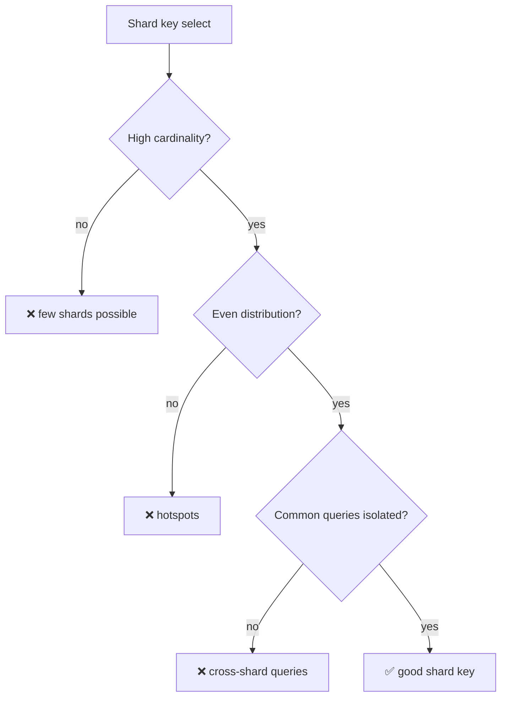

> ⚠ **Anti-pattern:** shard by timestamp/auto-increment → aaj ka saara traffic ek shard (hot),
> purane shards idle. Always avoid monotonic shard keys.

---

## 🔄 Resharding / Rebalancing

Data grow → shards add karne padte. Ye sabse mushkil operational task.

### Problem with hash % N
`N` badalne se (`% 4` → `% 5`) **almost saari data** remap → massive movement + downtime.

### Solutions
1. **Consistent hashing** — sirf 1/N keys move (adjacent). [`19_...`]
2. **Pre-splitting / virtual shards** — logical shards (e.g. 1024) physical nodes pe map. Node add
   → kuch virtual shards move (poora rehash nahi).
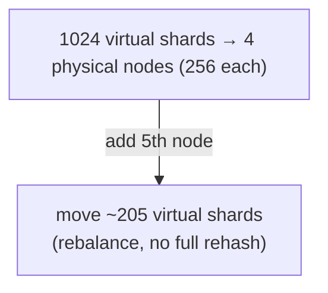
MongoDB, many systems ye karte — logical layer se physical decouple.

3. **Live migration (zero downtime):**
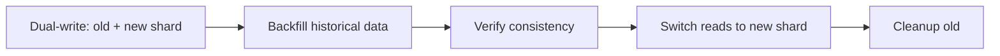
Dual writes (old + new), backfill, verify, switch, cleanup. Feature flags for rollback.

---

## 🔗 Cross-Shard Problems

Sharding ke saath ye problems aate (aur unke solutions):

### 1. Cross-shard queries
Query jo multiple shards se data chahiye (`WHERE age > 25` — age shard key nahi). Solution:
**scatter-gather** (query all shards parallel, merge results) — slow. Avoid via good shard key.
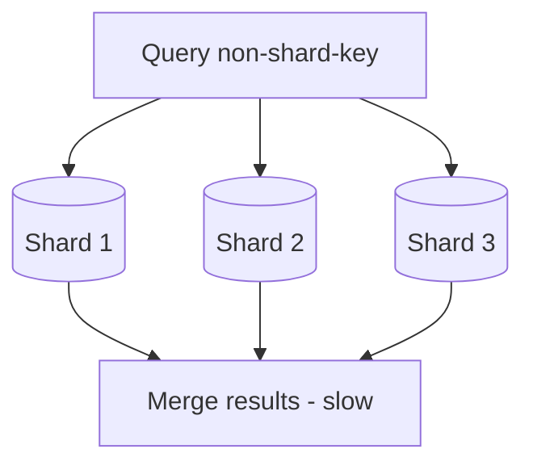

### 2. Cross-shard joins
Join across shards **mushkil/impossible**. Solutions:
- **Denormalize** — related data embed (join ki zaroorat nahi).
- **Co-location** — related data same shard pe (shard by common key — user + user's orders same shard).
- **Application-level join** — fetch from shards, join in app.

### 3. Cross-shard transactions
Ek transaction jo multiple shards touch kare (order in Shard 1, inventory in Shard 2 — atomic?).
- **2PC (Two-Phase Commit)** — atomic but blocking, slow. Avoid at scale.
- **Saga** — local transactions + compensations (eventual consistency).
- **Best:** design so transactions **stay within a shard** (co-locate related data).

### 4. Global secondary index
Query on non-shard-key field (email jab shard by user_id). Solution: separate index table (sharded
by email) ya search engine (Elasticsearch).

### 5. Aggregations
`COUNT(*)`, `SUM` across shards → scatter-gather + merge, ya pre-computed aggregates, ya OLAP DB.

### 6. Referential integrity
Foreign keys across shards impossible → application-level integrity checks.

---

## 🔥 Hotspots / Celebrity Problem

Ek shard pe **disproportionate load** — bad shard key ya skewed data.

**Celebrity problem:** ek user (celebrity, 100M followers) ka data/traffic ek shard overwhelm karta.
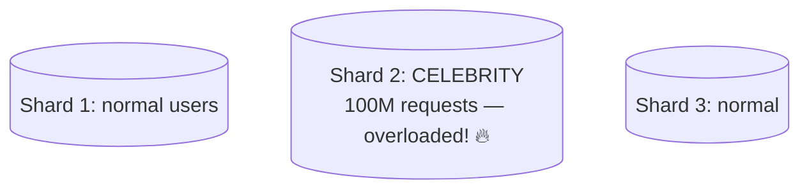

**Fixes:**
- **Cache hot data** — celebrity data Redis me (DB shard bacha).
- **Split hot shard** — hot key ko further partition (`celebrity_id#bucket`).
- **Add randomness** — shard key me suffix (`user_id#random` → spread across shards).
- **Dedicated resources** — hot shard ko more capacity.
- **Read replicas for hot shard** — reads distribute.

**Detection:** monitor per-shard QPS/latency/storage — imbalance → hotspot.

---

## 🔁 Sharding + Replication

Real systems **dono** use karte — har shard ki replicas (scale + HA):

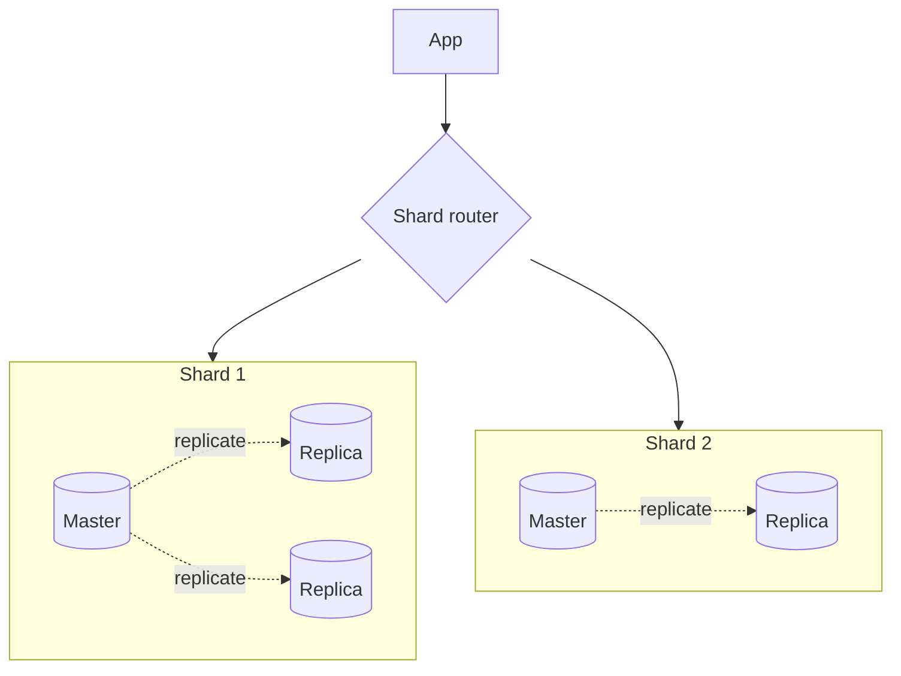

- **Sharding** — data split (write scaling + storage).
- **Replication** — har shard ki copies (HA + read scaling within shard).
- Har shard ka apna master (writes) + replicas (reads + failover).

---

## 🌍 Real-world
- **Instagram** — sharded PostgreSQL (by user_id), logical shards on physical nodes.
- **Cassandra/DynamoDB** — consistent hashing, auto-sharding.
- **MongoDB** — sharded clusters (range/hash/zone sharding), config servers for metadata.
- **Vitess (YouTube)** — MySQL sharding layer.

---

## 💬 Interview Q&A

**Q: Sharding kya, kyun?**
Data ko rows ke basis pe multiple DBs (shards) me split — write scaling + storage (single DB limits
cross). Har shard subset, alag machine.

**Q: Sharding se pehle kya try karoge?**
Vertical scaling → read replicas (read scaling) → caching → query optimization → archive. Sharding
last resort (complexity). Read replicas se **reads** scale (writes nahi — isliye write-bottleneck ke
liye sharding).

**Q: Sharding strategies?**
Range (range queries good, hotspots), Hash (even, resharding painful), Consistent hash (easy
resharding), Directory (flexible, SPOF), Geo (latency/compliance, uneven).

**Q: Shard key kaise choose?**
High cardinality (many values), even distribution (no hotspot), query isolation (common queries one
shard), NOT monotonic (timestamp = hotspot). E.g. user_id, conversation_id.

**Q: Cross-shard query/join kaise handle?**
Query: scatter-gather (all shards + merge — slow, avoid). Join: denormalize / co-locate related
data same shard / app-level join. Design to avoid via good shard key.

**Q: Cross-shard transaction?**
2PC (atomic, blocking — avoid) ya Saga (compensations, eventual). Best: co-locate related data →
transaction within one shard.

**Q: Resharding kaise (zero downtime)?**
Consistent hashing (1/N move) ya virtual shards (logical → physical). Live migration: dual-write →
backfill → verify → switch reads → cleanup.

**Q: Celebrity/hotspot problem?**
Ek shard overloaded (celebrity). Fix: cache hot data, split hot shard, add randomness to key,
dedicated resources, read replicas.

**Q: Sharding vs replication?**
Sharding = split data (write scaling). Replication = copies (HA + read scaling). Dono saath
(replicated shards — each shard master + replicas).

---

## 📝 Summary
- **Sharding** = data split across DBs (write scaling + storage). **Last resort** (after vertical +
  replicas + cache).
- **Strategies:** range (range queries, hotspots), hash (even, resharding painful), consistent hash
  (easy reshard), directory (flexible, SPOF), geo (latency/compliance).
- **Shard key** — critical: high cardinality, even, query-isolated, NOT monotonic.
- **Resharding** — consistent hashing / virtual shards / live migration (dual-write → switch).
- **Cross-shard problems** — queries (scatter-gather), joins (denormalize/co-locate), transactions
  (Saga), aggregations. Design to avoid.
- **Hotspots/celebrity** — cache, split, randomize key, dedicated resources.
- **Sharding + replication** together (replicated shards — scale + HA).
