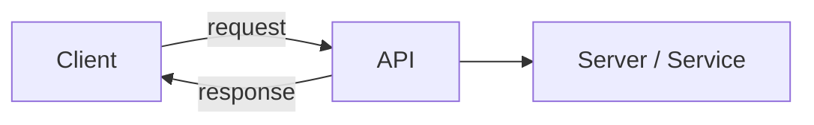
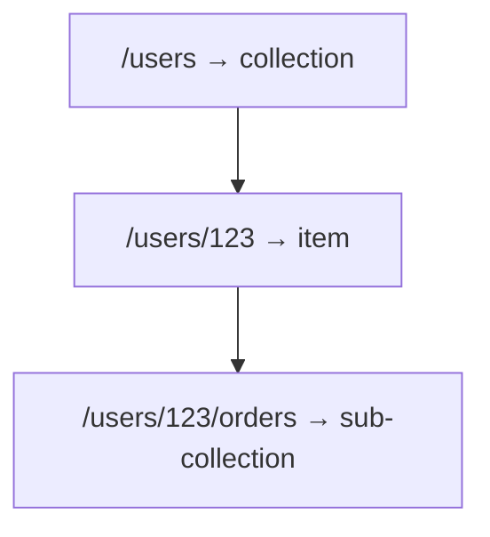
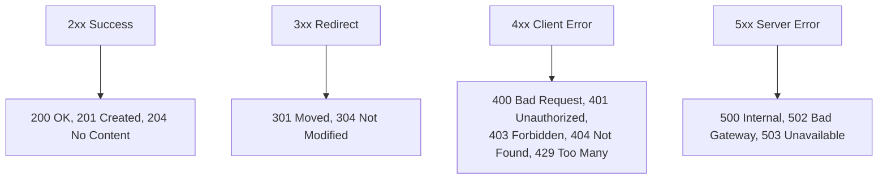
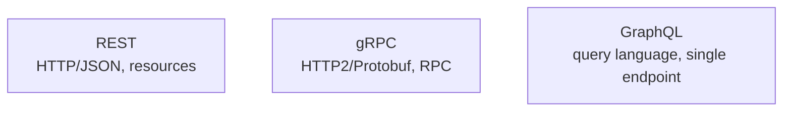
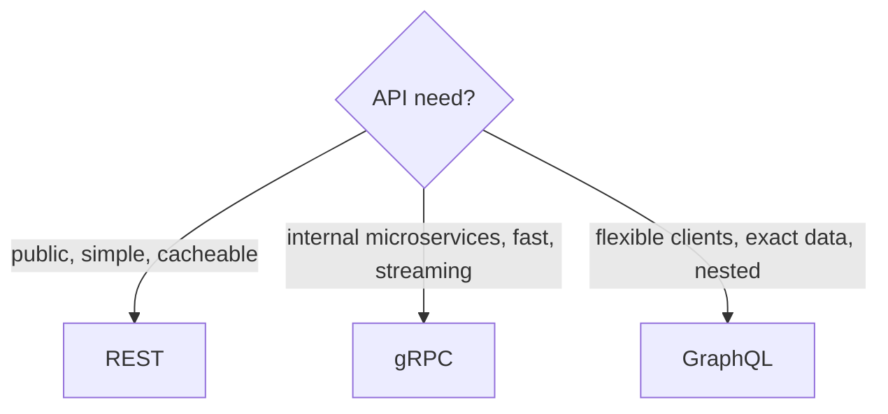

# API Design — Complete Deep Dive

> API (Application Programming Interface) = kaise clients + services baat karte. Achhi API design =
> intuitive, consistent, versioned, secure, scalable. Ye file: REST principles + best practices,
> HTTP methods/status codes, versioning, pagination, filtering, idempotency, error handling, rate
> limiting, aur REST vs gRPC vs GraphQL deep comparison.

---

## 📑 Table of Contents
1. [API kya + types](#1-api-kya-hai)
2. [REST — principles + best practices](#2-rest--principles--best-practices)
3. [HTTP methods + idempotency](#3-http-methods)
4. [HTTP status codes](#4-http-status-codes)
5. [API Versioning](#5-api-versioning)
6. [Pagination](#6-pagination)
7. [Filtering, sorting, searching](#7-filtering-sorting-searching)
8. [Error handling](#8-error-handling)
9. [Idempotency + rate limiting](#9-idempotency--rate-limiting)
10. [REST vs gRPC vs GraphQL](#10-rest-vs-grpc-vs-graphql)
11. [Security + best practices](#11-api-security--general-best-practices)
12. [Interview Q&A](#12-interview-qa)
13. [Summary](#13-summary)

---

## 1. API kya hai

**API** = contract jo do software components ko baat karne deta. Client request bhejta, server
respond karta, ek defined format me.



**API styles (main 3):** REST (HTTP/JSON), gRPC (HTTP2/Protobuf), GraphQL (query language). [Deep
comparison section 10.]

---

## 2. REST — Principles + Best Practices

**REST (Representational State Transfer)** — most common API style. Resources ko URLs se represent,
HTTP methods se operate.

### REST principles
1. **Resource-based** — nouns (resources), not verbs. `/users`, `/orders`. NOT `/getUsers`,
   `/createOrder`.
2. **Stateless** — har request self-contained (server session nahi rakhta). [Detail:
   `Stateful_and_Stateless_Architecture.md`]
3. **Uniform interface** — consistent (HTTP methods, status codes, formats).
4. **Client-server separation** — independent evolution.
5. **Cacheable** — responses cacheable (GET).
6. **Layered** — client ko pata nahi direct server ya proxy/LB.

### URL design best practices
```
✅ GOOD:
GET    /users                → list users
GET    /users/123            → get user 123
POST   /users               → create user
PUT    /users/123           → update user 123
DELETE /users/123           → delete user 123
GET    /users/123/orders    → user 123's orders (nested resource)

❌ BAD:
GET  /getUsers              (verb in URL)
POST /users/create          (verb — POST already means create)
GET  /user                  (singular — use plural for collections)
POST /users/123/delete      (should be DELETE method)
```

**Rules:**
- **Nouns, plural** — `/users` (collection), `/users/123` (item).
- **Hierarchical** — `/users/123/orders/456` (nested resources).
- **Lowercase, hyphens** — `/order-items` (not `/orderItems` or `/order_items`).
- **No verbs** — HTTP method IS the verb (GET/POST/PUT/DELETE).
- **Consistent** — same conventions everywhere.



---

## 3. HTTP Methods

| Method | Action | Idempotent? | Safe? | Example |
|---|---|---|---|---|
| **GET** | read | ✅ | ✅ | `GET /users/123` |
| **POST** | create | ❌ | ❌ | `POST /users` |
| **PUT** | replace (full update) | ✅ | ❌ | `PUT /users/123` |
| **PATCH** | partial update | ⚠ usually no | ❌ | `PATCH /users/123` |
| **DELETE** | delete | ✅ | ❌ | `DELETE /users/123` |
| **HEAD** | headers only | ✅ | ✅ | `HEAD /users/123` |
| **OPTIONS** | allowed methods | ✅ | ✅ | CORS preflight |

- **Idempotent** — same call kai baar = same result (GET/PUT/DELETE). POST **not** (creates
  duplicates). [Detail: `Idempotency.md`]
- **Safe** — no side-effect (GET/HEAD — read only).
- **PUT vs PATCH** — PUT replaces entire resource (all fields), PATCH partial (some fields).

---

## 4. HTTP Status Codes

Correct status codes = clear API. Categories:



| Code | Meaning | Kab |
|---|---|---|
| **200 OK** | success | GET/PUT/PATCH success |
| **201 Created** | resource created | POST success |
| **204 No Content** | success, no body | DELETE success |
| **400 Bad Request** | invalid input | validation fail |
| **401 Unauthorized** | not authenticated | no/invalid token |
| **403 Forbidden** | authenticated, no permission | insufficient rights |
| **404 Not Found** | resource doesn't exist | invalid ID |
| **409 Conflict** | conflict (duplicate) | unique violation |
| **422 Unprocessable** | semantic validation fail | valid syntax, invalid data |
| **429 Too Many Requests** | rate limited | rate limit exceeded |
| **500 Internal Error** | server bug | unhandled exception |
| **503 Service Unavailable** | overloaded/down | maintenance/overload |

> ⭐ **Use correct codes** — `401` (not authenticated) vs `403` (no permission) different. `400`
> (bad request) vs `404` (not found). Don't return `200` with error in body (breaks HTTP semantics).

---

## 5. API Versioning

APIs evolve — breaking changes shouldn't break existing clients. **Versioning** allows evolution.

```mermaid
flowchart LR
    C1[Old clients] --> V1[/v1/users]
    C2[New clients] --> V2[/v2/users]
    Note[Both work — backward compatibility]
```

### Versioning strategies
| Strategy | Example | Pros/Cons |
|---|---|---|
| **URI versioning** | `/v1/users`, `/v2/users` | ✅ simple, visible, cacheable ❌ URL clutter |
| **Header versioning** | `Accept: application/vnd.api.v2+json` | ✅ clean URLs ❌ less visible |
| **Query param** | `/users?version=2` | ✅ simple ❌ optional, caching issues |

- **URI versioning** most common (`/v1/`) — clear, simple, easy caching.
- **Backward compatibility** — naye fields add karo (optional), purane mat todo (non-breaking).
  Version bump sirf **breaking changes** pe.

> ⭐ **Best practice:** additive changes (new optional fields) = no version bump. Breaking changes
> (remove/rename fields, change behavior) = new version. Deprecate old versions gracefully (sunset).

---

## 6. Pagination

Large collections (`GET /users` — millions) — sab ek response me nahi. **Paginate**.

### Offset-based pagination
```
GET /users?page=2&limit=20    (ya ?offset=20&limit=20)
```

- ✅ Simple, jump to any page (`page=5`).
- ❌ **Slow for deep pages** (`OFFSET 1000000` — DB scans all skipped rows), **inconsistent** (new
  rows inserted → shifts, duplicates/misses).
- **Use:** small datasets, admin UIs (page numbers needed).

### Cursor-based pagination (better for large/real-time)
```
GET /users?limit=20&cursor=eyJpZCI6MTAwfQ   (cursor = last item's id/token)
```
- Cursor = pointer to last item (usually encoded ID). Next page = items after cursor.
- ✅ **Efficient for large data** (no OFFSET scan — `WHERE id > cursor`), **consistent** (no shifts
  on inserts), real-time friendly (feeds).
- ❌ Can't jump to arbitrary page (sequential), cursor opaque.
- **Use:** large datasets, infinite scroll, feeds (Twitter, Instagram).

| | Offset | Cursor |
|---|---|---|
| Jump to page | ✅ | ❌ (sequential) |
| Large data | slow (OFFSET scan) | fast (WHERE id > cursor) |
| Consistency | shifts on insert | stable |
| Use | admin, small | feeds, large, real-time |

---

## 7. Filtering, Sorting, Searching

Query parameters se:
```
GET /users?role=admin&status=active     → filtering
GET /users?sort=created_at&order=desc   → sorting
GET /users?search=john                  → searching
GET /products?min_price=100&max_price=500&category=electronics  → combined
```
- **Filtering** — `?field=value` (WHERE clauses).
- **Sorting** — `?sort=field&order=asc/desc`.
- **Searching** — `?search=term` (full-text — or dedicated search endpoint / Elasticsearch).
- **Field selection** — `?fields=id,name` (sparse fieldsets — reduce payload).

---

## 8. Error Handling

Consistent, informative error responses:
```json
// ❌ BAD: 200 OK with vague error
{ "error": true, "msg": "something wrong" }

// ✅ GOOD: proper status + structured error
// HTTP 400 Bad Request
{
  "error": {
    "code": "VALIDATION_ERROR",
    "message": "Email is invalid",
    "details": [
      { "field": "email", "issue": "must be a valid email" }
    ],
    "request_id": "abc-123"
  }
}
```

**Best practices:**
- **Correct HTTP status** (400/401/403/404/422/500 — not always 200).
- **Structured error** — machine-readable code + human message + details.
- **request_id** — debugging (correlate logs).
- **No sensitive info leak** — stack traces / internal details client ko nahi (log server-side).
- **Consistent format** — same error structure everywhere.

---

## 9. Idempotency + Rate Limiting

### Idempotency (safe retries)
POST retry pe duplicate na ho → **Idempotency-Key** header. Server dedup. [Detail: `Idempotency.md`]
```
POST /payments
Idempotency-Key: abc-123
→ retry with same key → same result (no double charge)
```

### Rate limiting
API abuse rokna — per-user/API-key limits. `429` + headers. [Detail: `12`, `15`]
```
HTTP 429 Too Many Requests
Retry-After: 60
X-RateLimit-Limit: 100
X-RateLimit-Remaining: 0
```

---

## 10. REST vs gRPC vs GraphQL

Teen main API paradigms — deep comparison:



| | **REST** | **gRPC** | **GraphQL** |
|---|---|---|---|
| Protocol | HTTP/1.1 + JSON | HTTP/2 + Protobuf (binary) | HTTP + JSON |
| Data format | JSON (text) | Protobuf (binary, compact) | JSON |
| Speed | moderate | **fast** (binary, HTTP/2) | moderate |
| Contract | loose (OpenAPI) | **strict** (.proto) | schema (typed) |
| Endpoints | multiple (`/users`, `/orders`) | RPC methods | **single** (`/graphql`) |
| Over-fetching | common (fixed responses) | — | **solved** (client picks fields) |
| Under-fetching | common (multiple calls) | — | **solved** (one query, nested) |
| Streaming | limited | **bidirectional** | subscriptions |
| Caching | easy (HTTP caching) | harder | harder (POST-based) |
| Browser | native | needs proxy (grpc-web) | native |
| Best for | public APIs, CRUD, simple | internal microservices (fast) | flexible clients (mobile, complex UIs) |

### REST — deep
- Resources + HTTP methods. Universal, cacheable, simple. **Over-fetching** (endpoint returns fixed
  data — client needs less) / **under-fetching** (client needs data from multiple endpoints → multiple
  calls).
- **Use:** public APIs, standard CRUD, when simplicity + caching matter.

### gRPC — deep
- **Protobuf** (binary — compact, fast serialization) over **HTTP/2** (multiplexing, streaming).
  Strict `.proto` contract (code generation). **Bidirectional streaming**.
- ✅ Fast (low latency, binary), efficient, strong typing, streaming.
- ❌ Not browser-native (grpc-web proxy), binary (not human-readable), less tooling.
- **Use:** **internal microservices** (service-to-service — speed matters), real-time streaming.

### GraphQL — deep
- **Single endpoint**, client specifies **exactly** what data (query):
```graphql
query {
  user(id: "123") {
    name
    orders { id, amount }   # nested — one query, exact fields
  }
}
```
- ✅ No over/under-fetching (client picks fields), flexible (mobile kam data), single request for
  nested data, strong typing (schema).
- ❌ **Caching mushkil** (POST, dynamic queries), complex queries DB pe heavy (N+1, need dataloader),
  learning curve, harder rate limiting (query complexity).
- **Use:** flexible clients (mobile + web different needs), complex nested data, rapidly evolving
  frontends.



---

## 11. API Security + General Best Practices

### Security
- **HTTPS everywhere** (TLS — encryption). [Detail: `14_SSL_Certificate.md`]
- **Authentication** — API keys, OAuth 2.0, JWT. [Detail: `Security_in_System_Design.md`]
- **Authorization** — role/permission checks.
- **Rate limiting** — abuse/DDoS defense.
- **Input validation** — SQL injection, XSS prevention (never trust client input).
- **CORS** — control which origins can call.

### General best practices
- **Consistency** — naming, formats, error structure (predictable).
- **Documentation** — OpenAPI/Swagger (interactive docs).
- **Versioning** — evolve without breaking clients.
- **Pagination** — never return unbounded lists.
- **Idempotency** — safe retries (Idempotency-Key).
- **Compression** — gzip responses (bandwidth).
- **HATEOAS** (optional) — responses include links to related actions (discoverability).
- **Backward compatibility** — additive changes, deprecate gracefully.

---

## 12. Interview Q&A

**Q: REST API design best practices?**
Resource-based nouns (`/users` not `/getUsers`), plural + hierarchical, HTTP methods as verbs, correct
status codes, stateless, versioning, pagination, consistent errors, HTTPS + auth.

**Q: HTTP methods aur idempotency?**
GET (read, idempotent+safe), POST (create, NOT idempotent), PUT (replace, idempotent), PATCH (partial),
DELETE (idempotent). POST needs idempotency key for safe retries.

**Q: API versioning kaise?**
URI (`/v1/`, `/v2/` — common, visible), header (`Accept:...v2`), query param. Additive changes = no
bump, breaking changes = new version. Deprecate gracefully.

**Q: Pagination — offset vs cursor?**
Offset (`page/limit`) — simple, jump to page, but slow for deep pages + inconsistent. Cursor (`cursor`)
— efficient large data (`WHERE id > cursor`), consistent, but sequential. Feeds → cursor.

**Q: REST vs gRPC vs GraphQL?**
REST — HTTP/JSON, public, cacheable, simple (over/under-fetching). gRPC — HTTP2/Protobuf binary, fast,
internal microservices, streaming. GraphQL — single endpoint, client picks exact fields (no
over/under-fetch), flexible clients, but caching hard.

**Q: Over-fetching vs under-fetching?**
Over-fetching — endpoint returns more data than needed (waste). Under-fetching — need multiple calls
for related data. REST common problem. GraphQL solves (client specifies exact fields, nested).

**Q: Error handling in APIs?**
Correct HTTP status (not always 200), structured error (code + message + details + request_id),
consistent format, no sensitive leak (stack traces server-side only).

**Q: gRPC kab use over REST?**
Internal microservices (service-to-service) — speed (binary Protobuf, HTTP/2 multiplexing), strong
typing (.proto), bidirectional streaming. Not for public/browser (grpc-web needed).

---

## 13. Summary

- **REST** — resource-based (nouns, plural, hierarchical), HTTP methods as verbs, stateless,
  cacheable, correct status codes.
- **HTTP methods** — GET/PUT/DELETE idempotent, POST not (needs idempotency key).
- **Status codes** — 2xx success, 4xx client error (400/401/403/404/429), 5xx server. Use correctly.
- **Versioning** — URI (`/v1/`), additive = no bump, breaking = new version.
- **Pagination** — offset (simple, page jumps) vs cursor (large data, feeds, consistent).
- **Errors** — proper status + structured (code/message/details/request_id).
- **Idempotency** (Idempotency-Key) + **rate limiting** (429 + headers).
- **REST** (public/simple/cacheable) vs **gRPC** (internal/fast/streaming) vs **GraphQL** (flexible/
  exact data/nested).
- **Security** — HTTPS, auth (OAuth/JWT), validation, rate limiting.

> Related: [`05_Network_Protocols.md`](./05_Network_Protocols.md) · [`Idempotency.md`](./Idempotency.md)
> · [`15_Rate_Limiting_Strategies.md`](./15_Rate_Limiting_Strategies.md) ·
> [`Security_in_System_Design.md`](./Security_in_System_Design.md)
