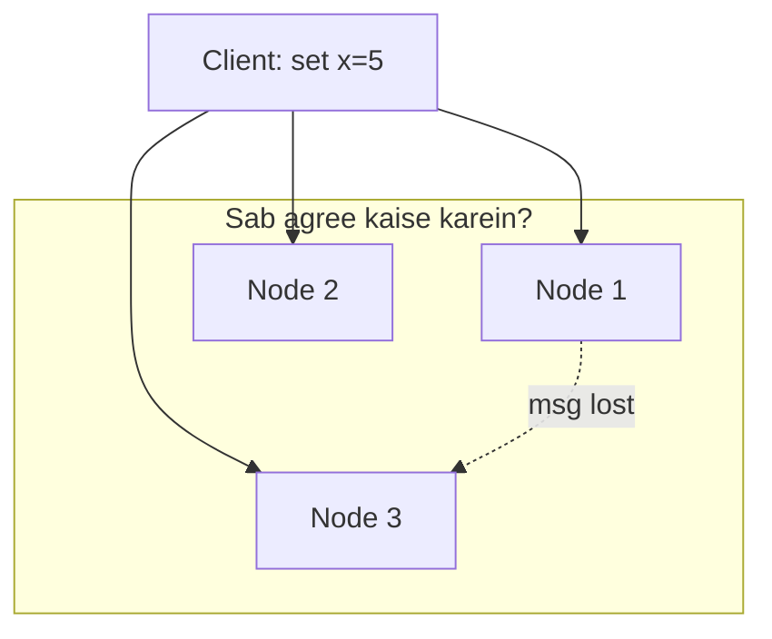
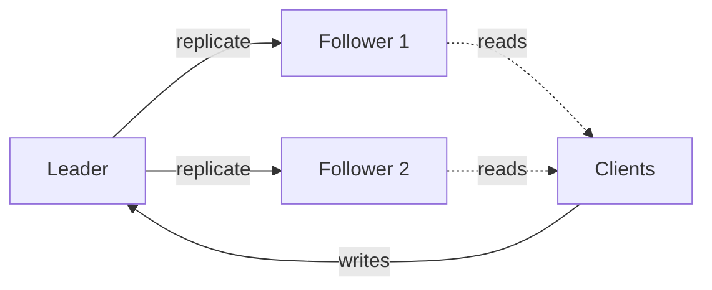
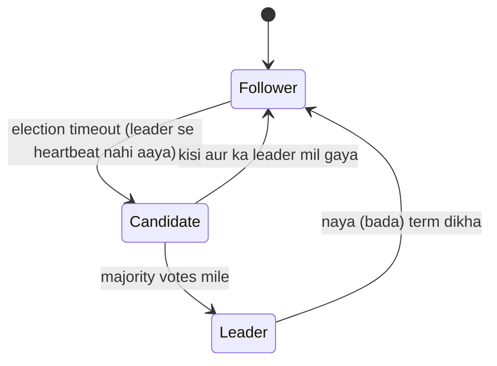
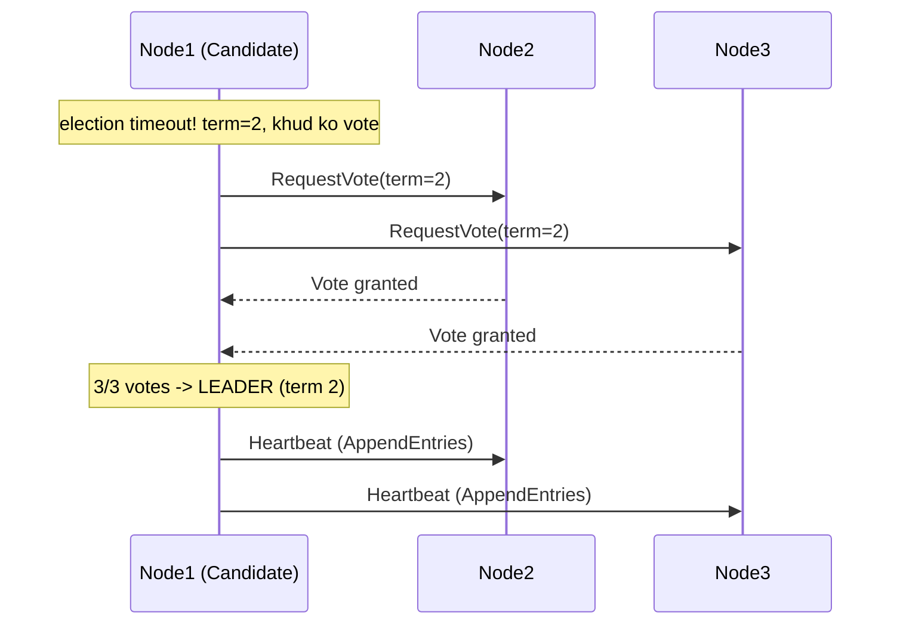
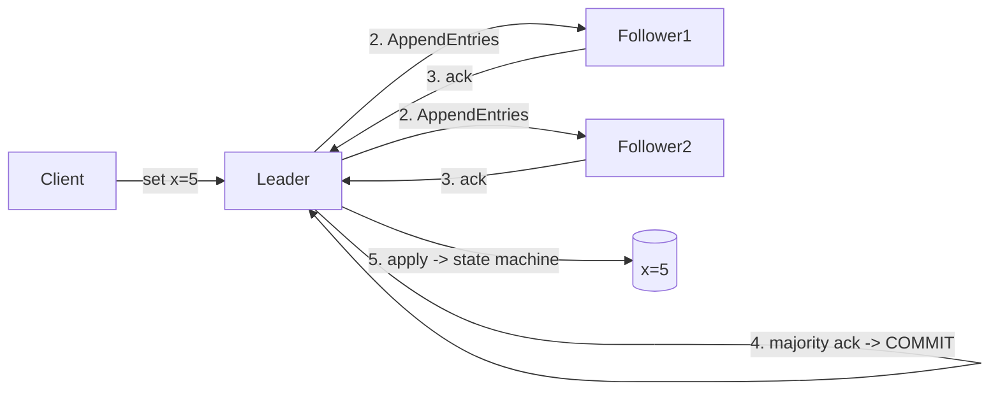
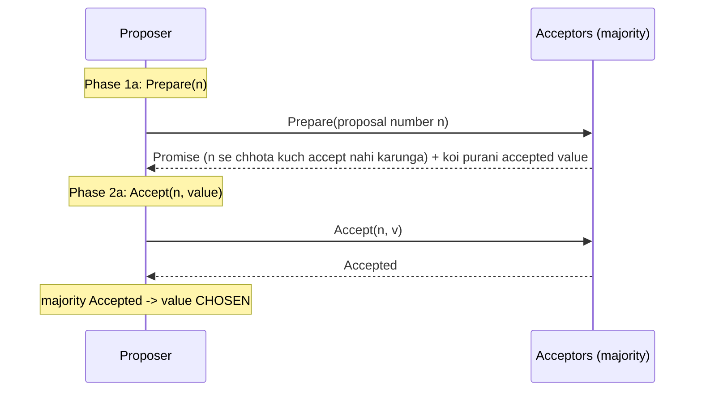
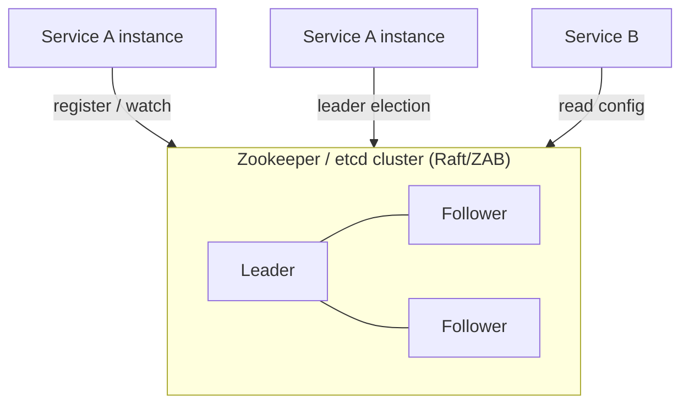

# 🗳️ Consensus Algorithms — Raft, Paxos, Leader Election

> **Consensus** = distributed system ke multiple nodes ko **ek hi value pe agree** karana —
> chahe kuch nodes crash ho jaayein, network slow ho, ya messages der se aayein. Ye distributed
> systems ka sabse fundamental (aur mushkil) problem hai. Leader election, replicated logs,
> distributed locks, config management — sab andar consensus par tikke hain.

---

## 1. Problem kya hai? (Kyun mushkil?)

Socho 5 servers ek hi data ki copies rakhte hain (replication). Ek write aata hai. Sabko **same
order** me same write apply karna hai, warna copies diverge ho jaayengi. Ab dikkatein:

- **Nodes crash** ho sakte hain (kabhi bhi).
- **Network** messages drop/delay/reorder kar sakta hai.
- **Koi central boss nahi** — sabko aapas me decide karna hai.

> **Consensus ka goal:** saare (ya majority) nodes **ek hi decision** par pahunchein, aur wo decision
> **final** ho (badle na).

### Consensus ke 3 guarantees
| Property | Matlab |
|---|---|
| **Agreement** | Do sahi nodes alag-alag value decide nahi karenge |
| **Validity** | Jo value decide hui wo kisi node ne propose ki thi (bekaar value nahi) |
| **Termination** | Har sahi node kabhi-na-kabhi decide kar hi lega (atka nahi rahega) |

### FLP Impossibility (ek important theory)
> **Fully asynchronous** network me, agar ek node bhi fail ho sakta hai, to koi bhi consensus
> algorithm **guarantee ke saath** teeno properties nahi de sakta.

Iska matlab hum haar gaye? Nahi. Real algorithms (Raft/Paxos) **timeouts** use karke practically
kaam kar jaate hain — "asynchronous" assumption thoda relax karke. Ye interview me bolne layak point hai.

---

## 2. Leader Election — consensus ka pehla kaam

Zyada tar systems ek **leader** (a.k.a. primary/master) chunte hain jo saare writes handle kare, aur
baaki **followers** us leader ki copy karte hain. Isse ordering simple ho jaati hai (sab leader ke
order me chalte hain).

**Leader mar gaya to?** → naya leader chunna padta hai = **leader election** (yehi consensus ka use case).

---

## 3. Raft — samajhne me aasaan consensus

Raft ka design goal hi tha: **"Paxos se aasaan"**. Isko 3 hisson me toda:
**(a) Leader election, (b) Log replication, (c) Safety.**

### Node ke 3 states

### (a) Leader Election kaise hoti hai
- Time ko **terms** me baanta jaata hai (term = ek number, har election pe badhta hai).
- Har follower ke paas ek **random election timeout** (jaise 150-300ms) hota hai.
- Leader har follower ko **heartbeat** bhejta rehta hai. Heartbeat aata rahe → follower khush.
- Heartbeat na aaya (leader mar gaya?) → follower **Candidate** ban jaata hai, term++ karta hai,
  apne aap ko vote deta hai, aur baakiyon se vote maangta hai (`RequestVote`).
- **Majority (N/2 + 1)** vote mile → **Leader** ban gaya. Ab wo heartbeat bhejna shuru.

> **Random timeout** ka jaadu: sab ek saath candidate na banein (warna vote split ho jaaye).
> Random hone se aam taur pe ek hi pehle timeout hota hai → wahi leader ban jaata hai. Agar phir bhi
> **split vote** ho (kisi ko majority na mile), to naya term, naya random timeout → retry.

### (b) Log Replication
Leader ban-ne ke baad asli kaam: clients ke commands ko **replicated log** me daalna.

Steps:
1. Client command leader ko bhejta hai.
2. Leader apne log me entry add karta hai (abhi **uncommitted**).
3. Leader `AppendEntries` se followers ko entry bhejta hai.
4. **Majority** followers ne likh liya → entry **committed**. Ab leader use apni state machine pe apply karta hai aur client ko OK bolta hai.
5. Followers bhi apply kar dete hain.

> **Key idea:** ek entry tabhi committed hoti hai jab **majority** ke paas ho. Isi liye leader crash
> hone par bhi committed data kisi na kisi majority-node ke paas surakshit rehta hai.

### (c) Safety — "committed cheez kabhi nahi khoni chahiye"
- Election me sirf wahi candidate jeet sakta hai jiska log **kam se kam utna up-to-date** ho jitna
  majority ka (voters purane-log waale candidate ko vote nahi dete). Isse ye guarantee ki naya leader
  ke paas saara committed data ho.
- Har entry ke saath **term** number hota hai → conflicts detect/resolve karne ke liye.

### Split-brain se bachaav (Raft me)
Do leader ek saath? Nahi ho sakta — kyunki leader banne ke liye **majority** vote chahiye, aur ek term
me ek node ek hi vote deta hai. Do candidate dono majority nahi le sakte (majority ek hi ho sakti hai).
Isi liye **ek term me max ek leader**.

---

## 4. Paxos — original (theoretical) consensus

Leslie Lamport ka Paxos consensus ka "daadaa" hai — correct hai par samajhna kukh mushkil. Roles:

| Role | Kaam |
|---|---|
| **Proposer** | Value propose karta hai |
| **Acceptor** | Vote deta hai (majority acceptors = decision) |
| **Learner** | Decided value ko seekhta/apply karta hai |

### Do phases (Basic Paxos)

- **Phase 1 (Prepare/Promise):** proposer ek number `n` ke saath poochta hai. Acceptors promise dete
  hain ki `n` se chhote proposals reject karenge, aur agar pehle kuch accept kiya tha to bata dete hain.
- **Phase 2 (Accept/Accepted):** proposer value bhejta hai (agar acceptors ne purani value batayi to
  wahi use karta hai — safety). Majority ne accept kiya → value **chosen**.

> **Multi-Paxos:** har value ke liye Phase 1 dobara karna slow hai. Multi-Paxos ek **stable leader**
> chunta hai jo Phase 1 sirf ek baar karta hai, phir seedha Phase 2 chalata rehta hai — ye idea Raft
> jaisa hi hai.

### Raft vs Paxos
| | Raft | Paxos |
|---|---|---|
| Samajhna | Aasaan (isi ke liye bana) | Mushkil |
| Structure | Strong leader, log-centric | Zyada general/theoretical |
| Real use | etcd, Consul, TiKV, CockroachDB | Google Chubby/Spanner (Multi-Paxos), Cassandra (LWW-ish) |
| Leader | Hamesha ek strong leader | Optional (Multi-Paxos me) |

---

## 5. Zookeeper & etcd — ready-made "consensus as a service"

Aap khud Raft implement nahi karte — ye battle-tested systems use karte ho:

| System | Algorithm | Kis-kis me use |
|---|---|---|
| **Zookeeper** | ZAB (Zookeeper Atomic Broadcast, Paxos jaisa) | Kafka (purana), Hadoop, HBase |
| **etcd** | Raft | Kubernetes ka brain (saara cluster state), Consul-alt |
| **Consul** | Raft | Service discovery, config, locks |

### Ye kaam kya aate hain? (Coordination primitives)
- **Leader election** — apni service ke liye leader chunna.
- **Distributed lock** — ephemeral znode / lease ke through (dekho [Concurrency Control](../Concurrency_Control.md)).
- **Config management** — sab nodes ek jagah se config padhein.
- **Service discovery** — kaunsi service kahan chal rahi (dekho [Service Discovery](./10_Service_Discovery_and_Service_Mesh.md)).
- **Watches** — value badle to notify.

> **Zookeeper znodes:** **ephemeral** node (session khatam → node gayab, isse leader-death detect hota
> hai) aur **sequential** node (auto-incrementing naam, isse fair lock/queue banti hai). Ye do features
> se leader election + lock dono ban jaate hain.

---

## 6. Quorum — "majority" ka math

Consensus ki jaan **quorum** hai: kisi bhi decision ke liye **N/2 + 1** nodes chahiye.

| Nodes (N) | Quorum (majority) | Kitne fail sah sakte |
|---|---|---|
| 3 | 2 | 1 |
| 5 | 3 | 2 |
| 7 | 4 | 3 |

> **Odd number kyun (3, 5, 7)?** 4 nodes me bhi quorum 3 hi hai (utna hi fault-tolerance jitna 3 ka),
> par extra node ka kharcha. Isi liye consensus clusters **odd** rakhte hain.
>
> **Do majority overlap** karti hain (kam se kam 1 common node) → isi liye do conflicting decisions
> ek saath nahi ho sakte. Yehi split-brain rokta hai. (Related: [CAP Theorem](../11_CAP_Theorem.md), quorum W+R>N in [Replication](../Database_Replication.md).)

---

## 7. Kahan-kahan consensus lagta hai (real use cases)

| Use case | Kaise |
|---|---|
| **Leader election** | DB primary chunna, job scheduler ka single owner |
| **Replicated state machine** | Har node same log same order me apply kare (etcd, CockroachDB) |
| **Distributed locks** | Sirf ek client critical section me ghuse |
| **Config / metadata store** | Kubernetes ka etcd — poora cluster state |
| **Distributed transactions** | Commit decision par agree ([Distributed Transactions](../Distributed_Transactions.md)) |
| **Membership** | Cluster me kaun-kaun zinda hai |

---

## ✅ Advantages / ❌ Challenges

**✅ Faayde**
- **Strong consistency** — sab nodes ek hi truth pe.
- **Fault tolerance** — minority nodes mar jaayein to bhi system chalta rahe.
- **Split-brain se bachaav** — majority requirement.
- **Automatic failover** — leader mare to naya chun jaata hai.

**❌ Challenges / Costs**
- **Latency** — har commit ke liye majority ka ack chahiye (network round-trips).
- **Throughput cap** — sab writes leader se → leader bottleneck.
- **Minority par writes nahi** — agar majority hi na bane (network partition), to system **write
  unavailable** ho jaata hai (CP system — availability sacrifice, CAP dekho).
- **Odd cluster + more nodes = slower** (zyada acks). Isi liye consensus clusters chhote (3/5) rakhte hain.

---

## 🎤 Interview Q&A

**Q: Consensus kya hai, ek line me?**
Multiple nodes ka ek value/order par agree hona, failures ke bawajood.

**Q: Raft ke 3 sub-problems?**
Leader election, log replication, safety.

**Q: Split-brain (do leader) kaise rukta hai?**
Leader banne ke liye **majority** vote chahiye; ek term me node ek hi vote deta hai → do majority possible nahi → max ek leader.

**Q: Consensus cluster odd (3/5/7) kyun rakhte hain?**
4 aur 3 ki fault-tolerance same (dono me quorum overlap ke liye majority 3/2), extra even node bekaar kharcha; odd optimal.

**Q: Raft vs Paxos?**
Dono correct; Raft strong-leader + samajhne me aasaan (etcd/Consul), Paxos general par mushkil (Google Chubby/Spanner).

**Q: Network partition me consensus cluster ka kya hota?**
Majority-waala side chalta rehta hai (leader wahin); minority side **unavailable** (writes reject) — CP behavior.

**Q: Zookeeper leader election kaise karta?**
Ephemeral + sequential znodes: sabse chhote sequence-number waala leader; wo mare (ephemeral gayab) to agla number leader.

---

## Summary
- **Consensus** = failures ke beech nodes ka ek decision par agree hona; **leader election** + **log
  replication** iske do bade use.
- **Raft** = aasaan, strong-leader, log-based (etcd/Consul/CockroachDB).
- **Paxos** = original, general, mushkil (Google systems); **Multi-Paxos** stable leader use karta hai.
- **Quorum (N/2+1)** har decision ke liye; odd cluster (3/5/7) best; do majority overlap → no split-brain.
- Khud mat likho — **etcd / Zookeeper / Consul** use karo.

> **Related:** [CAP Theorem](../11_CAP_Theorem.md) · [Database Replication](../Database_Replication.md) · [Distributed Transactions](../Distributed_Transactions.md) · [Concurrency Control](../Concurrency_Control.md) · [Service Discovery](./10_Service_Discovery_and_Service_Mesh.md)
