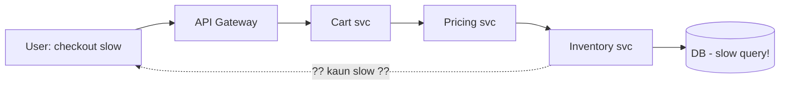
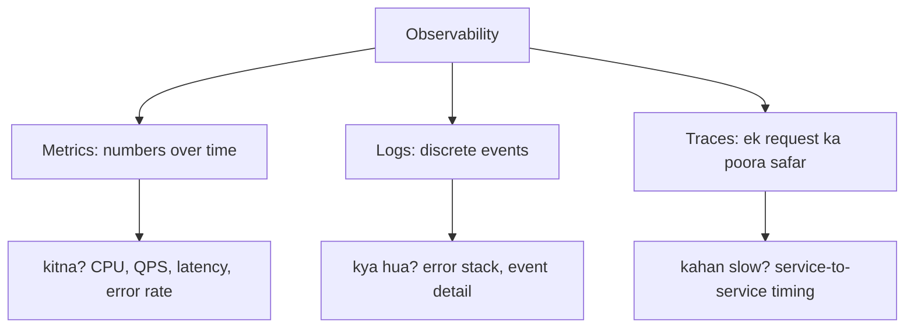
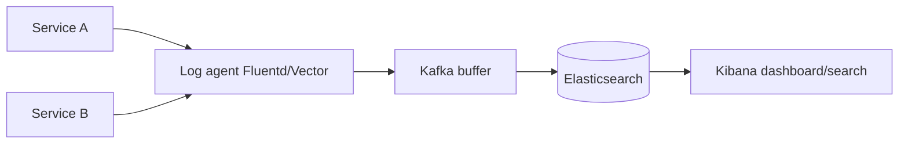
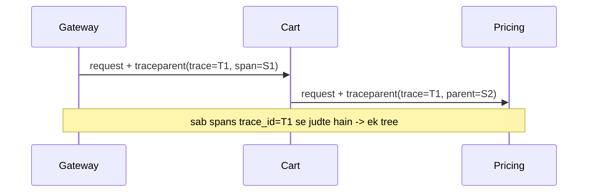
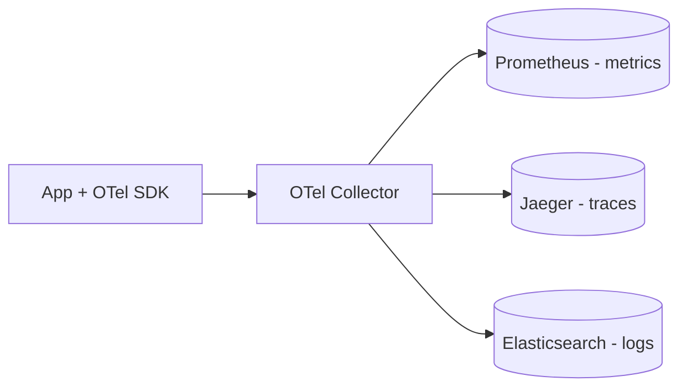

# 🔭 Observability — Monitoring, Logging, Metrics & Distributed Tracing

> **Observability** = system ke **bahar se** nikal rahe signals (logs, metrics, traces) dekhkar ye
> samajh paana ki **andar kya ho raha hai** — bina naya code deploy kiye. "System down kyun hai?",
> "Kaunsa service slow hai?", "Ye error kahan se aaya?" — in sawaalon ka jawaab observability deti hai.
>
> **Monitoring vs Observability:** Monitoring = pehle se soche gaye sawaal ("CPU 90% se upar to alert").
> Observability = **anjaane** sawaalon ka jawaab bhi de paana ("aaj checkout kyun slow hai?").

---

## 1. Kyun zaroori hai?

Monolith me ek log file dekh li, ho gaya. Microservices me ek request **10 services** se guzarti hai —
kahan atki, pata hi nahi chalta. Observability ke bina:
- Outage me ghante lag jaate hain root cause dhoondhne me.
- "Mere side sab theek hai" — har team bolti hai, blame-game.
- Slow performance ka pata customer complaint se chalta hai (bahut late).



---

## 2. Three Pillars of Observability



| Pillar | Kya | Sawaal jiska jawaab | Tools |
|---|---|---|---|
| **Metrics** | Aggregated numbers over time (counters, gauges, histograms) | "Kitna? Trend kya?" | Prometheus, Grafana, Datadog |
| **Logs** | Discrete timestamped events (text/JSON) | "Exactly kya hua?" | ELK (Elasticsearch+Logstash+Kibana), Loki, Splunk |
| **Traces** | Ek request ka end-to-end path across services | "Kahan slow/fail hua?" | Jaeger, Zipkin, Tempo, OpenTelemetry |

---

## 3. Metrics — numbers over time

Metrics chhoti, sasti, aggregate hoti hain — dashboards aur alerts inhi pe bante hain.

### Metric types
| Type | Matlab | Example |
|---|---|---|
| **Counter** | Sirf badhta hai | total requests, total errors |
| **Gauge** | Upar-neeche | current CPU %, active connections, queue length |
| **Histogram** | Distribution (buckets) | request latency ka p50/p95/p99 |

### ⭐ Percentiles — average jhooth bolta hai
Average latency 100ms "achhi" lagti hai, par **p99 = 3s** ka matlab har 100 me se 1 user ko 3 second
lag rahe. Isi liye hamesha **percentiles** dekho:

| Metric | Matlab |
|---|---|
| **p50 (median)** | Aadha traffic isse tez |
| **p95** | 95% isse tez (5% slow) |
| **p99** | 99% isse tez — "tail latency", isi pe worst users |
| **p99.9** | Sabse bure 0.1% — bade scale pe ye lakhs users hote hain |

> **Interview line:** "Averages hide outliers; hum p95/p99 pe SLO define karte hain."

### The RED & USE methods (kaunse metrics dekhein)
- **RED** (services ke liye): **R**ate (QPS), **E**rrors (error rate), **D**uration (latency).
- **USE** (resources ke liye): **U**tilization, **S**aturation, **E**rrors.

### The 4 Golden Signals (Google SRE)
**Latency, Traffic, Errors, Saturation** — kisi bhi service ki sehat inhi 4 se pata chal jaati hai.

---

## 4. Logging — kya exactly hua

### Log levels
`DEBUG` < `INFO` < `WARN` < `ERROR` < `FATAL` — production me aam taur pe INFO+ .

### ⭐ Structured logging (JSON) — ye zaroor karo
Plain text log grep karna dard hai. **Structured (JSON)** logs machine-parseable hote hain:

```json
{"ts":"2026-08-01T10:00:00Z","level":"ERROR","service":"payment",
 "trace_id":"abc123","user_id":"u42","msg":"charge failed","err":"timeout"}
```

Ab `trace_id="abc123"` se poori request ke saare logs (har service se) ek saath nikal sakte ho.

### Centralized logging (kyunki 100 servers)
Har server ki local file dekhna impossible. Logs ko ek jagah bhejo:



> **Correlation ID / Trace ID:** har incoming request pe ek unique ID generate karo aur use har log,
> har downstream call me pass karo. Yehi ek request ke saare bikhre logs ko jodta hai — **debugging
> ki sabse badi cheez.**

---

## 5. Distributed Tracing — request ka poora safar

Ek request 10 services se guzarti hai — **trace** us poore safar ko dikhati hai, har hop ka time ke saath.

### Concepts: Trace & Span
- **Trace** = ek request ka poora journey (ek unique `trace_id`).
- **Span** = us journey ka ek step (ek service ka kaam), start/end time ke saath. Spans nested hote hain (parent-child).

```mermaid
gantt
    title Ek request ka trace (waterfall)
    dateFormat X
    axisFormat %L
    section Gateway
    api-gateway        :0, 400
    section Cart
    cart-service       :20, 380
    section Pricing
    pricing-service    :60, 120
    section Inventory
    inventory-service  :200, 360
    section DB
    db-query (SLOW!)   :210, 350
```



Upar ke trace se turant dikh gaya: **db-query 140ms le raha hai** — wahi bottleneck. Bina tracing ke
ye dhoondhna ghanton ka kaam.

### Context propagation — jaadu kaise hota hai
Har service downstream call ke headers me `trace_id` + `span_id` (parent) forward karti hai
(W3C `traceparent` header standard). Isi se spans ka tree ban jaata hai.



### Sampling (kyunki har request trace karna mehnga)
100% requests trace karna storage/overhead bahut. **Sampling**: jaise 1% requests, ya "saare error/slow
requests + 1% normal" (tail-based sampling). Interview me ye trade-off bolo.

---

## 6. OpenTelemetry (OTel) — modern standard

Pehle har vendor ka apna SDK tha. **OpenTelemetry** ek open standard hai — ek hi SDK se metrics + logs
+ traces generate karo, phir kisi bhi backend (Jaeger/Prometheus/Datadog) ko bhejo. Vendor lock-in khatam.



---

## 7. Alerting & On-Call

Metrics se **alerts** banao — insaan har dashboard nahi dekhega.

| Achha alert | Bura alert |
|---|---|
| Symptom-based ("p99 latency > 1s for 5 min") | Cause-based har chhoti cheez pe |
| Actionable (kuch karna hai) | Noise (koi action nahi) |
| Severity ke saath (page vs ticket) | Sab kuch "critical" |

> **Alert fatigue:** bahut zyada bekaar alerts → log ignore karne lagte hain → asli alert miss.
> Isi liye alerts **symptom-based** aur **actionable** rakho.

- **Runbook:** har alert ke saath "aane par kya karein" ka doc.
- **Escalation:** koi respond na kare to agle person ko page.
- **Postmortem:** outage ke baad **blameless** analysis — kya seekha, kya theek karein.

---

## 8. SLI, SLO, SLA — reliability ki bhaasha

| Term | Full | Matlab | Example |
|---|---|---|---|
| **SLI** | Service Level **Indicator** | Actual maapa gaya number | "99.95% requests < 300ms rahe" |
| **SLO** | Service Level **Objective** | **Andar ka target** | "99.9% requests < 300ms" |
| **SLA** | Service Level **Agreement** | Customer se **contract** (todne pe refund/penalty) | "99.9% uptime warna paisa wapas" |

> Relation: **SLI** (measure) → compare against **SLO** (goal) → **SLA** (external promise, usually SLO se dheela). SLA todna = paisa/legal, isi liye SLO ko SLA se tight rakhte hain.

### Error Budget — SRE ka killer concept
Agar SLO 99.9% uptime hai, to **0.1% downtime "allowed"** hai = **error budget**.
- Budget bacha hai → naye features tez deploy karo (risk le sakte ho).
- Budget khatam → deploy roko, reliability pe kaam karo.

Ye dev-vs-ops jhagda solve karta hai: ek number pe dono agree karte hain.

### Availability "nines"
| Availability | Downtime/saal | Downtime/mahina |
|---|---|---|
| 99% ("two nines") | ~3.65 din | ~7.2 ghante |
| 99.9% ("three nines") | ~8.76 ghante | ~43 min |
| 99.99% ("four nines") | ~52.6 min | ~4.3 min |
| 99.999% ("five nines") | ~5.26 min | ~26 sec |

---

## ✅ Best Practices / ❌ Anti-patterns

**✅ Karo**
- **Structured (JSON) logs** + **correlation/trace ID** har jagah.
- **Percentiles (p95/p99)**, average nahi.
- **OpenTelemetry** — vendor-neutral.
- **Symptom-based, actionable alerts** + runbooks.
- **SLO + error budget** define karo.
- Dashboards: RED/USE/4 golden signals.

**❌ Mat karo**
- Sirf averages dekhna (outliers chhup jaate).
- Har cheez ERROR level pe log karna (noise).
- Bina sampling ke 100% tracing at huge scale (mehnga).
- Sensitive data (passwords, PII, card numbers) log karna — **security risk** (dekho [Security](../Security_in_System_Design.md)).
- Alert fatigue — 100 bekaar alerts.

---

## 🎤 Interview Q&A

**Q: Observability ke 3 pillars?**
Metrics (numbers/trends), Logs (discrete events), Traces (ek request ka safar).

**Q: Monitoring vs observability?**
Monitoring = known sawaalon ke pehle se bane dashboards/alerts; observability = unknown sawaalon ka bhi jawaab nikal paana.

**Q: Average latency kyun kaafi nahi?**
Outliers chhupa deta hai; p99 me har 100 me se 1 user ka bura experience dikhta hai — usi pe SLO.

**Q: Microservices me ek slow request kaise debug karoge?**
Distributed tracing — trace_id se poora waterfall dekho, jahan span sabse bada wahi bottleneck.

**Q: SLI vs SLO vs SLA?**
SLI = maapa gaya number, SLO = andar ka target, SLA = customer contract (todne pe penalty).

**Q: Error budget kya hai?**
100% − SLO = allowed unreliability; bacha ho to tez feature-deploy, khatam ho to reliability pe focus.

**Q: Ek request ke bikhre logs kaise jodoge?**
Correlation/trace ID har log + downstream call me propagate karke.

---

## Summary
- **Observability** = logs + metrics + traces se system ke andar ka pata lagana.
- **Metrics** (Prometheus/Grafana) — trends, dashboards, alerts; hamesha **p95/p99** dekho.
- **Logs** — structured JSON + **correlation ID**, centralized (ELK/Loki).
- **Traces** (Jaeger/Zipkin, OpenTelemetry) — microservices me bottleneck dhoondhne ka #1 tool.
- **Alerts** symptom-based + actionable; **SLI/SLO/SLA + error budget** se reliability manage karo.

> **Related:** [Resilience & Fault Tolerance](./07_Resilience_and_Fault_Tolerance.md) · [Monolithic vs Microservices](../01_Monolithic_and_Microservices.md) · [Avoid SPOF](../17_Avoid_Single_Point_of_Failure.md) · [Security](../Security_in_System_Design.md)
