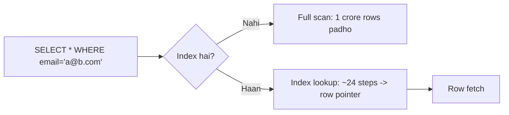
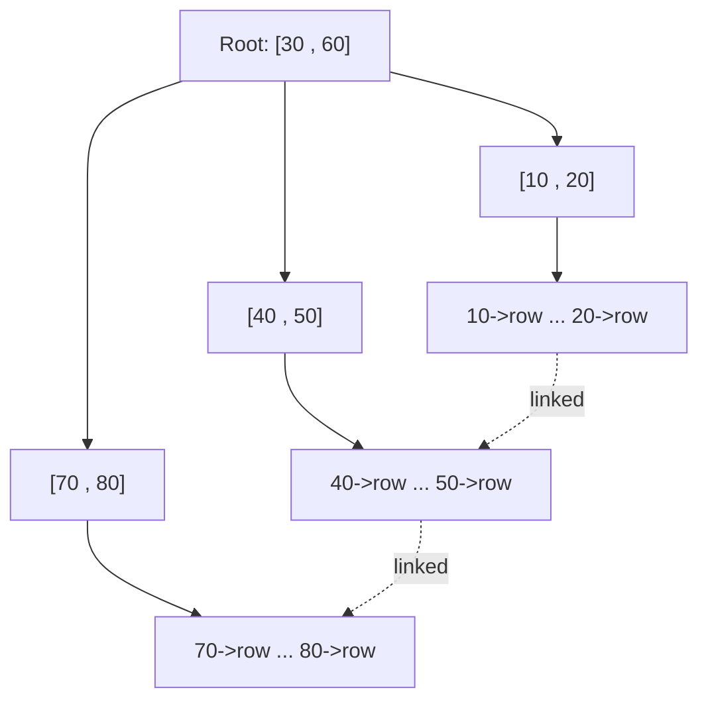
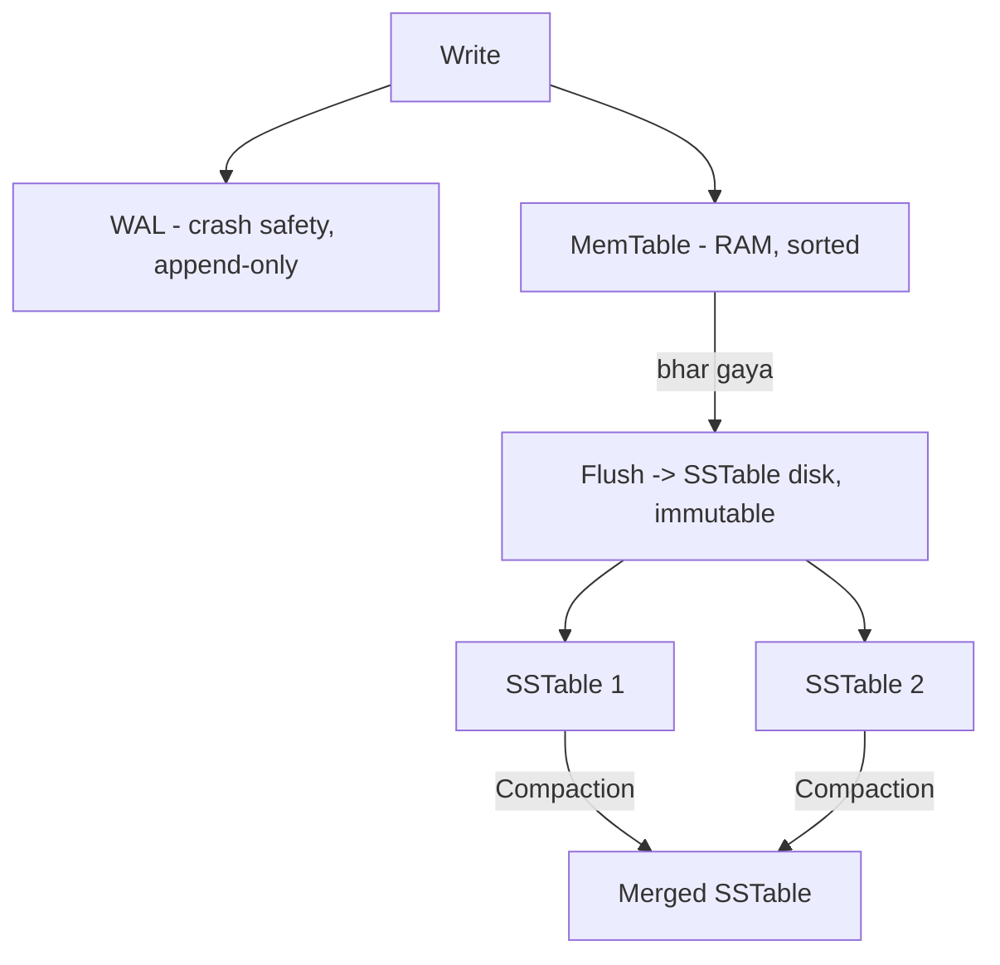

# 🗂️ Database Indexing — Deep Dive (B-Tree vs LSM-Tree, Inverted Index)

> **Index** = ek alag data structure jo query ko **tez** banata hai — bina poori table scan kiye
> row(s) dhoondh lo. Kitaab ke peeche ka "index" jaisa: word → page number. Bina index, DB ko
> **poori table** padhni padti hai (O(n) full scan); index se seedha row (O(log n) ya O(1)).

---

## 1. Kyun? — Full scan vs Index scan

Socho 1 crore users ki table, `WHERE email = 'a@b.com'`:
- **Bina index:** DB har row check karega → 1 crore comparisons (**full table scan**). Slow.
- **Index (email pe):** sorted structure me binary-search jaisa → ~24 steps (log₂ 1cr). ⚡



> **Trade-off ek line me:** Index **reads tez** karta hai par **writes slow** (har insert/update pe
> index bhi update), aur **extra storage** leta hai. Isi liye "har column pe index" galat hai.

---

## 2. Index andar se — kaunsa data structure?

| Structure | Kaam ke liye | Kahan |
|---|---|---|
| **B-Tree / B+Tree** | Range + equality dono; general purpose | Postgres, MySQL(InnoDB), Oracle |
| **LSM-Tree** | Write-heavy workloads | Cassandra, RocksDB, LevelDB, ScyllaDB |
| **Hash index** | Sirf exact equality (`=`), range nahi | Redis, Postgres hash index |
| **Inverted index** | Full-text search (word → docs) | Elasticsearch, Lucene, Solr |
| **Bitmap index** | Low-cardinality columns (gender, status) | Data warehouses |
| **R-Tree / Quadtree / Geohash** | Geospatial ("nearby") | PostGIS, [Geospatial](./06_Geospatial_and_Location_Services.md) |

---

## 3. B+Tree — reads ka raja (most common)

Zyada tar relational DBs default me **B+Tree** use karti hain.



**B+Tree ki khaasiyat:**
- **Balanced** — saare leaf same depth pe → har lookup ~same time (O(log n)).
- **High fanout** — ek node me bahut keys → tree **chhota/chaudda** (3-4 levels me crores rows). Kam disk reads.
- **Leaves linked** (B+Tree me) → **range queries** tez (`WHERE age BETWEEN 20 AND 40` — bas leaf chain pe chalo).
- **Sorted** → `ORDER BY`, `MIN`, `MAX`, prefix match sab fast.

**B-Tree vs B+Tree:** B-Tree me data har node pe; B+Tree me data **sirf leaves** pe + leaves linked.
Isi liye DBs B+Tree use karte hain (range scans ke liye behtar).

> **Reads: O(log n), aur range queries me strong.** Par har write ko tree me sahi jagah insert karna
> padta hai (node splits ho sakte) → random disk writes, write-heavy pe thoda slow.

---

## 4. LSM-Tree — writes ka raja

Write-heavy systems (jaise time-series, logs, Cassandra) **LSM-Tree (Log-Structured Merge-Tree)**
use karte hain. Idea: **random writes ko sequential banao.**



**Kaise:**
1. Write pehle **WAL** (write-ahead log, append-only, crash recovery) me, phir **MemTable** (RAM me sorted structure) me. Write turant done → **super fast writes**. ⚡
2. MemTable bhar gaya → disk pe **SSTable** (Sorted String Table, immutable file) me flush.
3. Time ke saath bahut SSTables ban jaati hain → **Compaction** background me inhe merge karta hai (purani/deleted entries hataata hai).

**Read:** pehle MemTable, phir SSTables (naye→purane). Ek key kai SSTables me ho sakti → read thoda
slow. Isko tez karne ke liye **Bloom filter** (har SSTable pe) — "ye key is file me hai ya nahi" O(1)
me bata deta hai, bekaar disk reads bachta (dekho [Bloom Filters](../Bloom_Filters_and_Probabilistic_Data_Structures.md)).

### B-Tree vs LSM-Tree
| | B+Tree | LSM-Tree |
|---|---|---|
| **Writes** | Slower (in-place, random) | ⚡ Fast (sequential append) |
| **Reads** | ⚡ Fast (ek jagah) | Slower (kai SSTables + Bloom filter se help) |
| **Write amplification** | Kam | Zyada (compaction) |
| **Space** | Fragmentation | Compaction se compact + compress |
| **Best for** | Read-heavy, OLTP | Write-heavy (logs, IoT, time-series) |
| **Examples** | Postgres, MySQL | Cassandra, RocksDB, LevelDB |

---

## 5. Clustered vs Non-Clustered Index

| | Clustered | Non-Clustered (Secondary) |
|---|---|---|
| Kya | Table ka **physical order = index order** | Alag structure, row ka **pointer** rakhta hai |
| Count | **Ek hi** per table (usually primary key) | Kai ho sakte |
| Lookup | Seedha row mil jaati (data leaf me) | Index → pointer → phir row (extra hop) |

> InnoDB (MySQL): primary key = clustered; secondary index leaf me **primary key** store hota hai,
> isi se row dhoondhi jaati (isi liye PK chhoti rakhni chahiye).

### Covering Index (ek optimization)
Agar index me **saare zaroori columns** aa jaayein, to DB ko asli row chhune ki zaroorat hi nahi —
query "index-only" ho jaati. Example: `INDEX(user_id, status)` aur query `SELECT status WHERE user_id=?`.

---

## 6. Composite (multi-column) Index & Left-Prefix Rule

`INDEX (last_name, first_name)` — order maayne rakhta hai!

| Query | Index use hota? |
|---|---|
| `WHERE last_name='Malik'` | ✅ Haan (prefix) |
| `WHERE last_name='Malik' AND first_name='S'` | ✅ Haan (poora) |
| `WHERE first_name='S'` | ❌ Nahi (left-prefix chhoot gaya) |

> **Left-prefix rule:** composite index left se hi use hota hai. Isi liye column order sabse zyada
> filter hone waale (ya equality) column ko pehle rakho.

---

## 7. Kab index NAHI banana / kaunsa banana

**Achhe index candidates:**
- `WHERE`, `JOIN`, `ORDER BY`, `GROUP BY` me aane waale columns.
- **High cardinality** (bahut unique values: email, user_id).
- Foreign keys.

**Index se bacho jab:**
- Table chhoti (full scan waise hi fast).
- **Low cardinality** (jaise `gender` — 2 values; B-Tree faayda nahi, bitmap better).
- Write-heavy column jahan reads kam.
- Bahut saare index → har write bahut slow + storage waste.

> **Over-indexing** ek real anti-pattern hai: 15 index waali table ka har INSERT 15 index update karta.

---

## 8. Query planner ki nazar se (EXPLAIN)

DB khud decide karta hai index use karna ya nahi (cost-based). `EXPLAIN` chala ke dekho:

```sql
EXPLAIN SELECT * FROM users WHERE email = 'a@b.com';
-- "Index Scan using idx_email"  -> achha ✅
-- "Seq Scan on users"           -> index nahi laga (galat/missing index?) ⚠
```

- **Statistics** (data distribution) planner ko batati hain kaunsa plan sasta.
- Kabhi-kabhi planner full-scan chunta hai jaan-boojh ke (agar query zyada rows laa rahi ho — index tab
  ulta mehnga). Isi liye index hone ka matlab "hamesha use hoga" nahi.

---

## ✅ / ❌ Summary of trade-offs

**✅ Index deta hai**
- Tez lookups (O(log n)), range/sort/GROUP BY fast, unique constraint enforce.

**❌ Index ki keemat**
- Har write slow (index bhi update), extra storage/RAM, over-indexing se writes bahut slow, planner
  galat plan bhi le sakta.

---

## 🎤 Interview Q&A

**Q: Index reads tez karta hai to har column pe kyun nahi lagate?**
Har write pe har index update hota → writes slow + storage waste; low-cardinality pe faayda bhi nahi.

**Q: B-Tree vs LSM-Tree?**
B-Tree read-heavy/OLTP (in-place, range fast); LSM-Tree write-heavy (sequential append + compaction, Cassandra/RocksDB).

**Q: LSM me reads slow kyun, aur kaise tez karte?**
Ek key kai SSTables me → sab check karni pad sakti; **Bloom filter** per-SSTable se "nahi hai" O(1) me pata → bekaar disk reads bache.

**Q: Clustered vs non-clustered index?**
Clustered = physical row order = index (ek per table, usually PK); non-clustered = alag structure with row pointer (kai ho sakte).

**Q: `INDEX(a,b)` hai, `WHERE b=?` index use karega?**
Nahi — left-prefix rule, `a` skip nahi kar sakte.

**Q: Covering index?**
Jab index me saare needed columns ho → asli row chhune ki zaroorat nahi (index-only scan, tez).

**Q: Composite index me column order kaise chunoge?**
Equality/high-selectivity columns pehle; queries ke access pattern ke hisaab se (left-prefix).

---

## Summary
- **Index** = read tez, write slow + storage — soch-samajh ke lagao.
- **B+Tree** = default, read + range queries strong (Postgres/MySQL).
- **LSM-Tree** = write-heavy (Cassandra/RocksDB), Bloom filter se reads tez.
- **Clustered** (ek, PK) vs **secondary** index; **covering index** = index-only, super fast.
- **Composite index** left-prefix rule follow karta; high-cardinality columns achhe candidates.
- Low-cardinality/chhoti table/write-heavy pe index se bacho; `EXPLAIN` se verify karo.

> **Related:** [Database Design Tips](../16_Database_Design_Tips.md) · [SQL vs NoSQL](../SQL_vs_NoSQL.md) · [Database Sharding](../21_Database_Sharding.md) · [Bloom Filters](../Bloom_Filters_and_Probabilistic_Data_Structures.md) · [Search Systems](./04_Search_Systems_and_Elasticsearch.md)
