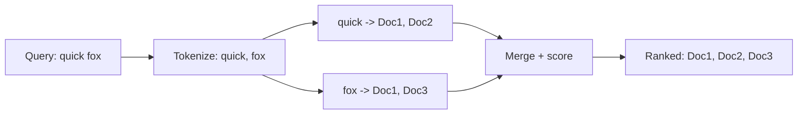
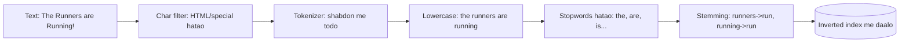
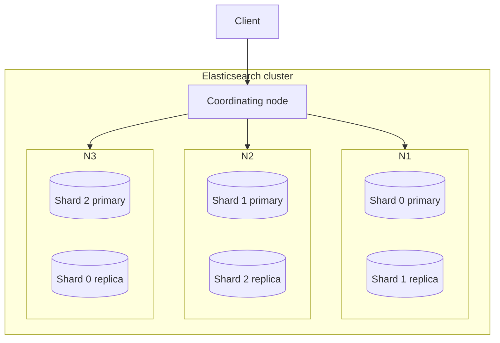
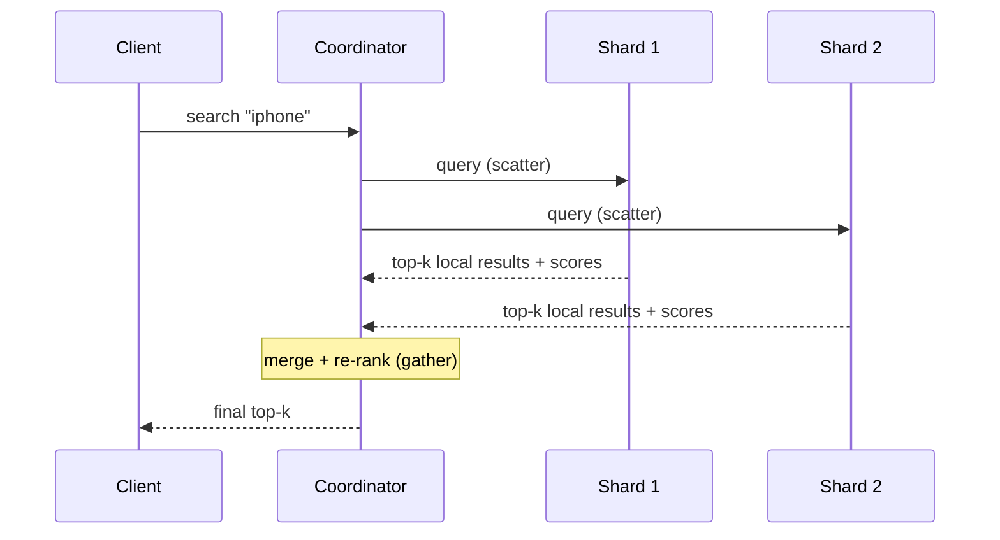
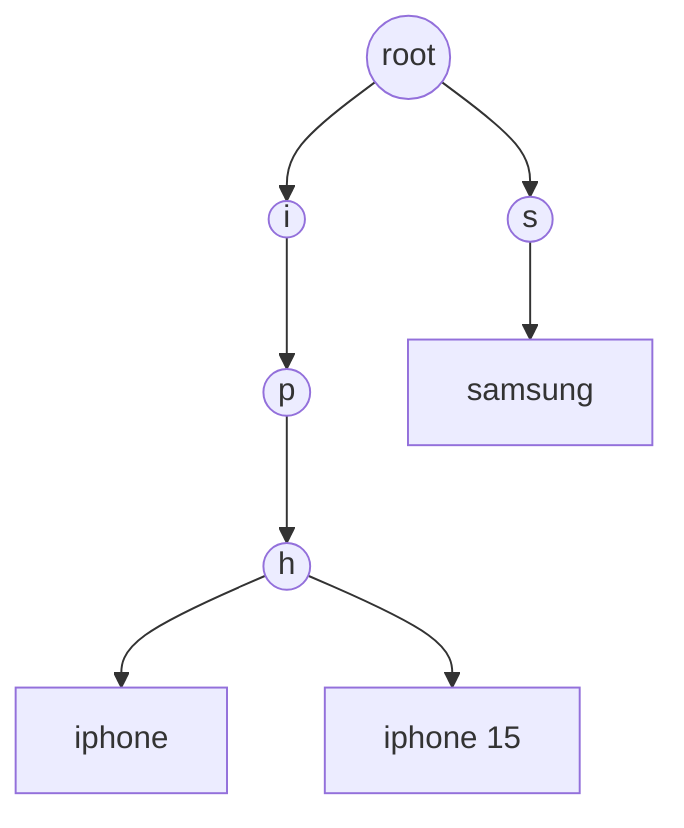
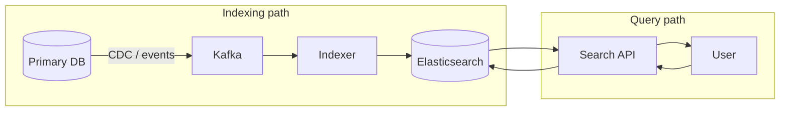

# 🔍 Search Systems & Elasticsearch — Full-Text Search, Autocomplete

> **Search system** = bade text/document collection me se relevant results **turant** dhoondhna,
> sirf exact match nahi balki **relevance** ke saath ("iphone charger" type karo → best matching
> products, typo tolerance ke saath, ranked). Normal `LIKE '%iphone%'` SQL query bade scale pe
> **bilkul** kaam nahi karti — isi liye dedicated search engines (Elasticsearch, Lucene, Solr).

---

## 1. Kyun `LIKE` kaafi nahi?

```sql
SELECT * FROM products WHERE name LIKE '%iphone charger%';
```
Problems:
- **Full table scan** — index use nahi hota (leading `%`), 10 crore rows pe deadly slow.
- **No relevance ranking** — kaunsa result best hai? Pata nahi.
- **No typo tolerance** — "ifone" likha to 0 results.
- **No word-level match** — "charger iphone" (ulta order) match nahi hoga.
- **No stemming** — "running" search karo, "run" match nahi.

> Search ek **alag problem** hai — isi liye alag engine (Elasticsearch) jo **inverted index** pe bana hai.

---

## 2. Inverted Index — search engine ka dil

Normal index: document → words. **Inverted index** ulta: **word → kaunse documents me hai**.
Bilkul kitaab ke peeche waale index jaisa.

```
Docs:
  Doc1: "the quick brown fox"
  Doc2: "quick brown dogs"
  Doc3: "the lazy fox"

Inverted Index (term -> doc list, "postings"):
  quick -> [Doc1, Doc2]
  brown -> [Doc1, Doc2]
  fox   -> [Doc1, Doc3]
  lazy  -> [Doc3]
  dogs  -> [Doc2]
```

Query **"quick fox"** → `quick`=[1,2] ∩/∪ `fox`=[1,3] → Doc1 (dono words) top, phir Doc2/Doc3.
Sab **O(matching docs)**, poori table scan nahi. ⚡



---

## 3. Text Analysis Pipeline (index karte waqt)

Document ko inverted index me daalne se pehle **analyze** kiya jaata hai — yehi search ko "smart" banata hai.



| Step | Kaam | Example |
|---|---|---|
| **Tokenization** | Text ko words me todna | "quick brown" → [quick, brown] |
| **Lowercasing** | Case-insensitive | "Fox" → "fox" |
| **Stop words** | Common bekaar words hatao | the, a, is, and |
| **Stemming/Lemmatization** | Word ko root me | running/runs/ran → run |
| **Synonyms** | Alag shabd = same meaning | "laptop" = "notebook" |

> **Zaroori:** query time pe **wahi** analysis chalti hai jo index time pe. "Running" search → "run"
> ban ke index ke "run" se match hota hai. Isi liye analyzer index+query dono pe same rakhte hain.

---

## 4. Relevance Ranking — TF-IDF & BM25

Match to mil gaye, par **order** kaise? Kaunsa result upar?

- **TF (Term Frequency):** word document me jitni baar → utna relevant.
- **IDF (Inverse Document Frequency):** jo word **har jagah** aata hai (jaise "the") wo kam important;
  jo **rare** hai wo zyada important.
- **TF-IDF score = TF × IDF.** Elasticsearch default me **BM25** use karta (TF-IDF ka improved
  version jo document length ko bhi consider karta — lambi document me jyada matches ka unfair
  advantage kam karta).

> Real ranking me BM25 ke upar **business signals** bhi jode jaate: popularity, recency, rating,
> personalization, "boost" fields (title match > description match). Isko **relevance tuning** kehte.

---

## 5. Elasticsearch Architecture

Elasticsearch = Apache **Lucene** (jo asli inverted index deta) ke upar ek distributed, scalable layer.



| Concept | Matlab |
|---|---|
| **Document** | Ek JSON record (ek product, ek log line) |
| **Index** | Documents ka collection (jaise SQL "table") |
| **Shard** | Index ka ek tukda (Lucene index) — **horizontal scaling** ([Sharding](../21_Database_Sharding.md)) |
| **Replica** | Shard ki copy — availability + read scaling ([Replication](../Database_Replication.md)) |
| **Node** | Ek server; **cluster** = kai nodes |
| **Coordinating node** | Query saare relevant shards ko bhejta, results merge karta |

### Query flow (scatter-gather)


> **Scatter-gather:** har shard apne top-k local results deta, coordinator sabko merge kar ke global
> top-k deta. Isi liye zyada shards = zyada parallelism (par merge cost bhi).

---

## 6. Autocomplete / Typeahead (search-as-you-type)

"iph" type karte hi "iphone, iphone 15, iphone charger" dikhna. Ye alag challenge hai — har keystroke pe query, ultra-low latency chahiye.

**Approaches:**
| Technique | Kaise |
|---|---|
| **Edge n-grams** | Index time pe prefixes bana lo: "iphone" → i, ip, iph, ipho... → prefix match instant |
| **Completion suggester** (ES) | Special FST (finite state transducer) structure, RAM me, super fast |
| **Trie** (prefix tree) | Custom autocomplete service ka classic DS — prefix → completions |



> **Trie + popularity:** har node pe top-N popular completions pre-compute karke rakho → "iph" pe
> turant top suggestions, bina poora subtree traverse kiye. Ranking me search frequency use karo.

---

## 7. Search System Architecture (end-to-end)



- **Source of truth = primary DB** (Postgres/Mongo). Elasticsearch **derived/secondary** index hai —
  search ke liye, transactional truth ke liye nahi.
- **Sync:** DB → ES ko **CDC (Change Data Capture)** ya event stream se update rakho (dekho CDC concept).
  Ye **eventually consistent** hota hai (search me thoda lag chalta hai).

> **Interview point:** "Elasticsearch ko source of truth mat banao — wo search/analytics ke liye
> derived store hai; transactions primary DB me."

---

## 8. Search vs Analytics (ES dono karta)
Elasticsearch sirf full-text search nahi — **aggregations** (facets, filters, counts) bhi karta:
"Brand: Apple (120), Samsung (80)" jaise filters, log analytics (ELK stack me "K" = Kibana), metrics.

---

## ✅ / ❌ Trade-offs

**✅ Faayde**
- Blazing fast full-text search (inverted index), relevance ranking, typo/stemming/synonyms.
- Horizontally scalable (shards), highly available (replicas).
- Aggregations/analytics + autocomplete.

**❌ Challenges**
- **Not a source of truth** — eventually consistent, transactions nahi.
- **Sync complexity** — DB↔ES consistent rakhna (CDC pipelines).
- **Resource hungry** — RAM/CPU bahut (JVM heap).
- **Reindexing** mehnga (schema/analyzer badla to poora reindex).
- **Eventual consistency** — abhi likha document search me thodi der baad dikhta.

---

## 🎤 Interview Q&A

**Q: SQL `LIKE '%x%'` search ke liye kyun bura?**
Full scan (leading % pe index nahi), no ranking, no typo/stemming/word-order handling — bade scale pe slow + weak results.

**Q: Inverted index kya hai?**
term → us term waale documents ki list (postings). Query terms ke postings merge karke matching docs O(matches) me milte.

**Q: Search results ka order (relevance) kaise?**
TF-IDF / BM25 (term frequency × rarity, length-normalized) + business boosts (popularity/recency).

**Q: Stemming/analysis kyun?**
"running"→"run" taaki alag forms match ho; stop words hatao; index aur query pe same analyzer.

**Q: Elasticsearch ko primary DB bana sakte?**
Nahi — derived/secondary search store (eventually consistent, no ACID txns); source of truth alag DB, sync via CDC.

**Q: Autocomplete kaise?**
Edge n-grams / trie / completion suggester; popularity se rank; low-latency prefix match.

**Q: ES scale kaise karta?**
Index ko **shards** me todta (parallel + horizontal), **replicas** availability + read scaling; query scatter-gather.

---

## Summary
- Search = relevance-ranked full-text retrieval; **inverted index** (word→docs) iska core.
- **Analysis pipeline** (tokenize, lowercase, stopwords, stemming, synonyms) search ko smart banati.
- **BM25/TF-IDF** ranking + business boosts; **Elasticsearch** (Lucene + distributed shards/replicas).
- **Autocomplete** = edge n-grams / trie / completion suggester + popularity.
- ES = **derived** store (CDC se sync, eventually consistent) — source of truth primary DB me rehta.

> **Related:** [Database Indexing](./03_Database_Indexing_Deep_Dive.md) · [Big Data & Stream Processing](./05_Big_Data_and_Stream_Processing.md) · [Message Queues](../18_Message_Queues_Kafka_RabbitMQ.md) · [Database Sharding](../21_Database_Sharding.md) · [Database Replication](../Database_Replication.md)
