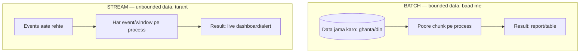
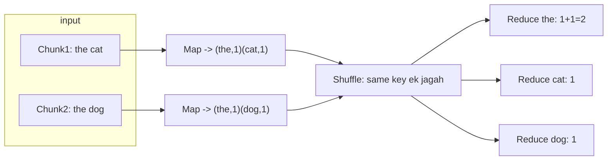
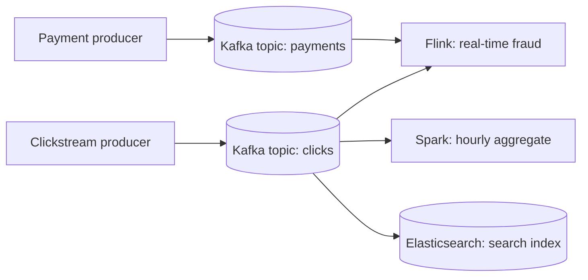
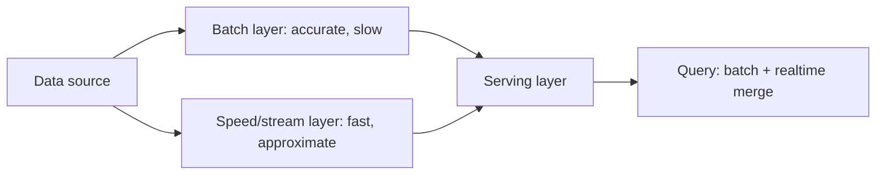
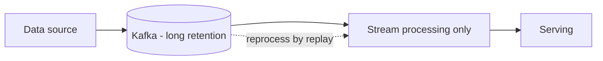
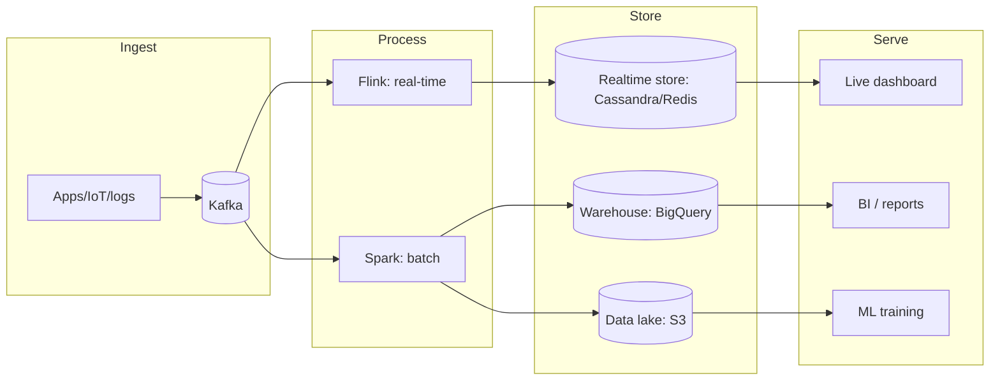

# 🌊 Big Data & Stream Processing — Batch, Streaming, MapReduce, Lambda/Kappa

> **Big Data** = itna zyada/tez/vividh data ki normal single-machine tools fail ho jaayein. Isko
> process karne ke do tareeke: **Batch** (bade chunks, baad me) aur **Stream** (aata rahe, turant).
> Analytics, recommendations, fraud detection, dashboards, ML pipelines — sab isi ke upar bante hain.

---

## 1. The "V"s of Big Data

| V | Matlab |
|---|---|
| **Volume** | Bahut zyada (TB/PB) |
| **Velocity** | Bahut tez aa raha (lakhs events/sec) |
| **Variety** | Alag-alag formats (JSON, logs, images, clickstream) |
| **Veracity** | Data quality/trust (dirty, duplicate, missing) |

Single DB ye handle nahi kar sakti → **distributed** storage + processing chahiye.

---

## 2. Batch vs Stream Processing (core difference)

| | **Batch** | **Stream** |
|---|---|---|
| Data | Bounded (fixed chunk) | Unbounded (aata rehta) |
| Latency | Minutes–hours | Milliseconds–seconds |
| Throughput | Bahut high | High |
| Use case | Daily report, billing, ML training, ETL | Fraud alert, live metrics, real-time reco |
| Tools | Hadoop MapReduce, Spark, Hive | Kafka Streams, Flink, Spark Streaming |
| Compute | "Data pe compute lao" | "Data ke aane par compute" |

> **Ek line:** Batch = "kal ka pura data raat ko process"; Stream = "abhi ho raha event abhi process".

---

## 3. MapReduce — distributed batch ka foundation

Google ka MapReduce (Hadoop me open-source) — bade data ko **kai machines pe** baant ke process karne ka model. Do phases: **Map** aur **Reduce**.

**Example: word count (poore internet me har word kitni baar)**

1. **Map:** har chunk ko alag machine parallel me process karti → `(key, value)` pairs banati.
2. **Shuffle & Sort:** same key ke saare values ek reducer pe ikattha (network heavy step).
3. **Reduce:** har key ke values ko combine (jaise sum) → final result.

> **Key idea — "move compute to data":** data already kai machines pe pada hai (HDFS); code ko data
> ke paas bhejo (chhota), data ko network pe mat kheencho (bada). Isse massive parallelism.

**MapReduce ki dikkat:** har step disk pe likhta (slow), iterative/ML jobs me bahut disk I/O. Isi ne
**Spark** ko janm diya.

---

## 4. Apache Spark — MapReduce se 10-100x tez

Spark data ko **RAM (in-memory)** me rakhta hai steps ke beech → iterative kaam (ML, graph) bahut tez.

- **RDD / DataFrame** — distributed collection (abstraction).
- **DAG execution** — operations ka optimized graph banata, lazy evaluation.
- **Unified** — batch + streaming (Structured Streaming) + SQL + ML (MLlib) + graph, ek engine me.

| | MapReduce | Spark |
|---|---|---|
| Storage between steps | Disk | Memory (RAM) |
| Speed | Baseline | 10-100x (memory) |
| API | Low-level | High-level (DataFrame/SQL) |
| Streaming | Nahi | Haan (micro-batch) |

---

## 5. Stream Processing — concepts

Streaming me data kabhi khatam nahi hota, isi liye kuch naye concepts:

### Windowing (unbounded ko bounded banao)
"Last 5 minute me kitne clicks" — poora stream nahi, ek **window**:

| Window type | Matlab |
|---|---|
| **Tumbling** | Fixed, non-overlapping (0-5min, 5-10min...) |
| **Sliding** | Overlapping (har 1 min pe last 5 min) |
| **Session** | Activity ke gap se define (user session) |

### Event time vs Processing time
- **Event time:** event **hua** kab (mobile pe click hua).
- **Processing time:** server ne **process** kab kiya.
- **Problem — late/out-of-order events:** mobile offline tha, event 10 min baad aaya. Kis window me
  daalein? Isko handle karne ke liye **watermarks** (kitni der tak late events wait karein).

### Delivery semantics
| Guarantee | Matlab |
|---|---|
| **At-most-once** | Zyada se zyada ek baar (loss ho sakta) |
| **At-least-once** | Kam se kam ek baar (duplicate ho sakta → idempotency chahiye) |
| **Exactly-once** | Theek ek baar (mushkil, Flink/Kafka checkpoints se) |

> Dekho [Idempotency](../Idempotency.md) — at-least-once + idempotent consumer = practically exactly-once.

---

## 6. Kafka — stream ka backbone

Streaming pipelines ka dil aksar **Kafka** hota hai — durable, ordered, replayable log. Producers events
daalte, consumers padhte, data disk pe retained (replay ho sakta).

> Ek hi stream ko **kai consumers** alag-alag kaam ke liye padh sakte (fraud, analytics, search index)
> — decoupling. Detail: [Message Queues](../18_Message_Queues_Kafka_RabbitMQ.md), [Event-Driven Architecture](../Event_Driven_Architecture.md).

---

## 7. Lambda vs Kappa Architecture

Bade systems ko **fast (approximate, real-time)** aur **accurate (complete, batch)** dono chahiye.

### Lambda Architecture — do layers

- **Batch layer:** poora data, accurate, per-din recompute (source of truth).
- **Speed layer:** real-time approximate (batch ke gap ko bharta).
- **Serving layer:** dono merge kar ke query answer.
- ❌ **Downside:** **do jagah same logic** likhna (batch code + stream code) — maintenance dard.

### Kappa Architecture — sirf stream

- Sirf **ek** stream pipeline. "Batch" ki zaroorat pade to Kafka se **puraana data replay** karo.
- ✅ Ek codebase; ❌ historical reprocessing stream engine pe daala jaata.

| | Lambda | Kappa |
|---|---|---|
| Layers | Batch + Speed | Sirf Stream |
| Code | Do jagah (duplicate logic) | Ek jagah |
| Reprocessing | Batch layer | Stream replay (Kafka) |
| Complexity | Zyada | Kam |

---

## 8. Data Storage: Lake vs Warehouse

| | Data Lake | Data Warehouse |
|---|---|---|
| Data | Raw, koi bhi format (schema-on-read) | Structured, cleaned (schema-on-write) |
| Cost | Sasta (S3/HDFS) | Mehnga |
| Users | Data scientists, ML | Analysts, BI dashboards |
| Examples | S3 + Hadoop, Delta Lake | Snowflake, BigQuery, Redshift |
| Query | Flexible, slow | Fast SQL, optimized |

- **ETL vs ELT:** ETL = transform pehle, phir load (warehouse). ELT = load raw pehle (lake), transform baad me. Modern trend ELT (storage sasta).
- **Lakehouse** = dono ka mix (Databricks Delta Lake).

---

## 9. End-to-End Big Data Pipeline

---

## ✅ / ❌ Trade-offs

**✅ Faayde**
- Massive scale (PB), horizontal, parallel.
- Batch = accurate/cheap; Stream = real-time insights.
- Decoupled (Kafka) → kai consumers, replay.

**❌ Challenges**
- Distributed complexity (failures, stragglers, skew).
- Exactly-once mushkil; late/out-of-order events (watermarks).
- Lambda = duplicate logic; data quality/governance; cost.

---

## 🎤 Interview Q&A

**Q: Batch vs stream, ek line?**
Batch = bounded data baad me high-throughput; Stream = unbounded data turant low-latency.

**Q: MapReduce kaise kaam karta?**
Map (parallel key-value banao) → Shuffle (same key ek jagah) → Reduce (combine). "Move compute to data".

**Q: Spark MapReduce se tez kyun?**
Steps ke beech data RAM me rakhta (disk nahi) → iterative/ML 10-100x fast.

**Q: Event time vs processing time?**
Event time = event hua kab; processing time = process hua kab. Late/out-of-order events ke liye watermarks.

**Q: Lambda vs Kappa?**
Lambda = batch + speed layer (accurate + fast, par duplicate logic); Kappa = sirf stream, historical ke liye Kafka replay.

**Q: Exactly-once kaise?**
Mushkil; at-least-once + idempotent consumer, ya Flink/Kafka checkpointing/transactions.

**Q: Data lake vs warehouse?**
Lake = raw, sasta, schema-on-read (ML); warehouse = structured, fast SQL, schema-on-write (BI).

---

## Summary
- **Big Data** (Volume/Velocity/Variety) → distributed store + process.
- **Batch** (MapReduce/Spark) = high-throughput accurate; **Stream** (Flink/Kafka Streams) = low-latency real-time.
- **MapReduce** = Map→Shuffle→Reduce, "compute to data"; **Spark** = in-memory, 10-100x, unified.
- **Streaming concepts:** windowing, event vs processing time, watermarks, delivery semantics.
- **Lambda** (batch+speed, duplicate logic) vs **Kappa** (stream-only, replay); **Lake vs Warehouse** for storage.

> **Related:** [Message Queues (Kafka)](../18_Message_Queues_Kafka_RabbitMQ.md) · [Event-Driven Architecture](../Event_Driven_Architecture.md) · [Idempotency](../Idempotency.md) · [Search Systems](./04_Search_Systems_and_Elasticsearch.md) · [Database Sharding](../21_Database_Sharding.md)
