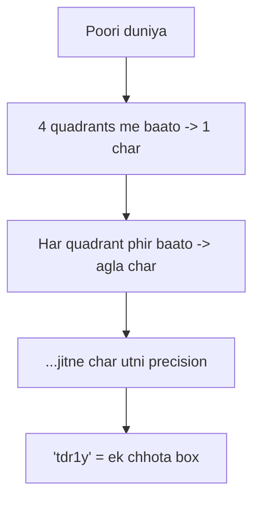
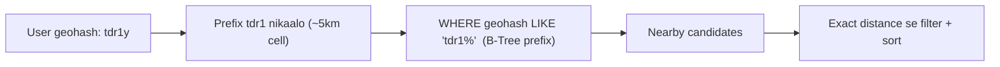
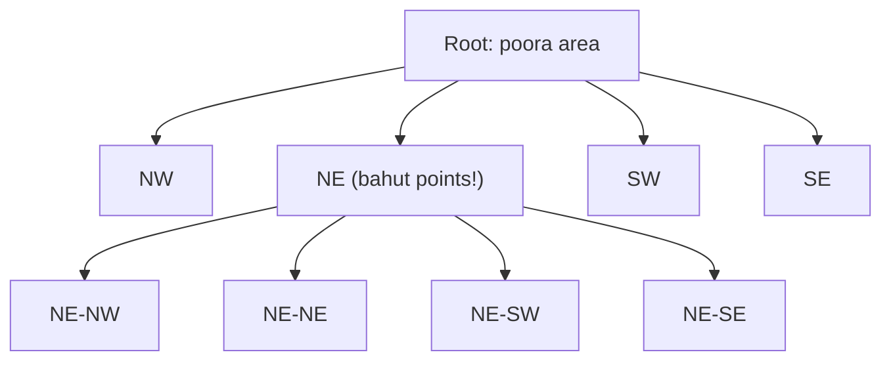
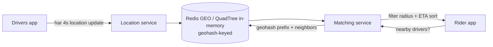

# 📍 Geospatial & Location-Based Services — Geohash, Quadtree, S2

> **Location-based service** = "mere aas-paas kya hai?" ka jawaab dena — nearby drivers (Uber),
> restaurants (Swiggy/Zomato), friends (Snapchat), ATMs. Challenge: crores points me se **radius/area**
> ke andar waale turant dhoondhna. Normal DB index (B-Tree) 2D proximity pe kaam nahi karta — isi liye
> special geospatial techniques: **Geohash, Quadtree, S2, R-Tree**.

---

## 1. Problem — "nearby" itna mushkil kyun?

User `(lat, lng)` pe hai, 5 km ke andar drivers chahiye. Naive SQL:
```sql
SELECT * FROM drivers
WHERE lat BETWEEN ? AND ? AND lng BETWEEN ? AND ?;
```
Dikkatein:
- **Do alag B-Tree index** (lat, lng) — DB ek use karta, doosre pe filter (bahut rows scan). Slow.
- Ye ek **box** deta, **circle (radius)** nahi → corners galat.
- Crores points + har second lakhs queries (Uber) → ye approach **fat jaata**.

> **Asli idea:** 2D space ko **cells/grid** me baanto, har point ko ek cell ID do, aur us cell ID pe
> **normal 1D index** laga do. Ab "nearby" = "same + padosi cells" — ek 1D lookup. Yehi geohash/quadtree/S2 karte hain.

---

## 2. Geohash — 2D ko chhoti si string me badlo

**Geohash** poori duniya ko recursive grid me baant ke har location ko ek **short string** deta hai
(jaise `tdr1y`). Lambi string = zyada precise (chhota box).



| Geohash length | Box size (approx) |
|---|---|
| 4 chars | ~40 km |
| 5 chars | ~5 km |
| 6 chars | ~1.2 km |
| 7 chars | ~150 m |
| 8 chars | ~40 m |

### ⭐ Geohash ka jaadu: prefix = proximity
Do jagah **paas** hain to unke geohash ka **prefix same** hota hai:
- `tdr1y` aur `tdr1z` → dono `tdr1` me → paas paas.
- Ab "nearby" = `WHERE geohash LIKE 'tdr1%'` → ek **normal string index (B-Tree)** pe prefix query! ⚡



### Edge case — boundary problem
Do bilkul paas ki jagah alag cell me pad sakti hain (border ke aar-paar), tab prefix alag ho jaata.
**Fix:** query karte waqt user ki cell + **8 padosi cells** (neighbors) bhi include karo → boundary miss na ho.

> **Redis GEO** commands (`GEOADD`, `GEOSEARCH`) andar geohash hi use karte hain — production me
> nearby ke liye bahut popular.

---

## 3. Quadtree — density ke hisaab se adaptive grid

**Quadtree** = tree jahan har node ka area **4 quadrants** me tootta hai — **sirf tab** jab us cell me
points ki count ek limit (jaise 100) se zyada ho.



- **Dense area** (jaise city center) → cell aur baar-baar tootti → chhoti cells (fine).
- **Empty area** (jaise samundar/desert) → ek badi cell (coarse). **Space waste nahi.**
- **Query:** tree me utro jahan user hai, us cell + neighbors ke points lo → distance se filter.

> **Geohash vs Quadtree:** Geohash = **fixed grid** (simple, DB me string index — great for sharding/storage).
> Quadtree = **adaptive** (density ke hisaab se), in-memory structures me strong (dynamic points, e.g. moving drivers).

---

## 4. Google S2 — sphere ko sahi tareeke se

Geohash flat rectangles use karta — poles pe distortion aata (Earth gol hai). **S2** Earth ko ek cube
me project karke, phir **Hilbert curve** se cells ko number karta:
- **Kam distortion** (sphere-aware), cells almost equal-area.
- **Hilbert curve** = ek space-filling curve jo 2D locality ko 1D me achhe se preserve karti (paas ke
  cells ke IDs bhi paas) → 1D range index pe proximity.
- Uber, Google Maps geospatial isi tarah ke ideas use karte.

---

## 5. R-Tree — DB me built-in geospatial index

Relational/geo DBs (PostGIS, MySQL spatial) **R-Tree** use karti hain — nested **bounding boxes** ka
tree. Har node ek rectangle jo apne bachchon ko cover karta. Query box se overlap na kare wo poori
subtree skip. Points, lines, polygons (sirf points nahi) sab handle karta.

| Structure | Best for |
|---|---|
| **Geohash** | Simple, DB string index, sharding, key-value (Redis GEO) |
| **Quadtree** | In-memory, dynamic/moving points, density-adaptive |
| **S2** | Sphere-accurate, large scale (Google/Uber) |
| **R-Tree** | DB-native, polygons/shapes (PostGIS) |

---

## 6. Real Design — "Uber: nearby drivers"



**Key decisions:**
- **Write-heavy:** har driver har ~4 sec location bhejta → lakhs writes/sec. In-memory (Redis/quadtree)
  + sharding by region zaroori (persistent DB har update nahi jhelegi).
- **Read (nearby):** rider ki cell + neighbors ke drivers lo → exact distance filter → ETA se sort.
- **Sharding by geohash prefix** → ek region ek shard (dekho [Sharding](../21_Database_Sharding.md)).
- **Hotspot** (concert/airport pe bahut drivers) → us cell ko aur split (quadtree adaptive yahin jeetta).

> **Interview point:** location data **ephemeral** (purana bekaar) — TTL rakho, latest hi maayne rakhta.
> Truth-of-driver-location ke liye in-memory + periodic snapshot, transactional DB nahi.

---

## 7. Distance formula (candidate filter ke baad)

Cell se candidates mil gaye, ab **exact** distance:
- **Haversine formula** — sphere pe do lat/lng ke beech great-circle distance (accurate).
- **Euclidean** — chhoti dooriyon pe approximate (fast, par Earth curvature ignore).

Flow hamesha: **geospatial index se candidates (moti chhanni) → exact distance se filter/sort (baareek chhanni).**

---

## ✅ / ❌ Trade-offs

**✅ Faayde**
- 2D proximity ko 1D index pe laa deta → crores points pe fast nearby.
- Geohash = simple + shardable; Quadtree = density-adaptive; S2 = sphere-accurate.
- Redis GEO / PostGIS ready-made.

**❌ Challenges**
- **Boundary problem** (neighbors bhi query karne padte).
- Fixed grid (geohash) hotspots pe uneven; precision vs recall tuning.
- Moving objects (drivers) = constant updates → write-heavy, in-memory + TTL chahiye.
- Exact distance ke liye alag filter step (index sirf candidates deta).

---

## 🎤 Interview Q&A

**Q: `WHERE lat BETWEEN.. AND lng BETWEEN..` kyun bura?**
Do alag index (ek hi use hota), box deta circle nahi, crores rows pe bahut scan — slow.

**Q: Geohash proximity kaise deta?**
2D location → grid string; paas ki jagah ka **prefix same** → nearby = `LIKE 'prefix%'` on normal B-Tree index.

**Q: Geohash ki boundary problem + fix?**
Border ke aar-paar paas ki jagah alag prefix me; fix = user cell + 8 neighbor cells bhi query karo.

**Q: Geohash vs Quadtree?**
Geohash fixed grid (simple, DB/sharding); Quadtree adaptive (dense area zyada split) — moving/in-memory ke liye better.

**Q: S2 kya extra deta?**
Sphere-aware (kam distortion, equal-area cells) + Hilbert curve se strong 1D locality — large scale (Google/Uber).

**Q: Uber nearby-drivers kaise design karoge?**
In-memory geohash/quadtree (Redis GEO) region-sharded, drivers har few-sec update (TTL), rider ki cell+neighbors → Haversine filter → ETA sort.

**Q: Candidates ke baad exact distance?**
Haversine (sphere) accurate; Euclidean chhoti dooriyon pe approximate.

---

## Summary
- 2D proximity ke liye normal index kaam nahi → **cell-based** techniques (2D→1D).
- **Geohash** = recursive grid string, **prefix = proximity**, DB index + sharding friendly; boundary ke liye neighbors bhi query.
- **Quadtree** = density-adaptive (dense zyada split) — in-memory/moving points; **S2** = sphere-accurate + Hilbert curve; **R-Tree** = DB-native, polygons.
- **Uber-nearby** = in-memory region-sharded geohash/quadtree + TTL + Haversine filter + ETA sort.

> **Related:** [Database Indexing](./03_Database_Indexing_Deep_Dive.md) · [Database Sharding](../21_Database_Sharding.md) · [Caching](../08_Caching_and_Distributed_Caching.md) · [Consistent Hashing](../19_Consistent_Hashing.md)
