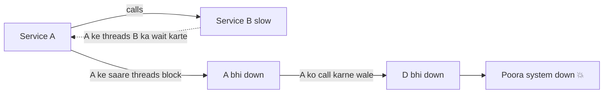
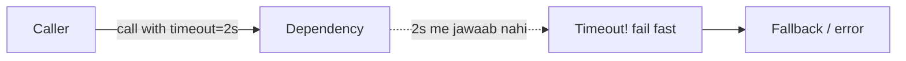
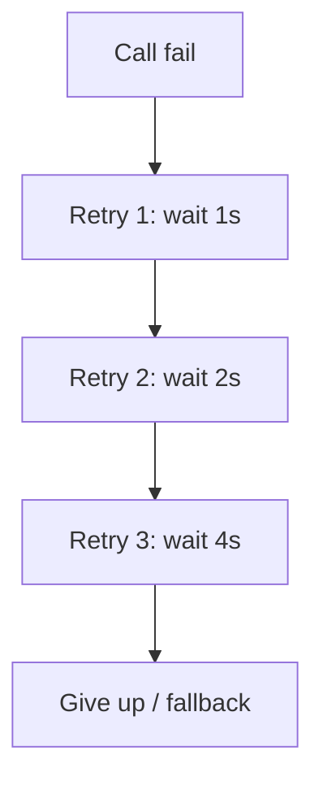
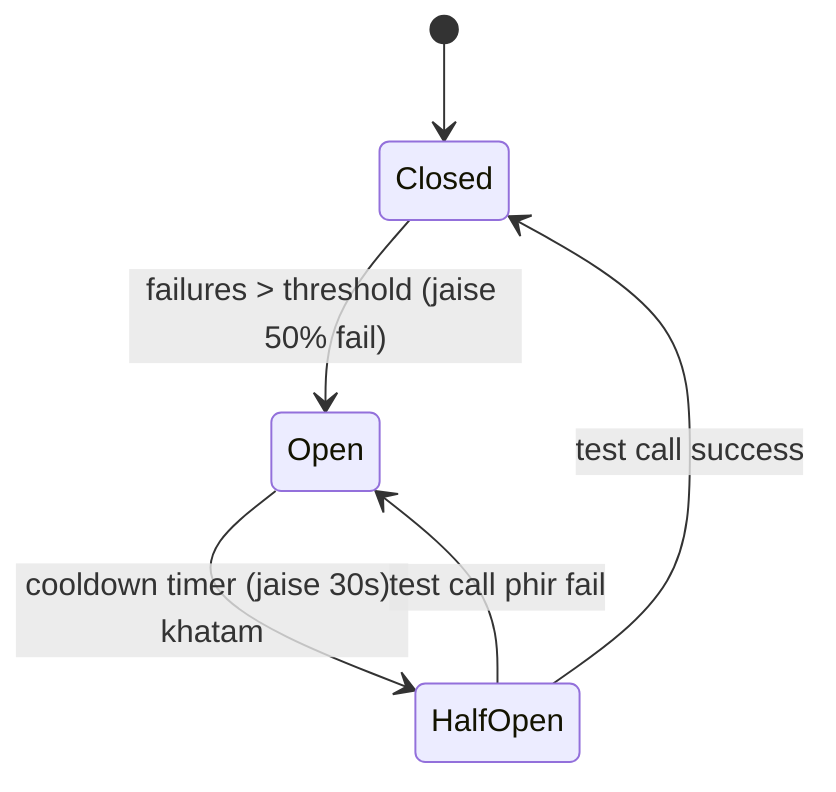
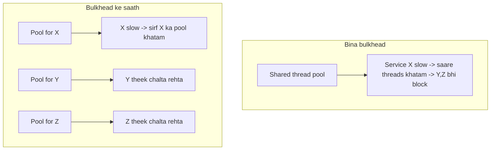
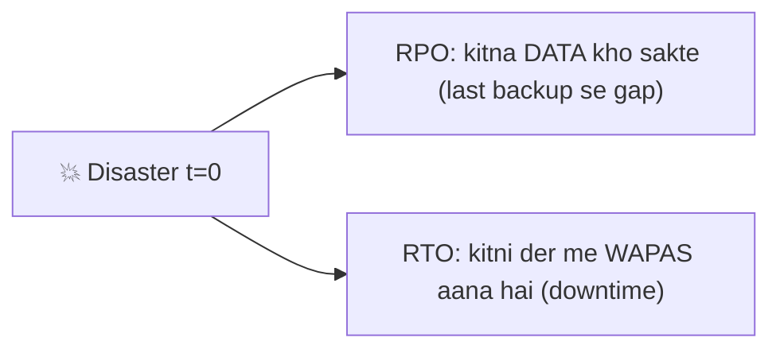

# 🛡️ Resilience & Fault Tolerance — Circuit Breaker, Retries, Bulkhead, DR

> **Resilience** = system ka **failures ke bawajood chalte rehna** (ya gracefully degrade hona), poora
> crash na hona. Distributed systems me **failure normal hai** (network, disk, dependency) — sawaal
> "agar fail hua" nahi, "**jab** fail hoga tab kya". Ye file un patterns ki hai jo ek failure ko poore
> system ka failure banne se rokte hain.

---

## 1. Fault vs Failure, aur "cascading failure"

- **Fault** = ek component me galti (ek service slow/down).
- **Failure** = poora system user ko kaam nahi de raha.
- **Goal:** faults ko failures banne se roko.

### Cascading failure (sabse bada dushman)

Ek slow dependency (B) → uske callers (A) ke threads wait me atak jaate → A bhi down → uske callers
bhi down → **domino**. Resilience patterns yahi rokte hain.

---

## 2. Timeouts — sabse basic (aur sabse zaroori)

Har network call pe **timeout** lagao. Bina timeout, ek slow dependency tumhare saare threads/connections
ko anant kaal tak block kar degi → cascading failure.

> **Rule:** koi bhi remote call (DB, cache, API) bina timeout ke mat karo. Timeout = "itni der se
> zyada wait nahi karunga, thread free karke aage badhunga." **Fail fast > hang forever.**

---

## 3. Retries — par samajhdaari se

Transient failure (ek baar ka network blip) pe retry karna theek. Par **galat retry system ko maar deta hai.**

### Exponential Backoff + Jitter

- **Fixed retry (bura):** har failure pe turant retry → dependency pehle se struggling, aur load pad gaya → **retry storm**.
- **Exponential backoff:** wait time doubling (1s, 2s, 4s...) → dependency ko saans lene ka time.
- **Jitter (randomness):** sab clients same time pe retry na karein (thundering herd). Backoff me
  random add karo → retries bikhar jaati hain.

### ⚠ Retry ke rules
- Sirf **idempotent** ops retry karo (GET, ya idempotency-key waale writes — warna double charge!). Dekho [Idempotency](../Idempotency.md).
- **Max retries** (jaise 3) — anant retry mat.
- **Retry budget** — total retries ka cap (system-wide), warna retry storm.
- 4xx (client galti) retry mat karo; 5xx/timeout (transient) retry karo.

---

## 4. Circuit Breaker — "band karo, saans lene do"

Agar koi dependency **baar-baar** fail ho rahi, to use call karte rehna bekaar (aur nuksaandeh). **Circuit
breaker** electrical fuse jaisa — failures ki limit paar → circuit "open" → aage ke calls **turant fail**
(dependency ko call kiye bina), thodi der baad "kya theek hua?" check karta.

| State | Behavior |
|---|---|
| **Closed** | Normal — calls jaa rahi, failures count ho rahe |
| **Open** | Fail limit paar → calls turant reject (fail fast) + fallback; dependency ko rest |
| **Half-Open** | Cooldown ke baad kuch test calls — theek ho gaya to Closed, warna wapas Open |

> **Faayda:** (1) struggling dependency pe load hata deta (recover hone deta), (2) caller ke threads
> block nahi hote (fail fast) → **cascading failure ruk jaata**. Tools: Resilience4j, Hystrix (purana), Envoy/Istio.

---

## 5. Bulkhead — "ek doobe to poora jahaaz na doobe"

Jahaaz me **bulkheads** (deewarein) hote hain — ek compartment me paani bhare to poora jahaaz nahi doobta.
Software me: resources ko **isolate** karo taaki ek dependency ki problem baaki ko na le dobe.

- **Example:** har downstream dependency ke liye **alag thread pool / connection pool**. Payment
  service slow ho to sirf payment ka pool bhare — search/browse chalte rahein.
- **Cloud level:** alag instances/AZ me isolation.

---

## 6. Graceful Degradation & Fallbacks

Poora fail hone se accha — **kam kaam** karo. Feature down ho to core zinda rahe.

| Situation | Graceful degradation |
|---|---|
| Recommendation service down | Generic/popular items dikha do (personalization nahi) |
| Cache down | Thoda slow — direct DB (ya stale data serve) |
| Payment provider A down | Provider B pe failover |
| Image CDN down | Low-res / placeholder |

> **Fallback** = jab primary fail ho to plan-B response (default value, cached value, degraded feature).
> Circuit breaker "open" hone pe fallback hi serve hota hai.

---

## 7. Redundancy, Failover & No SPOF

- **Redundancy** = har cheez ki extra copy (multiple servers, DB replicas, multi-AZ). Dekho [Avoid SPOF](../17_Avoid_Single_Point_of_Failure.md).
- **Failover** = active mare to standby le le.
  - **Active-Passive:** standby idle, mare pe promote (thoda downtime).
  - **Active-Active:** dono live, load baant te (ek mare to doosra saara le le, no downtime).
- **Health checks** = load balancer / orchestrator unhealthy instance ko traffic dena band kare.

---

## 8. Rate Limiting & Load Shedding (khud ko bachao)

Overload me system **crash** karne se accha — **kuch requests reject** karke baaki bachao.

- **Rate limiting** — client/endpoint pe cap (dekho [Rate Limiting](../12_Rate_Limiting_and_Algorithms.md)).
- **Load shedding** — overload pe kam-priority requests drop, high-priority (checkout, login) ko bachao.
- **Backpressure** — consumer overwhelmed ho to producer ko "dheere bhej" signal (queues me).

---

## 9. Disaster Recovery (DR) — RTO & RPO

Poora data-center / region chala jaaye (aag, flood, outage) — **DR plan** batata hai kaise wapas aaoge.

| Metric | Full | Matlab | Example target |
|---|---|---|---|
| **RTO** | Recovery **Time** Objective | Kitni der me system wapas (max downtime) | "1 ghante me up" |
| **RPO** | Recovery **Point** Objective | Kitna data loss chalega (last good backup tak) | "max 5 min ka data loss" |

### DR strategies (sasta → mehnga, slow → fast)
| Strategy | RTO/RPO | Cost |
|---|---|---|
| **Backup & Restore** | Ghante (high RTO) | Sasta |
| **Pilot Light** | Core minimal chalti, scale up on demand | Medium |
| **Warm Standby** | Chhoti copy hamesha chalti, scale up | Higher |
| **Multi-Site Active-Active** | ~0 downtime, ~0 data loss | Mehnga |

> **RTO/RPO business decide karta hai** (paisa vs risk). Bank ka RPO≈0 (koi transaction na khoye);
> blog ka RPO ghante me chalega.

---

## 10. Chaos Engineering — "jaan-boojh ke todo"

Netflix ka **Chaos Monkey**: production me randomly instances maar do — dekho system sambhalta hai ya
nahi. Failure ka intezaar mat karo, khud laao (controlled) taaki weaknesses pehle mil jaayein.

> "Hope is not a strategy" — resilience ko **test** karo, maan ke mat baitho.

---

## ✅ Best Practices summary

- ⏱️ **Timeout** har remote call pe (fail fast).
- 🔁 **Retry** = exponential backoff + jitter + max cap, **sirf idempotent** ops.
- ⚡ **Circuit breaker** har dependency pe (cascading failure roko).
- 🚢 **Bulkhead** — alag pools, isolation.
- 🪂 **Graceful degradation + fallback** — core zinda rakho.
- ♻️ **Redundancy + failover + health checks** — no SPOF.
- 🛑 **Rate limit + load shed** — overload me khud ko bachao.
- 🌍 **DR (RTO/RPO)** + **chaos testing**.

---

## 🎤 Interview Q&A

**Q: Cascading failure kya, kaise rokte?**
Ek slow dependency callers ke threads block karti → domino down. Roko: timeouts, circuit breaker, bulkhead.

**Q: Circuit breaker states?**
Closed (normal) → Open (fail limit paar, fail fast) → Half-Open (cooldown baad test) → Closed/Open.

**Q: Retry me jitter kyun?**
Sab clients ek saath retry na karein (thundering herd/retry storm); randomness se retries bikhar jaati.

**Q: Kaunse ops retry safe?**
Idempotent (GET, ya idempotency-key waale) — warna double charge/duplicate.

**Q: Bulkhead pattern?**
Resources (thread/connection pools) per-dependency isolate — ek slow ho to baaki na doobein.

**Q: RTO vs RPO?**
RTO = kitni der me wapas (downtime); RPO = kitna data loss sah sakte (backup gap).

**Q: Graceful degradation example?**
Reco service down → popular items; payment A down → B; cache down → DB/stale. Core feature zinda.

**Q: Timeout na ho to?**
Slow dependency saare threads block → resource exhaustion → cascading failure. Isi liye fail fast.

---

## Summary
- Distributed me **failure normal** — faults ko system-wide failure banne se roko.
- **Timeout** (fail fast) + **retry (backoff+jitter, idempotent only)** + **circuit breaker** (cascading roko) + **bulkhead** (isolate) = core resilience toolkit.
- **Graceful degradation/fallback** — kam kaam > poora crash; **redundancy + failover + health checks** — no SPOF.
- **Rate limit/load shed** overload me; **DR** = RTO (downtime) + RPO (data loss) targets; **chaos engineering** se test.

> **Related:** [Avoid SPOF](../17_Avoid_Single_Point_of_Failure.md) · [Observability](./02_Observability_Monitoring_Logging_Tracing.md) · [Idempotency](../Idempotency.md) · [Rate Limiting](../12_Rate_Limiting_and_Algorithms.md) · [Monolithic vs Microservices](../01_Monolithic_and_Microservices.md)
