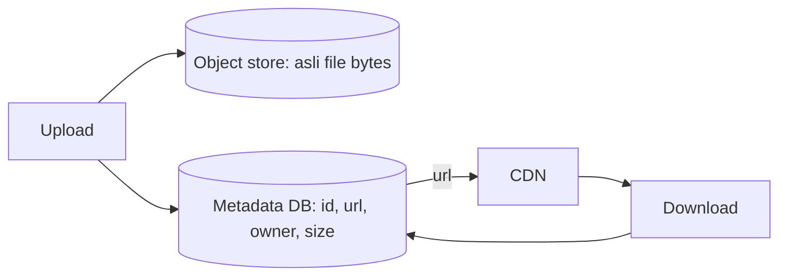
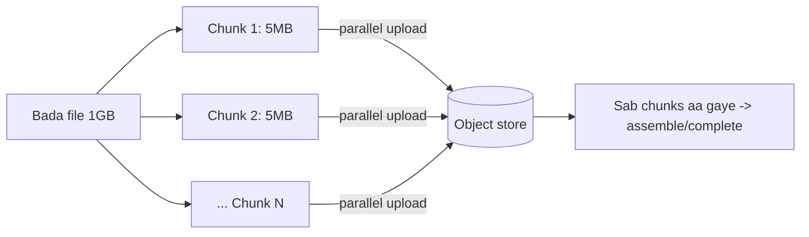
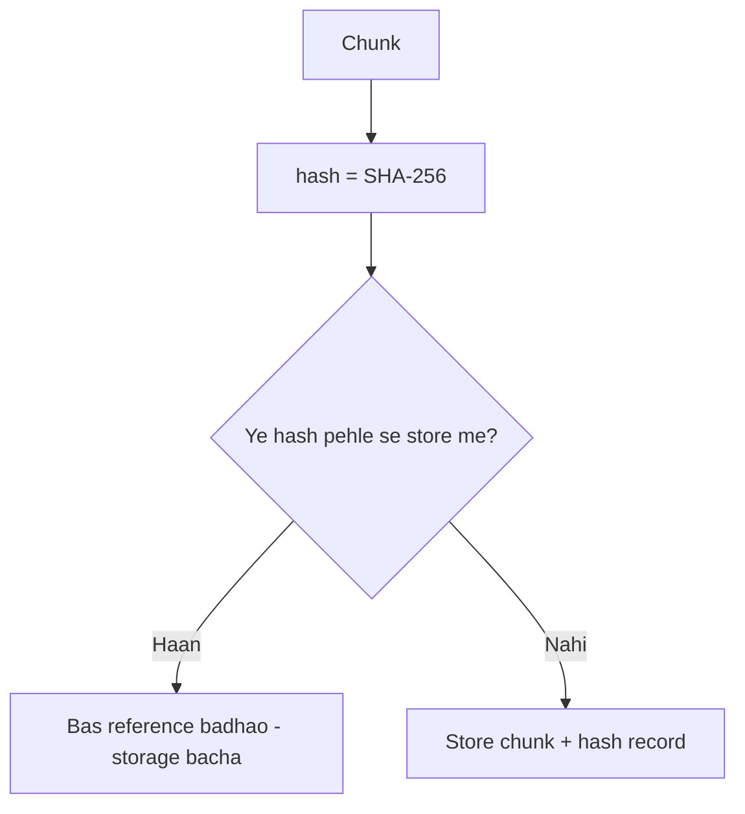
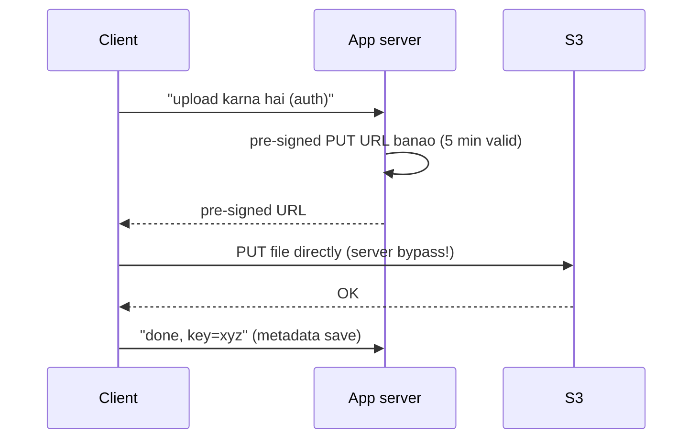
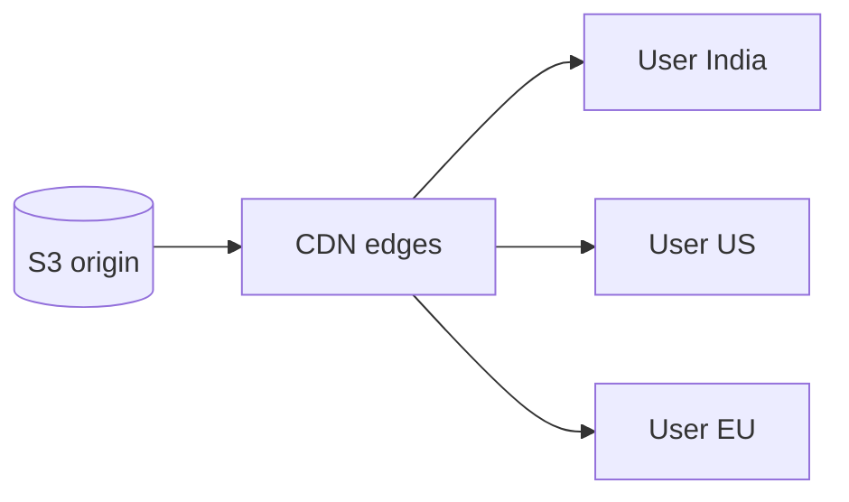
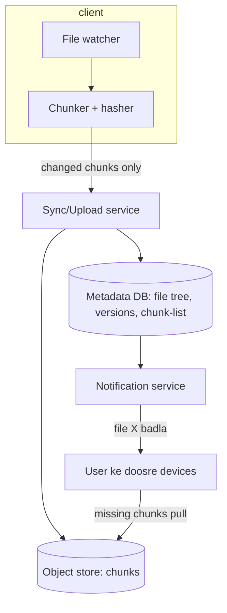

# 🗄️ Blob / Object Storage & Large File Systems (S3, Chunking, Dropbox)

> **Blob/Object storage** = bade unstructured files (images, videos, backups, PDFs, logs) ko store
> karne ka scalable tareeka — DB me nahi (DB ka kaam nahi), balki S3/GCS jaise object stores me.
> Ye file YouTube/Netflix (video), Instagram (photos), Dropbox/Google Drive (file sync) jaise designs
> ki backbone hai.

---

## 1. File DB me kyun nahi rakhte?

Ek 500MB video ko Postgres BLOB column me? **Nahi.**

| DB me file rakhne ke nuksaan | |
|---|---|
| **Bloat** | DB size phat jaata, backups/replication slow |
| **Mehnga** | DB storage/IOPS costly; object store bahut sasta |
| **No CDN** | File ko CDN se serve nahi kar sakte (DB se aana padega) |
| **Performance** | Bade blobs DB cache/buffers barbaad karte |

> **Rule:** **file object store me, metadata DB me.** DB me sirf `{file_id, name, size, s3_url,
> owner, created_at}` rakho — asli bytes S3 me.

---

## 2. Block vs File vs Object Storage

| | Block Storage | File Storage | Object Storage |
|---|---|---|---|
| Unit | Blocks (raw disk) | Files in folders (hierarchy) | Objects (flat, key→blob) |
| Access | OS/DB mounts it | NFS/SMB path | HTTP API (GET/PUT) |
| Scale | Limited (one volume) | Medium | **Practically infinite** |
| Metadata | Minimal | Basic (POSIX) | Rich, custom |
| Examples | AWS EBS, disks | NAS, NFS, EFS | **S3, GCS, Azure Blob** |
| Best for | DB, VM disks | Shared files | Web assets, media, backups, big data |

> **Object storage** = flat namespace (`bucket/key → bytes` + metadata), HTTP se access, infinitely
> scalable. Isi liye internet-scale apps isko use karti hain.

---

## 3. S3 jaisa Object Store andar se

- **Bucket** = top-level container; **Key** = object ka unique naam (`photos/2026/img.jpg`).
- **Flat, not folders** — `/` sirf naam ka hissa (UI folders dikhati par internally flat key).
- **Durability** — object kai disks/AZ pe replicate (S3 "11 nines" = 99.999999999% durability).
- **Immutability** — object aksar replace hota (versioning se purani copies bhi).
- **Storage classes** — hot (frequent), cold (Glacier, sasta par slow) — **lifecycle rules** se purana data
  auto cold me chala jaata (cost saving).

### Metadata index kaise scale karta?
Crores objects → key→location mapping ek distributed metadata store (jaise sharded DB / consistent
hashing) me. Object bytes alag storage nodes pe (replicated). Dekho [Consistent Hashing](../19_Consistent_Hashing.md).

---

## 4. ⭐ Large File Upload — Chunking / Multipart

500MB–5GB file ek HTTP request me? Network blip pe poora phir se? **Nahi.** File ko **chunks** me todo.

**Multipart upload ke faayde:**
- **Resumable** — chunk 3 fail hua? Sirf chunk 3 dobara, poora nahi. (Network-friendly)
- **Parallel** — chunks ek saath upload → tez.
- **Progress** — "60% done" dikha sakte.
- **Bade files** — single-request limit se bade files possible.

### Deduplication (Dropbox ka killer feature)
Har chunk ka **hash (SHA-256)** nikaalo. Wahi chunk pehle se store hai (kisi aur user ka same file)? To
dubara mat store karo — bas **reference** rakho.

> **Faayda:** same file 1000 users ke paas → ek hi baar storage. Bandwidth bhi bachti (client hash
> bhejta, "already hai" to upload hi nahi). Content-addressed storage.

---

## 5. ⭐ Pre-signed URLs — server ko bypass karo (zaroori pattern)

Client → app-server → S3 (server ke through bytes)? **Bura** — server bandwidth/CPU barbaad. Instead
app-server ek **pre-signed URL** deta (temporary, signed permission), client **seedha S3** se upload/download.

> **Faayda:** app-server sirf permission deta (chhota kaam), asli bytes client↔S3 (scalable). Download
> pe bhi same — pre-signed GET URL (private files ke liye). **Interview me ye bolna zaroori hai.**

---

## 6. Serving files fast — CDN

Bade/static files (images, video) **CDN** se serve karo, object store se seedha nahi:
- CDN edge pe cache → user ke paas, low latency, origin (S3) pe load kam.
- **Signed CDN URLs** for private content.
- Video: **adaptive bitrate streaming** (HLS/DASH) — video ko quality-levels + chunks me pre-encode,
  network ke hisaab se player quality switch karta. Dekho [CDN](../10_Content_Delivery_Network_CDN.md).

---

## 7. Design: "Dropbox / Google Drive" (file sync)

**Key ideas:**
- **Chunk + hash** → sirf **badle hue chunks** sync (delta sync) — bandwidth bachti (poori file nahi).
- **Metadata DB**: file tree, versions, har file ka chunk-list (hash order).
- **Deduplication** across users (same chunk ek baar).
- **Notification** service doosre devices ko "pull karo" bolti (long-poll/WebSocket — dekho [WebSockets](../WebSockets_and_Realtime.md)).
- **Versioning** — purani chunk-lists rakho → history/restore.
- **Conflict** (do device ek saath edit) → last-write-wins ya "conflicted copy" (dekho [Replication](../Database_Replication.md) conflict resolution).

---

## 8. Consistency in object stores
- Modern S3 = **strong read-after-write** for new objects (naya object turant readable).
- Overwrites/deletes historically **eventually consistent** (list me thodi der lag sakti).
- Design me maano: **object immutable** (naya version = nayi key) — updates avoid, overwrite ke bajaye new key + metadata pointer.

---

## ✅ / ❌ Trade-offs

**✅ Faayde**
- Practically infinite, sasta, durable (multi-AZ), CDN-friendly.
- Multipart = resumable/parallel bade uploads; dedup = storage/bandwidth saving.
- Pre-signed URLs = app-server bypass → scalable.

**❌ Challenges**
- **Not a DB** — no queries/joins/transactions (metadata DB alag).
- Eventual consistency (overwrite/list); latency (block storage se slow).
- Metadata store khud scale karna padta (crores objects).
- Small files ki bahut count → metadata overhead (chunking/packing).

---

## 🎤 Interview Q&A

**Q: File DB me kyun nahi?**
Bloat, mehnga, no CDN, DB cache barbaad. File → object store (S3), metadata → DB.

**Q: Block vs file vs object storage?**
Block = raw disk (DB/VM); file = folder hierarchy (NAS); object = flat key→blob HTTP API, infinite scale (S3) — media/web.

**Q: Bada file upload kaise?**
Multipart/chunking — chunks me todo, parallel + resumable (fail hua chunk hi dobara), progress possible.

**Q: Pre-signed URL kya, kyun?**
App-server temporary signed URL deta, client seedha S3 upload/download → server bandwidth bypass, scalable, private files safe.

**Q: Dropbox dedup kaise?**
Har chunk ka hash; same hash pehle se store → bas reference (storage + bandwidth bachi). Delta sync = sirf badle chunks.

**Q: File CDN se kyun serve karte?**
Edge cache → low latency + origin load kam; video ke liye adaptive bitrate (HLS/DASH).

**Q: Object store consistency?**
New object strong read-after-write; overwrite/list eventual — isi liye objects ko immutable (new version = new key) treat karo.

---

## Summary
- **File → object store (S3), metadata → DB.** Object storage = flat key→blob, HTTP, infinite/sasta/durable.
- **Multipart/chunking** = resumable + parallel bade uploads; **hash-based dedup + delta sync** = storage/bandwidth bachat (Dropbox).
- **Pre-signed URLs** = client seedha S3, app-server bypass (scalable + secure).
- **CDN** se serve (adaptive bitrate for video); objects **immutable** treat karo (eventual consistency).
- **Dropbox/Drive** = chunk+hash+dedup + metadata DB (file tree/versions) + notification-based multi-device sync.

> **Related:** [CDN](../10_Content_Delivery_Network_CDN.md) · [Consistent Hashing](../19_Consistent_Hashing.md) · [Database Replication](../Database_Replication.md) · [WebSockets & Real-time](../WebSockets_and_Realtime.md) · [Database Design Tips](../16_Database_Design_Tips.md)
