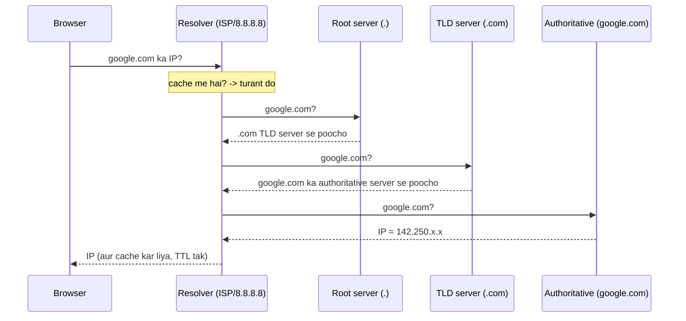
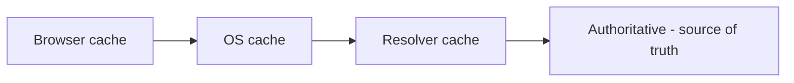
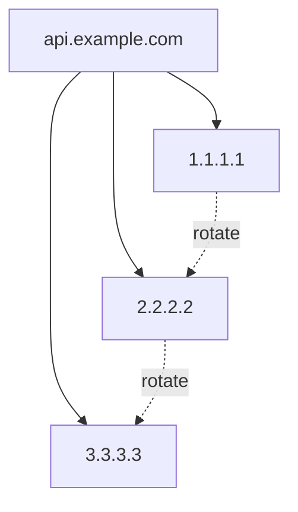
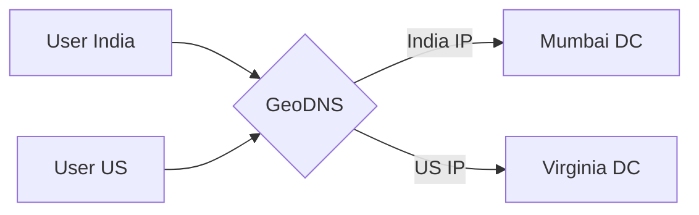
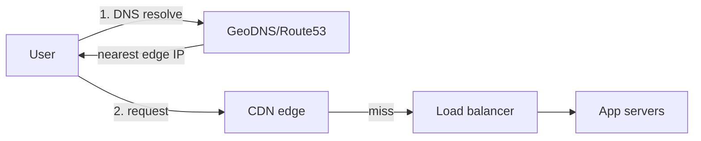

# 🌐 DNS Deep Dive — Resolution, GeoDNS, DNS Load Balancing

> **DNS (Domain Name System)** = internet ki **phonebook** — insaan-friendly naam (`google.com`) ko
> machine-friendly IP address (`142.250.x.x`) me badalta hai. Har request ka **sabse pehla step** yehi
> hota hai. DNS load balancing, failover, GeoDNS, CDN routing — sab isi ke upar bante hain, isi liye
> system design me DNS samajhna zaroori.

---

## 1. Kyun? — naam yaad rakhna aasaan, IP nahi

Insaan `youtube.com` yaad rakhta, `142.250.183.110` nahi. Plus IP badalti rehti (servers move,
scale) — naam same rehta. DNS = naam → IP ka **dynamic mapping**.

---

## 2. DNS Resolution — poora flow (browser me URL type karne par)

### Players
| Server | Kaam |
|---|---|
| **Recursive Resolver** | Tumhare liye poori khoj karta (ISP ka, ya 8.8.8.8/1.1.1.1). Cache rakhta. |
| **Root server** | 13 root (logical) — "`.com` kahan hai" batata |
| **TLD server** | `.com`, `.org`, `.in` — "`google.com` ka authoritative kaun" batata |
| **Authoritative server** | Domain ka asli maalik — final IP deta |

> **Recursive vs Iterative:** resolver **recursively** answer laata hai (tum ek baar poochte, wo saara
> chakkar khud lagata); root/TLD **iteratively** "agle se poocho" bolते hain.

---

## 3. Caching & TTL — DNS ki jaan

Har baar poora chakkar? Nahi — har level pe **cache**. Har DNS record ke saath **TTL** (Time To Live)
hota hai — kitni der cache karein.

- **Chhota TTL (60s):** IP badle to jaldi propagate (failover/migration me achha), par zyada DNS traffic.
- **Bada TTL (24h):** kam DNS load, par change slow propagate.

> **Trade-off:** migration/failover se pehle TTL **kam** kar do (taaki naya IP jaldi phaile), phir baad
> me badha do. "DNS propagation delay" isi TTL/cache ki wajah se hota hai.

---

## 4. Common DNS Record Types

| Record | Kaam |
|---|---|
| **A** | Naam → IPv4 |
| **AAAA** | Naam → IPv6 |
| **CNAME** | Alias (ek naam doosre naam pe point) — `www` → `example.com` |
| **MX** | Mail server (email kahan bheje) |
| **NS** | Domain ke authoritative name servers |
| **TXT** | Arbitrary text (SPF/DKIM email verify, domain ownership) |
| **PTR** | Reverse — IP → naam |
| **SOA** | Zone ki authority info (TTL defaults, serial) |

> **CNAME vs A:** CNAME ek naam ko doosre naam pe bhejta (indirection — CDN/SaaS aksar CNAME dete
> taaki apni IP change kar saken bina tumhe update kiye). Root domain (`example.com`) pe CNAME allowed
> nahi (uske liye A / "ALIAS/ANAME").

---

## 5. ⭐ DNS-based Load Balancing & Traffic Routing

DNS sirf ek IP nahi, **kai IPs** ya **smart IP** de sakta hai → ye load balancing ka pehla layer ban jaata.

### (a) Round-Robin DNS
Ek naam ke liye kai A records; resolver har baar order rotate karta → clients alag-alag servers pe.
- ✅ Simple, free load spread.
- ❌ No health awareness (dead server ka IP bhi de deta), caching se uneven, session-stickiness nahi.

### (b) GeoDNS (Geo-routing) — user ke paas ka server
Resolver ki location dekhkar **nearest** data-center ka IP do:

- Lower latency (paas ka server), data residency (data desh me rahe), CDN edge routing ka core.

### (c) Latency-based / Weighted / Failover routing
| Policy | Kaam |
|---|---|
| **Latency-based** | Jis DC se user ko kam latency, wahi IP |
| **Weighted** | Traffic % baanto (jaise 90% v1, 10% v2 — canary) |
| **Failover** | Primary down (health check fail) → secondary ka IP |
| **Geolocation** | User ke desh/region ke hisaab se |

> **Health-checked DNS failover:** managed DNS (Route 53, Cloudflare) endpoints ko health-check karta;
> primary mare to us record ko response se hata deta → **automatic failover** at DNS layer.

---

## 6. Anycast — ek IP, kai jagah

**Anycast** = **same IP** duniya bhar ke kai servers pe advertise; internet routing (BGP) user ko
**nearest** copy pe bhej deta. Root DNS servers aur CDN/DDoS-protection isi pe chalte.

- Low latency (nearest node), automatic failover (node mare → routing agle nearest pe), DDoS absorb
  (attack kai nodes me bikhar jaata). Dekho [CDN](../10_Content_Delivery_Network_CDN.md).

---

## 7. DNS aur Security

| Threat / Feature | Baat |
|---|---|
| **DNS Spoofing / Cache Poisoning** | Attacker fake record cache me daal de → user galat (malicious) IP pe |
| **DNSSEC** | Records ko cryptographically sign karta → tampering detect (authenticity) |
| **DDoS on DNS** | DNS down = poora site down (SPOF!) → anycast + multiple providers |
| **DNS over HTTPS/TLS (DoH/DoT)** | DNS queries encrypt (privacy — ISP dekh nahi sakta) |

> **DNS ek SPOF ban sakta hai:** DNS provider down → naam resolve nahi → site "down" (chahe servers
> zinda ho). Isi liye bade players **do DNS providers** use karte (redundancy). Dekho [Avoid SPOF](../17_Avoid_Single_Point_of_Failure.md).

---

## 8. DNS in System Design (kahan aata hai)

- **Entry point:** har request DNS se shuru → yehi pehla routing decision (kaunsa region/CDN edge).
- **CDN + DNS:** CDN aksar DNS (CNAME + anycast + GeoDNS) se hi user ko nearest edge pe bhejta.
- **Global load balancing:** multi-region me DNS (GeoDNS/latency-based) top-level LB ka kaam karta,
  phir region ke andar L4/L7 LB (dekho [Load Balancer](../03_Load_Balancer_Types_and_Algorithms.md)).

---

## ✅ / ❌ DNS load balancing trade-offs

**✅ Faayde**
- Zero extra infra (DNS waise bhi chahiye), global routing, GeoDNS se low latency, DNS failover.

**❌ Limitations**
- **Caching/TTL delay** — change turant nahi (client purana IP cache kiye baith sakta).
- **No fine-grained balancing** — DNS ko real server load nahi pata (round-robin blind).
- Client resolver behavior control me nahi. Isi liye DNS = **coarse** (region-level) routing; **fine**
  balancing L4/L7 LB karta.

---

## 🎤 Interview Q&A

**Q: DNS resolution ka flow?**
Browser → recursive resolver → root → TLD (.com) → authoritative → IP; har jagah cache + TTL.

**Q: TTL ka trade-off?**
Chhota = change jaldi propagate (failover achha) par zyada DNS load; bada = kam load par slow change. Migration se pehle TTL ghatao.

**Q: CNAME vs A record?**
A = naam→IP; CNAME = naam→doosra naam (alias/indirection). Root domain pe CNAME allowed nahi.

**Q: DNS load balancing kaise?**
Round-robin (kai A records), GeoDNS (nearest DC), latency/weighted/failover policies (managed DNS + health checks).

**Q: Anycast kya?**
Same IP kai jagah advertise; BGP user ko nearest pe bhejta → low latency, failover, DDoS absorb (CDN/root DNS).

**Q: DNS SPOF kaise banta, bachaav?**
DNS provider down → naam resolve nahi → site down; bachaav = multiple DNS providers + anycast.

**Q: DNS ki limitation load balancing me?**
Caching/TTL se change slow, server load ka pata nahi (blind) → coarse routing; fine balancing L4/L7 LB.

**Q: DNSSEC?**
Records ko sign karke authenticity verify — cache poisoning/spoofing se bachaav.

---

## Summary
- **DNS** = naam→IP phonebook; resolution: resolver → root → TLD → authoritative, har level pe cache + **TTL**.
- **Records:** A/AAAA (IP), CNAME (alias), MX (mail), NS, TXT, etc.
- **DNS load balancing:** round-robin, **GeoDNS** (nearest DC), latency/weighted/failover — coarse global routing (fine balancing LB karta).
- **Anycast** = ek IP kai jagah (nearest, failover, DDoS absorb); **DNSSEC/DoH** security.
- DNS ek **SPOF** ban sakta → multiple providers; system me har request ka **pehla step**.

> **Related:** [CDN](../10_Content_Delivery_Network_CDN.md) · [Load Balancer Types](../03_Load_Balancer_Types_and_Algorithms.md) · [Avoid SPOF](../17_Avoid_Single_Point_of_Failure.md) · [SSL Certificate](../14_SSL_Certificate.md) · [Service Discovery](./10_Service_Discovery_and_Service_Mesh.md)
