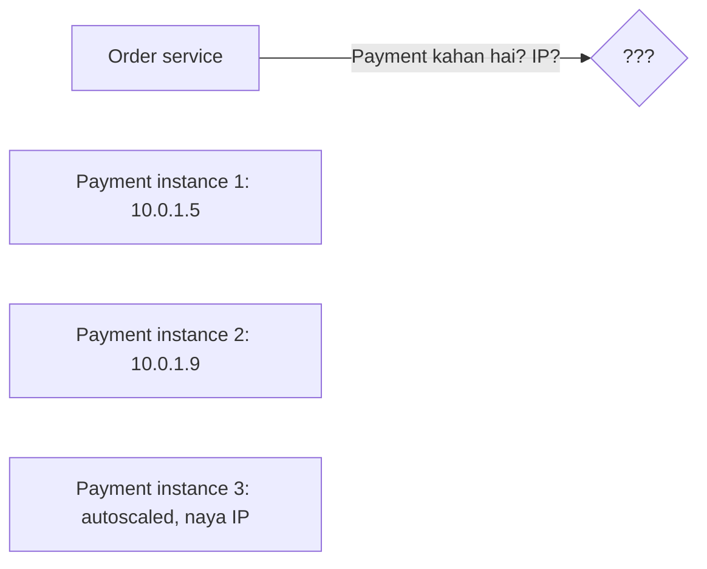
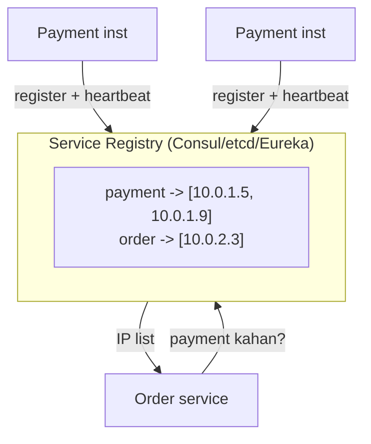
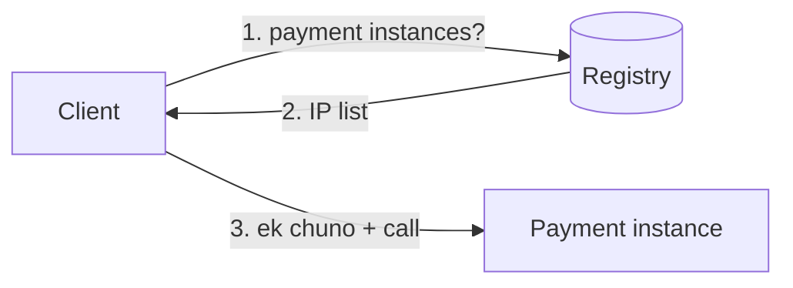
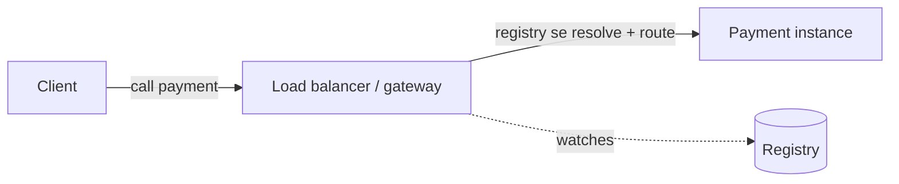
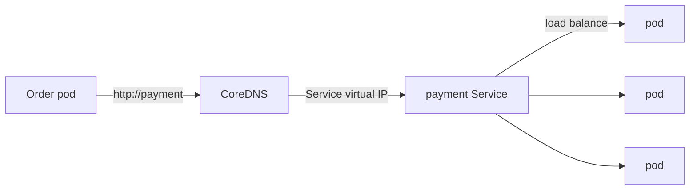
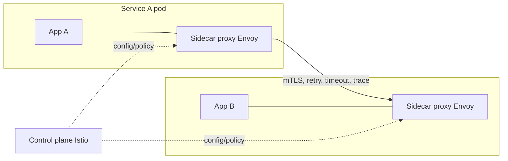
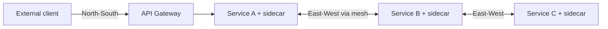

# 🧭 Service Discovery & Service Mesh

> **Service Discovery** = microservices ek doosre ko **dhoondhein kaise** — jab har service ke kai
> instances ho, IP/port badalte rahein (autoscaling, deploys, crashes), to "Order service kahan chal
> rahi hai?" ka jawaab dynamically dena. **Service Mesh** iske aage: services ke beech ka saara
> networking (discovery + retries + security + observability) ko application code se bahar nikaal deta.

---

## 1. Problem — IP hardcode nahi kar sakte

Monolith me ek process ke andar function call. Microservices me network call — par IP kya?

- Instances **aate-jaate** rehte (autoscale, crash, redeploy) → IP fixed nahi.
- Hardcoded IP/config = har change pe redeploy, dead instance pe calls.
- Chahiye: ek **dynamic registry** — "Payment service abhi in IPs pe zinda hai."

---

## 2. Service Registry — sab ka pata ek jagah

**Service Registry** ek database hai: `service name → healthy instances (IP:port)`. Instances khud ko
register karte, health-check dete; registry stale hataata.

- **Registration:** instance start pe khud ko register (self-registration), ya orchestrator karta (third-party).
- **Health check:** registry periodically ping karta (`/health`); fail → registry se hataao.
- **Deregistration:** graceful shutdown pe khud hat jaaye, ya heartbeat miss pe expire.

Tools: **Consul, etcd, Zookeeper, Eureka** (Netflix), Kubernetes ka built-in (etcd + kube-dns).

---

## 3. Client-side vs Server-side Discovery

### Client-side discovery
Client registry se instance list leta, **khud** ek chun leta (load balancing client me).

- ✅ Ek network hop kam (koi beech ka LB nahi), client smart LB kar sakta.
- ❌ Har client me discovery+LB logic (har language me). (Netflix Eureka + Ribbon.)

### Server-side discovery
Client bas ek **load balancer / gateway** ko call karta; wahi registry dekhkar route karta.

- ✅ Client simple (bas ek URL), LB logic ek jagah. (Kubernetes Service, AWS ELB.)
- ❌ Ek extra hop, LB ek component (redundant banao).

| | Client-side | Server-side |
|---|---|---|
| LB logic | Client me | LB/gateway me |
| Hops | Kam (direct) | Ek extra |
| Client complexity | Zyada | Kam |
| Example | Eureka+Ribbon | K8s Service, ELB |

---

## 4. Kubernetes me kaise (most common aaj)

K8s me service discovery **built-in**:
- **etcd** = registry (saara cluster state).
- **Service** object = ek **stable virtual name + IP** jo peeche ke badalte pods ko point karta.
- **kube-dns/CoreDNS** = `payment.default.svc.cluster.local` naam → Service IP resolve.
- **kube-proxy** = us Service IP ko healthy pods pe load-balance karta.

> Isi liye K8s me tum bas `http://payment` call karte ho — IP/scaling/health K8s handle karta.

---

## 5. Service Mesh — networking ko code se bahar nikaalo

Jaise-jaise services badhte, har service ko chahiye: discovery, load balancing, **retries, timeouts,
circuit breaking, mTLS encryption, tracing, metrics**. Ye sab har service ke code me likhna (har
language me) = duplication + inconsistency. **Service Mesh** ise **infra layer** me le jaata hai.

### Sidecar pattern
Har service ke saath ek **proxy (sidecar, jaise Envoy)** deploy hota. Service ka **saara** network
traffic sidecar se guzarta — sidecar hi discovery, retries, mTLS, metrics sab karta. Application code
ko pata bhi nahi.

### Data plane vs Control plane
| Plane | Kya | Example |
|---|---|---|
| **Data plane** | Sidecar proxies jo asli traffic handle karte | Envoy, Linkerd-proxy |
| **Control plane** | Proxies ko config/policy deta (central brain) | Istio, Linkerd, Consul Connect |

### Service mesh kya deta (free, code change ke bina)
- **Traffic management** — discovery, LB, retries, timeouts, circuit breaking (dekho [Resilience](./07_Resilience_and_Fault_Tolerance.md)).
- **Security** — automatic **mTLS** (service-to-service encryption + identity), authz policies (zero-trust).
- **Observability** — automatic metrics, distributed tracing, logs (dekho [Observability](./02_Observability_Monitoring_Logging_Tracing.md)).
- **Deployment** — canary/traffic-splitting (dekho [Deployment Strategies](./11_Deployment_Strategies_and_CICD.md)).

---

## 6. API Gateway vs Service Mesh (confusion clear)

| | API Gateway | Service Mesh |
|---|---|---|
| Traffic | **North-South** (bahar→andar, client→system) | **East-West** (andar→andar, service→service) |
| Kaam | Auth, rate limit, routing, aggregation for **external** clients | Discovery, mTLS, retries, observability **between** services |
| Kahan | System ke edge/entry | Har service ke bagal (sidecar) |

> Bade systems me **dono** hote hain: gateway edge pe (dekho [API Gateway](../02_API_Gateway_and_Load_Balancer.md)), mesh andar service-to-service.

---

## ✅ / ❌ Trade-offs

**Service Discovery ✅**
- Dynamic (instances aate-jaate), health-aware routing, autoscaling-friendly.

**Service Mesh ✅**
- Networking concerns (retry/mTLS/observability) code se bahar, har service ko uniform, polyglot-friendly.

**❌ Challenges**
- Registry ek critical component (HA banao — consensus-backed, dekho [Consensus](./01_Consensus_Algorithms.md)).
- Stale entries (health-check lag) → dead instance pe kuch calls.
- **Service mesh = extra complexity + latency** (har call sidecar se) + resource overhead (har pod me proxy). Chhote systems ke liye over-kill — jab bahut services ho tabhi worth it.

---

## 🎤 Interview Q&A

**Q: Service discovery kyun chahiye?**
Instances ke IP dynamic (autoscale/crash/deploy) — hardcode nahi kar sakte; registry se "service X abhi kahan zinda" pata chalta.

**Q: Service registry kaise fresh rehta?**
Instances register + heartbeat; registry health-check karta, fail/expire pe hataata.

**Q: Client-side vs server-side discovery?**
Client-side: client registry se list leke khud LB (ek hop kam, client complex). Server-side: LB/gateway resolve+route (client simple, ek extra hop). K8s Service = server-side.

**Q: Kubernetes discovery?**
etcd registry + Service (stable virtual IP) + CoreDNS (naam resolve) + kube-proxy (LB to pods). Bas `http://service-name`.

**Q: Service mesh kya, kaise (sidecar)?**
Har service ke saath Envoy sidecar; saara traffic usse hoke → discovery/retry/mTLS/tracing infra me, code change nahi. Data plane (proxies) + control plane (Istio).

**Q: API gateway vs service mesh?**
Gateway = north-south (external client→system, auth/rate-limit); mesh = east-west (service↔service, mTLS/retry/observability). Bade systems me dono.

**Q: Service mesh kab avoid?**
Chhote systems — extra latency/complexity/resource; jab services + cross-cutting needs badh jaayein tab.

---

## Summary
- **Service Discovery** = dynamic "service X kahan zinda" via **registry** (Consul/etcd/Eureka) + health checks.
- **Client-side** (client LB, direct) vs **server-side** (LB/gateway routes); K8s = Service + CoreDNS + kube-proxy.
- **Service Mesh** = sidecar (Envoy) har service ke saath → discovery + retries + timeouts + **mTLS** + observability infra me (code se bahar); **data plane** (proxies) + **control plane** (Istio/Linkerd).
- **API Gateway** = north-south (edge); **Service Mesh** = east-west (internal). Mesh = power + complexity, bade systems me.

> **Related:** [API Gateway & Load Balancer](../02_API_Gateway_and_Load_Balancer.md) · [Consensus Algorithms](./01_Consensus_Algorithms.md) · [Resilience & Fault Tolerance](./07_Resilience_and_Fault_Tolerance.md) · [Observability](./02_Observability_Monitoring_Logging_Tracing.md) · [Monolithic vs Microservices](../01_Monolithic_and_Microservices.md)
