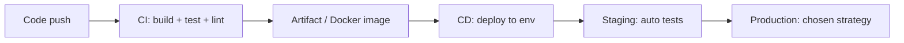
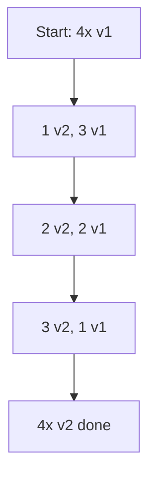
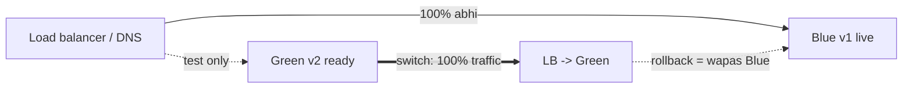
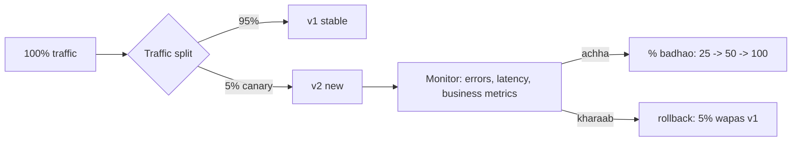
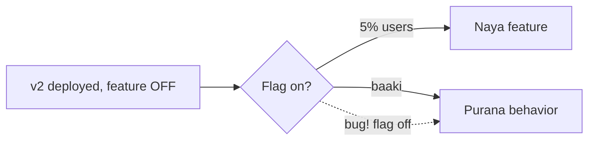
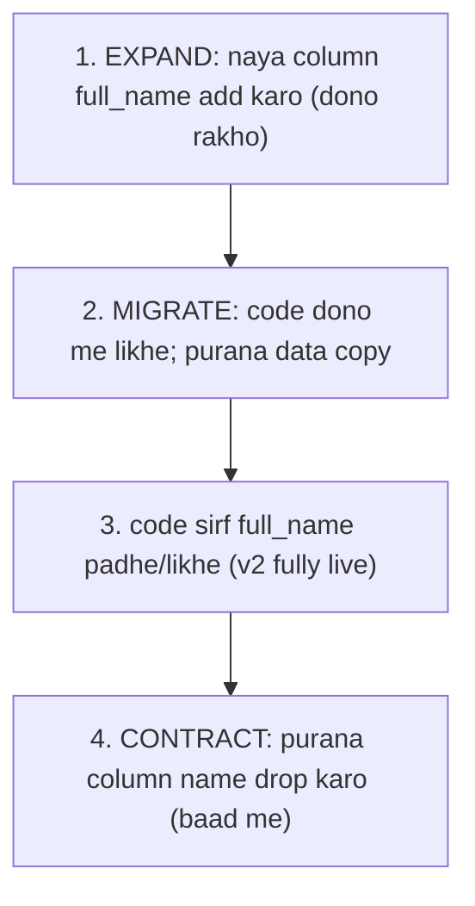
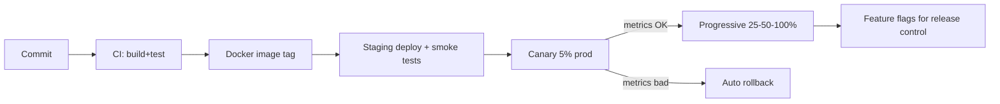

# 🚀 Deployment Strategies & CI/CD — Blue-Green, Canary, Rolling, Feature Flags

> **Deployment strategy** = naya code production me kaise le jaayein taaki **users ko downtime na ho**
> aur agar bug ho to **jaldi wapas** aa sakein. **CI/CD** = code ko commit se production tak automate
> karna. System design me ye "reliability + velocity dono kaise" ka jawaab hai — kharaab deploy hi
> outages ka #1 kaaran hota hai.

---

## 1. CI/CD — pehle base samajh lo

| Term | Full | Matlab |
|---|---|---|
| **CI** | Continuous **Integration** | Har commit pe auto build + test → bugs jaldi pakdo, `main` hamesha green |
| **CD** | Continuous **Delivery** | Har green build **deployable**; production push ek button/approval |
| **CD** | Continuous **Deployment** | Wahi, par production tak **fully automatic** (no manual button) |

> **CI ki jaan:** har change automatically test ho → integration problems chhoti + jaldi pakdi jaayein
> ("merge hell" nahi). CD ki jaan: release **boring/routine** ban jaaye (chhote, frequent, safe).

---

## 2. Deployment strategies — overview

Problem: v1 chal raha, v2 laana hai. Kaise switch karein?

| Strategy | Downtime | Rollback | Risk | Cost |
|---|---|---|---|---|
| **Recreate** | ❌ Haan (v1 band, v2 start) | Slow | High | Sasta |
| **Rolling** | ✅ No | Medium | Medium | Sasta |
| **Blue-Green** | ✅ No | ⚡ Instant | Low | Mehnga (2x infra) |
| **Canary** | ✅ No | ⚡ Fast | ⚡ Lowest | Medium |

---

## 3. Recreate (naive) — mat karo production me
v1 band → v2 start. Beech me **downtime**. Sirf dev/non-critical ke liye.

---

## 4. Rolling Deployment — thoda-thoda replace

Instances ko **batch me** ek-ek/kuch-kuch karke v2 se replace karo. Kuch v1, kuch v2 saath chalte hain
transition me.

- ✅ No downtime, extra infra nahi (same pool me replace), K8s ka default.
- ❌ Rollback slow (wapas rolling karna); transition me **do versions saath** → backward-compatible
  hona zaroori (API + DB dono).

---

## 5. ⭐ Blue-Green Deployment — instant switch & rollback

Do **poore identical** environments: **Blue** (abhi live), **Green** (naya v2). Green ready + tested →
load balancer/DNS **poora traffic** Green pe switch. Bug aaya? → turant wapas Blue.

- ✅ **Zero downtime**, **instant rollback** (bas traffic wapas Blue pe — Blue chalu rehta thodi der).
  Green pe production-jaisa test switch se pehle.
- ❌ **2x infra** (dono environments chahiye) → mehnga. **DB migration** dono versions ke saath chalni
  chahiye (shared DB) — ye asli challenge.

---

## 6. ⭐ Canary Deployment — sabse safe

Naya v2 pehle **thode users** (jaise 1-5%) ko do, **metrics dekho** (error rate, latency). Sab theek →
dheere-dheere % badhao (5→25→50→100). Kharaab → us 5% ko wapas v1, blast radius chhota.

- ✅ **Lowest risk** — bug sirf chhote % ko affect; real production traffic pe test; automated (metrics
  se auto-promote/rollback).
- ❌ Complex (traffic splitting + strong monitoring chahiye — dekho [Observability](./02_Observability_Monitoring_Logging_Tracing.md));
  dono versions saath (backward compat).

> **Canary vs Blue-Green:** Blue-Green = **100% ek saath** switch (fast, par sabko ek saath risk).
> Canary = **gradual %** (safest, par slow + monitoring-heavy). Bade risk-averse systems canary use karte.

---

## 7. Feature Flags (Feature Toggles) — deploy ≠ release

Code deploy karo par feature **flag ke peeche** (band). Chahe jab flag on karke **release** karo — bina
naye deploy ke. Deploy aur release ko **alag** kar deta.

- ✅ **Instant kill switch** (bug → flag off, no rollback deploy), gradual rollout (% users),
  **A/B testing**, "dark launch" (code live but hidden), trunk-based dev (incomplete feature flag ke peeche merge).
- ❌ **Flag debt** (purane flags hataao warna code me `if` ka jungle), testing combinations badh jaati.
- Tools: LaunchDarkly, Unleash, ya khud ka config service.

---

## 8. ⭐ Database migrations — deployment ka sabse tricky part

Zero-downtime deploys ka **asli** challenge code nahi, **DB schema** hai. Transition me **do code
versions** (v1, v2) **ek hi DB** pe chalte hain — schema dono ke saath compatible hona chahiye.

### Expand-Contract (Parallel Change) pattern
Column rename `name` → `full_name` ko safe karne ke liye **kabhi ek saath mat** karo:

1. **Expand** — naya column add (purana bhi rakho); backward-compatible.
2. **Migrate** — code dono columns me likhe; purana data backfill.
3. **Switch** — sab v2, sirf naya column use.
4. **Contract** — purana column baad me (jab koi v1 nahi) drop.

> **Golden rule:** schema changes **backward-compatible** rakho. Additive (add column/table) safe;
> destructive (drop/rename) ko multi-step expand-contract me todo. Warna rollback pe purana code naye
> schema pe crash karega.

---

## 9. Rollback vs Roll-forward
- **Rollback** — pichle stable version pe wapas (fast, jab naya version toota).
- **Roll-forward** — aage ek fix deploy (jab rollback mushkil, jaise DB already migrated).
- **Immutable deployments** (naya image, purana untouched) rollback ko trivial banate.

---

## 10. Full picture: modern pipeline

---

## ✅ Best Practices

- **CI:** har commit test; `main` hamesha releasable; small frequent changes.
- **Zero-downtime:** rolling/blue-green/canary — never recreate in prod.
- **Canary + automated metric gates** for risky changes.
- **Feature flags** — deploy ≠ release, instant kill switch.
- **Backward-compatible DB migrations** (expand-contract).
- **Immutable, versioned artifacts** → easy rollback.
- **Automate rollback** on SLO breach.

---

## 🎤 Interview Q&A

**Q: Blue-green vs canary?**
Blue-green = 100% ek saath naye env pe switch (instant rollback, 2x infra). Canary = gradual % (safest, blast radius chhota, monitoring-heavy).

**Q: Rolling deployment downside?**
Rollback slow + transition me do versions saath → backward-compatible code + schema zaroori.

**Q: Zero-downtime deploy ka sabse bada challenge?**
DB schema migration — do code versions ek DB pe; expand-contract (additive pehle, destructive baad me).

**Q: Feature flag kya deta?**
Deploy ko release se alag; instant kill switch (bug→off, no redeploy), gradual rollout, A/B test, dark launch.

**Q: CI vs CD?**
CI = har commit auto build+test (integrate early). CD = green build deployable (delivery) / auto-to-prod (deployment).

**Q: Canary me kya monitor karte, decision kaise?**
Error rate, latency (p99), business metrics; threshold theek → % badhao, breach → auto rollback.

**Q: Column rename safely kaise?**
Expand-contract: naya column add → dono me likho + backfill → v2 read/write naya → purana column baad me drop.

**Q: Rollback vs roll-forward?**
Rollback = pichle version pe (fast); roll-forward = fix aage deploy (jab rollback mushkil, e.g. DB migrated).

---

## Summary
- **CI/CD** = commit→prod automate; CI har commit test, CD deployable/auto-deploy.
- **Rolling** (batch replace, no extra infra), **Blue-Green** (2 env, instant switch + rollback, 2x cost), **Canary** (gradual %, safest, monitoring-driven) — production me kabhi **recreate** nahi.
- **Feature flags** = deploy ≠ release, instant kill switch + gradual rollout + A/B.
- **Zero-downtime ka asli challenge = DB migrations**: backward-compatible **expand-contract**.
- **Immutable artifacts + automated rollback** on metric breach.

> **Related:** [Resilience & Fault Tolerance](./07_Resilience_and_Fault_Tolerance.md) · [Observability](./02_Observability_Monitoring_Logging_Tracing.md) · [Service Discovery & Mesh](./10_Service_Discovery_and_Service_Mesh.md) · [Monolithic vs Microservices](../01_Monolithic_and_Microservices.md) · [Database Replication](../Database_Replication.md)
